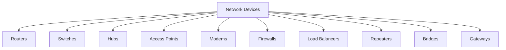
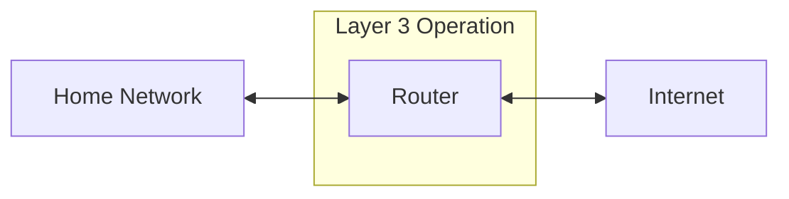
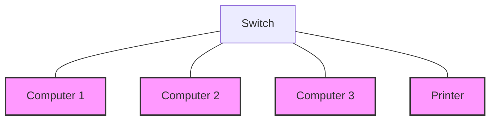
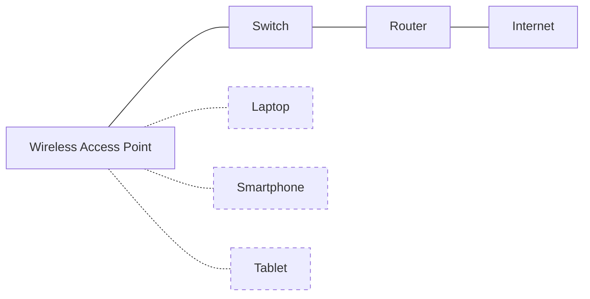

# Day 1: Introduction to Network Devices

## Topics Covered
- Introduction to Network Devices (Part 1)
- Introduction to Network Devices (Part 2)

## 1. Network Devices Overview

Network devices are the physical components that facilitate communication and data transfer in a computer network. Understanding these devices and their functions is fundamental to grasping how networks operate.

### Key Network Devices



## 2. In-depth Look at Network Devices

### Router
A router is a networking device that forwards data packets between computer networks. They operate at Layer 3 (Network Layer) of the OSI model.



**Functions:**
- Connects different networks together
- Determines the best path for data to travel
- Manages traffic between networks
- Provides NAT (Network Address Translation) services

**Example Configuration (Cisco IOS):**
```
Router> enable
Router# configure terminal
Router(config)# interface GigabitEthernet0/0
Router(config-if)# ip address 192.168.1.1 255.255.255.0
Router(config-if)# no shutdown
Router(config-if)# exit
Router(config)# ip route 0.0.0.0 0.0.0.0 203.0.113.1
```

### Switch
Switches operate at Layer 2 (Data Link Layer) of the OSI model and connect devices within the same network.



**Functions:**
- Creates a star topology for LAN connections
- Uses MAC addresses to forward data
- Isolates collision domains
- Provides dedicated bandwidth to each connected device

**Example Configuration (Cisco IOS):**
```
Switch> enable
Switch# configure terminal
Switch(config)# interface vlan 1
Switch(config-if)# ip address 192.168.1.2 255.255.255.0
Switch(config-if)# no shutdown
Switch(config-if)# exit
Switch(config)# ip default-gateway 192.168.1.1
```

### Hub (Legacy Device)
Hubs are older network devices that operate at Layer 1 (Physical Layer) and simply repeat incoming signals to all connected ports.

**Limitations:**
- Creates a single collision domain
- No traffic filtering capabilities
- Inefficient use of bandwidth
- Largely replaced by switches

### Access Point
Wireless Access Points (WAPs) allow wireless devices to connect to a wired network.



**Functions:**
- Converts data between wireless and wired formats
- Extends network coverage
- Provides security through encryption (WPA2/WPA3)
- Manages wireless connections

## 3. Network Device Selection Considerations

When selecting network devices for deployment, consider:

1. **Network Size**: The number of users and devices that will connect
2. **Bandwidth Requirements**: The amount of data transfer needed
3. **Security Needs**: Security features required for your environment
4. **Scalability**: Future growth potential
5. **Budget Constraints**: Cost vs. capabilities tradeoff
6. **Management Capabilities**: Ease of configuration and monitoring

## Additional Resources

- [Cisco Networking Basics](https://www.cisco.com/c/en/us/solutions/small-business/resource-center/networking/networking-basics.html)
- [CompTIA Network+ Certification](https://www.comptia.org/certifications/network)

## Practice Questions

1. What OSI layer does a router operate at, and what is its primary function?
2. Compare and contrast switches and hubs. Why have switches largely replaced hubs?
3. Draw a simple network diagram showing how routers, switches, and access points might be deployed in a small office network.
