 # Day 1: Introduction to Computer Networking

## 1. What is Computer Networking?

Computer networking is the practice of connecting computing devices together to share resources and communicate with each other. These connections can be wired (using cables) or wireless (using radio waves).

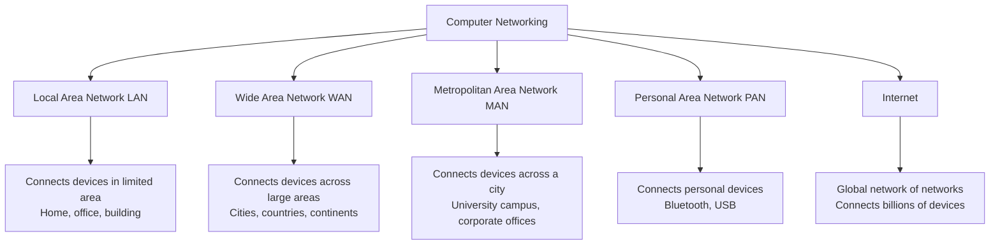

### Key Components of Computer Networks:

1. **Nodes**: Any device connected to a network (computers, servers, routers, switches, etc.)
2. **Connections**: Physical media (cables, fiber optics) or wireless signals
3. **Protocols**: Rules that govern how data is transmitted across a network (TCP/IP, HTTP, FTP, etc.)
4. **Network Devices**: Hardware that facilitates communication (routers, switches, modems, etc.)

*A Cisco network switch, one of the key devices in computer networking. Source: Wikipedia*

### Why Computer Networks Matter:

- **Resource Sharing**: Networks allow sharing of resources like printers, storage, and computing power
- **Communication**: Enable different forms of communication (email, messaging, video calls)
- **Information Distribution**: Make information accessible to users anywhere in the network
- **Business Operations**: Support critical business functions and global operations
- **Entertainment**: Deliver streaming media, online gaming, and social networking

*Different types of computer networks and their interconnections. Source: Wikipedia*

## 2. History of Computer Networking: ARPA and the Birth of the Internet

The history of modern computer networking is deeply intertwined with Cold War competition between superpowers and the need for resilient military communications.

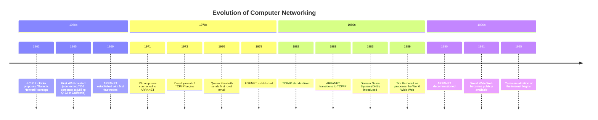

### The ARPA Program and Cold War Competition

In the late 1950s, the United States was in the midst of the Cold War with the Soviet Union. When the Soviet Union launched Sputnik in 1957, it created a sense of urgency in American scientific and military circles.

*A replica of Sputnik 1, the first artificial Earth satellite, launched by the Soviet Union in 1957. Source: Wikipedia*

The **Advanced Research Projects Agency (ARPA)**, now known as DARPA, was established in 1958 by President Eisenhower's administration as a direct response to Sputnik. Its purpose was to ensure U.S. technological superiority, particularly in areas relevant to defense.

### Birth of ARPANET

Key developments in the creation of the first computer network included:

1. **J.C.R. Licklider's Vision**: In 1962, Licklider, who headed ARPA's Information Processing Techniques Office, envisioned a globally interconnected set of computers through which everyone could access data and programs from any site.

2. **Packet Switching**: Paul Baran at RAND Corporation and Donald Davies at the UK's National Physical Laboratory independently developed the concept of packet switching, which became fundamental to network design.

3. **First Implementation**: In 1969, the first ARPANET link was established between the University of California, Los Angeles (UCLA) and the Stanford Research Institute (SRI).

4. **Network Growth**: By the end of 1969, four computers were connected to the ARPANET, creating the first operational packet-switched network.

### Key Innovations and Evolution

1. **Network Control Protocol (NCP)**: The first host-to-host protocol used on ARPANET from 1970 to 1983.

2. **TCP/IP Development**: In 1973, Vinton Cerf and Robert Kahn began developing the Transmission Control Protocol (TCP) and Internet Protocol (IP), which became the standard for internet communications.

*Internet pioneers including Vinton Cerf (second from left) and Robert Kahn (center). Source: Wikipedia*

3. **Email**: In 1971, Ray Tomlinson developed the first email program and established the "@" symbol convention for addressing.

4. **From Military to Academic**: Initially funded for military purposes, ARPANET gradually expanded to connect university and research institutions.

*Logical map of ARPANET in March 1977, showing how it had expanded from the original four nodes. Source: Wikipedia*

5. **Transition to the Internet**: As technology evolved and more networks were developed, ARPANET transitioned into what we now know as the Internet.

*A geographical map of ARPANET in 1973 showing connections between research institutions across the United States. Source: Wikipedia*

### Legacy and Impact

The ARPANET project, born out of Cold War competition, laid the foundation for the modern Internet. Its distributed architecture, designed to withstand nuclear attacks, provided the resilience that characterizes today's global network.

The story of ARPANET demonstrates how military research projects can lead to transformative civilian technologies, revolutionizing how we communicate, work, and live.

## 3. The World Wide Web: How It Changed Everything

While the Internet (the network infrastructure) had been developing since the late 1960s, it wasn't until the early 1990s that the World Wide Web transformed it into the user-friendly medium we know today.

### Problems with Early Internet/ARPANET

Before the World Wide Web, the Internet faced several significant challenges:

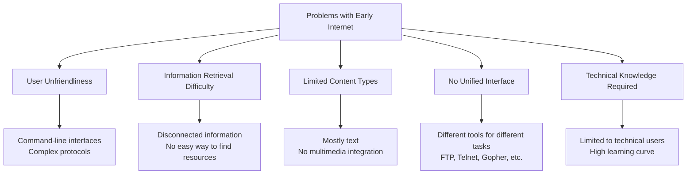

Key limitations included:

1. **Technical Barriers**: Early Internet required specialized knowledge of protocols and command-line interfaces, limiting its use to technical professionals.

2. **Navigation Challenges**: Before the Web, finding information online required knowing exact server addresses and file paths.

3. **Fragmented Systems**: Different tools were needed for different functions (FTP for file transfers, Telnet for remote access, USENET for discussions).

4. **Limited Content**: Mostly text-based with minimal graphics and no multimedia.

5. **No Linking System**: Information existed in silos with no easy way to connect related content.

### Tim Berners-Lee and the Birth of the Web

In 1989, Tim Berners-Lee, a British scientist working at CERN (European Organization for Nuclear Research), proposed a system to manage information using hypertext - a way to link and access information of various kinds as a web of nodes that users could browse at will.

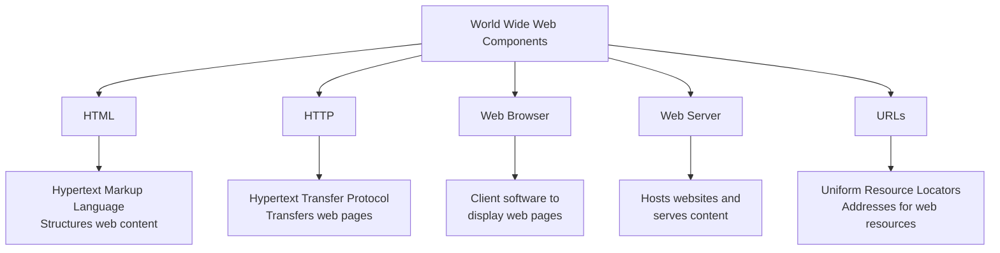

Berners-Lee's innovation consisted of:

1. **HTML (Hypertext Markup Language)**: A way to structure documents that could contain links to other documents.

2. **HTTP (Hypertext Transfer Protocol)**: A protocol for transmitting hypermedia documents across the Internet.

3. **Web Browser**: Software to navigate and display HTML documents.

4. **Web Server**: Software to host and serve web pages.

5. **URLs (Uniform Resource Locators)**: A standardized way to address resources on the web.

### The First Website

On August 6, 1991, Tim Berners-Lee published the first website at CERN, making it publicly available. This historic site described the World Wide Web project itself.

*The NeXT Computer used by Tim Berners-Lee at CERN to create the first World Wide Web server. Source: Wikipedia*

The website was hosted at the URL: http://info.cern.ch/hypertext/WWW/TheProject.html (which is still available today in archived form).

The first website was simple, consisting only of text and hyperlinks. It contained information about:
- What the Web was
- How to create a web server
- How to create a web browser
- Technical details about hypertext

*A screenshot of the first website, explaining the World Wide Web project. Source: Wikipedia*

### How the Web Changed Everything

The World Wide Web democratized the Internet, transforming it from a tool for scientists and academics into a global platform accessible to everyone.

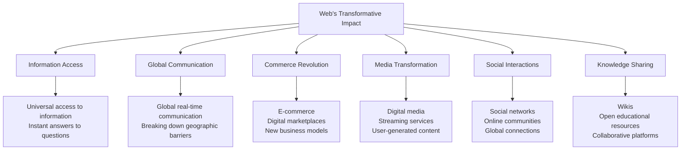

Key transformations included:

1. **Universal Information Access**: The Web made information accessible to anyone with an Internet connection, breaking down barriers of distance, time, and social status.

2. **User-Friendly Interface**: Graphical browsers made navigating the Internet intuitive, bringing millions of non-technical users online.

3. **Hypertextual Organization**: Linking documents created an interconnected web of knowledge, changing how we organize and discover information.

4. **Commercial Revolution**: E-commerce transformed retail, banking, and business models worldwide.

5. **Media Transformation**: Traditional media evolved to digital formats, and new forms of media emerged.

6. **Social Connectivity**: The Web enabled new forms of social interaction, community building, and collaboration across global distances.

7. **Democratic Publishing**: Anyone could create content and publish globally without traditional gatekeepers.

### Web Evolution

The Web has evolved dramatically since its creation:

- **Web 1.0 (1990s)**: Static websites, one-way communication, "read-only" web
- **Web 2.0 (2000s)**: Interactive sites, user-generated content, social media, "read-write" web
- **Web 3.0 (Emerging)**: Semantic web, AI integration, decentralized technologies, blockchain

Each evolution has brought new capabilities, challenges, and societal impacts, fundamentally changing how we live, work, and communicate.

## 4. Evolution of Computer Networking: A Precise Timeline

```mermaid
timeline
    title Computer Networking Evolution Timeline
    section 1950s-1960s
        1957 : Sputnik launch leads to creation of ARPA
        1962 : J.C.R. Licklider proposes "Galactic Network" concept
        1965 : First WAN connection (TX-2 at MIT to Q-32 in California)
        1969 : ARPANET established with first four nodes
    section 1970s
        1971 : First email sent by Ray Tomlinson
        1973 : Development of TCP/IP begins
        1973 : Ethernet developed at Xerox PARC
        1976 : Queen Elizabeth II sends first royal email
        1978 : TCP/IP split into TCP and IP
        1979 : USENET created
    section 1980s
        1982 : TCP/IP standardized
        1983 : ARPANET transitions to TCP/IP
        1983 : Domain Name System (DNS) introduced
        1984 : Number of Internet hosts exceeds 1,000
        1986 : NSFNET created (backbone speed: 56 Kbps)
        1987 : Number of Internet hosts exceeds 10,000
        1989 : Tim Berners-Lee proposes the World Wide Web at CERN
    section 1990s
        1990 : ARPANET decommissioned
        1991 : First web page created
        1991 : NSFNET backbone upgraded to 45 Mbps
        1993 : Mosaic, first popular web browser released
        1994 : Netscape Navigator released
        1994 : Yahoo! founded
        1995 : Amazon.com and eBay launched
        1995 : Internet commercialization begins
        1998 : Google founded
        1999 : Wi-Fi (802.11b) standardized
    section 2000s
        2000 : Dot-com bubble bursts
        2001 : Wikipedia launched
        2003 : MySpace becomes popular
        2004 : Facebook launched
        2005 : YouTube launched
        2006 : Twitter launched
        2007 : iPhone released, mobile internet takes off
        2008 : Android launched
        2009 : 4G networks begin deployment
    section 2010s
        2010 : Instagram launched
        2011 : IPv4 addresses officially exhausted
        2012 : IPv6 formally launched
        2014 : Internet users reach 3 billion
        2015 : Internet of Things (IoT) becomes mainstream
        2016 : 5G standards development begins
        2019 : Over 50% of global population connected to internet
    section 2020s
        2020 : COVID-19 pandemic accelerates digital transformation
        2021 : Web3 concepts gain popularity
        2022 : Metaverse development accelerates
        2023 : 5G networks widely deployed
        2024 : Quantum networking research advances
        2025 : AI-driven network management becomes standard
```

### Detailed Timeline with Key Milestones

#### Early Foundations (1950s-1960s)

**1957: Sputnik Launch**
The Soviet Union's launch of Sputnik triggered the formation of ARPA (Advanced Research Projects Agency) in the US.

**1962: "Galactic Network" Concept**
J.C.R. Licklider of MIT proposed a global network of computers and became the first head of the computer research program at ARPA.

**1965: First WAN Connection**
The first wide-area network connection was established between the TX-2 computer at MIT and the Q-32 in California.

*TX-2 computer at MIT Lincoln Laboratory used in the first WAN connection. Source: Wikipedia*

**1969: ARPANET Established**
The first four nodes of ARPANET were interconnected between UCLA, Stanford Research Institute, UCSB, and the University of Utah.

#### Network Development (1970s)

**1971: First Email**
Ray Tomlinson sent the first email using the @ symbol to denote sending messages between computers.

**1973: TCP/IP Development Begins**
Vinton Cerf and Robert Kahn began creating the TCP/IP protocol suite that would become the foundation of the Internet.

**1973: Ethernet Developed**
Robert Metcalfe at Xerox PARC developed Ethernet, a technology for connecting computers within a local area network.

*Ethernet cable, based on the technology developed at Xerox PARC. Source: Wikipedia*

**1978: TCP/IP Split**
TCP was split into TCP and IP, creating the modern Internet protocol suite.

**1979: USENET Created**
USENET, an early discussion system that predated the World Wide Web, was established.

#### Standardization and Growth (1980s)

**1982: TCP/IP Standardized**
TCP/IP was standardized, setting the stage for the modern Internet.

**1983: ARPANET Transitions to TCP/IP**
ARPANET officially switched to the TCP/IP protocol.

**1983: DNS Introduced**
The Domain Name System was introduced, allowing the use of domain names instead of IP addresses.

**1986: NSFNET Created**
The National Science Foundation created NSFNET, a network that connected five supercomputer centers and eventually replaced ARPANET as the Internet backbone.

**1989: World Wide Web Proposed**
Tim Berners-Lee at CERN proposed the World Wide Web as a hypertext system running over the Internet.

*Sir Tim Berners-Lee, inventor of the World Wide Web. Source: Wikipedia*

#### Web 1.0: The Static Web (1990s)

**1990: ARPANET Decommissioned**
ARPANET was officially decommissioned, with the Internet now running on NSFNET and other networks.

**1991: First Web Page**
Tim Berners-Lee created the first web page at CERN, describing the World Wide Web project.

**1993: Mosaic Web Browser**
NCSA Mosaic, the first popular web browser, was released, making the web accessible to non-technical users.

*NCSA Mosaic web browser, which helped popularize the World Wide Web. Source: Wikipedia*

**1994: Netscape Navigator**
Netscape Navigator was released and quickly became the dominant web browser.

**1994: Yahoo! Founded**
Jerry Yang and David Filo created "Jerry and David's Guide to the World Wide Web," later renamed Yahoo!.

**1995: Internet Commercialization**
The NSFNET was privatized, marking the beginning of the commercial Internet era.

**1998: Google Founded**
Larry Page and Sergey Brin founded Google, revolutionizing web search with their PageRank algorithm.

*The original Google homepage from 1998. Source: Wikipedia*

#### Web 2.0: The Interactive Web (2000s)

**2001: Wikipedia Launched**
Wikipedia was launched, pioneering collaborative content creation online.

**2003-2006: Social Media Emerges**
MySpace (2003), Facebook (2004), YouTube (2005), and Twitter (2006) were launched, ushering in the social media era.

**2007: Mobile Internet Takes Off**
Apple released the iPhone, revolutionizing mobile internet access and application ecosystems.

*The first iPhone, which revolutionized mobile internet access. Source: Wikipedia*

**2009: 4G Networks**
Fourth-generation (4G) mobile networks began deployment, significantly increasing mobile data speeds.

#### Web Evolution and Expansion (2010s)

**2011: IPv4 Address Exhaustion**
The global pool of IPv4 addresses was officially exhausted, accelerating the transition to IPv6.

**2012: IPv6 Launch**
World IPv6 Launch Day marked the permanent enablement of IPv6 by major internet service providers and websites.

**2014: 3 Billion Users**
The number of Internet users worldwide reached 3 billion people.

**2015: Internet of Things (IoT)**
IoT devices became mainstream, connecting billions of everyday objects to the Internet.

*Internet of Things (IoT) connecting everyday devices to the internet. Source: Wikipedia*

**2019: Global Connectivity**
Over 50% of the world's population gained internet access.

#### Web 3.0 and Beyond (2020s)

**2020: COVID-19 Digital Acceleration**
The COVID-19 pandemic accelerated digital transformation worldwide, with remote work and virtual services becoming essential.

**2021: Web3 Concepts**
Web3 concepts based on blockchain, decentralization, and token economies gained popularity.

**2022: Metaverse Development**
Major tech companies invested heavily in metaverse development, exploring virtual reality and augmented reality.

**2023: 5G Widespread Deployment**
5G networks became widely deployed, offering gigabit speeds and ultra-low latency.

*A 5G cellular network tower. Source: Wikipedia*

**2025: AI-Driven Networking**
Artificial intelligence and machine learning became standard for network management and optimization.

### Evolution of Search Engines

```mermaid
timeline
    title Search Engine Evolution
    section Early Search
        1990 : Archie - First search engine for FTP sites
        1993 : W3Catalog - First web search engine
        1993 : Aliweb - First web crawler
        1994 : WebCrawler - First full-text search engine
    section Web 1.0 Search
        1994 : Lycos launched
        1995 : AltaVista launched
        1995 : Yahoo! Search launched (directory-based)
        1996 : Inktomi launched
        1997 : Ask Jeeves launched
        1998 : Google launched
        1998 : MSN Search launched
    section Web 2.0 Search
        2000 : Baidu launched in China
        2003 : Google dominates search market
        2004 : Google indexes over 8 billion pages
        2005 : Personalized search begins
        2006 : Microsoft launches Live Search
        2008 : Google introduces universal search
        2009 : Microsoft launches Bing
    section Modern Search
        2010 : Google Instant launched
        2011 : Voice search becomes mainstream
        2013 : Google Hummingbird algorithm
        2015 : Mobile search exceeds desktop
        2017 : Visual search capabilities expand
        2019 : Zero-click searches increase
        2021 : AI-driven search results
        2023 : Multimodal search (text, voice, image)
        2025 : Semantic and context-aware search
```

#### Early Search Engines (1990-1994)

**Archie (1990)**
The first search engine, designed to index FTP archives, created by Alan Emtage at McGill University.

**W3Catalog (1993)**
The first primitive web search engine that cataloged web pages.

**WebCrawler (1994)**
The first search engine to provide full-text search, indexing entire web pages.

#### Web 1.0 Search Engines (1994-2000)

**Lycos (1994)**
One of the earliest web search engines that achieved commercial success.

**AltaVista (1995)**
Pioneered advanced search techniques and was one of the most used search engines in the early web.

*AltaVista search engine homepage from the late 1990s. Source: Wikipedia*

**Yahoo! (1995)**
Initially a web directory organized by humans rather than algorithms, later incorporating search technology.

**Google (1998)**
Founded by Larry Page and Sergey Brin, introduced PageRank algorithm that ranked sites based on their connections.

#### Web 2.0 Search Engines (2000-2010)

**Baidu (2000)**
Launched in China, becoming the dominant search engine in the Chinese market.

**Google Dominance (2003-2009)**
Google became the dominant search engine globally, continuously improving its algorithms.

**Bing (2009)**
Microsoft launched Bing as a competitor to Google, incorporating semantic search features.

*Microsoft Bing logo, launched in 2009 as a Google competitor. Source: Wikipedia*

#### Modern Search (2010-Present)

**Mobile Search (2015)**
Mobile search queries exceeded desktop searches for the first time.

**AI-Driven Search (2021-Present)**
Search engines increasingly rely on artificial intelligence to understand context and intent.

**Multimodal Search (2023)**
Search engines began accepting queries in multiple formats: text, voice, and images.

### Web Evolution Detailed

#### Web 1.0 (1990-2005): The Static Web

**Characteristics:**
- Static HTML pages
- Limited interactivity
- One-way communication (read-only)
- Personal websites and corporate brochures
- Directory-based navigation (Yahoo!, DMOZ)
- Dial-up connections

**Key Technologies:**
- HTML, HTTP
- Basic CSS
- CGI scripts
- GIF and JPEG images

*Yahoo! website in 1996, a typical Web 1.0 interface. Source: Wikipedia*

#### Web 2.0 (2005-2020): The Social Web

**Characteristics:**
- Dynamic content
- User-generated content
- Social media and communities
- Rich user interfaces
- APIs and mashups
- Cloud computing
- Mobile access

**Key Technologies:**
- AJAX
- JavaScript frameworks
- REST APIs
- Responsive design
- HTML5 and CSS3
- Mobile apps

*Web 2.0 applications and concepts map. Source: Wikipedia*

#### Web 3.0 (2020-Present): The Semantic/Decentralized Web

**Characteristics:**
- Decentralized applications
- Blockchain and cryptocurrencies
- Semantic understanding
- AI and machine learning integration
- Virtual and augmented reality
- Internet of Things integration
- User ownership of data and content

**Key Technologies:**
- Blockchain
- Smart contracts
- Decentralized storage
- AI/ML models
- NFTs (Non-Fungible Tokens)
- Semantic web standards
- Extended reality (XR)

*Conceptual illustration of Web3 architecture. Source: Wikipedia*

## 5. Networking Protocols and Standards Organizations

### The Need for Protocols

Protocols are essential for computer networking because they define the rules, conventions, and standards that enable different devices and systems to communicate with each other reliably and consistently.

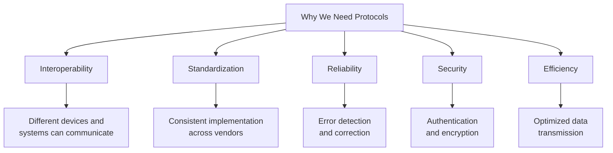

Without standardized protocols, imagine what would happen:

1. **Communication Chaos**: If every manufacturer created their own proprietary communication methods, devices from different vendors couldn't communicate with each other.

2. **Network Silos**: We would have isolated networks that couldn't interconnect, defeating the purpose of a global internet.

3. **Innovation Barriers**: Developers would need to create multiple versions of applications to work with different protocols, slowing innovation.

4. **Cost Increases**: Proprietary solutions would increase costs and reduce competition.

### Key Internet Protocols

The Internet relies on a suite of standardized protocols, each serving specific functions:

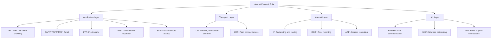

*TCP/IP protocol encapsulation process, showing how data is packaged at different layers. Source: Wikipedia*

### The Internet Society (ISOC) and Internet Governance

The Internet Society (ISOC) is a global nonprofit organization founded in 1992 that promotes the open development, evolution, and use of the Internet for the benefit of all people.

#### ISOC's Role in Internet Governance

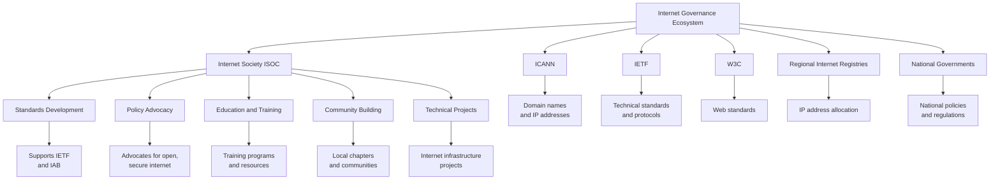

**ISOC's Core Functions:**

1. **Standards Development**: ISOC provides organizational home for the Internet Engineering Task Force (IETF), which develops the technical standards that make the Internet work.

2. **Open Internet Advocacy**: Advocates for policies that keep the Internet open, globally connected, secure, and trustworthy.

3. **Education and Capacity Building**: Provides training and resources to help communities build and maintain Internet infrastructure.

4. **Internet Governance**: Participates in global discussions about how the Internet is managed.

5. **Funding Internet Development**: Supports projects that strengthen the Internet's infrastructure.

*The Internet Society (ISOC) logo. Source: Wikipedia*

### The Internet Standards Process

Internet standards are developed through a unique, open process involving several key organizations:

#### 1. Internet Engineering Task Force (IETF)

The IETF is the primary body for developing new Internet standards. It operates as an open community of network designers, operators, vendors, and researchers concerned with the evolution and smooth operation of the Internet architecture.

**IETF Process:**
- Standards begin as Internet Drafts
- Progress through Working Groups
- Eventually become Request for Comments (RFCs)
- Some RFCs become Internet Standards

*IETF meeting, where Internet protocols and standards are discussed and developed. Source: Wikipedia*

#### 2. Internet Architecture Board (IAB)

The IAB provides oversight of the Internet architecture and protocols, and serves as an advisory body to the IETF.

#### 3. Internet Engineering Steering Group (IESG)

The IESG is responsible for technical management of IETF activities and the Internet standards process.

#### 4. Internet Research Task Force (IRTF)

The IRTF focuses on longer-term research issues related to Internet protocols, applications, architecture, and technology.

### RFC (Request for Comments) Documents

RFCs are the formal documents that define Internet protocols and standards. They go through a rigorous review process before being published.

**Examples of Important RFCs:**
- RFC 791: Internet Protocol (IP)
- RFC 793: Transmission Control Protocol (TCP)
- RFC 2616: HTTP/1.1
- RFC 5321: Simple Mail Transfer Protocol (SMTP)
- RFC 6455: WebSocket Protocol

### Why This Matters

The standardization of Internet protocols through organizations like ISOC and the IETF has enabled the Internet to:

1. **Scale Globally**: From a few connected computers to billions of devices
2. **Remain Interoperable**: Devices from different manufacturers can communicate seamlessly
3. **Evolve Continuously**: New protocols can be developed while maintaining backward compatibility
4. **Stay Resilient**: No single point of failure due to distributed architecture
5. **Foster Innovation**: Open standards allow anyone to build Internet applications

Without these standards and the organizations that develop and maintain them, the Internet as we know it today would not exist. The Internet's success is largely due to its open, collaborative standardization process that ensures technical excellence while allowing for innovation and growth.

### Case Study: HTTP Protocol Evolution

HTTP (Hypertext Transfer Protocol) evolution demonstrates how Internet protocols evolve to meet changing needs:

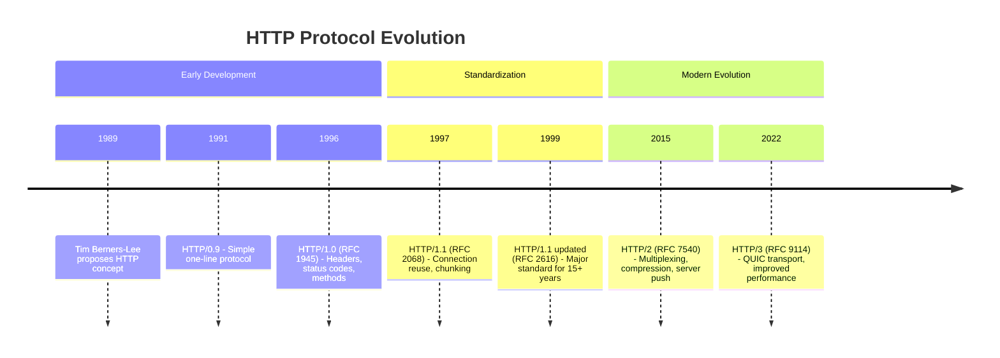

*Comparison of HTTP/1.x vs HTTP/2 connection handling, showing how protocol evolution improves performance. Source: Wikipedia*

## Practice Questions

1. What are the key components required to implement a basic local area network? Design a simple network topology for a small office with 10 computers.

2. Compare and contrast the OSI model and the TCP/IP model. Which protocols operate at each layer of the TCP/IP model?

3. Explain the difference between a hub, a switch, and a router. In what scenarios would you use each device?

4. How does packet switching work? Describe the journey of a data packet from a source computer to a destination server across the Internet.

5. What are the technical differences between IPv4 and IPv6 addressing? Calculate a subnet mask for an IPv4 network with 30 host addresses.

