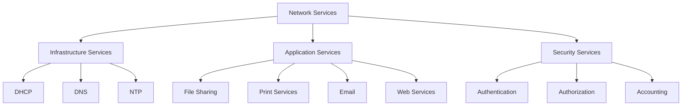
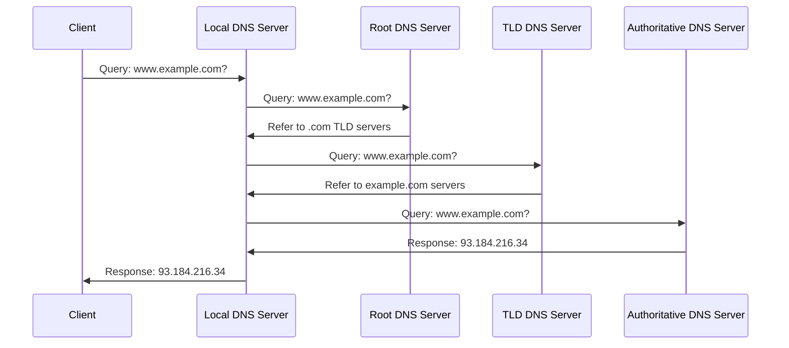
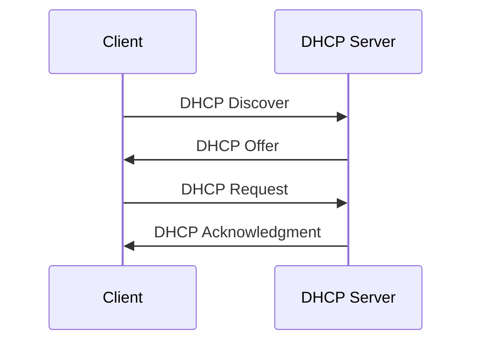
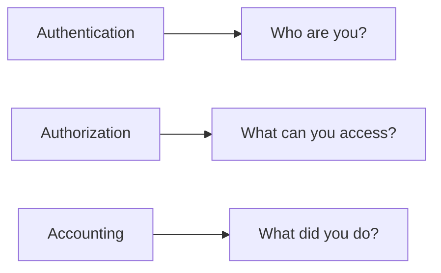

# Day 2: Networking Services and Applications

## Topics Covered
- Networking Services and Applications (Part 1)
- Networking Services and Applications (Part 2)

## 1. Introduction to Network Services

Network services are software functions hosted on a network that provide capabilities to users, devices, or other services. They form the foundation of what makes networks useful beyond simple connectivity.



## 2. Core Network Services

### Domain Name System (DNS)

DNS is a hierarchical and decentralized naming system that translates human-readable domain names (like www.example.com) to IP addresses.



**Key DNS Record Types:**

| Record Type | Purpose | Example |
|-------------|---------|---------|
| A | Maps domain to IPv4 address | example.com → 93.184.216.34 |
| AAAA | Maps domain to IPv6 address | example.com → 2606:2800:220:1:248:1893:25c8:1946 |
| CNAME | Canonical name (alias) | www.example.com → example.com |
| MX | Mail exchange | example.com mail handled by mail.example.com |
| TXT | Text information | Used for SPF, DKIM, etc. |
| NS | Name server records | example.com → ns1.example.com |
| PTR | Reverse lookup (IP to name) | 93.184.216.34 → example.com |

### Dynamic Host Configuration Protocol (DHCP)

DHCP automatically assigns IP addresses and other network configuration parameters to devices on a network.



**DHCP Process (DORA):**
1. **Discover**: Client broadcasts to locate available servers
2. **Offer**: Server offers an IP address lease
3. **Request**: Client requests the offered IP address
4. **Acknowledgment**: Server confirms the IP address assignment

**DHCP Lease Information includes:**
- IP address
- Subnet mask
- Default gateway
- DNS server addresses
- Lease duration

## 3. Application Services

### File Sharing Services

File sharing services allow users to access, store, and share files across a network.

**Common Protocols:**
- Server Message Block (SMB) - Windows
- Network File System (NFS) - Unix/Linux
- Apple Filing Protocol (AFP) - macOS (legacy)
- File Transfer Protocol (FTP)
- Secure File Transfer Protocol (SFTP)

**Example SMB Share Command (Windows):**
```powershell
# Create a network share
New-SmbShare -Name "SharedDocs" -Path "C:\Documents" -FullAccess "Domain\User1","Domain\User2"

# Access a network share
New-PSDrive -Name "S" -PSProvider "FileSystem" -Root "\\SERVER\SharedDocs"
```

### Print Services

Print services allow network users to share printers and manage print jobs centrally.

**Benefits:**
- Reduced hardware costs
- Centralized management
- Queue management
- Access control

**Common Print Protocols:**
- Internet Printing Protocol (IPP)
- Line Printer Daemon (LPD)
- Server Message Block (SMB) printing

## 4. Security Services

### Authentication, Authorization, and Accounting (AAA)

AAA is a framework for controlling access to computer resources, enforcing policies, and auditing usage.



**Common AAA Implementations:**
- RADIUS (Remote Authentication Dial-In User Service)
- TACACS+ (Terminal Access Controller Access-Control System Plus)
- Kerberos
- LDAP (Lightweight Directory Access Protocol)

**Example RADIUS Configuration (on a Cisco router):**
```
radius-server host 192.168.1.100 auth-port 1812 acct-port 1813
radius-server key SecretKey
aaa new-model
aaa authentication login default group radius local
aaa authorization network default group radius local
aaa accounting exec default start-stop group radius
```

## 5. Web Services and APIs

Web services provide machine-to-machine interaction over a network using standardized messaging protocols.

**Types of Web Services:**
- SOAP (Simple Object Access Protocol)
- REST (Representational State Transfer)
- GraphQL
- gRPC

**Example REST API Call (using curl):**
```bash
# GET request
curl -X GET https://api.example.com/users/123 -H "Authorization: Bearer token123"

# POST request
curl -X POST https://api.example.com/users \
  -H "Content-Type: application/json" \
  -H "Authorization: Bearer token123" \
  -d '{"name": "John Doe", "email": "john@example.com"}'
```

## Additional Resources

- [DNS: IANA Root Servers](https://www.iana.org/domains/root/servers)
- [DHCP RFC 2131](https://www.ietf.org/rfc/rfc2131.txt)
- [Microsoft SMB Documentation](https://docs.microsoft.com/en-us/windows-server/storage/file-server/file-server-smb-overview)

## Practice Questions

1. Describe the DHCP DORA process and what information is typically provided in a DHCP lease.
2. How does DNS resolution work when a client wants to access www.example.com?
3. Compare and contrast REST and SOAP web services.
4. What are the three components of AAA and why are they important for network security?
