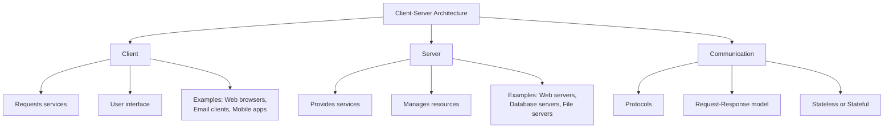
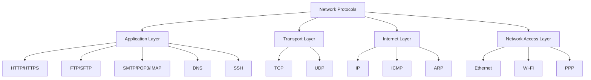
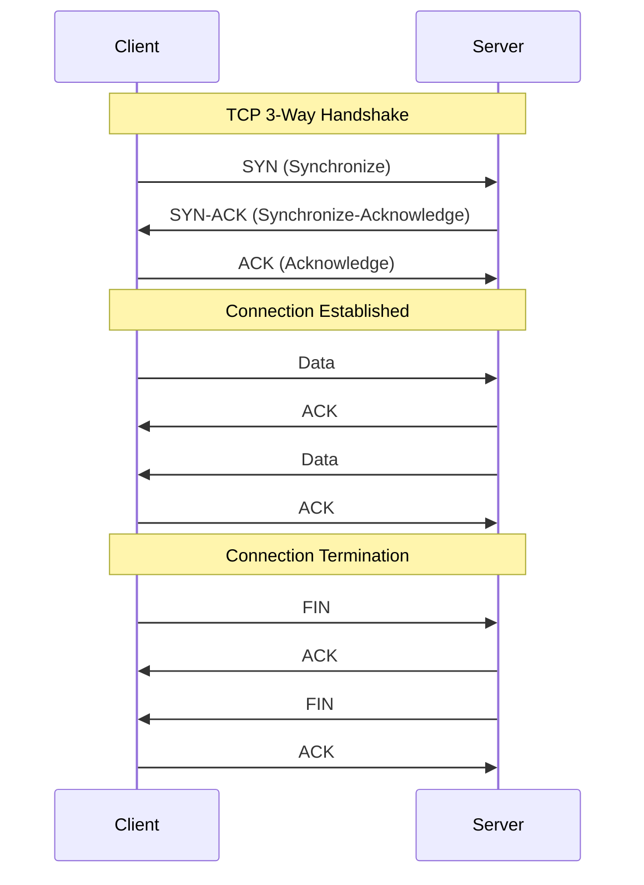
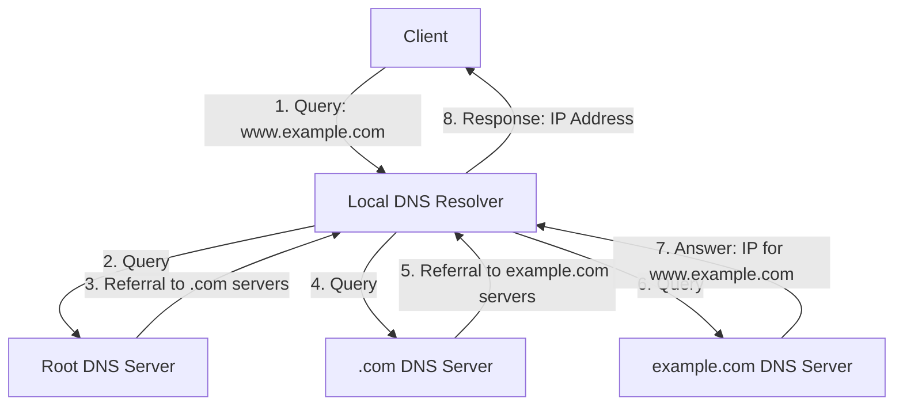
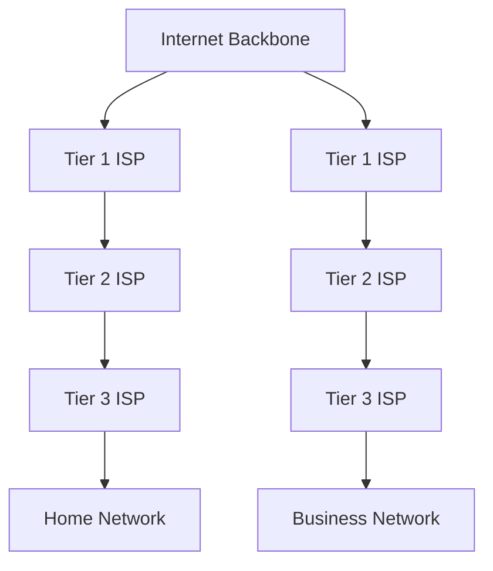
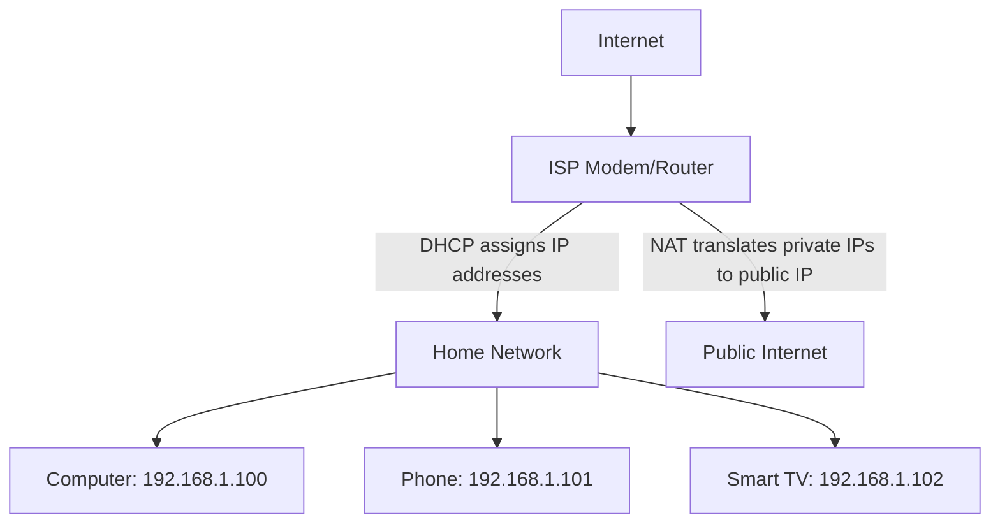
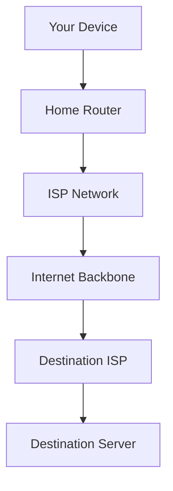

# Day 2: Client-Server Architecture and Network Protocols

## 1. Client-Server Architecture

Client-server architecture is a computing model in which server hosts, delivers, and manages most of the resources and services requested by the client.



### Types of Servers

Different types of servers provide specialized services:

1. **Web Servers**: Deliver web content (Apache, Nginx, IIS)
2. **Application Servers**: Execute application logic (Tomcat, JBoss, WebSphere)
3. **Database Servers**: Store and retrieve data (MySQL, PostgreSQL, MongoDB)
4. **File Servers**: Store and share files (Windows File Server, NFS)
5. **Email Servers**: Handle email services (Exchange, Postfix)
6. **DNS Servers**: Resolve domain names to IP addresses
7. **Proxy Servers**: Act as intermediaries for requests


*Basic client-server architecture showing multiple clients connecting to a server. Source: Wikipedia*

### Client-Server Communication

The client-server communication follows a request-response pattern:

1. Client initiates a request for a service or resource
2. Server processes the request
3. Server returns a response to the client
4. Client processes the response


*HTTP request-response flow between client and server. Source: Mozilla Developer Network*

### Advantages and Disadvantages

**Advantages:**
- Centralized control and management
- Enhanced security
- Scalability (can add more clients without system changes)
- Role separation (specialized functions)

**Disadvantages:**
- Server can become a single point of failure
- Network congestion with many clients
- Higher costs for server hardware/software
- Complexity in setup and maintenance

## 2. Network Protocols Overview

Network protocols are formal standards and policies comprised of rules, procedures and formats that define communication between two or more devices over a network.



## 3. Key Network Protocols

### TCP (Transmission Control Protocol)

TCP is a connection-oriented protocol that ensures reliable data transfer between applications running on hosts communicating over an IP network.

**Key Features:**
- Connection-oriented
- Reliable delivery
- Data sequencing
- Flow control
- Congestion control
- Error detection

**How TCP Works:**




*TCP connection establishment (3-way handshake) and termination. Source: Wikipedia*

**TCP Use Cases:**
- Web browsing (HTTP/HTTPS)
- Email (SMTP, POP3, IMAP)
- File transfers (FTP)
- Remote login (SSH, Telnet)
- Any application requiring reliable data delivery

### UDP (User Datagram Protocol)

UDP is a connectionless protocol that provides a simple, unreliable message service between applications.

**Key Features:**
- Connectionless
- No guaranteed delivery
- No acknowledgment
- No flow control
- Low overhead
- Fast transmission


*Comparison of TCP and UDP communication. Source: Cloudflare*

**UDP Use Cases:**
- Streaming media
- VoIP (Voice over IP)
- DNS queries
- Online gaming
- IoT applications
- Situations where speed is more important than reliability

### HTTP (Hypertext Transfer Protocol)

HTTP is an application protocol for distributed, collaborative, hypermedia information systems, forming the foundation of data communication for the World Wide Web.

**Key Features:**
- Request-response protocol
- Stateless protocol
- Text-based
- Uses TCP as transport layer
- Default port 80

**HTTP Methods:**
- GET: Retrieve data
- POST: Submit data
- PUT: Update data
- DELETE: Remove data
- HEAD, OPTIONS, PATCH, etc.

**HTTP Evolution:**
- HTTP/1.0: Basic implementation
- HTTP/1.1: Persistent connections, additional methods
- HTTP/2: Multiplexed connections, server push, header compression
- HTTP/3: Uses QUIC transport protocol, improved performance


*HTTP request and response structure. Source: Web Development Notes*

### HTTPS (HTTP Secure)

HTTPS is the secure version of HTTP, encrypting the data exchanged between a client and server using TLS/SSL.

**Key Features:**
- Encrypted communication
- Server authentication
- Data integrity
- Uses TCP as transport layer
- Default port 443


*Comparison of HTTP and HTTPS connections. Source: Wikipedia*

### FTP (File Transfer Protocol)

FTP is used to transfer files between a client and server on a computer network.

**Key Features:**
- Uses separate control and data connections
- Supports authentication
- Allows directory navigation
- Supports binary and ASCII transfer modes
- Default ports 20 (data) and 21 (control)

**Secure variants:**
- FTPS: FTP with SSL/TLS
- SFTP: SSH File Transfer Protocol

### SMTP (Simple Mail Transfer Protocol)

SMTP is used for sending and relaying email messages between mail servers.

**Key Features:**
- Text-based protocol
- Used for sending emails
- Operates on port 25 (or 587 for submission)
- Works with other protocols like POP3 and IMAP for a complete email system


*Email protocols (SMTP, POP3, IMAP) and their roles. Source: Wikipedia*

### DNS (Domain Name System)

DNS translates domain names to IP addresses, making websites accessible using human-readable names.

**Key Features:**
- Hierarchical, distributed database
- Primarily uses UDP for queries (port 53)
- Falls back to TCP for large responses
- Caching to improve performance

**DNS Query Process:**



### IP (Internet Protocol)

IP is responsible for delivering packets from the source host to the destination host based on IP addresses.

**Key Features:**
- Connectionless
- Best-effort delivery
- Routing capability
- Fragmentation and reassembly

**IPv4 vs IPv6:**

| Feature | IPv4 | IPv6 |
|---------|------|------|
| Address length | 32-bit | 128-bit |
| Address format | Dotted decimal (192.168.1.1) | Hexadecimal with colons (2001:0db8:85a3:0000:0000:8a2e:0370:7334) |
| Number of addresses | ~4.3 billion | 340 undecillion |
| Header | Variable length (20-60 bytes) | Fixed length (40 bytes) |
| Fragmentation | By routers and sending hosts | Only by sending hosts |
| Checksum | Included in header | Removed (handled by transport layer) |


*Structure of an IPv4 packet. Source: Wikipedia*

## 4. Practical Network Commands

Understanding network protocols is easier with hands-on exploration. Here are some common networking commands and what their output tells us:

### Checking Network Interfaces

The `ip addr show` command displays all network interfaces on a Linux system:

```bash
$ ip addr show
1: lo: <LOOPBACK,UP,LOWER_UP> mtu 65536 qdisc noqueue state UNKNOWN group default qlen 1000
    link/loopback 00:00:00:00:00:00 brd 00:00:00:00:00:00
    inet 127.0.0.1/8 scope host lo
       valid_lft forever preferred_lft forever
    inet6 ::1/128 scope host noprefixroute 
       valid_lft forever preferred_lft forever
2: wlo1: <BROADCAST,MULTICAST,UP,LOWER_UP> mtu 1500 qdisc noqueue state UP group default qlen 1000
    link/ether aa:bb:cc:dd:ee:ff brd ff:ff:ff:ff:ff:ff
    altname wlp1s0
    inet 192.168.1.45/24 brd 192.168.1.255 scope global dynamic noprefixroute wlo1
       valid_lft 3400sec preferred_lft 3400sec
    inet6 2001:db8:85a3:8d3:1319:8a2e:370:7348/64 scope global temporary dynamic 
       valid_lft 7004sec preferred_lft 7004sec
    inet6 fe80::1234:5678:90ab:cdef/64 scope link noprefixroute 
       valid_lft forever preferred_lft forever
```

In this output, we can see:
- The loopback interface (`lo`) with IPv4 address 127.0.0.1 and IPv6 address ::1
- A wireless interface (`wlo1`) with:
  - MAC address (link/ether)
  - IPv4 address (192.168.1.45/24)
  - IPv6 addresses (global and link-local)
  - MTU (Maximum Transmission Unit) set to 1500 bytes

### Checking Your Public IP

The `curl` command with services like ifconfig.me can show your public-facing IP address:

```bash
$ curl ifconfig.me
203.0.113.42

$ curl ifconfig.me/all
ip_addr: 203.0.113.42
remote_host: unavailable
user_agent: curl/8.5.0
port: 51034
language: 
referer: 
connection: 
keep_alive: 
method: GET
encoding: 
mime: */*
charset: 
via: 1.1 google
forwarded: 203.0.113.42,2001:db8::1
```

This information shows:
- Your public IPv4 address as seen by external servers
- Connection details including user agent and HTTP method
- Proxy information in the via and forwarded fields

### Exploring Hostname Information

The `hostname` command reveals information about your system's name:

```bash
$ hostname
linuxserver

$ hostname -I
192.168.1.45 2001:db8:85a3:8d3:1319:8a2e:370:7348
```

This shows:
- Your computer's hostname
- All assigned IP addresses (both IPv4 and IPv6)

### Viewing Network Protocol Support

When you check the version of networking tools like `curl`, you can see the supported protocols:

```bash
$ curl --version
curl 8.5.0 (x86_64-pc-linux-gnu) libcurl/8.5.0 OpenSSL/3.0.13 zlib/1.3 brotli/1.1.0 zstd/1.5.5 libidn2/2.3.7 libpsl/0.21.2 (+libidn2/2.3.7) libssh/0.10.6/openssl/zlib nghttp2/1.59.0 librtmp/2.3 OpenLDAP/2.6.7
Release-Date: 2023-12-06
Protocols: dict file ftp ftps gopher gophers http https imap imaps ldap ldaps mqtt pop3 pop3s rtmp rtsp scp sftp smb smbs smtp smtps telnet tftp
Features: alt-svc AsynchDNS brotli GSS-API HSTS HTTP2 HTTPS-proxy IDN IPv6 Kerberos Largefile libz NTLM PSL SPNEGO SSL threadsafe TLS-SRP UnixSockets zstd
```

This output reveals:
- The version of curl and its dependencies
- All protocols supported by curl (http, https, ftp, smtp, etc.)
- Features supported (IPv6, HTTP2, SSL, etc.)

### Examining TCP Connections

The `netstat` or `ss` commands show active network connections:

```bash
$ ss -tuln
Netid  State   Recv-Q  Send-Q  Local Address:Port  Peer Address:Port  Process
udp    UNCONN  0       0       127.0.0.53%lo:53    0.0.0.0:*
udp    UNCONN  0       0       0.0.0.0:68          0.0.0.0:*
tcp    LISTEN  0       4096    127.0.0.53%lo:53    0.0.0.0:*
tcp    LISTEN  0       128     0.0.0.0:22          0.0.0.0:*
tcp    LISTEN  0       128     127.0.0.1:631       0.0.0.0:*
tcp    LISTEN  0       128     0.0.0.0:80          0.0.0.0:*
tcp    LISTEN  0       128     [::]:22             [::]:*
tcp    LISTEN  0       128     [::1]:631           [::]:*
tcp    LISTEN  0       128     [::]:80             [::]:*
```

This shows:
- DNS service on port 53
- SSH server on port 22
- Printing service on port 631
- Web server on port 80
- Both IPv4 (0.0.0.0) and IPv6 ([::]) listening addresses

### Tracing Network Routes

The `traceroute` command shows the path packets take to a destination:

```bash
$ traceroute google.com
traceroute to google.com (142.250.192.78), 30 hops max, 60 byte packets
 1  _gateway (192.168.1.1)  3.171 ms  3.140 ms  3.114 ms
 2  isp-router.example.net (203.0.113.1)  15.781 ms  15.763 ms  15.745 ms
 3  regional-router.isp.net (198.51.100.54)  20.118 ms  20.096 ms  20.083 ms
 4  backbone-1.isp.net (198.51.100.18)  25.421 ms  30.128 ms  30.117 ms
 5  exchange-point.net (203.0.113.50)  35.386 ms  35.373 ms  35.361 ms
 6  google-peer.exchange-point.net (198.51.100.222)  40.035 ms  35.230 ms  35.208 ms
 7  142.250.70.241 (142.250.70.241)  40.138 ms  40.127 ms  40.115 ms
 8  142.250.233.41 (142.250.233.41)  40.103 ms  40.091 ms  40.078 ms
 9  142.250.192.78 (142.250.192.78)  40.066 ms  35.464 ms  35.430 ms
```

This output shows:
- The path from your computer to google.com
- Each network "hop" along the way
- Round-trip time for each hop in milliseconds
- Hostname and IP address of each router in the path

These practical examples demonstrate how networking protocols work in real-world scenarios and how system administrators can inspect and troubleshoot network configurations.

## 5. Internet Service Providers and Home Networking

### Global Internet Infrastructure

Internet Service Providers (ISPs) are organizations that provide access to the internet. They form a hierarchical structure:

- **Tier 1 ISPs**: Form the backbone of the internet with high-capacity international networks
- **Tier 2 ISPs**: Regional providers that connect to Tier 1 networks and other Tier 2 providers
- **Tier 3 ISPs**: Local providers that connect end users to the internet



### DHCP, NAT, and Home Networking

Most home networks use a combination of technologies to connect multiple devices to the internet:



1. **DHCP (Dynamic Host Configuration Protocol)**:
   - Automatically assigns IP addresses to devices on your network
   - Provides subnet mask, default gateway, and DNS server information
   - Allows devices to join the network without manual configuration

2. **NAT (Network Address Translation)**:
   - Allows multiple devices to share a single public IP address
   - Translates between private IP addresses (like 192.168.1.x) and the public internet
   - Provides a basic level of security by hiding internal network addresses

### Packet Routing

When data travels across the internet, it's broken into packets that follow this general path:



Each packet contains:
- Source IP address
- Destination IP address
- Sequence number (to reassemble in correct order)
- Protocol information
- Actual data payload

Routers examine the destination IP address in each packet and forward it to the next appropriate network hop, bringing it closer to its destination.

## 6. Other Important Protocols

- **ARP (Address Resolution Protocol)**: Maps IP addresses to MAC addresses
- **ICMP (Internet Control Message Protocol)**: Error reporting and network diagnostics
- **SSH (Secure Shell)**: Secure remote login and command execution
- **TLS/SSL (Transport Layer Security/Secure Sockets Layer)**: Cryptographic protocols for secure communications
- **NTP (Network Time Protocol)**: Clock synchronization between computer systems
- **DHCP (Dynamic Host Configuration Protocol)**: Automatic IP address assignment
- **SNMP (Simple Network Management Protocol)**: Network device monitoring and management
- **SIP (Session Initiation Protocol)**: Signaling protocol for voice and video calls
- **RTP (Real-time Transport Protocol)**: Audio and video streaming
- **MQTT (Message Queuing Telemetry Transport)**: Lightweight messaging for IoT devices

## Practice Questions

1. Compare and contrast TCP and UDP protocols. In what scenarios would you choose one over the other?

2. Describe the HTTP request-response cycle when a user visits a website. What happens at each stage?

3. Explain the difference between IPv4 and IPv6 addressing. Why was IPv6 developed?

4. How does DNS resolution work? Trace the steps from a user typing a URL to the webpage loading.

5. What is the purpose of TLS/SSL in HTTPS? Explain how it provides security for web browsing.
