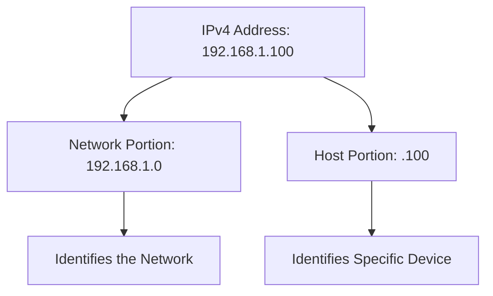
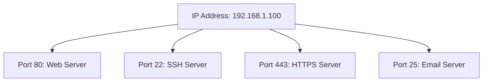
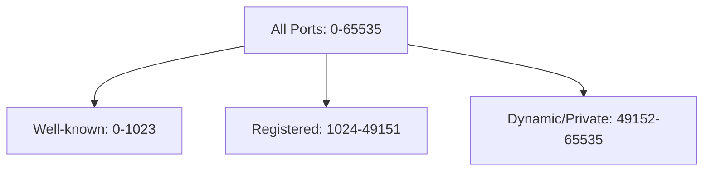
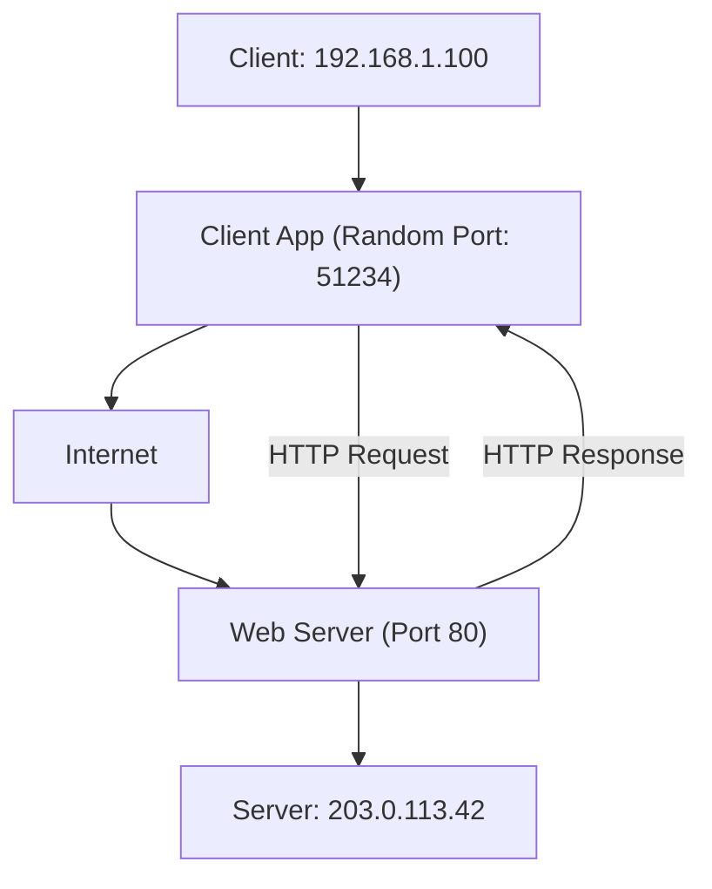
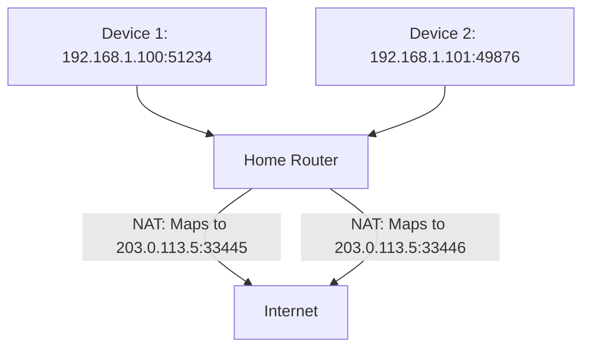
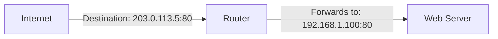

# Day 3: IP Addresses, Ports, and Application Mapping

## 1. Understanding IP Addresses

IP addresses serve as unique identifiers for devices on a network. They function like postal addresses for data packets, ensuring information reaches the correct destination.

### IPv4 Addresses

IPv4 uses a 32-bit addressing scheme represented as four decimal numbers (0-255) separated by dots.

```
Example: 192.168.1.100
```



#### IPv4 Address Classes

| Class | First Octet Range | Default Subnet Mask | Use Case |
|-------|-------------------|---------------------|----------|
| A     | 1-126             | 255.0.0.0           | Large networks |
| B     | 128-191           | 255.255.0.0         | Medium networks |
| C     | 192-223           | 255.255.255.0       | Small networks |
| D     | 224-239           | N/A                 | Multicast |
| E     | 240-255           | N/A                 | Experimental |

#### Special IPv4 Addresses

- **Private Addresses**: For internal networks only
  - 10.0.0.0 - 10.255.255.255 (10.0.0.0/8) - Class A private network
  - 172.16.0.0 - 172.31.255.255 (172.16.0.0/12) - Class B private network
  - 192.168.0.0 - 192.168.255.255 (192.168.0.0/16) - Class C private network
  
- **Loopback**: 127.0.0.0/8 network (127.0.0.1 - 127.255.255.255) - Reserved for localhost communications
  - 127.0.0.1 is the most commonly used loopback address
  - Any packet sent to a 127.x.x.x address will loop back to the same machine
  - Used for testing network services without going through the network

- **APIPA**: 169.254.0.0/16 - Automatically assigned when DHCP fails

- **Reserved Addresses**:
  - 0.0.0.0/8 - Represents "this network"
  - 255.255.255.255 - Broadcast address for "all hosts on local network"
  - 224.0.0.0/4 - Multicast addresses
  - 240.0.0.0/4 - Reserved for future use (Class E)

### IPv6 Addresses

IPv6 uses a 128-bit addressing scheme represented as eight groups of four hexadecimal digits separated by colons.

```
Example: 2001:0db8:85a3:0000:0000:8a2e:0370:7334
```

IPv6 addresses can be simplified by:
1. Removing leading zeros in each group: `2001:db8:85a3:0:0:8a2e:370:7334`
2. Replacing consecutive zero groups with `::` (only once): `2001:db8:85a3::8a2e:370:7334`


*IPv6 address structure. Source: Wikipedia*

## 2. Understanding Ports

Ports are virtual endpoints that identify specific applications or services running on a device. They allow a single IP address to host multiple services.



### Port Numbers and Range

A port is identified by a 16-bit number, which means there are 2^16 = 65,536 possible ports (0-65535) on any IP address.



### Port Ranges

- **Well-known Ports (0-1023)**: Reserved for standardized services, require administrative privileges
  - These ports are strictly regulated by IANA (Internet Assigned Numbers Authority)
  - Examples: HTTP (80), HTTPS (443), SSH (22), FTP (21), SMTP (25), DNS (53)
  - Generally requires root/administrator privileges to bind services to these ports

- **Registered Ports (1024-49151)**: Registered with IANA but can be used by regular applications
  - Many common applications register these ports for their services
  - Examples: MySQL (3306), PostgreSQL (5432), MongoDB (27017), Redis (6379), RDP (3389)
  - Regular users can bind to these ports without special privileges
  - Many development frameworks use ports in this range (Node.js: 3000, React: 3000, Django: 8000)

- **Dynamic/Private Ports (49152-65535)**: Used for temporary connections
  - Operating systems typically use these for outgoing client connections
  - Not intended for permanently running services
  - Used when your browser connects to websites or applications make network requests

### Reserved Port Examples

- **Port 0**: Reserved, not used for network connections
- **Ports 1-1023**: Require root/administrator privileges on Unix-like systems
- **Port 127.0.0.1:8080**: Commonly used for local development servers
- **Localhost Ports**: Any port on 127.0.0.1 (localhost) is only accessible from the local machine
- **Port 631**: Reserved for Internet Printing Protocol
- **Ports 1433-1434**: Microsoft SQL Server
- **Port 3389**: Microsoft Remote Desktop Protocol
- **Ports 49152-65535**: Recommended range for ephemeral/dynamic client ports

## 3. Common Port to Application Mappings

### Well-Known Ports (0-1023)

| Port | Protocol | Application | Description |
|------|----------|-------------|-------------|
| 20/21 | TCP | FTP | File Transfer Protocol (20-data, 21-control) |
| 22 | TCP | SSH | Secure Shell |
| 23 | TCP | Telnet | Remote terminal access (insecure) |
| 25 | TCP | SMTP | Simple Mail Transfer Protocol (email sending) |
| 53 | TCP/UDP | DNS | Domain Name System |
| 67/68 | UDP | DHCP | Dynamic Host Configuration Protocol |
| 69 | UDP | TFTP | Trivial File Transfer Protocol |
| 80 | TCP | HTTP | Hypertext Transfer Protocol |
| 110 | TCP | POP3 | Post Office Protocol version 3 (email retrieval) |
| 119 | TCP | NNTP | Network News Transfer Protocol |
| 123 | UDP | NTP | Network Time Protocol |
| 137-139 | TCP/UDP | NetBIOS | NetBIOS Name/Datagram/Session Service |
| 143 | TCP | IMAP | Internet Message Access Protocol (email retrieval) |
| 161/162 | UDP | SNMP | Simple Network Management Protocol |
| 389 | TCP | LDAP | Lightweight Directory Access Protocol |
| 443 | TCP | HTTPS | HTTP Secure |
| 465 | TCP | SMTPS | SMTP over SSL (deprecated, use 587) |
| 514 | UDP | Syslog | System Logging Protocol |
| 587 | TCP | SMTP | SMTP with TLS (email submission) |
| 636 | TCP | LDAPS | LDAP over SSL |
| 993 | TCP | IMAPS | IMAP over SSL |
| 995 | TCP | POP3S | POP3 over SSL |

### Registered Ports (1024-49151)

| Port | Protocol | Application | Description |
|------|----------|-------------|-------------|
| 1194 | TCP/UDP | OpenVPN | OpenVPN service |
| 1433 | TCP | MSSQL | Microsoft SQL Server |
| 1521 | TCP | Oracle | Oracle Database |
| 1723 | TCP | PPTP | Point-to-Point Tunneling Protocol |
| 1812/1813 | UDP | RADIUS | Remote Authentication Dial-In User Service |
| 2049 | TCP/UDP | NFS | Network File System |
| 3128 | TCP | Squid | Squid proxy server |
| 3306 | TCP | MySQL | MySQL Database |
| 3389 | TCP | RDP | Remote Desktop Protocol |
| 5060/5061 | TCP/UDP | SIP | Session Initiation Protocol (VoIP) |
| 5222 | TCP | XMPP | Extensible Messaging and Presence Protocol |
| 5432 | TCP | PostgreSQL | PostgreSQL Database |
| 5900 | TCP | VNC | Virtual Network Computing |
| 6379 | TCP | Redis | Redis database |
| 8080 | TCP | HTTP Alternate | Alternative HTTP port (often for proxies) |
| 8443 | TCP | HTTPS Alternate | Alternative HTTPS port |
| 9100 | TCP | Printer | Network printing |
| 27017 | TCP | MongoDB | MongoDB database |

### Dynamic/Private Ports of Interest

| Port | Protocol | Application | Description |
|------|----------|-------------|-------------|
| 49152-65535 | TCP/UDP | Ephemeral | Temporary ports for client connections |

## 4. Device-to-Application Communication

When data travels between devices, both IP addresses and ports work together to ensure proper delivery.



### Communication Process

1. **Client-side**:
   - Your device has an IP address (e.g., 192.168.1.100)
   - The browser or app creates a connection using a random port (e.g., 51234)
   - The connection contains destination IP and port (e.g., 203.0.113.42:80)

2. **Server-side**:
   - The server with IP 203.0.113.42 receives the request on port 80
   - The web server application listening on port 80 processes the request
   - The response is sent back to the client's IP and port (192.168.1.100:51234)

3. **Socket Pair**:
   - Each connection is uniquely identified by a socket pair:
   - Source IP:Port + Destination IP:Port
   - This allows multiple connections to the same service

## 5. Network Address Translation (NAT) and Ports

NAT allows multiple devices to share a single public IP address by mapping internal IP:port combinations to external ports.



### Port Forwarding

Port forwarding allows external traffic to reach specific internal devices:



## 6. The Physical Internet: Submarine Cables

While we often think of the internet as wireless or "in the cloud," the global internet actually relies on a vast network of physical cables, including undersea submarine cables that connect continents.


*World map of submarine cables. Source: TeleGeography/Wikipedia*

### Key Facts About Submarine Cables

- Over 420 submarine cables in service worldwide, spanning more than 1.3 million kilometers
- Carry over 95% of international telecommunications data
- Modern cables use fiber optic technology to transmit data via light signals
- Each cable can contain multiple fiber pairs, with each pair capable of transmitting several terabits per second
- Cables are laid by specialized ships and typically buried in the seabed in shallow waters
- Average lifespan of 25 years, though many remain in service longer

### Impact on Global Internet

- These cables form the backbone of international internet connectivity
- Cable damage (from fishing trawlers, ship anchors, or natural disasters) can significantly disrupt internet services
- Geopolitical considerations influence cable routing and landing points
- New routes are constantly being planned and deployed to increase capacity and redundancy

For an interactive and current map of submarine cables worldwide, visit the [Submarine Cable Map](https://www.submarinecablemap.com/).

## 7. Identifying Network Applications

System administrators use several tools to identify which applications are using specific ports:

### On Linux:
```bash
$ sudo netstat -tulpn
Proto Local Address           Foreign Address         State       PID/Program name
tcp   0.0.0.0:22              0.0.0.0:*               LISTEN      845/sshd
tcp   0.0.0.0:80              0.0.0.0:*               LISTEN      1234/nginx
tcp   127.0.0.1:3306          0.0.0.0:*               LISTEN      956/mysqld
```

### On Windows:
```
C:\> netstat -ab
Proto  Local Address          Foreign Address        State         PID
TCP    0.0.0.0:80             0.0.0.0:0              LISTENING     4
 [httpd.exe]
TCP    0.0.0.0:443            0.0.0.0:0              LISTENING     4
 [httpd.exe]
TCP    0.0.0.0:3389           0.0.0.0:0              LISTENING     728
 [svchost.exe]
```

## 7. Practice Questions

1. If a web server and mail server are running on the same physical machine, how are the incoming requests directed to the correct application?

2. What happens if two applications on your computer try to use the same port?

3. Explain how NAT allows multiple devices to share a single public IP address.

4. Why does a client typically use random high-numbered ports when connecting to a server?

5. If you're troubleshooting a network connection issue with a web application, what specific information would you need about both the client and server?

## 8. Additional Resources

- [Internet Assigned Numbers Authority (IANA) Port Assignments](https://www.iana.org/assignments/service-names-port-numbers/service-names-port-numbers.xhtml)
- [RFC 1918: Address Allocation for Private Internets](https://tools.ietf.org/html/rfc1918)
- [RFC 4291: IPv6 Addressing Architecture](https://tools.ietf.org/html/rfc4291)
