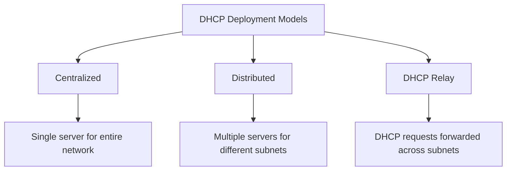
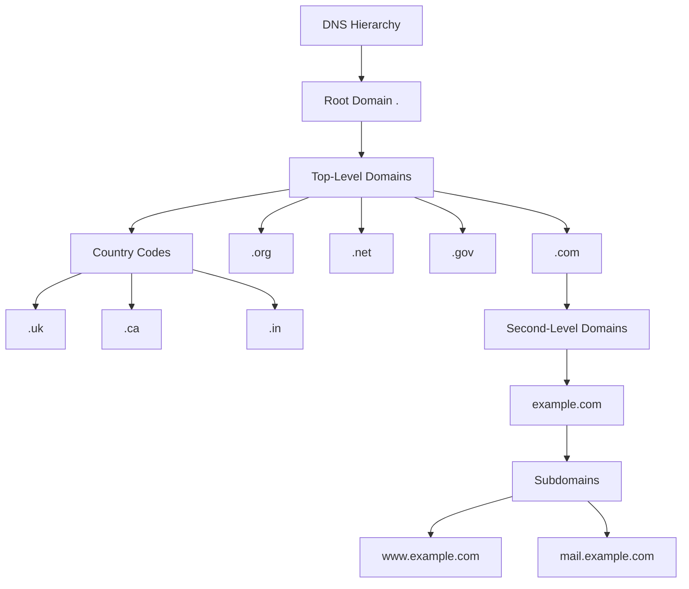
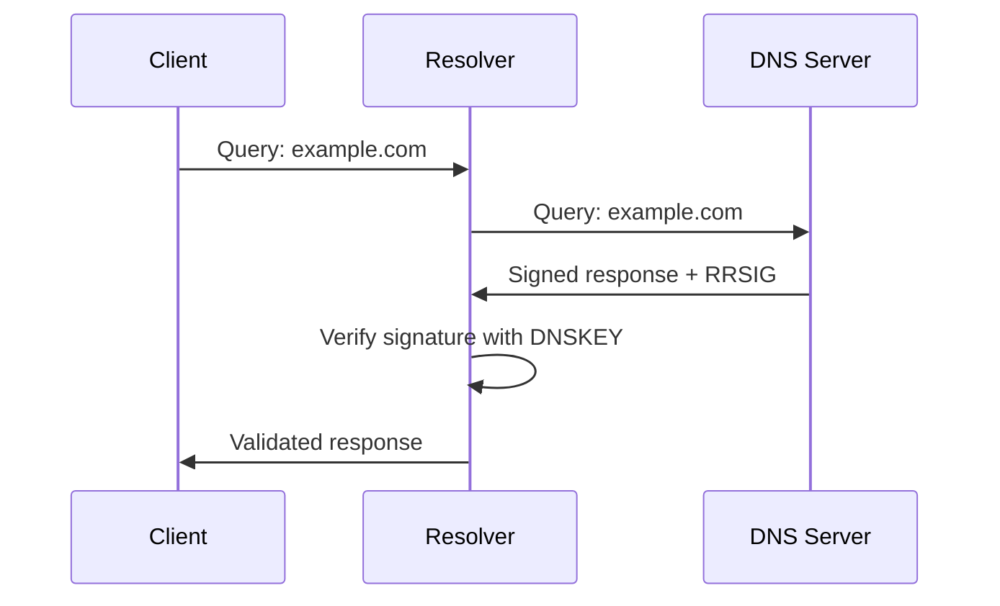
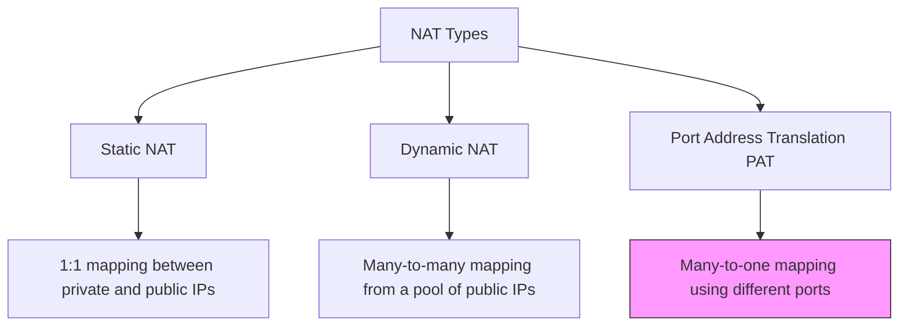

# Day 3: DHCP, DNS, and NAT

## Topics Covered
- DHCP in the Network
- Introduction to the DNS Service
- Introducing Network Address Translation

## 1. DHCP in the Network (Deep Dive)

Dynamic Host Configuration Protocol (DHCP) is essential for automatic IP address allocation and network parameter configuration in modern networks.

### DHCP Server Deployment Models



### DHCP Scopes and Options

A DHCP scope is a range of IP addresses that a DHCP server can lease to clients on a subnet.

**Important DHCP Options:**

| Option | Code | Description |
|--------|------|-------------|
| Subnet Mask | 1 | Specifies the client's subnet mask |
| Router | 3 | Default gateway addresses |
| DNS Servers | 6 | List of DNS server addresses |
| Domain Name | 15 | Domain name for DNS resolution |
| Lease Time | 51 | Duration of the IP address lease |
| DHCP Server ID | 54 | Identifier of the DHCP server |
| NTP Servers | 42 | Network Time Protocol servers |

### DHCP Configuration Example (on Linux)

```bash
# Install DHCP server
sudo apt-get install isc-dhcp-server

# Configure DHCP server
sudo nano /etc/dhcp/dhcpd.conf

# Add the following configuration
subnet 192.168.1.0 netmask 255.255.255.0 {
  range 192.168.1.100 192.168.1.200;
  option domain-name-servers 8.8.8.8, 8.8.4.4;
  option domain-name "example.local";
  option routers 192.168.1.1;
  option broadcast-address 192.168.1.255;
  default-lease-time 600;
  max-lease-time 7200;
}

# Restart DHCP service
sudo systemctl restart isc-dhcp-server
```

### DHCP Reservation and Exclusion

**DHCP Reservation** allows specific devices to always receive the same IP address based on their MAC address.

**Linux Configuration Example:**
```bash
host printer {
  hardware ethernet 00:11:22:33:44:55;
  fixed-address 192.168.1.50;
}
```

**DHCP Exclusion** defines IP addresses within a scope that should not be assigned dynamically.

## 2. DNS Service In-depth

Domain Name System (DNS) is the internet's directory service, translating domain names to IP addresses and providing other critical name resolution services.

### DNS Hierarchy



### DNS Zone Files

DNS zone files contain records for a particular domain and are maintained by authoritative DNS servers.

**Example Zone File:**
```
; Zone file for example.com
$TTL 86400
@       IN      SOA     ns1.example.com. admin.example.com. (
                        2023082401 ; Serial
                        3600       ; Refresh
                        1800       ; Retry
                        604800     ; Expire
                        86400 )    ; Minimum TTL

; Name servers
@       IN      NS      ns1.example.com.
@       IN      NS      ns2.example.com.

; A records
@       IN      A       203.0.113.10
www     IN      A       203.0.113.10
mail    IN      A       203.0.113.20

; MX records
@       IN      MX      10 mail.example.com.

; CNAME records
ftp     IN      CNAME   www
```

### DNS Server Types

1. **Authoritative DNS Servers**
   - Primary (master) servers
   - Secondary (slave) servers
   - Hold official records for domains

2. **Recursive DNS Servers**
   - Process client queries
   - Perform recursive queries
   - Cache results
   - Often provided by ISPs or public services (Google, Cloudflare)

3. **Forwarding DNS Servers**
   - Forward queries to other DNS servers
   - Can implement caching and filtering

### DNS Security Extensions (DNSSEC)

DNSSEC adds security to DNS by providing:
- Authentication of DNS data
- Verification of data integrity
- Authenticated denial of existence



## 3. Network Address Translation (NAT)

NAT allows private IP addresses to be translated to public IP addresses, enabling multiple devices to share a single public IP address.

### Types of NAT



### PAT (NAT Overload) Process

Port Address Translation (PAT), also known as NAT Overload, is the most common form of NAT used in home and small business networks.

```mermaid
sequenceDiagram
    participant Internal Host (192.168.1.10)
    participant NAT Router (Public IP: 203.0.113.5)
    participant External Server (8.8.8.8)
    
    Internal Host (192.168.1.10)->>NAT Router (Public IP: 203.0.113.5): Source: 192.168.1.10:45678<br>Dest: 8.8.8.8:80
    NAT Router (Public IP: 203.0.113.5)->>External Server (8.8.8.8): Source: 203.0.113.5:24680<br>Dest: 8.8.8.8:80
    External Server (8.8.8.8)->>NAT Router (Public IP: 203.0.113.5): Source: 8.8.8.8:80<br>Dest: 203.0.113.5:24680
    NAT Router (Public IP: 203.0.113.5)->>Internal Host (192.168.1.10): Source: 8.8.8.8:80<br>Dest: 192.168.1.10:45678
```

### NAT Configuration Example (Cisco Router)

```
! Configure inside interface
interface GigabitEthernet0/0
 ip address 192.168.1.1 255.255.255.0
 ip nat inside
 
! Configure outside interface
interface GigabitEthernet0/1
 ip address 203.0.113.5 255.255.255.252
 ip nat outside
 
! Define access list for NAT
access-list 1 permit 192.168.1.0 0.0.0.255
 
! Configure PAT (NAT Overload)
ip nat inside source list 1 interface GigabitEthernet0/1 overload
```

### NAT Advantages and Disadvantages

**Advantages:**
- Conservation of public IPv4 addresses
- Enhanced security by hiding internal network structure
- Simplified routing between merged networks with overlapping addresses
- Easy implementation and cost-effective

**Disadvantages:**
- Breaks end-to-end connectivity model of IP
- Complicates tunneling protocols (IPsec, VPNs)
- Connection tracking consumes router resources
- Some applications don't work well with NAT
- Delays transition to IPv6

## Special NAT Implementations

### Port Forwarding

Port forwarding allows external users to reach services on internal servers.

```
! Example port forwarding configuration (Cisco)
ip nat inside source static tcp 192.168.1.100 80 203.0.113.5 80
```

### NAT64

NAT64 is a mechanism to allow IPv6-only clients to communicate with IPv4-only servers.

## Additional Resources

- [RFC 2131 - DHCP](https://datatracker.ietf.org/doc/html/rfc2131)
- [RFC 1034 - DNS Concepts](https://datatracker.ietf.org/doc/html/rfc1034)
- [RFC 3022 - Traditional NAT](https://datatracker.ietf.org/doc/html/rfc3022)
- [DNS Security Extensions (DNSSEC)](https://www.icann.org/resources/pages/dnssec-what-is-it-why-important-2019-03-05-en)

## Practice Questions

1. What happens if there are multiple DHCP servers on the same network? How do clients choose which offer to accept?
2. Explain how a DNS server would resolve a request for a subdomain like mail.example.com when it only has information about example.com.
3. Design a NAT implementation for a small business with a web server that needs to be accessible from the internet.
4. How does DNSSEC protect against DNS cache poisoning attacks?
