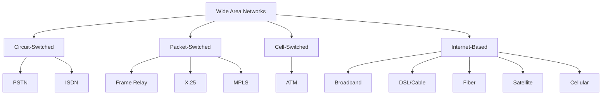
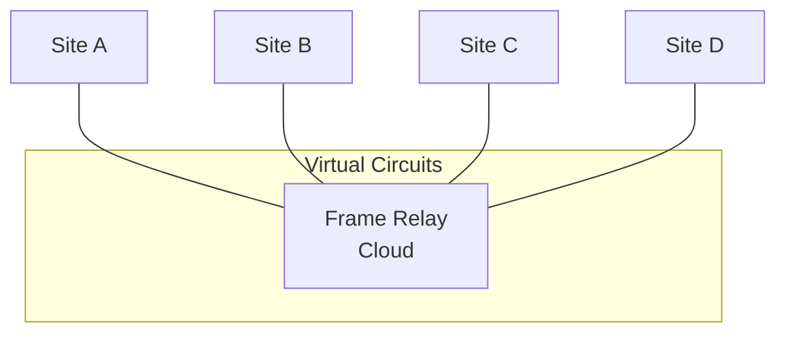
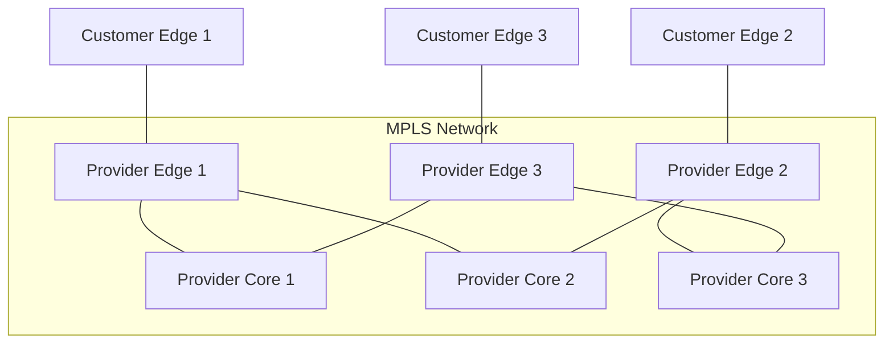
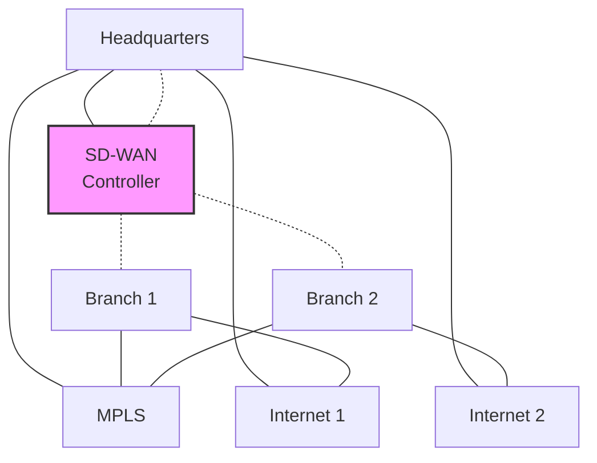
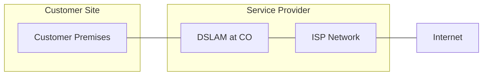
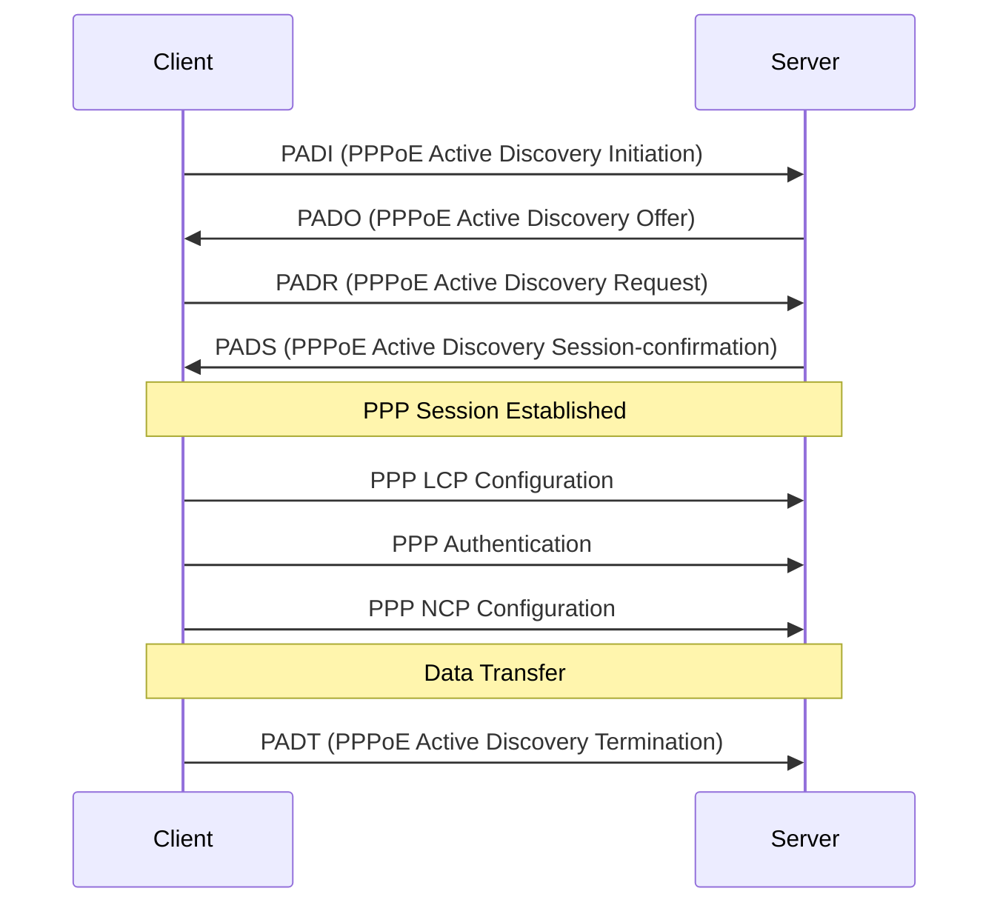
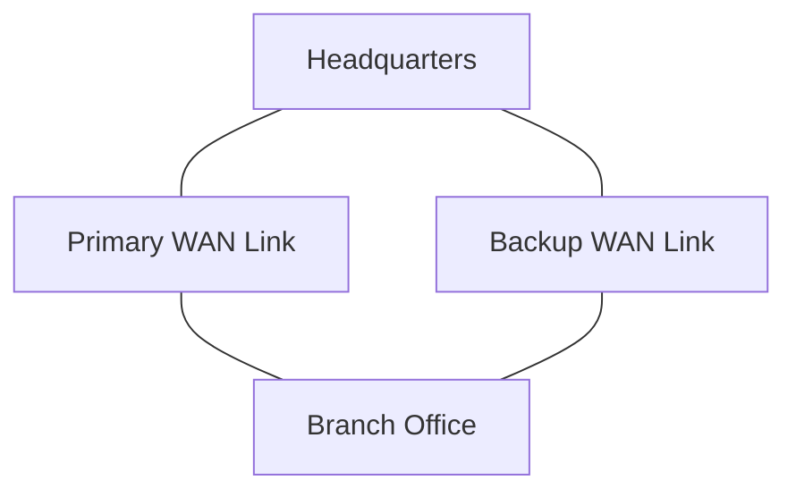
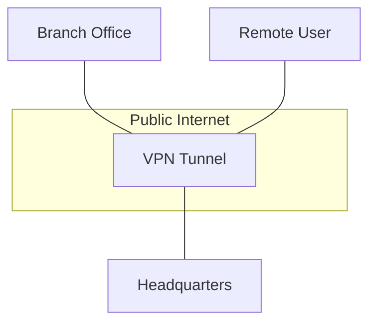

# Day 4: WAN Technologies

## Topics Covered
- WAN Technologies (Part 1)
- WAN Technologies (Part 2)
- WAN Technologies (Part 3)
- WAN Technologies (Part 4)

## 1. Introduction to Wide Area Networks (WANs)

A Wide Area Network (WAN) connects LANs across geographical distances, enabling communication between organizations, branch offices, and remote sites.



## 2. Traditional WAN Technologies

### Leased Lines

Leased lines are dedicated point-to-point connections between two locations.

**Characteristics:**
- Dedicated bandwidth
- High reliability
- High cost
- Fixed capacity

**Types of Leased Lines:**
- T1/E1 (1.544/2.048 Mbps)
- T3/E3 (44.736/34.368 Mbps)
- OC-3, OC-12, OC-48, etc. (155 Mbps to 2.5 Gbps+)


### Frame Relay

Frame Relay is a packet-switching technology that operates at the data link layer (Layer 2).

**Key Concepts:**
- **PVC (Permanent Virtual Circuit)**: Predefined logical path between endpoints
- **DLCI (Data Link Connection Identifier)**: Identifies PVCs
- **CIR (Committed Information Rate)**: Guaranteed minimum bandwidth



### Asynchronous Transfer Mode (ATM)

ATM is a cell-switching technology using fixed-size 53-byte cells.

**Characteristics:**
- Fixed cell size (53 bytes)
- Connection-oriented
- Quality of Service (QoS) support
- Virtual circuits

**ATM Service Categories:**
- CBR (Constant Bit Rate)
- VBR-rt (Variable Bit Rate - real time)
- VBR-nrt (Variable Bit Rate - non-real time)
- ABR (Available Bit Rate)
- UBR (Unspecified Bit Rate)

## 3. Modern WAN Technologies

### Multiprotocol Label Switching (MPLS)

MPLS is a routing technique that directs data using short path labels instead of long network addresses.



**MPLS Benefits:**
- Traffic engineering capabilities
- QoS support
- VPN support
- Protocol independence
- Improved performance

**MPLS VPN Types:**
- Layer 3 VPNs (IP VPNs)
- Layer 2 VPNs (VPWS, VPLS)

### Software-Defined WAN (SD-WAN)

SD-WAN is an application of software-defined networking (SDN) for WAN connections.



**SD-WAN Features:**
- Centralized control and management
- Dynamic path selection
- Application-aware routing
- Zero-touch provisioning
- Integrated security
- Cloud integration

**SD-WAN Benefits:**
- Lower cost compared to MPLS
- Improved application performance
- Simplified management
- Enhanced security
- Increased agility and flexibility

## 4. Internet-Based WAN Technologies

### Digital Subscriber Line (DSL)

DSL technology provides digital data transmission over telephone lines.

**DSL Types:**
- ADSL (Asymmetric DSL)
- SDSL (Symmetric DSL)
- VDSL (Very-high-bit-rate DSL)
- HDSL (High-bit-rate DSL)

**ADSL Connection Diagram:**


### Cable Broadband

Cable broadband uses the cable television infrastructure to provide internet access.

**Components:**
- CMTS (Cable Modem Termination System)
- Cable modem
- HFC (Hybrid Fiber-Coaxial) network

**Characteristics:**
- Shared medium (neighborhood)
- Higher download than upload speeds
- Bandwidth fluctuations during peak usage

### Fiber Optic Internet

Fiber optic internet uses light signals over fiber optic cables to transmit data.

**Types:**
- FTTH (Fiber to the Home)
- FTTB (Fiber to the Building)
- FTTC (Fiber to the Curb)

**Benefits:**
- Very high bandwidth (up to 10 Gbps)
- Low latency
- Long distance transmission
- Immune to electromagnetic interference

### Satellite Internet

Satellite internet provides connectivity via communications satellites.

**Types:**
- GEO (Geostationary Earth Orbit) - 35,786 km
- MEO (Medium Earth Orbit) - 2,000 to 35,786 km
- LEO (Low Earth Orbit) - 160 to 2,000 km

**Characteristics:**
- Global coverage, including remote areas
- Higher latency (especially for GEO)
- Weather sensitivity
- Improving speeds with new LEO constellations (Starlink, OneWeb)

## 5. WAN Connectivity Protocols

### Point-to-Point Protocol (PPP)

PPP is a data link protocol used to establish a direct connection between two nodes.

**PPP Components:**
- LCP (Link Control Protocol)
- NCP (Network Control Protocol)
- Authentication protocols (PAP, CHAP)

**PPP Frame Format:**
```
+------+------+------+-------------+------+
| Flag | Addr | Ctrl |    Data     | FCS  |
+------+------+------+-------------+------+
```

### PPP over Ethernet (PPPoE)

PPPoE combines Ethernet and PPP to provide authentication, encryption, and compression for Ethernet connections.

**PPPoE Process:**
1. Discovery stage (finds PPPoE server)
2. Session stage (establishes PPP session)



## 6. WAN Design Considerations

### Bandwidth Requirements

Calculate bandwidth needs based on:
- Number of users
- Application requirements
- Growth projections
- Peak usage patterns

**Bandwidth Calculation Example:**
```
Total bandwidth = (Number of users × Average usage per user) + Overhead
```

### Redundancy and Failover

Implement redundancy to ensure business continuity:



**Redundancy Techniques:**
- Dual WAN connections
- Diverse routing paths
- Different service providers
- Automatic failover

### Quality of Service (QoS)

QoS techniques prioritize critical traffic:

**QoS Mechanisms:**
- Classification and marking
- Congestion management (queuing)
- Congestion avoidance
- Traffic policing and shaping
- Link efficiency mechanisms

**Traffic Classification:**
```
Voice > Video > Critical data > General data > Background
```

## 7. WAN Security

### Secure VPN Technologies

Virtual Private Networks (VPNs) create secure connections over public networks.

**VPN Types:**
- Site-to-Site VPNs
- Remote Access VPNs



**VPN Protocols:**
- IPsec (Internet Protocol Security)
- SSL/TLS VPN
- PPTP (Point-to-Point Tunneling Protocol)
- L2TP/IPsec (Layer 2 Tunneling Protocol with IPsec)
- OpenVPN
- WireGuard

### WAN Encryption

Encryption protects data confidentiality over WAN links.

**Encryption Methods:**
- IPsec
- TLS/SSL
- MACsec (for Layer 2)

## Additional Resources

- [MPLS Architecture (RFC 3031)](https://tools.ietf.org/html/rfc3031)
- [PPP Protocol (RFC 1661)](https://tools.ietf.org/html/rfc1661)
- [Cisco SD-WAN Documentation](https://www.cisco.com/c/en/us/solutions/enterprise-networks/sd-wan/index.html)
- [IPsec VPN Design Considerations](https://www.cisco.com/c/en/us/support/docs/security-vpn/ipsec-negotiation-ike-protocols/14159-IPSec-part1.html)

## Practice Questions

1. Compare and contrast MPLS and SD-WAN technologies. When would you recommend each?
2. Design a redundant WAN solution for a company with headquarters and three branch offices.
3. Calculate the bandwidth requirements for a 100-user office where each user needs an average of 500 Kbps, voice traffic requires 2 Mbps, and video conferencing needs 10 Mbps.
4. Explain the PPPoE discovery process and why it's used in DSL connections.
