# Day 4: Network Types and Wireless Technologies

## 1. Network Classifications by Geographic Scale

Networks are categorized based on their geographic reach, from personal device connections to global networks.

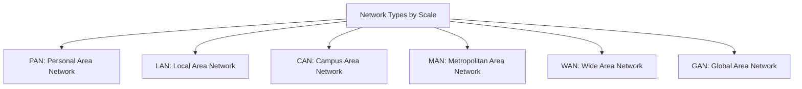

### Personal Area Network (PAN)

A network of personal devices centered around an individual person.

- **Range**: ~10 meters (33 feet)
- **Typical Speed**: 1-3 Mbps (Bluetooth), up to 480 Mbps (USB)
- **Common Technologies**: Bluetooth, NFC, Zigbee, USB
- **Use Cases**: Connecting peripherals to a computer, wearable devices, personal health monitoring

#### PAN Technologies

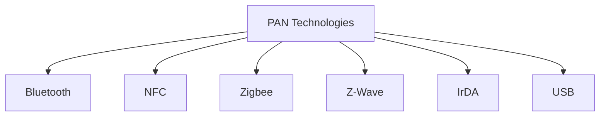

1. **Bluetooth**: Wireless PAN standard
   - 2.4 GHz frequency band
   - Various ranges and speeds depending on class and version
   - Low power consumption in newer versions (BLE)
   - Primarily for short-range device connections

2. **NFC (Near Field Communication)**:
   - Very short range (~4 cm)
   - 13.56 MHz frequency
   - Speeds up to 424 Kbps
   - Used for contactless payments, access cards

3. **Zigbee**: Low-power mesh network
   - 2.4 GHz, 915 MHz, and 868 MHz bands
   - 250 Kbps data rate
   - Mesh topology allows extended range
   - Used for home automation, IoT devices

4. **Z-Wave**: Low-power mesh network
   - 908.42 MHz frequency (US)
   - 100 Kbps data rate
   - Better wall penetration than 2.4 GHz technologies
   - Used for smart home devices

5. **IrDA (Infrared Data Association)**:
   - Line-of-sight infrared communication
   - Range of ~1 meter
   - Speeds up to 16 Mbps
   - Largely obsolete, replaced by Bluetooth and Wi-Fi
   - Still used in some remote controls

6. **USB (Universal Serial Bus)**:
   - Wired connection standard
   - USB 2.0: 480 Mbps
   - USB 3.0: 5 Gbps
   - USB 3.1: 10 Gbps
   - USB 3.2: 20 Gbps
   - USB4: 40 Gbps
   - Primary method for connecting peripherals to computers

*Example of a Bluetooth PAN connecting multiple personal devices. Source: Wikipedia*

### Local Area Network (LAN)

A network that connects computers and devices in a limited area, such as a home, office, or building.

- **Range**: ~100 meters (328 feet) for Ethernet, ~50 meters (164 feet) for Wi-Fi
- **Typical Speed**: 100 Mbps-10 Gbps (Ethernet), 150 Mbps-1 Gbps (Wi-Fi)
- **Common Technologies**: Ethernet, Wi-Fi
- **Use Cases**: Office networks, home networks, school networks

#### LAN Technologies

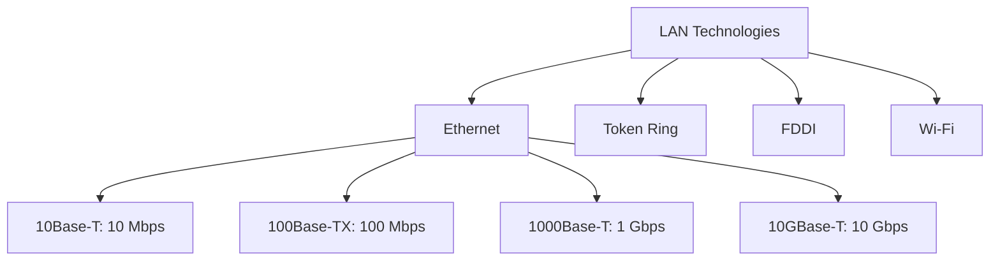

1. **Ethernet**: The dominant LAN technology
   - Defined by IEEE 802.3 standards
   - CSMA/CD (Carrier Sense Multiple Access with Collision Detection)
   - Speeds from 10 Mbps to 400 Gbps
   - Star topology with switches at the center

2. **Token Ring**: Legacy IBM technology
   - Defined by IEEE 802.5
   - Token-passing mechanism prevents collisions
   - Speeds of 4 Mbps and 16 Mbps
   - Ring topology
   - Largely obsolete, replaced by Ethernet

3. **FDDI (Fiber Distributed Data Interface)**:
   - Dual counter-rotating ring topology
   - 100 Mbps speed
   - Fault-tolerant design
   - Used primarily as a backbone technology
   - Largely replaced by faster Ethernet and fiber technologies

4. **Wi-Fi**: Wireless LAN technology
   - Defined by IEEE 802.11 standards
   - Star topology with access points
   - Various speeds depending on standard (see Wireless section)

### Campus Area Network (CAN)

Multiple LANs connected within a limited geographic area, like a university or business campus.

- **Range**: Several buildings within a few kilometers
- **Typical Speed**: 1-100 Gbps
- **Common Technologies**: Fiber optic Ethernet, microwave links
- **Use Cases**: University campuses, corporate complexes, hospital systems

### Metropolitan Area Network (MAN)

A network spanning a city or large campus, larger than a LAN but smaller than a WAN.

- **Range**: 5-50 kilometers (3-30 miles)
- **Typical Speed**: 10 Gbps-100 Gbps
- **Common Technologies**: Fiber optic, WiMAX
- **Use Cases**: City government networks, connected traffic systems, cable TV networks

#### MAN Technologies

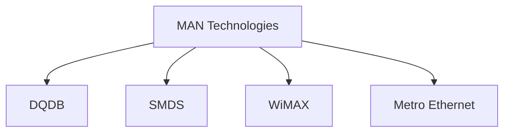

1. **DQDB (Distributed Queue Dual Bus)**:
   - IEEE 802.6 standard
   - Dual bus architecture
   - Speeds up to 155 Mbps
   - Now largely obsolete
   - Used primarily in telecommunications

2. **SMDS (Switched Multimegabit Data Service)**:
   - Packet-switched technology
   - Speeds from 1.5 Mbps to 45 Mbps
   - Connectionless service
   - Predecessor to ATM and Frame Relay
   - Now obsolete

3. **WiMAX (Worldwide Interoperability for Microwave Access)**:
   - IEEE 802.16 standard
   - Wireless broadband technology
   - Range up to 50 kilometers
   - Speeds up to 1 Gbps
   - Alternative to wired broadband access

4. **Metro Ethernet**:
   - Ethernet technology extended to metropolitan areas
   - Uses fiber optic connections
   - Speeds from 10 Mbps to 100 Gbps
   - Carrier Ethernet services
   - Commonly used by businesses for site-to-site connectivity

### Wide Area Network (WAN)

A network that covers a large geographic area, often connecting LANs across cities, countries, or continents.

- **Range**: Unlimited (global)
- **Typical Speed**: 1.5 Mbps-100 Gbps
- **Common Technologies**: Leased lines, MPLS, satellite, cellular
- **Use Cases**: Corporate networks spanning multiple locations, internet backbone

#### WAN Technologies

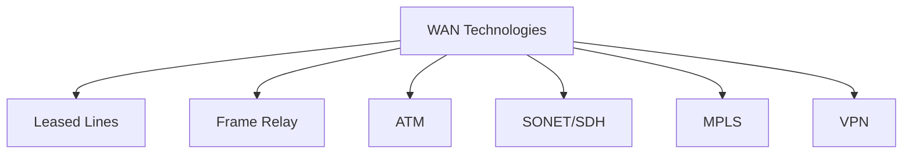

1. **Leased Lines**: Dedicated point-to-point connections
   - T1 (1.544 Mbps), T3 (44.736 Mbps), E1 (2.048 Mbps), E3 (34.368 Mbps)
   - Guaranteed bandwidth and security
   - High cost compared to other options

2. **Frame Relay**: Packet-switching technology
   - Speeds from 56 Kbps to 45 Mbps
   - Uses virtual circuits for multiple connections
   - More cost-effective than leased lines
   - Largely obsolete today, replaced by MPLS

3. **ATM (Asynchronous Transfer Mode)**:
   - Fixed-size 53-byte cells
   - Speeds from 1.5 Mbps to 622 Mbps
   - Low latency, good for voice and video
   - Complex and expensive, mostly replaced by MPLS

4. **SONET/SDH (Synchronous Optical Network/Synchronous Digital Hierarchy)**:
   - Fiber optic transmission standard
   - Speeds from 51.84 Mbps (OC-1) to 39.8 Gbps (OC-768)
   - Highly reliable with self-healing ring architecture
   - Used for telecommunications backbone
   - SDH is the international equivalent of SONET

5. **MPLS (Multiprotocol Label Switching)**:
   - Packet forwarding using labels instead of IP lookups
   - Speeds from 1.5 Mbps to 100 Gbps
   - Traffic engineering and QoS capabilities
   - Widely used for enterprise WANs and service provider networks

6. **VPN (Virtual Private Network)**:
   - Creates secure tunnels over public networks
   - Speeds limited by underlying connection
   - Types: Site-to-site VPN, Remote access VPN
   - Technologies: IPsec, SSL/TLS, WireGuard

### Global Area Network (GAN)

A network that spans the entire globe, supporting worldwide communications.

- **Range**: Global
- **Typical Speed**: Varies widely depending on technology
- **Common Technologies**: Satellite systems, undersea fiber optic cables
- **Use Cases**: Internet, global banking systems, international research networks

## 2. Physical Network Technologies

Physical networks use cables to transmit data between devices.

### Twisted Pair Copper Cable

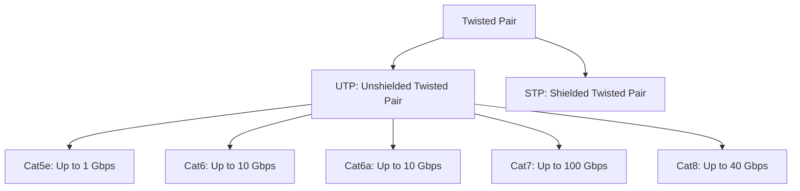

- **Cat5e**: 1 Gbps up to 100 meters
- **Cat6**: 10 Gbps up to 55 meters, 1 Gbps up to 100 meters
- **Cat6a**: 10 Gbps up to 100 meters
- **Cat7**: 10 Gbps up to 100 meters, with better shielding
- **Cat8**: 25-40 Gbps up to 30 meters

*Cat5e Ethernet cable with RJ-45 connector. Source: Wikipedia*

### Fiber Optic Cable

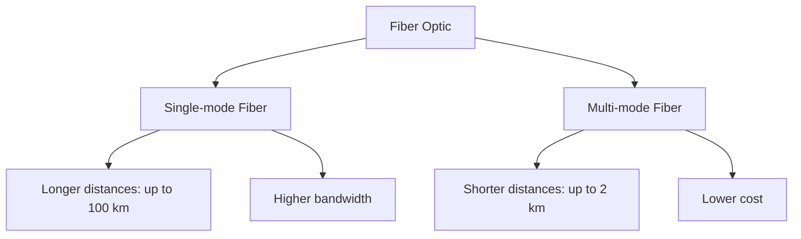

- **Single-mode Fiber**: Long-distance transmission (up to 100 km)
  - Uses single light path
  - Higher bandwidth
  - More expensive

- **Multi-mode Fiber**: Shorter distances (up to 2 km)
  - Uses multiple light paths
  - Lower cost
  - Higher signal attenuation

*Fiber optic cable showing the glass core. Source: Wikipedia*

### Coaxial Cable

- Used primarily for cable TV and some legacy networks
- Consists of a central conductor surrounded by insulation and a conductive shield
- Speeds up to 10 Gbps
- Better immunity to interference than twisted pair

## 3. Wireless Network Technologies

Wireless networks transmit data using radio waves, infrared, or other wireless signals.

### Wi-Fi Standards

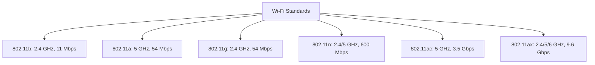

| Standard | Brand Name | Frequency | Max Speed | Range (Indoor) | Range (Outdoor) |
|----------|------------|-----------|-----------|----------------|-----------------|
| 802.11b  | Wi-Fi 1    | 2.4 GHz   | 11 Mbps   | ~35m (115ft)   | ~100m (330ft)   |
| 802.11a  | Wi-Fi 2    | 5 GHz     | 54 Mbps   | ~35m (115ft)   | ~120m (390ft)   |
| 802.11g  | Wi-Fi 3    | 2.4 GHz   | 54 Mbps   | ~38m (125ft)   | ~140m (460ft)   |
| 802.11n  | Wi-Fi 4    | 2.4/5 GHz | 600 Mbps  | ~70m (230ft)   | ~250m (820ft)   |
| 802.11ac | Wi-Fi 5    | 5 GHz     | 3.5 Gbps  | ~35m (115ft)   | ~120m (390ft)   |
| 802.11ax | Wi-Fi 6    | 2.4/5/6 GHz | 9.6 Gbps | ~35m (115ft)   | ~120m (390ft)   |
| 802.11be | Wi-Fi 7    | 2.4/5/6 GHz | 46 Gbps  | ~35m (115ft)   | ~120m (390ft)   |

### Bluetooth

- **Range**: 
  - Class 1: ~100 meters (328 feet)
  - Class 2: ~10 meters (33 feet) - Most common
  - Class 3: ~1 meter (3.3 feet)

- **Versions**:
  - Bluetooth 4.0 (BLE): 1 Mbps
  - Bluetooth 5.0: 2 Mbps
  - Bluetooth 5.1-5.3: 2 Mbps with location capabilities
  - Bluetooth 5.4: 4 Mbps

### Zigbee and Z-Wave

- **Zigbee**:
  - Range: 10-100 meters
  - Speed: 250 Kbps
  - Low power consumption
  - Used for: Home automation, IoT devices, industrial controls

- **Z-Wave**:
  - Range: ~30 meters indoors
  - Speed: 100 Kbps
  - Lower frequency (908.42 MHz in US) for better penetration
  - Used for: Smart home devices, security systems

### NFC (Near Field Communication)

- **Range**: ~4 centimeters (1.6 inches)
- **Speed**: 106-424 Kbps
- **Use Cases**: Contactless payments, transit cards, access control

## 4. Cellular Network Generations

The evolution of mobile telecommunications standards, from analog voice to high-speed digital data.

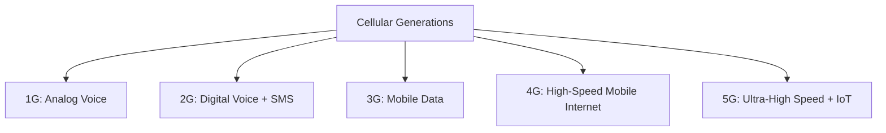

### 1G: First Generation (1980s)

- **Technology**: Analog signals
- **Speed**: 2.4 Kbps
- **Features**: Voice calls only
- **Standards**: AMPS, NMT, TACS
- **Range**: ~2-45 kilometers (cell tower dependent)

### 2G: Second Generation (1990s)

- **Technology**: Digital signals
- **Speed**: 64 Kbps (GPRS), 144 Kbps (EDGE)
- **Features**: Digital voice, SMS, basic data
- **Standards**: GSM, CDMA, TDMA
- **Range**: ~2-35 kilometers (cell tower dependent)

### 3G: Third Generation (2000s)

- **Technology**: Packet switching
- **Speed**: 144 Kbps-2 Mbps (UMTS), up to 42 Mbps (HSPA+)
- **Features**: Mobile internet, video calling, mobile TV
- **Standards**: UMTS, CDMA2000, HSPA
- **Range**: ~1-10 kilometers

### 4G: Fourth Generation (2010s)

- **Technology**: All-IP packet switching
- **Speed**: 100 Mbps-1 Gbps
- **Features**: High-speed mobile internet, HD video streaming, online gaming
- **Standards**: LTE, LTE-Advanced, WiMAX
- **Range**: ~1-5 kilometers

#### 4G LTE (Long Term Evolution)

- **LTE**: 100 Mbps download, 50 Mbps upload
- **LTE-Advanced**: 300 Mbps-1 Gbps download
- **Frequency Bands**: Varies by country, typically 700 MHz-2.6 GHz

### 5G: Fifth Generation (2020s)

- **Technology**: New Radio (NR) air interface
- **Speed**: 1-20 Gbps
- **Features**: Ultra-low latency (1ms), massive IoT connectivity, network slicing
- **Standards**: 5G NR
- **Range**:
  - mmWave (24-100 GHz): ~500 meters
  - Mid-band (1-6 GHz): ~1-2 kilometers
  - Low-band (600-900 MHz): ~10 kilometers

#### 5G Frequency Bands

- **Low-band**: 600-900 MHz - Greater coverage, lower speeds
- **Mid-band**: 1-6 GHz - Balance of speed and coverage
- **High-band (mmWave)**: 24-100 GHz - Extreme speeds, very limited range

*5G frequency bands and their characteristics. Source: Wikipedia*

## 5. Network Comparison

### Speed Comparison

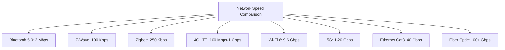

### Range Comparison

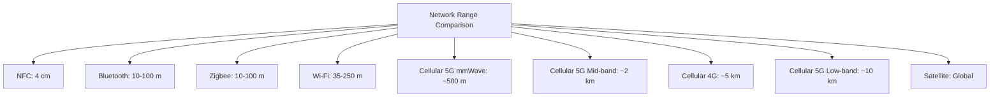

## 6. Practice Questions

1. What is the primary difference between a LAN and a WAN in terms of geographic coverage and typical technologies used?

2. Why would you choose fiber optic cabling over copper cabling for a network installation?

3. Compare the range and speed characteristics of Wi-Fi 6 and 5G networks. In what scenarios would each be preferable?

4. How does 5G technology improve upon 4G LTE beyond just increased speed?

5. If you were designing a smart home system, which wireless technologies would you consider using and why?

## 7. Additional Resources

- [IEEE 802 Standards](https://www.ieee802.org/)
- [Wi-Fi Alliance](https://www.wi-fi.org/)
- [Bluetooth SIG](https://www.bluetooth.com/)
- [3GPP - 5G Specifications](https://www.3gpp.org/)
