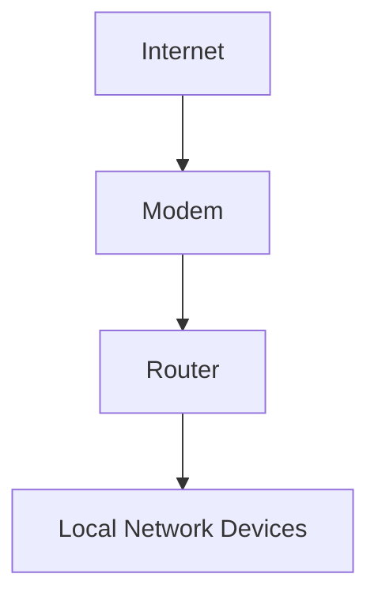
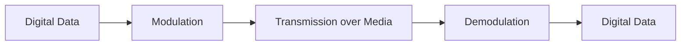
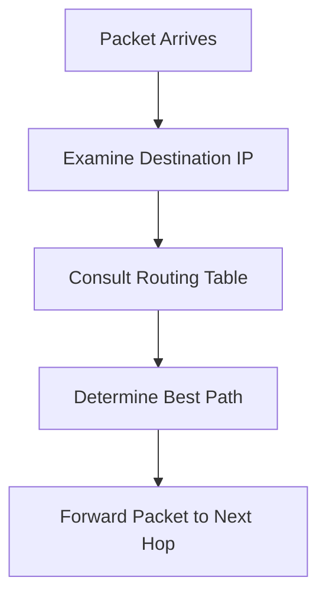
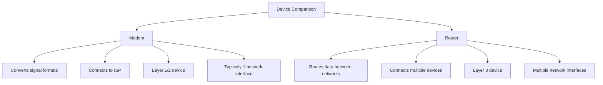
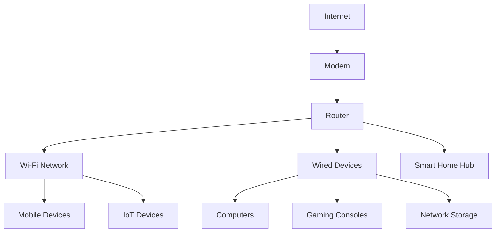

# Day 5: Network Cabling and Topologies

## Topics Covered
- Network Cabling (Part 1)
- Network Cabling (Part 2)
- Network Cabling (Part 3)
- Network Topologies
- Network Infrastructure Implementations
- Modems and Routers in Detail

## 1. Introduction to Network Cabling

Network cabling provides the physical medium for data transmission between network devices. Different types of cables have varying characteristics, advantages, and limitations.


## 2. Copper-Based Cabling

### Twisted Pair Cabling

Twisted pair cabling consists of pairs of insulated copper wires twisted together to reduce electromagnetic interference.

#### Unshielded Twisted Pair (UTP)

UTP cables are the most common network cables in modern LANs.

**UTP Cable Categories:**

| Category | Bandwidth | Speed | Applications |
|----------|-----------|-------|--------------|
| Cat 3 | 16 MHz | 10 Mbps | Legacy 10BASE-T Ethernet |
| Cat 5 | 100 MHz | 100 Mbps | Fast Ethernet |
| Cat 5e | 100 MHz | 1 Gbps | Gigabit Ethernet |
| Cat 6 | 250 MHz | 1-10 Gbps | Gigabit/10G Ethernet (limited distance) |
| Cat 6a | 500 MHz | 10 Gbps | 10G Ethernet (full distance) |
| Cat 7 | 600 MHz | 10+ Gbps | 10G Ethernet, Multiple applications |
| Cat 8 | 2000 MHz | 25-40 Gbps | Data centers, 25G/40G Ethernet |

**UTP Cable Structure:**

```
┌───────────────────────────┐
│   Outer Jacket            │
│ ┌─────────────────────┐   │
│ │  Twisted Wire Pairs  │   │
│ │  ┌───┐   ┌───┐      │   │
│ │  │ 1 │   │ 2 │      │   │
│ │  └───┘   └───┘      │   │
│ │  ┌───┐   ┌───┐      │   │
│ │  │ 3 │   │ 4 │      │   │
│ │  └───┘   └───┘      │   │
│ └─────────────────────┘   │
└───────────────────────────┘
```

#### Shielded Twisted Pair (STP)

STP cables include additional shielding to protect against electromagnetic interference (EMI).

**Types of Shielding:**
- **Foil shield**: Thin layer of aluminum foil
- **Braid shield**: Woven mesh of copper wires
- **Combination shields**: Both foil and braid

**STP Designation Examples:**
- **F/UTP**: Overall foil shield, unshielded twisted pairs
- **S/FTP**: Overall braid shield, individually foil-shielded pairs
- **SF/UTP**: Overall braid and foil shield, unshielded pairs

### Coaxial Cable

Coaxial cable consists of a central conductor surrounded by an insulating layer, a conductive shield, and an outer jacket.

**Types of Coaxial Cable:**
- **RG-6**: Used for cable television and satellite
- **RG-58**: Used for thin Ethernet (10BASE2)
- **RG-59**: Used for video and CCTV applications

**Coaxial Cable Structure:**
```
┌───────────────────────────────┐
│  Outer Jacket                 │
│ ┌─────────────────────────┐   │
│ │  Metallic Shield        │   │
│ │ ┌─────────────────────┐ │   │
│ │ │  Dielectric Insulator│ │   │
│ │ │ ┌─────────────────┐  │ │   │
│ │ │ │  Center Conductor│  │ │   │
│ │ │ └─────────────────┘  │ │   │
│ │ └─────────────────────┘ │   │
│ └─────────────────────────┘   │
└───────────────────────────────┘
```

### Copper Cable Connectors

Different connectors are used depending on the cable type and application.

**Common Copper Connectors:**

| Connector | Cable Type | Applications |
|-----------|------------|--------------|
| RJ-45 | Twisted Pair | Ethernet networks |
| RJ-11 | Twisted Pair | Telephone, DSL |
| BNC | Coaxial | Legacy Ethernet, Video |
| F-Type | Coaxial | Cable TV, Satellite |

## 3. Fiber Optic Cabling

Fiber optic cables use glass or plastic fibers to transmit data as pulses of light.

### Fiber Optic Cable Types

#### Single-mode Fiber (SMF)

Single-mode fiber has a small core diameter (8-10 microns) and transmits one mode of light.

**Characteristics:**
- Long-distance transmission (up to 100km+)
- Higher bandwidth
- Uses laser light source
- Typically has yellow jacket

#### Multi-mode Fiber (MMF)

Multi-mode fiber has a larger core diameter (50 or 62.5 microns) and transmits multiple modes of light.

**Characteristics:**
- Shorter distance transmission (up to 2km)
- Lower cost than single-mode
- Uses LED light source
- Typically has orange or aqua jacket


### Fiber Optic Cable Structure

```
┌────────────────────────────────┐
│  Outer Jacket                  │
│ ┌──────────────────────────┐   │
│ │  Strength Members        │   │
│ │ ┌────────────────────┐   │   │
│ │ │  Buffer Coating    │   │   │
│ │ │ ┌──────────────┐   │   │   │
│ │ │ │  Cladding    │   │   │   │
│ │ │ │ ┌──────────┐ │   │   │   │
│ │ │ │ │  Core    │ │   │   │   │
│ │ │ │ └──────────┘ │   │   │   │
│ │ │ └──────────────┘   │   │   │
│ │ └────────────────────┘   │   │
│ └──────────────────────────┘   │
└────────────────────────────────┘
```

### Fiber Optic Connectors

Various connectors are used for different fiber optic applications.

**Common Fiber Connectors:**

| Connector | Description | Applications |
|-----------|-------------|--------------|
| SC (Subscriber Connector) | Square push-pull connector | Datacom, telecom |
| LC (Lucent Connector) | Small form-factor connector | High-density applications |
| ST (Straight Tip) | Bayonet-style connector | Legacy networks |
| FC (Ferrule Connector) | Threaded connector | Telecommunications, instrumentation |
| MTP/MPO | Multi-fiber connector | High-density data centers |

## 4. Cable Installation and Testing

### Cable Installation Best Practices

**Planning and Preparation:**
- Follow TIA/EIA standards for structured cabling
- Document cable paths and labeling schemes
- Verify cable compatibility with network requirements
- Plan for future growth

**Installation Guidelines:**
- Maintain minimum bend radius (typically 4x cable diameter)
- Avoid cable stress, tension, and kinks
- Maintain separation from power cables
- Use proper cable management
- Label all cables and terminations
- Follow fire code requirements

### Cable Testing and Certification

**Copper Cable Testing Parameters:**
- Wire map
- Length
- Attenuation
- Near-End Crosstalk (NEXT)
- Far-End Crosstalk (FEXT)
- Return loss
- Propagation delay
- Delay skew

**Fiber Optic Testing Parameters:**
- Optical loss
- Length
- Optical time domain reflectometry (OTDR)

**Testing Process:**


## 5. Network Topologies

Network topology refers to the arrangement of elements in a network, including links, nodes, and the physical and logical layout.

### Physical Topologies

Physical topology describes the actual layout of network devices and cables.


#### Bus Topology

All devices connect to a single backbone cable.


**Characteristics:**
- Simple and inexpensive to implement
- Limited cable length
- Network disruption if main cable fails
- Difficult to troubleshoot
- Performance degrades with heavy traffic
- Legacy topology, rarely used in modern networks

#### Ring Topology

Devices connect to form a closed loop.


**Characteristics:**
- Data travels in one direction
- Each device acts as a repeater
- Failure of one device can disrupt the entire network
- Used in FDDI and Token Ring networks
- Modern implementations use dual rings for redundancy

#### Star Topology

All devices connect to a central hub or switch.


**Characteristics:**
- Most common topology in modern networks
- Easier to troubleshoot and modify
- Failure of one node doesn't affect others
- Central device is a single point of failure
- Requires more cabling than bus or ring

#### Mesh Topology

Devices connect to multiple other devices for redundancy.


**Types of Mesh:**
- **Full mesh**: Every device connects to every other device
- **Partial mesh**: Some devices connect to multiple, but not all, other devices

**Characteristics:**
- Highly redundant
- Fault-tolerant
- Expensive to implement and maintain
- Complex cabling and configuration
- Common in backbone networks and critical infrastructure

### Logical Topologies

Logical topology describes how data flows through the network, regardless of physical layout.

**Common Logical Topologies:**
- **Broadcast**: All nodes receive all transmissions (Ethernet)
- **Token passing**: A token controls access to the medium (Token Ring)
- **Polling**: Central device controls communication

## 6. Network Infrastructure Implementations

### Campus Area Network (CAN)

A campus network connects multiple buildings within a limited geographical area, such as a university or corporate campus.


### Three-Tier Hierarchical Design

The three-tier design model divides the network into core, distribution, and access layers.

**Core Layer:**
- High-speed backbone
- Redundant connections
- Minimal processing (fast switching)
- Reliability and fault tolerance

**Distribution Layer:**
- Aggregation of access layer connections
- Policy implementation (ACLs, QoS)
- Routing between VLANs
- Traffic filtering and security

**Access Layer:**
- Connection point for end devices
- Port security
- VLAN assignment
- QoS classification


### Spine-Leaf Architecture

Modern data centers often use a spine-leaf architecture for improved east-west traffic flow.


**Characteristics:**
- Non-blocking architecture
- Equal cost paths between any two leaf switches
- Optimized for east-west traffic
- Scalable and predictable performance
- Used in modern data centers

## 7. Modems and Routers in Detail

Understanding the differences between modems and routers is essential for home and business networking.



### Modems in Detail

A modem (modulator-demodulator) converts digital signals from your computer to analog signals that can travel over telephone, cable, or fiber lines, and vice versa.

#### How Modems Work



1. **Signal Conversion Process**:
   - **Modulation**: Converts digital signals (0s and 1s) from your computer into analog signals that can travel over the transmission medium
   - **Demodulation**: Converts incoming analog signals back into digital signals that your computer can understand

2. **Modem Components**:
   - **Processor**: Controls modem operations
   - **Digital Signal Processor (DSP)**: Handles signal conversion
   - **Analog Front End**: Interfaces with the transmission medium
   - **Memory**: Stores firmware and configuration
   - **Interface Ports**: Connects to the transmission medium and to your network

#### Types of Modems by Connection Method

1. **DSL Modems**:
   - Uses existing telephone lines
   - Splits voice and data signals using different frequencies
   - ADSL (Asymmetric DSL): Faster download than upload speeds
   - VDSL (Very high bit-rate DSL): Higher speeds over shorter distances
   - G.fast: Latest DSL technology with gigabit potential over short distances

2. **Cable Modems**:
   - Uses coaxial cable TV infrastructure
   - Based on DOCSIS (Data Over Cable Service Interface Specification) standards
   - DOCSIS versions determine maximum speeds:
     - DOCSIS 3.0: Up to 1 Gbps downstream, 200 Mbps upstream
     - DOCSIS 3.1: Up to 10 Gbps downstream, 1-2 Gbps upstream
     - DOCSIS 4.0: Up to 10 Gbps symmetrical (still emerging)

3. **Fiber Modems/ONTs (Optical Network Terminals)**:
   - Converts optical signals from fiber to electrical signals
   - Used with fiber-to-the-home (FTTH) services
   - Technologies include:
     - GPON (Gigabit Passive Optical Network): Up to 2.5 Gbps downstream
     - XGS-PON: 10 Gbps symmetrical
     - NG-PON2: Up to 40 Gbps

4. **Satellite Modems**:
   - Communicates with orbiting satellites
   - Higher latency due to distance signals must travel
   - Traditional GEO satellite: 500+ ms latency
   - New LEO (Low Earth Orbit) satellite: 20-40 ms latency

5. **Cellular Modems**:
   - Connects to cellular networks (4G/5G)
   - LTE modem speeds: 50-100 Mbps typical
   - 5G modem speeds: 100 Mbps to 1+ Gbps
   - Used in mobile hotspots and as backup internet connections

#### Modem Specifications and Features

1. **Key Specifications**:
   - **Channel Bonding**: Combines multiple channels for increased bandwidth
   - **Modulation Schemes**: QAM (Quadrature Amplitude Modulation) levels affect speed
   - **Spectrum Utilization**: Frequency ranges used for transmission
   - **Error Correction**: Methods to ensure data integrity

2. **Common Features**:
   - **Status Indicators**: LEDs showing connection status
   - **Diagnostics**: Signal quality and connection statistics
   - **Management Interface**: Web interface for configuration
   - **Firmware Updates**: Improves performance and security

### Routers in Detail

A router connects multiple networks and routes data packets between them, making decisions based on network layer (Layer 3) information.

#### How Routers Work



1. **Packet Processing**:
   - Receives data packets on one interface
   - Examines the destination IP address in each packet
   - Consults routing table to determine the best path
   - Forwards packets to the appropriate interface
   - Updates packet TTL (Time To Live) and checksums

2. **Router Components**:
   - **CPU**: Processes routing algorithms and manages device
   - **Memory Types**:
     - **RAM**: Stores routing tables, ARP cache, packet buffers
     - **NVRAM**: Stores startup configuration
     - **Flash**: Stores router operating system
     - **ROM**: Stores bootstrap code and basic diagnostics
   - **Interfaces**: Physical connections to networks
   - **Routing Table**: Database of network paths
   - **Backplane/Bus**: Internal communication path

#### Router Functions and Features

1. **Core Functions**:
   - **Packet Forwarding**: Moving packets between networks
   - **Path Selection**: Determining optimal routes
   - **Load Balancing**: Distributing traffic across multiple paths
   - **Network Segmentation**: Dividing networks into smaller segments
   - **Broadcast Domain Isolation**: Preventing broadcast storms

2. **Advanced Features**:
   - **Network Address Translation (NAT)**: Translates private IP addresses to public
   - **DHCP Server**: Assigns IP addresses to network devices
   - **Firewall**: Filters traffic based on security policies
   - **Quality of Service (QoS)**: Prioritizes critical traffic
   - **VPN Support**: Creates secure tunnels over public networks
   - **Dynamic Routing Protocols**: OSPF, BGP, EIGRP, RIP
   - **VLANs**: Virtual network segmentation
   - **IPv6 Support**: Next-generation IP addressing

#### Router Types and Classes

1. **By Deployment**:
   - **Core Routers**: High-capacity routers in network backbones
   - **Edge/Border Routers**: Connect to external networks
   - **Distribution Routers**: Connect access and core layers
   - **Access Routers**: Connect end-user networks
   - **Branch Routers**: Connect remote offices to headquarters

2. **By Performance**:
   - **SOHO Routers**: Small office/home office (10-100 Mbps)
   - **SMB Routers**: Small to medium business (100 Mbps-1 Gbps)
   - **Enterprise Routers**: Large organizations (1-100 Gbps)
   - **Service Provider Routers**: ISPs, telcos (100 Gbps-Tbps)

### Modem vs. Router: Key Differences



| Feature | Modem | Router |
|---------|-------|--------|
| **Primary Function** | Signal conversion between digital and medium-specific formats | Route data packets between networks |
| **OSI Layer** | Physical/Data Link (1/2) | Network (3) |
| **Interfaces** | WAN port + single LAN port | Multiple LAN ports, often wireless |
| **IP Addresses** | Typically handles a single public IP | Manages private IP address range |
| **Security Features** | Limited or none | Firewall, access control, VPN |
| **Network Creation** | Cannot create a network alone | Creates and manages local network |
| **Connecting Multiple Devices** | Generally not possible directly | Primary function |
| **Internet Connection Required** | Yes, direct connection to ISP | No, can create local networks without internet |

### Combined Devices: Modem-Router Combos

Many home networking devices combine modem and router functions into a single unit.

**Advantages**:
- Reduced complexity and fewer devices
- Lower power consumption
- Less cabling
- Simpler setup
- Cost savings

**Disadvantages**:
- Single point of failure
- Less flexibility for upgrades
- May have limited features compared to separate devices
- If one component fails, the entire unit needs replacement

### Home Network Setup with Modem and Router



**Best Practices for Setup**:
1. Position router centrally for optimal Wi-Fi coverage
2. Use wired connections for stationary, high-bandwidth devices
3. Secure admin interfaces with strong passwords
4. Change default SSID and use WPA3 encryption
5. Separate guest networks from main network
6. Keep firmware updated
7. Enable automatic backups of configuration
8. Consider UPS (Uninterruptible Power Supply) for critical networking equipment

## Additional Resources

- [TIA-568 Cabling Standards](https://www.tiaonline.org/)
- [Fiber Optic Association](https://www.foa.org/)
- [Cisco Campus Network Design Guide](https://www.cisco.com/c/en/us/td/docs/solutions/Enterprise/Campus/HA_campus_DG/hacampusdg.html)
- [DOCSIS Specifications](https://www.cablelabs.com/technologies/docsis)
- [RFC 1918: Address Allocation for Private Internets](https://tools.ietf.org/html/rfc1918)
- [Cisco Networking Academy: Routers and Routing Basics](https://www.netacad.com/)

## Practice Questions

1. Compare and contrast single-mode and multi-mode fiber optic cables. When would you choose one over the other?
2. Design a three-tier hierarchical network for a company with three buildings, each with four floors and approximately 100 users per floor.
3. What are the advantages of a spine-leaf architecture compared to a traditional three-tier design?
4. A network cable is experiencing intermittent connectivity issues. Describe the testing process you would use to diagnose the problem.
5. Explain the key differences between a modem and a router in terms of functionality, and why most home networks need both.
6. Compare DOCSIS 3.1 cable modems with fiber ONTs in terms of performance, reliability, and future-proofing.
7. Your company is deciding between separate modem and router devices or an all-in-one gateway. What factors should be considered in this decision?
8. Describe the signal conversion process that takes place in a DSL modem when data is sent from your computer to the internet.
