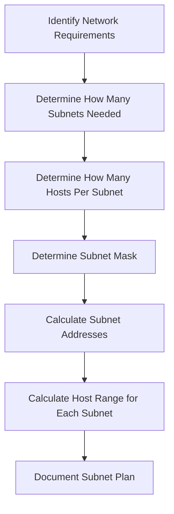
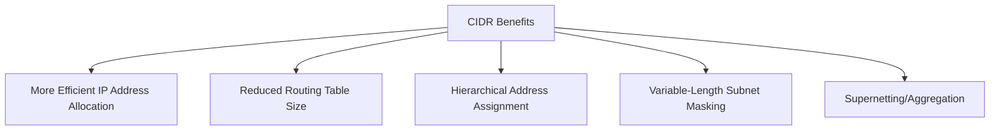
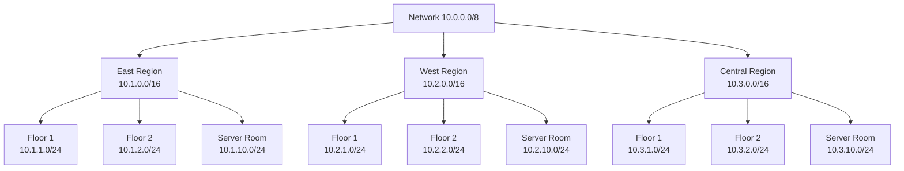
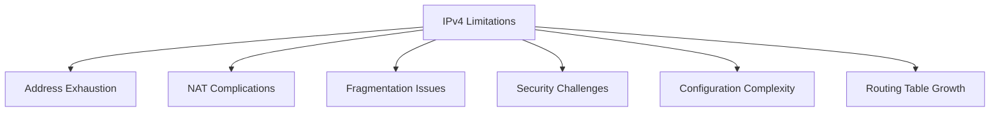

# Day 6: Introduction to IPv4

## Topics Covered
- Introduction to IPv4 (Part 1)
- Introduction to IPv4 (Part 2)

## 1. IPv4 Fundamentals

Internet Protocol version 4 (IPv4) is the fourth version of the Internet Protocol, which provides the logical addressing and routing infrastructure of the Internet. Despite the emergence of IPv6, IPv4 remains the dominant protocol for most Internet traffic.

### Structure of an IPv4 Address

An IPv4 address is a 32-bit number typically expressed in dotted-decimal notation, with four octets separated by periods.

```
┌───────────┬───────────┬───────────┬───────────┐
│  Octet 1  │  Octet 2  │  Octet 3  │  Octet 4  │
└───────────┴───────────┴───────────┴───────────┘
      ▲           ▲           ▲           ▲
      │           │           │           │
      └───────────┴───────────┴───────────┘
                        │
                  32 bits total
```

**Example:** 192.168.1.1

- In binary: 11000000.10101000.00000001.00000001
- Each octet ranges from 0 to 255 (8 bits = 2^8 = 256 values)

### Binary to Decimal Conversion

Understanding binary conversion is essential for IPv4 addressing and subnetting.

**Binary to Decimal:**
```
128  64  32  16   8   4   2   1   (Decimal values)
  ▼   ▼   ▼   ▼   ▼   ▼   ▼   ▼
  1   1   0   0   0   0   0   0   = 192
  1   0   1   0   1   0   0   0   = 168
  0   0   0   0   0   0   0   1   = 1
  0   0   0   0   0   0   0   1   = 1
```

### Classful IPv4 Addressing

The original IPv4 addressing was divided into five classes based on the first few bits of the address.

```mermaid
graph TD
    A[IPv4 Address Classes] --> B[Class A]
    A --> C[Class B]
    A --> D[Class C]
    A --> E[Class D]
    A --> F[Class E]
    
    B --> B1[First bit = 0]
    B --> B2[Range: 0.0.0.0 to 127.255.255.255]
    B --> B3[Default mask: 255.0.0.0 /8]
    
    C --> C1[First bits = 10]
    C --> C2[Range: 128.0.0.0 to 191.255.255.255]
    C --> C3[Default mask: 255.255.0.0 /16]
    
    D --> D1[First bits = 110]
    D --> D2[Range: 192.0.0.0 to 223.255.255.255]
    D --> D3[Default mask: 255.255.255.0 /24]
    
    E --> E1[First bits = 1110]
    E --> E2[Range: 224.0.0.0 to 239.255.255.255]
    E --> E3[Multicast addresses]
    
    F --> F1[First bits = 1111]
    F --> F2[Range: 240.0.0.0 to 255.255.255.255]
    F --> F3[Reserved for experimental use]
```



**Network and Host Portions:**
- Class A: Network (8 bits) + Host (24 bits)
- Class B: Network (16 bits) + Host (16 bits)
- Class C: Network (24 bits) + Host (8 bits)

## 2. Subnetting

Subnetting allows a network administrator to divide an IP network into smaller network segments, improving security, reducing network traffic, and making more efficient use of IP addresses.

### Subnet Masks

A subnet mask is a 32-bit number that masks an IP address and divides it into network and host portions.

**Common Subnet Masks:**

| CIDR Notation | Subnet Mask | Binary Representation |
|---------------|-------------|------------------------|
| /8  | 255.0.0.0 | 11111111.00000000.00000000.00000000 |
| /16 | 255.255.0.0 | 11111111.11111111.00000000.00000000 |
| /24 | 255.255.255.0 | 11111111.11111111.11111111.00000000 |
| /28 | 255.255.255.240 | 11111111.11111111.11111111.11110000 |
| /30 | 255.255.255.252 | 11111111.11111111.11111111.11111100 |

### Subnetting Process



### Subnetting Example: Class C Network

Let's subnet 192.168.1.0/24 into 4 equal subnets.

**Step 1: Determine bits needed for subnets**
- 4 subnets = 2^2, so we need 2 bits

**Step 2: New subnet mask**
- Original: /24 (255.255.255.0)
- Add 2 bits: /26 (255.255.255.192)

**Step 3: Calculate subnet addresses**
- Subnet 0: 192.168.1.0/26
- Subnet 1: 192.168.1.64/26
- Subnet 2: 192.168.1.128/26
- Subnet 3: 192.168.1.192/26

**Step 4: Calculate host ranges**
- Subnet 0: 192.168.1.1 - 192.168.1.62 (Broadcast: 192.168.1.63)
- Subnet 1: 192.168.1.65 - 192.168.1.126 (Broadcast: 192.168.1.127)
- Subnet 2: 192.168.1.129 - 192.168.1.190 (Broadcast: 192.168.1.191)
- Subnet 3: 192.168.1.193 - 192.168.1.254 (Broadcast: 192.168.1.255)

### Subnetting Practice

For a network 172.16.0.0/16, create 8 subnets:

**Step 1: Determine bits needed for subnets**
- 8 subnets = 2^3, so we need 3 bits

**Step 2: New subnet mask**
- Original: /16 (255.255.0.0)
- Add 3 bits: /19 (255.255.224.0)

**Step 3: Calculate subnet addresses**
- Subnet increment: 256 - 224 = 32
- Subnet 0: 172.16.0.0/19
- Subnet 1: 172.16.32.0/19
- Subnet 2: 172.16.64.0/19
- Etc.

## 3. CIDR Notation

Classless Inter-Domain Routing (CIDR) was introduced to improve the efficiency of IP address allocation and routing, replacing the classful system.

### CIDR Notation Format

CIDR notation combines the IP address with a suffix indicating the number of bits in the prefix:
```
A.B.C.D/prefix_length
```

**Examples:**
- 192.168.1.0/24 (a traditional Class C network)
- 10.0.0.0/8 (a traditional Class A network)
- 172.16.0.0/12 (multiple Class B networks)

### CIDR Benefits



### Variable-Length Subnet Masking (VLSM)

VLSM allows networks to be subnetting using different mask lengths, optimizing address allocation.

**Example:** Subnet 192.168.1.0/24 with variable needs:
- Department A: 100 hosts - 192.168.1.0/25 (126 usable addresses)
- Department B: 50 hosts - 192.168.1.128/26 (62 usable addresses)
- Department C: 20 hosts - 192.168.1.192/27 (30 usable addresses)
- Point-to-point links: 6 links - 192.168.1.224/30 (2 usable addresses per subnet)

## 4. Special IPv4 Addresses

### Private IP Address Ranges

Private IP addresses are reserved for use in private networks and are not routable on the public internet.

```
┌───────────────┬────────────────────────┬────────────────────┐
│ Class         │ Private IP Range       │ CIDR Notation      │
├───────────────┼────────────────────────┼────────────────────┤
│ Class A       │ 10.0.0.0 - 10.255.255.255 │ 10.0.0.0/8      │
│ Class B       │ 172.16.0.0 - 172.31.255.255 │ 172.16.0.0/12 │
│ Class C       │ 192.168.0.0 - 192.168.255.255 │ 192.168.0.0/16 │
└───────────────┴────────────────────────┴────────────────────┘
```

### Loopback Address

- 127.0.0.0/8 network is reserved for loopback addressing
- 127.0.0.1 is the standard loopback address ("localhost")
- Used for testing the TCP/IP stack without using the network interface

### Link-Local Addresses

- 169.254.0.0/16 (169.254.0.1 through 169.254.255.254)
- Automatically assigned when DHCP fails (APIPA - Automatic Private IP Addressing)
- Only usable for communication on the same network segment

### Broadcast Addresses

- Network broadcast: All host bits set to 1 (e.g., 192.168.1.255 for 192.168.1.0/24)
- Limited broadcast: 255.255.255.255
- Used to send packets to all hosts on a network

### Reserved IPv4 Addresses

- 0.0.0.0/8: "This" network
- 240.0.0.0/4: Class E (reserved for experimental use)
- 224.0.0.0/4: Multicast addresses

## 5. IPv4 Addressing in Practice

### IP Address Configuration

**Static IP Configuration (Linux):**
```bash
# Set IP address, netmask and gateway
sudo ip addr add 192.168.1.10/24 dev eth0
sudo ip route add default via 192.168.1.1 dev eth0

# Configure DNS
sudo nano /etc/resolv.conf
# Add: nameserver 8.8.8.8
```

**Static IP Configuration (Windows - PowerShell):**
```powershell
# Set IP address, netmask and gateway
New-NetIPAddress -InterfaceAlias "Ethernet" -IPAddress 192.168.1.10 -PrefixLength 24 -DefaultGateway 192.168.1.1

# Configure DNS
Set-DnsClientServerAddress -InterfaceAlias "Ethernet" -ServerAddresses 8.8.8.8
```

### IP Addressing Schemes

When designing networks, consider these addressing strategies:

1. **Departmental Allocation**
   - Assign different subnets to different departments
   - Example: Marketing (10.1.0.0/24), Engineering (10.2.0.0/24)

2. **Geographic Allocation**
   - Assign subnets based on location
   - Example: New York (172.16.10.0/24), London (172.16.20.0/24)

3. **Function-based Allocation**
   - Separate subnets for different network functions
   - Example: User devices (192.168.1.0/24), Servers (192.168.2.0/24), IoT devices (192.168.3.0/24)



## 6. IPv4 Header

The IPv4 header contains crucial information about the packet, including source and destination addresses, packet length, and more.

```
 0                   1                   2                   3
 0 1 2 3 4 5 6 7 8 9 0 1 2 3 4 5 6 7 8 9 0 1 2 3 4 5 6 7 8 9 0 1
+-+-+-+-+-+-+-+-+-+-+-+-+-+-+-+-+-+-+-+-+-+-+-+-+-+-+-+-+-+-+-+-+
|Version|  IHL  |Type of Service|          Total Length         |
+-+-+-+-+-+-+-+-+-+-+-+-+-+-+-+-+-+-+-+-+-+-+-+-+-+-+-+-+-+-+-+-+
|         Identification        |Flags|      Fragment Offset    |
+-+-+-+-+-+-+-+-+-+-+-+-+-+-+-+-+-+-+-+-+-+-+-+-+-+-+-+-+-+-+-+-+
|  Time to Live |    Protocol   |         Header Checksum       |
+-+-+-+-+-+-+-+-+-+-+-+-+-+-+-+-+-+-+-+-+-+-+-+-+-+-+-+-+-+-+-+-+
|                       Source Address                          |
+-+-+-+-+-+-+-+-+-+-+-+-+-+-+-+-+-+-+-+-+-+-+-+-+-+-+-+-+-+-+-+-+
|                    Destination Address                        |
+-+-+-+-+-+-+-+-+-+-+-+-+-+-+-+-+-+-+-+-+-+-+-+-+-+-+-+-+-+-+-+-+
|                    Options                    |    Padding    |
+-+-+-+-+-+-+-+-+-+-+-+-+-+-+-+-+-+-+-+-+-+-+-+-+-+-+-+-+-+-+-+-+
```

**Key Fields:**
- **Version**: IPv4 = 4 (4 bits)
- **IHL (Internet Header Length)**: Header length in 32-bit words (4 bits)
- **Type of Service**: Quality of service priorities (8 bits)
- **Total Length**: Packet length in bytes (16 bits)
- **Identification**: Packet identification for fragmentation (16 bits)
- **Flags**: Control flags for fragmentation (3 bits)
- **Fragment Offset**: Position of fragment in original packet (13 bits)
- **TTL (Time to Live)**: Maximum hop count before packet is discarded (8 bits)
- **Protocol**: Higher-layer protocol (TCP=6, UDP=17, ICMP=1) (8 bits)
- **Header Checksum**: Error detection for the header (16 bits)
- **Source Address**: Sender's IP address (32 bits)
- **Destination Address**: Recipient's IP address (32 bits)
- **Options**: Optional parameters (variable length)

## 7. IPv4 Challenges and Limitations



### Address Exhaustion

The 32-bit address space of IPv4 provides approximately 4.3 billion addresses, which is insufficient for today's Internet needs.

**Mitigation strategies:**
- Network Address Translation (NAT)
- Classless Inter-Domain Routing (CIDR)
- Private addressing
- Migration to IPv6

### NAT Complications

While NAT helps conserve public IP addresses, it introduces complications:
- Breaks end-to-end connectivity model
- Complicates peer-to-peer applications
- Creates challenges for certain protocols
- Adds processing overhead

### Routing Table Growth

The growth of the Internet has led to increasingly large routing tables in core routers, causing:
- Increased memory requirements
- Longer lookup times
- More processing power needed
- Slower convergence after failures

## Additional Resources

- [RFC 791 - Internet Protocol](https://datatracker.ietf.org/doc/html/rfc791)
- [RFC 1918 - Private Address Allocation](https://datatracker.ietf.org/doc/html/rfc1918)
- [Subnetting Practice Tools](https://subnettingpractice.com/)
- [IP Subnet Calculator](https://www.calculator.net/ip-subnet-calculator.html)

## Practice Questions

1. You have a network 192.168.10.0/24 and need to create 6 subnets. What subnet mask should you use, and what are the resulting subnet addresses?

2. Convert the following IPv4 address to binary: 172.16.254.1

3. A company has the following departments with host requirements:
   - Sales: 28 hosts
   - Marketing: 14 hosts
   - Engineering: 60 hosts
   - Management: 10 hosts
   - IT: 20 hosts
   
   Starting with 192.168.1.0/24, design an addressing scheme using VLSM.

4. What is the broadcast address for the network 10.5.12.0/22?

5. Explain the purpose of the TTL field in the IPv4 header and what happens when it reaches zero.
