# Day 6: OSI Model and Protocol Architecture

  
  
  <h1>🌐 The OSI Model and Protocol Architecture 🌐</h1>
  
  

    
    
    
  

  
  

## Table of Contents
- [Introduction to the OSI Model](#introduction-to-the-osi-model)
- [OSI Model Layers in Detail](#osi-model-layers-in-detail)
- [Protocols at Each Layer](#protocols-at-each-layer)
- [OSI vs TCP/IP Model](#osi-vs-tcpip-model)
  - [4-Layer TCP/IP Model](#4-layer-tcpip-model)
  - [5-Layer TCP/IP Model](#5-layer-tcpip-model)
- [Data Encapsulation and Decapsulation](#data-encapsulation-and-decapsulation)
- [Practice Questions](#practice-questions)

## Introduction to the OSI Model

The Open Systems Interconnection (OSI) model is a conceptual framework that standardizes the functions of a telecommunication or computing system without regard to its underlying internal structure and technology. Created by the International Organization for Standardization (ISO) in 1984, it provides a common basis for coordinating standards development for the purpose of systems interconnection.

### The Need for a Layered Model

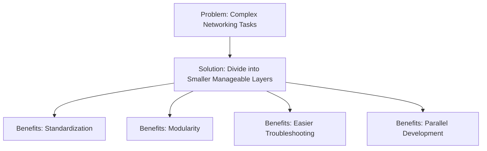

## OSI Model Layers in Detail

### Complete OSI Model Overview

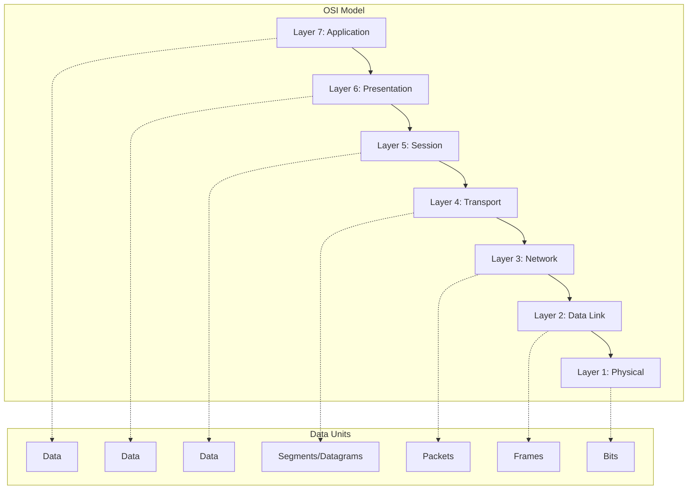

### Layer 7: Application Layer

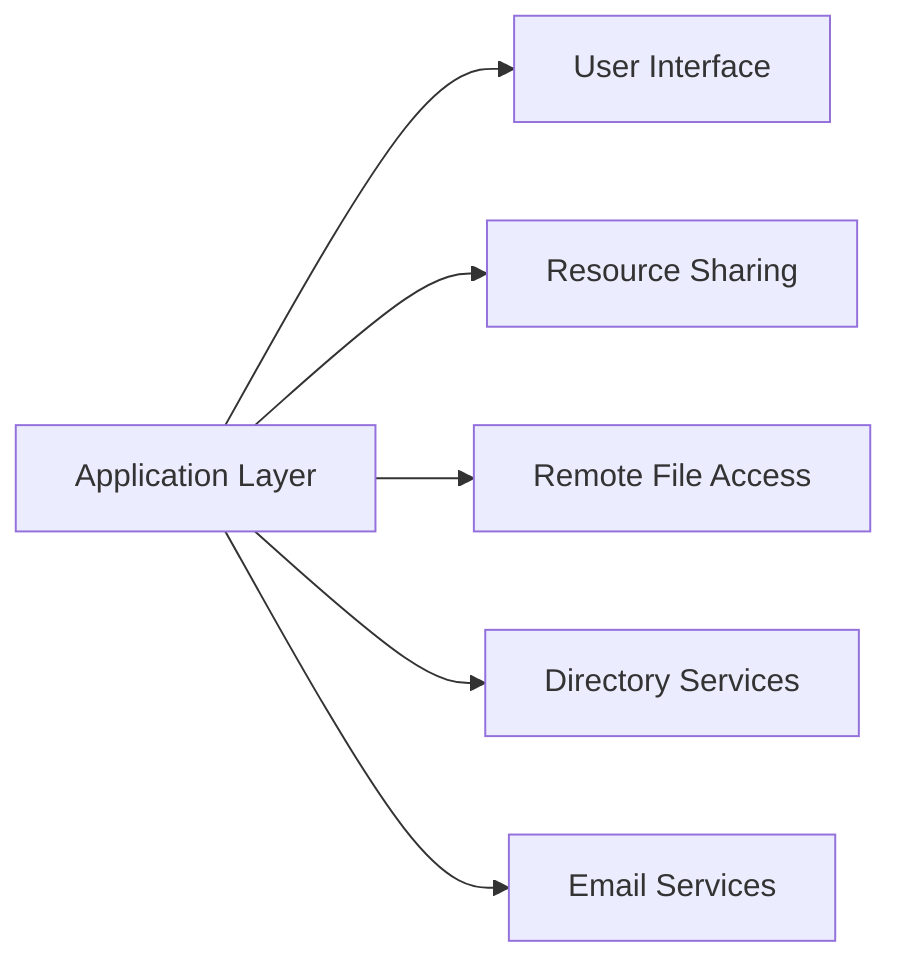

**Function**: Provides network services directly to end-users or applications.

**Protocols**:
- HTTP/HTTPS (Web browsing)
- SMTP/POP3/IMAP (Email)
- FTP/SFTP (File transfer)
- DNS (Domain name resolution)
- DHCP (Dynamic host configuration)
- Telnet/SSH (Remote access)
- SNMP (Network management)

**One Line Function**: Provides network services to applications and directly interacts with end-users.

### Layer 6: Presentation Layer

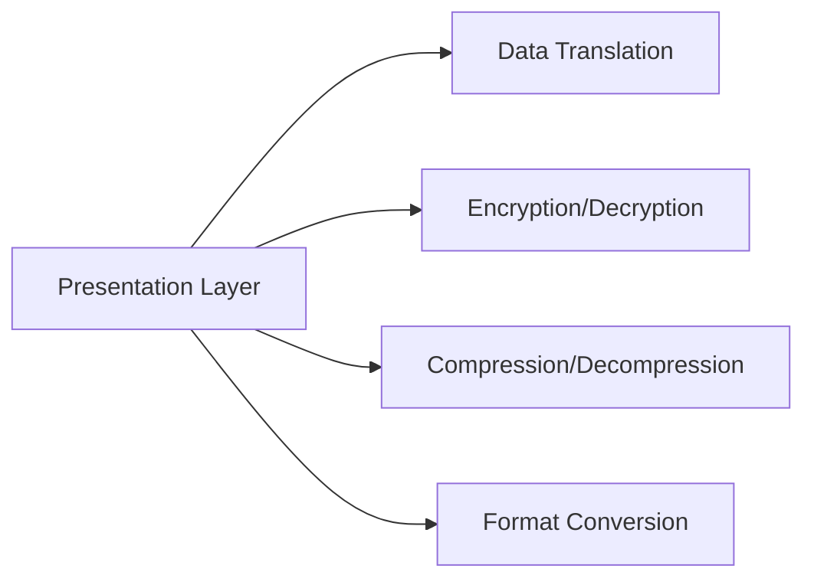

**Function**: Translates data between the application layer and lower layers. Handles data formatting, encryption, and compression.

**Protocols**:
- SSL/TLS (Encryption)
- JPEG, GIF, PNG (Image formats)
- MPEG, MP4 (Video formats)
- ASCII, EBCDIC (Character encoding)
- XML, JSON (Data structures)

**One Line Function**: Transforms data into a format that the application layer can accept or that can be sent over the network.

### Layer 5: Session Layer

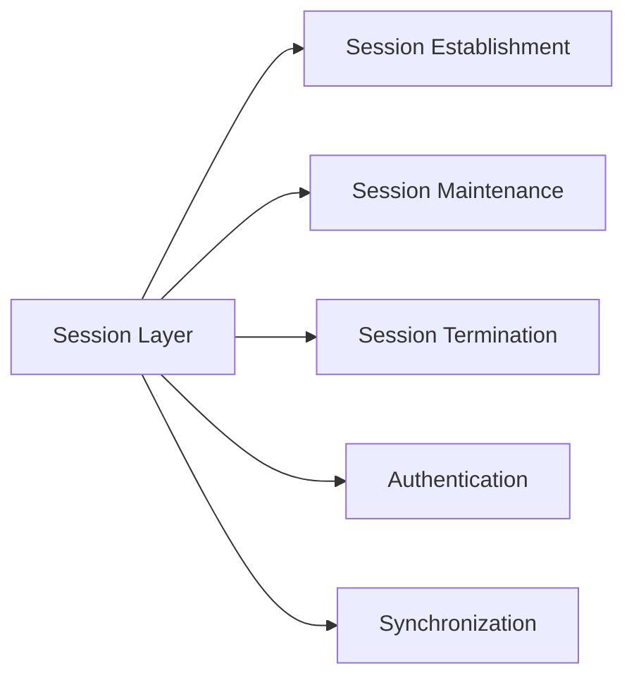

**Function**: Establishes, manages, and terminates sessions between applications.

**Protocols**:
- NetBIOS (Network Basic Input/Output System)
- RPC (Remote Procedure Call)
- SIP (Session Initiation Protocol)
- SQL (Structured Query Language)
- NFS (Network File System)

**One Line Function**: Manages the communication sessions between computers, including establishing, maintaining, and terminating connections.

### Layer 4: Transport Layer

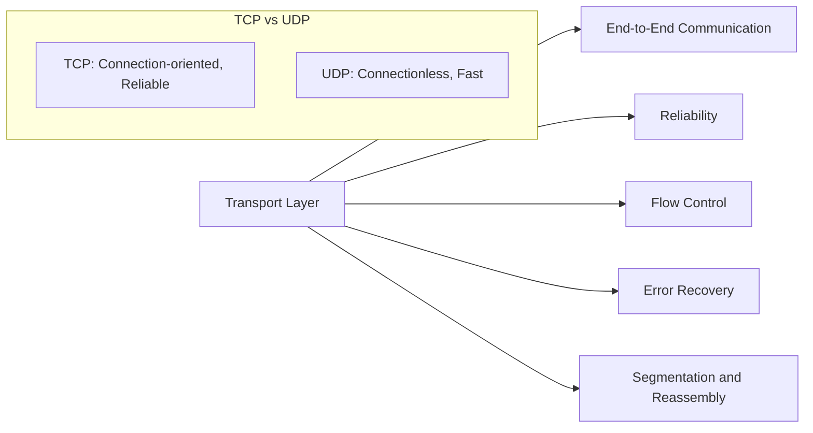

**Function**: Provides reliable data transfer, segmentation, flow control, and error correction.

**Protocols**:
- TCP (Transmission Control Protocol)
- UDP (User Datagram Protocol)
- SCTP (Stream Control Transmission Protocol)
- DCCP (Datagram Congestion Control Protocol)

**One Line Function**: Ensures complete data transfer by managing flow control, error correction, and data segmentation.

### Layer 3: Network Layer

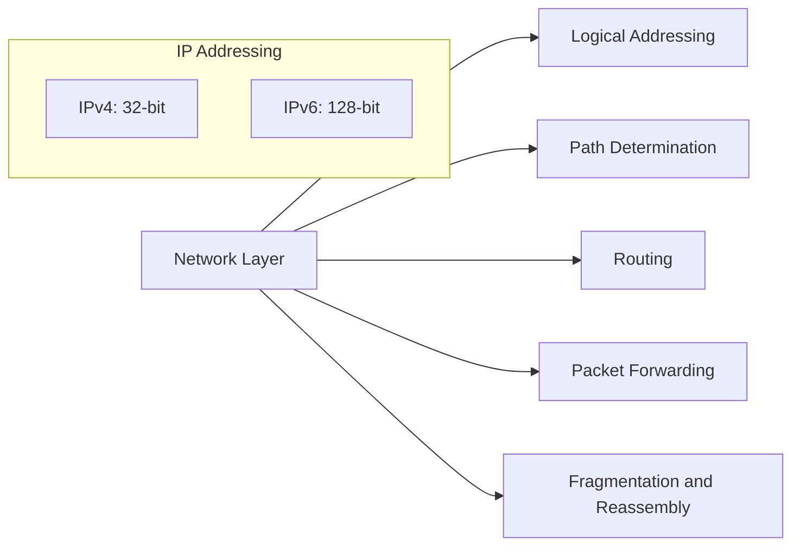

**Function**: Handles logical addressing, routing, and path determination.

**Protocols**:
- IPv4/IPv6 (Internet Protocol)
- ICMP (Internet Control Message Protocol)
- IGMP (Internet Group Management Protocol)
- RIP, OSPF, BGP (Routing protocols)
- IPsec (IP Security)
- MPLS (Multiprotocol Label Switching)

**One Line Function**: Determines the best path for data to travel from source to destination across multiple networks.

### Layer 2: Data Link Layer

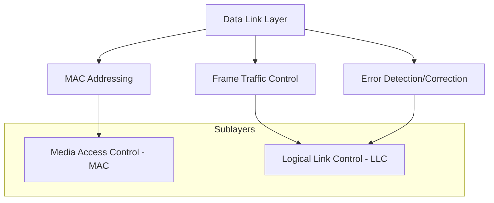

**Function**: Provides node-to-node data transfer and handles physical addressing, error detection, and frame flow control.

**Protocols**:
- Ethernet (IEEE 802.3)
- Wi-Fi (IEEE 802.11)
- PPP (Point-to-Point Protocol)
- HDLC (High-Level Data Link Control)
- ATM (Asynchronous Transfer Mode)
- Frame Relay
- Bluetooth (IEEE 802.15)

**One Line Function**: Creates and maintains reliable links between directly connected nodes by managing physical addressing and access to the medium.

### Layer 1: Physical Layer

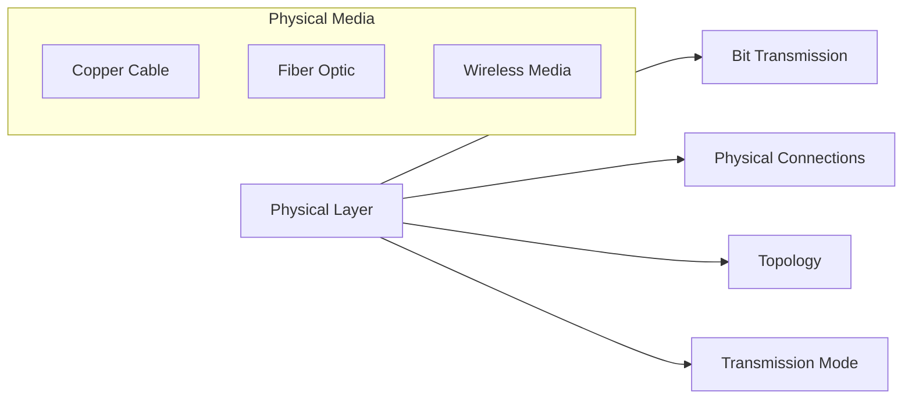

**Function**: Transmits raw bit streams over a physical medium.

**Protocols/Standards**:
- RS-232, RS-449 (Serial interfaces)
- DSL (Digital Subscriber Line)
- ISDN (Integrated Services Digital Network)
- USB (Universal Serial Bus)
- Bluetooth Physical Layer
- IEEE 802.11 Physical Layer
- SONET/SDH (Synchronous Optical Networking)

**One Line Function**: Transmits and receives raw bit streams over a physical medium, dealing with cables, pins, voltages, and signal modulation.

## Protocols at Each Layer

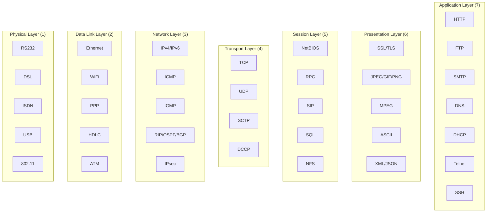

## OSI vs TCP/IP Model

There are two common representations of the TCP/IP model: the original 4-layer model and the more detailed 5-layer model. Both simplify the OSI model while providing practical frameworks for internet communications.

### 4-Layer TCP/IP Model

The original TCP/IP model has 4 layers and maps to the OSI model as follows:

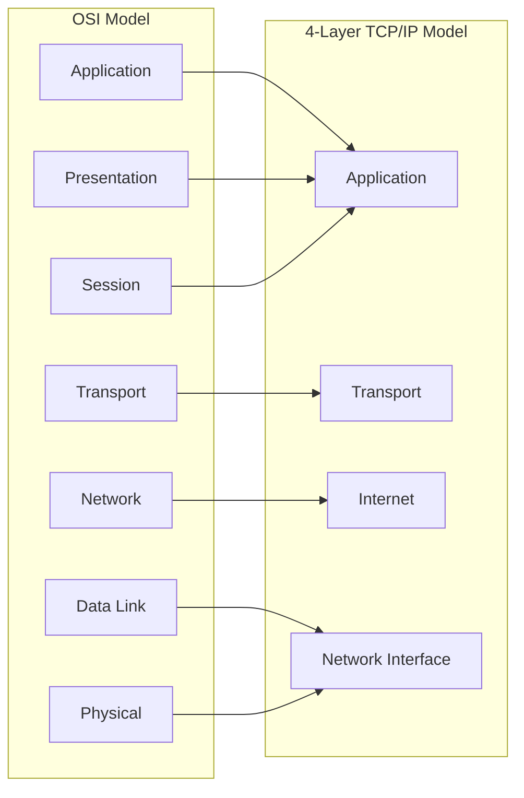

### 5-Layer TCP/IP Model

The 5-layer TCP/IP model is more commonly used in educational contexts and provides clearer distinctions between the physical and data link layers:

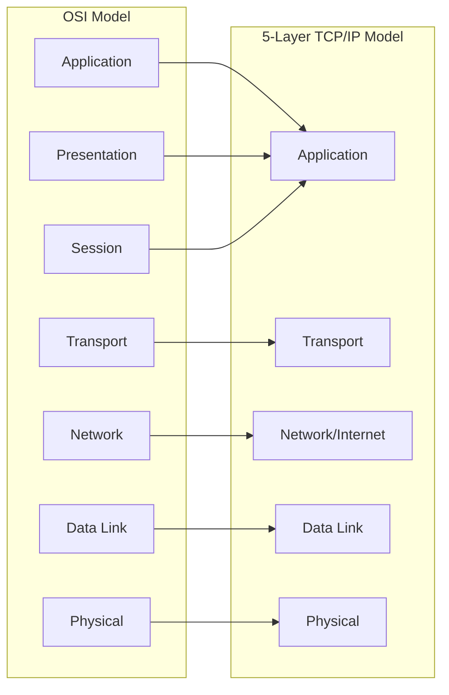

### 5-Layer TCP/IP Model in Detail

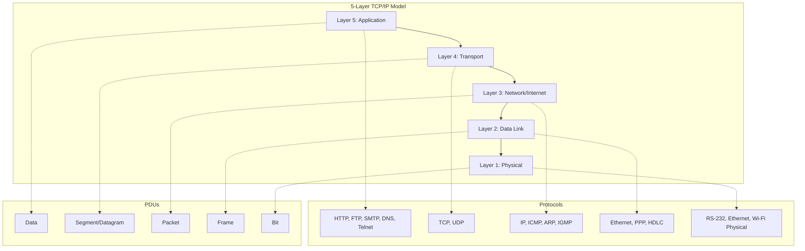

#### Layer 5: Application Layer
- **Function**: Provides network services to applications
- **Protocols**: HTTP, HTTPS, FTP, SMTP, DNS, Telnet, SSH, SNMP
- **PDU**: Data
- **Combines**: OSI Application, Presentation, and Session layers

#### Layer 4: Transport Layer
- **Function**: End-to-end communication, reliability, flow control
- **Protocols**: TCP, UDP
- **PDU**: Segment (TCP) / Datagram (UDP)
- **Maps to**: OSI Transport layer

#### Layer 3: Network/Internet Layer
- **Function**: Logical addressing, routing between networks
- **Protocols**: IP (IPv4, IPv6), ICMP, ARP, IGMP, Routing protocols
- **PDU**: Packet
- **Maps to**: OSI Network layer

#### Layer 2: Data Link Layer
- **Function**: Physical addressing, local network access
- **Protocols**: Ethernet, PPP, HDLC, Wi-Fi
- **PDU**: Frame
- **Maps to**: OSI Data Link layer

#### Layer 1: Physical Layer
- **Function**: Bit transmission, physical connections
- **Standards**: RS-232, Ethernet physical, Wi-Fi physical, USB
- **PDU**: Bit
- **Maps to**: OSI Physical layer

### Key Differences Between Models

| OSI Model | 4-Layer TCP/IP | 5-Layer TCP/IP | Main Functions |
|-----------|----------------|----------------|---------------|
| Application, Presentation, Session | Application | Application | User interfaces, data encoding, session management |
| Transport | Transport | Transport | End-to-end communication, reliability |
| Network | Internet | Network/Internet | Logical addressing, routing |
| Data Link | Network Interface | Data Link | Physical addressing, medium access |
| Physical | Network Interface | Physical | Bit transmission, cabling, signals |

## Data Encapsulation and Decapsulation

As data travels down the OSI model from sender to receiver, each layer adds its own header (and sometimes trailer) to the data. This process is called encapsulation. The reverse process, as data moves up the layers at the receiving end, is called decapsulation.

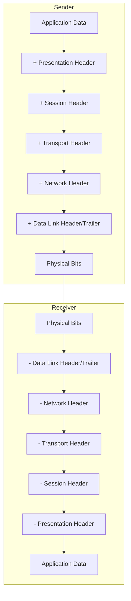

### Protocol Data Units (PDUs)

Each layer in the OSI model has a specific name for the data unit it handles:

| Layer | PDU Name |
|-------|----------|
| Application | Data |
| Presentation | Data |
| Session | Data |
| Transport | Segment (TCP) / Datagram (UDP) |
| Network | Packet |
| Data Link | Frame |
| Physical | Bit |

## Practice Questions

1. Explain the purpose of the OSI model and why a layered approach is beneficial for networking.

2. If you were troubleshooting a network issue where two computers on the same network couldn't communicate, which OSI layers would you investigate first and why?

3. Compare and contrast TCP and UDP at the Transport layer. In what scenarios would you choose one over the other?

4. How does encapsulation work as data moves down the OSI model? What information is typically added at each layer?

5. Match the following protocols to their correct OSI layer:
   - HTTPS
   - IPv6
   - Ethernet
   - TCP
   - SSL

6. Explain the difference between logical addressing (Layer 3) and physical addressing (Layer 2).

7. What happens at the Physical layer when a message is transmitted over a wireless network versus a wired network?

8. How does the Session layer establish, manage, and terminate connections?

9. What role does the Presentation layer play in ensuring different systems can understand each other's data formats?

10. Draw a simple diagram showing how data flows through the OSI layers when a web browser requests a webpage from a server.

## Additional Resources

- [Interactive OSI Model Simulator](https://www.gns3.com/)
- [Wireshark: Protocol Analyzer](https://www.wireshark.org/)
- [RFC 1122: Requirements for Internet Hosts](https://tools.ietf.org/html/rfc1122)
- [Book: Computer Networks by Andrew S. Tanenbaum](https://www.amazon.com/Computer-Networks-5th-Andrew-Tanenbaum/dp/0132126958)

---

  

    <a href="../day_005/README.md">⬅️ Previous Day</a> | 
    <a href="../README.md">🏠 Home</a> |
    <a href="../day_007/README.md">➡️ Next Day</a>
  

