# Day 7: Application Layer Protocols and Client-Server Architecture

  
  
  <h1>🌐 Application Layer Protocols & Client-Server Architecture 🌐</h1>
  
  

    
    
    
    
  

  
  

## Table of Contents
- [Introduction to the Application Layer](#introduction-to-the-application-layer)
- [Client-Server Architecture](#client-server-architecture)
- [Key Application Layer Protocols](#key-application-layer-protocols)
  - [HTTP and HTTPS](#http-and-https)
  - [DNS](#dns)
  - [Email Protocols (SMTP, POP3, IMAP)](#email-protocols-smtp-pop3-imap)
  - [FTP](#ftp)
  - [SSH and Telnet](#ssh-and-telnet)
  - [DHCP](#dhcp)
  - [SNMP](#snmp)
- [Peer-to-Peer (P2P) Networking](#peer-to-peer-p2p-networking)
- [Web Technologies](#web-technologies)
- [API Communication](#api-communication)
- [Practice Questions](#practice-questions)

## Introduction to the Application Layer

The Application Layer is the topmost layer in both the OSI and TCP/IP models, interfacing directly with end-user applications. It provides network services to application processes (such as web browsers, email clients, and file transfer tools) and facilitates user interaction with the network.

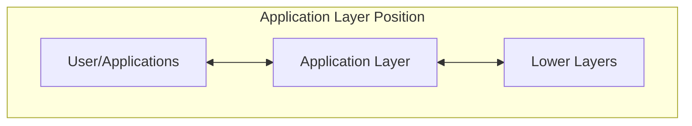

### Key Characteristics of the Application Layer

- **User Interface**: Provides the interface between the user application and the network
- **Direct User Interaction**: The only layer that directly interacts with user software
- **Protocol Diversity**: Contains the largest number of protocols to support various application needs
- **Independent Operation**: Protocols operate independently of the underlying network architecture
- **Service Advertisement**: Enables applications to advertise and discover available services

## Client-Server Architecture

Most Application Layer protocols operate within the client-server paradigm, where client applications request services or resources, and server applications provide them.

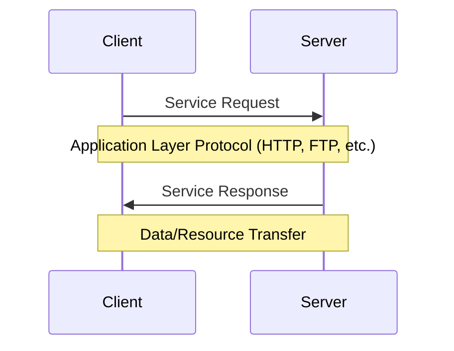

### Components of Client-Server Architecture

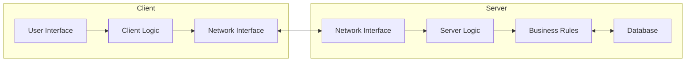

### Key Client-Server Characteristics

1. **Service Distribution**: Servers provide specific services (web content, email, file storage)
2. **Resource Sharing**: Enables multiple clients to access centralized resources
3. **Scalability**: Can scale horizontally (more servers) or vertically (more powerful servers)
4. **Centralized Management**: Easier to administer, update, and secure resources
5. **Continuous Availability**: Servers are designed to be always available for client requests

### Common Server Types

- **Web Servers**: Apache, Nginx, IIS (serving HTTP/HTTPS content)
- **Email Servers**: Exchange, Postfix (handling SMTP, POP3, IMAP)
- **File Servers**: FTP servers, Network Attached Storage
- **Database Servers**: MySQL, PostgreSQL, MongoDB
- **Application Servers**: Tomcat, WebSphere, WebLogic
- **Name Servers**: DNS servers (resolving domain names)

## Key Application Layer Protocols

### HTTP and HTTPS

HTTP (Hypertext Transfer Protocol) and its secure version HTTPS are the foundation of data communication on the World Wide Web.

#### HTTP Request-Response Cycle

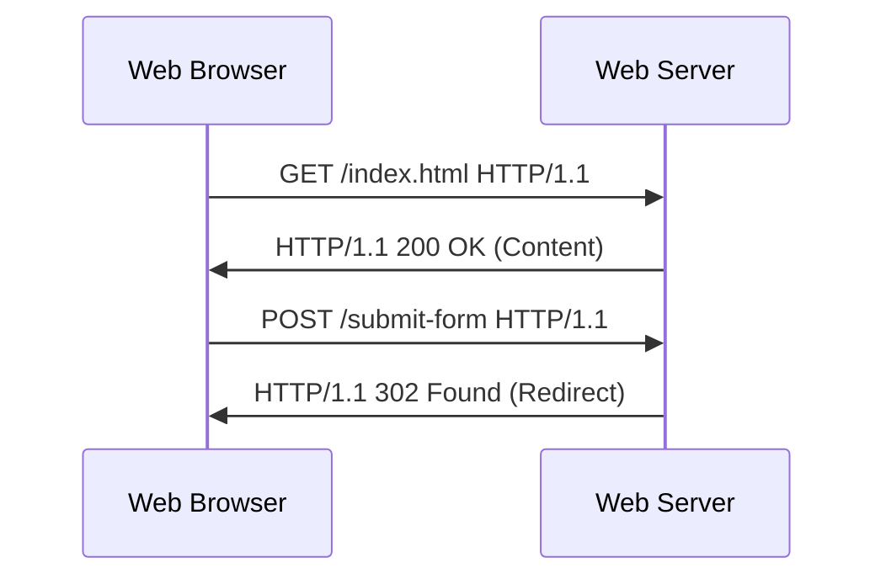

#### HTTP Methods

| Method | Purpose | Idempotent | Safe |
|--------|---------|------------|------|
| GET | Retrieve data | Yes | Yes |
| POST | Submit data | No | No |
| PUT | Update/Replace data | Yes | No |
| DELETE | Remove data | Yes | No |
| HEAD | Get headers only | Yes | Yes |
| OPTIONS | Get supported methods | Yes | Yes |
| PATCH | Partial update | No | No |

#### HTTP Status Codes

- **1xx**: Informational responses
- **2xx**: Successful responses (200 OK, 201 Created)
- **3xx**: Redirection messages (301 Moved Permanently, 302 Found)
- **4xx**: Client errors (404 Not Found, 403 Forbidden)
- **5xx**: Server errors (500 Internal Server Error)

#### HTTPS Security

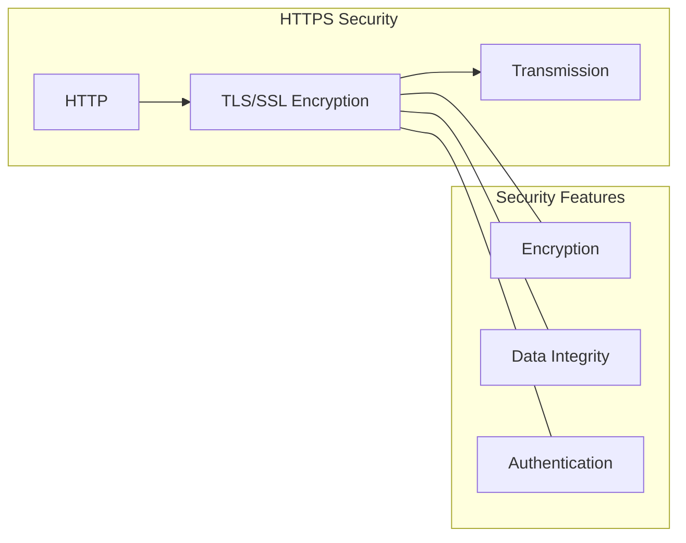

### DNS

The Domain Name System (DNS) translates human-readable domain names into IP addresses that computers can understand.

#### DNS Resolution Process

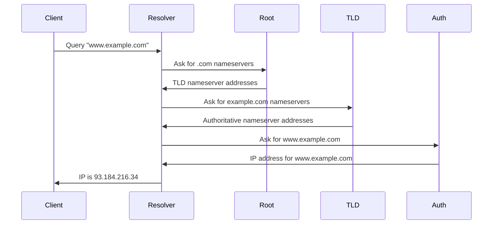

#### DNS Record Types

| Record Type | Purpose | Example |
|-------------|---------|---------|
| A | Maps domain to IPv4 address | example.com → 93.184.216.34 |
| AAAA | Maps domain to IPv6 address | example.com → 2606:2800:220:1:248:1893:25c8:1946 |
| CNAME | Canonical name (alias) | www.example.com → example.com |
| MX | Mail exchange | example.com → mail.example.com |
| TXT | Text information | SPF, DKIM records |
| NS | Name server | example.com → ns1.nameserver.com |
| SOA | Start of Authority | Administrative info |
| PTR | Reverse lookup | 93.184.216.34 → example.com |

### Email Protocols (SMTP, POP3, IMAP)

Email communication relies on multiple protocols working together.

#### Email System Architecture

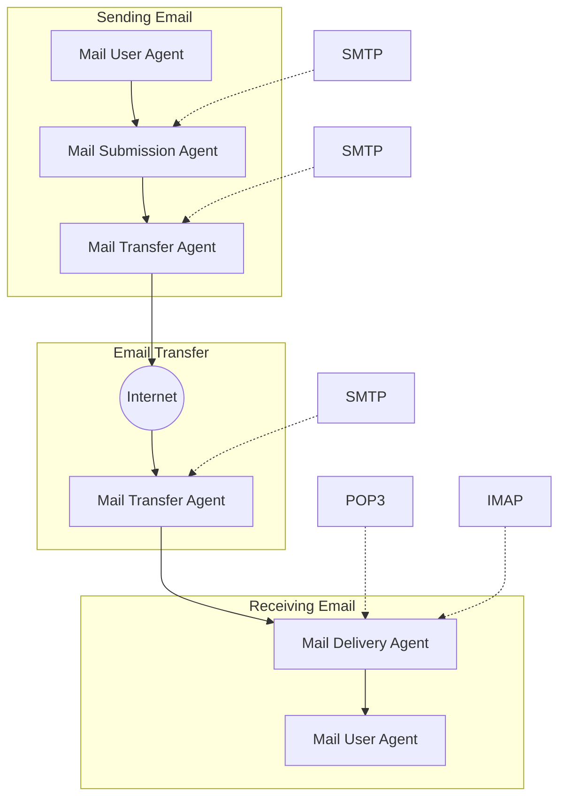

#### Protocol Comparison

| Protocol | Port | Purpose | Characteristics |
|----------|------|---------|----------------|
| SMTP | 25, 587 | Sending email | Push protocol, server-to-server |
| POP3 | 110, 995 (SSL) | Retrieving email | Simple, typically downloads and deletes from server |
| IMAP | 143, 993 (SSL) | Retrieving email | More complex, keeps emails on server, supports folders |

### FTP

File Transfer Protocol (FTP) provides file transfer and manipulation services between clients and servers.

#### FTP Connection Types

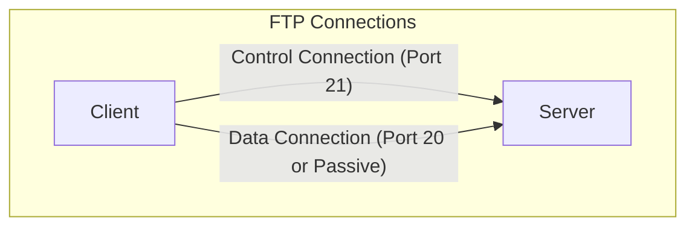

#### FTP Modes

- **Active Mode**: Server initiates data connection to client
- **Passive Mode**: Client initiates data connection to server (better for firewalls)

#### FTP Commands

| Command | Description |
|---------|-------------|
| USER | Specify username |
| PASS | Specify password |
| LIST | List files and directories |
| CWD | Change working directory |
| STOR | Upload file |
| RETR | Download file |
| DELE | Delete file |
| MKD | Create directory |
| RMD | Remove directory |

### SSH and Telnet

Secure Shell (SSH) and Telnet provide remote access to devices, with SSH being the secure alternative to Telnet.

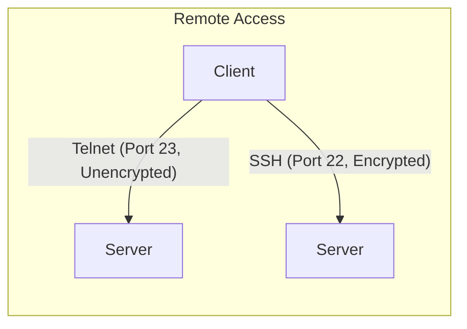

#### SSH Security Features

- Encrypted communications
- Public-key authentication
- Data integrity verification
- Port forwarding/tunneling
- Secure file transfer (SFTP)

### DHCP

Dynamic Host Configuration Protocol (DHCP) automates IP address assignment and network configuration.

#### DHCP Process (DORA)

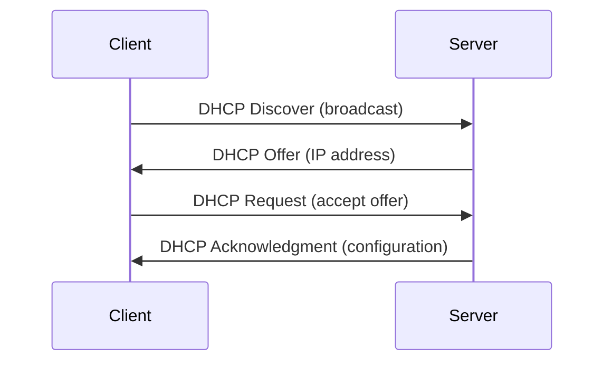

### SNMP

Simple Network Management Protocol (SNMP) monitors and manages network devices.

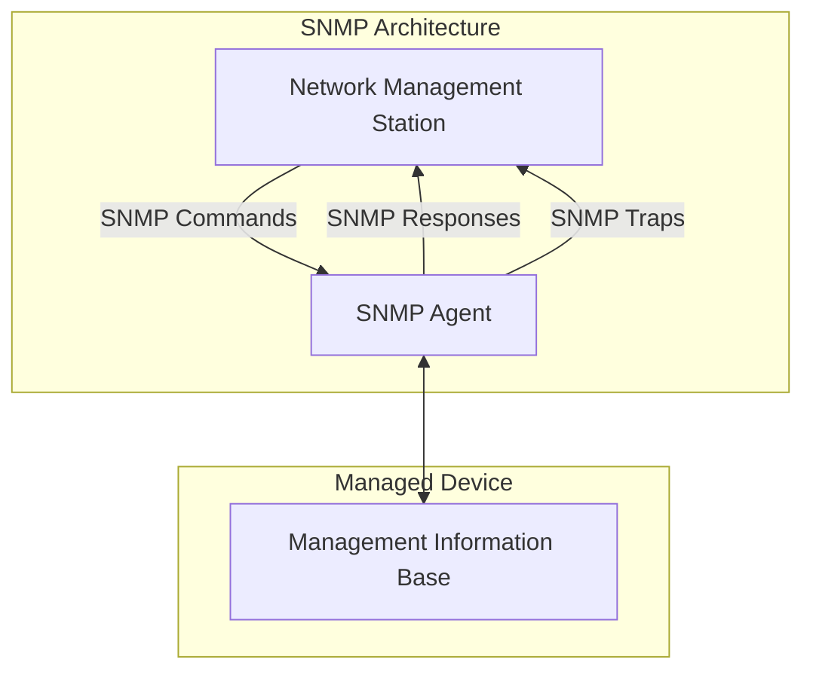

## Peer-to-Peer (P2P) Networking

Unlike client-server, P2P architecture allows devices to function as both clients and servers.

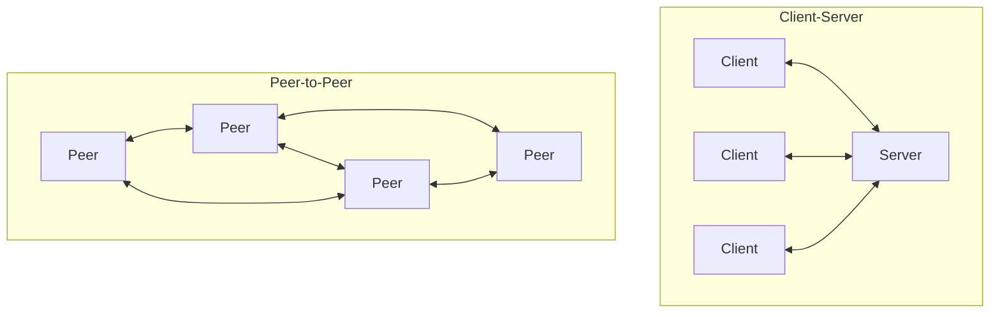

### P2P Applications

- File sharing (BitTorrent)
- Content distribution
- VoIP communications (early Skype)
- Blockchain networks
- Distributed computing

## Web Technologies

### Web Architecture

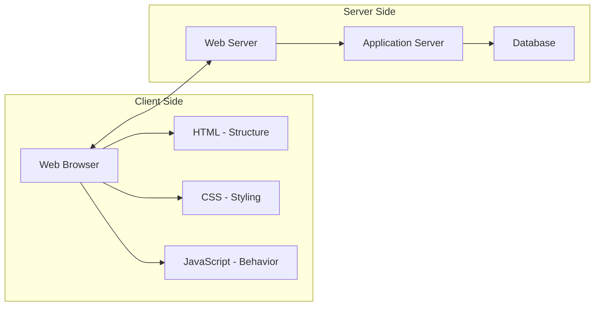

### Modern Web Communication

- **REST APIs**: Representational State Transfer for web services
- **WebSockets**: Full-duplex communication channels
- **GraphQL**: Query language for APIs
- **AJAX**: Asynchronous JavaScript and XML

## API Communication

APIs (Application Programming Interfaces) allow different software systems to communicate.

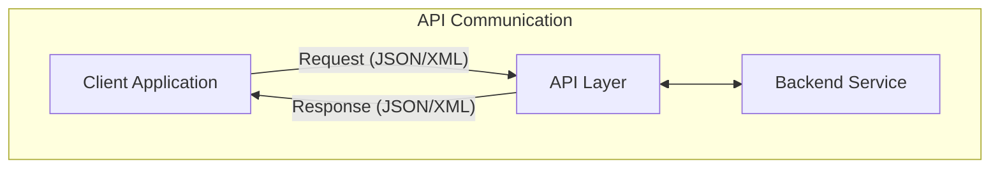

### API Architectures

- **REST**: Stateless, resource-based architecture
- **SOAP**: Protocol using XML for message formatting
- **gRPC**: High-performance RPC framework
- **GraphQL**: Query language for flexible data retrieval

## Practice Questions

1. Explain the relationship between HTTP and HTML in web browsing.

2. A company needs to set up an email system. Describe the roles of SMTP, POP3, and IMAP in this system.

3. Compare and contrast client-server architecture with peer-to-peer architecture.

4. When a user types "www.example.com" in a browser, describe the complete DNS resolution process.

5. Explain the purpose of HTTP status codes and give examples of when 200, 404, and 500 codes would be returned.

6. How does HTTPS improve upon HTTP? Explain the security mechanisms involved.

7. Compare active and passive modes in FTP. Which is more firewall-friendly and why?

8. Describe the DHCP address allocation process (DORA) and the purpose of each message.

9. How do REST APIs differ from SOAP APIs? When might you choose one over the other?

10. Explain how WebSockets differ from traditional HTTP communication and what advantages they provide.

## Additional Resources

- [RFC 2616: HTTP/1.1](https://tools.ietf.org/html/rfc2616)
- [RFC 1035: DNS Implementation](https://tools.ietf.org/html/rfc1035)
- [RFC 5321: SMTP](https://tools.ietf.org/html/rfc5321)
- [MDN Web Docs](https://developer.mozilla.org/en-US/docs/Web)
- [RESTful API Design Best Practices](https://restfulapi.net/)

---

  

    <a href="../day_006/README.md">⬅️ Previous Day</a> | 
    <a href="../README.md">🏠 Home</a> |
    <a href="../day_008/README.md">➡️ Next Day</a>
  

