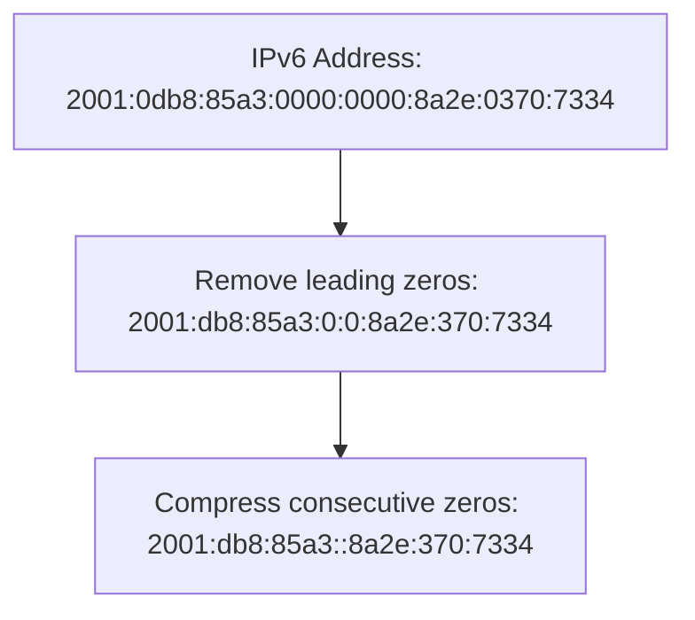
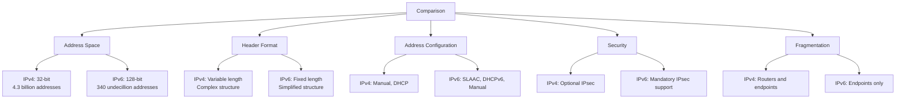
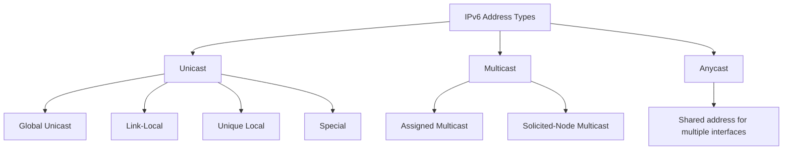
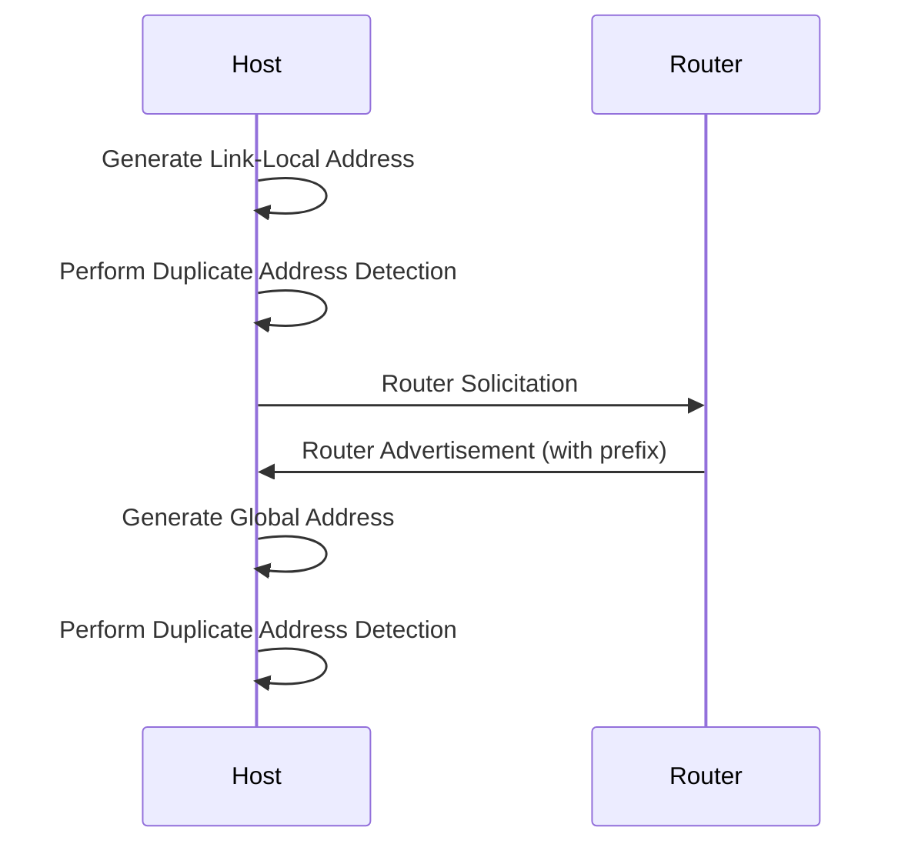
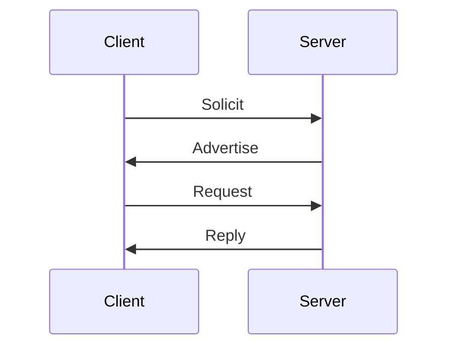
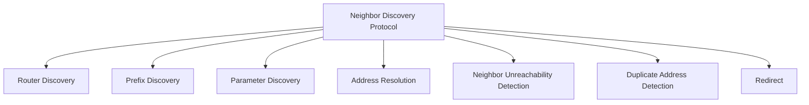
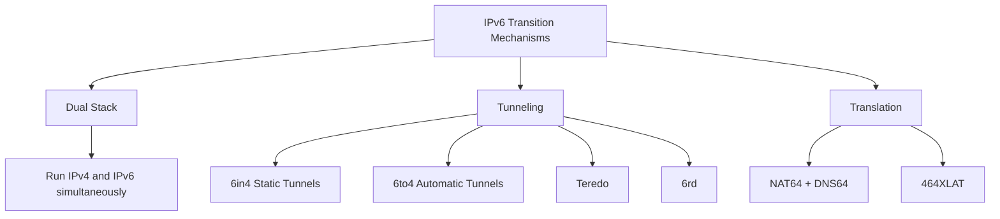

# Day 7: Introduction to IPv6

## Topics Covered
- Introduction to IPv6

## 1. IPv6 Fundamentals

Internet Protocol version 6 (IPv6) is the most recent version of the Internet Protocol, designed to address the limitations of IPv4, particularly the IPv4 address exhaustion problem.

### IPv6 Address Structure

An IPv6 address is a 128-bit value, typically represented as eight groups of four hexadecimal digits, separated by colons.

```
2001:0db8:85a3:0000:0000:8a2e:0370:7334
```

**IPv6 Address Representation Rules:**
- Leading zeros in a group can be omitted: `2001:db8:85a3:0:0:8a2e:370:7334`
- One consecutive group of zeros can be replaced with `::`: `2001:db8:85a3::8a2e:370:7334`



### IPv6 vs IPv4



## 2. IPv6 Address Types

IPv6 defines several types of addresses for different purposes.



### Global Unicast Addresses

Global Unicast Addresses are the IPv6 equivalent of public IPv4 addresses. They are globally routable and reachable on the IPv6 Internet.

**Prefix range:** 2000::/3 (addresses starting with 2 or 3)

**Structure:**
```
┌───────────────┬───────────────┬───────────────┐
│ Global Prefix │ Subnet ID     │ Interface ID  │
│ (48 bits)     │ (16 bits)     │ (64 bits)     │
└───────────────┴───────────────┴───────────────┘
```

**Example:** 2001:db8:1234:5678:abcd:ef01:2345:6789

### Link-Local Addresses

Link-Local addresses are used for communication within a single network segment (link) and are not routable beyond that link.

**Prefix:** fe80::/10

**Structure:**
```
┌───────────┬───────────────┬───────────────────┐
│ fe80::/10 │ All zeros     │ Interface ID      │
│ (10 bits) │ (54 bits)     │ (64 bits)         │
└───────────┴───────────────┴───────────────────┘
```

**Example:** fe80::1234:5678:abcd:ef01

### Unique Local Addresses

Unique Local Addresses (ULAs) are similar to private IPv4 addresses. They are used for local communications and are not expected to be routable on the global Internet.

**Prefix:** fc00::/7 (typically fd00::/8 is used)

**Structure:**
```
┌───────────┬─┬───────────┬───────────┬───────────────┐
│ fc00::/7  │L│ Global ID │ Subnet ID │ Interface ID  │
│ (7 bits)  │ │ (40 bits) │ (16 bits) │ (64 bits)     │
└───────────┴─┴───────────┴───────────┴───────────────┘
```

**Example:** fd12:3456:789a:1::1

### Multicast Addresses

Multicast addresses identify multiple interfaces and deliver packets to all interfaces identified by the address.

**Prefix:** ff00::/8

**Common Multicast Addresses:**
- ff02::1 - All nodes on the local link
- ff02::2 - All routers on the local link
- ff02::1:ff00:0/104 - Solicited-node multicast address

### Anycast Addresses

Anycast addresses are allocated to multiple interfaces, but packets are delivered to the "nearest" interface (as defined by routing protocols).

## 3. IPv6 Address Allocation

### Interface Identifier (IID) Generation

The 64-bit interface identifier can be generated in several ways:

1. **Modified EUI-64:**
   - Derived from MAC address
   - Inserts FF:FE in the middle
   - Flips the Universal/Local bit

2. **Random Identifier:**
   - Randomly generated
   - Provides privacy benefits
   - RFC 4941 - Privacy Extensions

3. **Stable Identifier:**
   - Algorithmically generated
   - Stable for each network
   - RFC 7217 - Semantically Opaque Interface Identifiers

### Stateless Address Autoconfiguration (SLAAC)

SLAAC allows devices to automatically configure IPv6 addresses without a DHCP server.



### DHCPv6

DHCPv6 provides stateful address configuration for IPv6, similar to DHCP for IPv4.

**DHCPv6 Modes:**
1. **Stateful mode:** DHCPv6 server assigns addresses and configuration
2. **Stateless mode:** Addresses via SLAAC, other configuration via DHCPv6



## 4. IPv6 Header

The IPv6 header is simpler than the IPv4 header, with fewer fields and a fixed length.

```
 0                   1                   2                   3
 0 1 2 3 4 5 6 7 8 9 0 1 2 3 4 5 6 7 8 9 0 1 2 3 4 5 6 7 8 9 0 1
+-+-+-+-+-+-+-+-+-+-+-+-+-+-+-+-+-+-+-+-+-+-+-+-+-+-+-+-+-+-+-+-+
|Version| Traffic Class |           Flow Label                  |
+-+-+-+-+-+-+-+-+-+-+-+-+-+-+-+-+-+-+-+-+-+-+-+-+-+-+-+-+-+-+-+-+
|         Payload Length        |  Next Header  |   Hop Limit   |
+-+-+-+-+-+-+-+-+-+-+-+-+-+-+-+-+-+-+-+-+-+-+-+-+-+-+-+-+-+-+-+-+
|                                                               |
+                                                               +
|                                                               |
+                         Source Address                        +
|                                                               |
+                                                               +
|                                                               |
+-+-+-+-+-+-+-+-+-+-+-+-+-+-+-+-+-+-+-+-+-+-+-+-+-+-+-+-+-+-+-+-+
|                                                               |
+                                                               +
|                                                               |
+                      Destination Address                      +
|                                                               |
+                                                               +
|                                                               |
+-+-+-+-+-+-+-+-+-+-+-+-+-+-+-+-+-+-+-+-+-+-+-+-+-+-+-+-+-+-+-+-+
```

**Key Fields:**
- **Version**: IPv6 = 6 (4 bits)
- **Traffic Class**: QoS marking (8 bits)
- **Flow Label**: For special handling by routers (20 bits)
- **Payload Length**: Length of payload (16 bits)
- **Next Header**: Type of the next header (8 bits)
- **Hop Limit**: Decremented by 1 at each hop (8 bits)
- **Source Address**: Sender's IPv6 address (128 bits)
- **Destination Address**: Recipient's IPv6 address (128 bits)

### Extension Headers

IPv6 uses extension headers for additional functionality, inserted between the IPv6 header and the upper-layer header.

**Common Extension Headers:**
- **Hop-by-Hop Options**
- **Routing Header**
- **Fragment Header**
- **Destination Options**
- **Authentication Header**
- **Encapsulating Security Payload Header**

```
┌───────────┬──────────────┬─────────┬──────────────┬───────────┐
│ IPv6      │ Extension    │ ...     │ Extension    │ Upper     │
│ Header    │ Header 1     │         │ Header n     │ Layer     │
└───────────┴──────────────┴─────────┴──────────────┴───────────┘
```

## 5. IPv6 Neighbor Discovery Protocol (NDP)

NDP is a protocol that replaces and enhances functions of ARP, ICMP Router Discovery, and ICMP Redirect in IPv4.

### Key NDP Functions



### NDP Message Types

1. **Router Solicitation (RS):**
   - Sent by hosts when they start up
   - Requests Router Advertisements

2. **Router Advertisement (RA):**
   - Sent by routers periodically or in response to RS
   - Contains prefix information, MTU, hop limit, etc.

3. **Neighbor Solicitation (NS):**
   - Used for address resolution
   - Used for Duplicate Address Detection

4. **Neighbor Advertisement (NA):**
   - Response to NS
   - Announces changes in link-layer addresses

5. **Redirect:**
   - Informs hosts of better next-hop

## 6. IPv6 Routing

IPv6 routing follows similar principles to IPv4 routing but with some differences due to the address structure and features.

### IPv6 Static Routing

**Linux Example:**
```bash
# Add a static IPv6 route
ip -6 route add 2001:db8:1::/64 via 2001:db8:2::1 dev eth0
```

**Cisco IOS Example:**
```
ipv6 route 2001:db8:1::/64 2001:db8:2::1
```

### IPv6 Routing Protocols

IPv6 is supported by modern routing protocols, often with specific extensions:

1. **OSPFv3:**
   - IPv6-specific version of OSPF
   - Separate processes from OSPFv2 (IPv4)

2. **MP-BGP:**
   - Multiprotocol extensions for BGP
   - Supports IPv6 address family

3. **RIPng:**
   - IPv6 version of RIP
   - Similar to RIPv2 but for IPv6

4. **IS-IS:**
   - Updated to support IPv6
   - Can run IPv4 and IPv6 simultaneously

## 7. IPv6 Transition Mechanisms

Various mechanisms exist to help transition from IPv4 to IPv6 and to allow interoperability.



### Dual Stack

Dual stack is the simplest approach, where devices run both IPv4 and IPv6 protocols simultaneously.

**Benefits:**
- Simple implementation
- No translation required
- Gradual transition

**Challenges:**
- Requires IPv4 addresses
- Double the management effort
- Double the attack surface

### Tunneling Mechanisms

Tunneling encapsulates IPv6 packets within IPv4 packets to traverse IPv4-only networks.

**Types of Tunneling:**
1. **6in4 (Protocol 41):**
   - Manual configuration
   - Fixed endpoints

2. **6to4 (2002::/16):**
   - Automatic tunneling
   - Embeds IPv4 address in IPv6 address

3. **Teredo (2001::/32):**
   - Designed to work through NAT
   - Uses UDP encapsulation

4. **6rd (IPv6 Rapid Deployment):**
   - ISP-specific prefix
   - Similar to 6to4 but with provider prefix

### Translation Mechanisms

Translation converts between IPv4 and IPv6 packet formats.

**Common Translation Techniques:**
1. **NAT64 + DNS64:**
   - Allows IPv6-only clients to access IPv4 servers
   - DNS64 synthesizes AAAA records from A records
   - NAT64 translates IPv6 to IPv4

2. **464XLAT:**
   - Combines CLAT (client-side translator) and PLAT (provider-side translator)
   - Allows IPv4-only applications on IPv6-only networks

## 8. IPv6 Security Considerations

IPv6 introduces new security challenges and opportunities compared to IPv4.

### Security Improvements in IPv6

- **Mandatory IPsec support**
- **No broadcast addresses**
- **End-to-end transparency**
- **Larger address space makes scanning more difficult**

### Security Challenges in IPv6

- **New attack vectors (NDP, extension headers)**
- **Transition mechanisms can introduce vulnerabilities**
- **Dual-stack increases attack surface**
- **IPv6 tunneling can bypass security controls**

### IPv6 Security Best Practices

1. **Addressing:**
   - Use privacy extensions for client addresses
   - Avoid predictable addressing patterns

2. **Filtering:**
   - Filter ICMPv6 carefully (some types are required)
   - Control extension headers
   - Implement ingress/egress filtering

3. **First Hop Security:**
   - RA Guard
   - DHCPv6 Guard
   - ND Inspection

4. **Monitoring:**
   - Monitor IPv6 traffic
   - Enable IPv6 in security tools
   - Look for tunneled traffic

## Additional Resources

- [RFC 8200 - Internet Protocol, Version 6 (IPv6) Specification](https://datatracker.ietf.org/doc/html/rfc8200)
- [RFC 4291 - IPv6 Addressing Architecture](https://datatracker.ietf.org/doc/html/rfc4291)
- [RFC 4861 - Neighbor Discovery for IPv6](https://datatracker.ietf.org/doc/html/rfc4861)
- [IPv6 Subnetting](https://www.ipv6.com/general/ipv6-subnetting/)

## Practice Questions

1. Convert the following IPv6 address to its most compressed form: 2001:0db8:0000:0000:0abc:0000:def0:1234

2. A network administrator has been allocated the IPv6 prefix 2001:db8:1234::/48. How many /64 subnets can be created from this allocation?

3. Explain the purpose of Solicited-Node Multicast addresses in IPv6 and how they're formed.

4. Compare and contrast SLAAC and DHCPv6 for IPv6 address configuration.

5. Your organization is planning to deploy IPv6. Describe three different transition mechanisms you might use and the scenarios where each would be most appropriate.
