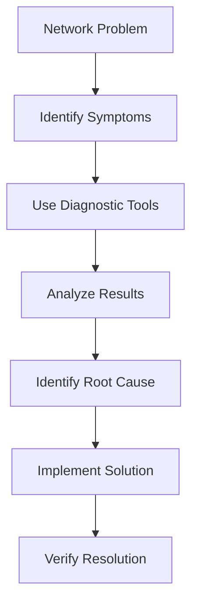
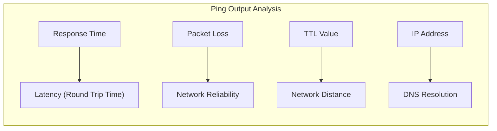
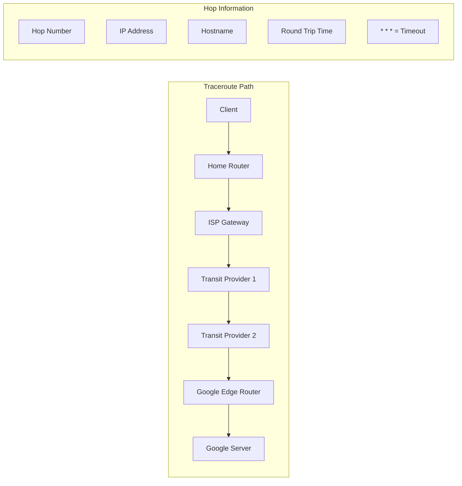
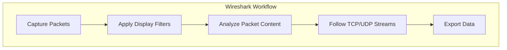
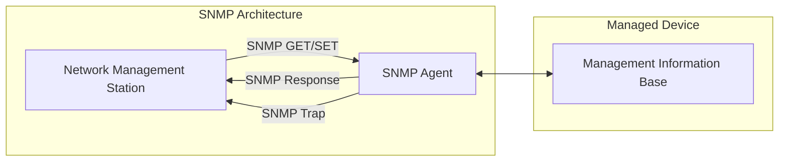
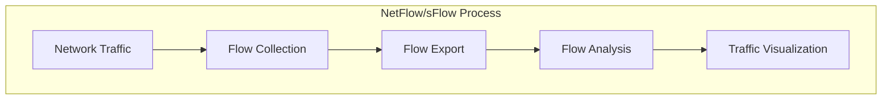
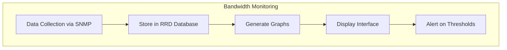
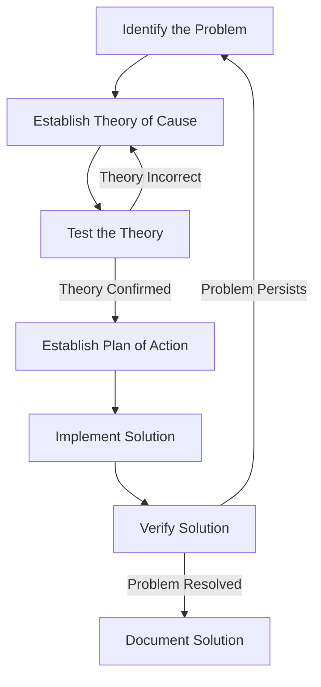

# Day 8: Network Diagnostic and Monitoring Tools

<div align="center">
  
  
  <h1>🔍 Network Diagnostic and Monitoring Tools 🔍</h1>
  
  <p>
    
    
    
    
  </p>
  
  <hr>
</div>

## Table of Contents
- [Introduction to Network Diagnostics](#introduction-to-network-diagnostics)
- [Basic Network Diagnostic Tools](#basic-network-diagnostic-tools)
  - [ping](#ping)
  - [traceroute/tracert](#traceroutetracert)
  - [nslookup and dig](#nslookup-and-dig)
  - [ipconfig/ifconfig](#ipconfigifconfig)
  - [netstat](#netstat)
- [Advanced Network Analysis Tools](#advanced-network-analysis-tools)
  - [Wireshark](#wireshark)
  - [tcpdump](#tcpdump)
  - [nmap](#nmap)
  - [iperf](#iperf)
- [Monitoring Network Performance](#monitoring-network-performance)
  - [SNMP Monitoring](#snmp-monitoring)
  - [NetFlow and sFlow](#netflow-and-sflow)
  - [Bandwidth Monitors](#bandwidth-monitors)
- [Network Troubleshooting Methodology](#network-troubleshooting-methodology)
- [Practice Questions](#practice-questions)

## Introduction to Network Diagnostics

Network diagnostic tools are essential for monitoring, troubleshooting, and maintaining network infrastructure. They help identify problems with connectivity, performance, and security by providing valuable insights into how data moves through a network.



### When to Use Network Diagnostic Tools

- **Connectivity Issues**: When devices can't communicate with each other
- **Performance Problems**: Slow network speeds or high latency
- **Configuration Verification**: Ensuring network settings are correct
- **Security Concerns**: Detecting unauthorized access or suspicious traffic
- **Routine Maintenance**: Regular monitoring of network health

## Basic Network Diagnostic Tools

### ping

Ping (Packet Internet Groper) is one of the most fundamental network diagnostic tools. It sends ICMP Echo Request packets to a target host and waits for ICMP Echo Reply responses.

```
$ ping google.com
PING google.com (2404:6800:4002:808::200e) 56 data bytes
64 bytes from del03s13-in-x0e.1e100.net (2404:6800:4002:808::200e): icmp_seq=1 ttl=117 time=34.5 ms
64 bytes from del03s13-in-x0e.1e100.net (2404:6800:4002:808::200e): icmp_seq=2 ttl=117 time=34.4 ms
64 bytes from del03s13-in-x0e.1e100.net (2404:6800:4002:808::200e): icmp_seq=3 ttl=117 time=33.5 ms
64 bytes from del03s13-in-x0e.1e100.net (2404:6800:4002:808::200e): icmp_seq=4 ttl=117 time=41.9 ms
...
--- google.com ping statistics ---
12 packets transmitted, 12 received, 0% packet loss, time 11005ms
rtt min/avg/max/mdev = 30.955/117.650/628.122/160.939 ms
```

#### What ping Tells You



| Metric | Meaning | Good Values | Concerning Values |
|--------|---------|-------------|-------------------|
| Round Trip Time | Time for packet to reach destination and return | <50ms (local), <100ms (regional) | >300ms |
| Packet Loss | Percentage of packets that don't return | 0% | >1% |
| TTL | Time to Live (hop count) | varies | unexpectedly low |
| Jitter | Variation in ping times | <30ms variation | >100ms variation |

#### Common ping Options

```bash
# Continuous ping (Linux)
ping google.com

# Specific number of packets (Windows)
ping -n 5 google.com

# Specific number of packets (Linux/Mac)
ping -c 5 google.com

# Change packet size
ping -s 1500 google.com

# Change interval
ping -i 0.2 google.com
```

#### When ping Fails

If ping fails, it could indicate:
- Target host is down
- Network connectivity issues
- Firewall blocking ICMP traffic
- DNS resolution problems (if pinging by hostname)

### traceroute/tracert

Traceroute maps the path that packets take to reach a destination, showing each hop along the way.

```
$ traceroute google.com
traceroute to google.com (142.250.193.142), 30 hops max, 60 byte packets
 1  router.home (192.168.1.1)  3.171 ms  3.144 ms  3.121 ms
 2  96.120.42.133 (96.120.42.133)  11.272 ms  11.252 ms  11.230 ms
 3  96.110.41.237 (96.110.41.237)  13.326 ms  13.305 ms  13.282 ms
 4  ae-32-0.cr0.dca10.tbone.rr.com (66.109.6.100)  15.691 ms  15.670 ms  19.293 ms
 5  ae-1-0.pr0.dca10.tbone.rr.com (107.14.19.56)  19.271 ms  19.248 ms  19.226 ms
 6  142.250.163.186 (142.250.163.186)  19.204 ms  13.941 ms  13.900 ms
 7  142.250.231.67 (142.250.231.67)  13.878 ms 142.250.231.69 (142.250.231.69)  13.856 ms  13.833 ms
 8  142.250.236.77 (142.250.236.77)  13.811 ms  13.788 ms 216.239.41.85 (216.239.41.85)  13.766 ms
 9  * * *
10  * * *
11  wash-b1-link.ip.twelve99.net (62.115.136.204)  13.700 ms 142.250.209.35 (142.250.209.35)  13.677 ms dca-b1-link.ip.twelve99.net (62.115.136.161)  13.655 ms
12  wash-b1-link.ip.twelve99.net (62.115.136.204)  15.974 ms  15.951 ms 142.250.209.35 (142.250.209.35)  15.929 ms
13  * * *
14  * * *
15  bos-b1-link.ip.twelve99.net (62.115.137.69)  21.315 ms  17.654 ms dca-b1-link.ip.twelve99.net (62.115.136.161)  17.631 ms
16  google-ic-345385-bos-b1.ip.twelve99-cust.net (62.115.171.9)  17.609 ms  17.586 ms google-ic-345385-was-b1.ip.twelve99-cust.net (62.115.41.131)  17.564 ms
17  * * *
18  * * *
19  * * *
20  del03s13-in-f14.1e100.net (142.250.193.142)  17.450 ms  19.663 ms  19.640 ms
```



#### How Traceroute Works

Traceroute sends packets with incrementing TTL (Time to Live) values:
1. First packet has TTL=1, expires at first hop
2. Second packet has TTL=2, expires at second hop
3. And so on...

When a packet expires, the router sends back an ICMP "Time Exceeded" message, allowing traceroute to map the path.

### nslookup and dig

These tools query DNS servers to retrieve DNS information about domains and IP addresses.

#### nslookup example:

```
$ nslookup google.com
Server:         192.168.1.1
Address:        192.168.1.1#53

Non-authoritative answer:
Name:   google.com
Address: 142.250.193.142
Name:   google.com
Address: 2404:6800:4002:808::200e
```

#### dig example:

```
$ dig google.com

; <<>> DiG 9.16.1-Ubuntu <<>> google.com
;; global options: +cmd
;; Got answer:
;; ->>HEADER<<- opcode: QUERY, status: NOERROR, id: 28242
;; flags: qr rd ra; QUERY: 1, ANSWER: 1, AUTHORITY: 0, ADDITIONAL: 1

;; OPT PSEUDOSECTION:
; EDNS: version: 0, flags:; udp: 65494
;; QUESTION SECTION:
;google.com.                    IN      A

;; ANSWER SECTION:
google.com.             216     IN      A       142.250.193.142

;; Query time: 4 msec
;; SERVER: 192.168.1.1#53(192.168.1.1)
;; WHEN: Tue Sep 02 15:30:25 EDT 2025
;; MSG SIZE  rcvd: 55
```

### ipconfig/ifconfig

These commands display network interface configuration.

#### ipconfig (Windows):

```
C:\> ipconfig /all
Windows IP Configuration

   Host Name . . . . . . . . . . . . : Laptop
   Primary Dns Suffix  . . . . . . . : 
   Node Type . . . . . . . . . . . . : Hybrid
   IP Routing Enabled. . . . . . . . : No
   WINS Proxy Enabled. . . . . . . . : No

Ethernet adapter Ethernet:
   Media State . . . . . . . . . . . : Media disconnected
   Connection-specific DNS Suffix  . : 
   Description . . . . . . . . . . . : Realtek PCIe GbE Family Controller
   Physical Address. . . . . . . . . : 00-11-22-33-44-55
   DHCP Enabled. . . . . . . . . . . : Yes
   Autoconfiguration Enabled . . . . : Yes

Wireless LAN adapter Wi-Fi:
   Connection-specific DNS Suffix  . : home
   Description . . . . . . . . . . . : Intel(R) Wi-Fi 6 AX201 160MHz
   Physical Address. . . . . . . . . : AA-BB-CC-DD-EE-FF
   DHCP Enabled. . . . . . . . . . . : Yes
   Autoconfiguration Enabled . . . . : Yes
   IPv4 Address. . . . . . . . . . . : 192.168.1.100(Preferred)
   Subnet Mask . . . . . . . . . . . : 255.255.255.0
   Lease Obtained. . . . . . . . . . : Tuesday, September 2, 2025 10:15:36 AM
   Lease Expires . . . . . . . . . . : Wednesday, September 3, 2025 10:15:36 AM
   Default Gateway . . . . . . . . . : 192.168.1.1
   DHCP Server . . . . . . . . . . . : 192.168.1.1
   DNS Servers . . . . . . . . . . . : 192.168.1.1
   NetBIOS over Tcpip. . . . . . . . : Enabled
```

#### ifconfig (Linux/Mac):

```
$ ifconfig
eth0: flags=4163<UP,BROADCAST,RUNNING,MULTICAST>  mtu 1500
        inet 192.168.1.100  netmask 255.255.255.0  broadcast 192.168.1.255
        inet6 fe80::216:3eff:fe2f:e24c  prefixlen 64  scopeid 0x20<link>
        ether 00:16:3e:2f:e2:4c  txqueuelen 1000  (Ethernet)
        RX packets 82574  bytes 108930952 (103.8 MiB)
        RX errors 0  dropped 0  overruns 0  frame 0
        TX packets 29126  bytes 3087279 (2.9 MiB)
        TX errors 0  dropped 0 overruns 0  carrier 0  collisions 0

lo: flags=73<UP,LOOPBACK,RUNNING>  mtu 65536
        inet 127.0.0.1  netmask 255.0.0.0
        inet6 ::1  prefixlen 128  scopeid 0x10<host>
        loop  txqueuelen 1000  (Local Loopback)
        RX packets 672  bytes 61516 (60.0 KiB)
        RX errors 0  dropped 0  overruns 0  frame 0
        TX packets 672  bytes 61516 (60.0 KiB)
        TX errors 0  dropped 0 overruns 0  carrier 0  collisions 0
```

### netstat

Netstat (network statistics) displays network connections, routing tables, interface statistics, and more.

```
$ netstat -tuln
Active Internet connections (only servers)
Proto Recv-Q Send-Q Local Address           Foreign Address         State      
tcp        0      0 0.0.0.0:22              0.0.0.0:*               LISTEN     
tcp        0      0 127.0.0.1:631           0.0.0.0:*               LISTEN     
tcp6       0      0 :::22                   :::*                    LISTEN     
tcp6       0      0 ::1:631                 :::*                    LISTEN     
udp        0      0 0.0.0.0:5353            0.0.0.0:*                          
udp        0      0 0.0.0.0:631             0.0.0.0:*                          
udp6       0      0 :::5353                 :::*                               
```

Common netstat options:
- `-t`: TCP connections
- `-u`: UDP connections
- `-l`: Listening sockets
- `-n`: Show numerical addresses
- `-p`: Show process/program name (requires root)

## Advanced Network Analysis Tools

### Wireshark

Wireshark is a powerful network protocol analyzer that captures and inspects packets in real-time.



#### Key Wireshark Features

1. **Packet Capture**: Capture packets from various network interfaces
2. **Deep Inspection**: Analyze hundreds of protocols
3. **Live Capture and Offline Analysis**: Analyze live network traffic or saved capture files
4. **Display Filters**: Filter traffic based on complex criteria
5. **VoIP Analysis**: Call flow diagrams and audio extraction
6. **Colorization Rules**: Highlight packets based on filters

#### Common Wireshark Display Filters

```
# HTTP traffic
http

# DNS traffic
dns

# Traffic to/from a specific IP
ip.addr == 192.168.1.100

# All TCP traffic on port 80
tcp.port == 80

# HTTPS traffic with errors
ssl and ssl.alert

# ARP packets
arp

# Packet size filter
frame.len > 1000
```

### tcpdump

tcpdump is a command-line packet analyzer available on most Unix-like operating systems.

```
$ sudo tcpdump -i eth0 -n port 80
tcpdump: verbose output suppressed, use -v or -vv for full protocol decode
listening on eth0, link-type EN10MB (Ethernet), capture size 262144 bytes
15:42:41.779679 IP 192.168.1.100.58264 > 93.184.216.34.80: Flags [S], seq 2438113533, win 64240, options [mss 1460,sackOK,TS val 1993302131 ecr 0,nop,wscale 7], length 0
15:42:41.799892 IP 93.184.216.34.80 > 192.168.1.100.58264: Flags [S.], seq 1448528563, ack 2438113534, win 65535, options [mss 1452,sackOK,TS val 2868340832 ecr 1993302131,nop,wscale 9], length 0
15:42:41.799932 IP 192.168.1.100.58264 > 93.184.216.34.80: Flags [.], ack 1, win 502, options [nop,nop,TS val 1993302151 ecr 2868340832], length 0
```

### nmap

Nmap (Network Mapper) is a security scanner used to discover hosts and services on a network.

```
$ nmap -A 192.168.1.1
Starting Nmap 7.80 ( https://nmap.org ) at 2025-09-02 15:45 EDT
Nmap scan report for router.home (192.168.1.1)
Host is up (0.0042s latency).
Not shown: 996 closed ports
PORT   STATE SERVICE VERSION
22/tcp open  ssh     OpenSSH 8.2p1 Ubuntu 4ubuntu0.5 (Ubuntu Linux; protocol 2.0)
53/tcp open  domain  ISC BIND 9.16.1 (Ubuntu Linux)
80/tcp open  http    Apache httpd 2.4.41 ((Ubuntu))
|_http-server-header: Apache/2.4.41 (Ubuntu)
|_http-title: Router Administration
443/tcp open  https   Apache httpd 2.4.41 ((Ubuntu))
|_http-server-header: Apache/2.4.41 (Ubuntu)
|_http-title: Router Administration
| ssl-cert: Subject: commonName=router.home
| Not valid before: 2025-01-01T00:00:00
|_Not valid after:  2026-01-01T00:00:00
MAC Address: 00:11:22:33:44:55 (Manufacturer)
Device type: general purpose
Running: Linux 5.X
OS CPE: cpe:/o:linux:linux_kernel:5
OS details: Linux 5.0 - 5.4
Network Distance: 1 hop
Service Info: OS: Linux; CPE: cpe:/o:linux:linux_kernel

TRACEROUTE
HOP RTT     ADDRESS
1   4.23 ms router.home (192.168.1.1)

OS and Service detection performed. Please report any incorrect results at https://nmap.org/submit/ .
Nmap done: 1 IP address (1 host) scanned in 22.52 seconds
```

#### Common nmap Scan Types

| Scan Type | Command | Purpose |
|-----------|---------|---------|
| Quick Scan | `nmap 192.168.1.0/24` | Basic scan of entire subnet |
| Detailed Scan | `nmap -A 192.168.1.1` | OS and service detection |
| Port Scan | `nmap -p 1-1000 192.168.1.1` | Scan specific port range |
| Stealth Scan | `nmap -sS 192.168.1.1` | SYN scan (less detectable) |
| UDP Scan | `nmap -sU 192.168.1.1` | Scan UDP ports |
| OS Detection | `nmap -O 192.168.1.1` | Identify operating system |
| Service Version | `nmap -sV 192.168.1.1` | Determine service versions |

### iperf

iperf is a tool for measuring network performance between two endpoints.

```
# On the server
$ iperf -s
Server listening on TCP port 5001

# On the client
$ iperf -c 192.168.1.10
Client connecting to 192.168.1.10, TCP port 5001
TCP window size: 85.0 KByte (default)
[  3] local 192.168.1.100 port 58606 connected with 192.168.1.10 port 5001
[ ID] Interval       Transfer     Bandwidth
[  3]  0.0-10.0 sec   112 MBytes  94.1 Mbits/sec
```

## Monitoring Network Performance

### SNMP Monitoring

Simple Network Management Protocol (SNMP) is widely used for monitoring network devices.



### NetFlow and sFlow

NetFlow (Cisco) and sFlow are network protocols for collecting IP traffic information.



### Bandwidth Monitors

Tools like MRTG, Cacti, and LibreNMS provide graphical representations of network bandwidth usage.



## Network Troubleshooting Methodology



### OSI Model Troubleshooting Approach

| Layer | Common Issues | Diagnostic Tools |
|-------|---------------|------------------|
| Physical | Cable, interface, power issues | Link lights, cable testers |
| Data Link | MAC address, framing issues | ifconfig/ipconfig, arp |
| Network | Routing, IP addressing issues | ping, traceroute, route |
| Transport | Port, connection issues | netstat, telnet, nmap |
| Session | Session establishment issues | Wireshark, session logs |
| Presentation | Encoding, encryption issues | Wireshark, SSL tools |
| Application | Application-specific issues | Application logs, Wireshark |

## Practice Questions

1. Analyze the following ping output and explain what it tells you about the network connection:
   ```
   $ ping google.com
   PING google.com (2404:6800:4002:808::200e) 56 data bytes
   64 bytes from del03s13-in-x0e.1e100.net (2404:6800:4002:808::200e): icmp_seq=1 ttl=117 time=34.5 ms
   64 bytes from del03s13-in-x0e.1e100.net (2404:6800:4002:808::200e): icmp_seq=2 ttl=117 time=34.4 ms
   64 bytes from del03s13-in-x0e.1e100.net (2404:6800:4002:808::200e): icmp_seq=3 ttl=117 time=33.5 ms
   64 bytes from del03s13-in-x0e.1e100.net (2404:6800:4002:808::200e): icmp_seq=6 ttl=117 time=101 ms
   64 bytes from del03s13-in-x0e.1e100.net (2404:6800:4002:808::200e): icmp_seq=10 ttl=117 time=628 ms
   ```

2. You need to troubleshoot a connectivity issue between two computers on the same network. Outline the diagnostic tools you would use and in what order, explaining your approach.

3. Explain how traceroute works and how it can help in diagnosing network problems.

4. What information can you gather from a Wireshark packet capture that you can't easily obtain from simpler tools like ping and traceroute?

5. A user reports slow internet connectivity. Describe how you would use iperf to determine if the issue is with their local network or with their ISP.

6. Compare and contrast the uses of nslookup and dig. When would you prefer one over the other?

7. Explain the difference between active and passive monitoring tools and provide examples of each.

8. What are the security implications of using tools like nmap and Wireshark on a corporate network? What precautions should be taken?

9. How would you use netstat to identify if a particular service is running and listening for connections on a server?

10. Design a network monitoring strategy for a medium-sized company with multiple office locations, explaining which tools you would use and why.

## Additional Resources

- [Wireshark Official Documentation](https://www.wireshark.org/docs/)
- [nmap Network Scanning Guide](https://nmap.org/book/)
- [IETF RFC 792: Internet Control Message Protocol (ICMP)](https://tools.ietf.org/html/rfc792)
- [The TCP/IP Guide by Charles M. Kozierok](http://www.tcpipguide.com/)
- [Practical Packet Analysis by Chris Sanders](https://nostarch.com/packet3)

---

<div align="center">
  <p>
    <a href="../day_007/README.md">⬅️ Previous Day</a> | 
    <a href="../README.md">🏠 Home</a> |
    <a href="../day_009/README.md">➡️ Next Day</a>
  </p>
</div>
