# Day 8: Special IP Networking Concepts

## Topics Covered
- Special IP Networking Concepts

## 1. Quality of Service (QoS)

Quality of Service refers to the ability to provide different priorities to different applications, users, or data flows, guaranteeing a certain level of performance to data flows.

### QoS Parameters

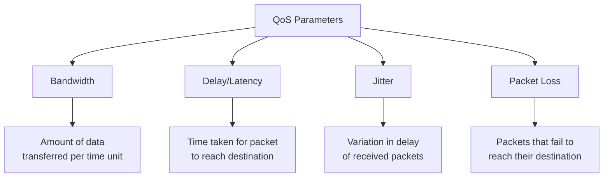

### QoS Models

1. **Best Effort:** No guarantees for delivery or performance (default Internet model)

2. **Integrated Services (IntServ):**
   - Resource reservation for flows
   - Uses RSVP (Resource Reservation Protocol)
   - End-to-end QoS
   - Scalability issues in large networks

3. **Differentiated Services (DiffServ):**
   - Classification and marking at network edge
   - Different treatment based on classes
   - More scalable than IntServ
   - Widely deployed in enterprise and service provider networks

### DiffServ Architecture

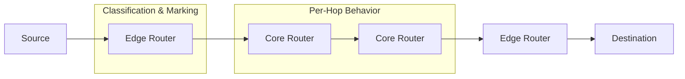

### DiffServ Code Point (DSCP)

The DSCP field in the IP header defines how packets are treated in the network.

**Common DSCP Values:**

| Class | DSCP Name | DSCP Value (Decimal) | Priority |
|-------|-----------|---------------------|----------|
| Expedited Forwarding | EF | 46 | Highest |
| Assured Forwarding 4 | AF41, AF42, AF43 | 34, 36, 38 | High |
| Assured Forwarding 3 | AF31, AF32, AF33 | 26, 28, 30 | Medium-High |
| Assured Forwarding 2 | AF21, AF22, AF23 | 18, 20, 22 | Medium |
| Assured Forwarding 1 | AF11, AF12, AF13 | 10, 12, 14 | Medium-Low |
| Default | DF | 0 | Default |

### QoS Mechanisms

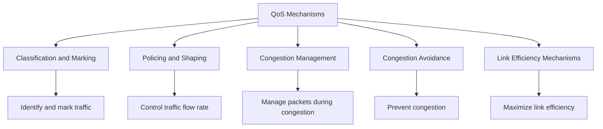

#### Classification and Marking

Identifies and marks traffic for appropriate treatment through the network.

**Methods:**
- Layer 2: 802.1Q/p CoS (Class of Service)
- Layer 3: IP Precedence, DSCP
- MPLS EXP bits

#### Policing and Shaping

Controls the rate of traffic:
- **Policing**: Drops packets exceeding defined rate
- **Shaping**: Buffers packets exceeding defined rate

```
Traffic Rate
    ▲
    │        Policing
    │         ┌───┐                 ┌───┐
    │         │   │                 │   │
    │ ────────┘   └─────────────────┘   └────
    │
    │        Shaping
    │         ┌───────────┐       ┌───────────┐
    │         │           │       │           │
    │ ────────┘           └───────┘           └────
    │
    └───────────────────────────────────────────► Time
```

#### Congestion Management (Queuing)

Manages how packets are queued and transmitted when congestion occurs.

**Common Queuing Methods:**
- FIFO (First In, First Out)
- PQ (Priority Queuing)
- CQ (Custom Queuing)
- WFQ (Weighted Fair Queuing)
- CBWFQ (Class-Based Weighted Fair Queuing)
- LLQ (Low Latency Queuing)

#### Congestion Avoidance

Prevents queues from filling up and causing packet drops.

**Techniques:**
- RED (Random Early Detection)
- WRED (Weighted Random Early Detection)
- ECN (Explicit Congestion Notification)

## 2. Multicast

IP Multicast enables efficient one-to-many or many-to-many distribution of data over an IP network.

### Multicast Fundamentals

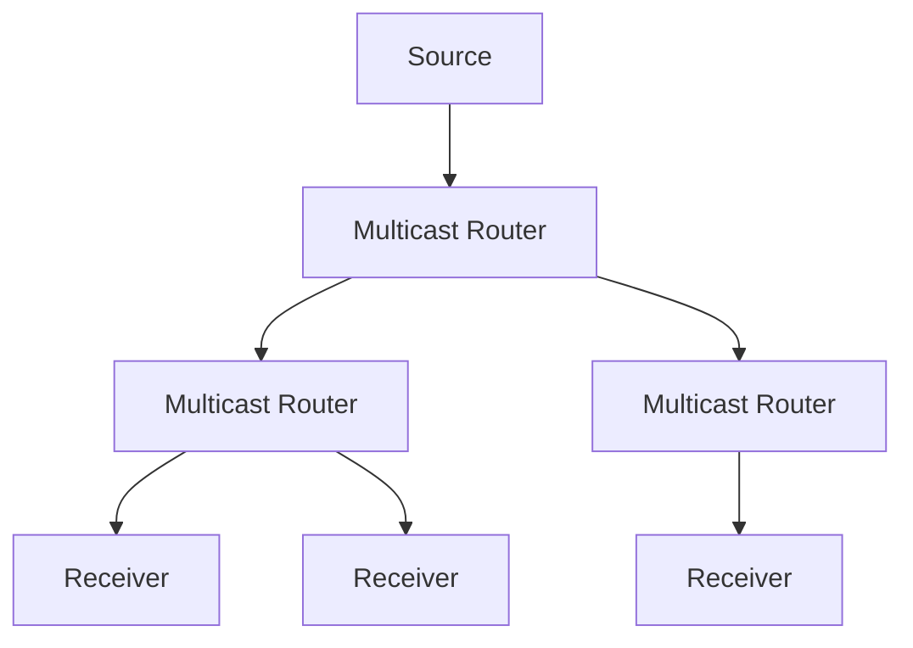

**Benefits of Multicast:**
- Bandwidth efficiency
- Reduced server and network load
- Scalability for large-scale content distribution

### IPv4 Multicast Addressing

IPv4 multicast addresses range from 224.0.0.0 to 239.255.255.255 (Class D).

**Special Multicast Ranges:**
- 224.0.0.0 to 224.0.0.255: Link-local multicast
- 224.0.1.0 to 238.255.255.255: Globally-scoped multicast
- 239.0.0.0 to 239.255.255.255: Administratively-scoped (private) multicast

**Common Multicast Addresses:**
- 224.0.0.1: All hosts on the local network
- 224.0.0.2: All routers on the local network
- 224.0.0.5: All OSPF routers
- 224.0.0.6: All OSPF designated routers

### Multicast Group Management

IGMP (Internet Group Management Protocol) is used by hosts to report multicast group memberships to local multicast routers.

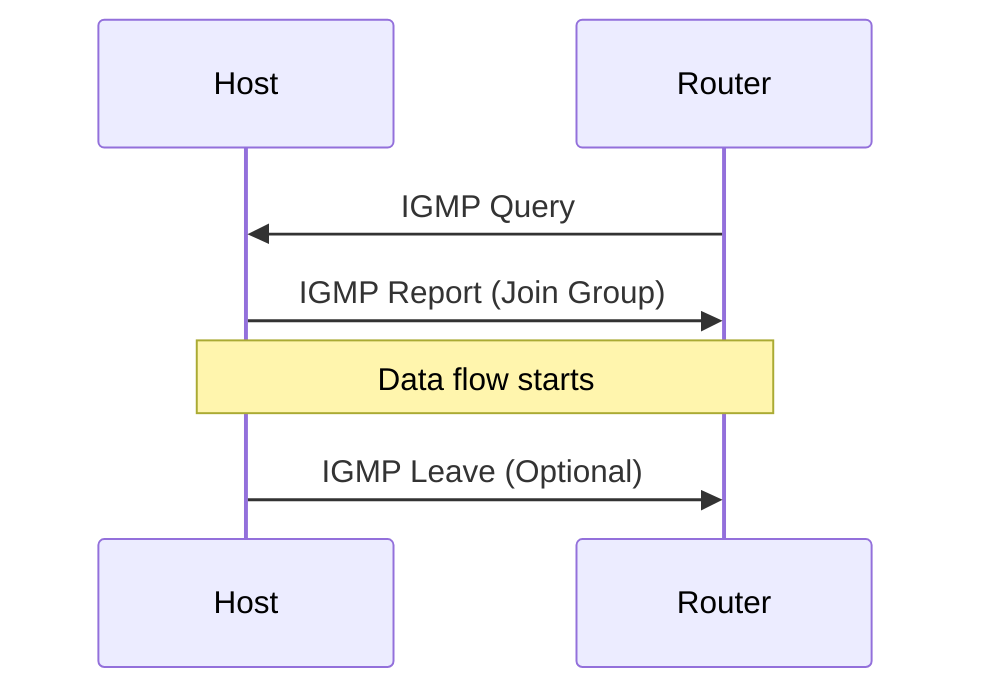

**IGMP Versions:**
- **IGMPv1:** Basic join functionality
- **IGMPv2:** Adds fast leave process
- **IGMPv3:** Adds source filtering (SSM support)

### Multicast Routing Protocols

Multicast routing protocols build distribution trees to forward multicast traffic efficiently.

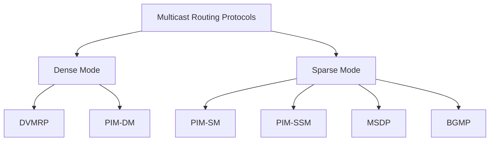

**Protocol Independent Multicast (PIM):**
- **PIM-SM (Sparse Mode):** Pull model, builds shared trees
- **PIM-DM (Dense Mode):** Push model, flood and prune
- **PIM-SSM (Source Specific Multicast):** Direct source-to-receiver trees

## 3. Anycast

Anycast is a network addressing and routing methodology where data is routed to the topologically nearest node in a group of potential receivers identified by the same destination address.

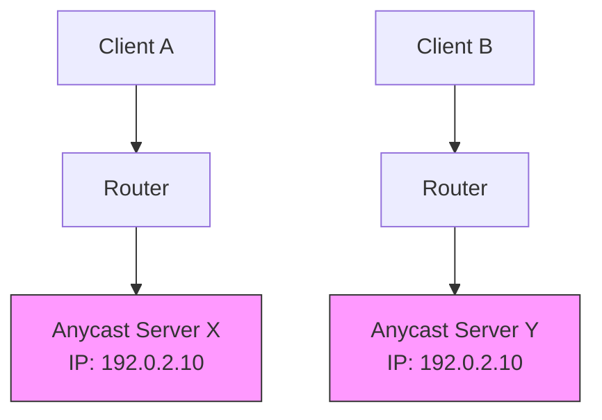

**Use Cases:**
- DNS servers (like root DNS servers)
- Content Delivery Networks (CDNs)
- DDoS mitigation services
- Load balancing across geographic regions

**Benefits:**
- Reduced latency (nearest server responds)
- Increased reliability through redundancy
- Automatic failover if a server becomes unavailable
- Load distribution

**Implementation:**
- Same IP address assigned to multiple servers
- BGP routing announces the address from multiple locations
- Packets route to nearest instance based on routing metrics

## 4. Broadcast Domains and Collision Domains

Understanding broadcast and collision domains is crucial for network design and troubleshooting.

### Collision Domain

A collision domain is a network segment where data packet collisions can occur. Only one device can transmit at a time within a collision domain.

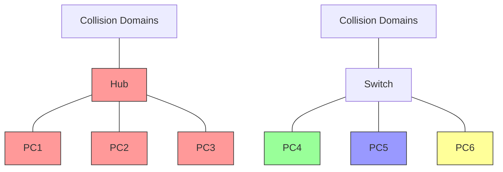

**Network Devices and Collision Domains:**
- **Hubs:** All ports are in the same collision domain
- **Switches:** Each port represents a separate collision domain
- **Bridges:** Separate collision domains on each side
- **Routers:** Separate collision domains on each interface

### Broadcast Domain

A broadcast domain is a logical division of a computer network, in which all nodes can reach each other by broadcast at the data link layer.

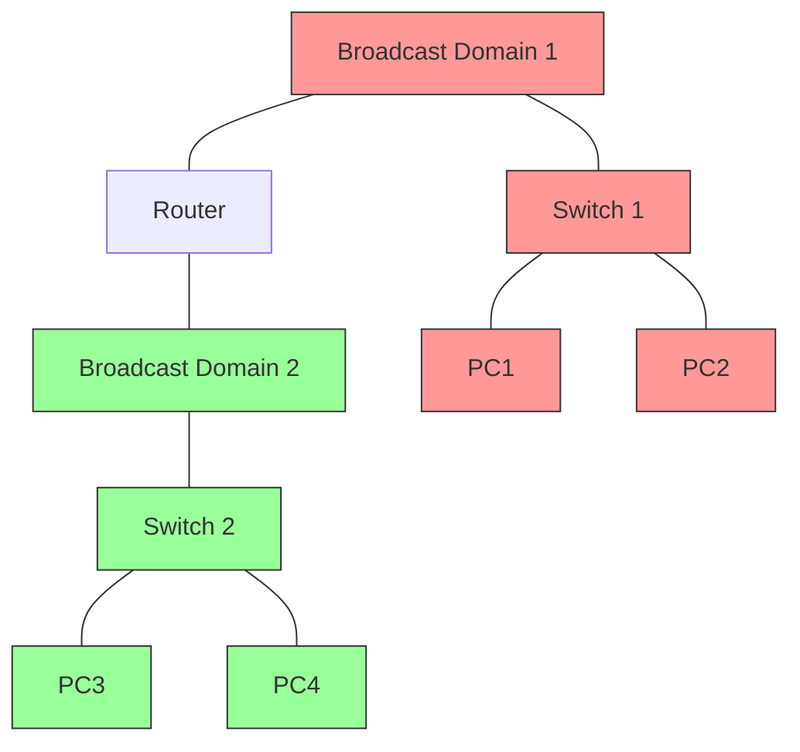

**Network Devices and Broadcast Domains:**
- **Hubs:** All ports are in the same broadcast domain
- **Switches:** All ports are in the same broadcast domain (unless VLANs are used)
- **Bridges:** All ports are in the same broadcast domain
- **Routers:** Separate broadcast domains on each interface
- **VLANs:** Each VLAN is a separate broadcast domain

## 5. VLAN Concepts

Virtual LANs (VLANs) logically segment a network without changing its physical topology.

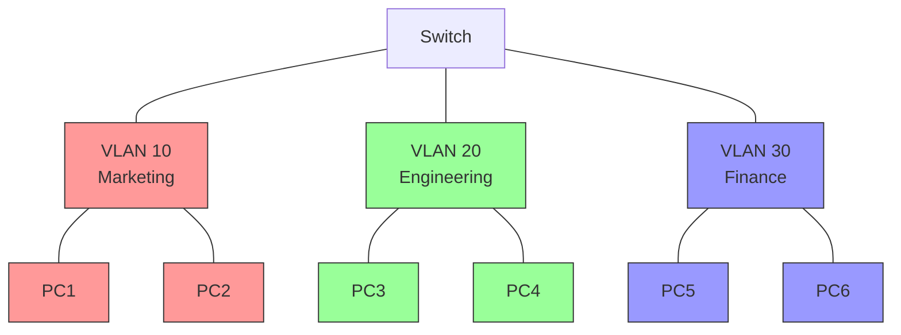

**Benefits of VLANs:**
- Reduced broadcast traffic
- Improved security through isolation
- Logical grouping of users by function
- Simplified network management
- Reduced need for routers

### VLAN Trunking

VLAN trunking allows VLANs to span multiple switches by carrying traffic for multiple VLANs over a single link.

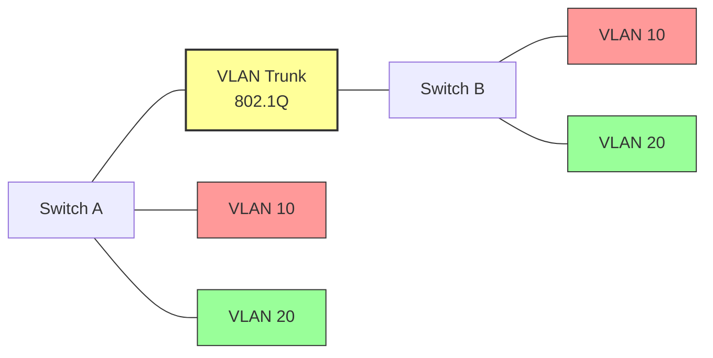

**Trunking Protocols:**
- **IEEE 802.1Q:** Industry standard, adds a tag to the frame
- **ISL (Inter-Switch Link):** Cisco proprietary, encapsulates the frame

### Inter-VLAN Routing

Inter-VLAN routing enables communication between different VLANs.

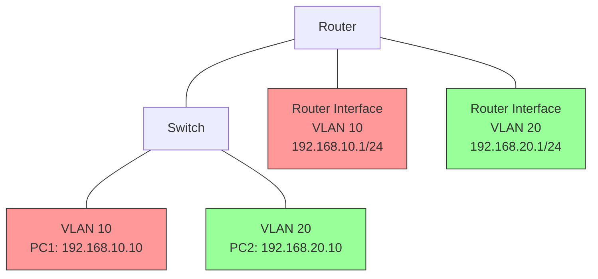

**Inter-VLAN Routing Methods:**
1. **Router on a Stick:** Single physical interface with subinterfaces
2. **Layer 3 Switch:** Switch with routing capabilities
3. **Multiple Router Interfaces:** Separate physical interface for each VLAN

## 6. Jumbo Frames

Jumbo frames are Ethernet frames with more than 1500 bytes of payload (the standard MTU size).

**Characteristics:**
- Typically 9000 bytes MTU (but can vary)
- Reduces overhead for large data transfers
- Improves CPU utilization
- Requires end-to-end support

**Use Cases:**
- Storage networks (iSCSI, NFS)
- Backup networks
- Server-to-server communication
- Virtualization environments

**Considerations:**
- All devices in the path must support the larger MTU
- Not suitable for voice or real-time traffic
- Can cause fragmentation issues if not configured properly

## 7. Network Address Translation (NAT) Variations

NAT has several variations beyond basic address translation.

### Port Address Translation (PAT)

Also known as NAT Overload, PAT maps multiple private IP addresses to a single public IP using different ports.

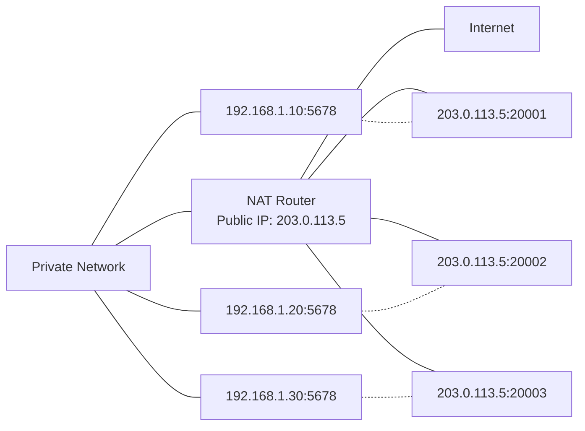

### Static NAT

Maps a specific private IP address to a specific public IP address.

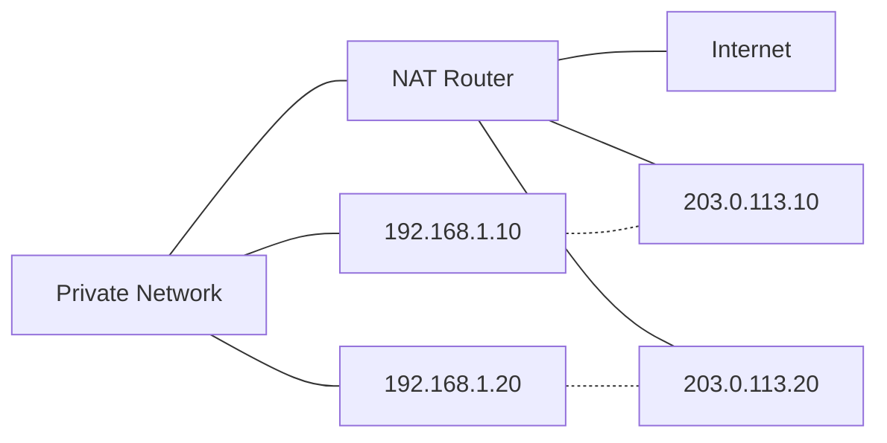

### Dynamic NAT

Maps private IP addresses to a pool of public IP addresses.

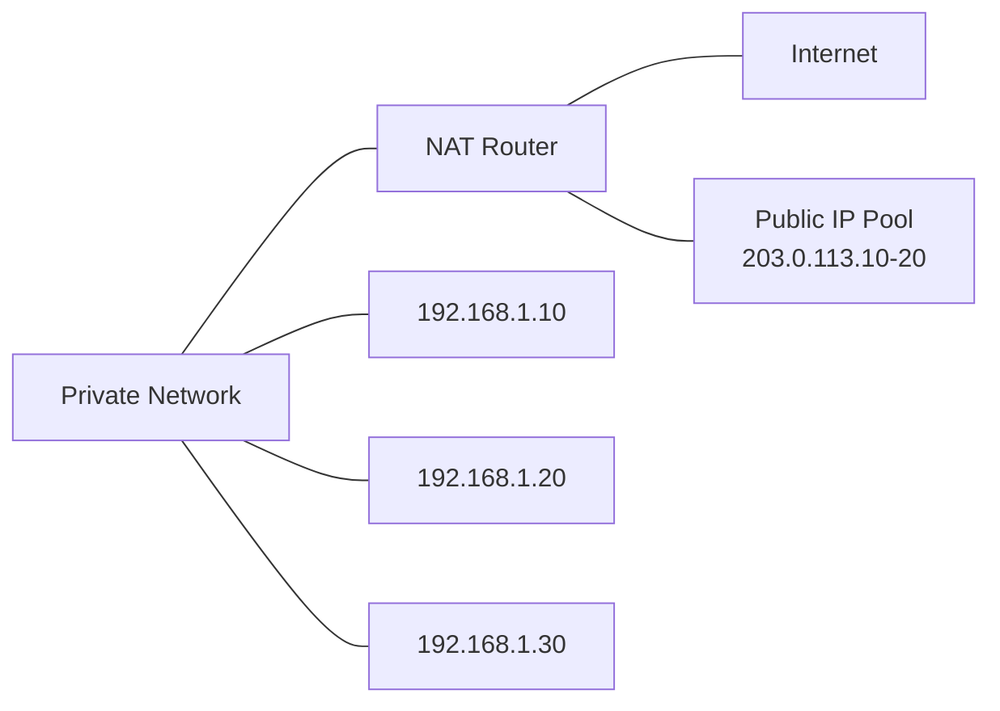

### NAT64

Allows IPv6-only clients to communicate with IPv4-only servers.

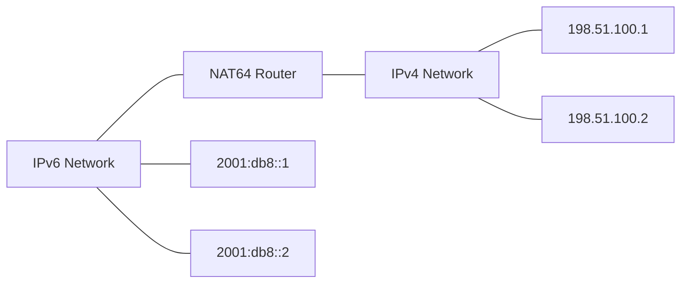

## 8. Overlay Networks

Overlay networks are virtual networks built on top of underlying network infrastructure.

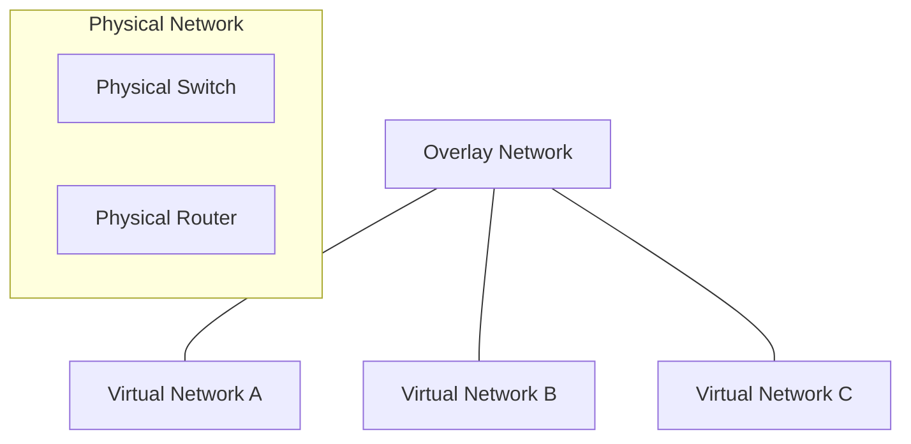

**Common Overlay Technologies:**
- **VXLAN (Virtual Extensible LAN):** Extends Layer 2 segments over Layer 3
- **NVGRE (Network Virtualization using GRE):** Microsoft's overlay solution
- **GRE (Generic Routing Encapsulation):** Simple tunneling protocol
- **MPLS (Multiprotocol Label Switching):** Packet forwarding with labels
- **VPN (Virtual Private Network):** Secure tunnels over public networks

**Use Cases:**
- Data center network virtualization
- Multi-tenant environments
- Cloud networking
- Network isolation
- Extending L2 domains across L3 boundaries

## Additional Resources

- [RFC 2474 - DiffServ Field Definition](https://tools.ietf.org/html/rfc2474)
- [RFC 3376 - IGMPv3](https://tools.ietf.org/html/rfc3376)
- [RFC 4786 - Operation of Anycast Services](https://tools.ietf.org/html/rfc4786)
- [IEEE 802.1Q - VLAN Standard](https://standards.ieee.org/standard/802_1Q-2018.html)
- [VXLAN - RFC 7348](https://tools.ietf.org/html/rfc7348)

## Practice Questions

1. A company wants to implement QoS for their VoIP traffic. Explain which QoS model (IntServ or DiffServ) would be more appropriate and why.

2. Compare and contrast broadcast domains and collision domains. How do different network devices affect each?

3. Design a VLAN implementation for a company with four departments: Marketing, Engineering, Finance, and IT. Include considerations for inter-VLAN routing.

4. You're implementing a multicast video streaming solution. Explain the process from a client joining a multicast group to receiving the stream.

5. A global company wants to implement DNS servers that automatically direct clients to the nearest server. Which technology would you recommend and why?
