# Day 9: Network Devices and Infrastructure Components

 
  
  <h1>🔌 Network Devices and Infrastructure Components 🔌</h1>
  
  

    
    
    
    
  

  
  

## Table of Contents
- [Introduction to Network Devices](#introduction-to-network-devices)
- [OSI Model and Network Devices](#osi-model-and-network-devices)
- [Physical Layer Devices](#physical-layer-devices)
  - [Repeaters](#repeaters)
  - [Hubs](#hubs)
  - [Transceivers](#transceivers)
- [Data Link Layer Devices](#data-link-layer-devices)
  - [Bridges](#bridges)
  - [Switches](#switches)
  - [Wireless Access Points](#wireless-access-points)
- [Network Layer Devices](#network-layer-devices)
  - [Routers](#routers)
  - [Layer 3 Switches](#layer-3-switches)
- [Higher Layer Devices](#higher-layer-devices)
  - [Gateways](#gateways)
  - [Proxies](#proxies)
  - [Load Balancers](#load-balancers)
  - [Firewalls](#firewalls)
- [Software-Defined Networking](#software-defined-networking)
- [Network Device Comparison](#network-device-comparison)
- [Network Device Management](#network-device-management)
- [Practice Questions](#practice-questions)

## Introduction to Network Devices

Network devices are specialized hardware components that manage the flow of data across a network. They perform various functions, including signal regeneration, traffic forwarding, path selection, protocol translation, and security enforcement.

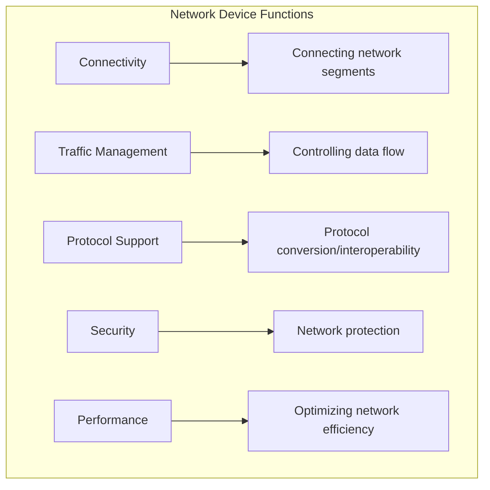

## OSI Model and Network Devices

Network devices operate at different layers of the OSI model, with each device type handling specific networking functions associated with their respective layers.

```mermaid
graph TB
    subgraph "OSI Model and Network Devices"
        L7[Layer 7: Application] --- G[Application Gateway]
        L6[Layer 6: Presentation] --- P[Proxy Server]
        L5[Layer 5: Session] --- F[Firewall]
        L4[Layer 4: Transport] --- LB[Load Balancer]
        L3[Layer 3: Network] --- R[Router/Layer 3 Switch]
        L2[Layer 2: Data Link] --- S[Bridge/Switch]
        L1[Layer 1: Physical] --- H[Repeater/Hub]
    end
    
    subgraph "Data Units"
        D7[Data]
        D6[Data]
        D5[Data]
        D4[Segments]
        D3[Packets]
        D2[Frames]
        D1[Bits]
    end
    
    L7 -.-> D7
    L6 -.-> D6
    L5 -.-> D5
    L4 -.-> D4
    L3 -.-> D3
    L2 -.-> D2
    L1 -.-> D1
```

## Physical Layer Devices

Physical layer devices operate at Layer 1 of the OSI model and work with electrical or optical signals.

### Repeaters

A repeater is a network device that amplifies or regenerates digital signals received on an incoming cable before retransmitting them to another segment of cable.

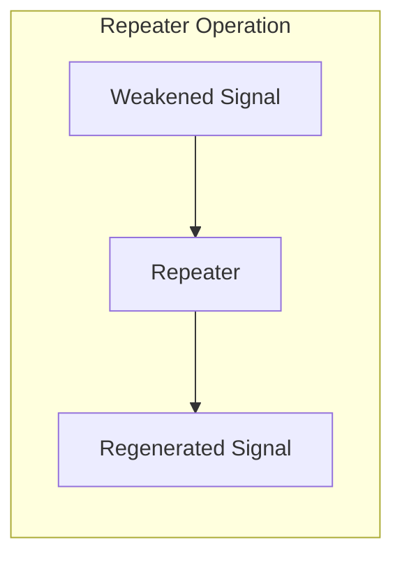

#### Key Characteristics of Repeaters

- **Function**: Extend the physical reach of a network by amplifying signals
- **OSI Layer**: Physical Layer (Layer 1)
- **Signal Processing**: Regenerates and retimes electrical signals
- **Collision Domains**: Does not create separate collision domains
- **Broadcast Domains**: Does not create separate broadcast domains
- **Intelligence**: No data examination or filtering
- **Ports**: Typically has 2 ports (input and output)

#### Applications of Repeaters

- Long-distance cable runs exceeding standard limitations
- Underground or underwater cable installations
- Overcoming signal degradation in harsh environments
- Legacy network systems with coaxial cabling

#### Limitations of Repeaters

- Cannot filter traffic (all signals are amplified)
- Does not isolate network segments from collisions
- Limited number of repeaters can be used in sequence due to timing issues
- No protocol conversion capabilities

### Hubs

A hub is a central connection point for devices in a network, typically in a star topology.

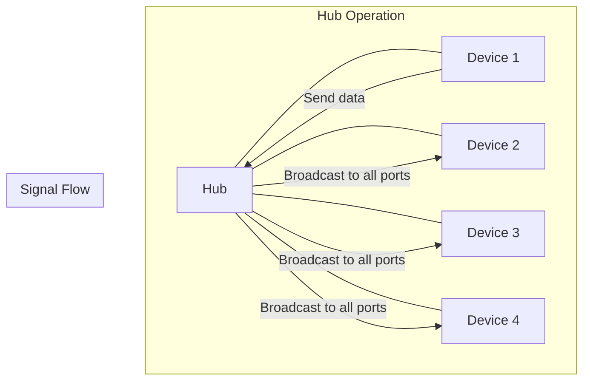

#### Types of Hubs

1. **Passive Hubs**: Simple connection points with no signal amplification
2. **Active Hubs**: Regenerate and clean up signals before transmission
3. **Intelligent Hubs**: Include management features and sometimes switching capabilities

#### Key Characteristics of Hubs

- **Function**: Connect multiple devices in a local area network
- **OSI Layer**: Physical Layer (Layer 1)
- **Signal Processing**: Broadcasts data received on any port to all other ports
- **Collision Domains**: Single collision domain
- **Broadcast Domains**: Single broadcast domain
- **Intelligence**: No data examination or filtering
- **Ports**: Multiple ports (typically 4, 8, 16, or 24)

#### Limitations of Hubs

- Creates a shared collision domain
- Network performance degrades as more devices are added
- No traffic filtering capability
- Security concerns as all devices see all traffic
- Largely obsolete, replaced by switches

### Transceivers

Transceivers convert signals between different physical mediums.

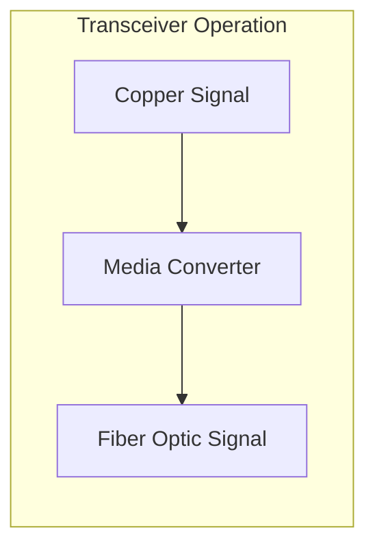

#### Types of Transceivers

- **Media Converters**: Convert between copper and fiber
- **SFP (Small Form-factor Pluggable)**: Hot-swappable optical transceivers
- **GBIC (Gigabit Interface Converter)**: Older version of SFP

## Data Link Layer Devices

Data link layer devices operate at Layer 2 of the OSI model and work with MAC addresses and frames.

### Bridges

A bridge connects multiple network segments at the data link layer.

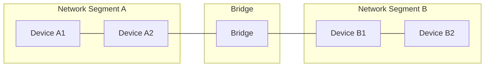

#### Key Characteristics of Bridges

- **Function**: Connect network segments, filter traffic based on MAC addresses
- **OSI Layer**: Data Link Layer (Layer 2)
- **Address Learning**: Builds and maintains a MAC address table
- **Collision Domains**: Creates separate collision domains
- **Broadcast Domains**: Single broadcast domain
- **Intelligence**: Examines MAC addresses to make forwarding decisions
- **Ports**: Usually 2-4 ports

#### Bridge Operation

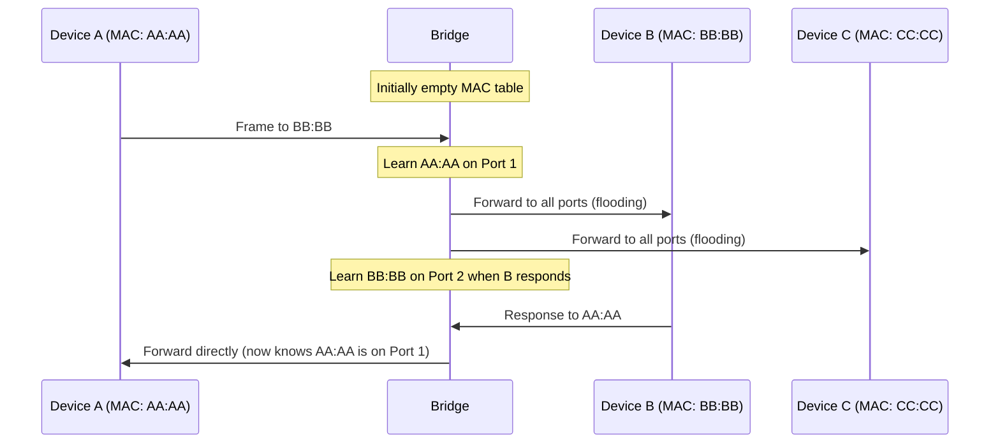

#### Applications of Bridges

- Connecting network segments with different physical media
- Reducing collision domains in legacy Ethernet networks
- Separating high-traffic areas of a network
- Simple filtering of local traffic

### Switches

A switch is a multiport bridge that processes and routes data at the data link layer.

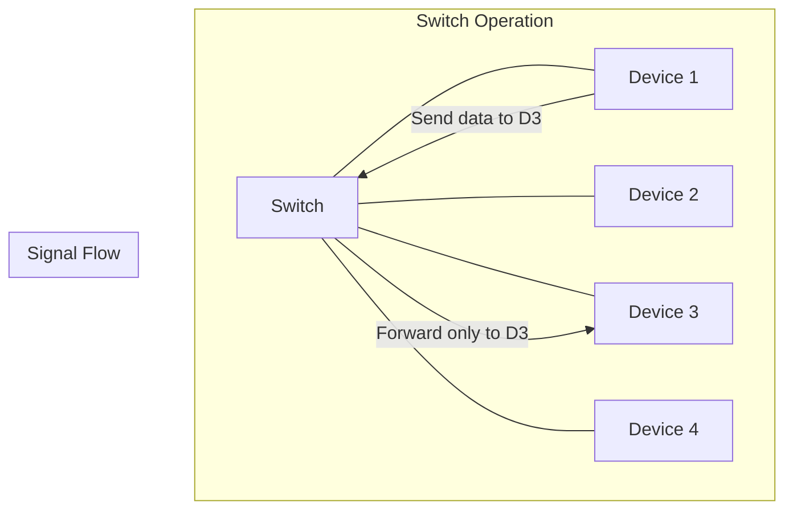

#### Key Characteristics of Switches

- **Function**: Intelligently forward frames to specific ports based on MAC addresses
- **OSI Layer**: Data Link Layer (Layer 2)
- **Address Learning**: Builds and maintains a MAC address table
- **Collision Domains**: Separate collision domain for each port
- **Broadcast Domains**: Single broadcast domain
- **Intelligence**: Examines frames to make forwarding decisions
- **Ports**: Multiple ports (8, 16, 24, 48 or more)

#### Advanced Switch Features

- **VLANs (Virtual LANs)**: Logical network segmentation
- **STP (Spanning Tree Protocol)**: Prevents loops
- **Link Aggregation**: Combines multiple links for higher throughput
- **QoS (Quality of Service)**: Prioritizes certain types of traffic
- **Port Security**: Restricts which MAC addresses can use a port
- **Port Mirroring**: Copies traffic for analysis

#### Types of Switches

1. **Unmanaged Switches**: Simple plug-and-play operation
2. **Managed Switches**: Configurable with advanced features
3. **Smart/Web-Managed Switches**: Limited management via web interface
4. **Enterprise Switches**: Full-featured with high reliability

### Wireless Access Points

Wireless Access Points (WAPs) connect wireless devices to a wired network.

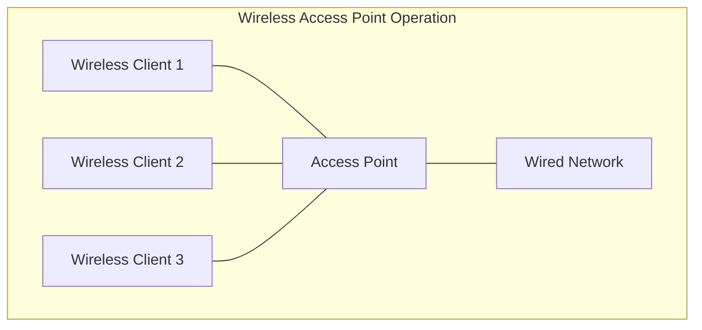

#### Key Characteristics of Wireless Access Points

- **Function**: Bridge between wireless and wired networks
- **OSI Layer**: Primarily Data Link Layer (Layer 2)
- **Wireless Standards**: Support various IEEE 802.11 standards (a/b/g/n/ac/ax)
- **Collision Domains**: Create collision domains for wireless devices
- **Broadcast Domains**: Typically part of the main broadcast domain
- **Security Features**: WPA2/WPA3, MAC filtering, SSID hiding

## Network Layer Devices

Network layer devices operate at Layer 3 of the OSI model and work with IP addresses and logical addressing.

### Routers

A router connects different networks and directs traffic based on logical (IP) addresses.

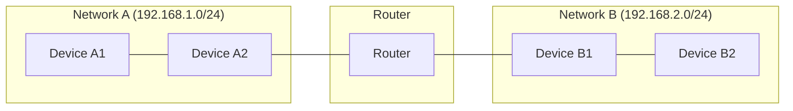

#### Key Characteristics of Routers

- **Function**: Connect different networks, determine best path for traffic
- **OSI Layer**: Network Layer (Layer 3)
- **Addressing**: Works with logical addresses (IP)
- **Collision Domains**: Creates separate collision domains
- **Broadcast Domains**: Creates separate broadcast domains
- **Intelligence**: Examines packet headers to make routing decisions
- **Ports**: Multiple interfaces for different networks

#### Router Operation

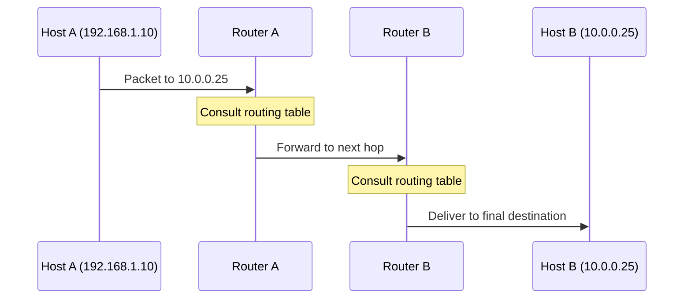

#### Router Components

1. **CPU**: Processes routing information and configurations
2. **Memory (RAM/NVRAM/Flash)**: Stores routing tables and configurations
3. **Interfaces**: Connect to different networks
4. **Routing Table**: Contains network paths and metrics
5. **Operating System**: Router OS (e.g., Cisco IOS, Juniper JUNOS)

#### Routing Protocols

- **Static Routing**: Manually configured routes
- **Dynamic Routing**: Automatically updated routes
  - **Interior Gateway Protocols (IGPs)**:
    - RIP (Routing Information Protocol)
    - OSPF (Open Shortest Path First)
    - EIGRP (Enhanced Interior Gateway Routing Protocol)
  - **Exterior Gateway Protocols (EGPs)**:
    - BGP (Border Gateway Protocol)

### Layer 3 Switches

Layer 3 switches combine switching and routing functions.

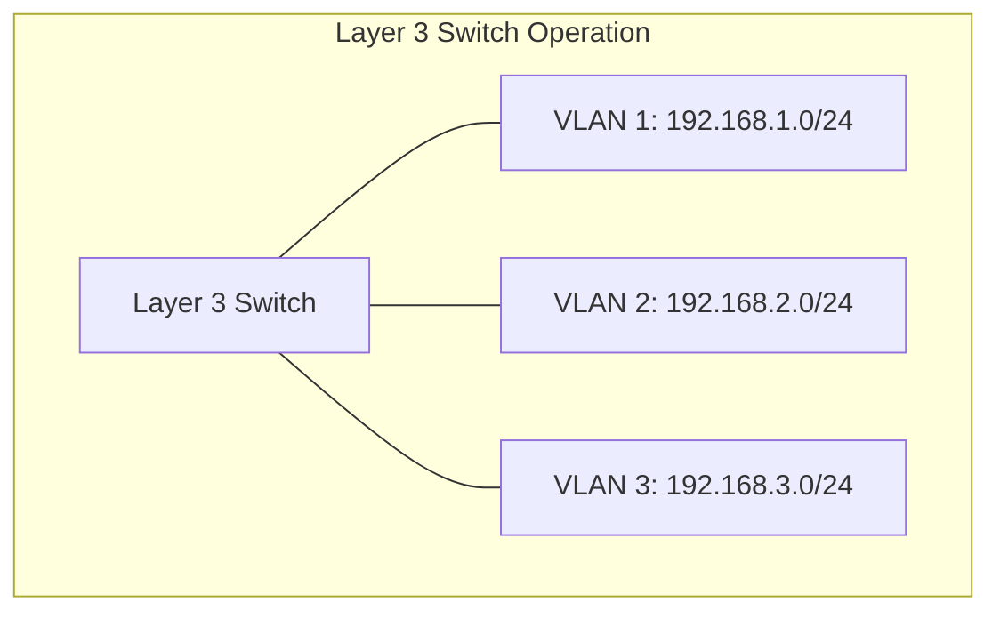

#### Key Characteristics of Layer 3 Switches

- **Function**: Perform both switching (Layer 2) and routing (Layer 3) functions
- **OSI Layer**: Data Link and Network Layers (Layers 2 & 3)
- **Performance**: Hardware-based routing (faster than traditional routers)
- **Use Cases**: Inter-VLAN routing, enterprise campus networks
- **Limitations**: Typically fewer routing protocols and WAN features than dedicated routers

## Higher Layer Devices

Devices that operate at transport layer and above in the OSI model.

### Gateways

A gateway connects networks with different architectures or protocols.

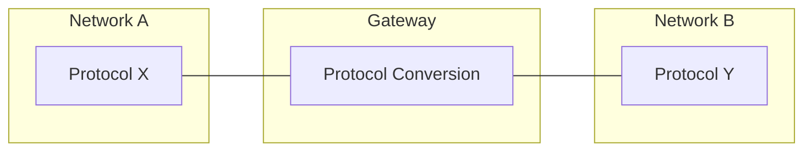

#### Key Characteristics of Gateways

- **Function**: Translate between different network architectures and protocols
- **OSI Layer**: Can operate at multiple layers (3-7)
- **Protocol Conversion**: Translates between different protocol stacks
- **Examples**: VoIP gateways, email gateways, IoT gateways

### Proxies

A proxy server acts as an intermediary for client requests seeking resources from other servers.

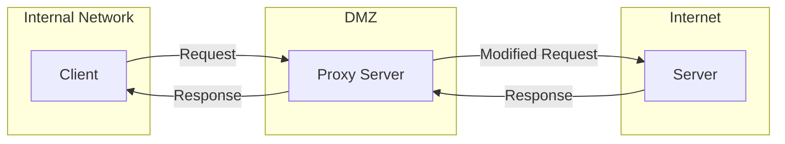

#### Types of Proxy Servers

1. **Forward Proxy**: Acts on behalf of clients (used for access control, caching)
2. **Reverse Proxy**: Acts on behalf of servers (load balancing, security, caching)
3. **Transparent Proxy**: Intercepts connections without client configuration
4. **SOCKS Proxy**: General-purpose proxy for TCP/UDP traffic

#### Key Characteristics of Proxy Servers

- **Function**: Intermediate service for client-server communications
- **OSI Layer**: Application Layer (Layer 7) primarily
- **Security Features**: Content filtering, client anonymity
- **Performance Features**: Caching, compression
- **Examples**: Web proxies, SOCKS proxies, content filtering proxies

### Load Balancers

Load balancers distribute network traffic across multiple servers.

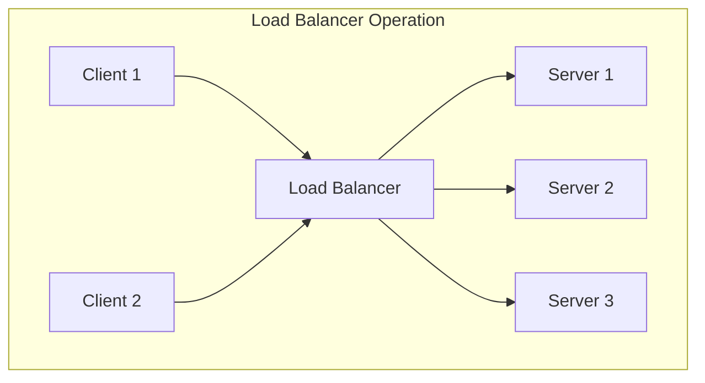

#### Load Balancing Algorithms

1. **Round Robin**: Rotate through servers sequentially
2. **Least Connections**: Send to server with fewest active connections
3. **Least Response Time**: Send to server with fastest response time
4. **IP Hash**: Use client IP to determine which server receives the request
5. **URL Hash**: Use requested URL to determine which server receives the request

#### Key Characteristics of Load Balancers

- **Function**: Distribute client requests across multiple servers
- **OSI Layer**: Can operate at various layers (4-7)
- **High Availability**: Enable redundancy and failover
- **Session Persistence**: Keep a client's connections on the same server
- **Health Checks**: Monitor server status and avoid routing to failed servers

### Firewalls

Firewalls monitor and filter network traffic based on predetermined security rules.

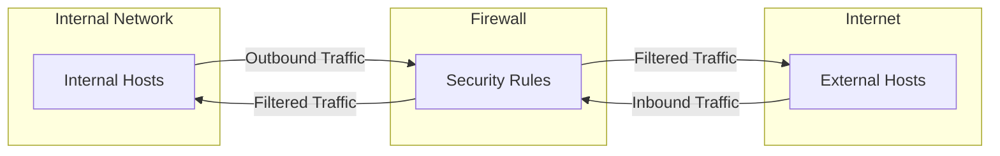

#### Types of Firewalls

1. **Packet Filtering Firewalls**: Examine packet headers (Layer 3-4)
2. **Stateful Inspection Firewalls**: Track the state of connections
3. **Application Layer Firewalls**: Examine application-level data (Layer 7)
4. **Next-Generation Firewalls (NGFW)**: Combine traditional firewall with advanced features
5. **Web Application Firewalls (WAF)**: Specifically protect web applications

#### Key Characteristics of Firewalls

- **Function**: Enforce security policy by filtering traffic
- **OSI Layer**: Can operate at various layers (3-7)
- **Filtering Criteria**: IP addresses, ports, protocols, application data
- **Deployment Models**: Network-based, host-based, cloud-based
- **Additional Features**: VPN, IDS/IPS, content filtering

## Software-Defined Networking

Software-Defined Networking (SDN) separates the control plane from the data plane in network devices.

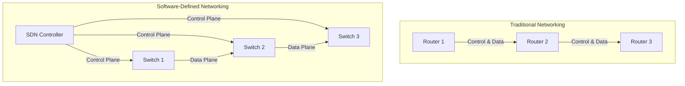

#### Key Characteristics of SDN

- **Control Plane**: Centralized decision-making via software controllers
- **Data Plane**: Packet forwarding based on controller instructions
- **Programmability**: Network behavior programmed via software
- **Automation**: Enables automated network configuration and management
- **Virtualization**: Supports network virtualization and service abstraction

## Network Device Comparison

| Device | OSI Layer | Primary Function | Collision Domains | Broadcast Domains | Addressing | Decision Making |
|--------|-----------|------------------|-------------------|-------------------|------------|----------------|
| Repeater | Layer 1 | Signal regeneration | 1 | 1 | None | None |
| Hub | Layer 1 | Connectivity | 1 | 1 | None | None |
| Bridge | Layer 2 | Segment connection | Multiple | 1 | MAC | MAC address table |
| Switch | Layer 2 | Intelligent frame forwarding | 1 per port | 1 (without VLANs) | MAC | MAC address table |
| Router | Layer 3 | Inter-network connectivity | Multiple | Multiple | IP | Routing table |
| Layer 3 Switch | Layer 2-3 | Switching and routing | 1 per port | Multiple | MAC & IP | MAC & routing tables |
| Gateway | Layer 3-7 | Protocol translation | Multiple | Multiple | Various | Protocol-specific |
| Proxy | Layer 7 | Intermediary services | Multiple | Multiple | IP & Application | Application rules |
| Firewall | Layer 3-7 | Security enforcement | Multiple | Multiple | Various | Security policy |

## Network Device Management

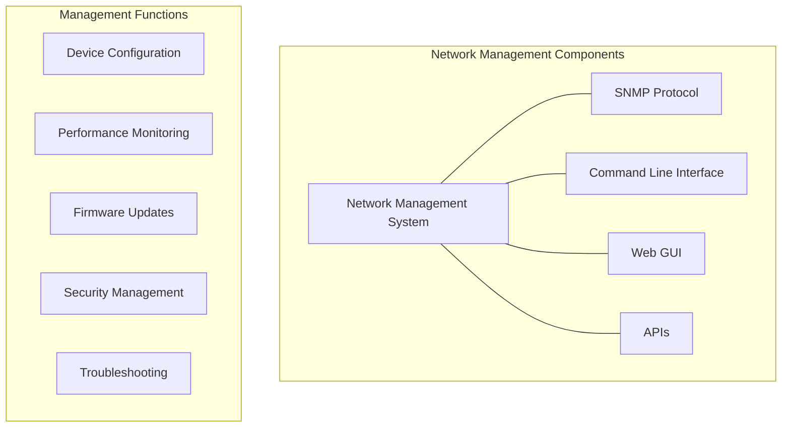

### Management Interfaces

1. **CLI (Command Line Interface)**: Terminal access (SSH, Telnet, Console)
2. **GUI (Graphical User Interface)**: Web-based management
3. **SNMP (Simple Network Management Protocol)**: Monitoring and management
4. **APIs (Application Programming Interfaces)**: Programmatic control
5. **NMS (Network Management Systems)**: Centralized management platforms

### Configuration Management

- **Running Configuration**: Active configuration in memory
- **Startup Configuration**: Saved configuration loaded at boot
- **Configuration Backups**: Storing configurations off-device
- **Configuration Templates**: Standardized configurations for device types
- **Zero-Touch Provisioning**: Automated device configuration

## Practice Questions

1. Compare and contrast hubs and switches, explaining why switches have largely replaced hubs in modern networks.

2. A network administrator needs to connect two separate networks that use different protocols. Which network device would be most appropriate for this task and why?

3. Explain how a bridge learns MAC addresses and makes forwarding decisions.

4. In a network with multiple VLANs, what device would be required to allow communication between the VLANs? Explain its operation.

5. Describe the difference between a Layer 2 switch and a Layer 3 switch, including specific use cases for each.

6. Draw a network diagram showing the appropriate placement of repeaters, hubs, switches, and routers in a campus network.

7. How does a firewall determine which traffic to allow or block? Describe the different types of firewalls and their filtering methods.

8. Explain the concept of Software-Defined Networking (SDN) and how it differs from traditional networking approaches.

9. A company needs to improve web application performance for its global user base. Which network devices would you recommend and how would you configure them?

10. Compare collision domains and broadcast domains, explaining how various network devices affect them.

## Additional Resources

- [Cisco Networking Academy](https://www.netacad.com/)
- [CompTIA Network+ Certification Guide](https://www.comptia.org/certifications/network)
- [IEEE 802 Standards](https://standards.ieee.org/standard/802_3-2018.html)
- [Network Device Security Best Practices](https://www.nist.gov/cyberframework)
- [Software-Defined Networking Architecture](https://opennetworking.org/sdn-resources/)

---

  

    <a href="../day_008/README.md">⬅️ Previous Day</a> | 
    <a href="../README.md">🏠 Home</a> |
    <a href="../day_010/README.md">➡️ Next Day</a>
  

