# Day 9: Introduction to Routing Concepts

## Topics Covered
- Introduction to Routing Concepts (Part 1)
- Introduction to Routing Concepts (Part 2)

## 1. Routing Fundamentals

Routing is the process of selecting paths in a network along which to send network traffic. Routing directs packet forwarding from source to destination through intermediate nodes.

### Path Determination and Packet Forwarding

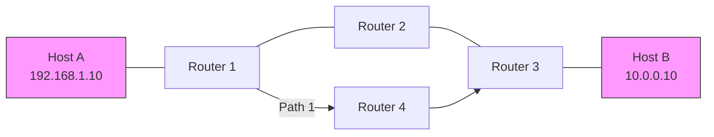

**Key Routing Functions:**
1. **Path determination**: Finding the best route to a destination
2. **Packet forwarding**: Moving packets from input to output interfaces
3. **Route maintenance**: Keeping routing information current
4. **Convergence**: Adapting to network changes

### Directly Connected Routes

Directly connected routes are network segments directly attached to router interfaces.

**Example (Cisco IOS):**
```
Router# show ip interface brief
Interface       IP-Address      OK? Method Status                Protocol
GigabitEthernet0/0  192.168.1.1    YES manual up                    up
GigabitEthernet0/1  10.0.0.1       YES manual up                    up

Router# show ip route
C    192.168.1.0/24 is directly connected, GigabitEthernet0/0
C    10.0.0.0/24 is directly connected, GigabitEthernet0/1
```

### Static Routes

Static routes are manually configured routes that specify a path to a destination.

**Static Route Configuration (Cisco IOS):**
```
Router(config)# ip route 172.16.0.0 255.255.0.0 192.168.1.2
Router(config)# ip route 172.16.0.0 255.255.0.0 GigabitEthernet0/1 10.0.0.2
```

**Static Route Types:**
- Next-hop static route
- Directly attached static route
- Fully specified static route
- Floating static route (with administrative distance)

**Advantages:**
- No bandwidth overhead
- No CPU processing required
- Enhanced security
- Simple implementation in small networks

**Disadvantages:**
- Manual configuration and maintenance
- Not scalable for large networks
- No automatic adaptation to network changes

### Default Routes

A default route is used when no specific route exists for a destination.

**Default Route Configuration (Cisco IOS):**
```
Router(config)# ip route 0.0.0.0 0.0.0.0 192.168.1.2
```

**Linux Configuration:**
```bash
# Add default route
ip route add default via 192.168.1.1
```

## 2. Routing Tables

The routing table is a data structure stored in a router or networked computer that lists the routes to particular network destinations.

### Routing Table Components

```
Router# show ip route
Codes: C - connected, S - static, R - RIP, M - mobile, B - BGP
       D - EIGRP, EX - EIGRP external, O - OSPF, IA - OSPF inter area
       N1 - OSPF NSSA external type 1, N2 - OSPF NSSA external type 2
       E1 - OSPF external type 1, E2 - OSPF external type 2
       i - IS-IS, su - IS-IS summary, L1 - IS-IS level-1, L2 - IS-IS level-2
       ia - IS-IS inter area, * - candidate default, U - per-user static route
       o - ODR, P - periodic downloaded static route, H - NHRP, l - LISP
       + - replicated route, % - next hop override

Gateway of last resort is 10.0.0.1 to network 0.0.0.0

S*    0.0.0.0/0 [1/0] via 10.0.0.1
C     10.0.0.0/24 is directly connected, GigabitEthernet0/1
L     10.0.0.2/32 is directly connected, GigabitEthernet0/1
O     172.16.0.0/16 [110/20] via 192.168.1.2, 00:45:16, GigabitEthernet0/0
C     192.168.1.0/24 is directly connected, GigabitEthernet0/0
L     192.168.1.1/32 is directly connected, GigabitEthernet0/0
```

**Key Components:**
- **Route source**: How the route was learned (connected, static, dynamic)
- **Destination network**: Network address and prefix length/subnet mask
- **Administrative distance**: Trustworthiness of the route source
- **Metric**: Cost of using the route
- **Next-hop**: Next router to send packets to
- **Exit interface**: Local interface to use for forwarding
- **Route timestamp**: When the route was last updated

### Administrative Distance

Administrative distance (AD) defines the preference of a routing protocol when multiple protocols learn the same route.

```
┌───────────────────────────┬───────────────────┐
│ Route Source              │ Administrative    │
│                           │ Distance          │
├───────────────────────────┼───────────────────┤
│ Connected interface       │ 0                 │
│ Static route              │ 1                 │
│ EIGRP summary route       │ 5                 │
│ External BGP              │ 20                │
│ Internal EIGRP            │ 90                │
│ IGRP                      │ 100               │
│ OSPF                      │ 110               │
│ IS-IS                     │ 115               │
│ RIP                       │ 120               │
│ External EIGRP            │ 170               │
│ Internal BGP              │ 200               │
│ Unknown                   │ 255 (unusable)    │
└───────────────────────────┴───────────────────┘
```

### Route Selection Process

When a packet needs to be routed, the router follows this process:

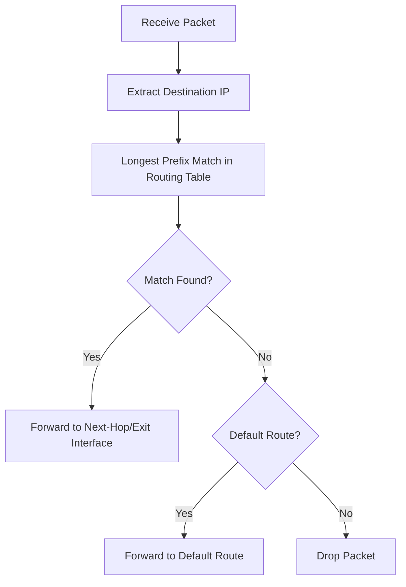

**Longest Prefix Match:**
- Router selects the most specific route (longest subnet mask)
- Example: 10.1.1.0/24 is more specific than 10.1.0.0/16

## 3. Routing Metrics

Routing metrics are values used by routing algorithms to determine the best path to a destination.

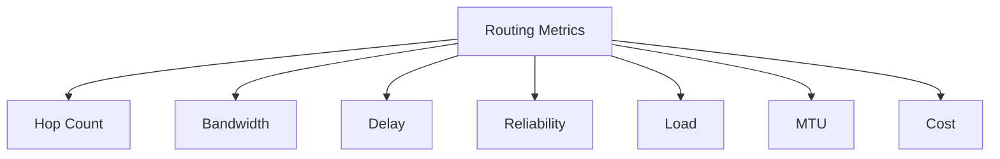

**Common Metrics:**
- **Hop count**: Number of routers a packet passes through
- **Bandwidth**: Data capacity of the link
- **Delay**: Time it takes to traverse the link
- **Reliability**: Error rate of the link
- **Load**: Current traffic utilization of the link
- **MTU (Maximum Transmission Unit)**: Largest packet size allowed
- **Cost**: Arbitrary value assigned by the administrator

**Routing Protocol Metrics:**
- **RIP**: Hop count only (max 15)
- **OSPF**: Cost (inversely proportional to bandwidth)
- **EIGRP**: Composite metric (bandwidth, delay, reliability, load)
- **BGP**: Complex path attributes

## 4. Types of Routing

### Distance Vector Routing

Distance vector protocols determine the best path based on distance (usually hop count) and direction (vector).

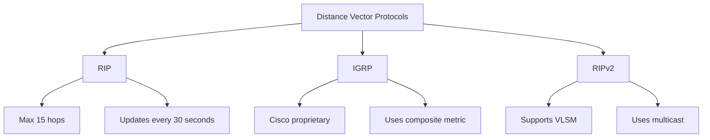

**Characteristics:**
- "Routing by rumor" - routers share knowledge with neighbors
- Periodic updates of entire routing table
- Slow convergence
- Count-to-infinity problem
- Split horizon, route poisoning to prevent loops

### Link State Routing

Link state protocols build a complete map of the network topology.

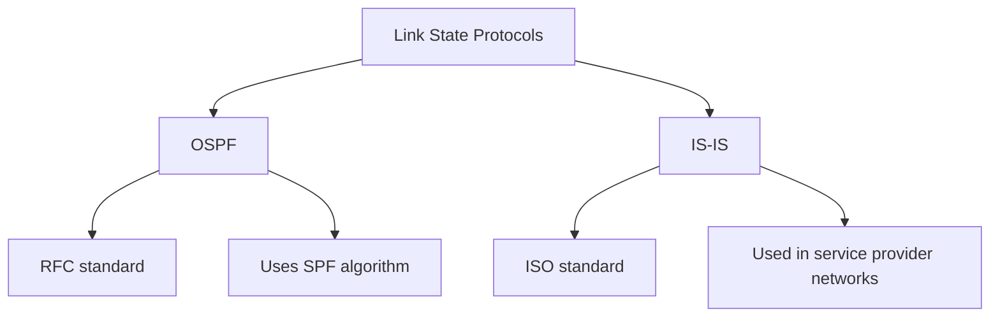

**Characteristics:**
- Each router builds a complete topology database
- Routers flood link state advertisements (LSAs)
- Uses Dijkstra's Shortest Path First (SPF) algorithm
- Faster convergence than distance vector
- More CPU and memory intensive
- Hierarchical design with areas

### Path Vector Routing

Path vector protocols make routing decisions based on path attributes and network policies.

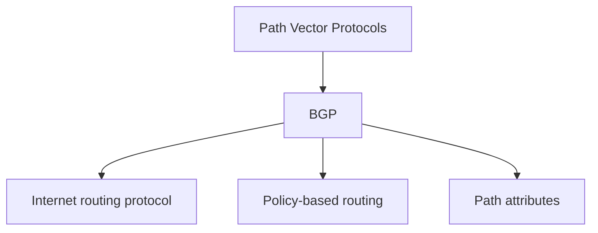

**Characteristics:**
- Similar to distance vector, but includes path information
- No metric, uses path attributes and policies
- Loop prevention through AS path
- Designed for routing between autonomous systems
- Complex route selection process

## 5. Routing Protocol Characteristics

### Convergence

Convergence is the process by which routers agree on optimal routes after a topology change.

**Factors affecting convergence time:**
- Routing protocol type
- Network size and complexity
- Bandwidth and reliability of links
- Processing capabilities of routers
- Timer configurations

### Load Balancing

Load balancing distributes traffic across multiple paths to the same destination.

**Types of load balancing:**
- **Equal-cost load balancing**: Traffic shared across paths with identical metrics
- **Unequal-cost load balancing**: Traffic proportionally distributed based on metrics

### Routing Protocol Categories

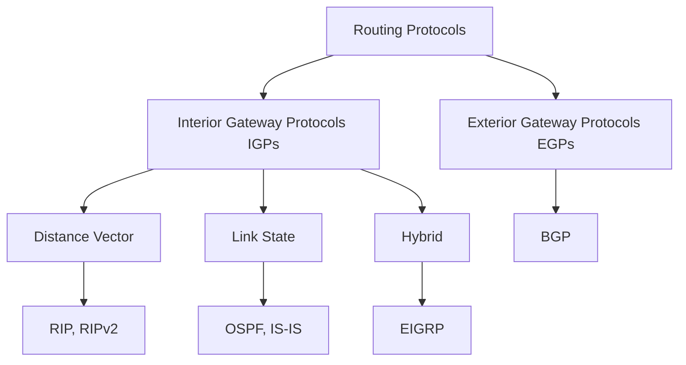

**IGP vs EGP:**
- **IGP**: Used within an autonomous system (RIP, OSPF, EIGRP)
- **EGP**: Used between autonomous systems (BGP)

### Classful vs Classless Routing

**Classful Routing:**
- No subnet mask in updates
- Same subnet mask throughout the network
- Automatic route summarization at classful boundaries
- Examples: RIPv1, IGRP

**Classless Routing:**
- Includes subnet mask in updates
- Supports VLSM and CIDR
- Manual route summarization
- Examples: RIPv2, EIGRP, OSPF, IS-IS, BGP

## 6. Routing Loop Prevention

Routing loops occur when packets continuously cycle between routers due to incorrect routing information.

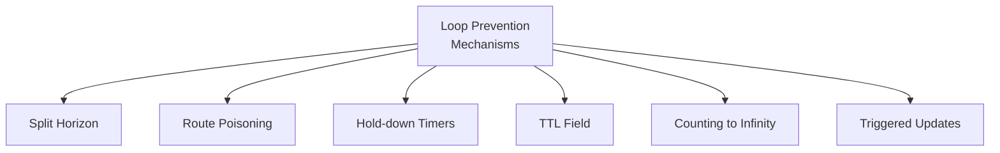

**Key Prevention Mechanisms:**
- **Split horizon**: Don't advertise routes back to the source
- **Route poisoning**: Mark failed routes with infinite metric
- **Hold-down timers**: Ignore updates for a period after a route fails
- **TTL field**: Prevents infinite forwarding
- **Counting to infinity**: Gradually increasing metrics until maximum
- **Triggered updates**: Immediate updates when topology changes

## 7. Router Architecture

Understanding router architecture helps in comprehending the routing process.

### Router Components

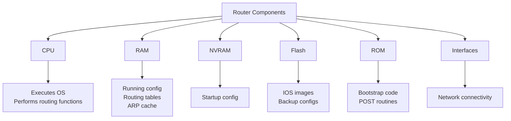

### Packet Processing

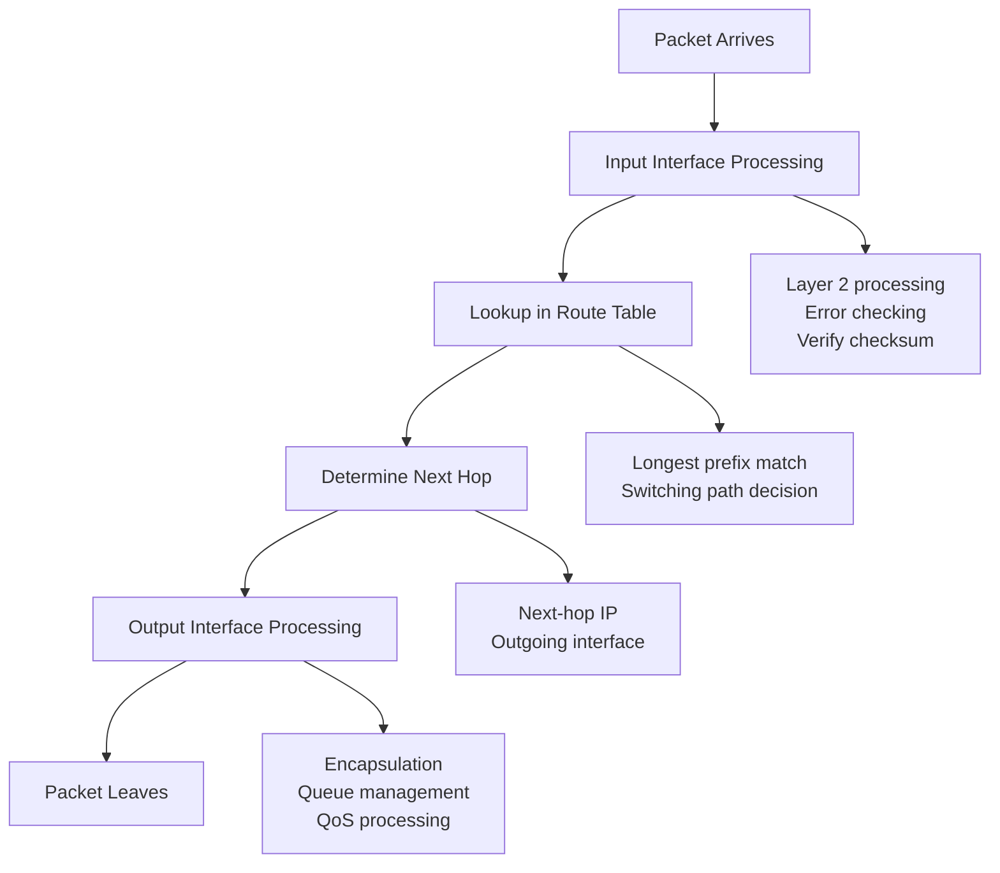

**Switching Paths:**
- **Process switching**: CPU examines each packet (slow)
- **Fast switching**: Caching-based forwarding (medium)
- **CEF (Cisco Express Forwarding)**: Table-based forwarding (fast)

## 8. Practical Routing Scenarios

### Small Office/Home Office (SOHO) Routing

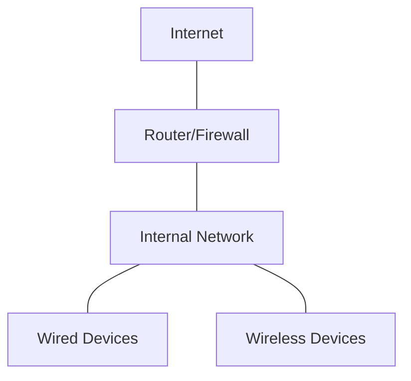

**Typical Configuration:**
- Static default route to ISP
- NAT/PAT for internal devices
- Simple ACLs for security
- Single subnet or basic VLANs

**Example Home Router Configuration:**
```
# WAN interface (DHCP client)
interface WAN
  ip address dhcp
  
# LAN interface (DHCP server)
interface LAN
  ip address 192.168.1.1 255.255.255.0
  
# DHCP server configuration
ip dhcp pool LAN
  network 192.168.1.0 255.255.255.0
  default-router 192.168.1.1
  dns-server 8.8.8.8 8.8.4.4
  
# NAT configuration
ip nat inside source list 1 interface WAN overload
access-list 1 permit 192.168.1.0 0.0.0.255
```

### Enterprise Campus Routing

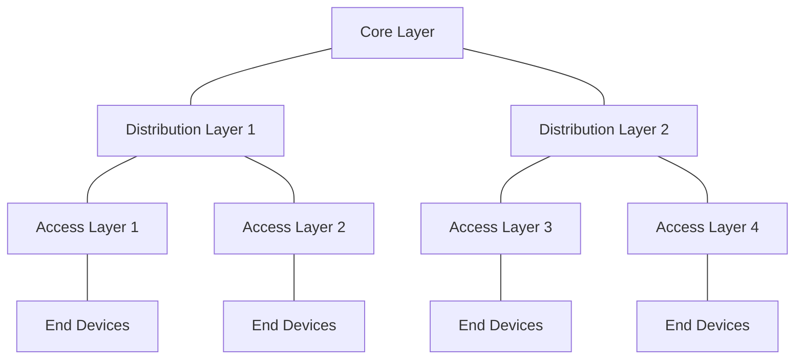

**Typical Configuration:**
- IGP for internal routing (OSPF, EIGRP)
- Route summarization at distribution layer
- Redundant paths with equal-cost load balancing
- HSRP/VRRP for first-hop redundancy
- Policy-based routing for special traffic flows

**Design Principles:**
- Hierarchical design
- Redundancy without loops
- Scalability through modular design
- Route filtering and summarization
- Fast convergence

### Service Provider Routing

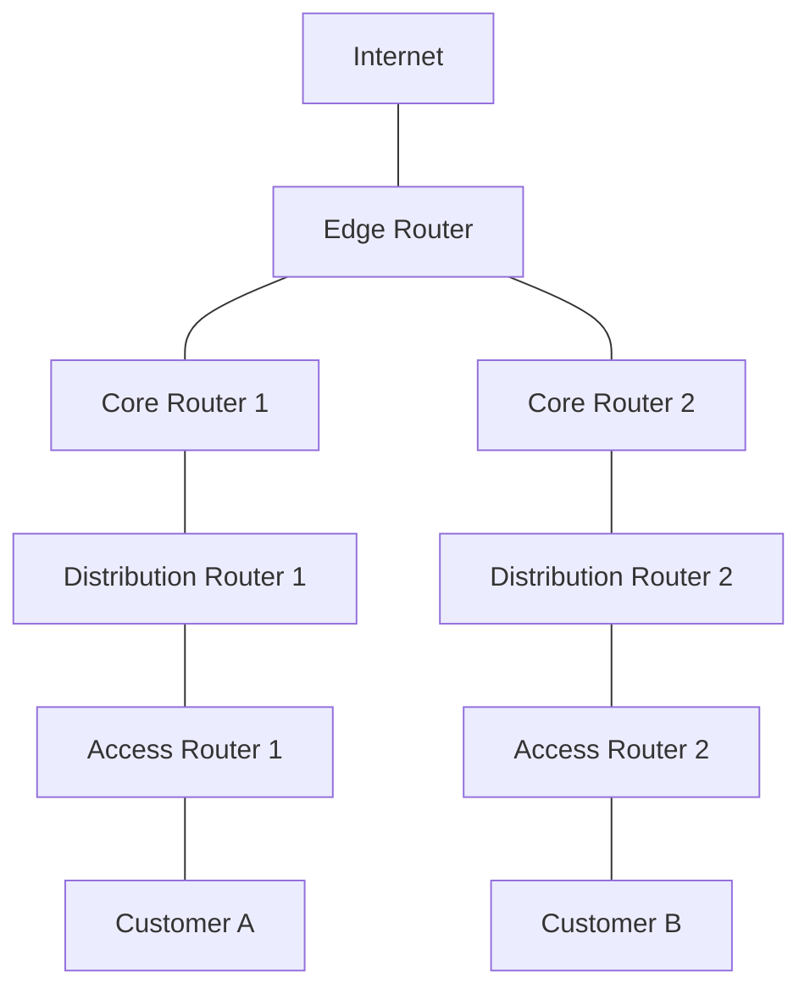

**Typical Configuration:**
- IS-IS or OSPF as IGP
- iBGP within AS
- eBGP with other ASes and customers
- MPLS for traffic engineering and VPN services
- Route reflectors for scalability
- Extensive filtering and policy application

## Additional Resources

- [Cisco Routing Basics](https://www.cisco.com/c/en/us/td/docs/ios-xml/ios/iproute_bgp/configuration/15-mt/irg-15-mt-book/irg-routing-basics.html)
- [RFC 1058 - RIP](https://tools.ietf.org/html/rfc1058)
- [RFC 2328 - OSPF Version 2](https://tools.ietf.org/html/rfc2328)
- [RFC 4271 - BGP-4](https://tools.ietf.org/html/rfc4271)
- [Juniper Networks Routing Fundamentals](https://www.juniper.net/documentation/en_US/junos/topics/concept/routing-protocol-overview.html)

## Practice Questions

1. Compare and contrast distance vector and link state routing protocols. Give examples of each and explain when one might be preferred over the other.

2. A network administrator needs to configure a router with multiple paths to the same destination. Explain how the router will make forwarding decisions in this scenario and how load balancing might be implemented.

3. Describe the process a router goes through when determining the best path for a packet. Include the role of the routing table and the longest prefix match principle.

4. Your company has merged with another organization, resulting in two separate networks that need to be connected. Design a routing scheme that would accommodate this merger, considering scalability and efficient routing.

5. Explain the concept of administrative distance and how it affects route selection when multiple routing protocols are used in the same network.
