# Day 10: Detailed Analysis of Network Protocols

<div align="center">

  
  <h1>🌐 Detailed Analysis of Network Protocols 🌐</h1>
  
  <p>
    
    
    
    
    
  </p>
  
  <hr>
</div>

## Table of Contents
- [Introduction to Network Protocols](#introduction-to-network-protocols)
- [TCP/IP Protocol Suite](#tcpip-protocol-suite)
  - [TCP (Transmission Control Protocol)](#tcp-transmission-control-protocol)
  - [IP (Internet Protocol)](#ip-internet-protocol)
  - [UDP (User Datagram Protocol)](#udp-user-datagram-protocol)
  - [ICMP (Internet Control Message Protocol)](#icmp-internet-control-message-protocol)
  - [ARP (Address Resolution Protocol)](#arp-address-resolution-protocol)
- [Web Protocols](#web-protocols)
  - [HTTP (Hypertext Transfer Protocol)](#http-hypertext-transfer-protocol)
  - [HTTPS (HTTP Secure)](#https-http-secure)
  - [WebSocket](#websocket)
- [Email Protocols](#email-protocols)
  - [SMTP (Simple Mail Transfer Protocol)](#smtp-simple-mail-transfer-protocol)
  - [POP3 (Post Office Protocol version 3)](#pop3-post-office-protocol-version-3)
  - [IMAP (Internet Message Access Protocol)](#imap-internet-message-access-protocol)
- [File Transfer Protocols](#file-transfer-protocols)
  - [FTP (File Transfer Protocol)](#ftp-file-transfer-protocol)
  - [SFTP (SSH File Transfer Protocol)](#sftp-ssh-file-transfer-protocol)
  - [SCP (Secure Copy Protocol)](#scp-secure-copy-protocol)
- [Remote Access Protocols](#remote-access-protocols)
  - [SSH (Secure Shell)](#ssh-secure-shell)
  - [Telnet](#telnet)
  - [RDP (Remote Desktop Protocol)](#rdp-remote-desktop-protocol)
- [Network Management Protocols](#network-management-protocols)
  - [SNMP (Simple Network Management Protocol)](#snmp-simple-network-management-protocol)
  - [DHCP (Dynamic Host Configuration Protocol)](#dhcp-dynamic-host-configuration-protocol)
  - [DNS (Domain Name System)](#dns-domain-name-system)
- [Network Security Protocols](#network-security-protocols)
  - [SSL/TLS (Secure Sockets Layer/Transport Layer Security)](#ssltls-secure-sockets-layertransport-layer-security)
  - [IPsec (Internet Protocol Security)](#ipsec-internet-protocol-security)
- [Protocol Analysis and Comparison](#protocol-analysis-and-comparison)
- [Practice Questions](#practice-questions)

## Introduction to Network Protocols

Network protocols are formal standards and policies comprised of rules, procedures, and formats that define communication between two or more devices over a network. They are the language that allows different network devices to communicate with each other, regardless of the underlying hardware or software differences.

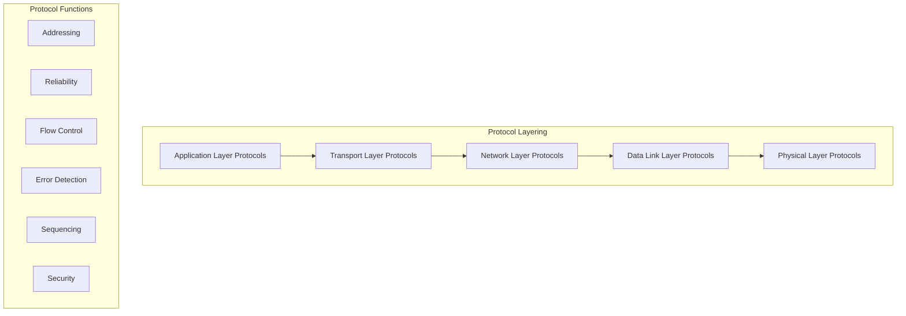
```mermaid
graph TB
    subgraph "Protocol Layering"
        A[Application Layer Protocols] --> B[Transport Layer Protocols]
        B --> C[Network Layer Protocols]
        C --> D[Data Link Layer Protocols]
        D --> E[Physical Layer Protocols]
    end
    
    subgraph "Protocol Functions"
        F1[Addressing]
        F2[Reliability]
        F3[Flow Control]
        F4[Error Detection]
        F5[Sequencing]
        F6[Security]
    end
```

## TCP/IP Protocol Suite

The TCP/IP protocol suite is the foundation of the Internet and most networks today. It is a set of communication protocols organized into four layers: Link, Internet, Transport, and Application.

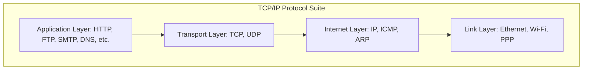
```mermaid
graph TB
    subgraph "TCP/IP Protocol Suite"
        L4[Application Layer: HTTP, FTP, SMTP, DNS, etc.]
        L3[Transport Layer: TCP, UDP]
        L2[Internet Layer: IP, ICMP, ARP]
        L1[Link Layer: Ethernet, Wi-Fi, PPP]
    end
    
    L4 --> L3
    L3 --> L2
    L2 --> L1
```

### TCP (Transmission Control Protocol)

TCP is a connection-oriented protocol that provides reliable, ordered, and error-checked delivery of data between applications running on hosts communicating via an IP network.

#### TCP Header Structure

```
 0                   1                   2                   3
 0 1 2 3 4 5 6 7 8 9 0 1 2 3 4 5 6 7 8 9 0 1 2 3 4 5 6 7 8 9 0 1
+-+-+-+-+-+-+-+-+-+-+-+-+-+-+-+-+-+-+-+-+-+-+-+-+-+-+-+-+-+-+-+-+
|          Source Port          |       Destination Port        |
+-+-+-+-+-+-+-+-+-+-+-+-+-+-+-+-+-+-+-+-+-+-+-+-+-+-+-+-+-+-+-+-+
|                        Sequence Number                        |
+-+-+-+-+-+-+-+-+-+-+-+-+-+-+-+-+-+-+-+-+-+-+-+-+-+-+-+-+-+-+-+-+
|                    Acknowledgment Number                      |
+-+-+-+-+-+-+-+-+-+-+-+-+-+-+-+-+-+-+-+-+-+-+-+-+-+-+-+-+-+-+-+-+
|  Data |           |U|A|P|R|S|F|                               |
| Offset| Reserved  |R|C|S|S|Y|I|            Window             |
|       |           |G|K|H|T|N|N|                               |
+-+-+-+-+-+-+-+-+-+-+-+-+-+-+-+-+-+-+-+-+-+-+-+-+-+-+-+-+-+-+-+-+
|           Checksum            |         Urgent Pointer        |
+-+-+-+-+-+-+-+-+-+-+-+-+-+-+-+-+-+-+-+-+-+-+-+-+-+-+-+-+-+-+-+-+
|                    Options                    |    Padding    |
+-+-+-+-+-+-+-+-+-+-+-+-+-+-+-+-+-+-+-+-+-+-+-+-+-+-+-+-+-+-+-+-+
|                             data                              |
+-+-+-+-+-+-+-+-+-+-+-+-+-+-+-+-+-+-+-+-+-+-+-+-+-+-+-+-+-+-+-+-+
```

#### TCP Connection Establishment (Three-Way Handshake)

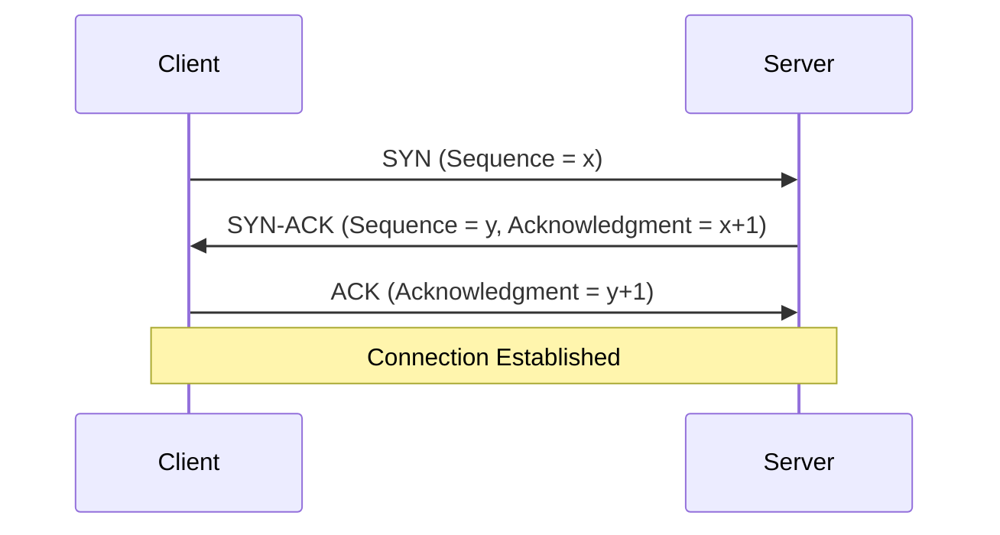
```mermaid
sequenceDiagram
    participant Client
    participant Server
    
    Client->>Server: SYN (Sequence = x)
    Server->>Client: SYN-ACK (Sequence = y, Acknowledgment = x+1)
    Client->>Server: ACK (Acknowledgment = y+1)
    
    Note over Client,Server: Connection Established
```

#### TCP Connection Termination (Four-Way Handshake)

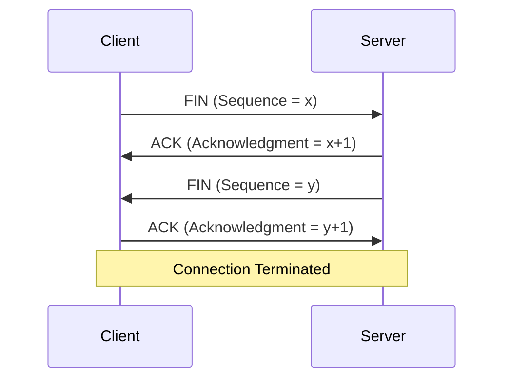
```mermaid
sequenceDiagram
    participant Client
    participant Server
    
    Client->>Server: FIN (Sequence = x)
    Server->>Client: ACK (Acknowledgment = x+1)
    Server->>Client: FIN (Sequence = y)
    Client->>Server: ACK (Acknowledgment = y+1)
    
    Note over Client,Server: Connection Terminated
```

#### TCP Flow Control and Congestion Control

TCP uses several mechanisms to control the flow of data and prevent network congestion:

1. **Flow Control**: Using sliding window protocol to prevent overwhelming the receiver
2. **Congestion Control**:
   - Slow Start
   - Congestion Avoidance
   - Fast Retransmit
   - Fast Recovery

#### TCP Ports

Well-known TCP ports include:

| Port | Service |
|------|---------|
| 20, 21 | FTP (Data, Control) |
| 22 | SSH |
| 23 | Telnet |
| 25 | SMTP |
| 80 | HTTP |
| 443 | HTTPS |
| 110 | POP3 |
| 143 | IMAP |
| 3389 | RDP |

### IP (Internet Protocol)

IP is the principal communications protocol for relaying datagrams (packets) across network boundaries. It has two versions currently in use: IPv4 and IPv6.

#### IPv4 Header Structure

```
 0                   1                   2                   3
 0 1 2 3 4 5 6 7 8 9 0 1 2 3 4 5 6 7 8 9 0 1 2 3 4 5 6 7 8 9 0 1
+-+-+-+-+-+-+-+-+-+-+-+-+-+-+-+-+-+-+-+-+-+-+-+-+-+-+-+-+-+-+-+-+
|Version|  IHL  |Type of Service|          Total Length         |
+-+-+-+-+-+-+-+-+-+-+-+-+-+-+-+-+-+-+-+-+-+-+-+-+-+-+-+-+-+-+-+-+
|         Identification        |Flags|      Fragment Offset    |
+-+-+-+-+-+-+-+-+-+-+-+-+-+-+-+-+-+-+-+-+-+-+-+-+-+-+-+-+-+-+-+-+
|  Time to Live |    Protocol   |         Header Checksum       |
+-+-+-+-+-+-+-+-+-+-+-+-+-+-+-+-+-+-+-+-+-+-+-+-+-+-+-+-+-+-+-+-+
|                       Source Address                          |
+-+-+-+-+-+-+-+-+-+-+-+-+-+-+-+-+-+-+-+-+-+-+-+-+-+-+-+-+-+-+-+-+
|                    Destination Address                        |
+-+-+-+-+-+-+-+-+-+-+-+-+-+-+-+-+-+-+-+-+-+-+-+-+-+-+-+-+-+-+-+-+
|                    Options                    |    Padding    |
+-+-+-+-+-+-+-+-+-+-+-+-+-+-+-+-+-+-+-+-+-+-+-+-+-+-+-+-+-+-+-+-+
```

#### IPv6 Header Structure

```
 0                   1                   2                   3
 0 1 2 3 4 5 6 7 8 9 0 1 2 3 4 5 6 7 8 9 0 1 2 3 4 5 6 7 8 9 0 1
+-+-+-+-+-+-+-+-+-+-+-+-+-+-+-+-+-+-+-+-+-+-+-+-+-+-+-+-+-+-+-+-+
|Version| Traffic Class |           Flow Label                  |
+-+-+-+-+-+-+-+-+-+-+-+-+-+-+-+-+-+-+-+-+-+-+-+-+-+-+-+-+-+-+-+-+
|         Payload Length        |  Next Header  |   Hop Limit   |
+-+-+-+-+-+-+-+-+-+-+-+-+-+-+-+-+-+-+-+-+-+-+-+-+-+-+-+-+-+-+-+-+
|                                                               |
+                                                               +
|                                                               |
+                         Source Address                        +
|                                                               |
+                                                               +
|                                                               |
+-+-+-+-+-+-+-+-+-+-+-+-+-+-+-+-+-+-+-+-+-+-+-+-+-+-+-+-+-+-+-+-+
|                                                               |
+                                                               +
|                                                               |
+                      Destination Address                      +
|                                                               |
+                                                               +
|                                                               |
+-+-+-+-+-+-+-+-+-+-+-+-+-+-+-+-+-+-+-+-+-+-+-+-+-+-+-+-+-+-+-+-+
```

#### IP Addressing and Subnetting

IP addresses are divided into different classes (A, B, C, D, E) based on the range of addresses and are further divided into subnets using subnet masks.

| Class | Range | Default Subnet Mask | Purpose |
|-------|-------|---------------------|---------|
| A | 1.0.0.0 - 126.255.255.255 | 255.0.0.0 | Large networks |
| B | 128.0.0.0 - 191.255.255.255 | 255.255.0.0 | Medium networks |
| C | 192.0.0.0 - 223.255.255.255 | 255.255.255.0 | Small networks |
| D | 224.0.0.0 - 239.255.255.255 | N/A | Multicast |
| E | 240.0.0.0 - 255.255.255.255 | N/A | Reserved for experimental use |

#### IPv4 vs IPv6

| Feature | IPv4 | IPv6 |
|---------|------|------|
| Address Length | 32 bits (4 bytes) | 128 bits (16 bytes) |
| Address Format | Dotted Decimal | Hexadecimal with Colons |
| Address Space | ~4.3 billion | ~340 undecillion |
| Header Size | Variable (20-60 bytes) | Fixed (40 bytes) |
| Checksum | Included | Removed (handled by upper layers) |
| Fragmentation | By routers and source | Only by source |
| IANA Address Exhaustion | Yes | No |
| Security | Optional (IPsec) | Built-in |
| QoS | Limited | Enhanced |

### UDP (User Datagram Protocol)

UDP is a connectionless, unreliable transport protocol that provides a simple interface between the network layer and application layer.

#### UDP Header Structure

```
 0      7 8     15 16    23 24    31
+--------+--------+--------+--------+
|     Source      |   Destination   |
|      Port       |      Port       |
+--------+--------+--------+--------+
|                 |                 |
|     Length      |    Checksum     |
+--------+--------+--------+--------+
|                                   |
|              Data                 |
|                                   |
+-----------------------------------+
```

#### UDP Characteristics

- **Connectionless**: No connection establishment or termination
- **Unreliable**: No acknowledgment, retransmission, or timeout
- **Low overhead**: Minimal header size (8 bytes)
- **No congestion control**: Continues sending regardless of network conditions
- **No ordered delivery**: Messages can arrive out of order

#### Common UDP Applications

| Port | Service |
|------|---------|
| 53 | DNS |
| 67, 68 | DHCP |
| 69 | TFTP |
| 123 | NTP |
| 161, 162 | SNMP |
| 514 | Syslog |
| 1900 | SSDP (UPnP) |

#### TCP vs UDP

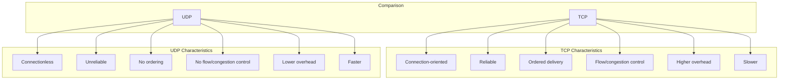
```mermaid
graph TB
    subgraph "Comparison"
        T[TCP]
        U[UDP]
    end
    
    subgraph "TCP Characteristics"
        T1[Connection-oriented]
        T2[Reliable]
        T3[Ordered delivery]
        T4[Flow/congestion control]
        T5[Higher overhead]
        T6[Slower]
    end
    
    subgraph "UDP Characteristics"
        U1[Connectionless]
        U2[Unreliable]
        U3[No ordering]
        U4[No flow/congestion control]
        U5[Lower overhead]
        U6[Faster]
    end
    
    T --> T1
    T --> T2
    T --> T3
    T --> T4
    T --> T5
    T --> T6
    
    U --> U1
    U --> U2
    U --> U3
    U --> U4
    U --> U5
    U --> U6
```

### ICMP (Internet Control Message Protocol)

ICMP is a network layer protocol used by network devices to diagnose network communication issues and report errors.

#### ICMP Header Structure

```
 0                   1                   2                   3
 0 1 2 3 4 5 6 7 8 9 0 1 2 3 4 5 6 7 8 9 0 1 2 3 4 5 6 7 8 9 0 1
+-+-+-+-+-+-+-+-+-+-+-+-+-+-+-+-+-+-+-+-+-+-+-+-+-+-+-+-+-+-+-+-+
|     Type      |     Code      |          Checksum             |
+-+-+-+-+-+-+-+-+-+-+-+-+-+-+-+-+-+-+-+-+-+-+-+-+-+-+-+-+-+-+-+-+
|                             Data                              |
+-+-+-+-+-+-+-+-+-+-+-+-+-+-+-+-+-+-+-+-+-+-+-+-+-+-+-+-+-+-+-+-+
```

#### Common ICMP Message Types

| Type | Code | Description |
|------|------|-------------|
| 0 | 0 | Echo Reply (used by ping) |
| 3 | Various | Destination Unreachable |
| 5 | Various | Redirect Message |
| 8 | 0 | Echo Request (used by ping) |
| 11 | Various | Time Exceeded (used by traceroute) |
| 30 | 0 | Traceroute |

#### ICMP Applications

- **Ping**: Tests reachability of a host
- **Traceroute/Tracert**: Determines the route to a destination
- **Path MTU Discovery**: Determines maximum transmission unit size
- **Error Reporting**: Notifies of network errors

### ARP (Address Resolution Protocol)

ARP is a communication protocol used for discovering the link layer address (MAC address) associated with a given internet layer address (IP address).

#### ARP Packet Structure

```
 0                   1                   2                   3
 0 1 2 3 4 5 6 7 8 9 0 1 2 3 4 5 6 7 8 9 0 1 2 3 4 5 6 7 8 9 0 1
+-+-+-+-+-+-+-+-+-+-+-+-+-+-+-+-+-+-+-+-+-+-+-+-+-+-+-+-+-+-+-+-+
|         Hardware Type         |         Protocol Type         |
+-+-+-+-+-+-+-+-+-+-+-+-+-+-+-+-+-+-+-+-+-+-+-+-+-+-+-+-+-+-+-+-+
|    HLEN      |    PLEN      |          Operation             |
+-+-+-+-+-+-+-+-+-+-+-+-+-+-+-+-+-+-+-+-+-+-+-+-+-+-+-+-+-+-+-+-+
|                                                               |
|                    Sender Hardware Address                    |
|                                                               |
+-+-+-+-+-+-+-+-+-+-+-+-+-+-+-+-+-+-+-+-+-+-+-+-+-+-+-+-+-+-+-+-+
|                                                               |
|                    Sender Protocol Address                    |
|                                                               |
+-+-+-+-+-+-+-+-+-+-+-+-+-+-+-+-+-+-+-+-+-+-+-+-+-+-+-+-+-+-+-+-+
|                                                               |
|                    Target Hardware Address                    |
|                                                               |
+-+-+-+-+-+-+-+-+-+-+-+-+-+-+-+-+-+-+-+-+-+-+-+-+-+-+-+-+-+-+-+-+
|                                                               |
|                    Target Protocol Address                    |
|                                                               |
+-+-+-+-+-+-+-+-+-+-+-+-+-+-+-+-+-+-+-+-+-+-+-+-+-+-+-+-+-+-+-+-+
```

#### ARP Operation Process

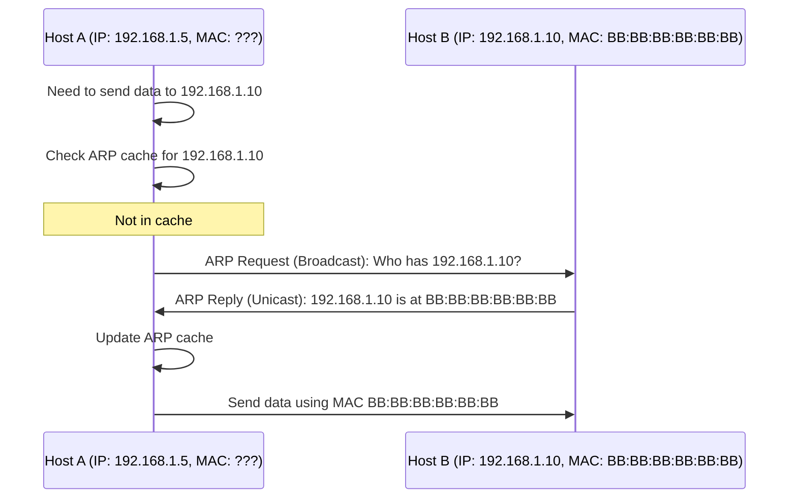
```mermaid
sequenceDiagram
    participant A as Host A (IP: 192.168.1.5, MAC: ???)
    participant B as Host B (IP: 192.168.1.10, MAC: BB:BB:BB:BB:BB:BB)
    
    A->>A: Need to send data to 192.168.1.10
    A->>A: Check ARP cache for 192.168.1.10
    Note over A: Not in cache
    A->>B: ARP Request (Broadcast): Who has 192.168.1.10?
    B->>A: ARP Reply (Unicast): 192.168.1.10 is at BB:BB:BB:BB:BB:BB
    A->>A: Update ARP cache
    A->>B: Send data using MAC BB:BB:BB:BB:BB:BB
```

#### ARP Security Concerns

- **ARP Spoofing/Poisoning**: Attacker sends fake ARP messages to associate their MAC address with another host's IP address
- **ARP Cache Poisoning**: Malicious modification of ARP cache entries
- **Mitigation Techniques**:
  - Static ARP entries
  - ARP inspection
  - Encryption protocols

## Web Protocols

### HTTP (Hypertext Transfer Protocol)

HTTP is an application layer protocol for distributed, collaborative, hypermedia information systems, forming the foundation of data communication for the World Wide Web.

#### HTTP Request/Response Format

```
# HTTP Request
GET /index.html HTTP/1.1
Host: www.example.com
User-Agent: Mozilla/5.0
Accept: text/html
Connection: keep-alive

# HTTP Response
HTTP/1.1 200 OK
Date: Mon, 23 May 2022 22:38:34 GMT
Server: Apache/2.4.38 (Debian)
Content-Type: text/html; charset=UTF-8
Content-Length: 138
Connection: keep-alive

<!DOCTYPE html>
<html>
<head>
  <title>Example Page</title>
</head>
<body>
  <h1>Hello, World!</h1>
</body>
</html>
```

#### HTTP Methods

| Method | Description | Safe | Idempotent |
|--------|-------------|------|------------|
| GET | Retrieve data | Yes | Yes |
| POST | Submit data | No | No |
| PUT | Update/Replace resource | No | Yes |
| DELETE | Remove resource | No | Yes |
| HEAD | GET without body | Yes | Yes |
| OPTIONS | Get supported methods | Yes | Yes |
| PATCH | Partial update | No | No |

#### HTTP Status Codes

| Code Range | Category | Examples |
|------------|----------|----------|
| 1xx | Informational | 100 Continue, 101 Switching Protocols |
| 2xx | Successful | 200 OK, 201 Created, 204 No Content |
| 3xx | Redirection | 301 Moved Permanently, 302 Found, 304 Not Modified |
| 4xx | Client Error | 400 Bad Request, 401 Unauthorized, 404 Not Found |
| 5xx | Server Error | 500 Internal Server Error, 502 Bad Gateway, 503 Service Unavailable |

#### HTTP/1.1 vs HTTP/2 vs HTTP/3

| Feature | HTTP/1.1 | HTTP/2 | HTTP/3 |
|---------|----------|--------|--------|
| Year | 1997 | 2015 | 2022 |
| Connections | One per request or keep-alive | Multiplexed | Multiplexed |
| Compression | Headers not compressed | Header compression (HPACK) | Header compression (QPACK) |
| Transport | TCP | TCP | QUIC (UDP-based) |
| Multiplexing | No | Yes | Yes |
| Server Push | No | Yes | Yes |
| HOL Blocking | Yes | At TCP level | No |

### HTTPS (HTTP Secure)

HTTPS is the secure version of HTTP, using TLS/SSL for encrypted communication.

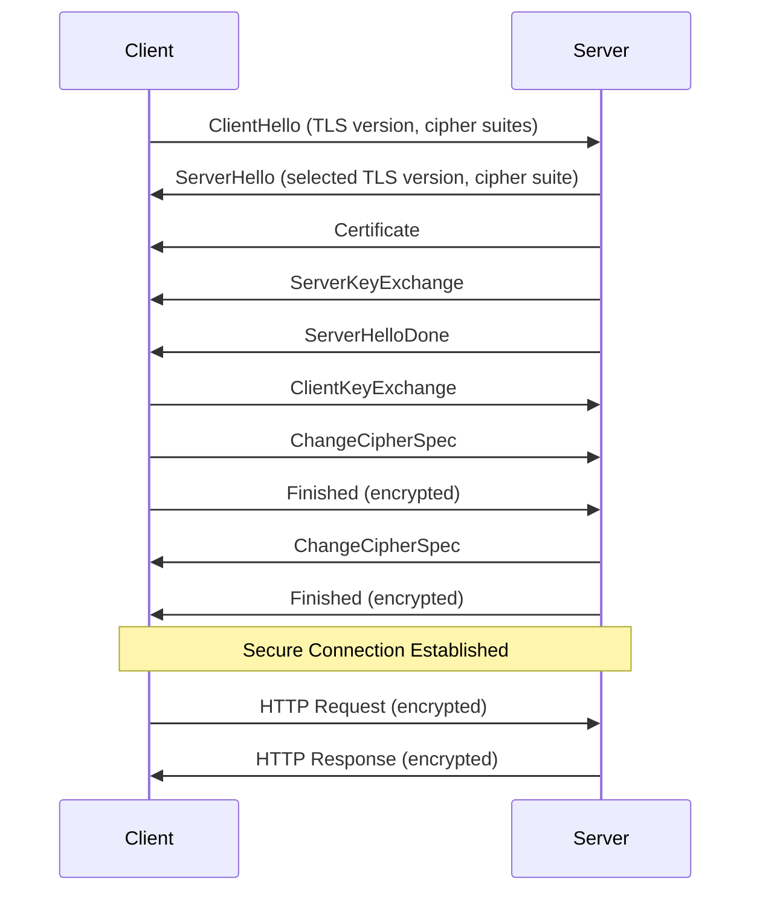
```mermaid
sequenceDiagram
    participant Client
    participant Server
    
    Client->>Server: ClientHello (TLS version, cipher suites)
    Server->>Client: ServerHello (selected TLS version, cipher suite)
    Server->>Client: Certificate
    Server->>Client: ServerKeyExchange
    Server->>Client: ServerHelloDone
    Client->>Server: ClientKeyExchange
    Client->>Server: ChangeCipherSpec
    Client->>Server: Finished (encrypted)
    Server->>Client: ChangeCipherSpec
    Server->>Client: Finished (encrypted)
    
    Note over Client,Server: Secure Connection Established
    
    Client->>Server: HTTP Request (encrypted)
    Server->>Client: HTTP Response (encrypted)
```

#### HTTPS Benefits

- **Encryption**: Protects data from eavesdropping
- **Data Integrity**: Prevents data modification in transit
- **Authentication**: Verifies server identity
- **SEO Advantage**: Preferred by search engines
- **Browser Features**: Required for modern browser features (Service Workers, etc.)

### WebSocket

WebSocket is a computer communications protocol, providing full-duplex communication channels over a single TCP connection.

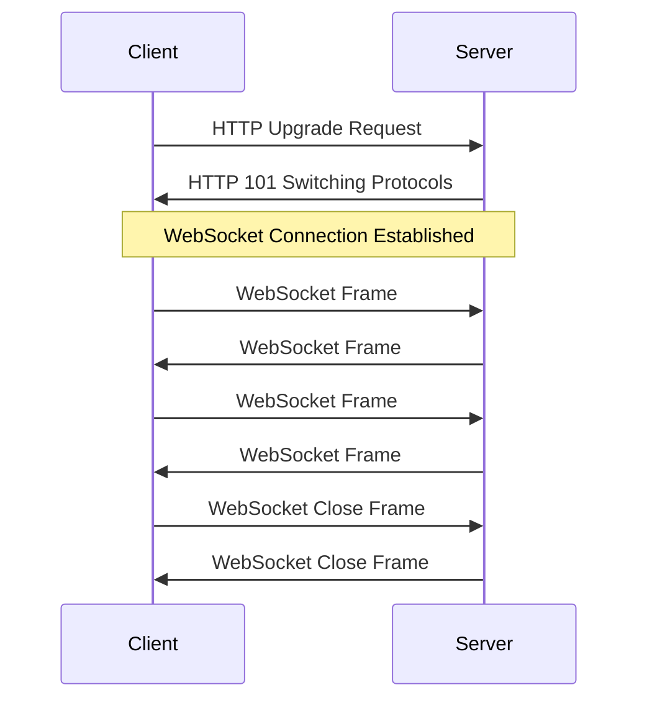
```mermaid
sequenceDiagram
    participant Client
    participant Server
    
    Client->>Server: HTTP Upgrade Request
    Server->>Client: HTTP 101 Switching Protocols
    
    Note over Client,Server: WebSocket Connection Established
    
    Client->>Server: WebSocket Frame
    Server->>Client: WebSocket Frame
    Client->>Server: WebSocket Frame
    Server->>Client: WebSocket Frame
    
    Client->>Server: WebSocket Close Frame
    Server->>Client: WebSocket Close Frame
```

#### WebSocket vs HTTP

| Feature | HTTP | WebSocket |
|---------|------|-----------|
| Connection | New connection per request-response | Persistent connection |
| Communication | Unidirectional | Bidirectional |
| Overhead | Headers sent with each request | Initial handshake only |
| Real-time | Polling/Long-polling required | Native real-time |
| Use Cases | Traditional web content | Chat, gaming, live updates |

## Email Protocols

### SMTP (Simple Mail Transfer Protocol)

SMTP is a communication protocol for electronic mail transmission, responsible for sending emails.

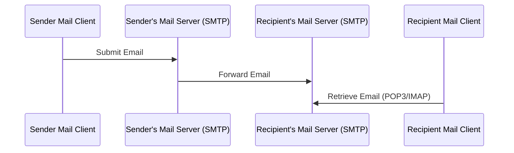
```mermaid
sequenceDiagram
    participant Sender as Sender Mail Client
    participant SMTA as Sender's Mail Server (SMTP)
    participant RMTA as Recipient's Mail Server (SMTP)
    participant Recipient as Recipient Mail Client
    
    Sender->>SMTA: Submit Email
    SMTA->>RMTA: Forward Email
    Recipient->>RMTA: Retrieve Email (POP3/IMAP)
```

#### SMTP Communication Example

```
S: 220 mail.example.com ESMTP Postfix
C: HELO client.example.org
S: 250 Hello client.example.org
C: MAIL FROM:<sender@example.org>
S: 250 Ok
C: RCPT TO:<recipient@example.com>
S: 250 Ok
C: DATA
S: 354 End data with <CR><LF>.<CR><LF>
C: From: "Sender" <sender@example.org>
C: To: "Recipient" <recipient@example.com>
C: Subject: Test email
C: 
C: This is a test email.
C: .
S: 250 Ok: queued as 12345
C: QUIT
S: 221 Bye
```

#### SMTP Ports and Security

- **Port 25**: Standard SMTP (often blocked by ISPs)
- **Port 587**: Submission (with STARTTLS)
- **Port 465**: SMTPS (SMTP over SSL/TLS)

### POP3 (Post Office Protocol version 3)

POP3 is a protocol used to retrieve emails from a mail server to a mail client.

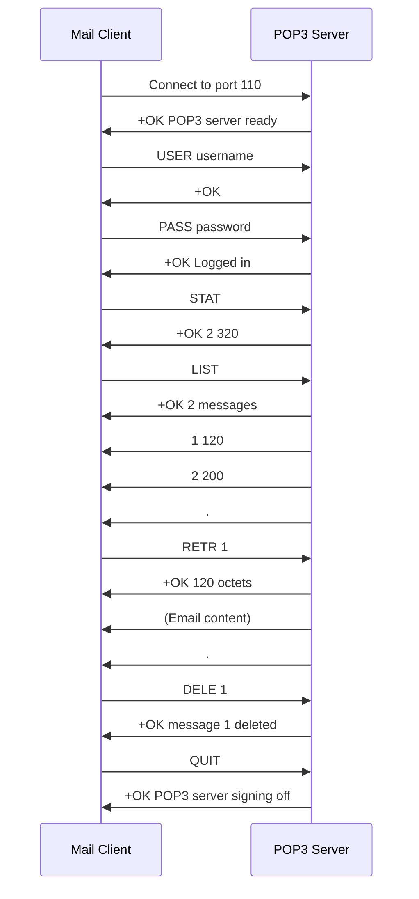
```mermaid
sequenceDiagram
    participant Client as Mail Client
    participant Server as POP3 Server
    
    Client->>Server: Connect to port 110
    Server->>Client: +OK POP3 server ready
    
    Client->>Server: USER username
    Server->>Client: +OK
    Client->>Server: PASS password
    Server->>Client: +OK Logged in
    
    Client->>Server: STAT
    Server->>Client: +OK 2 320
    Client->>Server: LIST
    Server->>Client: +OK 2 messages
    Server->>Client: 1 120
    Server->>Client: 2 200
    Server->>Client: .
    
    Client->>Server: RETR 1
    Server->>Client: +OK 120 octets
    Server->>Client: (Email content)
    Server->>Client: .
    
    Client->>Server: DELE 1
    Server->>Client: +OK message 1 deleted
    
    Client->>Server: QUIT
    Server->>Client: +OK POP3 server signing off
```

#### POP3 Characteristics

- **Download and Delete**: Typically downloads emails to client and removes from server
- **Simple Protocol**: Limited functionality compared to IMAP
- **Offline Access**: Good for offline reading once downloaded
- **Single Client**: Not ideal for multiple device access
- **Ports**: 110 (standard) or 995 (SSL/TLS)

### IMAP (Internet Message Access Protocol)

IMAP is a protocol for email retrieval and storage that provides advanced features for managing email on the server.

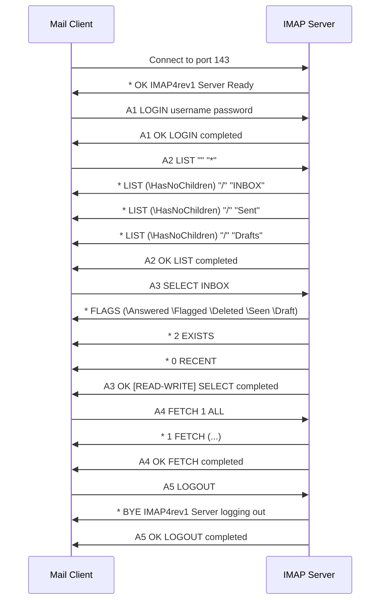
```mermaid
sequenceDiagram
    participant Client as Mail Client
    participant Server as IMAP Server
    
    Client->>Server: Connect to port 143
    Server->>Client: * OK IMAP4rev1 Server Ready
    
    Client->>Server: A1 LOGIN username password
    Server->>Client: A1 OK LOGIN completed
    
    Client->>Server: A2 LIST "" "*"
    Server->>Client: * LIST (\HasNoChildren) "/" "INBOX"
    Server->>Client: * LIST (\HasNoChildren) "/" "Sent"
    Server->>Client: * LIST (\HasNoChildren) "/" "Drafts"
    Server->>Client: A2 OK LIST completed
    
    Client->>Server: A3 SELECT INBOX
    Server->>Client: * FLAGS (\Answered \Flagged \Deleted \Seen \Draft)
    Server->>Client: * 2 EXISTS
    Server->>Client: * 0 RECENT
    Server->>Client: A3 OK [READ-WRITE] SELECT completed
    
    Client->>Server: A4 FETCH 1 ALL
    Server->>Client: * 1 FETCH (...)
    Server->>Client: A4 OK FETCH completed
    
    Client->>Server: A5 LOGOUT
    Server->>Client: * BYE IMAP4rev1 Server logging out
    Server->>Client: A5 OK LOGOUT completed
```

#### IMAP Characteristics

- **Server Storage**: Emails remain on server
- **Multiple Device Access**: Same mailbox can be accessed from different devices
- **Folder Management**: Create, rename, delete folders on server
- **Partial Download**: Can download headers only or specific parts
- **Search Capability**: Can search on server
- **Ports**: 143 (standard) or 993 (SSL/TLS)

#### POP3 vs IMAP Comparison

| Feature | POP3 | IMAP |
|---------|------|------|
| Message Storage | Usually client-side | Server-side |
| Multiple Devices | Limited support | Excellent support |
| Offline Access | Good | Limited (unless cached) |
| Bandwidth Usage | Higher initially, lower later | Ongoing usage |
| Server Space | Minimal (if deleted after download) | Higher (messages stored on server) |
| Folder Structure | Client-side | Server-side |
| Partial Message Retrieval | No | Yes |
| Server-side Search | No | Yes |
| Complexity | Simple | More complex |

## File Transfer Protocols

### FTP (File Transfer Protocol)

FTP is a standard network protocol used for transferring files between a client and server on a computer network.

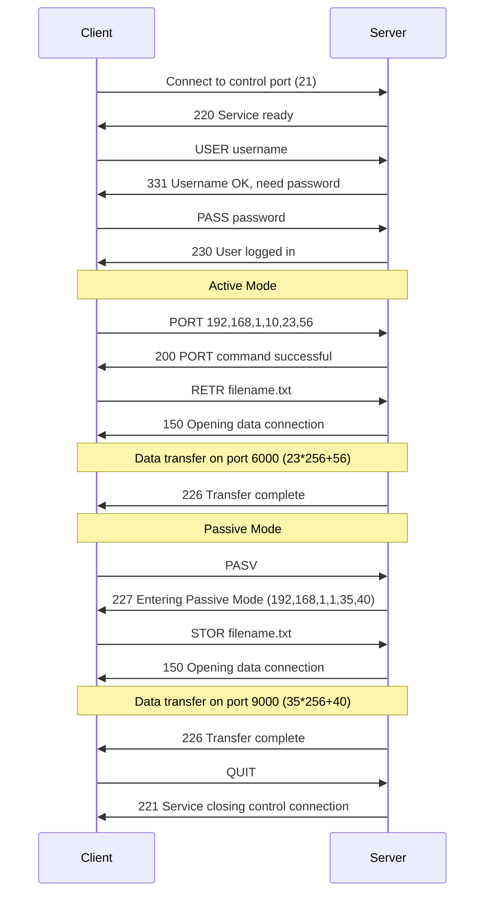
```mermaid
sequenceDiagram
    participant Client
    participant Server
    
    Client->>Server: Connect to control port (21)
    Server->>Client: 220 Service ready
    Client->>Server: USER username
    Server->>Client: 331 Username OK, need password
    Client->>Server: PASS password
    Server->>Client: 230 User logged in
    
    Note over Client,Server: Active Mode
    Client->>Server: PORT 192,168,1,10,23,56
    Server->>Client: 200 PORT command successful
    Client->>Server: RETR filename.txt
    Server->>Client: 150 Opening data connection
    Note over Client,Server: Data transfer on port 6000 (23*256+56)
    Server->>Client: 226 Transfer complete
    
    Note over Client,Server: Passive Mode
    Client->>Server: PASV
    Server->>Client: 227 Entering Passive Mode (192,168,1,1,35,40)
    Client->>Server: STOR filename.txt
    Server->>Client: 150 Opening data connection
    Note over Client,Server: Data transfer on port 9000 (35*256+40)
    Server->>Client: 226 Transfer complete
    
    Client->>Server: QUIT
    Server->>Client: 221 Service closing control connection
```

#### FTP Modes

- **Active Mode**: Server initiates data connection to client
- **Passive Mode**: Client initiates data connection to server (better for firewalls)

#### FTP Commands

| Command | Description |
|---------|-------------|
| USER | Username |
| PASS | Password |
| LIST | List files and directories |
| CWD | Change working directory |
| PWD | Print working directory |
| RETR | Retrieve (download) file |
| STOR | Store (upload) file |
| DELE | Delete file |
| MKD | Make directory |
| RMD | Remove directory |
| PASV | Enter passive mode |
| PORT | Specify address and port for active mode |
| QUIT | Logout |

#### FTP Response Codes

| Code Range | Meaning |
|------------|---------|
| 1xx | Positive Preliminary Reply |
| 2xx | Positive Completion Reply |
| 3xx | Positive Intermediate Reply |
| 4xx | Transient Negative Completion Reply |
| 5xx | Permanent Negative Completion Reply |

### SFTP (SSH File Transfer Protocol)

SFTP is a secure file transfer protocol that provides file access, file transfer, and file management over any reliable data stream.

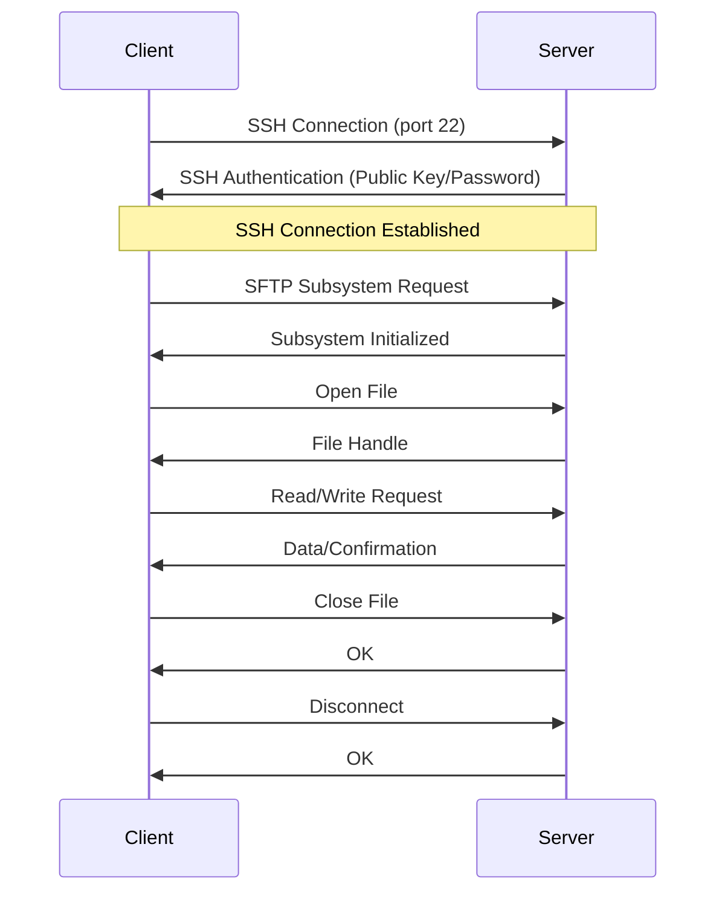
```mermaid
sequenceDiagram
    participant Client
    participant Server
    
    Client->>Server: SSH Connection (port 22)
    Server->>Client: SSH Authentication (Public Key/Password)
    
    Note over Client,Server: SSH Connection Established
    
    Client->>Server: SFTP Subsystem Request
    Server->>Client: Subsystem Initialized
    
    Client->>Server: Open File
    Server->>Client: File Handle
    
    Client->>Server: Read/Write Request
    Server->>Client: Data/Confirmation
    
    Client->>Server: Close File
    Server->>Client: OK
    
    Client->>Server: Disconnect
    Server->>Client: OK
```

#### SFTP vs FTP

| Feature | FTP | SFTP |
|---------|-----|------|
| Security | Unencrypted | Encrypted (SSH) |
| Authentication | Plain text | SSH methods |
| Firewall Friendly | No (requires multiple ports) | Yes (single port 22) |
| Connection | Separate control and data | Single connection |
| Commands | Text-based | Binary packets |
| Standard | RFC 959 | No formal RFC, SSH extension |

### SCP (Secure Copy Protocol)

SCP is a protocol for securely transferring files between a local and remote host or between two remote hosts.

```
# Copy local file to remote host
scp /path/to/local/file.txt user@remote:/path/to/destination/

# Copy remote file to local host
scp user@remote:/path/to/remote/file.txt /path/to/local/destination/

# Copy between remote hosts
scp user1@remote1:/path/to/file.txt user2@remote2:/path/to/destination/
```

#### SCP vs SFTP

| Feature | SCP | SFTP |
|---------|-----|------|
| Functionality | File transfers only | Full file management |
| Resume Transfers | No | Yes |
| Directory Listing | No | Yes |
| Remote File Operations | No | Yes |
| Performance | Generally faster | More overhead |
| Protocol | Modified RCP | SSH Subsystem |

## Remote Access Protocols

### SSH (Secure Shell)

SSH is a cryptographic network protocol for operating network services securely over an unsecured network.

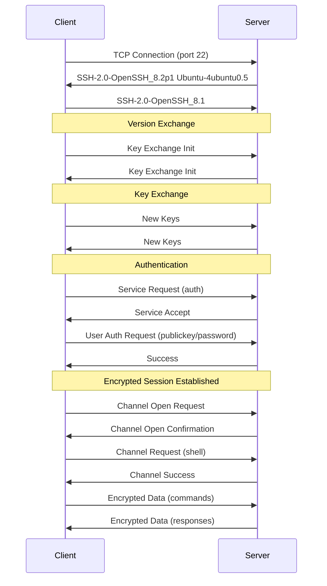
```mermaid
sequenceDiagram
    participant Client
    participant Server
    
    Client->>Server: TCP Connection (port 22)
    Server->>Client: SSH-2.0-OpenSSH_8.2p1 Ubuntu-4ubuntu0.5
    Client->>Server: SSH-2.0-OpenSSH_8.1
    
    Note over Client,Server: Version Exchange
    
    Client->>Server: Key Exchange Init
    Server->>Client: Key Exchange Init
    
    Note over Client,Server: Key Exchange
    
    Client->>Server: New Keys
    Server->>Client: New Keys
    
    Note over Client,Server: Authentication
    
    Client->>Server: Service Request (auth)
    Server->>Client: Service Accept
    Client->>Server: User Auth Request (publickey/password)
    Server->>Client: Success
    
    Note over Client,Server: Encrypted Session Established
    
    Client->>Server: Channel Open Request
    Server->>Client: Channel Open Confirmation
    Client->>Server: Channel Request (shell)
    Server->>Client: Channel Success
    
    Client->>Server: Encrypted Data (commands)
    Server->>Client: Encrypted Data (responses)
```

#### SSH Key Authentication

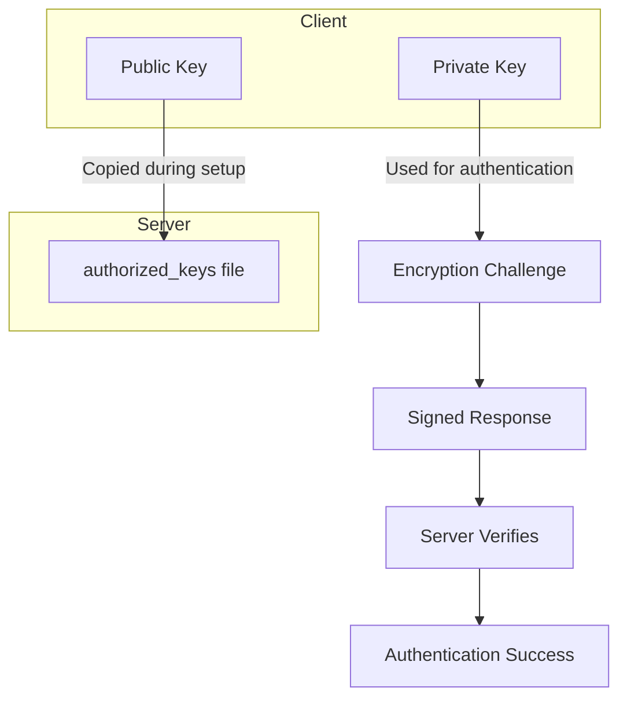
```mermaid
graph TD
    subgraph "Client"
        CP[Private Key]
        CU[Public Key]
    end
    
    subgraph "Server"
        A[authorized_keys file]
    end
    
    CU -- "Copied during setup" --> A
    
    CP -- "Used for authentication" --> B[Encryption Challenge]
    B --> C[Signed Response]
    C --> D[Server Verifies]
    D --> E[Authentication Success]
```

#### SSH Features

- **Secure Remote Shell**: Command-line access to remote systems
- **Port Forwarding**: Local, remote, and dynamic tunneling
- **X11 Forwarding**: Display remote graphical applications
- **SFTP/SCP**: Secure file transfers
- **Agent Forwarding**: Pass authentication to further connections
- **Multiple Authentication Methods**: Public key, password, keyboard-interactive

### Telnet

Telnet is an application protocol used on the Internet or local area networks to provide a bidirectional interactive text-oriented communication facility.

```
$ telnet example.com 23
Trying 93.184.216.34...
Connected to example.com.
Escape character is '^]'.

login: username
password: (password not displayed)

Welcome to Example.com
Last login: Mon Sep 01 15:26:48 from 192.168.1.100
$
```

#### Telnet vs SSH

| Feature | Telnet | SSH |
|---------|--------|-----|
| Security | Unencrypted | Encrypted |
| Authentication | Plain text | Encrypted, multiple methods |
| Data Transfer | Plain text | Encrypted |
| Standard Ports | 23 | 22 |
| Modern Usage | Legacy systems only | Standard for secure access |
| Protocol | RFC 854 | SSH-2 (RFC 4251-4254) |

### RDP (Remote Desktop Protocol)

RDP is a proprietary protocol developed by Microsoft for providing a graphical interface to connect to another computer over a network connection.

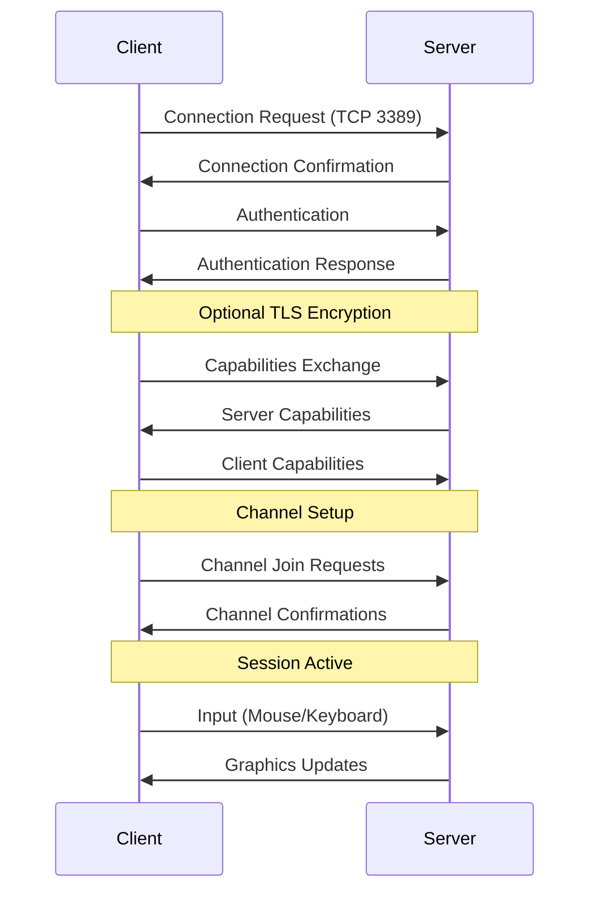
```mermaid
sequenceDiagram
    participant Client
    participant Server
    
    Client->>Server: Connection Request (TCP 3389)
    Server->>Client: Connection Confirmation
    
    Client->>Server: Authentication
    Server->>Client: Authentication Response
    
    Note over Client,Server: Optional TLS Encryption
    
    Client->>Server: Capabilities Exchange
    Server->>Client: Server Capabilities
    Client->>Server: Client Capabilities
    
    Note over Client,Server: Channel Setup
    
    Client->>Server: Channel Join Requests
    Server->>Client: Channel Confirmations
    
    Note over Client,Server: Session Active
    
    Client->>Server: Input (Mouse/Keyboard)
    Server->>Client: Graphics Updates
```

#### RDP Features

- **Graphical Interface**: Full desktop or application access
- **Clipboard Sharing**: Transfer text/files between systems
- **Drive Redirection**: Access local drives from remote session
- **Printer Redirection**: Print to local printers from remote session
- **Audio Redirection**: Hear remote audio locally
- **Multi-monitor Support**: Span across multiple displays
- **Compression and Caching**: Optimize for various connection speeds

## Network Management Protocols

### SNMP (Simple Network Management Protocol)

SNMP is an Internet Standard protocol for collecting and organizing information about managed devices on IP networks.

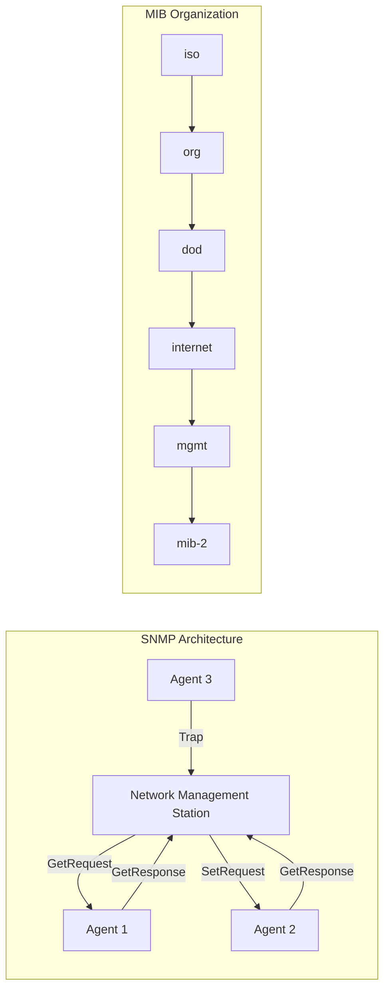
```mermaid
graph LR
    subgraph "SNMP Architecture"
        NMS[Network Management Station]
        A1[Agent 1]
        A2[Agent 2]
        A3[Agent 3]
        
        NMS -- "GetRequest" --> A1
        A1 -- "GetResponse" --> NMS
        NMS -- "SetRequest" --> A2
        A2 -- "GetResponse" --> NMS
        A3 -- "Trap" --> NMS
    end
    
    subgraph "MIB Organization"
        ISO[iso]
        ORG[org]
        DOD[dod]
        INTERNET[internet]
        MGMT[mgmt]
        MIB[mib-2]
        
        ISO --> ORG
        ORG --> DOD
        DOD --> INTERNET
        INTERNET --> MGMT
        MGMT --> MIB
    end
```

#### SNMP Message Types

| Message Type | Direction | Purpose |
|--------------|-----------|---------|
| GetRequest | Manager to Agent | Request a value |
| GetNextRequest | Manager to Agent | Request next value in MIB tree |
| GetBulkRequest | Manager to Agent | Request multiple values (SNMPv2/v3) |
| SetRequest | Manager to Agent | Set a value |
| Response | Agent to Manager | Response to a request |
| Trap | Agent to Manager | Asynchronous notification |
| InformRequest | Manager to Manager | Notification with acknowledgment |

#### SNMP Versions

| Version | Features | Security |
|---------|----------|----------|
| SNMPv1 | Basic functionality | Community strings (plain text) |
| SNMPv2c | Enhanced performance, better error handling | Community strings (plain text) |
| SNMPv3 | All v2c features plus security | Authentication, encryption |

### DHCP (Dynamic Host Configuration Protocol)

DHCP is a network management protocol used to automate the process of configuring devices on IP networks.

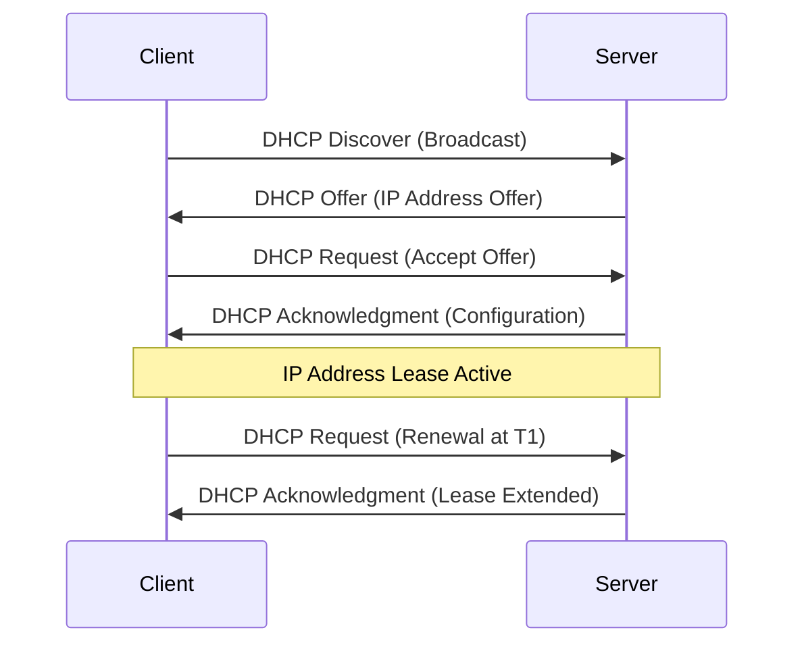
```mermaid
sequenceDiagram
    participant Client
    participant Server
    
    Client->>Server: DHCP Discover (Broadcast)
    Server->>Client: DHCP Offer (IP Address Offer)
    Client->>Server: DHCP Request (Accept Offer)
    Server->>Client: DHCP Acknowledgment (Configuration)
    
    Note over Client,Server: IP Address Lease Active
    
    Client->>Server: DHCP Request (Renewal at T1)
    Server->>Client: DHCP Acknowledgment (Lease Extended)
```

#### DHCP Packet Structure

```
 0                   1                   2                   3
 0 1 2 3 4 5 6 7 8 9 0 1 2 3 4 5 6 7 8 9 0 1 2 3 4 5 6 7 8 9 0 1
+-+-+-+-+-+-+-+-+-+-+-+-+-+-+-+-+-+-+-+-+-+-+-+-+-+-+-+-+-+-+-+-+
|     op (1)    |   htype (1)   |   hlen (1)    |   hops (1)    |
+-+-+-+-+-+-+-+-+-+-+-+-+-+-+-+-+-+-+-+-+-+-+-+-+-+-+-+-+-+-+-+-+
|                          xid (4)                              |
+-+-+-+-+-+-+-+-+-+-+-+-+-+-+-+-+-+-+-+-+-+-+-+-+-+-+-+-+-+-+-+-+
|           secs (2)            |           flags (2)           |
+-+-+-+-+-+-+-+-+-+-+-+-+-+-+-+-+-+-+-+-+-+-+-+-+-+-+-+-+-+-+-+-+
|                        ciaddr  (4)                            |
+-+-+-+-+-+-+-+-+-+-+-+-+-+-+-+-+-+-+-+-+-+-+-+-+-+-+-+-+-+-+-+-+
|                        yiaddr  (4)                            |
+-+-+-+-+-+-+-+-+-+-+-+-+-+-+-+-+-+-+-+-+-+-+-+-+-+-+-+-+-+-+-+-+
|                        siaddr  (4)                            |
+-+-+-+-+-+-+-+-+-+-+-+-+-+-+-+-+-+-+-+-+-+-+-+-+-+-+-+-+-+-+-+-+
|                        giaddr  (4)                            |
+-+-+-+-+-+-+-+-+-+-+-+-+-+-+-+-+-+-+-+-+-+-+-+-+-+-+-+-+-+-+-+-+
|                                                               |
|                        chaddr  (16)                           |
|                                                               |
|                                                               |
+-+-+-+-+-+-+-+-+-+-+-+-+-+-+-+-+-+-+-+-+-+-+-+-+-+-+-+-+-+-+-+-+
|                                                               |
|                        sname   (64)                           |
+-+-+-+-+-+-+-+-+-+-+-+-+-+-+-+-+-+-+-+-+-+-+-+-+-+-+-+-+-+-+-+-+
|                                                               |
|                        file    (128)                          |
+-+-+-+-+-+-+-+-+-+-+-+-+-+-+-+-+-+-+-+-+-+-+-+-+-+-+-+-+-+-+-+-+
|                                                               |
|                        options (variable)                     |
+-+-+-+-+-+-+-+-+-+-+-+-+-+-+-+-+-+-+-+-+-+-+-+-+-+-+-+-+-+-+-+-+
```

#### DHCP Options

| Option Code | Name | Description |
|-------------|------|-------------|
| 1 | Subnet Mask | Client's subnet mask |
| 3 | Router | Default gateway |
| 6 | DNS Servers | DNS server addresses |
| 12 | Hostname | Client hostname |
| 15 | Domain Name | DNS domain name |
| 28 | Broadcast Address | Broadcast address for client subnet |
| 51 | IP Address Lease Time | Duration of the lease |
| 53 | DHCP Message Type | Type of DHCP message |
| 54 | DHCP Server Identifier | Identifying DHCP server |
| 58 | Renewal Time Value | T1 timer value |
| 59 | Rebinding Time Value | T2 timer value |

### DNS (Domain Name System)

DNS is a hierarchical and decentralized naming system for computers, services, and other resources connected to the Internet or a private network.

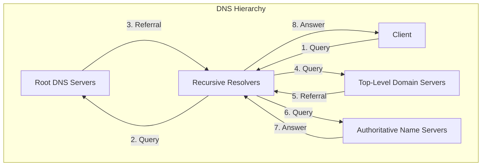
```mermaid
graph TB
    subgraph "DNS Hierarchy"
        Root[Root DNS Servers]
        TLD[Top-Level Domain Servers]
        Auth[Authoritative Name Servers]
        Rec[Recursive Resolvers]
        Client[Client]
        
        Client -- "1. Query" --> Rec
        Rec -- "2. Query" --> Root
        Root -- "3. Referral" --> Rec
        Rec -- "4. Query" --> TLD
        TLD -- "5. Referral" --> Rec
        Rec -- "6. Query" --> Auth
        Auth -- "7. Answer" --> Rec
        Rec -- "8. Answer" --> Client
    end
```

#### DNS Resource Record Types

| Record Type | Purpose | Example |
|-------------|---------|---------|
| A | IPv4 Address | example.com. IN A 93.184.216.34 |
| AAAA | IPv6 Address | example.com. IN AAAA 2606:2800:220:1:248:1893:25c8:1946 |
| CNAME | Canonical Name (Alias) | www.example.com. IN CNAME example.com. |
| MX | Mail Exchange | example.com. IN MX 10 mail.example.com. |
| NS | Name Server | example.com. IN NS ns1.example.com. |
| PTR | Pointer (Reverse DNS) | 34.216.184.93.in-addr.arpa. IN PTR example.com. |
| SOA | Start of Authority | example.com. IN SOA ns1.example.com. admin.example.com. (serial refresh retry expire minimum) |
| TXT | Text | example.com. IN TXT "v=spf1 include:_spf.example.com ~all" |
| SRV | Service | _sip._tcp.example.com. IN SRV 0 5 5060 sipserver.example.com. |
| CAA | Certification Authority Authorization | example.com. IN CAA 0 issue "letsencrypt.org" |

#### DNS Message Format

```
 0                   1                   2                   3
 0 1 2 3 4 5 6 7 8 9 0 1 2 3 4 5 6 7 8 9 0 1 2 3 4 5 6 7 8 9 0 1
+-+-+-+-+-+-+-+-+-+-+-+-+-+-+-+-+-+-+-+-+-+-+-+-+-+-+-+-+-+-+-+-+
|                      Transaction ID                           |
+-+-+-+-+-+-+-+-+-+-+-+-+-+-+-+-+-+-+-+-+-+-+-+-+-+-+-+-+-+-+-+-+
|QR|   Opcode  |AA|TC|RD|RA|   Z    |   RCODE   |               |
+-+-+-+-+-+-+-+-+-+-+-+-+-+-+-+-+-+-+-+-+-+-+-+-+               |
|                    QDCOUNT (Question Count)                   |
+-+-+-+-+-+-+-+-+-+-+-+-+-+-+-+-+-+-+-+-+-+-+-+-+-+-+-+-+-+-+-+-+
|                   ANCOUNT (Answer Count)                      |
+-+-+-+-+-+-+-+-+-+-+-+-+-+-+-+-+-+-+-+-+-+-+-+-+-+-+-+-+-+-+-+-+
|                 NSCOUNT (Authority Count)                     |
+-+-+-+-+-+-+-+-+-+-+-+-+-+-+-+-+-+-+-+-+-+-+-+-+-+-+-+-+-+-+-+-+
|                 ARCOUNT (Additional Count)                    |
+-+-+-+-+-+-+-+-+-+-+-+-+-+-+-+-+-+-+-+-+-+-+-+-+-+-+-+-+-+-+-+-+
|                             ...                               |
|                         Question Section                      |
|                             ...                               |
+-+-+-+-+-+-+-+-+-+-+-+-+-+-+-+-+-+-+-+-+-+-+-+-+-+-+-+-+-+-+-+-+
|                             ...                               |
|                          Answer Section                       |
|                             ...                               |
+-+-+-+-+-+-+-+-+-+-+-+-+-+-+-+-+-+-+-+-+-+-+-+-+-+-+-+-+-+-+-+-+
|                             ...                               |
|                        Authority Section                      |
|                             ...                               |
+-+-+-+-+-+-+-+-+-+-+-+-+-+-+-+-+-+-+-+-+-+-+-+-+-+-+-+-+-+-+-+-+
|                             ...                               |
|                       Additional Section                      |
|                             ...                               |
+-+-+-+-+-+-+-+-+-+-+-+-+-+-+-+-+-+-+-+-+-+-+-+-+-+-+-+-+-+-+-+-+
```

## Network Security Protocols

### SSL/TLS (Secure Sockets Layer/Transport Layer Security)

SSL/TLS protocols provide secure communication over a computer network, ensuring privacy, authentication, and data integrity.

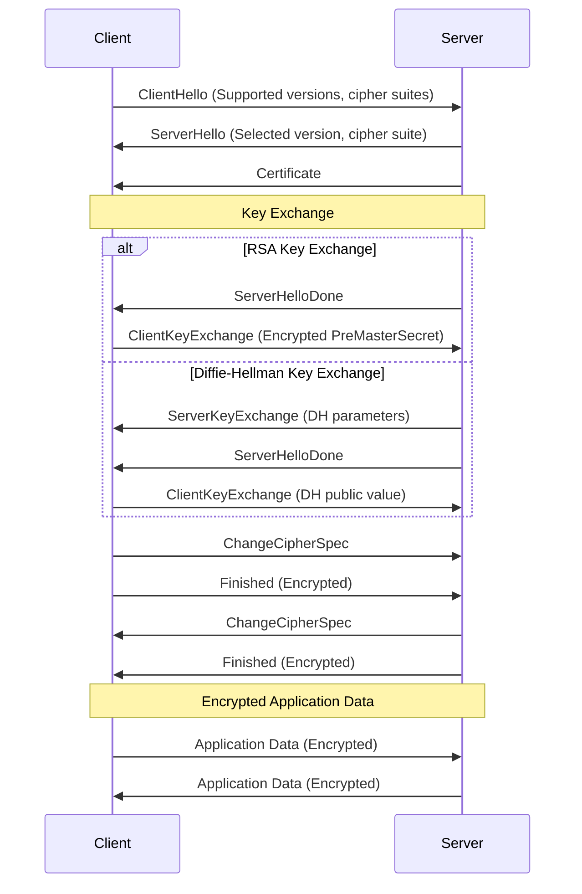
```mermaid
sequenceDiagram
    participant Client
    participant Server
    
    Client->>Server: ClientHello (Supported versions, cipher suites)
    Server->>Client: ServerHello (Selected version, cipher suite)
    Server->>Client: Certificate
    
    Note over Client,Server: Key Exchange
    
    alt RSA Key Exchange
        Server->>Client: ServerHelloDone
        Client->>Server: ClientKeyExchange (Encrypted PreMasterSecret)
    else Diffie-Hellman Key Exchange
        Server->>Client: ServerKeyExchange (DH parameters)
        Server->>Client: ServerHelloDone
        Client->>Server: ClientKeyExchange (DH public value)
    end
    
    Client->>Server: ChangeCipherSpec
    Client->>Server: Finished (Encrypted)
    Server->>Client: ChangeCipherSpec
    Server->>Client: Finished (Encrypted)
    
    Note over Client,Server: Encrypted Application Data
    
    Client->>Server: Application Data (Encrypted)
    Server->>Client: Application Data (Encrypted)
```

#### TLS Version Comparison

| Feature | TLS 1.0 (1999) | TLS 1.1 (2006) | TLS 1.2 (2008) | TLS 1.3 (2018) |
|---------|----------------|----------------|----------------|----------------|
| Key Exchange | RSA, DH, DHE | RSA, DH, DHE | RSA, DH, DHE, ECDHE | ECDHE, DHE only |
| Cipher Suites | RC4, DES, 3DES, AES | RC4, 3DES, AES | AES, ChaCha20 | AES, ChaCha20 |
| Handshake | 2 round trips | 2 round trips | 2 round trips | 1 round trip |
| Perfect Forward Secrecy | Optional | Optional | Optional | Mandatory |
| Status | Deprecated | Deprecated | Widely used | Current |

### IPsec (Internet Protocol Security)

IPsec is a suite of protocols that authenticate and encrypt the packets of data to provide secure encrypted communication between two computers over an Internet Protocol network.

```mermaid
graph TB
    subgraph "IPsec Components"
        AH[Authentication Header (AH)]
        ESP[Encapsulating Security Payload (ESP)]
        IKE[Internet Key Exchange (IKE)]
        SA[Security Associations (SA)]
    end
    
    subgraph "IPsec Modes"
        TM[Transport Mode]
        TM_DESC["Protects payload of IP packet"]
        TM --- TM_DESC
        
        TM --- IP1[Original IP Header]
        TM --- IPsec1[IPsec Header]
        TM --- Data1[Data]
        
        TM2[Tunnel Mode]
        TM2_DESC["Protects entire IP packet"]
        TM2 --- TM2_DESC
        
        TM2 --- IP2[New IP Header]
        TM2 --- IPsec2[IPsec Header]
        TM2 --- IP3[Original IP Header]
        TM2 --- Data2[Data]
    end
```

#### IPsec Protocols

1. **Authentication Header (AH)**:
   - Provides data integrity and authentication
   - Does not provide encryption
   - Protocol number: 51

2. **Encapsulating Security Payload (ESP)**:
   - Provides confidentiality, data integrity, authentication
   - Encrypts packet payload
   - Protocol number: 50

3. **Internet Key Exchange (IKE)**:
   - Establishes Security Associations (SA)
   - Handles key exchange
   - Uses UDP port 500

## Protocol Analysis and Comparison

### Protocol Layering in the OSI Model

```mermaid
graph TB
    subgraph "Application Layer (7)"
        HTTP
        HTTPS
        FTP
        SMTP
        DNS
        TELNET
        SSH
    end
    
    subgraph "Presentation Layer (6)"
        SSL/TLS
        MIME
    end
    
    subgraph "Session Layer (5)"
        NetBIOS
        RPC
    end
    
    subgraph "Transport Layer (4)"
        TCP
        UDP
        SCTP
    end
    
    subgraph "Network Layer (3)"
        IP
        ICMP
        IPsec
        OSPF
    end
    
    subgraph "Data Link Layer (2)"
        Ethernet
        PPP
        HDLC
        Wi-Fi
    end
    
    subgraph "Physical Layer (1)"
        RS-232
        USB
        Ethernet_PHY
    end
```

### Protocol Selection Guide

| Requirement | Recommended Protocols |
|-------------|----------------------|
| Reliable Data Transfer | TCP |
| Low Latency | UDP |
| Web Browsing | HTTP/HTTPS |
| Secure Communication | HTTPS, SSH, TLS |
| File Transfer | SFTP, SCP, HTTPS |
| Email | SMTP, IMAP, POP3 |
| Remote Access | SSH, RDP |
| Network Management | SNMP, NETCONF |
| Dynamic IP Configuration | DHCP |
| Name Resolution | DNS |
| Network Layer Security | IPsec |

### Common Protocol Port Numbers

| Protocol | Port Number | Transport |
|----------|-------------|-----------|
| HTTP | 80 | TCP |
| HTTPS | 443 | TCP |
| FTP | 20/21 | TCP |
| SFTP | 22 | TCP |
| SSH | 22 | TCP |
| Telnet | 23 | TCP |
| SMTP | 25 | TCP |
| SMTP Submission | 587 | TCP |
| DNS | 53 | TCP/UDP |
| DHCP | 67/68 | UDP |
| TFTP | 69 | UDP |
| POP3 | 110 | TCP |
| IMAP | 143 | TCP |
| SNMP | 161/162 | UDP |
| LDAP | 389 | TCP |
| RDP | 3389 | TCP |

## Practice Questions

1. Compare and contrast TCP and UDP, explaining scenarios where each would be the preferred protocol choice.

2. Describe the TCP three-way handshake process in detail. What is the purpose of each step, and what happens if one step fails?

3. Analyze an HTTP request and response, explaining the key components of each and how they relate to the client-server communication model.

4. Explain how HTTPS provides security over standard HTTP. What specific threats does it protect against?

5. Compare POP3 and IMAP email protocols, detailing their strengths and weaknesses for different usage scenarios.

6. A company needs to allow secure remote file management for employees. Compare FTP, SFTP, and SCP, recommending the most appropriate protocol with justification.

7. Describe the DHCP process (DORA) in detail, including the purpose of each message and what happens when a DHCP server is unavailable.

8. Explain how DNS resolves domain names to IP addresses, including the hierarchical structure of DNS and the role of recursive and authoritative servers.

9. Compare Telnet and SSH, explaining why SSH has largely replaced Telnet for remote administration.

10. Describe the IPsec protocol suite and how it provides security at the network layer. What are the advantages of implementing security at this layer versus higher layers?

## Additional Resources

- [RFC Index](https://www.rfc-editor.org/rfc-index.html)
- [IANA Port Number Registry](https://www.iana.org/assignments/service-names-port-numbers/service-names-port-numbers.xhtml)
- [Wireshark Protocol Analysis Tool](https://www.wireshark.org/)
- [Computer Networks by Andrew S. Tanenbaum](https://www.amazon.com/Computer-Networks-5th-Andrew-Tanenbaum/dp/0132126958)
- [TCP/IP Illustrated by W. Richard Stevens](https://www.amazon.com/TCP-Illustrated-Vol-Addison-Wesley-Professional/dp/0201633469)

---

<div align="center">
  <p>
    <a href="../day_009/README.md">⬅️ Previous Day</a> | 
    <a href="../README.md">🏠 Home</a> |
    <a href="../day_011/README.md">➡️ Next Day</a>
  </p>
</div>
