# Day 10: Introduction to Routing Protocols

## Topics Covered
- Introduction to Routing Protocols

## 1. Routing Protocol Fundamentals

Routing protocols enable routers to dynamically share information about remote networks and automatically add this information to their routing tables.

### Routing Protocol Categories

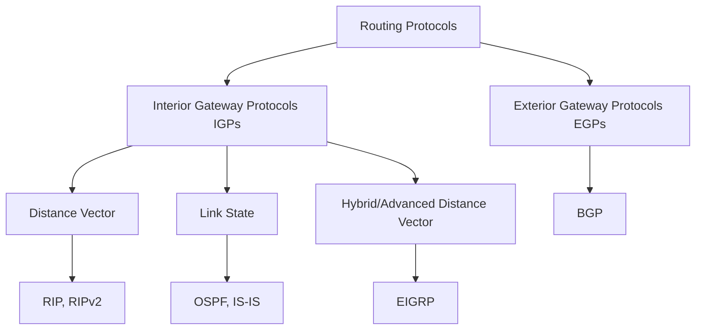

### Key Routing Protocol Characteristics

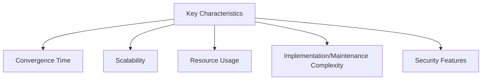

**Convergence:** The time it takes for all routers to agree on available routes after a topology change.

**Scaling Factors:**
- Number of routers
- Number of routes
- Number of neighbors
- Frequency of topology changes

## 2. Routing Information Protocol (RIP)

RIP is one of the oldest distance vector routing protocols, using hop count as its metric.

### RIP Versions

**RIPv1:**
- Classful routing protocol
- Broadcast updates
- No subnet mask information
- No authentication

**RIPv2:**
- Classless routing protocol
- Multicast updates (224.0.0.9)
- Includes subnet mask
- Supports authentication
- Supports route summarization

**RIPng (RIP Next Generation):**
- RIP for IPv6
- Multicast updates (FF02::9)
- No authentication (relies on IPsec)

### RIP Operation

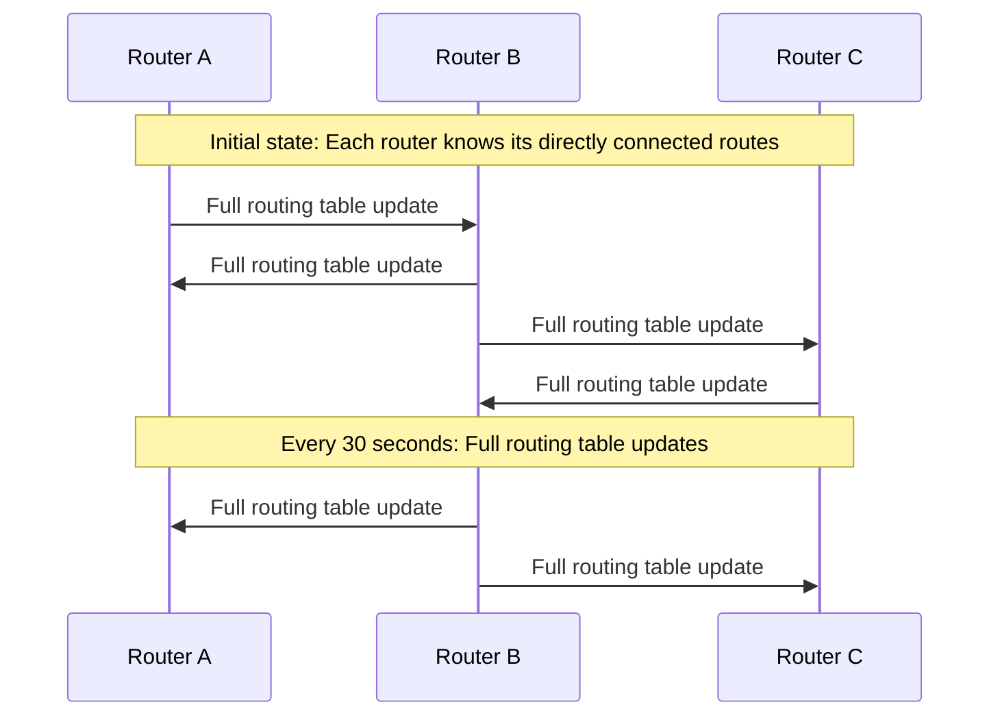

**Key RIP Characteristics:**
- Maximum hop count of 15 (16 = infinity/unreachable)
- Updates every 30 seconds
- Hold-down timer: 180 seconds
- Flush timer: 240 seconds
- Invalid timer: 180 seconds
- Uses split horizon and route poisoning to prevent loops

### RIP Configuration Example (Cisco IOS)

```
Router(config)# router rip
Router(config-router)# version 2
Router(config-router)# network 192.168.1.0
Router(config-router)# network 192.168.2.0
Router(config-router)# no auto-summary
```

**Advantages:**
- Simple to configure and understand
- Low resource requirements
- Works well in small networks

**Disadvantages:**
- Slow convergence
- Limited scalability (15 hop maximum)
- Doesn't consider bandwidth in route selection
- Periodic updates consume bandwidth

## 3. Open Shortest Path First (OSPF)

OSPF is a link-state routing protocol that uses Dijkstra's shortest path first algorithm to calculate the best path to each destination.

### OSPF Concepts

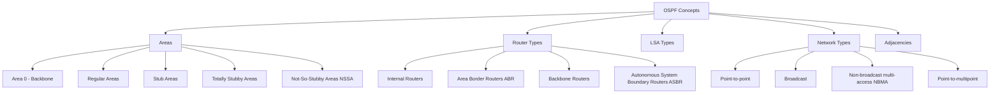

### OSPF Areas

OSPF uses a hierarchical design with areas to improve scalability.

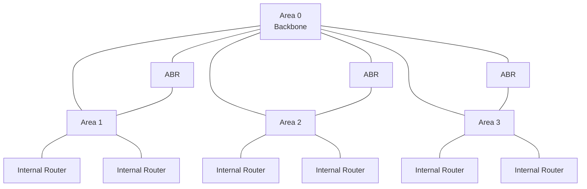

**Area Types:**
- **Backbone area (Area 0)**: Central area to which all other areas connect
- **Regular areas**: Connect to the backbone and receive all LSAs
- **Stub areas**: No external routes, default route used instead
- **Totally stubby areas**: Only default route from ABR
- **Not-so-stubby areas (NSSA)**: Can import external routes but has stub characteristics

### OSPF Operation

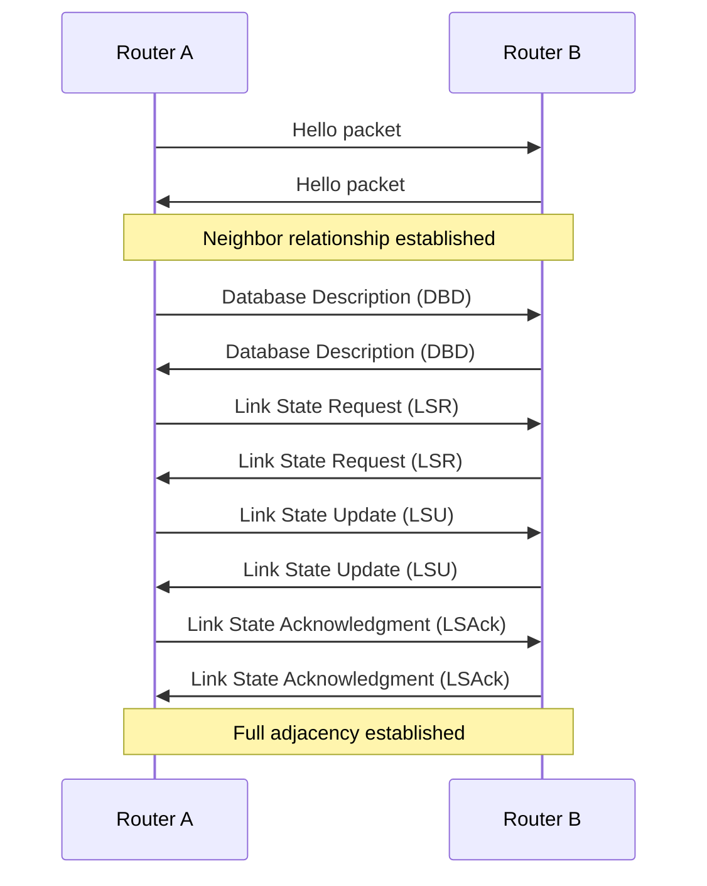

**OSPF Process Steps:**
1. **Neighbor discovery**: Hello packets establish neighbor relationships
2. **Database synchronization**: Routers exchange LSAs
3. **Route calculation**: Dijkstra's SPF algorithm finds shortest paths
4. **Route installation**: Best routes installed in routing table

### OSPF Configuration Example (Cisco IOS)

```
Router(config)# router ospf 1
Router(config-router)# network 192.168.1.0 0.0.0.255 area 0
Router(config-router)# network 192.168.2.0 0.0.0.255 area 1
Router(config-router)# area 1 stub

Router(config)# interface GigabitEthernet0/0
Router(config-if)# ip ospf cost 100
```

**Advantages:**
- Fast convergence
- Scalable through hierarchical design
- Efficient use of bandwidth after initial exchange
- Supports VLSM and route summarization
- Load balancing over equal-cost paths

**Disadvantages:**
- Complex to configure and troubleshoot
- Higher CPU and memory requirements
- Requires hierarchical design for large networks
- Area planning required before implementation

## 4. Enhanced Interior Gateway Routing Protocol (EIGRP)

EIGRP is a Cisco-proprietary advanced distance vector routing protocol that combines features of both distance vector and link state protocols.

### EIGRP Features

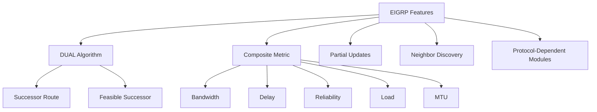

### DUAL (Diffusing Update Algorithm)

DUAL is the algorithm used by EIGRP to provide loop-free routing and fast convergence.

**Key DUAL Concepts:**
- **Successor**: Best route to a destination
- **Feasible successor**: Backup route that is guaranteed to be loop-free
- **Feasible distance (FD)**: Metric of the best route to a destination
- **Reported distance (RD)**: Metric advertised by a neighbor
- **Feasibility condition**: A route becomes a feasible successor if its RD is less than the FD of the successor

### EIGRP Operation

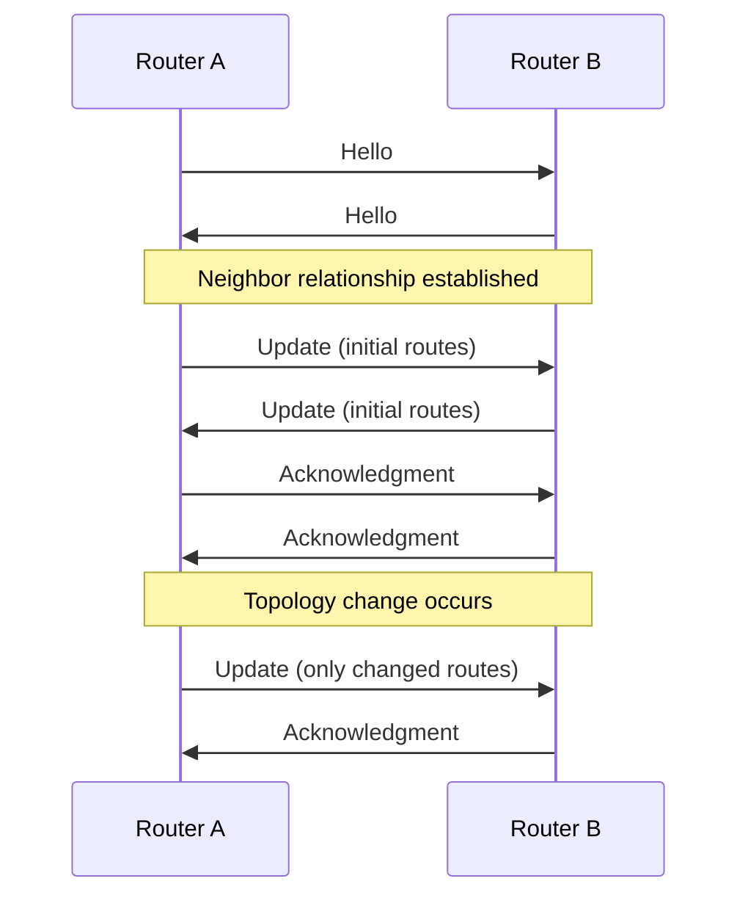

**EIGRP Packet Types:**
- **Hello**: Discovers and maintains neighbors
- **Update**: Conveys routing information
- **Query**: Requests specific routing information
- **Reply**: Responds to query packets
- **Acknowledgment**: Confirms receipt of updates

### EIGRP Configuration Example (Cisco IOS)

```
Router(config)# router eigrp 100
Router(config-router)# network 192.168.1.0 0.0.0.255
Router(config-router)# network 192.168.2.0 0.0.0.255
Router(config-router)# no auto-summary

Router(config)# interface GigabitEthernet0/0
Router(config-if)# bandwidth 100000
Router(config-if)# delay 100
```

**Advantages:**
- Fast convergence with feasible successors
- Efficient use of bandwidth with partial updates
- Support for unequal-cost load balancing
- Support for multiple network protocols
- Easy to configure for basic operation

**Disadvantages:**
- Traditionally Cisco-proprietary (though now partially open)
- No area concept for hierarchical design
- Complex metric calculation
- Queries can cause high CPU utilization in large networks

## 5. Border Gateway Protocol (BGP)

BGP is the routing protocol of the Internet, used for exchanging routing information between autonomous systems (AS).

### BGP Concepts

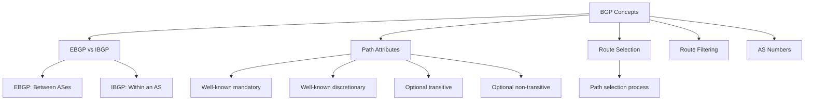

### BGP Path Attributes

BGP uses path attributes to make routing decisions.

**Important Path Attributes:**
- **AS_PATH**: Sequence of AS numbers the route has traversed
- **NEXT_HOP**: IP address to reach the next AS
- **LOCAL_PREF**: Preference value for routes (higher is better)
- **MED (Multi-Exit Discriminator)**: Hint to external neighbors about preferred entry point
- **ORIGIN**: How BGP learned the route
- **COMMUNITY**: Used for route filtering and policy implementation

### BGP Path Selection Process

BGP uses a complex decision process to select the best path when multiple paths to the same destination exist.

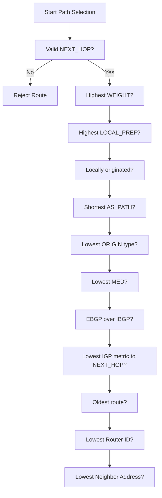

### BGP Operation

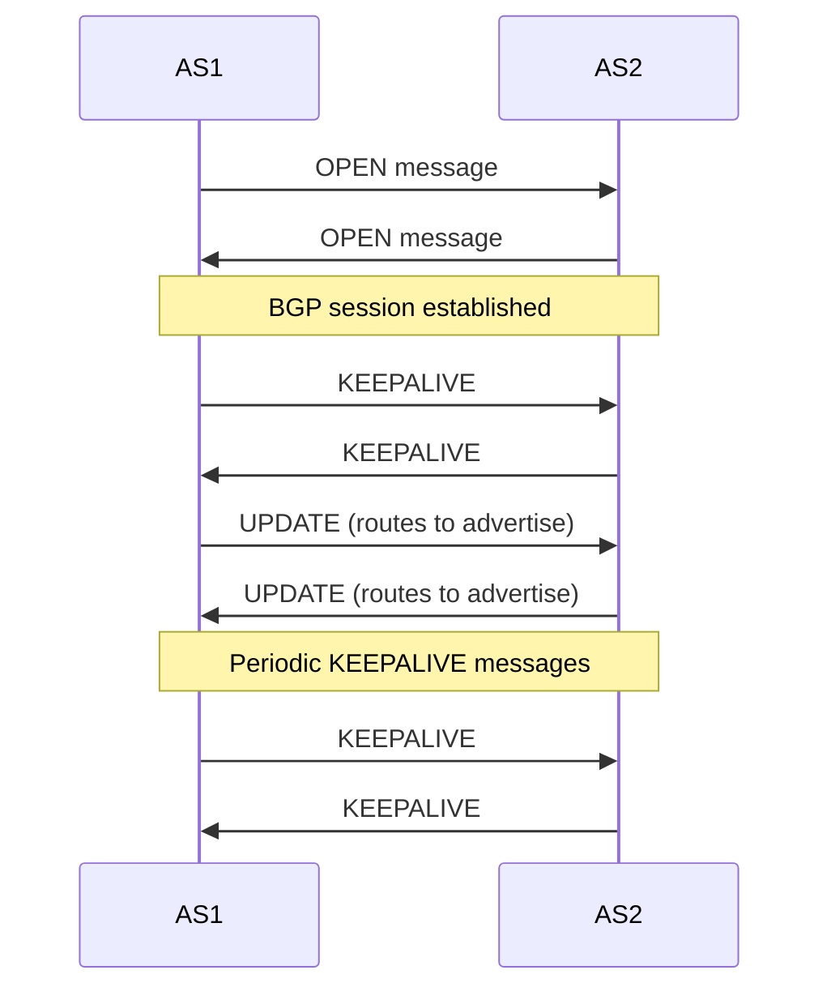

**BGP Message Types:**
- **OPEN**: Establishes a BGP session
- **UPDATE**: Advertises or withdraws routes
- **KEEPALIVE**: Keeps the BGP session active
- **NOTIFICATION**: Indicates an error
- **ROUTE-REFRESH**: Requests re-advertisement of routes

### BGP Configuration Example (Cisco IOS)

```
Router(config)# router bgp 65001
Router(config-router)# neighbor 192.168.1.2 remote-as 65002
Router(config-router)# neighbor 192.168.1.2 password BGP-password
Router(config-router)# network 10.0.0.0 mask 255.255.0.0
Router(config-router)# neighbor 192.168.1.2 route-map FILTER-IN in
Router(config-router)# neighbor 192.168.1.2 route-map FILTER-OUT out

Router(config)# route-map FILTER-OUT permit 10
Router(config-route-map)# match ip address prefix-list MY-NETWORKS
Router(config-route-map)# set community 65001:100
```

**Advantages:**
- Highly scalable (powers the Internet)
- Rich policy control capabilities
- Stable and battle-tested
- Path control through attributes

**Disadvantages:**
- Complex configuration and troubleshooting
- Slow convergence
- Memory intensive (full Internet routing table ~900K routes)
- Requires careful design to prevent routing loops

## 6. Intermediate System to Intermediate System (IS-IS)

IS-IS is a link-state routing protocol originally designed for OSI networks but adapted to route IP networks.

### IS-IS Concepts

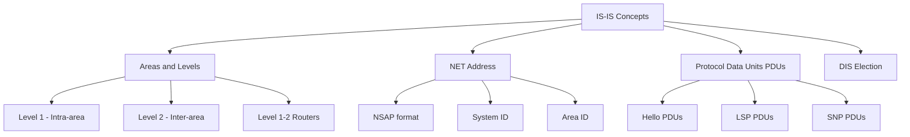

### IS-IS Areas and Levels

Unlike OSPF, IS-IS areas are associated with routers, not interfaces.

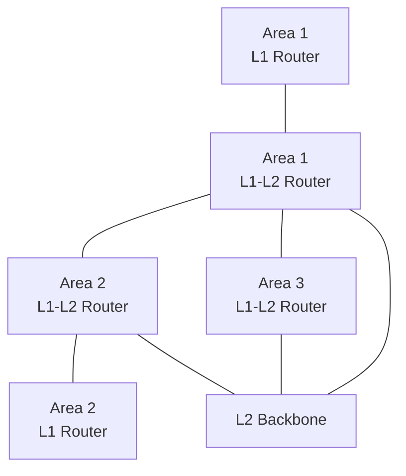

**IS-IS Router Types:**
- **Level 1 (L1)**: Equivalent to OSPF internal routers
- **Level 2 (L2)**: Form the backbone, similar to OSPF backbone routers
- **Level 1-2 (L1-L2)**: Connect Level 1 areas to the Level 2 backbone

### IS-IS Configuration Example (Cisco IOS)

```
Router(config)# router isis
Router(config-router)# net 49.0001.0000.0000.0001.00
Router(config-router)# is-type level-1-2

Router(config)# interface GigabitEthernet0/0
Router(config-if)# ip router isis
Router(config-if)# isis circuit-type level-1
```

**Advantages:**
- More scalable than OSPF for very large networks
- Better support for IPv6 (integrated design)
- Efficiently handles frequent topology changes
- Widely used by service providers

**Disadvantages:**
- Less common in enterprise networks
- Fewer engineers familiar with it
- Requires understanding of OSI addressing
- Less abundant documentation and tools

## 7. Routing Protocol Comparison

```
┌───────────────┬─────────┬────────┬───────┬──────┬──────┐
│ Characteristic│ RIP     │ OSPF   │ EIGRP │ BGP  │ IS-IS│
├───────────────┼─────────┼────────┼───────┼──────┼──────┤
│ Type          │ Distance│ Link   │ Hybrid│ Path │ Link │
│               │ Vector  │ State  │       │ Vector│ State│
├───────────────┼─────────┼────────┼───────┼──────┼──────┤
│ Convergence   │ Slow    │ Fast   │ Very  │ Slow │ Fast │
│               │         │        │ Fast  │      │      │
├───────────────┼─────────┼────────┼───────┼──────┼──────┤
│ Scalability   │ Low     │ Medium │ Medium│ High │ High │
│               │         │ to High│ to High│     │      │
├───────────────┼─────────┼────────┼───────┼──────┼──────┤
│ Resources     │ Low     │ High   │ Medium│ High │ High │
│ Required      │         │        │       │      │      │
├───────────────┼─────────┼────────┼───────┼──────┼──────┤
│ Implementation│ Simple  │ Complex│ Medium│ Very │ Complex│
│ Complexity    │         │        │       │Complex│       │
├───────────────┼─────────┼────────┼───────┼──────┼──────┤
│ Metric        │ Hop     │ Cost   │Composite│ Path │ Cost │
│               │ Count   │        │ Metric │Attributes│   │
├───────────────┼─────────┼────────┼───────┼──────┼──────┤
│ AD (Cisco)    │ 120     │ 110    │ 90    │ 20/200│ 115  │
├───────────────┼─────────┼────────┼───────┼──────┼──────┤
│ VLSM Support  │ RIPv2   │ Yes    │ Yes   │ Yes  │ Yes  │
│               │ only    │        │       │      │      │
├───────────────┼─────────┼────────┼───────┼──────┼──────┤
│ Best Use Case │ Small   │ Medium │ Enterprise│Inter-AS│Service│
│               │ Networks│to Large│ Networks │ Routing│Provider│
└───────────────┴─────────┴────────┴───────┴──────┴──────┘
```

## 8. Routing Protocol Selection Considerations

When selecting a routing protocol, consider the following factors:

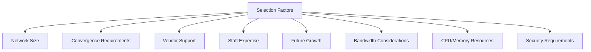

### Use Case Examples

**Small Office (10-20 devices, single location):**
- Static routing or RIP might be sufficient
- Simple configuration and management

**Medium Enterprise (multiple locations, 100s of devices):**
- OSPF or EIGRP within the organization
- Possibly BGP for connecting to multiple ISPs

**Large Enterprise/Service Provider (1000s of devices, many locations):**
- IS-IS or OSPF for internal routing (IGP)
- BGP for external connections and WAN
- Route summarization and filtering critical

## 9. Route Redistribution

Route redistribution is the process of taking routes learned through one routing protocol and advertising them through another routing protocol.

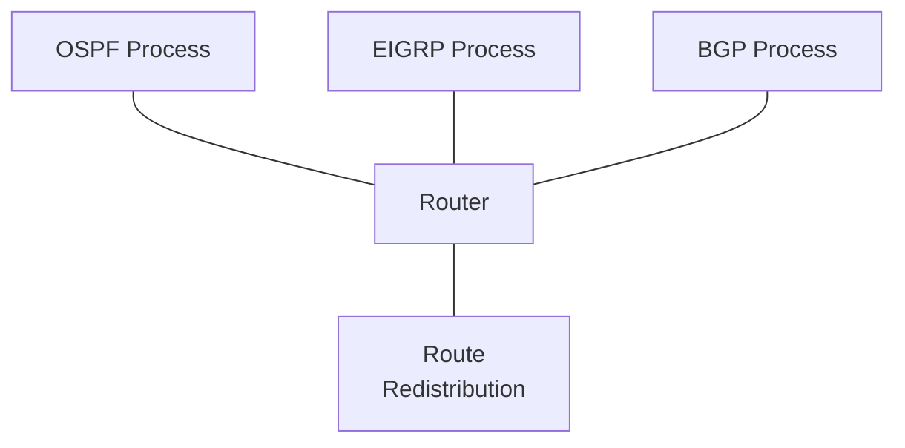

### Redistribution Configuration Example (Cisco IOS)

```
Router(config)# router ospf 1
Router(config-router)# redistribute eigrp 100 subnets metric-type 1 metric 1000

Router(config)# router eigrp 100
Router(config-router)# redistribute ospf 1 metric 10000 100 255 1 1500
```

**Redistribution Challenges:**
- Routing loops
- Suboptimal routing
- Different metric systems
- Administrative distance concerns
- Route feedback (routes coming back to original protocol)

**Best Practices:**
- Use route filtering with redistribution
- Set appropriate default metrics
- Control which routes are redistributed
- Consider using route tags
- Implement loop prevention techniques

## 10. Virtual Routing and Forwarding (VRF)

VRF allows multiple instances of a routing table to exist on the same router simultaneously, enabling network segmentation without additional hardware.

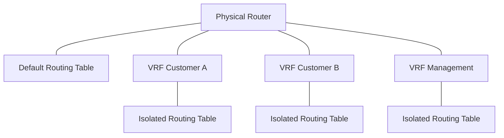

### VRF Configuration Example (Cisco IOS)

```
Router(config)# ip vrf CustomerA
Router(config-vrf)# rd 65000:1
Router(config-vrf)# route-target export 65000:1
Router(config-vrf)# route-target import 65000:1

Router(config)# interface GigabitEthernet0/0
Router(config-if)# ip vrf forwarding CustomerA
Router(config-if)# ip address 192.168.1.1 255.255.255.0

Router(config)# router ospf 10 vrf CustomerA
Router(config-router)# network 192.168.1.0 0.0.0.255 area 0
```

**Applications of VRF:**
- Multi-tenant environments
- Managed service providers
- Network segmentation for security
- Overlapping IP address spaces
- MPLS VPNs

## Additional Resources

- [Routing Protocol Selection Guide](https://www.cisco.com/c/en/us/support/docs/ip/enhanced-interior-gateway-routing-protocol-eigrp/7765-1.html)
- [RFCs for Routing Protocols](https://www.rfc-editor.org/)
- [Juniper Networks Routing Protocols](https://www.juniper.net/documentation/en_US/junos/topics/concept/routing-protocol-overview.html)
- [OSPF Design Guide](https://www.cisco.com/c/en/us/support/docs/ip/open-shortest-path-first-ospf/7039-1.html)
- [BGP Best Practices](https://tools.ietf.org/html/rfc7454)

## Practice Questions

1. Your company has a network with multiple sites connected via WAN links. Some links have high bandwidth while others have low bandwidth. Which routing protocol would you recommend, and why?

2. Compare and contrast RIP, OSPF, and EIGRP in terms of convergence time, scalability, and resource usage. For what size networks is each protocol most appropriate?

3. Explain the process of route redistribution between OSPF and EIGRP, including potential issues and best practices.

4. A global organization needs to connect to multiple ISPs and control inbound and outbound traffic flow. Which routing protocol would be most appropriate, and what features would you leverage to achieve the required traffic engineering?

5. Design a routing plan for a company with headquarters and three branch offices. Include protocol selection, addressing scheme, and any areas or special configurations that would improve efficiency.
