# Day 11: Basic Elements of Unified Communications

## Topics Covered
- Basic Elements of Unified Communications

## 1. Introduction to Unified Communications

Unified Communications (UC) is a framework for integrating various communication services such as voice, video, data, messaging, presence, and mobility into a single unified user experience.

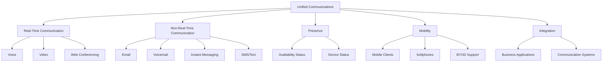

## 2. Core UC Components

### Voice over IP (VoIP)

VoIP converts analog voice signals into digital data packets that can be transmitted over IP networks.

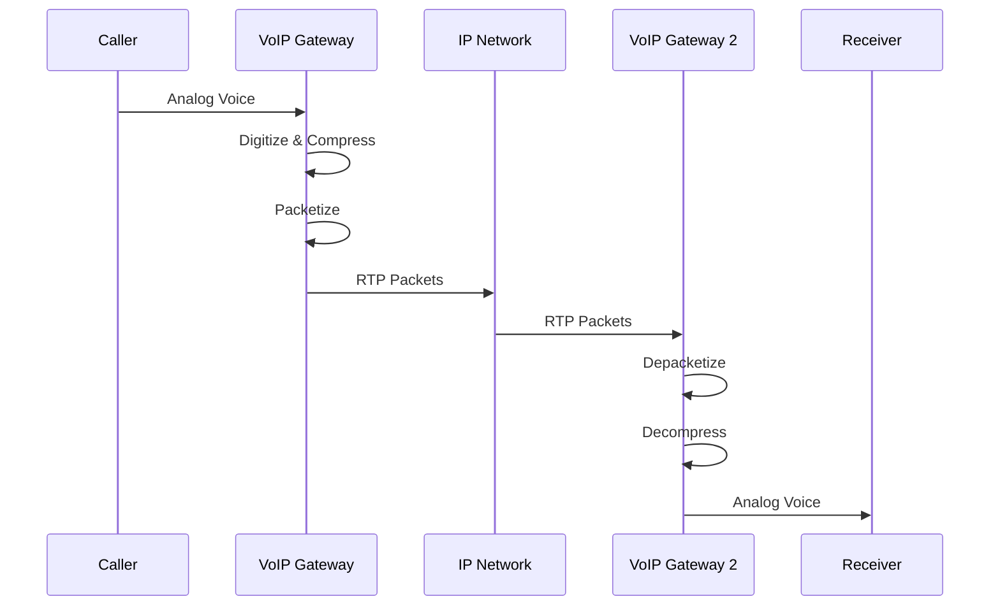

**VoIP Protocols:**

| Protocol | Description | Primary Function |
|----------|-------------|------------------|
| SIP (Session Initiation Protocol) | Text-based signaling protocol | Call setup, modification, and termination |
| H.323 | ITU standard for multimedia communications | Call signaling and control (legacy) |
| RTP (Real-time Transport Protocol) | Media delivery protocol | Transport of audio/video streams |
| RTCP (RTP Control Protocol) | Companion to RTP | QoS monitoring and statistics |
| SRTP (Secure RTP) | Secure version of RTP | Encrypted media transport |

**SIP Call Flow Example:**

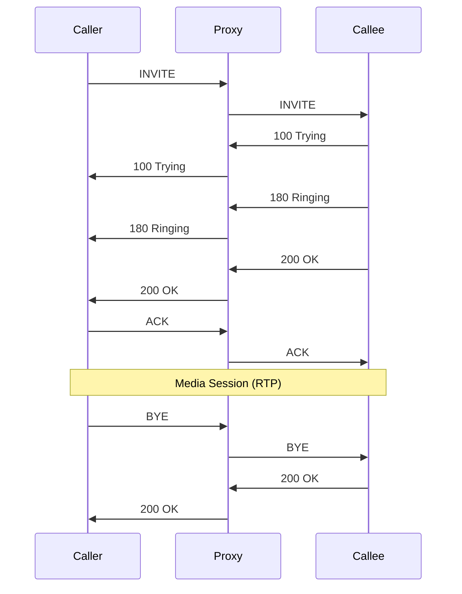

### Video Conferencing

Video conferencing enables real-time visual communication between two or more participants.

**Video Conference Components:**
- Cameras and microphones
- Codec (coder/decoder) for compression/decompression
- Display devices
- Conferencing platform (hardware or software-based)
- Network connectivity

**Video Standards:**
- H.264/AVC
- H.265/HEVC
- VP8/VP9
- AV1

### Instant Messaging and Presence

Instant Messaging (IM) provides real-time text-based communication, while Presence shows a user's availability and status.

**IM and Presence Protocols:**
- XMPP (Extensible Messaging and Presence Protocol)
- SIMPLE (SIP for Instant Messaging and Presence Leveraging Extensions)
- Proprietary protocols (Microsoft Teams, Slack, etc.)

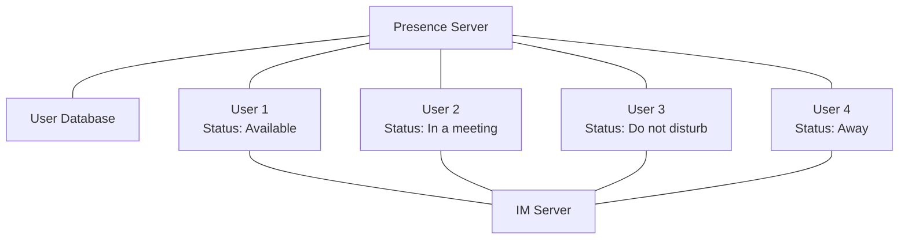

## 3. UC Infrastructure Components

### IP PBX Systems

An IP PBX (Private Branch Exchange) is the central component of a VoIP system, handling call routing, features, and management.

**Key IP PBX Functions:**
- Call control and routing
- Feature provisioning (transfer, conferencing, etc.)
- User/extension management
- Voicemail integration
- Directory services
- Call detail recording (CDR)

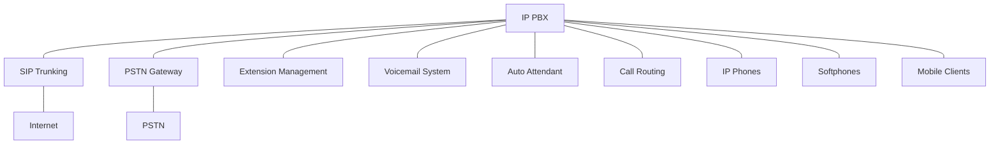

**Popular IP PBX Solutions:**
- Cisco Unified Communications Manager
- Avaya IP Office
- Microsoft Teams Phone System
- Asterisk (open-source)
- FreePBX (open-source)
- 3CX

### Session Border Controllers (SBC)

SBCs secure the border between different IP networks while facilitating SIP-based communications.

**SBC Functions:**
- Security (firewall, access control)
- NAT traversal
- Protocol interworking
- Media handling and transcoding
- Quality of Service (QoS)
- Call admission control

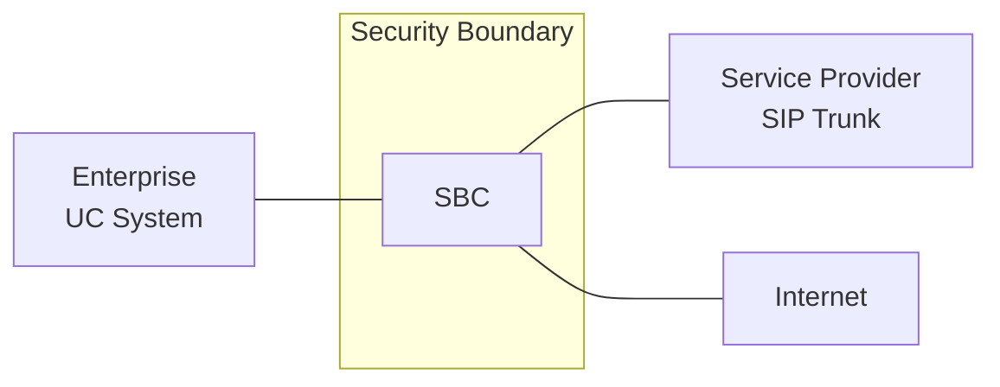

### Media Gateways

Media gateways connect traditional telephony systems (PSTN, PRI, analog) to IP-based networks.

**Types of Media Gateways:**
- Analog gateways (FXS/FXO)
- Digital gateways (PRI/BRI)
- Mobile gateways

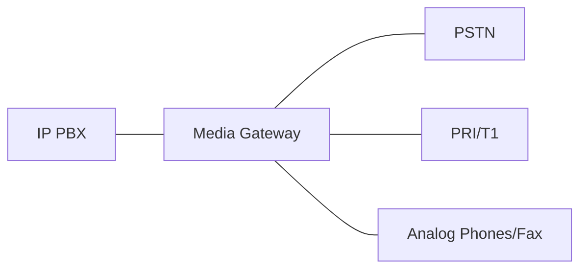

## 4. UC Deployment Models

### On-Premises UC

The organization owns and manages all UC infrastructure components on their premises.

**Characteristics:**
- Capital expenditure (CAPEX) model
- Full control over infrastructure
- Responsibility for maintenance and upgrades
- Typically more customizable
- Higher initial costs

### Cloud-Based UC (UCaaS)

Unified Communications as a Service (UCaaS) delivers UC applications and services from the cloud.

**Characteristics:**
- Operational expenditure (OPEX) model
- Reduced management overhead
- Automatic updates and maintenance
- Scalability and flexibility
- Subscription-based pricing

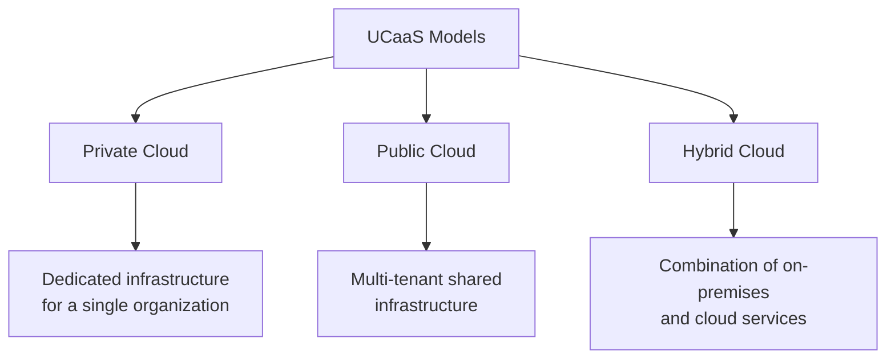

**Popular UCaaS Providers:**
- Microsoft Teams
- Zoom
- Cisco Webex
- RingCentral
- 8x8
- Vonage

### Hybrid UC

Hybrid UC combines on-premises and cloud-based components to leverage the benefits of both approaches.

**Use Cases:**
- Gradual migration to cloud
- Regulatory compliance requirements
- Maintaining legacy investments
- Geographic distribution needs

## 5. UC Network Considerations

### Quality of Service (QoS)

QoS is essential for real-time communications to ensure voice and video quality.

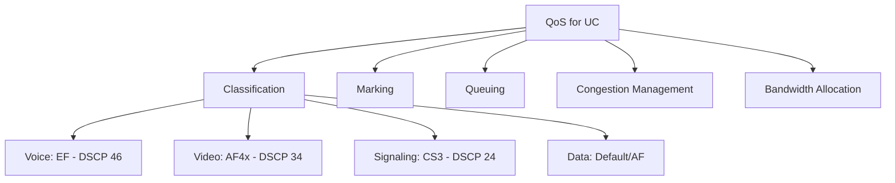

**QoS Best Practices:**
- Classify and mark traffic as close to the source as possible
- Provide adequate bandwidth for real-time traffic
- Prioritize voice over video over data
- Keep end-to-end latency under 150ms for voice
- Minimize jitter (variation in latency) to under 30ms
- Keep packet loss below 1%

### Bandwidth Requirements

Different UC applications have varying bandwidth requirements:

**Voice Call Bandwidth:**
- G.711 codec: ~87 Kbps per call (with headers)
- G.729 codec: ~32 Kbps per call (with headers)
- Opus codec: 8-64 Kbps per call (variable)

**Video Call Bandwidth:**
- SD video (480p): 400-1000 Kbps
- HD video (720p): 1.2-2.5 Mbps
- Full HD video (1080p): 3-6 Mbps
- 4K video: 13-25 Mbps

### Network Readiness Assessment

Before implementing UC, conduct a network readiness assessment to ensure the infrastructure can support real-time communications.

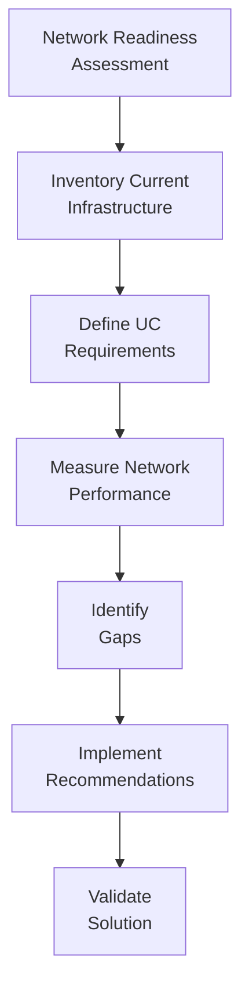

**Assessment Components:**
- Bandwidth availability and utilization
- Latency, jitter, and packet loss measurements
- WAN link quality
- Network device capabilities (QoS support)
- Power and cooling requirements (for PoE devices)
- Security implications

## 6. UC Security Considerations

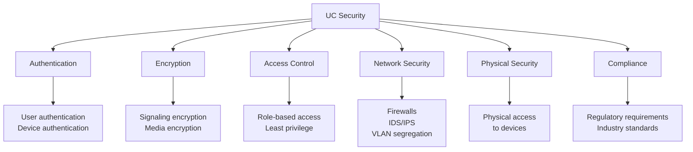

**Common UC Security Threats:**
- Toll fraud
- Eavesdropping on calls
- Man-in-the-middle attacks
- Denial of Service (DoS)
- Vishing (voice phishing)
- Account hijacking
- Social engineering

**Security Best Practices:**
- Implement strong authentication
- Encrypt signaling (TLS) and media (SRTP)
- Secure the network perimeter with SBCs
- Regularly update and patch UC systems
- Monitor for unusual calling patterns
- Implement VLANs to segregate voice traffic
- Develop and enforce security policies

## 7. UC Integration with Business Applications

UC can integrate with business applications to enhance productivity and streamline workflows.

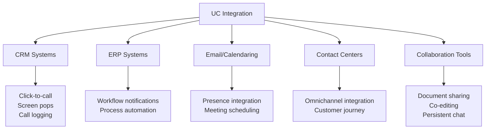

**Integration Methods:**
- APIs (Application Programming Interfaces)
- SDKs (Software Development Kits)
- Webhooks
- Pre-built connectors/plugins
- Custom middleware

**Benefits of Integration:**
- Reduced context switching
- Improved customer service
- Faster decision making
- Streamlined workflows
- Enhanced collaboration

## 8. UC and Mobile Integration

Mobile integration extends UC capabilities to smartphones and tablets, enabling users to work from anywhere.

**Mobile UC Features:**
- Single number reach (SNR)
- Mobile VoIP clients
- Presence on mobile devices
- Secure messaging
- Video conferencing
- Screen sharing
- File sharing

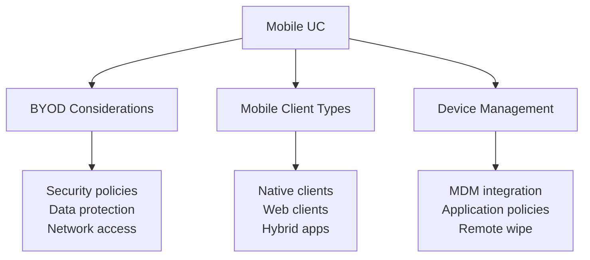

## Additional Resources

- [Cisco Unified Communications](https://www.cisco.com/c/en/us/solutions/collaboration/index.html)
- [Microsoft Teams Documentation](https://docs.microsoft.com/en-us/microsoftteams/)
- [SIP RFC 3261](https://tools.ietf.org/html/rfc3261)
- [RTP RFC 3550](https://tools.ietf.org/html/rfc3550)
- [WebRTC Standard](https://webrtc.org/)

## Practice Questions

1. Describe the key components of a Unified Communications system and how they interact with each other.

2. A company is planning to migrate from a traditional PBX to a VoIP solution. What network considerations should they address before implementation?

3. Compare and contrast on-premises UC, cloud-based UC, and hybrid UC deployment models. What factors would influence an organization's choice between these options?

4. Explain the role of QoS in Unified Communications and provide examples of how to implement QoS for voice, video, and signaling traffic.

5. Your company wants to integrate their UC system with their CRM application. Describe the potential benefits and outline the steps to implement this integration.
