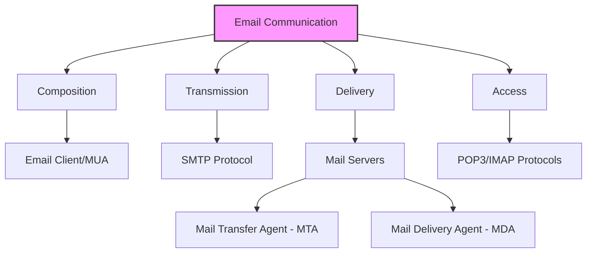
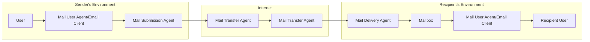
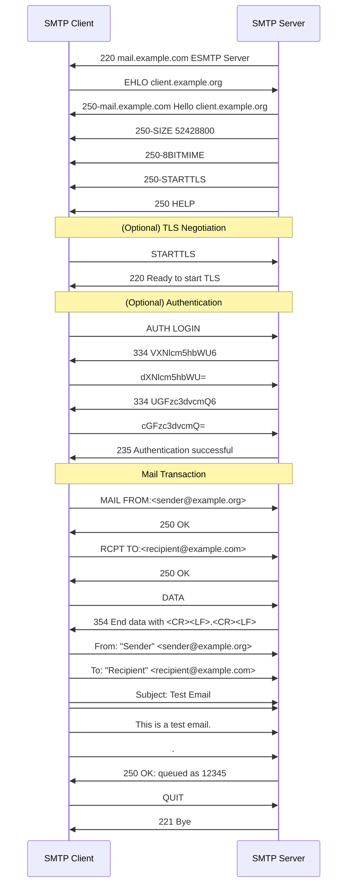
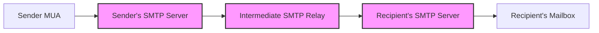
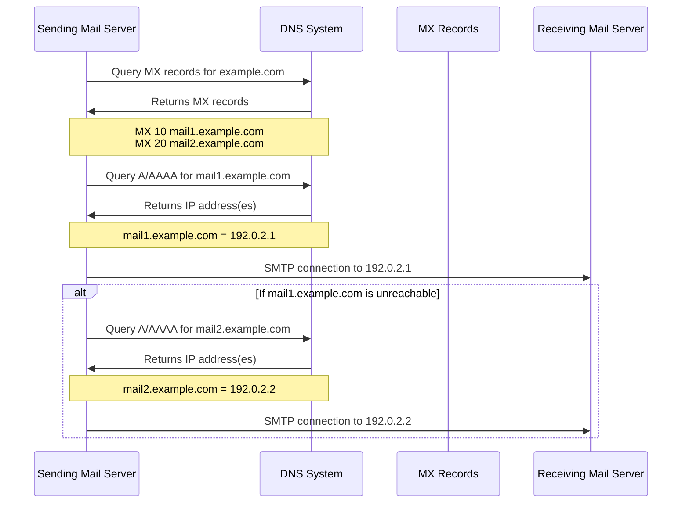
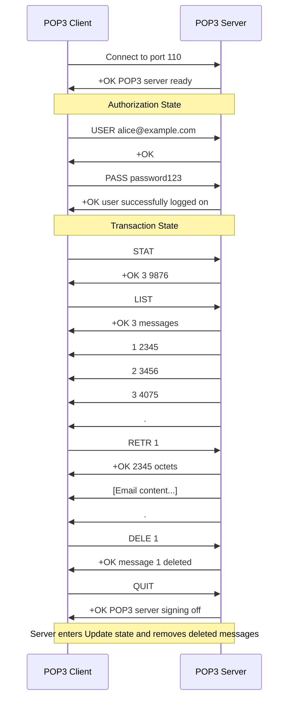
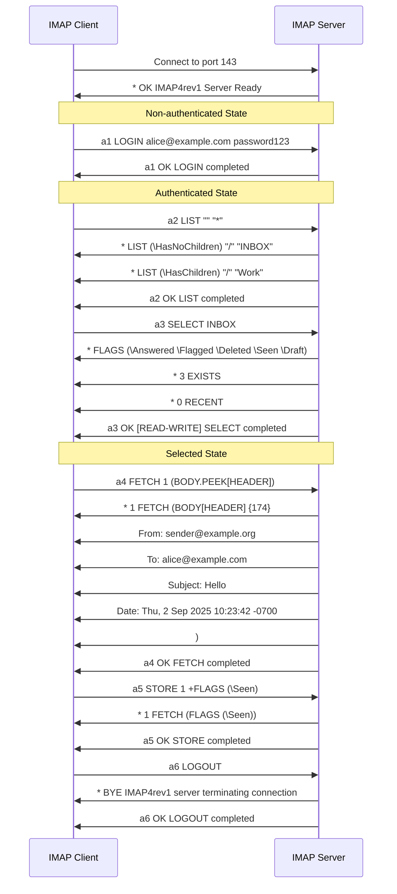
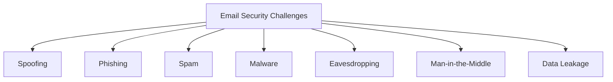
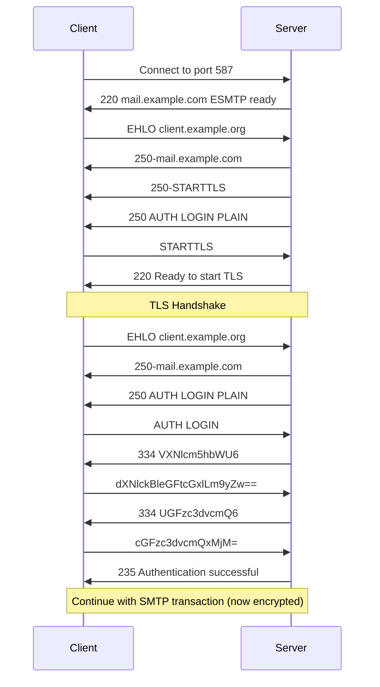
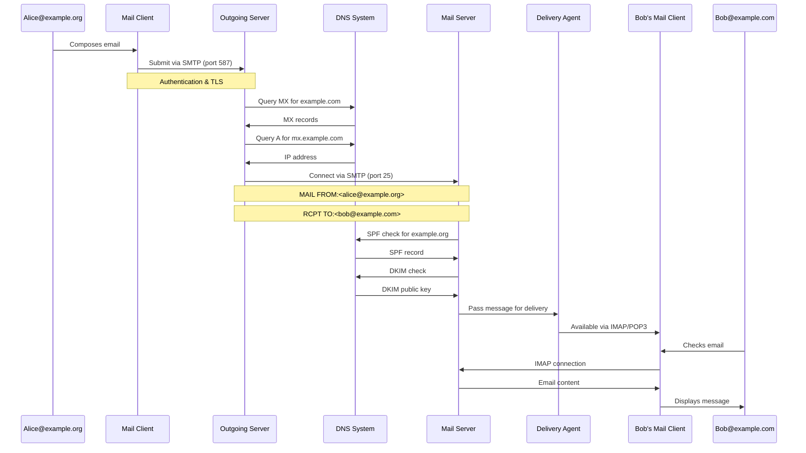

# Day 12: Email Communication Systems

<div align="center">

  
  <h1>📧 Email Systems & SMTP 📧</h1>
  
  <p>
    
    
    
    
  </p>
  
  <hr>
</div>

## Table of Contents
- [Introduction to Email Systems](#introduction-to-email-systems)
- [Email Architecture](#email-architecture)
- [SMTP: Simple Mail Transfer Protocol](#smtp-simple-mail-transfer-protocol)
- [MX Records and DNS in Email Routing](#mx-records-and-dns-in-email-routing)
- [POP3: Post Office Protocol](#pop3-post-office-protocol)
- [IMAP: Internet Message Access Protocol](#imap-internet-message-access-protocol)
- [MIME: Multipurpose Internet Mail Extensions](#mime-multipurpose-internet-mail-extensions)
- [Email Security and Authentication](#email-security-and-authentication)
- [Email Workflow: End-to-End Example](#email-workflow-end-to-end-example)
- [Modern Email Challenges](#modern-email-challenges)
- [Practice Questions](#practice-questions)
- [Additional Resources](#additional-resources)

## Introduction to Email Systems

Email (Electronic Mail) is one of the oldest and most widely used applications on the Internet. It allows users to send and receive messages containing text, images, and other attachments across computer networks. Despite being developed in the early 1970s, email remains a critical communication tool today.



### Key Characteristics of Email

- **Asynchronous Communication**: Sender and receiver don't need to be online simultaneously
- **Store-and-Forward Model**: Messages are stored on servers until delivery is possible
- **Platform Independence**: Works across different devices, operating systems, and applications
- **Structured Format**: Standard format for headers, body, and attachments
- **Globally Addressable**: Each recipient has a unique address (user@domain.com)
- **Resilient Delivery**: Multiple delivery attempts if initial delivery fails

### Brief History of Email

| Year | Development |
|------|-------------|
| 1971 | Ray Tomlinson sends the first email between separate computers |
| 1972 | @ symbol chosen for separating user from host in email addresses |
| 1973 | SMTP's predecessor, FTP mail, is developed |
| 1977 | Standards for email format are proposed |
| 1982 | SMTP is defined in RFC 821 |
| 1988 | MIME extensions allow non-text attachments |
| 1991 | POP3 standardized for email retrieval |
| 1996 | IMAP4 finalized, offering more advanced mailbox management |
| 2000s | Webmail services become dominant |
| 2010s+ | Mobile email clients and anti-spam/security measures evolve |

## Email Architecture

Email systems are built on a distributed architecture with multiple components working together to ensure reliable message delivery.

### Key Components



#### Mail User Agent (MUA)
- The email client software used by end-users (Outlook, Gmail, Apple Mail, etc.)
- Responsible for composing, reading, and managing emails
- Communicates with mail servers using protocols like SMTP, POP3, or IMAP

#### Mail Submission Agent (MSA)
- Accepts emails from MUAs and performs initial processing
- Often integrated with the Mail Transfer Agent
- Applies outbound policies (size limits, spam checks, authentication)
- Typically runs on port 587 for secure submission

#### Mail Transfer Agent (MTA)
- Routes emails between servers across the Internet
- Implements SMTP protocol for server-to-server communication
- Handles message queuing, retry logic, and routing decisions
- Examples: Postfix, Sendmail, Microsoft Exchange, Exim

#### Mail Delivery Agent (MDA)
- Delivers messages to the recipient's mailbox
- Applies filters, sorts messages, and may perform virus scanning
- Often integrated with the MTA but conceptually separate
- Examples: Procmail, Dovecot LDA, Maildrop

#### Mail Retrieval Agents
- Allows users to access messages from their mailboxes
- Implements POP3 or IMAP protocols
- Often integrated with the mail server software

### Mail Server Types

| Server Type | Function | Common Software |
|-------------|----------|----------------|
| SMTP Server | Sending and relaying messages | Postfix, Sendmail, Exchange |
| POP3 Server | Basic mailbox retrieval | Dovecot, Courier, Exchange |
| IMAP Server | Advanced mailbox management | Dovecot, Cyrus, Exchange |
| Webmail Server | Web-based email access | Roundcube, Squirrelmail, Gmail |
| Gateway Server | Email filtering, security | Barracuda, Proofpoint, Mimecast |

## SMTP: Simple Mail Transfer Protocol

SMTP (Simple Mail Transfer Protocol) is the standard protocol for email transmission between servers on the Internet. It's defined in RFC 5321 and operates as a text-based, client-server protocol.

### SMTP Basics

- **Primary Purpose**: Reliable and efficient mail transfer
- **Port Numbers**: 25 (standard), 587 (submission), 465 (secure SMTP)
- **Connection Type**: Typically TCP-based
- **Communication Style**: Command-response exchanges in ASCII text
- **State Model**: Progression through multiple states (greeting, authentication, transaction, etc.)

### SMTP Communication Flow



### SMTP Commands

| Command | Description | Example |
|---------|-------------|---------|
| EHLO/HELO | Identifies client to server | `EHLO mail.example.org` |
| MAIL FROM | Specifies sender address | `MAIL FROM:<john@example.org>` |
| RCPT TO | Specifies recipient address | `RCPT TO:<jane@example.com>` |
| DATA | Begins message content transfer | `DATA` |
| RSET | Resets the session | `RSET` |
| VRFY | Verifies a username | `VRFY john` |
| EXPN | Expands a mailing list | `EXPN admins` |
| HELP | Gets help on commands | `HELP` |
| NOOP | No operation (keep-alive) | `NOOP` |
| QUIT | Ends session | `QUIT` |
| STARTTLS | Initiates secure connection | `STARTTLS` |
| AUTH | Authenticates client | `AUTH LOGIN` |

### SMTP Response Codes

| Code Class | Meaning | Examples |
|------------|---------|----------|
| 2xx | Success | 250 OK, 220 Service ready |
| 3xx | More information needed | 354 Start mail input |
| 4xx | Temporary failure | 450 Mailbox busy |
| 5xx | Permanent failure | 550 Mailbox not found |

#### Common Response Codes

| Code | Meaning |
|------|---------|
| 220 | Service ready |
| 221 | Service closing transmission channel |
| 250 | Requested mail action OK, completed |
| 354 | Start mail input; end with <CRLF>.<CRLF> |
| 421 | Service not available, closing transmission |
| 450 | Requested mail action not taken: mailbox unavailable |
| 451 | Requested action aborted: error in processing |
| 452 | Requested action not taken: insufficient system storage |
| 500 | Syntax error, command unrecognized |
| 501 | Syntax error in parameters or arguments |
| 502 | Command not implemented |
| 503 | Bad sequence of commands |
| 550 | Requested action not taken: mailbox unavailable |
| 551 | User not local; please try <forward-path> |
| 552 | Requested mail action aborted: exceeded storage allocation |
| 553 | Requested action not taken: mailbox name not allowed |
| 554 | Transaction failed |

### SMTP Extensions (ESMTP)

SMTP has been extended with ESMTP (Extended SMTP) capabilities to overcome limitations in the original protocol:

| Extension | Purpose | Description |
|-----------|---------|-------------|
| SIZE | Message size declaration | Allows client to declare message size |
| 8BITMIME | 8-bit MIME transport | Enables transmission of 8-bit content without encoding |
| STARTTLS | Transport Layer Security | Allows upgrading connection to encrypted TLS |
| AUTH | Authentication | Provides mechanisms for client authentication |
| PIPELINING | Command pipelining | Allows sending multiple commands without waiting for responses |
| CHUNKING | Chunked transfer | Enables sending message in chunks |
| DSN | Delivery Status Notifications | Provides standardized delivery notifications |
| SMTPUTF8 | UTF-8 support | Allows UTF-8 characters in email addresses |

### Example SMTP Session (Raw)

```
S: 220 mail.example.com ESMTP Postfix
C: EHLO client.example.org
S: 250-mail.example.com
S: 250-PIPELINING
S: 250-SIZE 10240000
S: 250-STARTTLS
S: 250 8BITMIME
C: MAIL FROM:<sender@example.org>
S: 250 OK
C: RCPT TO:<recipient@example.com>
S: 250 OK
C: DATA
S: 354 End data with <CR><LF>.<CR><LF>
C: From: "Sender Name" <sender@example.org>
C: To: "Recipient Name" <recipient@example.com>
C: Subject: Hello World
C: Date: Thu, 2 Sep 2025 15:32:00 -0400
C: 
C: This is a test message.
C: .
S: 250 OK: queued as 12345
C: QUIT
S: 221 Bye
```

### SMTP Relay Operation



SMTP servers can act as relays, accepting mail from one server and forwarding it to another. This is how email traverses multiple systems across the Internet:

1. **Direct Delivery**: If possible, sender's server delivers directly to recipient's server
2. **Smart Host Relay**: Small organizations often relay through ISP's SMTP server
3. **Mail Gateway Relay**: Messages may pass through security gateways or filters
4. **Geographic Relay**: Large organizations may use regional relay servers

### SMTP Port Usage

| Port | Usage | Security |
|------|-------|----------|
| 25 | Standard SMTP port for server-to-server communication | Typically unencrypted but can use STARTTLS |
| 587 | Mail submission port for clients sending to their servers | Typically uses STARTTLS for encryption |
| 465 | Secure SMTP port using implicit SSL/TLS | Encrypted from connection start |

### SMTP Limitations

1. **Limited to ASCII**: Originally only supported 7-bit ASCII characters
2. **No Delivery Confirmation**: Basic SMTP doesn't confirm message was read
3. **No Authentication**: Original SMTP had no built-in authentication
4. **No Encryption**: Base protocol sends data in clear text
5. **Susceptible to Abuse**: Can be exploited for spam and spoofing

## MX Records and DNS in Email Routing

MX (Mail Exchange) records are a type of DNS record that specifies which mail servers are responsible for accepting email messages on behalf of a domain. They are crucial for proper email routing.

### MX Record Basics

- **Purpose**: Direct email to the correct mail servers for a domain
- **Priority**: Lower numerical preference value indicates higher priority
- **Redundancy**: Multiple MX records provide fallback options
- **Format**: Contains a preference value and a mail server hostname

### MX Record Lookup Process



### Example MX Record Configuration

```
example.com.    IN    MX    10    mail1.example.com.
example.com.    IN    MX    20    mail2.example.com.
example.com.    IN    MX    30    backup.example.com.
```

When sending an email to user@example.com, the sending mail server will:
1. Query DNS for MX records of example.com
2. Try to connect to the server with the lowest preference value (mail1.example.com)
3. If that fails, try the next server in order of preference

### Example MX Records Lookup (nslookup)

As shown in your command examples:

```bash
$ nslookup -type=MX google.com
Server:         127.0.0.53
Address:        127.0.0.53#53

Non-authoritative answer:
google.com      mail exchanger = 10 smtp.google.com.

Authoritative answers can be found from:
smtp.google.com internet address = 142.251.10.26
smtp.google.com has AAAA address 2404:6800:4003:c0f::1a
smtp.google.com internet address = 64.233.170.26
smtp.google.com internet address = 142.251.12.27
smtp.google.com has AAAA address 2404:6800:4003:c1a::1a
smtp.google.com internet address = 64.233.170.27
smtp.google.com has AAAA address 2404:6800:4003:c11::1b
smtp.google.com internet address = 142.251.12.26
smtp.google.com has AAAA address 2404:6800:4003:c11::1a
```

```bash
$ nslookup -type=MX gmail.com
Server:         127.0.0.53
Address:        127.0.0.53#53

Non-authoritative answer:
gmail.com       mail exchanger = 5 gmail-smtp-in.l.google.com.
gmail.com       mail exchanger = 20 alt2.gmail-smtp-in.l.google.com.
gmail.com       mail exchanger = 30 alt3.gmail-smtp-in.l.google.com.
gmail.com       mail exchanger = 10 alt1.gmail-smtp-in.l.google.com.
gmail.com       mail exchanger = 40 alt4.gmail-smtp-in.l.google.com.

Authoritative answers can be found from:
```

In the gmail.com example, we can see:
- Multiple MX records with different priorities (5, 10, 20, 30, 40)
- Primary mail server (gmail-smtp-in.l.google.com) has the lowest preference value (5)
- Four backup mail servers in priority order

### Other DNS Records Important for Email

| Record Type | Purpose | Example |
|-------------|---------|---------|
| A/AAAA | Maps hostnames to IP addresses | `mail.example.com. IN A 192.0.2.1` |
| PTR | Reverse mapping (IP to hostname) | `1.2.0.192.in-addr.arpa. IN PTR mail.example.com.` |
| SPF | Specifies authorized sending servers | `example.com. IN TXT "v=spf1 mx a ip4:192.0.2.0/24 -all"` |
| DKIM | Email authentication for signatures | `selector._domainkey.example.com. IN TXT "v=DKIM1; k=rsa; p=MIGfMA0..."` |
| DMARC | Domain-based message authentication | `_dmarc.example.com. IN TXT "v=DMARC1; p=reject; rua=mailto:dmarc@example.com"` |

### Best Practices for MX Records

1. **Multiple MX Records**: Configure at least two MX records for redundancy
2. **Proper Prioritization**: Use appropriate preference values (lower = higher priority)
3. **Valid Hostnames**: Ensure MX records point to valid A/AAAA records
4. **Avoid Loops**: Don't create circular references between domains
5. **Consistent TTL Values**: Set appropriate Time-To-Live values for caching
6. **Consider Geographic Distribution**: For global organizations, distribute servers geographically
7. **No CNAME Records**: MX records should not point to CNAME records (RFC compliance)

## POP3: Post Office Protocol

POP3 (Post Office Protocol version 3) is a protocol used by email clients to retrieve messages from a mail server. It's designed for a "download and delete" model where messages are typically removed from the server after retrieval.

### POP3 Basics

- **Primary Purpose**: Download emails from server to client
- **Port Number**: 110 (standard), 995 (secure POP3S)
- **Connection Type**: TCP-based
- **State Model**: Authorization, Transaction, Update
- **Session Model**: Connect, retrieve, disconnect

### POP3 Communication Flow



### POP3 Commands

| Command | Description | Example |
|---------|-------------|---------|
| USER | Specifies username | `USER alice@example.com` |
| PASS | Provides password | `PASS secretpassword` |
| STAT | Gets mailbox status | `STAT` |
| LIST | Lists message numbers and sizes | `LIST` or `LIST 1` |
| RETR | Retrieves a message | `RETR 1` |
| DELE | Marks message for deletion | `DELE 1` |
| NOOP | No operation | `NOOP` |
| RSET | Resets session (undeletes) | `RSET` |
| TOP | Gets headers and some lines | `TOP 1 10` |
| UIDL | Gets unique message IDs | `UIDL` or `UIDL 1` |
| QUIT | Ends session | `QUIT` |

### Example POP3 Session

```
C: [Connects to port 110]
S: +OK POP3 server ready
C: USER bob@example.com
S: +OK
C: PASS mysecretpassword
S: +OK Logged in.
C: STAT
S: +OK 2 320
C: LIST
S: +OK 2 messages
S: 1 120
S: 2 200
S: .
C: RETR 1
S: +OK 120 octets
S: From: alice@example.org
S: To: bob@example.com
S: Subject: Hello
S: Date: Thu, 2 Sep 2025 14:00:00 -0400
S: 
S: Hi Bob,
S: This is a test message.
S: Regards,
S: Alice
S: .
C: DELE 1
S: +OK Message deleted
C: QUIT
S: +OK Bye
```

### POP3 Characteristics

#### Advantages
- Simple protocol, easy to implement
- Minimal server resource usage
- Works well with intermittent connections
- Complete download allows offline access
- Clear mailbox state management

#### Limitations
- Limited mailbox management capabilities
- Typically "download and delete" model
- No server-side message organization
- No partial message retrieval
- No synchronization between multiple clients
- Limited metadata support

### POP3 Usage Modes

1. **Download and Delete**: Traditional mode where messages are removed after download
2. **Download and Keep**: Messages remain on server after download
3. **Download Headers Only**: Using TOP command to preview messages before full download

## IMAP: Internet Message Access Protocol

IMAP (Internet Message Access Protocol) is a more advanced email retrieval protocol that allows users to manage their messages directly on the mail server. It's designed for multi-device access and synchronization.

### IMAP Basics

- **Primary Purpose**: Remote mailbox management
- **Port Number**: 143 (standard), 993 (secure IMAPS)
- **Connection Type**: TCP-based
- **State Model**: Non-authenticated, Authenticated, Selected, Logout
- **Session Model**: Connect, manage, disconnect (persistent connection)

### IMAP Communication Flow



### IMAP Commands

| Command | Description | Example |
|---------|-------------|---------|
| LOGIN | Authenticates user | `a1 LOGIN user@example.com password` |
| LIST | Lists mailboxes | `a2 LIST "" "*"` |
| SELECT | Selects a mailbox | `a3 SELECT INBOX` |
| EXAMINE | Read-only selection | `a3 EXAMINE INBOX` |
| CREATE | Creates a mailbox | `a4 CREATE "Work/Projects"` |
| DELETE | Deletes a mailbox | `a5 DELETE "Old Stuff"` |
| RENAME | Renames a mailbox | `a6 RENAME "Work" "Job"` |
| FETCH | Retrieves message data | `a7 FETCH 1:3 (FLAGS BODY[HEADER])` |
| STORE | Changes message flags | `a8 STORE 3 +FLAGS (\Seen)` |
| COPY | Copies messages | `a9 COPY 1:3 "Archive"` |
| APPEND | Adds message to mailbox | `a10 APPEND "Sent" (\Seen) {310}` |
| SEARCH | Searches for messages | `a11 SEARCH NEW` |
| EXPUNGE | Removes deleted messages | `a12 EXPUNGE` |
| CLOSE | Closes selected mailbox | `a13 CLOSE` |
| LOGOUT | Ends session | `a14 LOGOUT` |

### Example IMAP Session

```
C: [Connects to port 143]
S: * OK IMAP4rev1 server ready
C: a1 LOGIN user@example.com password
S: a1 OK LOGIN completed
C: a2 LIST "" "*"
S: * LIST (\HasNoChildren) "/" "INBOX"
S: * LIST (\HasNoChildren) "/" "Sent"
S: * LIST (\HasNoChildren) "/" "Drafts"
S: a2 OK LIST completed
C: a3 SELECT INBOX
S: * FLAGS (\Answered \Flagged \Deleted \Seen \Draft)
S: * 3 EXISTS
S: * 0 RECENT
S: * OK [UNSEEN 1]
S: * OK [UIDVALIDITY 1256789012]
S: a3 OK [READ-WRITE] SELECT completed
C: a4 FETCH 1 (FLAGS BODY[HEADER.FIELDS (FROM SUBJECT)])
S: * 1 FETCH (FLAGS (\Seen) BODY[HEADER.FIELDS (FROM SUBJECT)] {57}
S: From: sender@example.org
S: Subject: Meeting tomorrow
S: 
S: )
S: a4 OK FETCH completed
C: a5 LOGOUT
S: * BYE IMAP4rev1 server terminating connection
S: a5 OK LOGOUT completed
```

### IMAP Characteristics

#### Advantages
- Server-side message management
- Folder/mailbox organization
- Flag support (read, answered, important, etc.)
- Partial message retrieval
- Multiple client synchronization
- Efficient bandwidth usage
- Search capabilities on server

#### Limitations
- More complex to implement
- Higher server resource usage
- Requires continuous connection for best experience
- More server-side storage required

### IMAP vs. POP3 Comparison

| Feature | IMAP | POP3 |
|---------|------|------|
| Purpose | Manage mail on server | Download mail to client |
| Server Storage | Messages remain on server | Typically removed after download |
| Multiple Devices | Synchronized access | Independent access |
| Folder Support | Rich folder management | No folder management |
| Flags/States | Tracks message states | Limited state tracking |
| Connection | Continuous connection typical | Connect, download, disconnect |
| Bandwidth Usage | Efficient (retrieves only needed parts) | Downloads entire messages |
| Server Resources | Higher requirements | Lower requirements |
| Offline Access | Limited without special features | Complete once downloaded |
| Complexity | More complex | Simpler |

## MIME: Multipurpose Internet Mail Extensions

MIME (Multipurpose Internet Mail Extensions) is a standard that extends the format of email to support:
- Text in character sets other than ASCII
- Non-text attachments (images, audio, video, etc.)
- Message bodies with multiple parts
- Header information in non-ASCII character sets

### MIME Basics

- **Purpose**: Extend email beyond plain 7-bit ASCII text
- **RFC Standards**: 2045-2049, later expanded
- **Implementation**: Through email headers and body formatting
- **Content Description**: MIME-Version and Content-* headers
- **Encoding Methods**: Base64, Quoted-Printable, etc.

### MIME Headers

| Header | Purpose | Example |
|--------|---------|---------|
| MIME-Version | Declares MIME standard use | `MIME-Version: 1.0` |
| Content-Type | Specifies media type | `Content-Type: text/plain; charset=utf-8` |
| Content-Transfer-Encoding | Encoding method | `Content-Transfer-Encoding: base64` |
| Content-Disposition | How to present content | `Content-Disposition: attachment; filename="file.pdf"` |
| Content-ID | Identifier for content part | `Content-ID: <image1@example.com>` |

### Common MIME Media Types

| Category | MIME Type | Description |
|----------|-----------|-------------|
| Text | text/plain | Plain text |
| Text | text/html | HTML-formatted text |
| Image | image/jpeg | JPEG image |
| Image | image/png | PNG image |
| Audio | audio/mpeg | MP3 audio |
| Video | video/mp4 | MP4 video |
| Application | application/pdf | PDF document |
| Application | application/json | JSON data |
| Application | application/zip | ZIP archive |
| Multipart | multipart/mixed | Multiple parts with different types |
| Multipart | multipart/alternative | Same content in different formats |
| Multipart | multipart/related | Related parts (e.g., HTML with images) |
| Multipart | multipart/form-data | Form data submission |

### MIME Encoding Methods

To ensure reliable transmission over systems that might only support 7-bit ASCII, MIME provides several encoding methods:

| Encoding | Description | Use Case |
|----------|-------------|----------|
| 7bit | ASCII data with lines < 1000 chars | Plain English text |
| 8bit | 8-bit data with lines < 1000 chars | European language text |
| binary | 8-bit data without line length restrictions | Not widely supported in email |
| quoted-printable | Encodes with printable ASCII | Text with occasional non-ASCII |
| base64 | Binary data encoded as ASCII text | Binary files, images, etc. |

### Multipart MIME Example

```
MIME-Version: 1.0
From: sender@example.org
To: recipient@example.com
Subject: Multipart message example
Content-Type: multipart/mixed; boundary="boundary-string"

--boundary-string
Content-Type: text/plain; charset=utf-8
Content-Transfer-Encoding: quoted-printable

Hello,
This is a sample message with attachments.
The snowman symbol: ☃ is encoded in quoted-printable.

--boundary-string
Content-Type: text/html; charset=utf-8
Content-Transfer-Encoding: quoted-printable

<html>
<body>
<p>Hello,</p>
<p>This is a sample message with <b>attachments</b>.</p>
<p>The snowman symbol: ☃ is encoded in quoted-printable.</p>
</body>
</html>

--boundary-string
Content-Type: application/pdf
Content-Transfer-Encoding: base64
Content-Disposition: attachment; filename="document.pdf"

JVBERi0xLjUKJcOkw7zDtsOfCjIgMCBvYmoKPDwvTGVuZ3RoIDMgMCBSL0ZpbHRlci9GbGF0ZURl
Y29kZT4+CnN0cmVhbQp4nDPSM1Qo5ypUMFAw0DMwslAwtTTVMzI3VbAwMdSzMDNUKEpVCC5JLCpR
CKksSCxKTQYyfF1dXB0VQjJzUxUSUytKUvNS4gtSixLzShSCMxJLUiG8SGdhZp5CeWZeWWZKqkJK
YklmfgpQLcQQJF+FXHO4XEBqUX5RCVCwxEhPITw/KU8hKF1PwchUj6sAyC4GAI7lLn4KZW5kc3Ry
ZWFtCmVuZG9iagoKMyAwIG9iagoxNTcKZW5kb2JqCgo1IDAgb2JqCjw8L0xlbmd0aCA2IDAgUi9G
aWx0ZXIvRmxhdGVEZWNvZGUvTGVuZ3RoMSAyMzYwMD4+CnN0cmVhbQp4nOydCXxU1dn/n+feO9tk

--boundary-string--
```

### MIME and Email Clients

Modern email clients handle MIME transparently:
1. **Composition**: When adding attachments, the client constructs a multipart MIME message
2. **Encoding**: Binary files are automatically encoded (typically base64)
3. **Display**: When receiving, MIME parts are interpreted and rendered appropriately
4. **Attachments**: Identified via Content-Disposition headers and made available to save

## Email Security and Authentication

Email was originally designed without strong security measures. Modern extensions provide authentication, integrity, and confidentiality.

### Email Security Challenges



1. **Spoofing**: Forging the sender's address to appear as someone else
2. **Lack of Authentication**: Original SMTP doesn't verify sender identity
3. **Plaintext Transmission**: Emails can be intercepted and read
4. **No Integrity Protection**: Messages can be modified in transit
5. **Attachment Risks**: Malware can be distributed via attachments
6. **Header Exposure**: Metadata reveals communication patterns

### Email Authentication Standards

#### SPF (Sender Policy Framework)

SPF allows domain owners to specify which servers are authorized to send email on behalf of their domain.

```
example.com. IN TXT "v=spf1 mx a ip4:192.0.2.0/24 -all"
```

- **Mechanism**: DNS TXT record
- **Verification**: Receiving server checks if sending IP is authorized
- **Limitation**: Only checks MAIL FROM domain, not From: header
- **Result Options**: Pass, Fail, SoftFail, Neutral, None, PermError, TempError

#### DKIM (DomainKeys Identified Mail)

DKIM adds a digital signature to emails that can be validated against a public key published in DNS.

```
selector._domainkey.example.com. IN TXT "v=DKIM1; k=rsa; p=MIGfMA0GCSqGSIb3DQEBAQUAA4GNADCBiQKBgQC..."
```

- **Mechanism**: Cryptographic signing of headers and body
- **Verification**: Signature verified using public key from DNS
- **Advantage**: Detects message tampering and confirms sender domain
- **Components**: Signature in header, public key in DNS

#### DMARC (Domain-based Message Authentication, Reporting & Conformance)

DMARC builds on SPF and DKIM to provide domain-level policy enforcement and reporting.

```
_dmarc.example.com. IN TXT "v=DMARC1; p=reject; pct=100; rua=mailto:dmarc-reports@example.com"
```

- **Mechanism**: DNS TXT record with policy instructions
- **Function**: Tells receivers what to do with messages that fail authentication
- **Policy Options**: none (monitor), quarantine (mark as suspicious), reject (block)
- **Reporting**: Aggregate and forensic feedback to domain owners

### Email Encryption Methods

#### Transport Layer Encryption

- **STARTTLS**: Opportunistic encryption for SMTP connections
- **SSL/TLS**: Implicit encryption on dedicated ports (465, 993, 995)
- **Protection Level**: Encrypts server-to-server transmission
- **Limitation**: Only protects during transit, not storage

#### End-to-End Encryption

- **S/MIME (Secure/Multipurpose Internet Mail Extensions)**
  - Uses X.509 certificates for encryption and signing
  - Widely supported in enterprise email clients
  - Requires certificate management infrastructure

- **PGP (Pretty Good Privacy) / OpenPGP**
  - Public key cryptography for encryption and signing
  - Web of trust model rather than centralized certificates
  - Available as plugins for many email clients

- **End-to-End Advantages**
  - Messages encrypted on sender's device, decrypted on recipient's
  - Protected during transmission AND storage
  - Cannot be read by intermediary servers or providers

### Email Gateway Security

Enterprise email security often employs gateway solutions:

| Feature | Description |
|---------|-------------|
| Anti-Spam | Filters unwanted bulk messages |
| Anti-Virus | Scans for malware in messages and attachments |
| Anti-Phishing | Detects fraudulent messages |
| Content Filtering | Blocks inappropriate content |
| Data Loss Prevention | Prevents sensitive information leakage |
| Encryption Gateway | Enforces encryption policies |
| Archiving | Preserves messages for compliance |

### SMTP Over TLS Example



## Email Workflow: End-to-End Example

Let's trace a complete email journey from sender to recipient:



### Stage 1: Message Composition and Submission

1. **Composition**: User composes message in MUA (Mail User Agent/client)
   - Headers are created (From, To, Subject, Date, etc.)
   - Body is formatted (plain text, HTML, or both)
   - Attachments are encoded (Base64) and added as MIME parts

2. **Submission**: MUA connects to MSA (Mail Submission Agent)
   - Typically connects to port 587 with STARTTLS
   - Authenticates with username/password
   - Submits message using SMTP commands

### Stage 2: Mail Routing and Delivery

3. **DNS Lookup**: MSA/MTA looks up recipient domain's MX records
   - Determines which mail servers accept email for the domain
   - Resolves MX hostname to IP address

4. **SMTP Transfer**: Sending MTA connects to receiving MTA
   - Establishes SMTP connection to highest priority MX server
   - Initiates SMTP session (EHLO, MAIL FROM, RCPT TO, DATA)
   - Transfers the complete message

5. **Authentication Checks**: Receiving MTA verifies message authenticity
   - Checks SPF record to verify sending IP is authorized
   - Verifies DKIM signature if present
   - Applies DMARC policy based on authentication results
   - Performs spam filtering and malware scanning

6. **Local Delivery**: MDA (Mail Delivery Agent) processes the message
   - Applies user-specific filters or rules
   - Stores message in recipient's mailbox
   - Might send notifications to recipient

### Stage 3: Message Retrieval

7. **Retrieval**: Recipient accesses the message
   - Via POP3: Downloads messages to local client
   - Via IMAP: Views and manages messages on server
   - Via Webmail: Accesses through web interface

8. **Display**: MUA renders the message
   - Interprets MIME structure
   - Renders HTML content if present
   - Shows attachments
   - Verifies signatures if using S/MIME or PGP

### Example End-to-End Email (Technical View)

```
1. Alice composes email to bob@example.com in her mail client

2. Mail client connects to smtp.example.org:587
   C: EHLO alices-laptop.local
   S: 250-smtp.example.org
   S: 250-STARTTLS
   S: 250-AUTH LOGIN PLAIN
   S: 250 SMTPUTF8

3. TLS negotiation occurs

4. Authentication happens
   C: AUTH LOGIN
   S: 334 VXNlcm5hbWU6
   C: YWxpY2VAZXhhbXBsZS5vcmc= (alice@example.org base64 encoded)
   S: 334 UGFzc3dvcmQ6
   C: cGFzc3dvcmQxMjM= (password123 base64 encoded)
   S: 235 Authentication successful

5. Message submission
   C: MAIL FROM:<alice@example.org>
   S: 250 OK
   C: RCPT TO:<bob@example.com>
   S: 250 OK
   C: DATA
   S: 354 Start mail input; end with <CRLF>.<CRLF>
   C: From: "Alice Smith" <alice@example.org>
   C: To: "Bob Jones" <bob@example.com>
   C: Subject: Meeting Tomorrow
   C: MIME-Version: 1.0
   C: Content-Type: multipart/mixed; boundary="boundary-string"
   C: 
   C: --boundary-string
   C: Content-Type: text/plain; charset=utf-8
   C: 
   C: Hi Bob,
   C: Can we meet tomorrow at 2pm to discuss the project?
   C: 
   C: Regards,
   C: Alice
   C: --boundary-string
   C: Content-Type: application/pdf
   C: Content-Disposition: attachment; filename="agenda.pdf"
   C: Content-Transfer-Encoding: base64
   C: 
   C: JVBERi0xLjUKJcOkw7zDtsOfCjIgMCBvYmoKPDwvTGVuZ3RoIDM...
   C: [base64 encoded PDF content continues]
   C: --boundary-string--
   C: .
   S: 250 OK: queued as 12345

6. DNS lookup for example.com MX records
   MX 10 mail.example.com

7. Connection to mail.example.com:25
   EHLO smtp.example.org
   MAIL FROM:<alice@example.org>
   RCPT TO:<bob@example.com>
   DATA
   [Message content]
   .

8. Receiving server checks SPF record for example.org
   v=spf1 ip4:192.0.2.0/24 mx -all

9. Receiving server delivers to Bob's mailbox

10. Bob's mail client connects to mail.example.com via IMAP
    LOGIN bob@example.com password
    SELECT INBOX
    FETCH 42 BODY[]

11. Mail client displays the message to Bob
```

## Modern Email Challenges

### Spam and Unwanted Messages

- **Volume**: 45-85% of all email traffic is spam
- **Techniques**: Harvesting addresses, dictionary attacks, compromised accounts
- **Countermeasures**: Content filtering, reputation systems, behavioral analysis, SPF/DKIM
- **Economic Impact**: Costs businesses billions annually in lost productivity

### Phishing and Social Engineering

- **Definition**: Deceptive attempts to steal sensitive information or install malware
- **Types**: Spear phishing (targeted), whaling (executives), clone phishing (legitimate-looking)
- **Protection**: User education, filtering, website reputation, sandboxing
- **Rising Threat**: Business Email Compromise (BEC) targeting financial transfers

### Mobile Email Considerations

- **Protocol Adaptations**: IMAP IDLE for push notifications
- **Bandwidth Conservation**: Partial content retrieval
- **UI Challenges**: Small screen display, touch interfaces
- **Security Concerns**: Device loss, public WiFi risks

### Privacy Concerns

- **Metadata Collection**: Email headers reveal communication patterns
- **Content Analysis**: Providers scan content for various purposes
- **Tracking**: Pixel tracking, link tracking in marketing emails
- **Regulations**: GDPR, CCPA, and other privacy laws impact email practices

### Cloud-Based Email

- **Hosted Solutions**: Gmail, Microsoft 365, etc. dominate the market
- **Benefits**: Reduced maintenance, enhanced security, global access
- **Concerns**: Vendor lock-in, data sovereignty, privacy
- **Hybrid Models**: On-premises + cloud deployments

### Email Alternatives and Evolutions

- **Instant Messaging**: Teams, Slack, Discord for real-time communication
- **Collaboration Platforms**: Integration of email with documents, tasks
- **Encrypted Messaging**: Signal, ProtonMail for enhanced privacy
- **Unified Communications**: Email as one component of integrated systems

## Practice Questions

1. Explain the role of MX records in email delivery. How does a sending mail server determine where to deliver an email for a specific domain?

2. Compare and contrast POP3 and IMAP protocols. Why might an organization prefer one over the other for their email system?

3. Draw and explain the complete path of an email from sender to recipient, including all major components and protocols involved.

4. How do SPF, DKIM, and DMARC work together to prevent email spoofing and phishing? Provide examples of DNS records for each.

5. Explain the structure of a MIME multipart email with an HTML body and a PDF attachment. Include sample headers and boundary markers.

6. What challenges did the original SMTP protocol have regarding security, and how have modern extensions addressed these issues?

7. Describe the authentication process when a user sends an email through a modern mail server. What security measures are typically in place?

8. What is the significance of the STARTTLS command in SMTP? How does it differ from using a dedicated secure port like 465?

9. You're setting up an email server for a small business. What DNS records should you configure to ensure reliable email delivery and minimize the chance of your outgoing emails being marked as spam?

10. A user reports they can send emails but cannot receive any. Outline the troubleshooting steps you would take, including the specific components you would check.

## Additional Resources

- [RFC 5321: Simple Mail Transfer Protocol](https://tools.ietf.org/html/rfc5321)
- [RFC 5322: Internet Message Format](https://tools.ietf.org/html/rfc5322)
- [RFC 1939: Post Office Protocol - Version 3](https://tools.ietf.org/html/rfc1939)
- [RFC 3501: Internet Message Access Protocol - Version 4rev1](https://tools.ietf.org/html/rfc3501)
- [RFC 2045-2049: Multipurpose Internet Mail Extensions](https://tools.ietf.org/html/rfc2045)
- [RFC 7208: Sender Policy Framework](https://tools.ietf.org/html/rfc7208)
- [RFC 6376: DomainKeys Identified Mail Signatures](https://tools.ietf.org/html/rfc6376)
- [RFC 7489: Domain-based Message Authentication, Reporting, and Conformance](https://tools.ietf.org/html/rfc7489)
- [Email Security Best Practices](https://www.ncsc.gov.uk/collection/email-security-and-anti-spoofing)
- [How Email Works - Stanford Computer Science](https://cs.stanford.edu/people/eroberts/courses/soco/projects/2001-02/email/how.html)

---

<div align="center">
  <p>
    <a href="../day_011/README.md">⬅️ Previous Day</a> | 
    <a href="../README.md">🏠 Home</a> |
    <a href="../day_013/README.md">➡️ Next Day</a>
  </p>
</div>
