# Day 12: Virtualization Technologies

## Topics Covered
- Virtualization Technologies

## 1. Introduction to Virtualization

Virtualization is the process of creating a virtual (rather than actual) version of something, including computer hardware platforms, storage devices, and network resources.

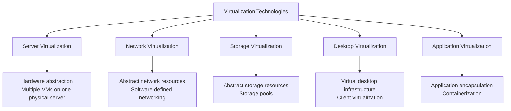

## 2. Server Virtualization

Server virtualization enables multiple virtual machines (VMs) to run on a single physical server, with each VM using a share of the server's resources.

### Hypervisor Types

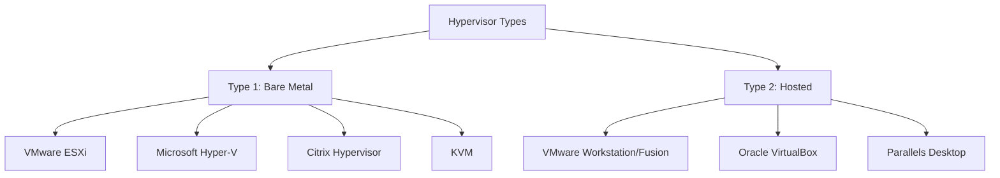

**Type 1 (Bare Metal) Hypervisors:**
- Run directly on the host's hardware
- More efficient and secure
- Better performance
- Used in enterprise environments

**Type 2 (Hosted) Hypervisors:**
- Run on a conventional operating system
- Easier to set up and use
- Lower performance than Type 1
- Used for development, testing, and desktop virtualization

### Virtual Machine Components

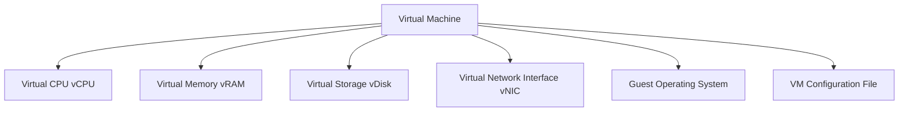

**VM Resources:**
- **vCPU**: Virtual processors assigned to the VM
- **vRAM**: Memory allocated to the VM
- **vDisk**: Virtual hard disks (VHD, VMDK, etc.)
- **vNIC**: Virtual network interfaces
- **Configuration files**: Define VM settings and parameters

### Virtualization Benefits

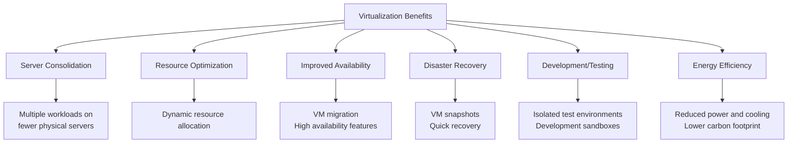

### Advanced Virtualization Features

**Live Migration:**
The process of moving a running virtual machine from one physical host to another without downtime.

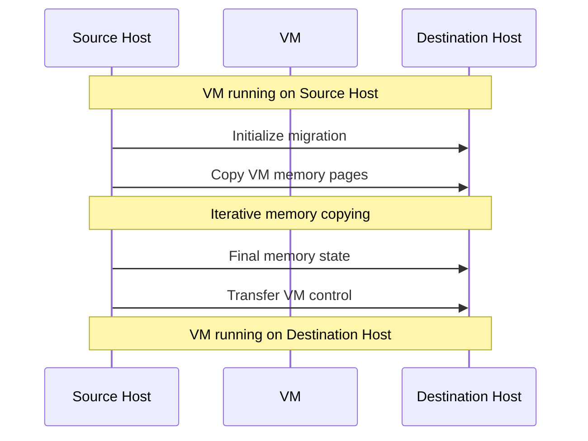

**Resource Pools:**
Logical abstraction that allows aggregation of compute resources for flexible allocation.

**VM Templates:**
Master copies of virtual machines used to create and provision new VMs.

**VM Snapshots:**
Point-in-time images of VM state, useful for backups and testing.

## 3. Network Virtualization

Network virtualization abstracts network resources from the underlying hardware, creating virtual networks that operate independently of the physical network.

### Virtual LANs (VLANs)

VLANs logically segment a single physical network into multiple isolated networks.

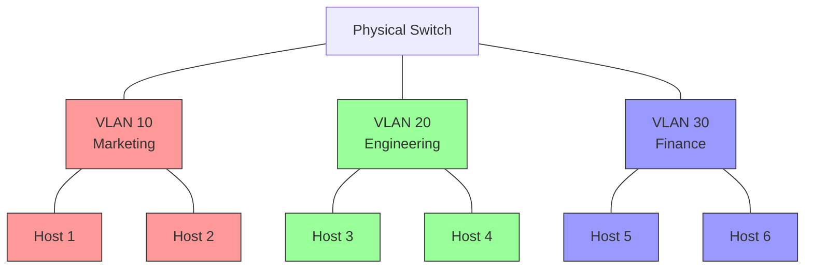

**VLAN Benefits:**
- Improved security through isolation
- Reduced broadcast traffic
- Simplified network management
- Logical grouping of users
- Flexible resource allocation

### Virtual Switches

Virtual switches (vSwitches) operate at the hypervisor level to provide network connectivity to virtual machines.

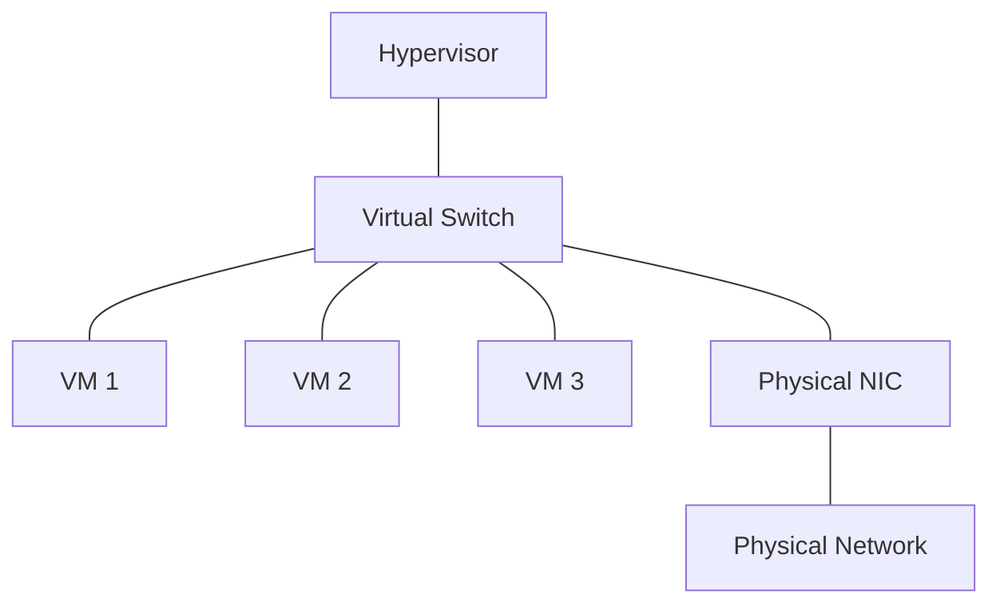

**vSwitch Capabilities:**
- VM-to-VM communication
- VLAN support
- Traffic filtering and monitoring
- Network policies and QoS
- NIC teaming for redundancy

**Examples:**
- VMware vSphere Standard Switch
- VMware vSphere Distributed Switch
- Hyper-V Virtual Switch
- Open vSwitch (OVS)

### Software-Defined Networking (SDN)

SDN separates the network control plane from the data plane, allowing for centralized management and programmability.

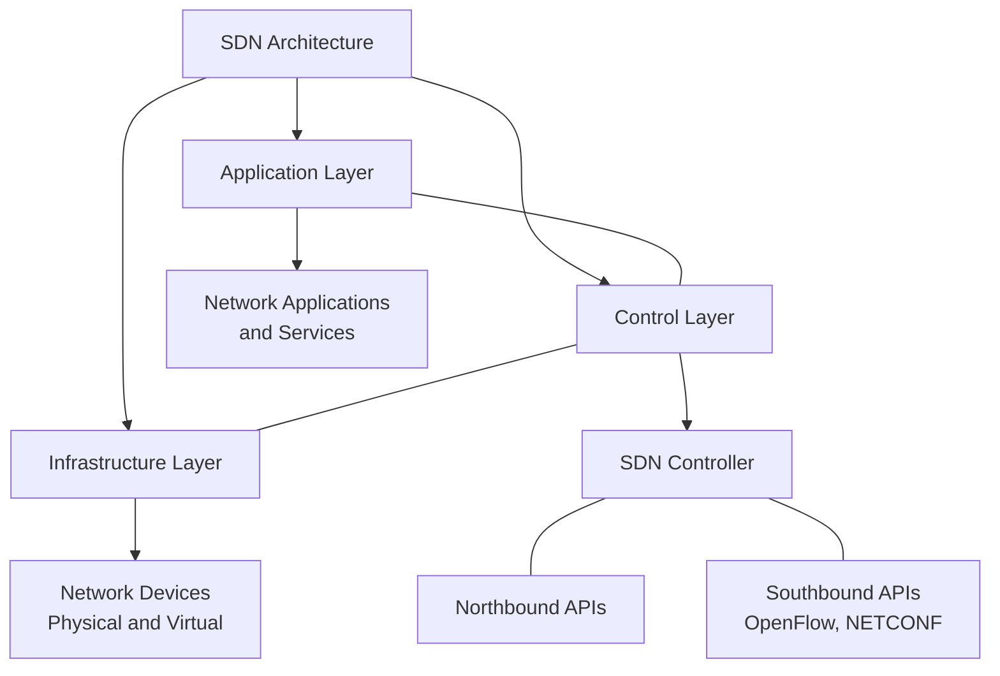

**SDN Benefits:**
- Centralized network management
- Network programmability
- Service agility and flexibility
- Vendor independence
- Automated network provisioning

**SDN Controllers:**
- OpenDaylight
- ONOS (Open Network Operating System)
- VMware NSX
- Cisco ACI
- Juniper Contrail

### Network Function Virtualization (NFV)

NFV decouples network functions (like firewalls, load balancers, routers) from proprietary hardware, implementing them as software running on standard servers.

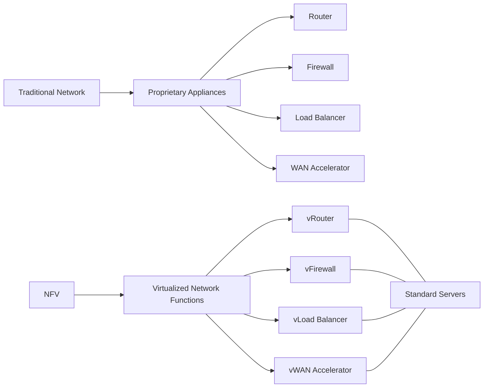

**NFV Benefits:**
- Reduced hardware costs
- Faster service deployment
- Scalability and flexibility
- Reduced power consumption
- Streamlined operations

### Overlay Networks

Overlay networks create virtual network topologies on top of the physical network infrastructure.

**Examples:**
- VXLAN (Virtual Extensible LAN)
- NVGRE (Network Virtualization using GRE)
- STT (Stateless Transport Tunneling)
- Geneve (Generic Network Virtualization Encapsulation)

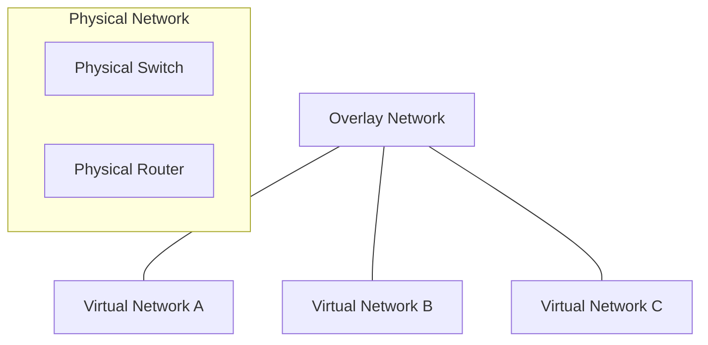

## 4. Storage Virtualization

Storage virtualization pools physical storage resources from multiple devices into a single logical storage entity.

### Storage Virtualization Types

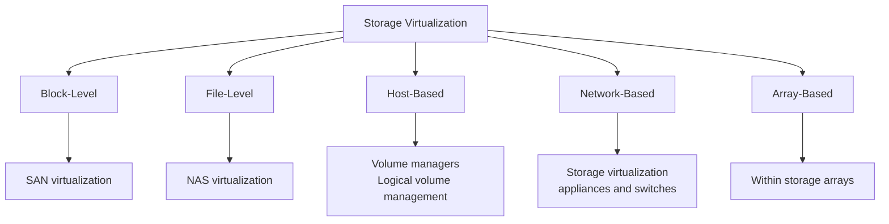

### Storage Area Network (SAN) Virtualization

SAN virtualization abstracts the logical storage from physical storage in storage area networks.

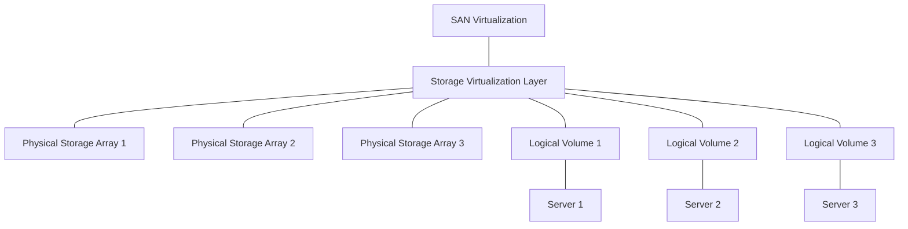

**Benefits:**
- Storage consolidation
- Improved utilization
- Simplified management
- Non-disruptive data migration
- Enhanced data protection

### Virtual Storage Appliances (VSA)

Virtual storage appliances are storage controllers that run as virtual machines, converting direct-attached storage into shared storage.

**Examples:**
- VMware vSAN
- StarWind Virtual SAN
- Microsoft Storage Spaces Direct
- HPE StoreVirtual VSA

### Software-Defined Storage (SDS)

SDS separates storage software from hardware, enabling policy-based management and automation.

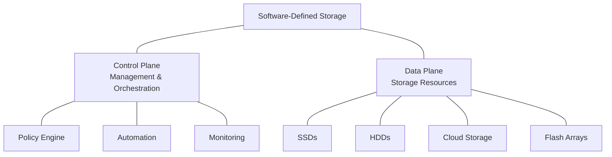

**SDS Characteristics:**
- Abstraction of storage services
- Automation of storage management
- Programmable API interfaces
- Scale-out architecture
- Hardware independence

## 5. Desktop Virtualization

Desktop virtualization separates the desktop environment from the physical device, enabling centralized management and remote access.

### Virtual Desktop Infrastructure (VDI)

VDI hosts desktop operating systems within virtual machines on a centralized server.

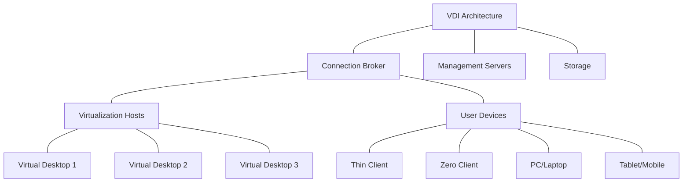

**VDI Benefits:**
- Centralized desktop management
- Enhanced security
- Access from any device
- Consistent user experience
- Simplified backup and recovery

**VDI Challenges:**
- Storage requirements
- Network bandwidth
- Performance considerations
- Initial deployment costs
- Licensing complexity

**VDI Solutions:**
- Citrix Virtual Apps and Desktops
- VMware Horizon
- Microsoft Virtual Desktop
- Parallels Remote Application Server

### Remote Desktop Services (RDS)

RDS (formerly Terminal Services) provides shared access to Windows desktop sessions running on a server.

**Differences from VDI:**
- Shared server OS instance vs. individual VMs
- Lower resource requirements
- Reduced licensing costs
- Less isolation between users
- Potential application compatibility issues

### Desktop as a Service (DaaS)

DaaS is a cloud-based desktop virtualization solution where the VDI infrastructure is hosted by a third-party provider.

**Examples:**
- Amazon WorkSpaces
- Citrix Managed Desktops
- VMware Horizon Cloud
- Microsoft Windows Virtual Desktop

## 6. Application Virtualization

Application virtualization isolates applications from the underlying operating system, enabling portable and conflict-free application deployment.

### Application Virtualization Methods

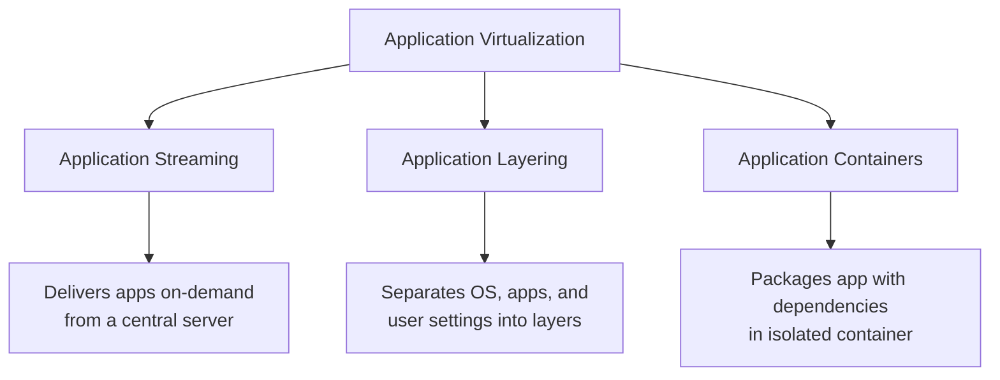

**Benefits:**
- Eliminates application conflicts
- Simplifies application updates
- Reduces testing requirements
- Enables legacy application support
- Improves application portability

**Solutions:**
- Microsoft App-V
- VMware ThinApp
- Citrix Application Virtualization
- Turbo.net

### Application Containerization

Containerization packages applications and their dependencies into a standardized unit for deployment.

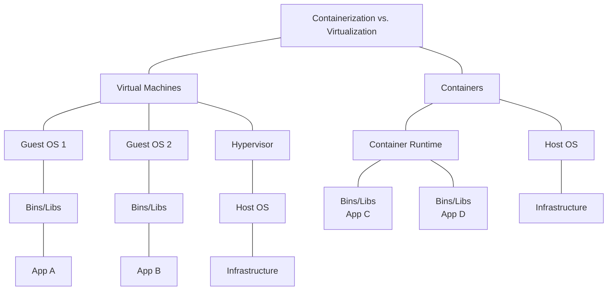

**Container Benefits:**
- Lightweight (no guest OS required)
- Fast startup times
- Efficient resource utilization
- Consistent environment across development and production
- Improved scalability and portability

**Container Technologies:**
- Docker
- Kubernetes
- Podman
- containerd
- LXC/LXD

## 7. Virtualization Management

Virtualization management platforms provide centralized control and automation for virtualized environments.

### Management Capabilities

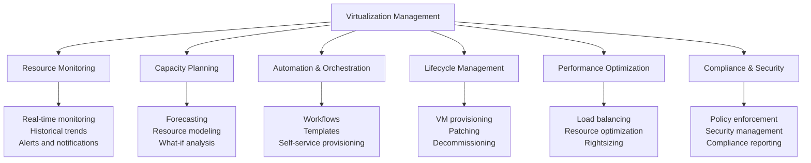

**Management Platforms:**
- VMware vCenter Server
- Microsoft System Center Virtual Machine Manager
- Citrix Hypervisor Management
- Red Hat Virtualization Manager
- OpenStack

### Infrastructure as Code (IaC)

IaC manages virtualization infrastructure through machine-readable definition files rather than manual configuration.

**Benefits:**
- Consistent and repeatable deployments
- Version-controlled infrastructure
- Automation of provisioning
- Documentation as code
- Reduced human error

**IaC Tools:**
- Terraform
- Ansible
- Puppet
- Chef
- AWS CloudFormation
- Azure Resource Manager templates

## 8. Cloud and Virtualization

Virtualization is the foundation of cloud computing, enabling the elastic provisioning of resources.

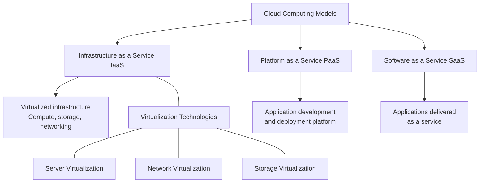

**Relationship:**
- Virtualization is a technology
- Cloud computing is a service model
- Virtualization enables cloud computing
- Cloud computing leverages virtualization

## Additional Resources

- [VMware Virtualization Technology](https://www.vmware.com/solutions/virtualization.html)
- [Microsoft Virtualization Documentation](https://docs.microsoft.com/en-us/virtualization/)
- [Docker Documentation](https://docs.docker.com/)
- [OpenStack Documentation](https://docs.openstack.org/)
- [Kubernetes Documentation](https://kubernetes.io/docs/home/)

## Practice Questions

1. Compare and contrast Type 1 and Type 2 hypervisors. Provide examples of each and explain when you would choose one over the other.

2. A company wants to migrate from physical servers to a virtualized environment. Describe the benefits they might realize and potential challenges they might face during this transition.

3. Explain the differences between VLANs, virtual switches, and software-defined networking. How do these technologies complement each other in a virtualized environment?

4. Compare virtual desktop infrastructure (VDI) with Remote Desktop Services (RDS). What factors would influence an organization's choice between these two desktop virtualization approaches?

5. How does application containerization differ from traditional virtualization? Describe a scenario where containers would be more appropriate than virtual machines.
