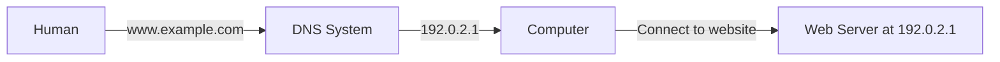
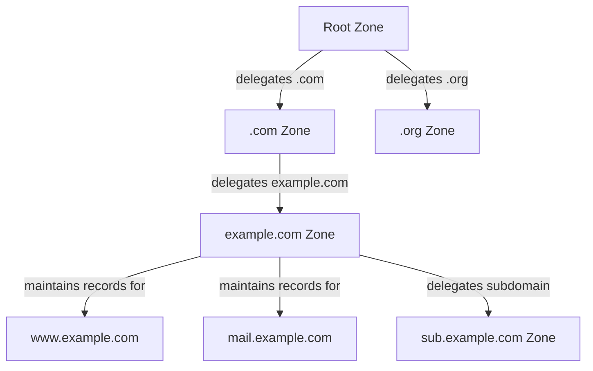
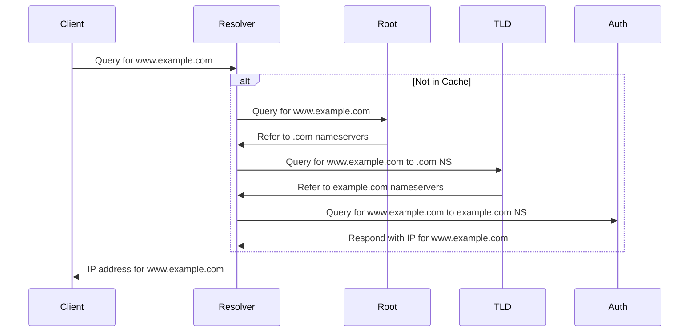
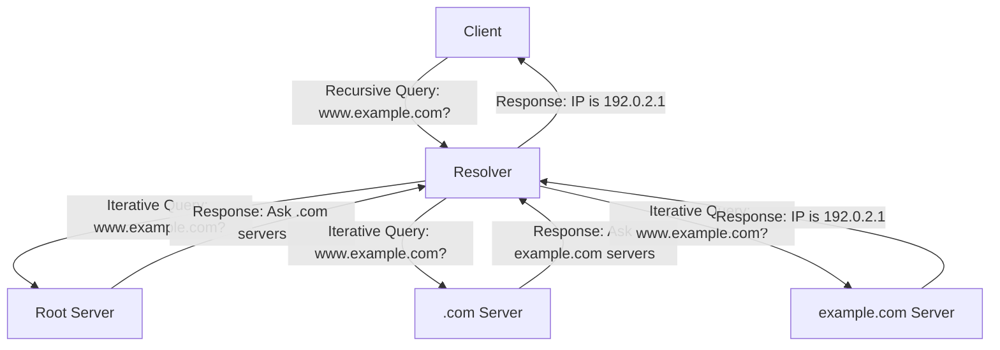
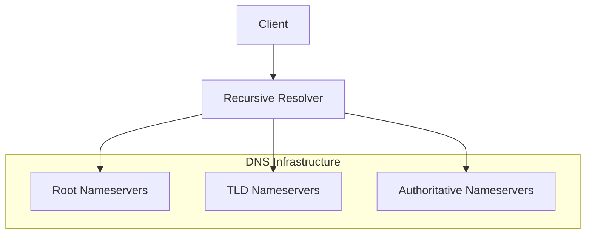
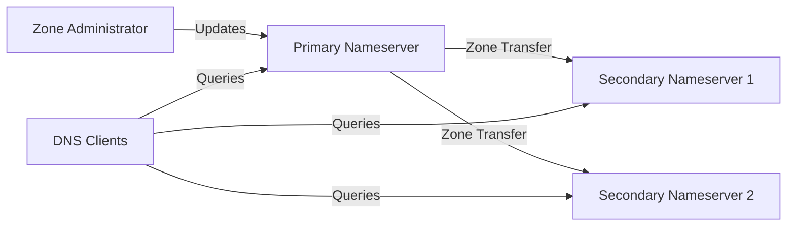
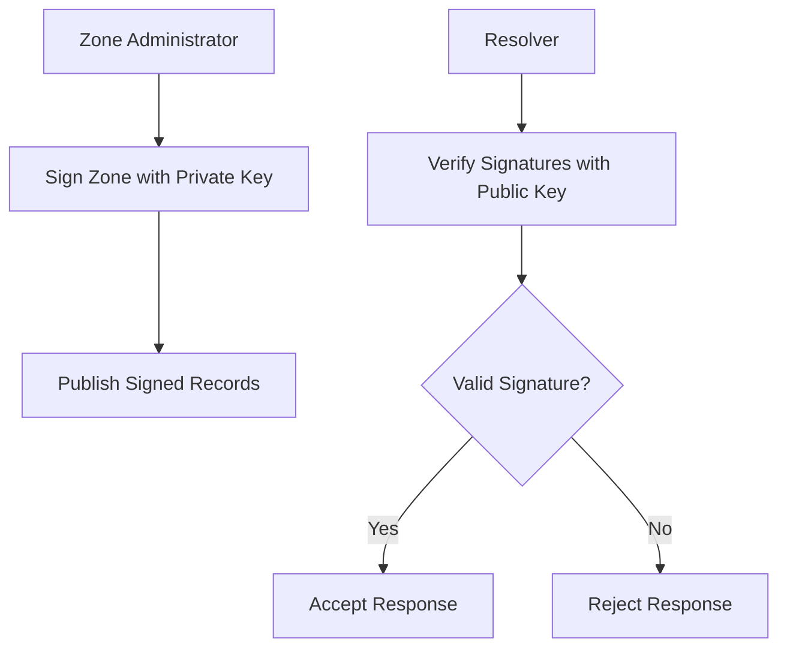

# Day 13: DNS - Domain Name System

<div align="center">
  
  
  <h1>🌐 DNS: The Internet's Phone Book 🌐</h1>
  
  <p>
    
    
    
    
  </p>
  
  <hr>
</div>

## Table of Contents
- [Introduction to DNS](#introduction-to-dns)
- [DNS Hierarchy and Architecture](#dns-hierarchy-and-architecture)
- [DNS Record Types](#dns-record-types)
- [DNS Resolution Process](#dns-resolution-process)
- [DNS Servers and Their Roles](#dns-servers-and-their-roles)
- [DNS Protocol](#dns-protocol)
- [DNS Message Format](#dns-message-format)
- [DNS Query Types](#dns-query-types)
- [DNS Security](#dns-security)
- [DNS Configuration](#dns-configuration)
- [DNS Tools and Commands](#dns-tools-and-commands)
- [DNS Performance and Optimization](#dns-performance-and-optimization)
- [DNS in Modern Network Architecture](#dns-in-modern-network-architecture)
- [Practice Questions](#practice-questions)
- [Additional Resources](#additional-resources)

## Introduction to DNS

The Domain Name System (DNS) is a hierarchical and decentralized naming system for computers, services, or other resources connected to the Internet or a private network. It translates human-readable domain names (like www.example.com) into machine-readable IP addresses (like 192.0.2.1 or 2001:db8::1) that computers use to identify each other on the network.



### Why DNS is Needed

Imagine having to remember numeric IP addresses for every website you want to visit:
- Instead of typing `google.com`, you'd need to type `142.250.190.78`
- Instead of `facebook.com`, you'd use `157.240.11.35`
- For your bank, email, shopping sites... all numeric addresses

DNS solves this problem by creating a system that maps easy-to-remember domain names to the numeric IP addresses computers need.

### Brief History of DNS

| Year | Development |
|------|-------------|
| Pre-1983 | ARPANET used a single HOSTS.TXT file maintained at Stanford Research Institute |
| 1983 | Paul Mockapetris designed DNS to replace the centralized HOSTS.TXT file |
| 1984 | First DNS implementations (BIND) |
| 1987 | RFC 1034 and 1035 defined core DNS protocols and specifications |
| 1997 | Introduction of Dynamic DNS updates (RFC 2136) |
| 1999 | DNSSEC specifications published to address security vulnerabilities |
| 2004 | Internationalized domain names introduced |
| 2010 | DNSSEC signed root zone deployed |
| 2016 | DNS over HTTPS (DoH) development begins |
| 2018 | DNS over TLS (DoT) standardized |

### DNS Core Functions

1. **Name Resolution**: Converting domain names to IP addresses
2. **Distributed Database**: Maintaining a distributed database of name-to-IP mappings
3. **Load Distribution**: Supporting load balancing through multiple IP addresses for one domain
4. **Service Location**: Providing locations of specific services (mail, web, etc.)
5. **Alias Creation**: Allowing alternative names for the same resource

## DNS Hierarchy and Architecture

DNS uses a hierarchical tree structure that distributes the responsibility of managing and maintaining domain information.

```mermaid
graph TD
    A[Root "."] --> B[Top-Level Domains]
    B --> C[com]
    B --> D[org]
    B --> E[net]
    B --> F[edu]
    B --> G[gov]
    B --> H[Country Codes]
    H --> I[.uk]
    H --> J[.jp]
    H --> K[.de]
    H --> L[.fr]
    C --> M[example.com]
    C --> N[google.com]
    C --> O[amazon.com]
    M --> P[www.example.com]
    M --> Q[mail.example.com]
    M --> R[blog.example.com]
```

### The DNS Namespace

The DNS namespace is structured as an inverted tree, with the root at the top and domains branching downward:

1. **Root Domain**: Represented by a single dot `.`
   - Managed by 13 logical root server clusters (A through M)
   - The foundation of the DNS hierarchy

2. **Top-Level Domains (TLDs)**:
   - Generic TLDs: .com, .org, .net, .edu, etc.
   - Country-code TLDs: .us, .uk, .jp, .de, etc.
   - Special-purpose TLDs: .gov, .mil, .int
   - New gTLDs: .app, .blog, .shop, etc.

3. **Second-Level Domains**:
   - Registered by organizations and individuals
   - Examples: google.com, bbc.co.uk, mit.edu

4. **Subdomains**:
   - Created under second-level domains
   - Examples: maps.google.com, news.bbc.co.uk

5. **Host Names**:
   - Identify specific devices or services
   - Examples: www.example.com, mail.example.com

### Fully Qualified Domain Names (FQDNs)

An FQDN specifies the exact location of a host within the DNS hierarchy, including all domain levels up to the root.

Example: `www.example.com.`

- The final dot represents the root domain (often omitted in day-to-day usage)
- Each label (separated by dots) represents a different level in the hierarchy
- Maximum length of 255 characters, with each label limited to 63 characters

### Delegation and Zone Management

DNS distributes administrative responsibility through delegation:

1. **Zone**: A portion of the DNS namespace managed by a specific organization
   - Contains authoritative information about domains within that portion
   - May include multiple domains or subdomains

2. **Delegation**: The process of assigning responsibility for a subdomain
   - Parent domain delegates authority to child domains
   - Enables distributed management of the DNS namespace
   
3. **Zone Files**: Store the records for a zone
   - Include resource records that define mappings
   - Contain pointers to nameservers for delegated subdomains



## DNS Record Types

DNS stores various types of data in the form of resource records (RRs). Each record type serves a specific purpose in the DNS system.

### Common DNS Record Types

| Record Type | Purpose | Example |
|-------------|---------|---------|
| A | Maps a domain name to IPv4 address | `example.com. IN A 192.0.2.1` |
| AAAA | Maps a domain name to IPv6 address | `example.com. IN AAAA 2001:db8::1` |
| CNAME | Creates an alias from one domain to another | `www.example.com. IN CNAME example.com.` |
| MX | Specifies mail servers for the domain | `example.com. IN MX 10 mail.example.com.` |
| NS | Delegates a DNS zone to a nameserver | `example.com. IN NS ns1.example.com.` |
| SOA | Start of Authority - contains zone metadata | `example.com. IN SOA ns1.example.com. admin.example.com. (2023091001 3600 1800 604800 86400)` |
| TXT | Stores text information (often for verification) | `example.com. IN TXT "v=spf1 include:_spf.example.com -all"` |
| PTR | Maps an IP address to a domain name (reverse lookup) | `1.2.0.192.in-addr.arpa. IN PTR www.example.com.` |
| SRV | Specifies location of services | `_sip._tcp.example.com. IN SRV 10 60 5060 sipserver.example.com.` |
| CAA | Specifies which Certificate Authorities can issue certificates | `example.com. IN CAA 0 issue "letsencrypt.org"` |

### Record Format

DNS records follow a standard format:

```
NAME    TTL    CLASS    TYPE    DATA
```

- **NAME**: The domain name to which the record applies
- **TTL**: Time to Live - how long the record can be cached (in seconds)
- **CLASS**: Network class (almost always IN for Internet)
- **TYPE**: Record type (A, AAAA, MX, etc.)
- **DATA**: Type-specific data (varies by record type)

### A and AAAA Records

Address records map domain names to IP addresses:

```
# A record for IPv4
example.com.    86400    IN    A    192.0.2.1

# AAAA record for IPv6
example.com.    86400    IN    AAAA    2001:db8::1
```

A single domain can have multiple A or AAAA records for load balancing:

```
example.com.    86400    IN    A    192.0.2.1
example.com.    86400    IN    A    192.0.2.2
example.com.    86400    IN    A    192.0.2.3
```

### CNAME Records

Canonical Name records create aliases pointing to another domain:

```
www.example.com.    86400    IN    CNAME    example.com.
blog.example.com.   86400    IN    CNAME    example-blog.someservice.com.
```

CNAME records cannot coexist with other record types for the same name, and the target should have an A/AAAA record.

### MX Records

Mail Exchange records specify mail servers and their priorities:

```
example.com.    86400    IN    MX    10    primary-mail.example.com.
example.com.    86400    IN    MX    20    backup-mail.example.com.
```

Lower priority values indicate preferred mail servers. If the primary server is unavailable, the backup is used.

### NS Records

Nameserver records identify authoritative DNS servers for a zone:

```
example.com.    86400    IN    NS    ns1.example.com.
example.com.    86400    IN    NS    ns2.example.com.
```

Best practice is to have at least two nameservers for redundancy.

### SOA Record

The Start of Authority record contains administrative information about the zone:

```
example.com.    86400    IN    SOA    ns1.example.com. admin.example.com. (
                                      2023091001  ; Serial
                                      3600        ; Refresh (1 hour)
                                      1800        ; Retry (30 minutes)
                                      604800      ; Expire (1 week)
                                      86400 )     ; Minimum TTL (1 day)
```

SOA components:
1. Primary nameserver (ns1.example.com.)
2. Administrator email (admin.example.com. - the @ is replaced with a dot)
3. Serial number (typically date-based: YYYYMMDDNN)
4. Refresh interval (how often secondary nameservers check for updates)
5. Retry interval (time to wait before retrying a failed zone transfer)
6. Expire time (how long secondary servers consider data valid without updates)
7. Minimum TTL (default caching time for negative responses)

### TXT Records

Text records store arbitrary text data, commonly used for:
- Email authentication (SPF, DKIM, DMARC)
- Domain verification for services
- Human-readable information

```
example.com.    86400    IN    TXT    "v=spf1 include:_spf.example.com -all"
_dmarc.example.com.    86400    IN    TXT    "v=DMARC1; p=reject; rua=mailto:dmarc@example.com"
```

### PTR Records

Pointer records map IP addresses to domain names (reverse DNS):

```
# For IPv4 address 192.0.2.1
1.2.0.192.in-addr.arpa.    86400    IN    PTR    www.example.com.

# For IPv6 address 2001:db8::1
1.0.0.0.0.0.0.0.0.0.0.0.0.0.0.0.0.0.0.0.0.0.0.0.8.b.d.0.1.0.0.2.ip6.arpa.    86400    IN    PTR    www.example.com.
```

## DNS Resolution Process

The DNS resolution process converts a domain name into an IP address through a series of queries across the DNS hierarchy.

### Basic Resolution Flow



### Step-by-Step Resolution Process

1. **Local Query**: The client (e.g., web browser) sends a DNS query to the configured resolver (usually provided by the ISP or a service like Google DNS 8.8.8.8)

2. **Resolver Cache Check**: The resolver checks its cache for the requested domain
   - If found and not expired (TTL still valid), returns the cached result
   - If not found or expired, begins recursive resolution

3. **Root Server Query**: The resolver queries a root nameserver
   - Root server responds with referral to appropriate TLD nameservers
   - Example: For .com domains, returns list of .com nameservers

4. **TLD Server Query**: The resolver queries the appropriate TLD nameserver
   - TLD server responds with referral to authoritative nameservers for the domain
   - Example: .com nameserver provides nameservers for example.com

5. **Authoritative Server Query**: The resolver queries the authoritative nameserver
   - Authoritative server responds with the requested DNS record
   - Example: Returns A record with IP address for www.example.com

6. **Result Delivery**: The resolver returns the final answer to the client
   - The result is cached according to the TTL
   - Client uses the IP address to establish connection

### Recursive vs. Iterative Queries

DNS resolution involves two types of queries:

1. **Recursive Query**: Client asks resolver to complete the entire resolution process
   - Client makes one query and waits for complete answer
   - Resolver handles all necessary steps to find the answer
   - Typical for client-to-resolver communication

2. **Iterative Query**: Resolver receives referrals and follows them until reaching the answer
   - Resolver makes multiple queries to different nameservers
   - Each nameserver provides the best information it has (often a referral)
   - Typical for resolver-to-nameserver communication



### Caching in DNS

Caching is critical for DNS efficiency and performance:

1. **Browser Cache**: Most browsers maintain a short-term DNS cache
   - First level of caching
   - Typically cleared when browser is closed

2. **Operating System Cache**: OS maintains a DNS cache
   - Used by all applications on the system
   - Configurable TTL settings (varies by OS)

3. **Resolver Cache**: DNS resolvers cache query results
   - ISP resolvers serve many users, making caches very effective
   - Obey TTL values set by authoritative servers

4. **Nameserver Cache**: DNS servers cache results from other zones
   - Improves performance for frequently accessed domains
   - Follows TTL values for cache expiration

### Negative Caching

Negative caching stores information about failed lookups:
- Records that do not exist are cached to avoid repeated queries
- Controlled by the SOA record's minimum TTL field
- Improves performance by quickly responding to invalid queries
- Reduces load on DNS infrastructure

## DNS Servers and Their Roles

Different types of DNS servers fulfill specific roles in the domain name resolution process.

### Root Nameservers

Root servers form the foundation of the DNS hierarchy:
- 13 logical root server clusters identified by letters A through M
- Operated by 12 different organizations (Verisign operates both A and J)
- As of September 2025, the root server system consists of 1986 instances globally
- Distributed worldwide using anycast addressing for improved performance and redundancy
- Contain information about the authoritative servers for TLDs
- Do not store information about individual domains

```
# The 13 root nameserver operators
a.root-servers.net. Run by Verisign, Inc. (https://a.root-servers.org/)
b.root-servers.net. Run by University of Southern California (ISI)
c.root-servers.net. Run by Cogent Communications
d.root-servers.net. Run by University of Maryland
e.root-servers.net. Run by NASA
f.root-servers.net. Run by Internet Systems Consortium (ISC)
g.root-servers.net. Run by US Department of Defense (DoD)
h.root-servers.net. Run by US Army Research Lab (ARL)
i.root-servers.net. Run by Netnod
j.root-servers.net. Run by Verisign, Inc.
k.root-servers.net. Run by RIPE NCC
l.root-servers.net. Run by ICANN
m.root-servers.net. Run by WIDE Project
```

The root server system is maintained by independent organizations that coordinate through various bodies like ICANN's Root Server System Advisory Committee (RSSAC). Technical questions about the Root Server System can be directed to the [Ask RSSAC](mailto:ask-rssac@icann.org) email address.

For detailed statistics and visualizations of the root server system, you can visit [rssac002.root-servers.org](https://rssac002.root-servers.org/).

### TLD Nameservers

TLD nameservers manage top-level domains:
- Authoritative for specific TLDs (.com, .org, .net, country codes, etc.)
- Managed by registry operators (Verisign for .com and .net, Public Interest Registry for .org, etc.)
- Contain information about authoritative nameservers for domains within that TLD
- Do not store records for individual hosts within domains

### Authoritative Nameservers

Authoritative nameservers are the definitive source for a domain's DNS records:
- Provide answers for queries about domains within their authority
- Managed by domain owners or their DNS providers
- Store all DNS records for the domain (A, AAAA, MX, etc.)
- Typically operated in pairs or larger groups for redundancy

### Recursive Resolvers

Recursive resolvers perform the complete DNS resolution process on behalf of clients:
- Accept queries from clients (browsers, applications, etc.)
- Handle the entire resolution process (root → TLD → authoritative)
- Maintain caches to improve performance
- Can be operated by ISPs, organizations, or public services (e.g., Google 8.8.8.8, Cloudflare 1.1.1.1)



### Forwarding Resolvers

Forwarding resolvers pass queries to another resolver:
- Accept queries from clients
- Forward requests to another recursive resolver instead of handling recursion
- Maintain a cache of responses
- Often used in corporate or home networks

### Primary and Secondary Nameservers

For redundancy and load distribution, domains typically have multiple authoritative nameservers:

1. **Primary (Master) Nameserver**:
   - Contains the master copy of zone data
   - Where zone updates are made
   - Defined in the SOA record as the primary nameserver

2. **Secondary (Slave) Nameservers**:
   - Obtain zone data from the primary through zone transfers
   - Provide redundancy and load distribution
   - Equally authoritative for the zone
   - Cannot accept zone updates directly



### Hidden Primary Nameservers

Some setups use a hidden primary configuration:
- Primary nameserver is not publicly listed in NS records
- Only secondary nameservers are publicly advertised
- Provides additional security by protecting the master server
- Zone transfers occur only to designated secondary servers

## DNS Protocol

The DNS protocol defines how DNS components communicate to resolve domain names to IP addresses.

### Protocol Basics

- **Transport Protocol**: Primarily uses UDP on port 53 for queries and responses
- **Fallback**: Uses TCP on port 53 for zone transfers and responses larger than 512 bytes
- **Modern Extensions**: DNS over TLS (port 853) and DNS over HTTPS (port 443)
- **Message Format**: Binary format with header, question, answer, authority, and additional sections

### DNS Packet Structure

A DNS message consists of five sections:

```
+---------------------+
| Header              |
+---------------------+
| Question Section    |
+---------------------+
| Answer Section      |
+---------------------+
| Authority Section   |
+---------------------+
| Additional Section  |
+---------------------+
```

### Header Section

The header is 12 bytes and contains:

```
  0  1  2  3  4  5  6  7  8  9  0  1  2  3  4  5
+--+--+--+--+--+--+--+--+--+--+--+--+--+--+--+--+
|                      ID                       |
+--+--+--+--+--+--+--+--+--+--+--+--+--+--+--+--+
|QR|   Opcode  |AA|TC|RD|RA|Z |AD|CD|   RCODE   |
+--+--+--+--+--+--+--+--+--+--+--+--+--+--+--+--+
|                    QDCOUNT                    |
+--+--+--+--+--+--+--+--+--+--+--+--+--+--+--+--+
|                    ANCOUNT                    |
+--+--+--+--+--+--+--+--+--+--+--+--+--+--+--+--+
|                    NSCOUNT                    |
+--+--+--+--+--+--+--+--+--+--+--+--+--+--+--+--+
|                    ARCOUNT                    |
+--+--+--+--+--+--+--+--+--+--+--+--+--+--+--+--+
```

- **ID**: 16-bit identifier for matching responses to queries
- **QR**: Query (0) or Response (1)
- **Opcode**: Type of query (0 = standard query)
- **AA**: Authoritative Answer flag
- **TC**: Truncation flag
- **RD**: Recursion Desired flag
- **RA**: Recursion Available flag
- **Z**: Reserved for future use
- **AD**: Authenticated Data (DNSSEC)
- **CD**: Checking Disabled (DNSSEC)
- **RCODE**: Response code (0 = no error)
- **QDCOUNT**: Number of entries in question section
- **ANCOUNT**: Number of entries in answer section
- **NSCOUNT**: Number of entries in authority section
- **ARCOUNT**: Number of entries in additional section

### Question Section

Contains the query being asked:

```
                                1  1  1  1  1  1
  0  1  2  3  4  5  6  7  8  9  0  1  2  3  4  5
+--+--+--+--+--+--+--+--+--+--+--+--+--+--+--+--+
|                                               |
/                     QNAME                     /
/                                               /
+--+--+--+--+--+--+--+--+--+--+--+--+--+--+--+--+
|                     QTYPE                     |
+--+--+--+--+--+--+--+--+--+--+--+--+--+--+--+--+
|                     QCLASS                    |
+--+--+--+--+--+--+--+--+--+--+--+--+--+--+--+--+
```

- **QNAME**: Domain name being queried (sequence of labels)
- **QTYPE**: Type of record being requested (A, AAAA, MX, etc.)
- **QCLASS**: Class of query (typically IN for Internet)

### Answer, Authority, and Additional Sections

These sections contain resource records in the following format:

```
                                1  1  1  1  1  1
  0  1  2  3  4  5  6  7  8  9  0  1  2  3  4  5
+--+--+--+--+--+--+--+--+--+--+--+--+--+--+--+--+
|                                               |
/                      NAME                     /
/                                               /
+--+--+--+--+--+--+--+--+--+--+--+--+--+--+--+--+
|                      TYPE                     |
+--+--+--+--+--+--+--+--+--+--+--+--+--+--+--+--+
|                     CLASS                     |
+--+--+--+--+--+--+--+--+--+--+--+--+--+--+--+--+
|                      TTL                      |
|                                               |
+--+--+--+--+--+--+--+--+--+--+--+--+--+--+--+--+
|                   RDLENGTH                    |
+--+--+--+--+--+--+--+--+--+--+--+--+--+--+--+--+
/                     RDATA                     /
/                                               /
+--+--+--+--+--+--+--+--+--+--+--+--+--+--+--+--+
```

- **NAME**: Domain name to which this record pertains
- **TYPE**: Record type (A, AAAA, MX, etc.)
- **CLASS**: Record class (typically IN)
- **TTL**: Time to live in seconds
- **RDLENGTH**: Length of RDATA field
- **RDATA**: Type-specific data (IP address for A records, etc.)

### DNS Response Codes

Response codes indicate the status of a DNS query:

| Code | Name | Description |
|------|------|-------------|
| 0 | NOERROR | No error condition |
| 1 | FORMERR | Format error in query |
| 2 | SERVFAIL | Server failure |
| 3 | NXDOMAIN | Non-existent domain |
| 4 | NOTIMP | Not implemented |
| 5 | REFUSED | Query refused |
| 6 | YXDOMAIN | Name exists when it should not |
| 7 | YXRRSET | RR set exists when it should not |
| 8 | NXRRSET | RR set does not exist when it should |
| 9 | NOTAUTH | Server not authoritative for zone |
| 10 | NOTZONE | Name not contained in zone |
| 16 | BADVERS | Bad OPT version |
| 17 | BADKEY | Key not recognized |
| 18 | BADTIME | Signature out of time window |
| 19 | BADMODE | Bad TKEY mode |
| 20 | BADNAME | Duplicate key name |
| 21 | BADALG | Algorithm not supported |
| 22 | BADTRUNC | Bad truncation |
| 23 | BADCOOKIE | Bad server cookie |

## DNS Query Types

DNS clients can make different types of queries depending on their needs.

### Standard Query

The most common type of DNS query:
- Client requests a specific record type for a domain
- Resolver performs full recursive resolution if needed
- Returns the requested record(s) or an error

Example: Query for the A record of www.example.com

### Inverse Query

Looks up a domain name based on an IP address:
- Uses the special in-addr.arpa domain for IPv4
- Uses ip6.arpa domain for IPv6
- Returns PTR records mapping the IP to a domain name

Example: Query for the domain associated with 192.0.2.1

```
# Query for 192.0.2.1
1.2.0.192.in-addr.arpa. IN PTR
```

### Zone Transfer

Transfers zone data between nameservers:
- AXFR: Full zone transfer (complete copy of zone)
- IXFR: Incremental zone transfer (only changes)
- Uses TCP rather than UDP
- Should be restricted to authorized secondary nameservers

Example: Secondary nameserver requesting zone data from primary

### UPDATE

Allows dynamic updates to zone data:
- Defined in RFC 2136
- Enables programmatic modification of DNS records
- Should be secured with TSIG or similar authentication
- Commonly used for DHCP servers to update DNS records

Example: DHCP server updating A record when assigning IP to client

### NOTIFY

Notifies secondary nameservers of zone changes:
- Primary server sends NOTIFY to secondaries when zone changes
- Secondaries then initiate zone transfer to get updates
- More efficient than waiting for refresh interval

## DNS Message Format

The DNS message format is standardized and consists of a header followed by four sections: question, answer, authority, and additional information.

### Query Example (dig)

```bash
$ dig +noedns www.example.com A

;; ->>HEADER<<- opcode: QUERY, status: NOERROR, id: 12345
;; flags: qr rd ra; QUERY: 1, ANSWER: 1, AUTHORITY: 0, ADDITIONAL: 0

;; QUESTION SECTION:
;www.example.com.               IN      A

;; ANSWER SECTION:
www.example.com.        86400   IN      A       93.184.216.34
```

### Query Header Breakdown

```
ID: 12345                 (16-bit identifier)
QR: 1                     (1=Response, 0=Query)
OPCODE: QUERY (0)         (Standard query)
AA: 0                     (Not authoritative)
TC: 0                     (Not truncated)
RD: 1                     (Recursion desired)
RA: 1                     (Recursion available)
Z: 0                      (Reserved)
RCODE: NOERROR (0)        (No error condition)
QDCOUNT: 1                (1 question)
ANCOUNT: 1                (1 answer)
NSCOUNT: 0                (0 authority records)
ARCOUNT: 0                (0 additional records)
```

### Domain Name Compression

To save space, DNS messages use compression for domain names:
- Repeated domain names are replaced with pointers
- Pointers consist of a 2-byte value with the top 2 bits set
- Reduces message size for domains with common suffixes

Example: If `example.com` appears multiple times, subsequent occurrences can be replaced with a pointer to the first occurrence.

### UDP vs TCP for DNS

DNS traditionally uses UDP on port 53 for queries and responses:
- More efficient for small queries and responses
- No connection setup/teardown overhead
- Limited to 512 bytes in original DNS specification

DNS uses TCP on port 53 for:
- Zone transfers (AXFR/IXFR)
- Responses larger than 512 bytes (with TC bit set in UDP response)
- DNS over TCP (RFC 7766) for improved reliability
- Complex queries where reliability is more important than speed

### EDNS0 (Extension Mechanisms for DNS)

EDNS0 (RFC 6891) extends DNS capabilities:
- Increases UDP message size beyond 512 bytes
- Adds new flags and response codes
- Enables DNSSEC and other extensions
- Implemented through OPT pseudo-resource record

## DNS Security

DNS was originally designed without strong security measures, leading to various vulnerabilities that have been addressed through extensions and best practices.

### Common DNS Security Threats

1. **DNS Cache Poisoning / Spoofing**:
   - Attacker inserts false information into resolver caches
   - Redirects users to malicious sites
   - Exploits predictable transaction IDs and ports

2. **DNS Amplification / Reflection Attacks**:
   - Attacker sends queries with spoofed source IP
   - Responses are much larger than queries (amplification)
   - Targets victim with flood of DNS responses

3. **Zone Transfer Attacks**:
   - Unauthorized access to complete zone data
   - Reveals network infrastructure information
   - Facilitates further targeted attacks

4. **DNS Tunneling**:
   - Encodes data in DNS queries/responses
   - Bypasses firewalls and content filters
   - Exfiltrates data or creates covert channels

5. **Domain Hijacking**:
   - Unauthorized changes to domain registration
   - Changes nameservers to point to attacker-controlled servers
   - Redirects all traffic for the domain

### DNSSEC (DNS Security Extensions)

DNSSEC adds authentication and integrity to DNS:



1. **Digital Signatures**:
   - Each DNS record set (RRset) is digitally signed
   - Signatures stored in RRSIG records
   - Creates chain of trust from root down

2. **New Record Types**:
   - DNSKEY: Public keys used for verification
   - RRSIG: Digital signatures for record sets
   - DS: Delegation Signer, connects chains of trust
   - NSEC/NSEC3: Authenticated denial of existence

3. **Key Management**:
   - Zone Signing Keys (ZSK): Sign records
   - Key Signing Keys (KSK): Sign DNSKEY records
   - Regular key rotation for security

4. **Authentication Chain**:
   - Root zone is signed (root KSK)
   - TLD zones are signed and linked to root
   - Domain zones are signed and linked to TLDs
   - Creates complete chain of trust

Example DNSSEC-signed records:

```
# DNSKEY record containing the public key
example.com. 3600 IN DNSKEY 256 3 8 AwEAAcQ4...

# RRSIG record containing signature for A records
example.com. 3600 IN RRSIG A 8 2 3600 20230930000000 20230901000000 12345 example.com. AbCd1234...

# DS record in parent zone linking to child zone's DNSKEY
example.com. 86400 IN DS 12345 8 2 A1B2C3D4...
```

### DNS over TLS (DoT) and DNS over HTTPS (DoH)

Encrypted DNS protocols protect query privacy:

1. **DNS over TLS (DoT)**:
   - RFC 7858
   - Uses TLS to encrypt DNS queries
   - Standard port 853
   - Prevents eavesdropping on DNS traffic

2. **DNS over HTTPS (DoH)**:
   - RFC 8484
   - Encapsulates DNS in HTTPS
   - Uses standard HTTPS port 443
   - Harder to block, blends with web traffic
   - Supported in modern browsers

### Best Practices for DNS Security

1. **Restrict Zone Transfers**:
   - Allow only to authorized secondary nameservers
   - Use TSIG or IP-based restrictions

2. **Implement Response Rate Limiting**:
   - Limits identical responses to mitigate amplification attacks
   - Configurable in modern DNS software

3. **Use DNSSEC**:
   - Sign zones to provide authentication and integrity
   - Validate DNSSEC responses on resolvers

4. **Maintain Separate DNS Servers**:
   - Split external and internal DNS
   - Avoid exposing internal network information

5. **Keep DNS Software Updated**:
   - Apply security patches promptly
   - Follow vendor security advisories

6. **Implement Access Controls**:
   - Restrict recursive queries to authorized clients
   - Configure ACLs on DNS servers

7. **Use Registry Locks**:
   - Add additional protection at domain registrar level
   - Prevent unauthorized domain transfers

8. **Monitor DNS Traffic**:
   - Look for unusual query patterns
   - Set up alerts for suspicious activity

## DNS Configuration

Proper DNS configuration is essential for reliable domain resolution and network operation.

### DNS Server Configuration

#### BIND (Berkeley Internet Name Domain)

BIND is the most widely used DNS server software:

**named.conf** (main configuration file):
```
options {
    directory "/var/named";
    listen-on { 192.0.2.1; };
    allow-query { any; };
    recursion no;
    dnssec-validation auto;
};

zone "example.com" IN {
    type master;
    file "example.com.zone";
    allow-transfer { 192.0.2.2; };
    also-notify { 192.0.2.2; };
};

zone "2.0.192.in-addr.arpa" IN {
    type master;
    file "192.0.2.zone";
};
```

**example.com.zone** (zone file):
```
$TTL 86400
@       IN      SOA     ns1.example.com. admin.example.com. (
                        2023091001      ; Serial
                        3600            ; Refresh
                        1800            ; Retry
                        604800          ; Expire
                        86400 )         ; Minimum TTL

@       IN      NS      ns1.example.com.
@       IN      NS      ns2.example.com.
@       IN      MX      10 mail.example.com.
@       IN      A       192.0.2.10
www     IN      A       192.0.2.10
mail    IN      A       192.0.2.11
ns1     IN      A       192.0.2.1
ns2     IN      A       192.0.2.2
```

#### Microsoft DNS Server

Windows Server DNS configuration through PowerShell:

```powershell
# Add a new DNS zone
Add-DnsServerPrimaryZone -Name "example.com" -ZoneFile "example.com.dns"

# Add A record
Add-DnsServerResourceRecordA -ZoneName "example.com" -Name "www" -IPv4Address "192.0.2.10"

# Add MX record
Add-DnsServerResourceRecordMX -ZoneName "example.com" -Name "@" -MailExchange "mail.example.com" -Preference 10

# Configure zone transfers
Set-DnsServerPrimaryZone -Name "example.com" -SecureSecondaries TransferToSecureServers -SecondaryServers "192.0.2.2"
```

### Client DNS Configuration

#### Linux (/etc/resolv.conf)

```
# /etc/resolv.conf
nameserver 8.8.8.8        # Google Public DNS
nameserver 1.1.1.1        # Cloudflare DNS
search example.com        # Local domain search
options timeout:2 attempts:3 rotate
```

#### Windows (via PowerShell)

```powershell
# Set DNS servers on a network interface
Set-DnsClientServerAddress -InterfaceIndex 12 -ServerAddresses "8.8.8.8","1.1.1.1"

# Set DNS suffix search list
Set-DnsClientGlobalSetting -SuffixSearchList "example.com","corp.example.com"
```

#### macOS (via Terminal)

```bash
# Set DNS servers
networksetup -setdnsservers Wi-Fi 8.8.8.8 1.1.1.1

# Set search domains
networksetup -setsearchdomains Wi-Fi example.com corp.example.com
```

### DNS Infrastructure Best Practices

1. **Nameserver Redundancy**:
   - At least two nameservers for each zone
   - Geographically distributed for resilience
   - Different network segments/providers

2. **TTL Management**:
   - Lower TTLs before planned changes (24-48 hours prior)
   - Return to higher TTLs after changes stabilize
   - Balance between responsiveness and cache efficiency

3. **Secondary DNS Providers**:
   - Consider using secondary DNS services
   - Provides additional redundancy
   - Protects against provider-specific outages

4. **Monitoring**:
   - Regular checks for nameserver reachability
   - Monitor zone consistency across nameservers
   - Alerting for expiring domains/certificates

5. **Documentation**:
   - Maintain documentation of DNS infrastructure
   - Record all changes with dates
   - Document special configurations and custom records

## DNS Tools and Commands

Various tools help administrators and users work with DNS.

### Command-Line Tools

#### dig (Domain Information Groper)

The most versatile DNS query tool:

```bash
# Basic query for A record
$ dig example.com A

# Query specific nameserver
$ dig @8.8.8.8 example.com A

# Reverse DNS lookup
$ dig -x 192.0.2.1

# DNSSEC validation
$ dig +dnssec example.com A

# Trace DNS resolution path
$ dig +trace example.com A

# Zone transfer (if allowed)
$ dig @ns1.example.com example.com AXFR
```

#### nslookup

Available on Windows, Linux, and macOS:

```bash
# Basic query
$ nslookup example.com

# Query specific record type
$ nslookup -type=MX example.com

# Query specific server
$ nslookup example.com 8.8.8.8

# Reverse lookup
$ nslookup 192.0.2.1
```

#### host

Simple DNS lookup utility:

```bash
# Basic query
$ host example.com

# Query specific record type
$ host -t MX example.com

# Reverse lookup
$ host 192.0.2.1

# Verbose output
$ host -v example.com
```

#### whois

Query domain registration information:

```bash
# Basic domain query
$ whois example.com

# IP address query
$ whois 192.0.2.1
```

### PowerShell DNS Commands (Windows)

```powershell
# Query DNS records
Resolve-DnsName -Name example.com -Type A

# Clear DNS cache
Clear-DnsClientCache

# Display DNS client settings
Get-DnsClientServerAddress

# Test DNS resolution
Test-DnsServer -IPAddress 8.8.8.8 -Name example.com
```

### DNS Troubleshooting Tools

#### dnstop

Monitor DNS traffic patterns:

```bash
$ dnstop eth0
```

#### dnsperf

Benchmark DNS server performance:

```bash
$ dnsperf -s 192.0.2.1 -d queryfile -c 10 -l 30
```

#### DNSViz

Web-based tool for analyzing DNSSEC validation chains:
https://dnsviz.net/

#### delv (BIND)

DNSSEC-enabled dig-like query tool:

```bash
$ delv @8.8.8.8 example.com A
```

### DNS Debugging Techniques

1. **Check for Basic Connectivity**:
   ```bash
   $ ping ns1.example.com
   ```

2. **Verify Authoritative Nameservers**:
   ```bash
   $ dig example.com NS
   ```

3. **Test Each Nameserver**:
   ```bash
   $ dig @ns1.example.com example.com A
   ```

4. **Check for DNSSEC Issues**:
   ```bash
   $ dig +dnssec example.com A
   ```

5. **Examine SOA Records**:
   ```bash
   $ dig example.com SOA
   ```

6. **Check for Delegation Issues**:
   ```bash
   $ dig +trace example.com A
   ```

7. **Verify Reverse DNS**:
   ```bash
   $ dig -x 192.0.2.1
   ```

## DNS Performance and Optimization

Optimizing DNS performance can significantly improve overall network responsiveness.

### Caching Optimization

1. **TTL Settings**:
   - Higher TTLs reduce query load but slow propagation of changes
   - Typical TTLs:
     - SOA: 1 day (86400 seconds)
     - NS records: 1-2 days
     - A/AAAA for stable services: 1 hour to 1 day
     - Dynamic records: 5-15 minutes

2. **Negative Caching**:
   - Set appropriate minimum TTL in SOA record
   - Reduces load from repeated queries for non-existent records
   - Typically 5-30 minutes

### Server Performance

1. **Resource Allocation**:
   - Adequate RAM for caching
   - Sufficient CPU for busy servers
   - Consider dedicated systems for high-traffic DNS

2. **Query Rate Limiting**:
   - Protect against DoS attacks
   - Configure based on expected legitimate traffic patterns
   - Example BIND configuration:
     ```
     rate-limit {
         responses-per-second 10;
         window 5;
     };
     ```

3. **Anycast Deployment**:
   - Same IP address announced from multiple locations
   - Requests route to nearest server
   - Improves performance and resilience
   - Used by major DNS providers

### Response Time Optimization

1. **Minimize Zone Size**:
   - Split large zones into subzones when appropriate
   - Keeps zone transfers smaller and faster

2. **Reduce Round Trips**:
   - Include glue records for in-zone nameservers
   - Avoid CNAME chains
   - Consolidate related records

3. **Geographical Distribution**:
   - Place nameservers close to users
   - Use CDN-based DNS services
   - Consider regional views for optimized responses

### Monitoring and Analysis

1. **Query Analysis**:
   - Track most queried records
   - Identify patterns in query types
   - Monitor query failures

2. **Performance Metrics**:
   - Response time tracking
   - Query rate monitoring
   - Cache hit/miss ratio

3. **Load Balancing**:
   - Distribute queries across multiple servers
   - Monitor server load and adjust as needed
   - Consider automated scaling for cloud deployments

## DNS in Modern Network Architecture

DNS has evolved to support various advanced network architectures and requirements.

### DNS in Cloud Environments

1. **Cloud Provider DNS Services**:
   - AWS Route 53
   - Azure DNS
   - Google Cloud DNS
   - Features typically include:
     - Global distribution
     - High availability
     - Integration with other cloud services
     - Health checks and failover

2. **Hybrid DNS Setups**:
   - Split-horizon DNS for public/private resources
   - Conditional forwarders between on-premises and cloud
   - Synchronized zones for hybrid applications

### DNS for Service Discovery

1. **DNS-SD (DNS Service Discovery)**:
   - Uses SRV and TXT records to advertise services
   - Enables automatic discovery of network services
   - Part of Zero Configuration Networking (Zeroconf)

2. **Consul DNS**:
   - Service discovery system with DNS interface
   - Dynamic registration and deregistration of services
   - Health checking and automatic failover

3. **Kubernetes DNS**:
   - CoreDNS as the default DNS provider
   - Service discovery within the cluster
   - Pod and service naming conventions
   - Example: `service-name.namespace.svc.cluster.local`

### DNS for Content Delivery and Global Load Balancing

1. **GeoDNS**:
   - Returns different IP addresses based on client location
   - Directs users to nearest server or data center
   - Improves performance and reduces latency

2. **Health-Check Based DNS**:
   - Monitors backend health
   - Automatically updates DNS to remove unhealthy endpoints
   - Provides failover capabilities

3. **DNS-Based Traffic Management**:
   - Weighted round-robin for load distribution
   - Latency-based routing
   - Geographic routing policies

### DNS for Modern Security Models

1. **Zero Trust Security**:
   - DNS filtering as part of security stack
   - Integration with identity management
   - Granular policy enforcement

2. **Secure DNS for Remote Workers**:
   - DoH/DoT for secure remote queries
   - Split DNS for VPN users
   - Cloud-based DNS security services

### Future of DNS

1. **Encrypted DNS Adoption**:
   - Increasing use of DoT and DoH
   - Potential for new encrypted protocols
   - Privacy considerations driving adoption

2. **Enhanced Security**:
   - Broader DNSSEC implementation
   - New authentication mechanisms
   - Improved resilience against attacks

3. **DNS for IoT**:
   - Scalable solutions for billions of devices
   - Lightweight protocols for constrained devices
   - Automated provisioning and management

4. **DNS-Based Analytics**:
   - Threat intelligence from DNS patterns
   - Performance metrics and optimization
   - User behavior analysis (with privacy considerations)

## Practice Questions

1. Explain the DNS hierarchy from root servers to subdomains. How does this distributed architecture contribute to DNS resilience and scalability?

2. A user reports that they can access websites by IP address but not by domain name. Outline the troubleshooting steps you would take to diagnose and resolve this DNS resolution issue.

3. Compare and contrast the A, AAAA, CNAME, and MX record types. Provide an example of when each would be used in a domain configuration.

4. Describe the complete DNS resolution process when a user types "www.example.com" into their browser. Include all servers involved and the type of queries made.

5. What is DNSSEC and how does it enhance DNS security? Explain the chain of trust and the role of each DNSSEC record type.

6. You need to migrate a website to a new server with minimal downtime. Explain how you would use DNS TTL adjustments before, during, and after the migration.

7. A company has offices in multiple countries and wants to direct users to the geographically nearest server. How would you implement this using DNS?

8. Explain the differences between recursive and iterative DNS queries. Which type is typically used between a client and its resolver, and why?

9. How do DNS over HTTPS (DoH) and DNS over TLS (DoT) enhance privacy? What are the potential drawbacks of these technologies?

10. Design a DNS infrastructure for a medium-sized organization with multiple branch offices. Include considerations for redundancy, performance, and security.

### Additional Resources

- [Root Servers Organization](https://root-servers.org/): Official website for information about the DNS root server system
- [RFC 1034](https://tools.ietf.org/html/rfc1034): Domain Names - Concepts and Facilities
- [RFC 1035](https://tools.ietf.org/html/rfc1035): Domain Names - Implementation and Specification
- [RFC 4033-4035](https://tools.ietf.org/html/rfc4033): DNS Security Extensions (DNSSEC)
- [RFC 7858](https://tools.ietf.org/html/rfc7858): DNS over TLS
- [RFC 8484](https://tools.ietf.org/html/rfc8484): DNS over HTTPS
- [DNS for Rocket Scientists](http://www.zytrax.com/books/dns/)
- [BIND 9 Administrator Reference Manual](https://bind9.readthedocs.io/)
- [DNS and BIND (O'Reilly Book)](https://www.oreilly.com/library/view/dns-and-bind/0596100574/)
- [ICANN Learn DNS Courses](https://learn.icann.org/)
- [DNSViz - DNS visualization tool](https://dnsviz.net/)
- [Root hints files from IANA](https://www.iana.org/domains/root/files/): Official source for root hints files

---

<div align="center">
  <p>
    <a href="../day_012/README.md">⬅️ Previous Day</a> | 
    <a href="../README.md">🏠 Home</a> |
    <a href="../day_014/README.md">➡️ Next Day</a>
  </p>
</div>
