# Day 13: Cloud Computing & SDN

## Topics Covered
- Cloud Computing
- Software-Defined Networking (SDN)

## 1. Introduction to Cloud Computing

Cloud computing is a model for enabling ubiquitous, convenient, on-demand network access to a shared pool of configurable computing resources that can be rapidly provisioned and released with minimal management effort or service provider interaction.

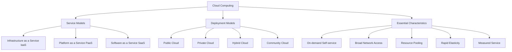

## 2. Cloud Service Models

### Infrastructure as a Service (IaaS)

IaaS provides virtualized computing resources over the internet, including virtual machines, storage, and networking.

**Key Characteristics:**
- Compute resources provided as a service
- Dynamic scaling of resources
- Pay-as-you-go pricing model
- Self-service provisioning
- Managed infrastructure

**Examples:**
- Amazon EC2
- Microsoft Azure Virtual Machines
- Google Compute Engine
- IBM Cloud
- DigitalOcean Droplets

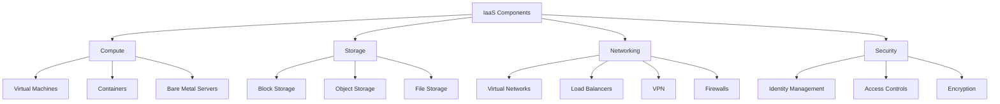

**User Responsibilities:**
- Operating systems
- Applications
- Data
- Runtime
- Middleware

### Platform as a Service (PaaS)

PaaS provides a platform allowing customers to develop, run, and manage applications without the complexity of building and maintaining the infrastructure.

**Key Characteristics:**
- Development tools, database management systems, business analytics
- Ready-to-use development environment
- Integrated deployment, testing, and hosting
- Automatic scaling and high availability
- API integration and middleware

**Examples:**
- Google App Engine
- Microsoft Azure App Service
- AWS Elastic Beanstalk
- Heroku
- IBM Cloud Foundry

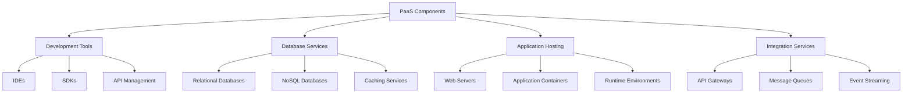

**User Responsibilities:**
- Applications
- Data

### Software as a Service (SaaS)

SaaS delivers software applications over the internet, on a subscription basis, centrally hosted and managed by the service provider.

**Key Characteristics:**
- Web-based access to commercial software
- Applications managed from a central location
- One-to-many delivery model
- Automatic updates
- Subscription-based pricing

**Examples:**
- Microsoft 365
- Google Workspace
- Salesforce
- Dropbox
- Slack

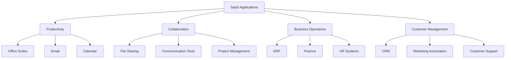

**User Responsibilities:**
- Data
- Access management

### Function as a Service (FaaS)

FaaS is a type of cloud computing service that allows developers to execute code in response to events without managing the underlying infrastructure.

**Key Characteristics:**
- Event-driven execution
- Stateless functions
- Automatic scaling
- Pay only for execution time
- No server management

**Examples:**
- AWS Lambda
- Azure Functions
- Google Cloud Functions
- IBM Cloud Functions
- Cloudflare Workers

## 3. Cloud Deployment Models

### Public Cloud

Public cloud services are delivered over the public internet and shared across organizations.

**Characteristics:**
- Owned and operated by third-party providers
- Available to general public
- Multi-tenant architecture
- Elastic, on-demand resources
- Pay-as-you-go pricing

**Examples:**
- Amazon Web Services (AWS)
- Microsoft Azure
- Google Cloud Platform (GCP)
- IBM Cloud
- Oracle Cloud

### Private Cloud

Private cloud is dedicated solely to a single organization, either managed internally or by a third party.

**Characteristics:**
- Single-tenant environment
- Greater control and customization
- Enhanced security and privacy
- Compliance advantages
- Predictable performance

**Implementation Options:**
- On-premises private cloud
- Hosted private cloud
- Virtual private cloud (VPC)

### Hybrid Cloud

Hybrid cloud combines public and private clouds, allowing data and applications to be shared between them.

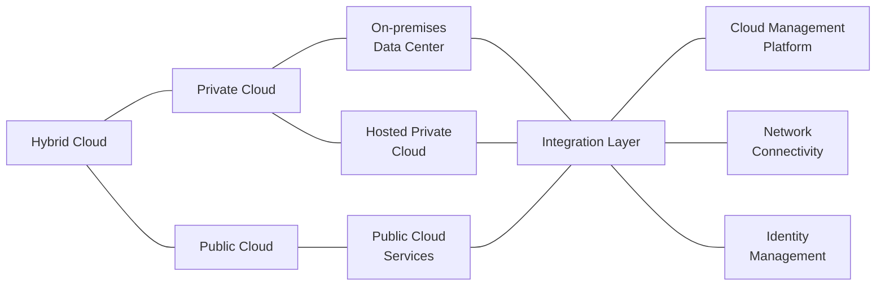

**Characteristics:**
- Workload flexibility
- Data sovereignty
- Cost optimization
- Scalability with security
- Gradual cloud migration

**Examples:**
- AWS Outposts + AWS public cloud
- Azure Stack + Azure public cloud
- Google Anthos
- IBM Cloud Satellite

### Community Cloud

Community cloud infrastructure is shared among several organizations with common concerns (security, compliance, jurisdiction).

**Characteristics:**
- Shared infrastructure
- Cost sharing among community
- Compliance with industry regulations
- Collaborative governance
- Common security requirements

**Examples:**
- Government clouds
- Healthcare clouds
- Financial services clouds
- Education clouds

## 4. Cloud Computing Benefits and Challenges

### Benefits

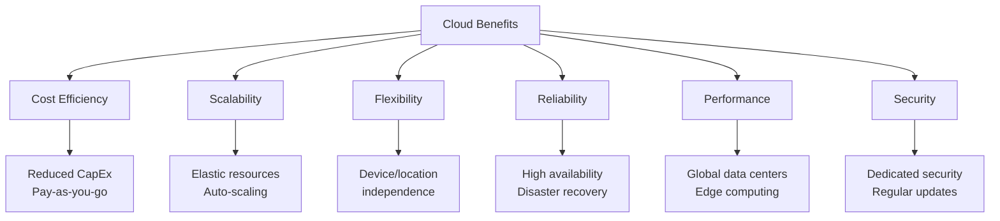

### Challenges

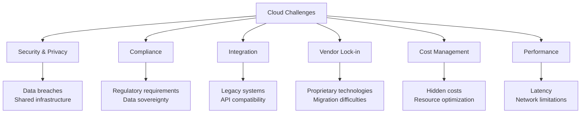

## 5. Cloud Network Concepts

### Virtual Private Cloud (VPC)

A VPC is a logically isolated section of the public cloud where you can launch resources in a virtual network that you define.

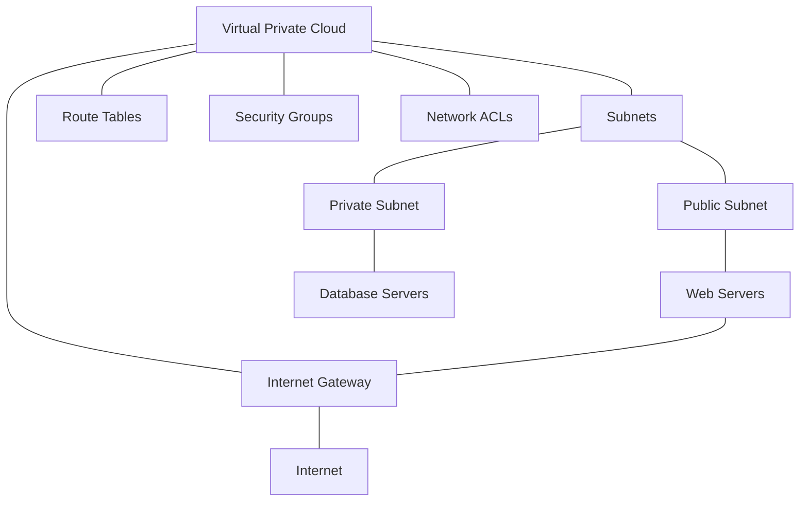

**Key Components:**
- Subnets: Public and private
- Route tables: Control traffic flow
- Internet gateway: Provides internet access
- NAT gateway: Allows private subnet outbound traffic
- Security groups: Firewall for instances
- Network ACLs: Stateless subnet-level security

### Cloud Networking Services

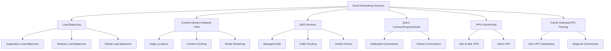

## 6. Software-Defined Networking (SDN)

SDN is an approach to networking that uses software-based controllers or application programming interfaces (APIs) to communicate with underlying hardware infrastructure and direct traffic on a network.

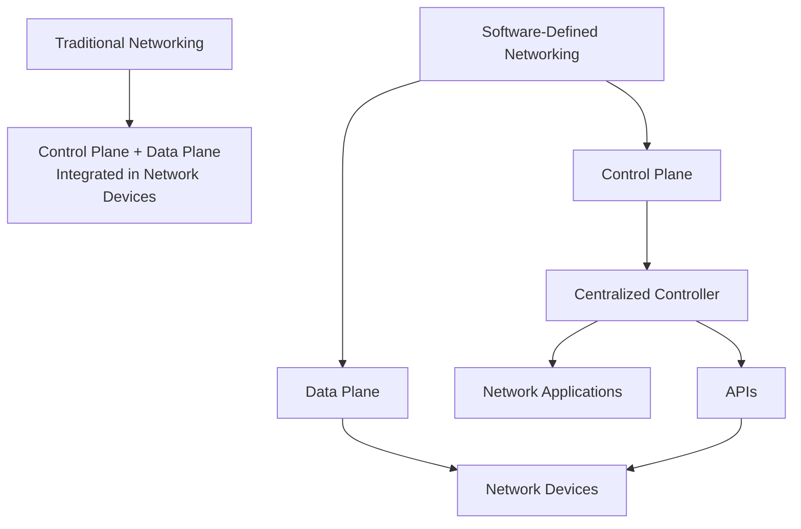

### SDN Architecture

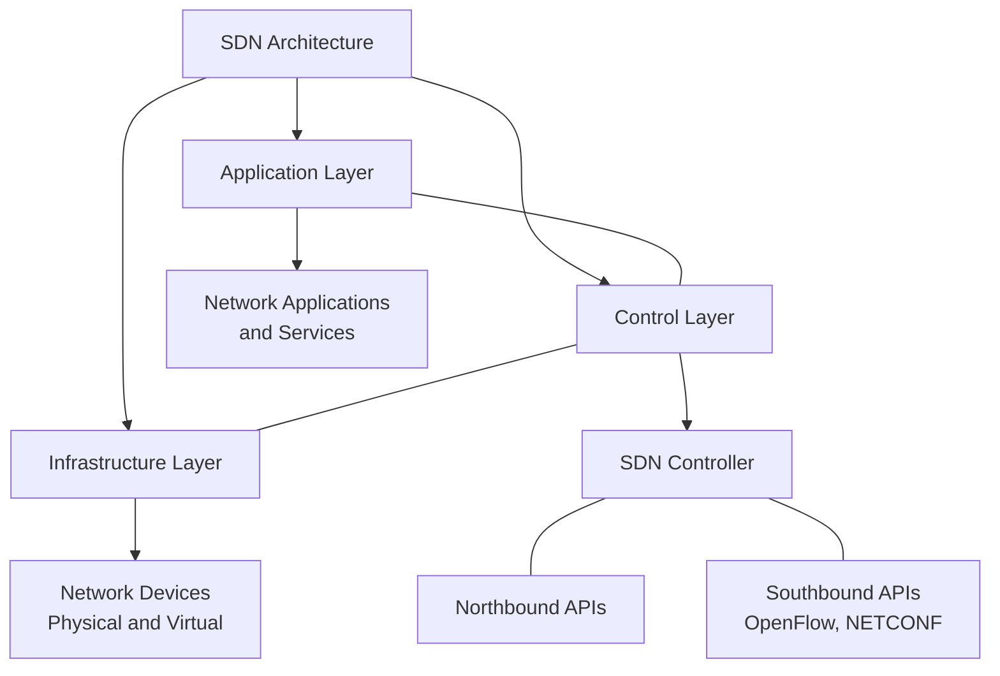

**Application Layer:**
- Business applications
- Network services (firewalls, load balancing)
- Orchestration tools
- Uses northbound APIs to communicate with the control layer

**Control Layer:**
- SDN controller(s)
- Network state information
- Policy management
- Uses southbound APIs to communicate with infrastructure

**Infrastructure Layer:**
- Physical and virtual switches/routers
- Packet forwarding
- Data path functions
- Exposes capabilities via southbound APIs

### SDN Controllers

SDN controllers provide a centralized view of the overall network and enable administrators to dictate to the underlying systems how the forwarding plane should handle network traffic.

**Examples:**
- OpenDaylight
- ONOS (Open Network Operating System)
- VMware NSX
- Cisco ACI
- Juniper Contrail

### SDN Protocols

**OpenFlow:**
The first standard communication interface defined between the control and forwarding layers of an SDN architecture.

**OpenFlow Operations:**
- Controller-to-switch messages
- Asynchronous messages
- Symmetric messages
- Flow table programming

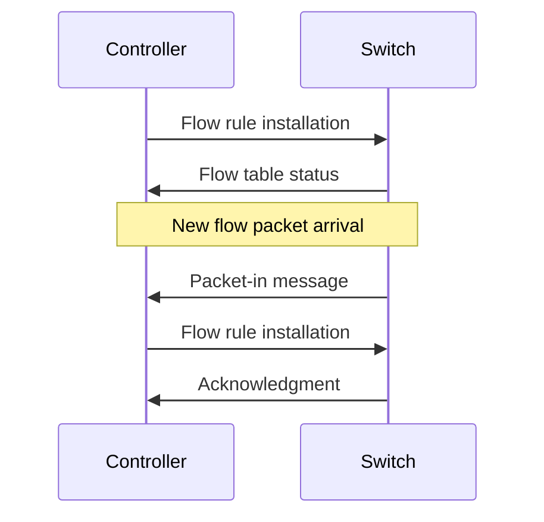

**Other SDN Protocols:**
- NETCONF/YANG
- OVSDB (Open vSwitch Database Management Protocol)
- P4 (Programming Protocol-independent Packet Processors)
- gRPC/gNMI

### SDN Benefits

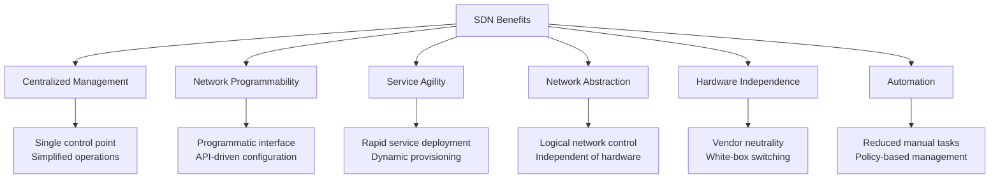

### SDN Use Cases

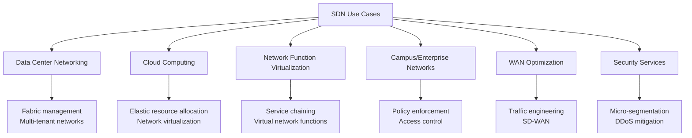

## 7. Network Function Virtualization (NFV)

NFV decouples network functions from proprietary hardware appliances and runs them as software on standard servers.

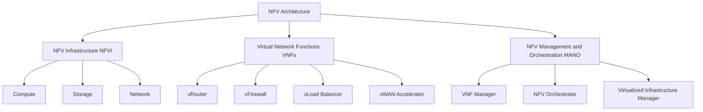

**Benefits of NFV:**
- Reduced hardware costs
- Faster service deployment
- Scalability and flexibility
- Reduced power consumption
- Vendor independence

## 8. SD-WAN (Software-Defined Wide Area Network)

SD-WAN is a software-defined approach to managing wide-area networks, simplifying branch office connectivity and providing centralized control.

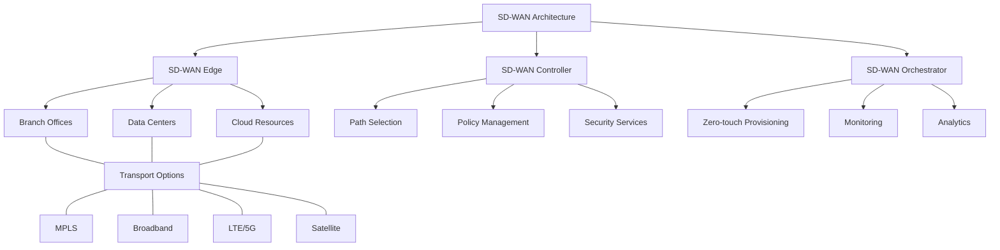

**Key Capabilities:**
- Application-aware routing
- Dynamic path selection
- Transport independence
- Centralized policy management
- Integrated security
- Zero-touch provisioning
- Real-time analytics

**Benefits:**
- Reduced WAN costs
- Improved application performance
- Simplified operations
- Enhanced security
- Business agility
- Cloud connectivity

## Additional Resources

- [NIST Definition of Cloud Computing](https://nvlpubs.nist.gov/nistpubs/Legacy/SP/nistspecialpublication800-145.pdf)
- [AWS Cloud Computing](https://aws.amazon.com/what-is-cloud-computing/)
- [Microsoft Azure Cloud Computing](https://azure.microsoft.com/en-us/overview/what-is-cloud-computing/)
- [Google Cloud](https://cloud.google.com/learn/what-is-cloud-computing)
- [Open Networking Foundation](https://opennetworking.org/)
- [OpenDaylight Project](https://www.opendaylight.org/)
- [ETSI NFV](https://www.etsi.org/technologies/nfv)

## Practice Questions

1. Compare and contrast IaaS, PaaS, and SaaS, providing examples of each. For a startup developing a new web application, which service model would you recommend and why?

2. Explain the differences between public, private, and hybrid cloud deployment models. What factors would an organization consider when choosing between these models?

3. Describe the key components of a Virtual Private Cloud (VPC) and how they work together to provide network isolation and security in a public cloud environment.

4. How does Software-Defined Networking (SDN) differ from traditional networking? Explain the three layers of the SDN architecture and their interactions.

5. Describe how Network Function Virtualization (NFV) and SD-WAN are transforming enterprise networking. What benefits do these technologies provide compared to traditional approaches?
