# Day 14: Network Security

## Topics Covered
- Network Security Fundamentals
- Security Devices and Solutions
- Cryptography and VPNs
- Security Policies and Best Practices

## 1. Introduction to Network Security

Network security consists of policies, practices, and technologies designed to protect network infrastructure, data, and communications from unauthorized access, misuse, malfunction, modification, destruction, or improper disclosure.

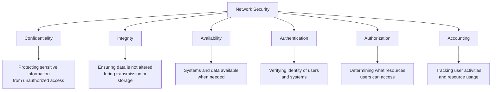

## 2. Network Security Threats

```mermaid
graph TD
    A[Network Security Threats] --> B[Malware]
    A --> C[Social Engineering]
    A --> D[Network Attacks]
    A --> E[Physical Threats]
    A --> F[Advanced Persistent Threats]
    
    B --> B1[Viruses]
    B --> B2[Worms]
    B --> B3[Trojans]
    B --> B4[Ransomware]
    B --> B5[Spyware]
    
    C --> C1[Phishing]
    C --> C2[Pretexting]
    C --> C3[Baiting]
    C --> C4[Tailgating]
    
    D --> D1[DoS/DDoS]
    D --> D2[Man-in-the-Middle]
    D --> D3[Packet Sniffing]
    D --> D4[IP Spoofing]
    D --> D5[ARP Poisoning]
    
    E --> E1[Theft]
    E --> E2[Unauthorized Access]
    E --> E3[Natural Disasters]
    
    F --> F1[Targeted attacks]
    F --> F2[Long-term presence]
    F --> F3[Multiple attack vectors]
```

### Malware

Malware (malicious software) is designed to damage, disrupt, or gain unauthorized access to systems.

**Types of Malware:**

- **Viruses**: Self-replicating malicious code that attaches to legitimate programs
- **Worms**: Self-replicating malware that spreads across networks without user interaction
- **Trojans**: Malware disguised as legitimate software
- **Ransomware**: Encrypts files and demands payment for decryption
- **Spyware**: Gathers information without consent
- **Rootkits**: Conceals presence and maintains privileged access
- **Keyloggers**: Records keystrokes to capture sensitive information
- **Adware**: Displays unwanted advertisements
- **Botnets**: Networks of compromised computers controlled remotely

### Social Engineering

Social engineering exploits human psychology to gain access to systems or information.

**Common Techniques:**

- **Phishing**: Fraudulent attempts to obtain sensitive information by impersonating trustworthy entities
- **Spear Phishing**: Targeted phishing attacks against specific individuals or organizations
- **Pretexting**: Creating a fabricated scenario to obtain information
- **Baiting**: Offering something enticing to entrap the victim
- **Tailgating**: Following someone to gain unauthorized physical access
- **Quid Pro Quo**: Offering a service in exchange for information
- **Vishing**: Voice phishing using phone calls

### Network Attacks

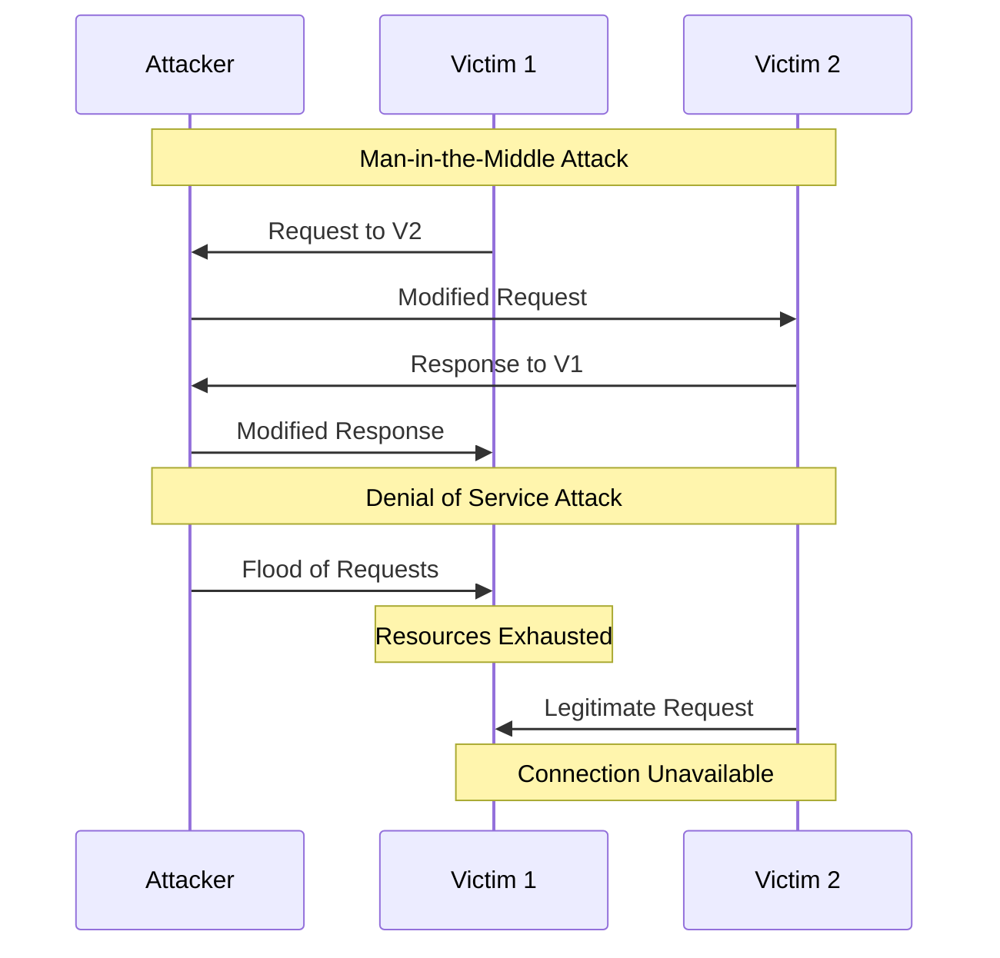

**Common Network Attacks:**

- **Denial of Service (DoS)**: Overwhelms systems to prevent legitimate access
- **Distributed Denial of Service (DDoS)**: DoS from multiple sources
- **Man-in-the-Middle (MitM)**: Intercepts and potentially alters communications
- **Packet Sniffing**: Captures and analyzes network traffic
- **IP Spoofing**: Falsifies source IP address to impersonate another system
- **ARP Poisoning**: Corrupts ARP tables to redirect traffic
- **DNS Poisoning**: Corrupts DNS resolver cache to redirect traffic
- **Session Hijacking**: Takes over a valid user session
- **SQL Injection**: Attacks database through malicious SQL code
- **Cross-Site Scripting (XSS)**: Injects malicious scripts into web pages
- **Cross-Site Request Forgery (CSRF)**: Tricks users into executing unwanted actions

## 3. Network Security Devices and Solutions

### Firewalls

Firewalls monitor and control incoming and outgoing network traffic based on predetermined security rules.

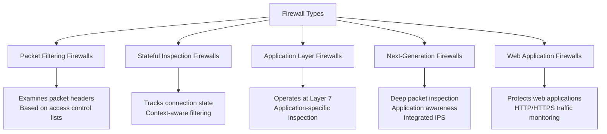

**Firewall Deployment Models:**

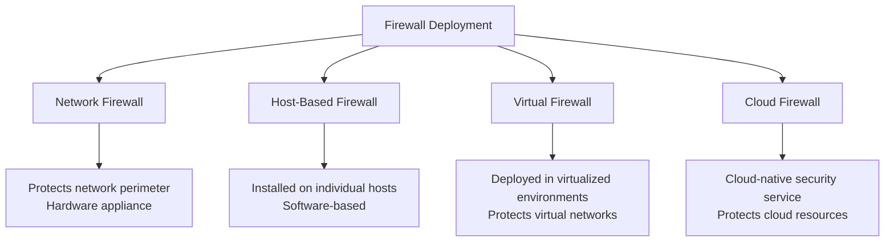

### Intrusion Detection and Prevention Systems

**Intrusion Detection System (IDS)**: Monitors network traffic for suspicious activity and issues alerts when detected.

**Intrusion Prevention System (IPS)**: Monitors network traffic like an IDS but can also take actions to prevent detected threats.

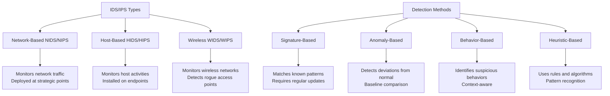

### Network Access Control (NAC)

NAC enforces security policies on devices seeking to access network resources.

**Key Functions:**
- Pre-admission endpoint security checks
- Post-admission controls and monitoring
- Guest network access management
- IoT device security
- Compliance enforcement

**Implementation Types:**
- Agent-based
- Agentless
- Out-of-band
- Inline

### Security Information and Event Management (SIEM)

SIEM provides real-time analysis of security alerts generated by applications and network hardware.

**Capabilities:**
- Log collection and aggregation
- Correlation of events
- Alerting
- Dashboards and reporting
- Forensic analysis
- Compliance reporting

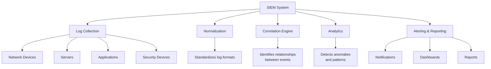

### Web Security Gateway

Web security gateways filter unwanted software/malware from user-initiated web/internet traffic and enforce corporate and regulatory policy compliance.

**Features:**
- URL filtering
- Content inspection
- Malware scanning
- Data loss prevention
- Application control
- HTTPS inspection

### Email Security Gateway

Email security gateways protect against email-based threats.

**Capabilities:**
- Anti-spam filtering
- Anti-virus scanning
- Phishing protection
- Data loss prevention
- Email encryption
- Content filtering

## 4. Cryptography and VPNs

### Cryptography Fundamentals

Cryptography is the practice of secure communication in the presence of adversaries.

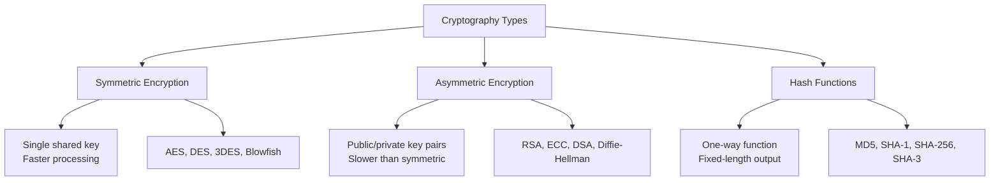

**Encryption Process:**

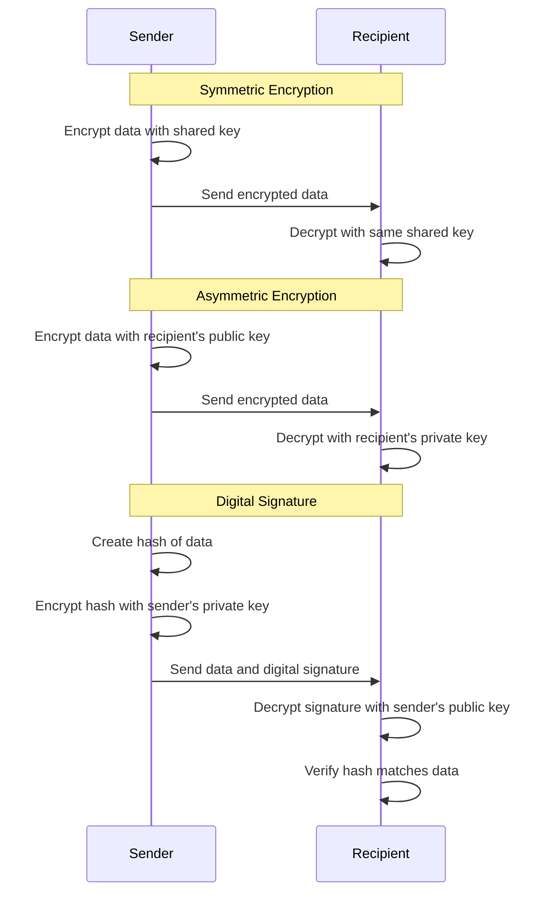

### Public Key Infrastructure (PKI)

PKI is a framework for managing digital certificates and public-key encryption.

**Components:**
- Certificate Authority (CA)
- Registration Authority (RA)
- Certificate database
- Certificate store
- Key backup and recovery system

**Certificate Lifecycle:**
1. Certificate request
2. Verification and validation
3. Certificate issuance
4. Certificate distribution
5. Certificate revocation
6. Certificate expiration and renewal

### Virtual Private Networks (VPNs)

VPNs extend a private network across a public network, enabling users to send and receive data as if their devices were directly connected to the private network.

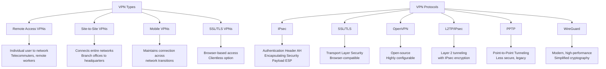

**IPsec VPN Modes:**

- **Transport Mode**: Encrypts only the payload/data portion of packets
- **Tunnel Mode**: Encrypts entire original packet

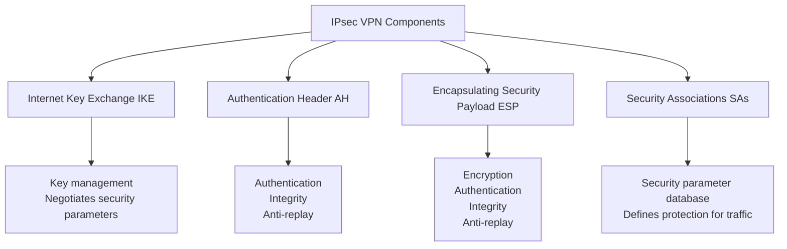

## 5. Network Security Policies and Best Practices

### Security Policies

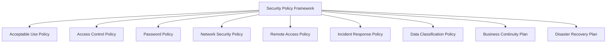

**Policy Development Process:**
1. Risk assessment
2. Policy development
3. Review and approval
4. Implementation
5. Training and awareness
6. Monitoring and enforcement
7. Regular review and updates

### Defense in Depth

Defense in depth implements multiple layers of security controls throughout the IT environment.

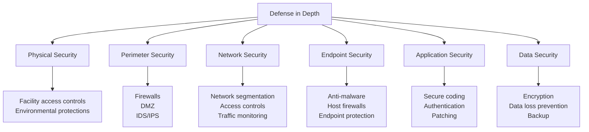

### Network Segmentation

Network segmentation divides a network into multiple segments or subnets, each acting as its own small network.

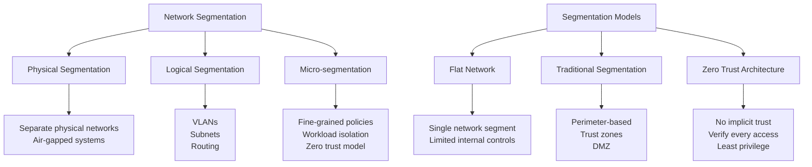

**Benefits of Segmentation:**
- Limits attack surface
- Contains security breaches
- Protects sensitive data
- Reduces scope of compliance
- Improves performance

### Zero Trust Security

Zero Trust is a security framework that requires strict identity verification for every person and device trying to access resources, regardless of whether they are inside or outside the network perimeter.

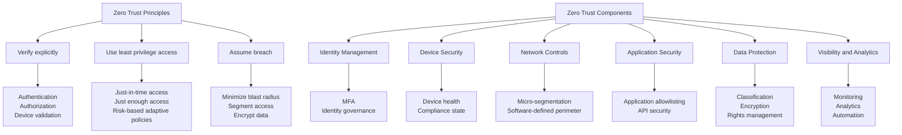

### Security Monitoring and Incident Response

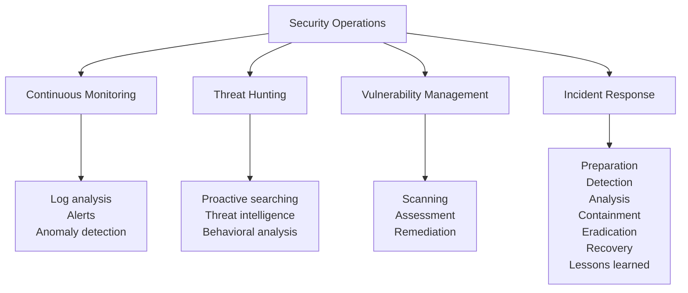

**Incident Response Process:**
1. **Preparation**: Develop IR plan, train team, prepare tools
2. **Detection**: Identify potential security incidents
3. **Analysis**: Investigate and confirm incidents
4. **Containment**: Isolate affected systems
5. **Eradication**: Remove malware, close vulnerabilities
6. **Recovery**: Restore systems to normal operation
7. **Lessons Learned**: Document findings, improve process

### Security Compliance and Standards

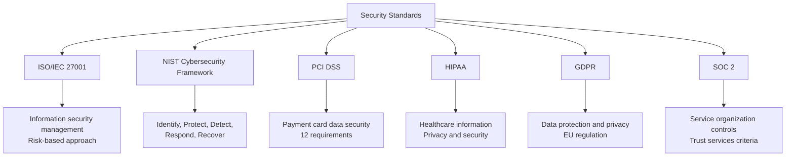

## 6. Network Security Best Practices

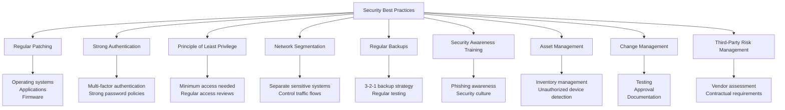

**Specific Implementation Recommendations:**

- Implement multi-factor authentication (MFA) for all remote access
- Use network time protocol (NTP) for consistent timestamps
- Deploy centralized logging and monitoring
- Conduct regular vulnerability assessments and penetration testing
- Develop and test incident response and disaster recovery plans
- Encrypt sensitive data at rest and in transit
- Implement email and web content filtering
- Disable unnecessary services and ports
- Segment IoT devices from corporate networks
- Implement DNS filtering to block malicious domains

## Additional Resources

- [NIST Cybersecurity Framework](https://www.nist.gov/cyberframework)
- [SANS Internet Storm Center](https://isc.sans.edu/)
- [OWASP (Open Web Application Security Project)](https://owasp.org/)
- [US-CERT (United States Computer Emergency Readiness Team)](https://www.cisa.gov/us-cert)
- [Center for Internet Security (CIS)](https://www.cisecurity.org/)

## Practice Questions

1. Compare and contrast network-based and host-based intrusion detection systems. What are the advantages and limitations of each approach?

2. Explain the concept of defense in depth and how it can be implemented in a corporate network environment. Provide specific examples for each security layer.

3. A company is implementing a zero trust security model. Describe the key principles and components required for this implementation, and how it differs from traditional perimeter-based security.

4. Analyze the different types of VPN technologies and protocols. For a remote workforce scenario, which VPN solution would you recommend and why?

5. Describe the incident response process for handling a suspected ransomware attack. What immediate steps should be taken to contain the incident and minimize damage?
