# Day 14: Transport Layer

<div align="center">
  
  <h1>🚢 Transport Layer: Delivering Data End-to-End 🚢</h1>
  
  <p>
    
    
    
    
  </p>
  
  <hr>
</div>

## Table of Contents
- [Introduction to the Transport Layer](#introduction-to-the-transport-layer)
- [Multiplexing and Demultiplexing](#multiplexing-and-demultiplexing)
- [Transport Layer Protocols](#transport-layer-protocols)
- [Checksums and Error Detection](#checksums-and-error-detection)
- [Transport Layer Timers](#transport-layer-timers)
- [Flow Control](#flow-control)
- [Congestion Control](#congestion-control)
- [Connection Management](#connection-management)
- [Socket Programming](#socket-programming)
- [Transport Layer Security](#transport-layer-security)
- [Practice Questions](#practice-questions)
- [Additional Resources](#additional-resources)

## Introduction to the Transport Layer

The Transport Layer is the fourth layer in the OSI model (Layer 4) and sits between the Application Layer and the Network Layer. In the TCP/IP model, it's the third layer positioned between the Application Layer and the Internet Layer.


### Key Functions of the Transport Layer

The Transport Layer serves as a critical intermediary, providing several essential functions:

1. **Process-to-Process Communication**: Creates logical connections between specific applications running on different hosts, not just between the hosts themselves.

2. **Multiplexing and Demultiplexing**: Enables multiple applications to share network resources simultaneously through port numbers.

3. **Reliability Mechanisms**: Provides error detection, retransmission, and ordered delivery (in reliable protocols like TCP).

4. **Flow Control**: Prevents the sender from overwhelming the receiver with too much data too quickly.

5. **Congestion Control**: Monitors and responds to network congestion to prevent collapse.

6. **Segmentation and Reassembly**: Breaks large messages into smaller segments for transmission and reassembles them at the destination.

### Transport Layer PDUs

The Protocol Data Unit (PDU) at the Transport Layer is called:
- **Segment** for TCP (Transmission Control Protocol)
- **Datagram** for UDP (User Datagram Protocol)

Each contains:
- Transport layer header with control information
- Payload data from the application layer

## Multiplexing and Demultiplexing

Multiplexing and demultiplexing are fundamental operations that allow multiple applications to share the network infrastructure simultaneously.

### The Need for Multiplexing

Imagine a computer running multiple network applications simultaneously:
- Web browser loading several websites
- Email client checking messages
- Video conferencing application
- Music streaming service
- Online game

All these applications need to send and receive data concurrently over the same network connection. Without multiplexing, only one application could use the network at a time.


### How Multiplexing Works

1. Each application is assigned a unique identifier called a **port number**
2. The Transport Layer adds source and destination port numbers to each segment/datagram
3. Data from multiple applications is sent through the network layer with these identifiers
4. At the destination, the Transport Layer uses the port numbers to deliver data to the correct application

### Port Numbers

Port numbers are 16-bit values (0-65535) that identify specific applications or services:

- **Well-known ports** (0-1023): Reserved for common services
  - 20/21: FTP (File Transfer Protocol)
  - 22: SSH (Secure Shell)
  - 25: SMTP (Simple Mail Transfer Protocol)
  - 53: DNS (Domain Name System)
  - 80: HTTP (Hypertext Transfer Protocol)
  - 443: HTTPS (HTTP Secure)

- **Registered ports** (1024-49151): Registered with IANA for specific services
  - 1194: OpenVPN
  - 3306: MySQL
  - 5432: PostgreSQL
  - 8080: Alternative HTTP port

- **Dynamic/private ports** (49152-65535): Used for temporary or private connections

### Demultiplexing Process

Demultiplexing is the process of delivering received segments/datagrams to the correct application based on port numbers:


### UDP Demultiplexing

In UDP, demultiplexing is based solely on the destination port number:
1. Transport layer extracts destination port from UDP header
2. Delivers datagram to socket with matching port number
3. Multiple datagrams with same destination port go to same socket

```
Socket identified by: (destination IP, destination port)
```

### TCP Demultiplexing

TCP demultiplexing is more complex, using a 4-tuple to identify the correct socket:
1. Source IP address
2. Source port number
3. Destination IP address
4. Destination port number

```
Socket identified by: (source IP, source port, destination IP, destination port)
```

This allows multiple connections to the same server application (same destination port) from different clients or even multiple connections from the same client to be distinguished.

### Multiplexing/Demultiplexing in Action

Example scenario: A client computer with IP 192.168.1.100 browsing two different web servers simultaneously

```
Connection 1:
- Source: 192.168.1.100, Port 49152
- Destination: 93.184.216.34 (example.com), Port 80

Connection 2:
- Source: 192.168.1.100, Port 49153
- Destination: 172.217.167.78 (google.com), Port 80
```

The Transport Layer keeps these connections separate through the unique 4-tuple combinations, even though both use destination port 80.

### Socket Programming and Multiplexing

In programming, sockets are the API that applications use to access the Transport Layer:

```python
# Server socket binding to a specific port
server_socket = socket.socket(socket.AF_INET, socket.SOCK_STREAM)  # TCP socket
server_socket.bind(('0.0.0.0', 8080))  # Bind to port 8080
server_socket.listen(5)

# Client connecting to a specific IP and port
client_socket = socket.socket(socket.AF_INET, socket.SOCK_STREAM)  # TCP socket
client_socket.connect(('example.com', 80))  # Connect to port 80 on example.com
```

The operating system handles the multiplexing/demultiplexing process, ensuring data reaches the correct socket.

## Transport Layer Protocols

The Transport Layer implements several protocols, with TCP and UDP being the most widely used. Each protocol offers different service characteristics to meet various application requirements.

### TCP: Transmission Control Protocol

TCP is a connection-oriented, reliable protocol that ensures ordered and error-checked delivery of data between applications.

#### TCP Header Structure

```
  0                   1                   2                   3
  0 1 2 3 4 5 6 7 8 9 0 1 2 3 4 5 6 7 8 9 0 1 2 3 4 5 6 7 8 9 0 1
 +-+-+-+-+-+-+-+-+-+-+-+-+-+-+-+-+-+-+-+-+-+-+-+-+-+-+-+-+-+-+-+-+
 |          Source Port          |       Destination Port        |
 +-+-+-+-+-+-+-+-+-+-+-+-+-+-+-+-+-+-+-+-+-+-+-+-+-+-+-+-+-+-+-+-+
 |                        Sequence Number                        |
 +-+-+-+-+-+-+-+-+-+-+-+-+-+-+-+-+-+-+-+-+-+-+-+-+-+-+-+-+-+-+-+-+
 |                    Acknowledgment Number                      |
 +-+-+-+-+-+-+-+-+-+-+-+-+-+-+-+-+-+-+-+-+-+-+-+-+-+-+-+-+-+-+-+-+
 |  Data |       |C|E|U|A|P|R|S|F|                               |
 | Offset| Rsrvd |W|C|R|C|S|S|Y|I|            Window             |
 |       |       |R|E|G|K|H|T|N|N|                               |
 +-+-+-+-+-+-+-+-+-+-+-+-+-+-+-+-+-+-+-+-+-+-+-+-+-+-+-+-+-+-+-+-+
 |           Checksum            |         Urgent Pointer        |
 +-+-+-+-+-+-+-+-+-+-+-+-+-+-+-+-+-+-+-+-+-+-+-+-+-+-+-+-+-+-+-+-+
 |                    Options                    |    Padding    |
 +-+-+-+-+-+-+-+-+-+-+-+-+-+-+-+-+-+-+-+-+-+-+-+-+-+-+-+-+-+-+-+-+
 |                             data                              |
 +-+-+-+-+-+-+-+-+-+-+-+-+-+-+-+-+-+-+-+-+-+-+-+-+-+-+-+-+-+-+-+-+
```

#### TCP Header Fields

- **Source Port (16 bits)**: Identifies the sending application
- **Destination Port (16 bits)**: Identifies the receiving application
- **Sequence Number (32 bits)**: 
  - Identifies the position of the first byte in the segment in the overall byte stream
  - Used for ordered delivery and duplicate detection
  
- **Acknowledgment Number (32 bits)**: 
  - Indicates the next sequence number the sender expects to receive
  - Used to confirm receipt of data
  
- **Data Offset (4 bits)**: 
  - Length of TCP header in 32-bit words
  - Minimum value is 5 (20 bytes), maximum is 15 (60 bytes)
  
- **Reserved (6 bits)**: Set to zero, reserved for future use
- **Control Flags (9 bits)**:
  - **CWR** (Congestion Window Reduced): Set by sender to indicate it received a TCP segment with ECE flag
  - **ECE** (ECN-Echo): Used for Explicit Congestion Notification
  - **URG** (Urgent): Indicates urgent data is being transmitted
  - **ACK** (Acknowledgment): Indicates acknowledgment number is valid
  - **PSH** (Push): Tells receiver to deliver data immediately without buffering
  - **RST** (Reset): Aborts the connection in response to an error
  - **SYN** (Synchronize): Initiates a connection
  - **FIN** (Finish): Initiates the termination of a connection
  
- **Window Size (16 bits)**: 
  - Flow control mechanism
  - Number of bytes the receiver is willing to accept
  
- **Checksum (16 bits)**: Error detection for header and data
- **Urgent Pointer (16 bits)**: Points to urgent data (when URG flag is set)
- **Options**: Variable length, optional fields for additional features
  - Maximum Segment Size (MSS)
  - Window Scaling
  - Selective Acknowledgments (SACK)
  - Timestamps

#### Key TCP Features

1. **Connection-Oriented**: Establishes a connection before data transfer through the three-way handshake

2. **Reliable Delivery**:
   - Acknowledgments confirm receipt of data
   - Retransmission of lost segments
   - Checksum for error detection
   - Duplicate detection and elimination

3. **Ordered Delivery**:
   - Sequence numbers ensure data is delivered in order
   - Out-of-order segments are buffered until missing segments arrive

4. **Flow Control**:
   - Prevents overwhelming the receiver
   - Window size field advertises receiver buffer capacity

5. **Congestion Control**:
   - Prevents network congestion
   - Algorithms: Slow Start, Congestion Avoidance, Fast Recovery

### UDP: User Datagram Protocol

UDP is a connectionless, unreliable transport protocol that provides a minimal transport service with lower overhead compared to TCP.

#### UDP Header Structure

```
  0      7 8     15 16    23 24    31
 +--------+--------+--------+--------+
 |     Source      |   Destination   |
 |      Port       |      Port       |
 +--------+--------+--------+--------+
 |                 |                 |
 |     Length      |    Checksum     |
 +--------+--------+--------+--------+
 |                                   |
 |              Data                 |
 |                                   |
 +-----------------------------------+
```

#### UDP Header Fields

- **Source Port (16 bits)**: Optional, can be zero if not used
- **Destination Port (16 bits)**: Required, identifies the receiving application
- **Length (16 bits)**: Length of the UDP header and data in bytes (minimum 8)
- **Checksum (16 bits)**: Optional error detection (although almost always used)

#### Key UDP Features

1. **Connectionless**: No connection establishment or termination
   - No handshaking before sending data
   - No connection state maintained

2. **Unreliable Delivery**:
   - No acknowledgments
   - No retransmission of lost datagrams
   - No guarantee of ordered delivery
   - Datagrams may be duplicated

3. **No Flow Control**: Sender can transmit at any rate

4. **No Congestion Control**: Does not adjust sending rate based on network conditions

5. **Lightweight**: Small header (8 bytes) and minimal processing overhead

6. **Message-oriented**: Preserves message boundaries (unlike TCP's byte stream)

### When to Use TCP vs. UDP

| Application Requirements | Recommended Protocol |
|--------------------------|---------------------|
| Reliability critical | TCP |
| Real-time/low latency | UDP |
| Ordered delivery needed | TCP |
| Minimal overhead needed | UDP |
| Loss-sensitive data | TCP |
| Can handle loss | UDP |
| Streaming media | Often UDP |
| File transfer | TCP |
| Connection state tracking | TCP |
| Firewall-friendly | TCP |

### Other Transport Protocols

1. **SCTP (Stream Control Transmission Protocol)**:
   - Combines features of TCP and UDP
   - Message-oriented like UDP
   - Reliable like TCP
   - Multi-streaming and multi-homing support
   - Used in telecommunications signaling

2. **DCCP (Datagram Congestion Control Protocol)**:
   - Unreliable like UDP
   - Adds congestion control
   - Connection setup/teardown like TCP
   - Suitable for streaming media

3. **QUIC (Quick UDP Internet Connections)**:
   - Developed by Google, now an IETF standard
   - Built on UDP
   - Provides reliability, multiplexing, and congestion control
   - Reduced connection setup time
   - Improved handling of packet loss
   - Forms the basis for HTTP/3

## Checksums and Error Detection

Error detection is a critical function of the Transport Layer, ensuring data integrity during transmission. Both TCP and UDP use checksums, although with different levels of robustness.

### The Need for Error Detection

Data traveling across networks can be corrupted due to:
- Electrical interference on physical media
- Signal degradation over long distances
- Faulty network hardware
- Software bugs in routers or switches
- Random bit flips in memory

The Transport Layer needs to detect these errors to ensure data integrity. Depending on the protocol, it may also attempt to correct errors or request retransmission.

### TCP and UDP Checksum Calculation

Both TCP and UDP use a 16-bit checksum field in their headers. The checksum is calculated over:
- The Transport Layer header
- The data payload
- A "pseudo header" containing IP source and destination addresses

#### Pseudo Header Structure

```
  0                   1                   2                   3
  0 1 2 3 4 5 6 7 8 9 0 1 2 3 4 5 6 7 8 9 0 1 2 3 4 5 6 7 8 9 0 1
 +-+-+-+-+-+-+-+-+-+-+-+-+-+-+-+-+-+-+-+-+-+-+-+-+-+-+-+-+-+-+-+-+
 |                       Source Address                          |
 +-+-+-+-+-+-+-+-+-+-+-+-+-+-+-+-+-+-+-+-+-+-+-+-+-+-+-+-+-+-+-+-+
 |                    Destination Address                        |
 +-+-+-+-+-+-+-+-+-+-+-+-+-+-+-+-+-+-+-+-+-+-+-+-+-+-+-+-+-+-+-+-+
 |     Zeros    |    Protocol   |   TCP/UDP Length (16 bits)     |
 +-+-+-+-+-+-+-+-+-+-+-+-+-+-+-+-+-+-+-+-+-+-+-+-+-+-+-+-+-+-+-+-+
```

The pseudo header includes IP-layer information, creating a link between the Network and Transport layers to ensure that segments/datagrams have reached the correct destination.

#### Checksum Algorithm

The checksum algorithm works as follows:

1. The checksum field in the header is initially set to zero
2. The data to be checksummed (including the pseudo header) is divided into 16-bit words
3. If the total number of bytes is odd, a padding byte of zero is added
4. All 16-bit words are added together using one's complement arithmetic
5. The one's complement (bit flip) of the sum becomes the checksum
6. The checksum is inserted into the header

```
Example:
Words to sum: 0x4500, 0x0030, 0x0000, 0x4000, 0x4006, 0x0000, ...
Sum: 0x85DD
One's complement: 0x7A22 (checksum value)
```

#### Checksum Verification

When a segment/datagram is received:

1. The receiver calculates the checksum over the entire segment/datagram (including the received checksum value)
2. If the result is all 1s (0xFFFF), the data is considered valid
3. Any other result indicates an error in transmission

### Limitations of Transport Layer Checksums

The 16-bit checksum has several limitations:

1. **Detection Capability**: Cannot detect all possible errors
   - Some bit patterns that cancel each other out will go undetected
   - Error detection probability is approximately 99.998%

2. **No Error Correction**: Only detects errors, doesn't correct them

3. **Overhead vs. Protection Balance**: More robust error detection would require more overhead

4. **Checksum Offloading**: Modern network interfaces often perform checksum calculation in hardware
   - Reduces CPU load
   - May hide certain types of memory errors

### TCP's Response to Checksum Errors

When TCP detects a checksum error:
1. The corrupted segment is silently discarded
2. No acknowledgment is sent for the discarded segment
3. The sender will eventually time out and retransmit the segment
4. This process is part of TCP's reliability mechanism

### UDP's Response to Checksum Errors

When UDP detects a checksum error:
1. The corrupted datagram is discarded
2. No notification is sent to either the sender or the receiving application
3. It's up to the application layer to implement any needed reliability mechanisms

### Additional Error Detection in TCP

TCP implements additional error detection mechanisms beyond checksums:

1. **Sequence Numbers**: Detect missing or duplicate segments
   - Each byte in the data stream has a sequence number
   - Receiver can identify gaps or duplicates

2. **Acknowledgment Numbers**: Track which data has been received
   - Confirms receipt of data up to a specific sequence number
   - Used to trigger retransmissions

3. **Timeouts**: Detect completely lost segments
   - If no acknowledgment is received within a timeout period, the segment is considered lost
   - Triggers retransmission

### CRC vs. Checksum

While Transport Layer protocols use checksums, the Data Link Layer typically uses CRC (Cyclic Redundancy Check):

| Feature | Checksum | CRC |
|---------|----------|-----|
| Computation Complexity | Simple addition | Polynomial division |
| Error Detection Capability | Good | Excellent |
| Overhead | Usually 16 or 32 bits | 16 to 32 bits typically |
| Implementation | Easy (software) | More complex (often hardware) |
| Burst Error Detection | Limited | Strong |

### Error Detection vs. Correction

Transport Layer protocols focus on error detection rather than correction:

1. **Error Detection**: Identifies that data has been corrupted
   - Used by both TCP and UDP
   - Lower overhead

2. **Error Correction**: Reconstructs the original data without retransmission
   - Not implemented at the Transport Layer
   - Some application protocols implement it
   - Higher overhead (requires redundant data)

In TCP, error recovery is handled through retransmission rather than forward error correction, which is more bandwidth-efficient for most internet communication.

## Transport Layer Timers

Timers play a crucial role in the Transport Layer, particularly in TCP, where they drive various reliability mechanisms. These timers help manage retransmissions, connection states, and performance optimization.

### Retransmission Timeout (RTO)

The Retransmission Timeout is the most important timer in TCP, determining when to retransmit unacknowledged segments.

#### RTO Calculation

Early TCP implementations used a fixed RTO, but modern TCP uses an adaptive algorithm that adjusts based on network conditions:

1. **RTT Measurement**: TCP measures the Round-Trip Time (RTT) for segments
   - Time between sending a segment and receiving its acknowledgment
   - Multiple RTT samples are collected

2. **SRTT Calculation**: Smoothed Round-Trip Time
   - SRTT = (1 - α) × SRTT + α × RTT
   - α is typically 1/8 (0.125)
   - Provides a weighted average that adapts to changing conditions

3. **RTT Variation (RTTVAR) Calculation**:
   - RTTVAR = (1 - β) × RTTVAR + β × |SRTT - RTT|
   - β is typically 1/4 (0.25)
   - Measures the variability in RTT measurements

4. **RTO Calculation**:
   - RTO = SRTT + 4 × RTTVAR
   - Minimum value is typically 1 second
   - Maximum value is typically 60-120 seconds

```
Example:
Current SRTT = 100ms, RTTVAR = 20ms
New RTT measurement = 120ms

New SRTT = 0.875 × 100ms + 0.125 × 120ms = 102.5ms
New RTTVAR = 0.75 × 20ms + 0.25 × |102.5ms - 120ms| = 19.4ms
New RTO = 102.5ms + 4 × 19.4ms = 180.1ms
```

#### Exponential Backoff

When a segment is retransmitted but still not acknowledged:
1. The RTO is doubled for each subsequent retransmission
2. This prevents network congestion during persistent failures
3. Example: 200ms → 400ms → 800ms → 1.6s → 3.2s → ...
4. After a certain number of retransmissions (typically 5-12), the connection is terminated

#### Timer Granularity

The operating system's timer granularity affects RTO precision:
- Traditional systems had coarse granularity (500ms)
- Modern systems typically have finer granularity (1-10ms)
- Coarse granularity can lead to suboptimal performance
- RFC 6298 recommends clock granularity of 1ms or finer

### Persistent Timer

The Persistent Timer handles the "Zero Window" condition in flow control:

1. When a receiver advertises a window size of zero, the sender stops transmission
2. The sender starts the persistent timer
3. When the timer expires, the sender sends a small "window probe" segment
4. This prevents deadlock if the window update from the receiver is lost
5. Typically set to RTO value initially, then uses exponential backoff


### Keepalive Timer

The Keepalive Timer detects and handles dead connections:

1. When a connection is idle (no data exchange) for too long
2. TCP sends a keepalive probe (empty segment with ACK flag)
3. If no response after several probes, the connection is terminated
4. Default values (configurable):
   - Idle time before first probe: 2 hours
   - Probe interval: 75 seconds
   - Max probes before termination: 9

The keepalive mechanism is optional and disabled by default in many implementations. Applications can enable it through socket options.

### TIME_WAIT Timer (2MSL Timer)

After actively closing a TCP connection, the closing side enters the TIME_WAIT state:

1. Remains in TIME_WAIT for 2 × MSL (Maximum Segment Lifetime)
2. MSL is the maximum time a segment can exist in the network (typically 30-120 seconds)
3. Purpose:
   - Ensures that any delayed segments from the connection are handled properly
   - Allows all in-flight segments to expire before reusing the socket
   - Prevents potential confusion with subsequent connections using the same ports

```mermaid
graph TD
    A[ESTABLISHED] -->|"Close, Send FIN"| B[FIN_WAIT_1]
    B -->|"Receive ACK"| C[FIN_WAIT_2]
    C -->|"Receive FIN, Send ACK"| D[TIME_WAIT]
    D -->|"2 × MSL Timeout"| E[CLOSED]
```



### Connection Establishment Timer

When a TCP client sends a SYN segment to initiate a connection:

1. A connection establishment timer starts
2. If no SYN-ACK is received before timeout (typically 3-6 seconds)
3. The client retransmits the SYN
4. After multiple attempts (usually 3-5), the connection attempt is abandoned
5. User receives "Connection timed out" error

### Delayed ACK Timer

To reduce overhead, TCP often delays sending ACKs:

1. When data is received, start delayed ACK timer (typically 200ms)
2. If more data arrives before timer expires, send a single ACK for both segments
3. If timer expires with no additional data, send the ACK
4. Improves efficiency by reducing the number of pure ACK segments

### Impact of Timers on TCP Performance

These timers significantly impact TCP performance:

1. **RTO Accuracy**:
   - Too short: Unnecessary retransmissions waste bandwidth
   - Too long: Slow recovery from packet loss

2. **Initial RTO Setting**:
   - Critical for new connections with no RTT history
   - RFC 6298 recommends 1 second initially

3. **Timer Interactions**:
   - Multiple timers may be active simultaneously
   - Complex interactions affect overall behavior

4. **TCP Timer Implementations**:
   - Vary across operating systems
   - Tunable parameters for performance optimization
   - Optimized for different network environments

## Flow Control

Flow control is a mechanism to prevent a sender from overwhelming a receiver with data. It ensures that a fast sender doesn't transmit more data than a slower receiver can process.

### The Need for Flow Control

Different devices have different processing capabilities and buffer sizes:
- A powerful server might generate data very quickly
- A mobile device with limited resources might process data more slowly
- Network conditions can vary, affecting data delivery rates
- Applications may not consume received data immediately

Without flow control, these scenarios could lead to:
- Buffer overflow at the receiver
- Packet loss due to buffer exhaustion
- Inefficient retransmissions
- Overall degraded performance

### TCP Flow Control Mechanism

TCP implements flow control through the sliding window mechanism:

1. **Receive Window (rwnd)**:
   - Each TCP receiver maintains a receive buffer
   - The available space in this buffer is advertised as the "receive window"
   - Communicated in the Window Size field of the TCP header (16 bits)
   - Maximum value is 65,535 bytes (without window scaling)

2. **Window Advertisement**:
   - The receiver includes the current rwnd value in every ACK sent
   - This informs the sender how much more data the receiver can accept
   - Updates dynamically as the application consumes data from the buffer

3. **Sender Behavior**:
   - Tracks two variables:
     - LastByteSent: sequence number of last byte sent
     - LastByteAcked: sequence number of last byte acknowledged
   - Must ensure: LastByteSent - LastByteAcked ≤ rwnd
   - If rwnd = 0, sender stops transmitting except for window probes


### Zero Window Condition

When a receiver's buffer fills completely:

1. Receiver advertises rwnd = 0
2. Sender stops regular transmission
3. Sender starts the persistent timer
4. When the timer expires, sender sends a "window probe"
5. Receiver responds with current window size
6. If still zero, process repeats; if non-zero, transmission resumes


### Window Scaling Option

The standard TCP window size field is 16 bits, limiting the maximum window to 65,535 bytes. This is insufficient for high-bandwidth, high-latency networks (the "bandwidth-delay product" problem).

TCP's Window Scaling option (RFC 7323) addresses this:

1. Defined during connection setup in the SYN segments
2. Specifies a scale factor from 0 to 14
3. The actual window size is calculated as: Window Size field × 2^(scale factor)
4. Allows windows up to 1 GB (with maximum scale factor of 14)

Example:
- Window Size field = 4000
- Scale factor = 3
- Actual window size = 4000 × 2^3 = 4000 × 8 = 32,000 bytes

### Silly Window Syndrome

Silly Window Syndrome is a flow control problem where small amounts of data are transferred inefficiently:

1. **Problem**:
   - Receiver advertises a small window increment
   - Sender sends a small segment to fill that window
   - Creates a cycle of tiny segments
   - Overhead (40-byte TCP/IP header) dominates actual data

2. **Solutions**:
   - **Clark's Solution (Receiver-side)**: Receiver doesn't advertise window increases until either:
     - Window can increase by at least one MSS, or
     - Receive buffer is at least half empty
   
   - **Nagle's Algorithm (Sender-side)**:
     - Only one small segment can be outstanding at a time
     - Additional small segments are held until either:
       - A full MSS of data accumulates, or
       - The outstanding segment is acknowledged

### Dynamic Window Sizing

Modern TCP implementations use dynamic window sizing to optimize performance:

1. **Auto-tuning**:
   - OS dynamically adjusts receive buffer size based on:
     - Memory availability
     - Application read patterns
     - Network conditions
   - Window size grows if data is being consumed quickly
   - Window size shrinks if data consumption is slow

2. **TCP Buffer Sizes**:
   - Linux defaults (can be tuned):
     - Minimum: 4 KB
     - Default: 87,380 bytes
     - Maximum: 6 MB
   - Windows 10:
     - Uses dynamic receive window auto-tuning
     - Adjusts based on bandwidth-delay product

### Relationship Between Flow Control and Congestion Control

Flow control and congestion control are distinct but related mechanisms:

| Aspect | Flow Control | Congestion Control |
|--------|-------------|-------------------|
| Purpose | Protects the receiver | Protects the network |
| Concern | Receiver's capacity | Network's capacity |
| Mechanism | Receive window (rwnd) | Congestion window (cwnd) |
| Advertised By | Receiver | Not advertised (sender managed) |
| Sender Limit | min(rwnd, cwnd) | min(rwnd, cwnd) |

A TCP sender always respects the most restrictive of the two windows, sending at most min(rwnd, cwnd) bytes beyond the last acknowledged byte.

## Congestion Control

Congestion control is a critical mechanism in TCP that prevents the network from becoming overloaded. It ensures fair sharing of network resources and prevents "congestion collapse" where network throughput drops dramatically due to excessive traffic.

### The Need for Congestion Control

Network congestion occurs when too many packets are trying to use the same network resources:
- Router buffer overflow leads to packet drops
- Increased delay as packets wait in queues
- Wasted bandwidth due to retransmissions
- Unfair resource allocation among flows

Unlike flow control (receiver-centric), congestion control is network-centric and aims to:
- Detect network congestion
- Respond by reducing transmission rate
- Probe for available bandwidth when conditions improve
- Ensure fair sharing among multiple connections

### Congestion Detection Methods

TCP detects congestion through several indicators:

1. **Packet Loss**: Primary indicator of congestion
   - **Timeout-based detection**: RTO expires without acknowledgment
   - **Duplicate ACKs**: Multiple ACKs for the same sequence number (typically 3)
   
2. **Increased Delay**: Secondary indicator
   - Rising RTT measurements suggest forming queues
   - Used in some modern congestion control algorithms
   
3. **Explicit Congestion Notification (ECN)**:
   - Router marks packets instead of dropping them
   - Marking propagated back to sender
   - Allows proactive congestion response before packet loss

### TCP Congestion Control Algorithms

#### 1. TCP Tahoe (Original Algorithm)

Developed by Van Jacobson in 1988, implemented three key mechanisms:

1. **Slow Start**:
   - Begins with a small congestion window (cwnd), typically 1 MSS
   - Increases cwnd by 1 MSS for each ACK received
   - Results in exponential growth: 1, 2, 4, 8, 16, ... MSS
   - Continues until reaching ssthresh (slow start threshold) or congestion

2. **Congestion Avoidance**:
   - Starts when cwnd ≥ ssthresh
   - Increases cwnd linearly: cwnd += MSS × (MSS/cwnd) per RTT
   - Approximately adds 1 MSS per RTT
   - More conservative growth to avoid congestion

3. **Fast Retransmit**:
   - Retransmits missing segments on receiving 3 duplicate ACKs
   - Doesn't wait for timeout, improving recovery speed
   - After retransmitting, performs congestion response:
     - Sets ssthresh = cwnd/2
     - Resets cwnd to 1 MSS
     - Reenters slow start


#### 2. TCP Reno

Enhanced Tahoe with Fast Recovery mechanism:

1. **Fast Recovery**:
   - After Fast Retransmit (3 duplicate ACKs):
     - Sets ssthresh = cwnd/2
     - Sets cwnd = ssthresh + 3 MSS
     - For each duplicate ACK, cwnd += 1 MSS
   - When new ACK arrives:
     - Sets cwnd = ssthresh
     - Enters congestion avoidance
   - Avoids going back to slow start after Fast Retransmit
   - Maintains higher throughput during minor packet loss

2. **Behavior on Timeout**:
   - Sets ssthresh = cwnd/2
   - Resets cwnd to 1 MSS
   - Reenters slow start
   - Timeouts are treated as more severe congestion than duplicate ACKs


#### 3. TCP New Reno

Improves on Reno by handling multiple packet losses in a single window:

1. **Partial ACKs**:
   - ACKs that acknowledge some but not all outstanding data when entering Fast Recovery
   - In Reno, a partial ACK exits Fast Recovery
   - In New Reno, partial ACKs trigger retransmission of the next unacknowledged segment
   - Stays in Fast Recovery until all data outstanding at start of Fast Recovery is acknowledged
   - More efficient with multiple losses in a single window

#### 4. TCP CUBIC

Default algorithm in Linux since 2006:

1. **Window Growth Function**:
   - Uses a cubic function for window growth
   - W(t) = C × (t - K)³ + W_max
   - where:
     - t is time since last congestion event
     - K = (W_max × β/C)^(1/3) where β is the multiplicative decrease factor
     - W_max is the window size when the last packet loss occurred
     - C is a scaling constant

2. **Key Features**:
   - Fast growth initially after congestion
   - Plateau phase near W_max (cautious probing)
   - Slow growth beyond W_max (aggressive probing)
   - RTT-independence: window growth depends on time, not RTTs
   - Good performance in both high-speed and high-latency networks

```
Window Size
    ^
    |                                    /
    |                                  /
    |                               /
    |                            /
    |                         /
    |            _________/
    |          /
    |        /
    |      /
    +---------------------------------------> Time
           K
```

#### 5. TCP BBR (Bottleneck Bandwidth and Round-trip propagation time)

Developed by Google in 2016:

1. **Model-Based Approach**:
   - Models the network by estimating two parameters:
     - Bottleneck bandwidth (maximum data delivery rate)
     - Round-trip propagation time (minimum RTT without queuing)
   - Doesn't rely solely on packet loss as congestion signal

2. **Operating Point**:
   - Aims to operate at the "knee" of the delay/throughput curve
   - Maximizes throughput while minimizing queuing delay
   - Tries to keep just enough data in flight to saturate the bottleneck

3. **States**:
   - Startup: Similar to slow start, exponential increase
   - Drain: Reduces queue built during startup
   - ProbeBW: Periodically probes for bandwidth changes
   - ProbeRTT: Periodically reduces cwnd to refresh RTT estimate

4. **Advantages**:
   - Works well in networks with large buffers (bufferbloat)
   - Good performance with random (non-congestion) packet loss
   - Reduced latency while maintaining high throughput
   - Fair coexistence with loss-based algorithms

### Explicit Congestion Notification (ECN)

ECN is a mechanism that allows routers to signal congestion without dropping packets:

1. **How It Works**:
   - IP header includes 2 bits for ECN
   - Router marks packets instead of dropping them when queue builds up
   - TCP receiver reflects congestion indication back to sender
   - TCP sender reduces rate as if packet loss occurred

2. **Benefits**:
   - Avoids unnecessary packet drops and retransmissions
   - Maintains high throughput while controlling queue length
   - Particularly beneficial for short-lived connections and interactive applications
   - Reduces latency spikes caused by retransmissions

3. **Deployment**:
   - Requires support from end hosts and routers
   - Increasingly deployed in modern networks
   - Negotiated during TCP connection setup

### Active Queue Management (AQM)

Network devices implement AQM techniques to manage congestion proactively:

1. **Random Early Detection (RED)**:
   - Drops packets probabilistically as queue length increases
   - Provides early congestion signals before queue overflow
   - Helps TCP adjust rate smoothly
   
2. **Controlled Delay (CoDel)**:
   - Targets persistently full buffers, not temporary spikes
   - Monitors packet sojourn time in queue
   - Drops packets when delay exceeds target for too long
   - Combats bufferbloat effectively

3. **PIE (Proportional Integral controller Enhanced)**:
   - Uses queuing latency to determine drop probability
   - Adjusts drop probability based on trend of latency
   - Simple to implement and effective against bufferbloat

### Fairness in Congestion Control

Congestion control aims for fair allocation of network resources:

1. **TCP Fairness**:
   - Multiple TCP flows sharing a bottleneck should receive approximately equal bandwidth
   - Achieved through synchronized window adjustments
   - Each flow reduces window on congestion, allowing others to increase

2. **RTT Fairness Issues**:
   - Flows with shorter RTTs can increase windows faster
   - Result: shorter RTT connections get more bandwidth
   - Some algorithms (like CUBIC) try to address this

3. **Multiple TCP Connections**:
   - Applications can use multiple connections to get more bandwidth
   - Not truly fair to other applications
   - Web browsers typically use 6-8 parallel connections per domain

## Connection Management

TCP is a connection-oriented protocol that requires explicit connection establishment before data transfer and connection termination after completion. These processes ensure reliable, synchronized communication between endpoints.

### Three-Way Handshake (Connection Establishment)

TCP uses a three-way handshake to establish connections:


1. **Step 1: SYN**
   - Client sends segment with:
     - SYN flag set
     - Initial sequence number (ISN) chosen by client
     - Client enters SYN_SENT state
   - The ISN is typically a random number for security

2. **Step 2: SYN-ACK**
   - Server responds with:
     - SYN and ACK flags set
     - Its own initial sequence number
     - Acknowledgment number = client's ISN + 1
     - Server enters SYN_RECEIVED state

3. **Step 3: ACK**
   - Client sends:
     - ACK flag set
     - Acknowledgment number = server's ISN + 1
     - Sequence number = client's ISN + 1
     - Client enters ESTABLISHED state
   - When server receives this ACK, it enters ESTABLISHED state
   - Connection is now established and ready for data transfer

### SYN Cookies

SYN cookies protect against SYN flood attacks:

1. **SYN Flood Attack**:
   - Attacker sends many SYN segments without completing handshakes
   - Server allocates resources for each half-open connection
   - Eventually exhausts server resources

2. **SYN Cookie Defense**:
   - Server doesn't allocate resources upon receiving SYN
   - Creates a cryptographic cookie as its ISN:
     - Hash of client IP, port, server IP, port, and secret key
   - When client ACK arrives, server can validate the cookie
   - Only creates connection state after valid ACK
   - No resources wasted on incomplete handshakes

### Four-Way Handshake (Connection Termination)

TCP uses a four-way handshake to gracefully terminate connections:


1. **Step 1: First FIN**
   - Either party can initiate closure
   - Initiator (active closer) sends FIN segment
   - Enters FIN_WAIT_1 state

2. **Step 2: First ACK**
   - Receiver (passive closer) acknowledges FIN
   - Enters CLOSE_WAIT state
   - Active closer receives ACK, enters FIN_WAIT_2 state
   - Passive closer can still send data

3. **Step 3: Second FIN**
   - When the passive closer's application closes the connection:
     - Sends its own FIN segment
     - Enters LAST_ACK state

4. **Step 4: Second ACK**
   - Active closer acknowledges the FIN
   - Enters TIME_WAIT state
   - Passive closer receives ACK, enters CLOSED state

5. **TIME_WAIT State**
   - Active closer waits 2 × MSL (Maximum Segment Lifetime)
   - Typically 30-120 seconds (depending on implementation)
   - Ensures all delayed segments expire from network
   - Prevents confusion with subsequent connections

### Simultaneous Open and Close

TCP handles rare cases when both sides try to establish or close a connection simultaneously:

1. **Simultaneous Open**:
   - Both sides send SYN almost simultaneously
   - Each side receives the other's SYN, sends SYN-ACK
   - Each side receives SYN-ACK, sends ACK
   - Connection is established

2. **Simultaneous Close**:
   - Both sides send FIN almost simultaneously
   - Each side receives the other's FIN, sends ACK
   - Both sides enter TIME_WAIT, then CLOSED

### Connection Reset

TCP provides a mechanism to abruptly terminate connections using the RST (reset) flag:

1. **When RST is Sent**:
   - Receiving a segment for a non-existent connection
   - Application crashes or terminates unexpectedly
   - Host wants to immediately terminate a connection
   - Rejecting an invalid segment (e.g., bad sequence number)

2. **RST Behavior**:
   - Immediate connection termination
   - No acknowledgment expected or sent
   - Any buffered data is discarded
   - Application receives "Connection reset by peer" error

### Half-Close Operation

TCP supports half-close operation where one direction of data flow is shut down while the other remains open:

1. **Mechanism**:
   - Side A sends FIN, indicating it has no more data to send
   - Side B acknowledges the FIN
   - Side B can still send data to Side A
   - Side A must continue to acknowledge incoming data
   - When Side B is done, it sends FIN to complete the close

2. **Use Cases**:
   - Client uploads data to server, then waits for response
   - Implementing graceful shutdown in application protocols
   - Ensuring all data is processed before full termination

### Connection State Diagram

The complete TCP connection state diagram shows all possible states and transitions:

```
                                    +--------+
                                    | CLOSED |
                                    +--------+
                                         |
                    +-------------------+|+--------------------+
                    |                    |                     |
                    V                    V                     V
               +---------+         +----------+           +----------+
         +---->| SYN_SENT|         | LISTEN   |           |  CLOSED  |<---+
         |     +---------+         +----------+           +----------+    |
         |           |                  |                       ^         |
         |           V                  V                       |         |
         |     +---------+         +----------+                 |         |
         |     |   SYN   |<------->|   SYN    |                 |         |
         |     | RECEIVED|         | RECEIVED |                 |         |
         |     +---------+         +----------+                 |         |
         |           |                  |                       |         |
         |           V                  V                       |         |
         |     +---------+         +----------+                 |         |
         +-----|ESTABLISHED|<------>|ESTABLISHED|               |         |
               +---------+         +----------+                 |         |
                    |                   |                       |         |
                    V                   V                       |         |
               +---------+         +----------+                 |         |
               |FIN_WAIT_1|        |CLOSE_WAIT|                 |         |
               +---------+         +----------+                 |         |
                    |                   |                       |         |
                    V                   V                       |         |
               +---------+         +----------+                 |         |
               |FIN_WAIT_2|        | LAST_ACK |---------------->+         |
               +---------+         +----------+                           |
                    |                                                     |
                    V                                                     |
               +---------+                                                |
               |TIME_WAIT|------------------------------------------>-----+
               +---------+
```

## Transport Layer in Practice

Understanding transport layer protocols like TCP and UDP is much easier when we can observe actual network traffic. Network packet capture tools like tcpdump and Wireshark allow us to see the protocols in action.

### Using tcpdump to Observe Transport Layer Traffic

`tcpdump` is a command-line packet analyzer available on most Unix-like operating systems. It captures and displays packet headers passing through a network interface.

#### Basic tcpdump Usage

```bash
# Capture 5 packets on interface wlo1
$ sudo tcpdump -c 5
tcpdump: verbose output suppressed, use -v[v]... for full protocol decode
listening on wlo1, link-type EN10MB (Ethernet), snapshot length 262144 bytes
21:51:44.429083 IP 104.18.39.21.https > kushlinux.56744: Flags [P.], seq 3065467778:3065467802, ack 3407524297, win 16, options [nop,nop,TS val 1737105818 ecr 1525846617], length 24
21:51:44.429503 IP kushlinux.56744 > 104.18.39.21.https: Flags [P.], seq 1:29, ack 24, win 580, options [nop,nop,TS val 1525866492 ecr 1737105818], length 28
21:51:44.437937 IP 104.18.39.21.https > kushlinux.56744: Flags [.], ack 29, win 16, options [nop,nop,TS val 1737105872 ecr 1525866492], length 0
21:51:44.462814 IP kushlinux.48871 > 103.56.228.140.domain: 4792+ [1au] PTR? 58.1.168.192.in-addr.arpa. (54)
21:51:44.738621 IP 103.56.228.140.domain > kushlinux.48871: 4792 NXDomain* 0/1/1 (109)
5 packets captured
10 packets received by filter
0 packets dropped by kernel
```

### Analyzing a TCP Exchange

Let's analyze the TCP segments from the packet capture above:

#### Packet 1: Server to Client Data (PUSH)
```
21:51:44.429083 IP 104.18.39.21.https > kushlinux.56744: Flags [P.], seq 3065467778:3065467802, ack 3407524297, win 16, options [nop,nop,TS val 1737105818 ecr 1525846617], length 24
```
- **Source**: 104.18.39.21 (server) on port 443 (HTTPS)
- **Destination**: kushlinux (client) on port 56744
- **Flags**: [P.] = PSH (push) and ACK flags set
  - PSH tells the receiver to deliver data immediately without buffering
- **Sequence Number**: 3065467778:3065467802 (sending 24 bytes)
- **Acknowledgment**: 3407524297 (expecting this sequence number next)
- **Window Size**: 16 bytes (flow control - server can receive 16 more bytes)
- **Length**: 24 bytes of application data

#### Packet 2: Client to Server Response (PUSH)
```
21:51:44.429503 IP kushlinux.56744 > 104.18.39.21.https: Flags [P.], seq 1:29, ack 24, win 580, options [nop,nop,TS val 1525866492 ecr 1737105818], length 28
```
- **Source**: kushlinux (client) on port 56744
- **Destination**: 104.18.39.21 (server) on port 443
- **Flags**: [P.] = PSH and ACK flags set
- **Sequence Number**: 1:29 (sending 28 bytes)
- **Acknowledgment**: 24 (acknowledging receipt of 24 bytes)
- **Window Size**: 580 bytes (client can receive 580 more bytes)
- **Length**: 28 bytes of application data

#### Packet 3: Server Acknowledgment
```
21:51:44.437937 IP 104.18.39.21.https > kushlinux.56744: Flags [.], ack 29, win 16, options [nop,nop,TS val 1737105872 ecr 1525866492], length 0
```
- **Source**: 104.18.39.21 (server) on port 443
- **Destination**: kushlinux (client) on port 56744
- **Flags**: [.] = ACK flag only
- **Acknowledgment**: 29 (acknowledging receipt of all 28 bytes from packet 2)
- **Window Size**: 16 bytes (flow control)
- **Length**: 0 (no data, pure acknowledgment)

#### Packets 4-5: DNS Query and Response (UDP)
The last two packets show a DNS query using UDP:
```
21:51:44.462814 IP kushlinux.48871 > 103.56.228.140.domain: 4792+ [1au] PTR? 58.1.168.192.in-addr.arpa. (54)
21:51:44.738621 IP 103.56.228.140.domain > kushlinux.48871: 4792 NXDomain* 0/1/1 (109)
```
- Client sends a DNS PTR (reverse lookup) query for IP 192.168.1.58
- Server responds with NXDomain (domain does not exist)
- Notice no sequence numbers or acknowledgments - this is UDP, not TCP

### Observing the TCP Three-Way Handshake

While the above capture shows an established connection, let's look at how a typical TCP three-way handshake appears in tcpdump:

```
# Client initiates connection with SYN
12:34:56.789012 IP client.12345 > server.80: Flags [S], seq 1000000000, win 64240, options [mss 1460,sackOK,TS val 123456789 ecr 0,nop,wscale 7], length 0

# Server responds with SYN-ACK
12:34:56.901234 IP server.80 > client.12345: Flags [S.], seq 2000000000, ack 1000000001, win 65535, options [mss 1460,sackOK,TS val 987654321 ecr 123456789,nop,wscale 7], length 0

# Client completes handshake with ACK
12:34:57.012345 IP client.12345 > server.80: Flags [.], ack 2000000001, win 502, options [nop,nop,TS val 123456790 ecr 987654321], length 0
```

#### SYN Packet Breakdown
- **Flags [S]**: SYN flag set, initiating connection
- **seq 1000000000**: Initial sequence number chosen by client
- **win 64240**: Client's receive window size
- **options**:
  - **mss 1460**: Maximum Segment Size client can receive
  - **sackOK**: Selective Acknowledgment permitted
  - **wscale 7**: Window scaling factor (multiplies window size by 2^7)

#### SYN-ACK Packet Breakdown
- **Flags [S.]**: Both SYN and ACK flags set
- **seq 2000000000**: Initial sequence number chosen by server
- **ack 1000000001**: Acknowledging client's ISN+1
- **win 65535**: Server's receive window size

#### ACK Packet Breakdown
- **Flags [.]**: ACK flag set (handshake completion)
- **ack 2000000001**: Acknowledging server's ISN+1
- **win 502**: Client's calculated window size after scaling

### TCP Flags in tcpdump Output

tcpdump represents TCP flags as follows:
- **S**: SYN (Synchronize sequence numbers)
- **.**: ACK (Acknowledgment)
- **F**: FIN (Finish, no more data)
- **P**: PSH (Push data to the application immediately)
- **R**: RST (Reset the connection)
- **U**: URG (Urgent pointer is valid)

### Practical Analysis Tips

When analyzing TCP traffic with tcpdump:

1. **Follow a Connection**: Use `-nn` to avoid name resolution and follow specific ports:
   ```bash
   sudo tcpdump -nn 'tcp port 80'
   ```

2. **Focus on Handshakes**: Look for SYN packets:
   ```bash
   sudo tcpdump -nn 'tcp[tcpflags] & (tcp-syn) != 0'
   ```

3. **Detect Connection Termination**: Look for FIN packets:
   ```bash
   sudo tcpdump -nn 'tcp[tcpflags] & (tcp-fin) != 0'
   ```

4. **Save Captures for Analysis**: Write to a file for later analysis in Wireshark:
   ```bash
   sudo tcpdump -w capture.pcap -c 100
   ```

By observing actual network traffic, you can see TCP and UDP in action, reinforcing your understanding of transport layer concepts like connection establishment, reliable data transfer, and flow control.

## Practice Questions

1. Explain how multiplexing and demultiplexing work in the Transport Layer. How do TCP and UDP differ in their demultiplexing approach?

2. Describe the fields in a TCP header and explain the purpose of each field. Which fields are most critical for reliability?

3. What is the three-way handshake in TCP? Why is it necessary, and what would happen if a two-way handshake was used instead?

4. Compare and contrast TCP's flow control and congestion control mechanisms. How do they work together to optimize data transfer?

5. Explain how TCP's timeout and retransmission mechanisms work. How does TCP determine the appropriate timeout value?

6. What is the difference between Go-Back-N and Selective Repeat as reliability mechanisms? Which approach is closer to modern TCP?

7. Describe the TCP congestion control algorithms (Tahoe, Reno, CUBIC, BBR). What are the advantages and disadvantages of each?

8. How does TCP handle out-of-order packet delivery? What impact does packet reordering have on performance?

9. Explain the purpose of checksums in TCP and UDP. Why might an application choose UDP even though it has weaker error detection?

10. Describe the TCP connection termination process. Why is the TIME_WAIT state necessary?

## Additional Resources

- [RFC 793: Transmission Control Protocol](https://tools.ietf.org/html/rfc793) - The original TCP specification
- [RFC 1122: Requirements for Internet Hosts](https://tools.ietf.org/html/rfc1122) - Updated TCP requirements
- [RFC 2018: TCP Selective Acknowledgment Options](https://tools.ietf.org/html/rfc2018)
- [RFC 5681: TCP Congestion Control](https://tools.ietf.org/html/rfc5681)
- [RFC 6298: Computing TCP's Retransmission Timer](https://tools.ietf.org/html/rfc6298)
- [RFC 7323: TCP Extensions for High Performance](https://tools.ietf.org/html/rfc7323)
- [TCP/IP Illustrated, Volume 1: The Protocols](https://www.amazon.com/TCP-Illustrated-Protocols-Addison-Wesley-Professional/dp/0321336313) by Kevin R. Fall and W. Richard Stevens
- [Computer Networking: A Top-Down Approach](https://www.amazon.com/Computer-Networking-Top-Down-Approach-7th/dp/0133594149) by Kurose and Ross
- [Congestion Avoidance and Control](https://dl.acm.org/doi/10.1145/52325.52356) - Van Jacobson's seminal paper
- [BBR: Congestion-Based Congestion Control](https://queue.acm.org/detail.cfm?id=3022184) - Google's paper on BBR

---

<div align="center">
  <p>
    <a href="../day_013/README.md">⬅️ Previous Day</a> | 
    <a href="../README.md">🏠 Home</a> |
    <a href="../day_015/README.md">➡️ Next Day</a>
  </p>
</div>
