# Day 15: Network Troubleshooting and Future Trends

## Topics Covered
- Network Troubleshooting Methodology
- Troubleshooting Tools
- Common Network Issues
- Future Networking Trends

## 1. Network Troubleshooting Methodology

Effective network troubleshooting follows a structured approach to identify, isolate, and resolve network issues.

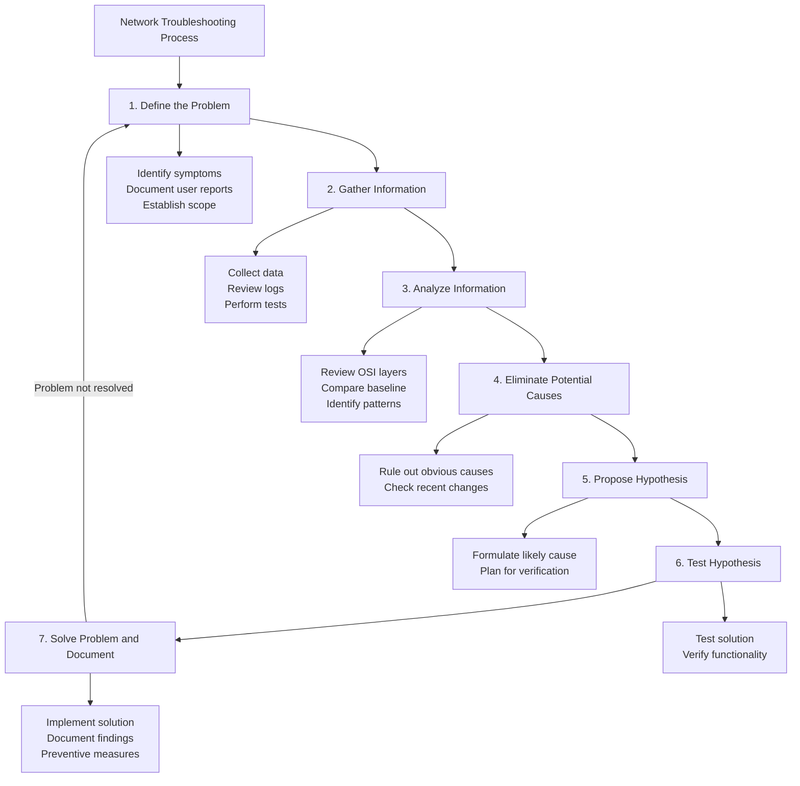

### The OSI Model Approach

Troubleshooting using the OSI model allows for systematic investigation from physical to application layers.

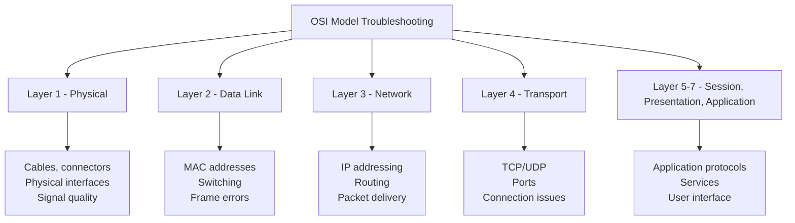

**Bottom-Up Approach:**
- Start at the physical layer (Layer 1)
- Verify physical connectivity and hardware
- Progress upward through each layer
- Identify where the failure occurs

**Top-Down Approach:**
- Start at the application layer (Layer 7)
- Check application functionality and configuration
- Move downward through each layer
- Useful when applications are reporting errors

**Divide and Conquer Approach:**
- Start in the middle of the OSI model (often Layer 3)
- Determine if the problem is above or below that layer
- Narrow down to the problematic layer
- Useful for complex problems

## 2. Network Troubleshooting Tools

### Command-Line Tools

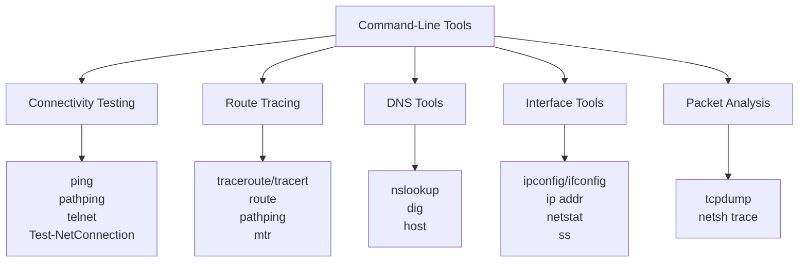

**Common Command-Line Tools and Usage:**

**Ping:**
```bash
# Basic ping test
ping 8.8.8.8

# Continuous ping with increased packet size
ping -t -l 1500 192.168.1.1

# Ping with specific interval and count
ping -c 5 -i 2 example.com
```

**Traceroute/Tracert:**
```bash
# Basic traceroute (Linux/macOS)
traceroute google.com

# Traceroute with specific parameters
traceroute -m 15 -q 2 -w 2 8.8.8.8

# Tracert (Windows)
tracert -d -h 15 google.com
```

**Ipconfig/Ifconfig:**
```bash
# Display all network interfaces (Windows)
ipconfig /all

# Display all network interfaces (Linux)
ifconfig -a
# or
ip addr show

# Release and renew DHCP lease (Windows)
ipconfig /release
ipconfig /renew
```

**Netstat:**
```bash
# Display all active connections
netstat -a

# Display all TCP connections with process IDs
netstat -antp

# Display routing table
netstat -r
```

**Nslookup/Dig:**
```bash
# Basic DNS lookup
nslookup example.com

# DNS lookup with specific server
nslookup example.com 8.8.8.8

# Dig command (more detailed DNS information)
dig example.com
dig @8.8.8.8 example.com A
```

**Tcpdump:**
```bash
# Capture packets on specific interface
tcpdump -i eth0

# Capture with filtering
tcpdump -i eth0 host 192.168.1.1 and port 80

# Write capture to file
tcpdump -i eth0 -w capture.pcap
```

### Hardware Tools

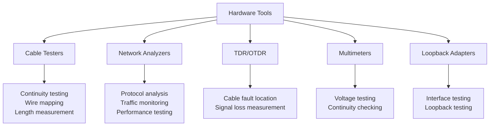

### Software Tools

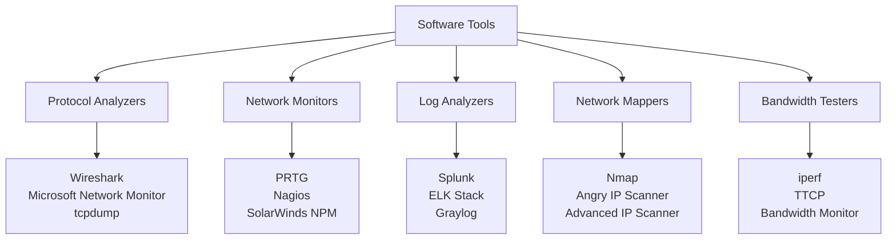

**Wireshark Usage:**
- Capture filters: Limit traffic captured
  - Example: `host 192.168.1.1 and port 80`
- Display filters: Show only specific packets
  - Example: `http.request or http.response`
- Color coding for different protocols
- Protocol dissection for detailed analysis
- Follow TCP stream for conversation analysis

**Nmap Usage:**
```bash
# Basic network scan
nmap 192.168.1.0/24

# OS and version detection
nmap -A 192.168.1.1

# Port scanning with specific options
nmap -sS -p 1-1000 192.168.1.1

# Service version detection
nmap -sV 192.168.1.1
```

**Iperf Usage:**
```bash
# Server mode
iperf -s

# Client mode with specific parameters
iperf -c server_ip -t 30 -i 5
```

## 3. Common Network Issues and Troubleshooting

### Physical Layer Issues

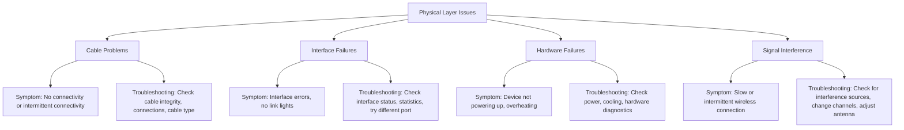

**Common Physical Layer Troubleshooting Steps:**
1. Check physical connections (cables, connectors)
2. Verify power status of devices
3. Inspect for hardware damage
4. Test with known good cables
5. Check interface status (link lights, error indicators)
6. Verify correct cable type (straight-through vs. crossover)
7. Test with loopback adapters
8. Check for interference sources

### Data Link Layer Issues

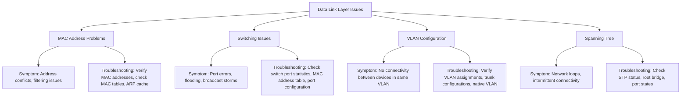

**Common Data Link Layer Troubleshooting Steps:**
1. Check switch port status and statistics
2. Verify VLAN configurations
3. Examine MAC address tables
4. Check for duplicate MAC addresses
5. Verify spanning tree configuration
6. Test with port in different VLAN
7. Check for broadcast storms
8. Verify trunk configurations

### Network Layer Issues

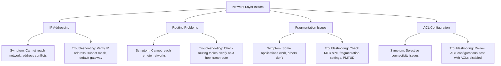

**Common Network Layer Troubleshooting Steps:**
1. Verify IP configuration (address, subnet mask, gateway)
2. Check for IP address conflicts
3. Examine routing tables
4. Test connectivity with ping and traceroute
5. Verify ACL configurations
6. Check NAT/PAT settings
7. Verify route redistribution
8. Test MTU and fragmentation

### Transport Layer Issues

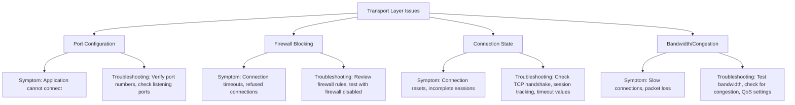

**Common Transport Layer Troubleshooting Steps:**
1. Verify service is listening on correct ports
2. Check firewall rules (both network and host firewalls)
3. Test connectivity with telnet to specific port
4. Examine TCP handshake with packet capture
5. Check for connection limits
6. Verify QoS configurations
7. Test bandwidth and latency
8. Check for blacklisted IP addresses

### Application Layer Issues

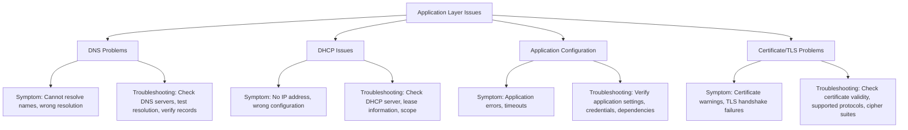

**Common Application Layer Troubleshooting Steps:**
1. Test DNS resolution with nslookup/dig
2. Verify DHCP lease acquisition
3. Check application logs
4. Test application with simplified configuration
5. Verify certificate validity and trust
6. Check protocol compatibility
7. Test with alternative credentials
8. Verify application dependencies and services

## 4. Performance Issues

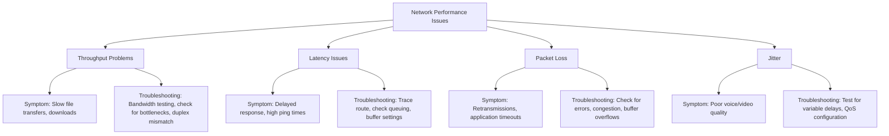

**Performance Troubleshooting Tools and Commands:**

**Measuring Throughput:**
```bash
# iperf test
iperf -c server_ip -t 30

# File transfer test
time scp large_file user@server:/path/

# HTTP download test
curl -o /dev/null -s -w "%{speed_download}\n" http://server/large_file
```

**Measuring Latency:**
```bash
# Basic ping test
ping -c 100 server_ip | grep avg

# More detailed latency test
mtr server_ip

# TCP connection time
time curl -s -o /dev/null server_url
```

**Measuring Packet Loss:**
```bash
# Ping with statistics
ping -c 1000 server_ip

# Extended ping test
ping -c 100 -i 0.2 -s 1400 server_ip

# UDP packet loss test
iperf -c server_ip -u -b 10M -t 30
```

## 5. Documenting Network Troubleshooting

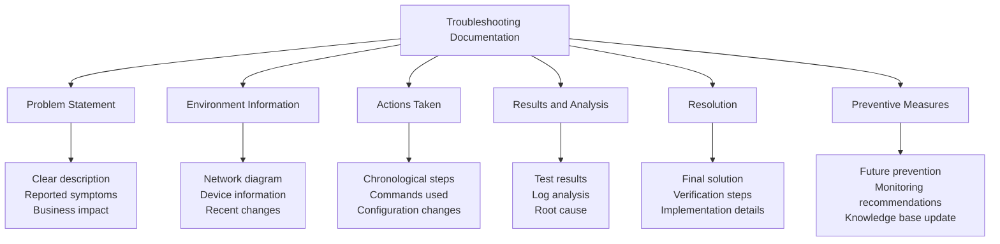

**Troubleshooting Documentation Template:**

1. **Problem Information**
   - Date and time reported
   - User/department affected
   - Description of the issue
   - Severity and impact

2. **Environment Information**
   - Network topology
   - Devices involved
   - Software/firmware versions
   - Recent changes

3. **Troubleshooting Process**
   - Initial assessment
   - Diagnostic steps taken
   - Commands used and output
   - Configuration changes made

4. **Root Cause Analysis**
   - Identified cause
   - Contributing factors
   - Evidence supporting conclusion

5. **Resolution**
   - Solution implemented
   - Verification steps
   - Time to resolution

6. **Preventive Measures**
   - Recommendations
   - Monitoring improvements
   - Knowledge base updates

## 6. Future Networking Trends

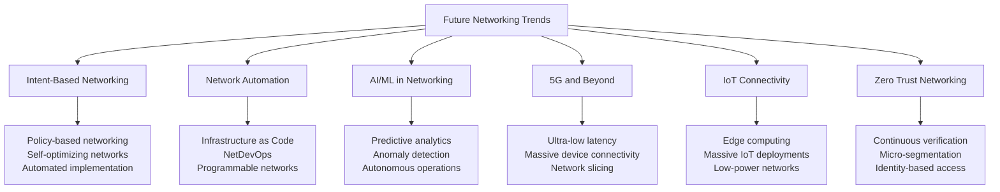

### Intent-Based Networking (IBN)

Intent-Based Networking allows administrators to define what they want the network to do, rather than how to do it.

**Key Components:**
- Translation: Converts business intent into network configuration
- Activation: Implements policies across the network
- Assurance: Continuously verifies network state matches intent
- Learning: Adjusts to changing conditions and requirements

**Benefits:**
- Reduced complexity
- Improved agility
- Enhanced security
- Continuous validation
- Business alignment

### Network Automation and Programmability

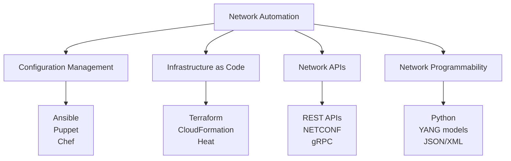

**Key Technologies:**
- **Network Programmability Protocols**:
  - NETCONF/YANG
  - RESTCONF
  - gRPC/gNMI
  - OpenConfig

- **Automation Tools**:
  - Ansible
  - Terraform
  - Python libraries (Nornir, Netmiko)
  - Vendor-specific tools

- **CI/CD for Networking**:
  - Pipeline automation
  - Network testing
  - Automated deployment
  - Version control for configurations

### AI and ML in Networking

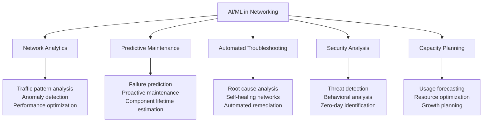

**Use Cases:**
- Network anomaly detection
- Traffic prediction and optimization
- Automated root cause analysis
- Proactive problem resolution
- Security threat detection
- Self-optimizing networks

### 5G and Beyond

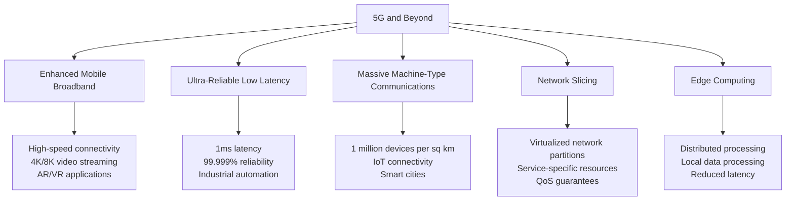

**Key 5G Technologies:**
- Millimeter wave spectrum
- Massive MIMO
- Beamforming
- Network function virtualization
- Software-defined networking
- Network slicing
- Mobile edge computing

**Future (6G) Developments:**
- Terahertz spectrum
- Integrated sensing and communication
- AI-native networks
- Holographic communications
- Quantum networking

### Internet of Things (IoT) Networking

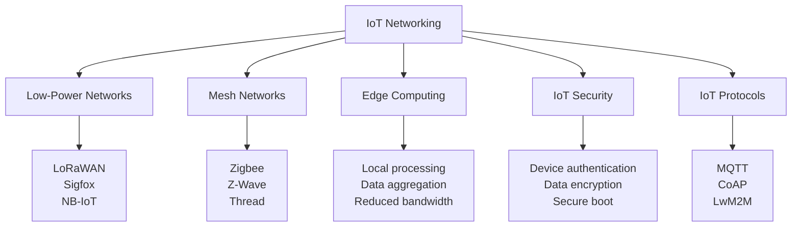

**IoT Connectivity Technologies:**
- **Low-Power Wide Area Networks (LPWAN)**:
  - LoRaWAN
  - Sigfox
  - NB-IoT
  - LTE-M

- **Short-Range Technologies**:
  - Bluetooth Low Energy
  - Zigbee
  - Z-Wave
  - Thread
  - Wi-Fi HaLow (802.11ah)

- **IoT Protocols**:
  - MQTT (Message Queuing Telemetry Transport)
  - CoAP (Constrained Application Protocol)
  - LwM2M (Lightweight M2M)
  - AMQP (Advanced Message Queuing Protocol)

### Zero Trust Architecture

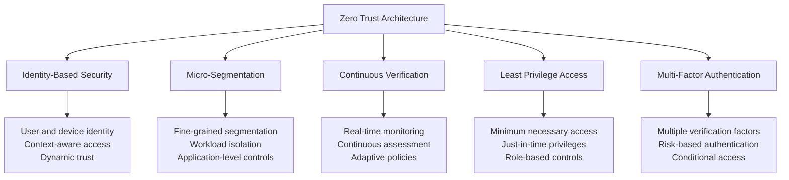

**Zero Trust Principles:**
- Verify explicitly
- Use least privilege access
- Assume breach

**Implementation Components:**
- Strong identity management
- Device health verification
- Network micro-segmentation
- Application-layer security
- Data classification and protection
- Continuous monitoring and validation

## Additional Resources

- [Cisco Network Troubleshooting Guide](https://www.cisco.com/c/en/us/support/docs/ip/routing-information-protocol-rip/13730-EEM-cookbook.html)
- [Wireshark Documentation](https://www.wireshark.org/docs/)
- [NIST Special Publication 800-53](https://nvlpubs.nist.gov/nistpubs/SpecialPublications/NIST.SP.800-53r5.pdf)
- [Gartner Network Performance Monitoring Tools](https://www.gartner.com/reviews/market/npm)
- [IETF RFC 7540 - HTTP/2](https://tools.ietf.org/html/rfc7540)
- [5G Americas White Papers](https://www.5gamericas.org/white-papers/)

## Practice Questions

1. Describe a systematic approach to troubleshooting a user's report that they cannot access a specific web application. Include the tools you would use at each step and how you would isolate the problem.

2. Compare and contrast the bottom-up and top-down troubleshooting approaches. In what scenarios would each approach be most effective?

3. A network administrator reports that users are experiencing intermittent connectivity issues and slow performance. Design a troubleshooting plan to identify whether the issue is related to bandwidth, latency, or packet loss, and explain the tools you would use.

4. Explain how AI and ML technologies are changing network management and troubleshooting. Provide specific examples of how these technologies can improve network operations.

5. Discuss the implications of 5G technology on enterprise networking. How will 5G change the way organizations design and manage their networks?
