# Day 15: Network Layer

<div align="center">

  
  <h1>🌐 Network Layer: Routing Data Across Networks 🌐</h1>
  
  <p>
    
    
    
    
  </p>
  
  <hr>
</div>

## Table of Contents
- [Introduction to the Network Layer](#introduction-to-the-network-layer)
- [Routing vs. Forwarding](#routing-vs-forwarding)
- [Routing Tables](#routing-tables)
- [Forwarding Tables](#forwarding-tables)
- [IP Addressing and Subnetting](#ip-addressing-and-subnetting)
- [Static vs. Dynamic Routing](#static-vs-dynamic-routing)
- [Routing Algorithms](#routing-algorithms)
- [Routing Protocols](#routing-protocols)
- [IP Packet Structure](#ip-packet-structure)
- [IPv4 vs. IPv6](#ipv4-vs-ipv6)
- [Network Address Translation](#network-address-translation)
- [ICMP Protocol](#icmp-protocol)
- [Practice Questions](#practice-questions)
- [Additional Resources](#additional-resources)

## Introduction to the Network Layer

The Network Layer (Layer 3 in the OSI model) is responsible for routing data packets between different networks. It enables end-to-end communication across multiple networks and handles logical addressing, routing decisions, and packet forwarding.


### Key Functions of the Network Layer

1. **Logical Addressing**: Assigns unique addresses (like IP addresses) to devices to enable global identification across networks.

2. **Routing**: Determines the best path for data to travel from source to destination across multiple networks.

3. **Forwarding**: Moves packets from router input interfaces to appropriate output interfaces based on routing decisions.

4. **Packet Fragmentation and Reassembly**: Splits and reassembles packets to accommodate different maximum transmission units (MTUs) along the path.

5. **Error Handling and Diagnostics**: Detects and reports network errors through protocols like ICMP.

6. **Quality of Service (QoS)**: Provides mechanisms for prioritizing certain types of traffic.

### Network Layer Protocols

The most common Network Layer protocols include:

- **IP (Internet Protocol)**: The fundamental protocol of the Internet
  - IPv4: Traditional 32-bit addressing
  - IPv6: Newer 128-bit addressing system

- **ICMP (Internet Control Message Protocol)**: Error reporting and diagnostic functions

- **IGMP (Internet Group Management Protocol)**: Manages multicast group memberships

- **Routing Protocols**: OSPF, BGP, RIP, EIGRP, etc.

## Routing vs. Forwarding

Routing and forwarding are two fundamental functions of the Network Layer, but they serve different purposes:

### Routing

Routing is the **control plane** function that determines which path packets should take through the network:

- **Process**: Exchanges routing information with other routers to learn network topology
- **Timeframe**: Operates on a longer time scale (seconds to minutes)
- **Outcome**: Builds and maintains routing tables
- **Complexity**: Computationally intensive, involving complex algorithms
- **Perspective**: Global view of the network topology


### Forwarding

Forwarding is the **data plane** function that moves packets from input to output ports:

- **Process**: Lookups destination address in forwarding table and sends packet to appropriate interface
- **Timeframe**: Operates at packet arrival time (nanoseconds to microseconds)
- **Outcome**: Delivers individual packets toward their destination
- **Complexity**: Simple lookup and dispatch operation
- **Perspective**: Local decision for each packet


### Relationship Between Routing and Forwarding

While distinct, routing and forwarding are closely related:

1. Routing algorithms calculate optimal paths through the network
2. These paths are used to construct routing tables
3. Routing tables are used to build forwarding tables
4. Forwarding tables guide the actual movement of packets

This separation of control plane (routing) and data plane (forwarding) allows for efficient packet handling while maintaining the flexibility to adapt to network changes.

## Routing Tables

A routing table is a data structure stored in a router or networked device that lists the routes to particular network destinations.

### Components of a Routing Table

A typical routing table entry contains:

1. **Network Destination**: The target network address
2. **Network Mask/Prefix Length**: Defines the range of addresses in the target network
3. **Next Hop**: IP address of the next router in the path
4. **Outgoing Interface**: Physical interface through which packets should be sent
5. **Metric/Cost**: Value indicating preference when multiple routes exist
6. **Administrative Distance**: Trustworthiness of the route source (for devices using multiple routing protocols)
7. **Route Source**: How the route was learned (static, dynamic protocol, direct connection)
8. **Route Age**: Time since the route was last verified or updated

### Example Routing Table

Here's an example of what a routing table might look like:

```
Destination     Gateway         Genmask         Flags Metric Interface
0.0.0.0         192.168.1.1     0.0.0.0         UG    100    eth0
192.168.1.0     0.0.0.0         255.255.255.0   U     100    eth0
192.168.2.0     192.168.1.254   255.255.255.0   UG    110    eth0
10.0.0.0        192.168.1.254   255.0.0.0       UG    120    eth0
```

In this example:
- Default route (`0.0.0.0/0`) points to 192.168.1.1 via eth0
- Directly connected network 192.168.1.0/24 is accessible via eth0
- Remote network 192.168.2.0/24 is accessible via 192.168.1.254
- Remote network 10.0.0.0/8 is accessible via 192.168.1.254

### Route Lookup Process

When a router receives a packet, it performs a routing table lookup:

1. Extract the destination IP address from the packet
2. Find the most specific matching entry in the routing table
   - "Most specific" means the entry with the longest matching prefix
3. Determine the next hop and outgoing interface
4. Forward the packet accordingly


### Longest Prefix Match

Routing table lookups use the "longest prefix match" algorithm to find the most specific route:

1. Compare the destination IP against all entries in the routing table
2. Select the entry with the longest matching prefix (most specific match)
3. If multiple routes with the same prefix length exist, use the one with lower metric

**Example:**
For destination IP 192.168.2.10, with these routing table entries:
- 192.168.0.0/16 via Router A
- 192.168.2.0/24 via Router B
- 0.0.0.0/0 via Router C

The packet will be sent to Router B because 192.168.2.0/24 is the longest matching prefix.

## Forwarding Tables

A forwarding table (also called a Forwarding Information Base or FIB) is a simplified, optimized version of the routing table used for the actual packet forwarding process.

### Routing Table vs. Forwarding Table

| Routing Table | Forwarding Table |
|--------------|-----------------|
| Contains all routes learned | Contains only best routes |
| Used by control plane | Used by data plane |
| Updated by routing protocols | Derived from routing table |
| Includes routing protocol details | Simplified for fast lookups |
| May be larger and more detailed | Optimized for forwarding speed |

### Forwarding Table Structure

A forwarding table typically contains:

1. **Destination Prefix**: Network address with prefix length
2. **Next Hop Information**: Where to send the packet
3. **Output Interface**: Which physical interface to use
4. **Additional Info**: MPLS labels, QoS markings, etc.

### Example Forwarding Table

```
Prefix          Next Hop         Interface    Action
0.0.0.0/0       192.168.1.1      eth0         Forward
192.168.1.0/24  -                eth0         Direct
192.168.2.0/24  192.168.1.254    eth0         Forward
10.0.0.0/8      192.168.1.254    eth0         Forward
224.0.0.0/4     -                -            Drop
```

### Forwarding Table Implementation

Forwarding tables are implemented using various data structures optimized for fast lookups:

1. **Trie (Prefix Tree)**: A tree-like structure where each node represents a bit or group of bits in the prefix
   - Provides O(k) lookup time where k is the address length
   - Used in many software router implementations

2. **Ternary Content-Addressable Memory (TCAM)**: Hardware solution that performs parallel matching
   - Provides O(1) lookup time regardless of table size
   - Used in high-performance hardware routers
   - Power-intensive and expensive

3. **Hash-based Schemes**: Use hash functions to quickly locate entries
   - Very fast for exact matches
   - Require additional mechanisms for longest prefix matching

### Forwarding Process

The actual forwarding process involves:

1. Extract destination address from packet header
2. Perform longest prefix match in forwarding table
3. Apply any packet modifications (e.g., decrement TTL)
4. Queue packet on appropriate output interface
5. Transmit packet on the network

## IP Addressing and Subnetting

IP addressing provides the logical addressing scheme for the Network Layer, allowing devices to be uniquely identified across interconnected networks.

### IPv4 Addressing

IPv4 uses 32-bit addresses typically represented in dotted-decimal notation (e.g., 192.168.1.1):

- **Format**: Four 8-bit octets separated by periods
- **Address Space**: 2^32 = 4.3 billion addresses
- **Classes**: Traditionally divided into five classes (A, B, C, D, E)

#### IPv4 Address Classes (Historical)

| Class | First Bits | First Byte Range | Default Mask     | Purpose                 |
|-------|------------|------------------|------------------| ------------------------|
| A     | 0          | 0-127            | 255.0.0.0 (/8)   | Large networks          |
| B     | 10         | 128-191          | 255.255.0.0 (/16)| Medium networks         |
| C     | 110        | 192-223          | 255.255.255.0 (/24)| Small networks        |
| D     | 1110       | 224-239          | N/A              | Multicast               |
| E     | 1111       | 240-255          | N/A              | Reserved/Experimental   |

### Classless Inter-Domain Routing (CIDR)

CIDR replaced the class-based addressing system, allowing for more flexible allocation of IP address blocks:

- **Notation**: IP address followed by slash and prefix length (e.g., 192.168.1.0/24)
- **Prefix Length**: Indicates how many bits define the network portion
- **Benefits**: More efficient use of address space, variable-length subnet masks

### Subnetting

Subnetting divides a larger network into smaller subnetworks:


#### Subnetting Calculation Steps

1. **Determine How Many Subnets You Need**: Calculate 2^n where n is the number of bits borrowed
2. **Calculate New Subnet Mask**: Add the borrowed bits to the original prefix length
3. **Determine Subnet Addresses**: Calculate each subnet's network address
4. **Determine Host Range**: First usable address is network address + 1, last is broadcast address - 1
5. **Calculate Broadcast Addresses**: Last address in each subnet

#### Example: Subnetting 192.168.1.0/24 into Four Subnets

Starting with 192.168.1.0/24 and borrowing 2 bits (to make 4 subnets):

| Subnet | Network Address | Subnet Mask | First Host    | Last Host     | Broadcast     |
|--------|----------------|-------------|---------------|---------------|---------------|
| 1      | 192.168.1.0/26 | 255.255.255.192 | 192.168.1.1  | 192.168.1.62 | 192.168.1.63 |
| 2      | 192.168.1.64/26 | 255.255.255.192 | 192.168.1.65 | 192.168.1.126 | 192.168.1.127 |
| 3      | 192.168.1.128/26 | 255.255.255.192 | 192.168.1.129 | 192.168.1.190 | 192.168.1.191 |
| 4      | 192.168.1.192/26 | 255.255.255.192 | 192.168.1.193 | 192.168.1.254 | 192.168.1.255 |

### Special IP Addresses

- **Network Address**: First address in a subnet (host portion all 0s)
- **Broadcast Address**: Last address in a subnet (host portion all 1s)
- **Loopback Address**: 127.0.0.1 (localhost)
- **Private Addresses**:
  - 10.0.0.0/8 (Class A)
  - 172.16.0.0/12 (Class B)
  - 192.168.0.0/16 (Class C)
- **Link-Local Addresses**: 169.254.0.0/16 (APIPA)

## Static vs. Dynamic Routing

Routing methods can be broadly categorized as static or dynamic, each with its own advantages and use cases.

### Static Routing

Static routing involves manually configuring routes in a router's routing table:

```
ip route 192.168.2.0 255.255.255.0 192.168.1.2
```

#### Advantages of Static Routing

1. **Predictable**: Routes don't change unless manually modified
2. **Security**: No routing protocol traffic to be exploited
3. **Low Overhead**: No CPU, memory, or bandwidth used for routing protocols
4. **Simple Implementation**: Easy to configure in small networks

#### Disadvantages of Static Routing

1. **Not Scalable**: Impractical for large networks
2. **No Automatic Adaptation**: Doesn't adjust to network changes
3. **Administrative Burden**: Requires manual updates for any change
4. **Single Point of Failure**: No automatic failover

#### When to Use Static Routing

- Small networks with simple topologies
- Hub-and-spoke networks (for the spoke routers)
- Backup routes for dynamic routing
- Security-sensitive environments
- Connecting to stub networks (with only one entry/exit point)

### Dynamic Routing

Dynamic routing uses protocols that automatically discover network topology and calculate optimal routes:


#### Advantages of Dynamic Routing

1. **Adaptability**: Automatically adjusts to network changes
2. **Scalability**: Works well in large, complex networks
3. **Redundancy**: Can use multiple paths and provide failover
4. **Low Maintenance**: Minimal manual configuration

#### Disadvantages of Dynamic Routing

1. **Resource Usage**: Consumes CPU, memory, and bandwidth
2. **Convergence Time**: Takes time to adapt to network changes
3. **Complexity**: More difficult to troubleshoot
4. **Security Concerns**: Potential attack vector if not secured

#### When to Use Dynamic Routing

- Medium to large networks
- Networks with multiple paths between destinations
- Networks that change frequently
- Networks requiring automatic failover

### Comparison: Static vs. Dynamic Routing

| Feature | Static Routing | Dynamic Routing |
|---------|---------------|----------------|
| Configuration | Manual | Automatic |
| Scalability | Poor | Good |
| Resource Usage | Minimal | Moderate to High |
| Adaptation to Changes | Manual | Automatic |
| Convergence Time | N/A | Varies by protocol |
| Path Selection | Administrator-defined | Algorithm-determined |
| Complexity | Low | Medium to High |
| Security | Higher | Lower (if not secured) |
| Use Case | Small networks, backup routes | Medium to large networks |

### Hybrid Approach

Many networks use a combination of static and dynamic routing:

- **Default Routes**: Static default routes pointing to Internet gateways
- **Internal Routing**: Dynamic routing within the organization
- **Critical Links**: Static routes for mission-critical connections
- **Backup Routes**: Static backup routes with higher administrative distance

## Routing Algorithms

Routing algorithms are used to determine optimal paths through a network. They can be broadly categorized based on different characteristics.

### Classification of Routing Algorithms

#### Based on Information Source

1. **Global Routing Algorithms (Link-State)**
   - Have complete information about network topology
   - Compute routes using complete network information
   - Example: Dijkstra's algorithm in OSPF

2. **Decentralized Routing Algorithms (Distance-Vector)**
   - Start with only neighboring router information
   - Iteratively calculate routes through information exchange
   - Example: Bellman-Ford algorithm in RIP

#### Based on Adaptability

1. **Static Algorithms**
   - Routes change only when topology changes
   - Slow to respond to congestion

2. **Dynamic Algorithms**
   - Routes change in response to traffic conditions
   - Consider current network load, delay, etc.

#### Based on Load Sensitivity

1. **Load-Insensitive Algorithms**
   - Don't consider current traffic load
   - Use fixed metrics like hop count or link bandwidth

2. **Load-Sensitive Algorithms**
   - Adapt to current network conditions
   - Consider metrics like current delay or congestion

### Dijkstra's Algorithm (Link-State)

Dijkstra's algorithm calculates the shortest path from a source node to all other nodes in a network:


#### Algorithm Steps:

1. Create a set of unvisited nodes and a set of tentative distances
2. Set the distance to the source node as 0 and all others as infinity
3. For the current node, calculate tentative distances to all unvisited neighbors
4. Mark the current node as visited
5. Select the unvisited node with the smallest tentative distance as the new current node
6. Repeat steps 3-5 until all nodes are visited

#### Example Execution (Starting at Node A):

| Iteration | Current Node | Distances (A,B,C,D,E) | Visited Nodes |
|-----------|--------------|----------------------|--------------|
| 0 | - | (0,∞,∞,∞,∞) | - |
| 1 | A | (0,2,5,∞,∞) | A |
| 2 | B | (0,2,3,5,∞) | A,B |
| 3 | C | (0,2,3,5,7) | A,B,C |
| 4 | D | (0,2,3,5,6) | A,B,C,D |
| 5 | E | (0,2,3,5,6) | A,B,C,D,E |

Final shortest paths from A:
- A→B: distance 2
- A→B→C: distance 3
- A→B→D: distance 5
- A→B→D→E: distance 6

### Bellman-Ford Algorithm (Distance-Vector)

The Bellman-Ford algorithm calculates the shortest paths from a source node based on the principle of relaxation:

#### Algorithm Steps:

1. Initialize distances from source to all vertices as infinite, and distance to the source itself as 0
2. Relax all edges |V|-1 times, where |V| is the number of vertices
3. Check for negative-weight cycles

#### Distance Vector Implementation:

In distance vector protocols like RIP:
1. Each router maintains a routing table with distances to all destinations
2. Routers periodically share their tables with neighbors
3. Upon receiving a neighbor's table, a router updates its own table if it finds better paths

```mermaid
sequenceDiagram
    participant R1 as Router 1
    participant R2 as Router 2
    participant R3 as Router 3
    
    R1->>R2: My distance vector: {A:0, B:1, C:∞}
    R2->>R3: My distance vector: {A:1, B:0, C:1}
    R3->>R2: My distance vector: {A:∞, B:1, C:0}
    R2->>R1: My updated vector: {A:1, B:0, C:1}
    
    Note over R1,R3: After exchanges, all routers have complete paths
```



#### Issues with Distance Vector Routing:

1. **Count-to-Infinity Problem**: When a link fails, routers may incorrectly route through each other, gradually increasing the path cost
2. **Slow Convergence**: May take many iterations to reach a stable state
3. **Routing Loops**: Temporary loops may form during convergence

Solutions include:
- **Split Horizon**: Don't advertise routes back to the router they were learned from
- **Poison Reverse**: Advertise infinite cost for routes back to their source
- **Triggered Updates**: Send updates immediately when routes change
- **Path Vector**: Include the entire path in routing updates (used in BGP)

### Hierarchical Routing

As networks grow, flat routing becomes impractical due to:
- Large routing tables
- Excessive routing update traffic
- Slow convergence

Hierarchical routing addresses these issues by organizing the network into areas or autonomous systems:


#### Benefits of Hierarchical Routing:

1. **Reduced Routing Table Size**: Routers only need detailed information about their own area
2. **Limited Update Scope**: Topology changes affect only the relevant area
3. **Improved Scalability**: Network can grow with minimal impact on routing performance
4. **Administrative Autonomy**: Different parts of the network can be managed independently

#### Examples of Hierarchical Routing:

1. **OSPF Areas**: OSPF divides a network into areas connected by an area 0 (backbone)
2. **BGP Autonomous Systems**: BGP connects independent ASes with their own internal routing protocols
3. **IS-IS Levels**: IS-IS uses a two-level hierarchy with backbone (Level 2) and areas (Level 1)

## Routing Protocols

Routing protocols implement routing algorithms and provide the means for routers to exchange routing information.

### Interior Gateway Protocols (IGPs)

IGPs operate within an autonomous system (AS) - a network under a single administrative control.

#### 1. RIP (Routing Information Protocol)

- **Algorithm**: Distance-vector (Bellman-Ford)
- **Metric**: Hop count (maximum 15 hops)
- **Updates**: Periodic full table broadcasts (every 30 seconds)
- **Convergence**: Slow (can take minutes)
- **Advantages**: Simple, widely supported
- **Disadvantages**: Limited scalability, slow convergence, no load balancing

```
router rip
 network 192.168.1.0
 network 10.0.0.0
```

#### 2. OSPF (Open Shortest Path First)

- **Algorithm**: Link-state (Dijkstra's)
- **Metric**: Cost based on bandwidth
- **Updates**: Triggered updates (only when topology changes)
- **Convergence**: Fast (seconds)
- **Advantages**: Scalable, fast convergence, support for VLSM and CIDR
- **Disadvantages**: More complex, higher resource requirements

```
router ospf 1
 network 192.168.1.0 0.0.0.255 area 0
 network 10.0.0.0 0.255.255.255 area 1
```

#### 3. EIGRP (Enhanced Interior Gateway Routing Protocol)

- **Algorithm**: Advanced distance-vector (DUAL)
- **Metric**: Composite (bandwidth, delay, reliability, load)
- **Updates**: Triggered, partial updates
- **Convergence**: Very fast
- **Advantages**: Fast convergence, efficient use of bandwidth, support for unequal-cost load balancing
- **Disadvantages**: Cisco proprietary (until 2013), more complex than RIP

```
router eigrp 100
 network 192.168.1.0 0.0.0.255
 network 10.0.0.0 0.255.255.255
```

#### 4. IS-IS (Intermediate System to Intermediate System)

- **Algorithm**: Link-state (Dijkstra's)
- **Metric**: Configurable cost
- **Updates**: Triggered updates
- **Convergence**: Fast
- **Advantages**: Highly scalable, efficient, not tied to IP (works with multiple network protocols)
- **Disadvantages**: Complex configuration, less common in enterprise networks

```
router isis
 net 49.0001.0000.0000.0001.00
 is-type level-2-only
```

### Exterior Gateway Protocols (EGPs)

EGPs route between autonomous systems, focusing on policy rather than optimal paths.

#### BGP (Border Gateway Protocol)

- **Algorithm**: Path-vector
- **Metric**: AS path length and policies
- **Updates**: Incremental updates
- **Convergence**: Can be slow for large networks
- **Advantages**: Scalable to Internet size, policy-based routing
- **Disadvantages**: Complex, resource-intensive

```
router bgp 65000
 neighbor 203.0.113.1 remote-as 65001
 network 192.168.0.0 mask 255.255.0.0
```

### Comparison of Routing Protocols

| Protocol | Type | Algorithm | Metric | Update Method | Convergence | Scalability |
|----------|------|-----------|--------|--------------|-------------|-------------|
| RIP | IGP | Distance-vector | Hop count | Periodic | Slow | Low |
| OSPF | IGP | Link-state | Bandwidth-based cost | Triggered | Fast | High |
| EIGRP | IGP | Advanced DV | Composite | Triggered | Very fast | Medium-High |
| IS-IS | IGP | Link-state | Configurable | Triggered | Fast | Very High |
| BGP | EGP | Path-vector | Policy & AS path | Incremental | Medium | Extremely High |

### Administrative Distance

When a router learns about the same route from multiple protocols, it uses administrative distance to determine which one to trust:

| Routing Protocol | Administrative Distance |
|------------------|------------------------|
| Connected Interface | 0 |
| Static Route | 1 |
| EIGRP Summary Route | 5 |
| External BGP | 20 |
| Internal EIGRP | 90 |
| OSPF | 110 |
| IS-IS | 115 |
| RIP | 120 |
| External EIGRP | 170 |
| Internal BGP | 200 |
| Unknown | 255 (unusable) |

Lower values indicate higher trustworthiness.

## IP Packet Structure

The structure of IP packets is fundamental to understanding how data is transmitted across networks at the Network Layer.

### IPv4 Packet Header

```
 0                   1                   2                   3
 0 1 2 3 4 5 6 7 8 9 0 1 2 3 4 5 6 7 8 9 0 1 2 3 4 5 6 7 8 9 0 1
+-+-+-+-+-+-+-+-+-+-+-+-+-+-+-+-+-+-+-+-+-+-+-+-+-+-+-+-+-+-+-+-+
|Version|  IHL  |Type of Service|          Total Length         |
+-+-+-+-+-+-+-+-+-+-+-+-+-+-+-+-+-+-+-+-+-+-+-+-+-+-+-+-+-+-+-+-+
|         Identification        |Flags|      Fragment Offset    |
+-+-+-+-+-+-+-+-+-+-+-+-+-+-+-+-+-+-+-+-+-+-+-+-+-+-+-+-+-+-+-+-+
|  Time to Live |    Protocol   |         Header Checksum       |
+-+-+-+-+-+-+-+-+-+-+-+-+-+-+-+-+-+-+-+-+-+-+-+-+-+-+-+-+-+-+-+-+
|                       Source Address                          |
+-+-+-+-+-+-+-+-+-+-+-+-+-+-+-+-+-+-+-+-+-+-+-+-+-+-+-+-+-+-+-+-+
|                    Destination Address                        |
+-+-+-+-+-+-+-+-+-+-+-+-+-+-+-+-+-+-+-+-+-+-+-+-+-+-+-+-+-+-+-+-+
|                    Options                    |    Padding    |
+-+-+-+-+-+-+-+-+-+-+-+-+-+-+-+-+-+-+-+-+-+-+-+-+-+-+-+-+-+-+-+-+
```

#### Field Descriptions:

1. **Version (4 bits)**: Indicates IP version (4 for IPv4)
2. **IHL (4 bits)**: Internet Header Length in 32-bit words (minimum 5, maximum 15)
3. **Type of Service/DSCP (8 bits)**: Used for QoS prioritization
4. **Total Length (16 bits)**: Length of the packet in bytes (header + data)
5. **Identification (16 bits)**: Used to identify fragments of a single IP datagram
6. **Flags (3 bits)**: Controls and identifies fragments
   - Bit 0: Reserved (must be zero)
   - Bit 1: Don't Fragment (DF)
   - Bit 2: More Fragments (MF)
7. **Fragment Offset (13 bits)**: Indicates where the fragment belongs in the original datagram
8. **Time to Live (8 bits)**: Prevents packets from looping indefinitely
9. **Protocol (8 bits)**: Identifies the next level protocol (TCP=6, UDP=17, ICMP=1)
10. **Header Checksum (16 bits)**: Error detection for the header
11. **Source Address (32 bits)**: Sender's IP address
12. **Destination Address (32 bits)**: Recipient's IP address
13. **Options (variable)**: Additional header fields (rarely used)
14. **Padding (variable)**: Ensures the header ends on a 32-bit boundary

### IPv6 Packet Header

```
 0                   1                   2                   3
 0 1 2 3 4 5 6 7 8 9 0 1 2 3 4 5 6 7 8 9 0 1 2 3 4 5 6 7 8 9 0 1
+-+-+-+-+-+-+-+-+-+-+-+-+-+-+-+-+-+-+-+-+-+-+-+-+-+-+-+-+-+-+-+-+
|Version| Traffic Class |           Flow Label                  |
+-+-+-+-+-+-+-+-+-+-+-+-+-+-+-+-+-+-+-+-+-+-+-+-+-+-+-+-+-+-+-+-+
|         Payload Length        |  Next Header  |   Hop Limit   |
+-+-+-+-+-+-+-+-+-+-+-+-+-+-+-+-+-+-+-+-+-+-+-+-+-+-+-+-+-+-+-+-+
|                                                               |
+                                                               +
|                                                               |
+                         Source Address                        +
|                                                               |
+                                                               +
|                                                               |
+-+-+-+-+-+-+-+-+-+-+-+-+-+-+-+-+-+-+-+-+-+-+-+-+-+-+-+-+-+-+-+-+
|                                                               |
+                                                               +
|                                                               |
+                      Destination Address                      +
|                                                               |
+                                                               +
|                                                               |
+-+-+-+-+-+-+-+-+-+-+-+-+-+-+-+-+-+-+-+-+-+-+-+-+-+-+-+-+-+-+-+-+
```

#### Field Descriptions:

1. **Version (4 bits)**: Indicates IP version (6 for IPv6)
2. **Traffic Class (8 bits)**: Similar to IPv4's Type of Service
3. **Flow Label (20 bits)**: Identifies packets belonging to the same flow
4. **Payload Length (16 bits)**: Length of the data after the header
5. **Next Header (8 bits)**: Identifies the type of header immediately following
6. **Hop Limit (8 bits)**: Similar to IPv4's TTL
7. **Source Address (128 bits)**: Sender's IPv6 address
8. **Destination Address (128 bits)**: Recipient's IPv6 address

### IP Packet Processing

When a router receives an IP packet, it follows these steps:

1. **Validation**: Verifies header checksum and packet integrity
2. **TTL/Hop Limit Check**: Decrements and checks if zero (discards if zero)
3. **Route Lookup**: Determines next hop using longest prefix match
4. **Fragmentation**: Divides packet if necessary for the outgoing link's MTU
5. **Header Update**: Updates header fields (e.g., TTL, checksum)
6. **Forwarding**: Sends packet to the appropriate output interface


## IPv4 vs. IPv6

As the Internet continues to grow, IPv4 address exhaustion has driven the transition to IPv6.

### Key Differences

| Feature | IPv4 | IPv6 |
|---------|------|------|
| Address Size | 32-bit (4 bytes) | 128-bit (16 bytes) |
| Address Space | ~4.3 billion addresses | 340 undecillion addresses (3.4×10^38) |
| Notation | Dotted decimal (192.168.1.1) | Hexadecimal with colons (2001:0db8:85a3:0000:0000:8a2e:0370:7334) |
| Header Size | Variable (20-60 bytes) | Fixed (40 bytes) |
| Fragmentation | Done by routers and source | Only done by source |
| Checksum | Included in header | Removed (handled by link layer) |
| Configuration | Manual or DHCP | Stateless autoconfiguration or DHCPv6 |
| Security | Optional (IPsec) | Built-in |

### IPv6 Address Types

1. **Unicast**: Identifies a single interface
   - **Global Unicast**: Public routable addresses (similar to IPv4 public addresses)
   - **Link-Local**: Non-routable addresses for a single link (fe80::/10)
   - **Unique Local**: Private addresses (fc00::/7, similar to IPv4 private addresses)

2. **Multicast**: Identifies a group of interfaces (ff00::/8)
   - Replaces broadcast functionality from IPv4

3. **Anycast**: Identifies a set of interfaces where packets are delivered to the nearest one

### IPv6 Address Representation

IPv6 addresses can be simplified:
- Leading zeros in a group can be omitted: 2001:0db8:0000:0000:0000:8a2e:0370:7334 → 2001:db8:0:0:0:8a2e:370:7334
- Consecutive groups of zeros can be replaced with double colon (::) once per address: 2001:db8:0:0:0:8a2e:370:7334 → 2001:db8::8a2e:370:7334

### Transition Mechanisms

Several mechanisms help with IPv4 to IPv6 transition:

1. **Dual Stack**: Devices run both IPv4 and IPv6 simultaneously
2. **Tunneling**: Encapsulates IPv6 packets within IPv4 packets
   - 6to4, Teredo, 6rd
3. **Translation**: Converts between IPv4 and IPv6 (e.g., NAT64)

## Network Address Translation

Network Address Translation (NAT) allows multiple devices on a private network to share a single public IP address.

### NAT Operation


When a device sends a packet through NAT:

1. NAT router modifies the source IP address (and usually port)
2. NAT maintains a translation table mapping private to public addresses/ports
3. Incoming responses are mapped back to the original private IP

### Types of NAT

1. **Static NAT**: One-to-one mapping between private and public IPs
   - Used for servers that need to be accessible from the Internet

2. **Dynamic NAT**: Maps private IPs to a pool of public IPs
   - Each private IP gets a different public IP from the pool

3. **PAT/NAPT (Port Address Translation)**: Maps multiple private IPs to a single public IP using different ports
   - Most common type used in home and small business routers

### NAT Translation Table Example

| Private IP:Port | Public IP:Port | Protocol | State |
|----------------|---------------|----------|-------|
| 192.168.1.10:54321 | 203.0.113.5:20001 | TCP | ESTABLISHED |
| 192.168.1.11:43210 | 203.0.113.5:20002 | TCP | ESTABLISHED |
| 192.168.1.12:54322 | 203.0.113.5:20003 | UDP | ACTIVE |

### Advantages of NAT

1. **Address Conservation**: Helps mitigate IPv4 address exhaustion
2. **Security**: Hides internal network structure
3. **Flexibility**: Allows using private addressing internally

### Disadvantages of NAT

1. **Breaks End-to-End Connectivity**: Complicates peer-to-peer applications
2. **Protocol Compatibility**: Some protocols don't work well with NAT
3. **Performance Impact**: Adds processing overhead
4. **Troubleshooting Complexity**: Makes network troubleshooting more difficult

## ICMP Protocol

The Internet Control Message Protocol (ICMP) is an essential component of the IP suite used for error reporting and network diagnostics.

### ICMP Message Format

```
 0                   1                   2                   3
 0 1 2 3 4 5 6 7 8 9 0 1 2 3 4 5 6 7 8 9 0 1 2 3 4 5 6 7 8 9 0 1
+-+-+-+-+-+-+-+-+-+-+-+-+-+-+-+-+-+-+-+-+-+-+-+-+-+-+-+-+-+-+-+-+
|     Type      |     Code      |          Checksum             |
+-+-+-+-+-+-+-+-+-+-+-+-+-+-+-+-+-+-+-+-+-+-+-+-+-+-+-+-+-+-+-+-+
|                        Message Body                           |
+-+-+-+-+-+-+-+-+-+-+-+-+-+-+-+-+-+-+-+-+-+-+-+-+-+-+-+-+-+-+-+-+
```

### Common ICMP Message Types

| Type | Code | Description | Usage |
|------|------|-------------|-------|
| 0 | 0 | Echo Reply | Response to ping requests |
| 3 | Various | Destination Unreachable | 0: Network Unreachable<br>1: Host Unreachable<br>3: Port Unreachable |
| 5 | Various | Redirect | Router suggests a better route |
| 8 | 0 | Echo Request | ping command |
| 11 | 0-1 | Time Exceeded | 0: TTL expired in transit<br>1: Fragment reassembly time exceeded |
| 30 | 0 | Traceroute | Used by some traceroute implementations |

### ICMP in Network Diagnostics

ICMP enables several essential network diagnostic tools:

1. **Ping**: Tests reachability and round-trip time
   ```
   $ ping google.com
   PING google.com (142.250.187.78) 56(84) bytes of data.
   64 bytes from sea30s10-in-f14.1e100.net (142.250.187.78): icmp_seq=1 ttl=118 time=8.35 ms
   64 bytes from sea30s10-in-f14.1e100.net (142.250.187.78): icmp_seq=2 ttl=118 time=7.93 ms
   ```

2. **Traceroute/Tracert**: Discovers the path packets take
   ```
   $ traceroute google.com
   traceroute to google.com (142.250.187.78), 30 hops max, 60 byte packets
    1  _gateway (192.168.1.1)  2.141 ms  2.098 ms  2.080 ms
    2  96.120.42.133 (96.120.42.133)  10.636 ms  12.130 ms  12.115 ms
    3  68.85.216.49 (68.85.216.49)  12.099 ms  12.080 ms  12.062 ms
    ...
   ```

3. **Path MTU Discovery**: Determines maximum packet size for a path

### ICMPv6

ICMPv6 extends ICMP functionality in IPv6 networks with additional features:

1. **Neighbor Discovery Protocol (NDP)**: Replaces ARP
2. **Stateless Address Autoconfiguration (SLAAC)**: Enables automatic IPv6 address assignment
3. **Multicast Listener Discovery (MLD)**: Manages multicast group memberships

### ICMP Security Considerations

While essential for network diagnostics, ICMP can be exploited:

1. **ICMP Flood**: Overwhelming a target with ICMP packets (ping flood)
2. **ICMP Tunneling**: Covert channel for data exfiltration
3. **Ping of Death**: Historically, oversized ICMP packets could crash systems

Many firewalls and security policies restrict ICMP traffic to mitigate these risks.

## Practice Questions

Test your understanding of the Network Layer with these questions:

1. **What is the difference between routing and forwarding?**
   <details>
   <summary>Answer</summary>
   Routing is the control plane function that determines which paths packets should take by running routing protocols and algorithms to build routing tables. Forwarding is the data plane function that moves packets from input to output ports based on the forwarding table. Routing operates on a longer timescale (seconds to minutes), while forwarding happens at packet arrival time (nanoseconds to microseconds).
   </details>

2. **How many subnets and hosts per subnet can you create from the network 192.168.10.0/24 if you need at least 12 subnets?**
   <details>
   <summary>Answer</summary>
   To create at least 12 subnets, you need at least 4 subnet bits (2^4 = 16 subnets). With a /24 network, borrowing 4 bits results in a /28 subnet mask. Each subnet would have 2^4 = 16 addresses, of which 14 are usable for hosts (excluding network and broadcast addresses).
   </details>

3. **When would you use static routing instead of dynamic routing?**
   <details>
   <summary>Answer</summary>
   Static routing is preferable in small networks with simple topologies, hub-and-spoke networks (for spoke routers), security-sensitive environments where routing protocol traffic could be exploited, stub networks with only one entry/exit point, or as backup routes for dynamic routing.
   </details>

4. **What is the count-to-infinity problem in distance vector routing protocols?**
   <details>
   <summary>Answer</summary>
   The count-to-infinity problem occurs when a network becomes unreachable, but routers continue to increment their distance metrics as they exchange routing information. Without proper controls, routers may incorrectly route through each other, gradually increasing their path metrics towards infinity. Solutions include split horizon, poison reverse, and triggered updates.
   </details>

5. **How does longest prefix match work in IP routing?**
   <details>
   <summary>Answer</summary>
   Longest prefix match is the algorithm used to select the most specific route in a routing table. When a router needs to forward a packet, it compares the destination IP against all entries in the routing table and selects the entry with the longest matching prefix (most specific match). This ensures packets follow the most precise path available.
   </details>

6. **What are the main differences between IPv4 and IPv6?**
   <details>
   <summary>Answer</summary>
   Key differences include address size (32-bit vs 128-bit), address space (4.3 billion vs 340 undecillion), notation (dotted decimal vs hexadecimal with colons), header structure (variable vs fixed size), fragmentation handling (routers or source vs source only), and built-in security (optional vs integrated).
   </details>

7. **Explain how NAT works and its advantages and disadvantages.**
   <details>
   <summary>Answer</summary>
   NAT works by modifying packet headers to translate between private and public IP addresses, allowing multiple devices to share a single public IP. Advantages include address conservation, improved security through hiding internal network structure, and flexibility in internal addressing. Disadvantages include breaking end-to-end connectivity, protocol compatibility issues, performance impact, and increased troubleshooting complexity.
   </details>

8. **What routing protocol would you recommend for a large enterprise network with multiple paths between destinations? Justify your answer.**
   <details>
   <summary>Answer</summary>
   OSPF or IS-IS would be recommended for a large enterprise network with multiple paths. Both are link-state protocols that provide fast convergence, support for ECMP (Equal-Cost Multi-Path), VLSM, and CIDR. OSPF is widely supported across vendor platforms and offers good scalability through area hierarchies. IS-IS might be preferred for very large networks due to its superior scalability and protocol independence.
   </details>

## Additional Resources

### Books
- **Computer Networks: A Systems Approach** by Larry Peterson and Bruce Davie
- **TCP/IP Illustrated, Volume 1: The Protocols** by W. Richard Stevens
- **Routing TCP/IP, Volume 1** by Jeff Doyle and Jennifer DeHaven Carroll

### Online Resources
- [Cisco Networking Academy](https://www.netacad.com/)
- [RFC 791: Internet Protocol](https://tools.ietf.org/html/rfc791)
- [RFC 2460: Internet Protocol, Version 6](https://tools.ietf.org/html/rfc2460)

### Tools
- **Wireshark**: For packet analysis
- **GNS3/Packet Tracer**: For network simulation
- **traceroute/tracert**: For path discovery
- **ping**: For basic connectivity testing
- **ip route**: For viewing routing tables on Linux systems
- **route print**: For viewing routing tables on Windows systems

### Videos
- [Khan Academy: Internet Protocol](https://www.khanacademy.org/computing/computers-and-internet/xcae6f4a7ff015e7d:the-internet/xcae6f4a7ff015e7d:routing-with-bgp/a/the-internet-protocol-ip)
- [YouTube: Subnetting Mastery](https://www.youtube.com/playlist?list=PLIFyRwBY_4bQUE4IB5c4VPRyDoLgOdExE)
- [YouTube: Dynamic Routing Protocols](https://www.youtube.com/watch?v=sTxFemUdKOY)
