# Day 16: Data Link Layer

<div align="center">
  
  
  <h1>🔄 Data Link Layer: Connecting the Physical Links 🔄</h1>
  
  <p>
    
    
    
    
  </p>
  
  <hr>
</div>

## Table of Contents
- [Introduction to the Data Link Layer](#introduction-to-the-data-link-layer)
- [Data Link Layer Functions](#data-link-layer-functions)
- [Data Link Layer Sublayers](#data-link-layer-sublayers)
- [Frame Structure](#frame-structure)
- [MAC Addressing](#mac-addressing)
- [Media Access Control](#media-access-control)
- [Error Detection and Correction](#error-detection-and-correction)
- [Flow Control](#flow-control)
- [Address Resolution Protocol (ARP)](#address-resolution-protocol-arp)
- [Ethernet (IEEE 802.3)](#ethernet-ieee-8023)
- [Wireless LANs (IEEE 802.11)](#wireless-lans-ieee-80211)
- [Point-to-Point Protocol (PPP)](#point-to-point-protocol-ppp)
- [Other Data Link Layer Protocols](#other-data-link-layer-protocols)
- [Switches and Bridges](#switches-and-bridges)
- [Virtual LANs (VLANs)](#virtual-lans-vlans)
- [Spanning Tree Protocol](#spanning-tree-protocol)
- [Practice Questions](#practice-questions)
- [Additional Resources](#additional-resources)

## Introduction to the Data Link Layer

The Data Link Layer (Layer 2 in the OSI model) provides node-to-node data transfer—a link between two directly connected nodes. It's responsible for packaging raw bits from the physical layer into frames, addressing, error detection, and media access control.

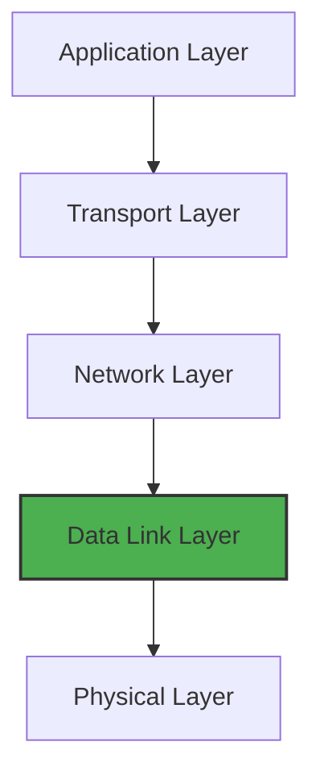

### Primary Responsibilities

The Data Link Layer acts as an intermediary between the physical network medium and the higher-level protocols, handling:

1. **Framing**: Organizing bits into manageable frames
2. **Physical Addressing**: Using MAC addresses for local network communication
3. **Flow Control**: Preventing sender from overwhelming receiver
4. **Error Control**: Detecting and optionally correcting errors
5. **Access Control**: Determining which device can use the medium at a given time

### Why the Data Link Layer Matters

While the Network Layer (Layer 3) handles routing between networks, the Data Link Layer:

- Manages communication within a local network segment
- Deals with hardware addressing and local delivery
- Handles media-specific access rules
- Serves as the foundation for all higher-level network communication

## Data Link Layer Functions

### 1. Framing

Framing divides the bit stream from the physical layer into manageable units called frames:

```
+----------------+----------------+----------------+----------------+
| Frame Header   | Source Address | Destination    | Data + Trailer |
| (Start marker) | (MAC Address)  | (MAC Address)  | (End marker)   |
+----------------+----------------+----------------+----------------+
```

Framing methods include:

- **Character Count**: Specifies the number of characters in the frame
- **Flag Bytes with Byte Stuffing**: Special byte patterns mark frame boundaries
- **Starting and Ending Flags with Bit Stuffing**: Special bit patterns mark frame boundaries
- **Physical Layer Coding Violations**: Uses violations in physical encoding to mark boundaries

### 2. Physical Addressing

Each network interface has a unique identifier (MAC address) that:
- Is typically burned into the hardware
- Consists of 48 bits (6 bytes) in the most common implementation
- Is used for local communication within a network segment

### 3. Flow Control

Prevents a sender from overwhelming a receiver through methods like:

- **Stop and Wait**: Sender waits for acknowledgment before sending the next frame
- **Sliding Window**: Allows multiple frames to be in transit at once

### 4. Error Control

Detects and sometimes corrects transmission errors:

- **Error Detection**: Uses checksums, CRC, or parity bits
- **Error Correction**: May use techniques like Hamming codes
- **ARQ (Automatic Repeat Request)**: Retransmits frames with errors

### 5. Access Control

When multiple devices share a medium (like Ethernet or Wi-Fi), access control:
- Determines which device can transmit and when
- Prevents or handles collisions
- Manages bandwidth allocation

## Data Link Layer Sublayers

The Data Link Layer is commonly divided into two sublayers:

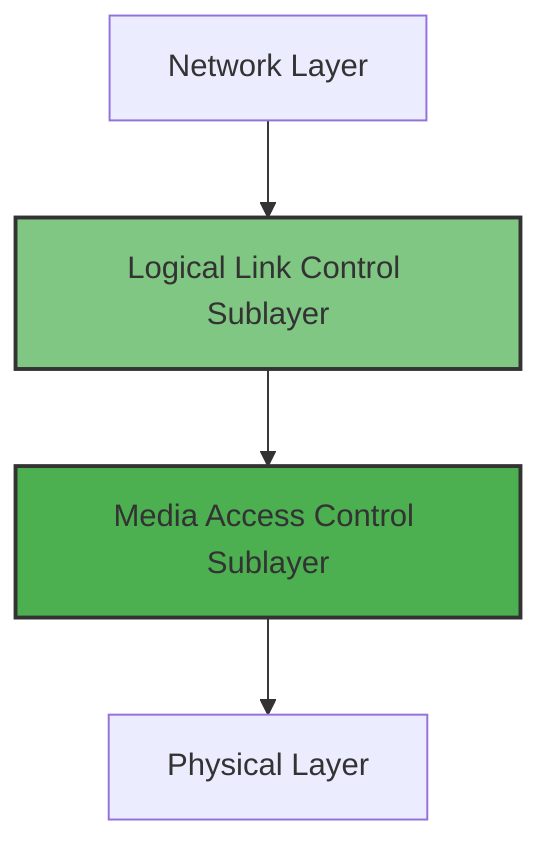

### Logical Link Control (LLC) Sublayer

The LLC sublayer (IEEE 802.2) sits above the MAC sublayer and:

1. **Multiplexes Protocols**: Allows multiple network layer protocols to coexist
2. **Provides Flow Control**: Manages data flow between devices
3. **Handles Error Control**: Performs error checking and recovery
4. **Offers Different Service Types**:
   - **Unacknowledged Connectionless Service**: No connection setup or acknowledgment
   - **Connection-Oriented Service**: Establishes connection before data transfer
   - **Acknowledged Connectionless Service**: Acknowledges received frames without connection

### Media Access Control (MAC) Sublayer

The MAC sublayer handles media-specific functions:

1. **Physical Addressing**: Using MAC addresses for local communication
2. **Media Access**: Determining when a device can transmit
3. **Frame Delimiting**: Marking the beginning and end of frames
4. **Error Detection**: Generating and checking frame check sequences

## Frame Structure

Data Link Layer frames vary by protocol, but most contain these components:

```
 0                   1                   2                   3
 0 1 2 3 4 5 6 7 8 9 0 1 2 3 4 5 6 7 8 9 0 1 2 3 4 5 6 7 8 9 0 1
+-+-+-+-+-+-+-+-+-+-+-+-+-+-+-+-+-+-+-+-+-+-+-+-+-+-+-+-+-+-+-+-+
|                      Frame Delimiter                          |
+-+-+-+-+-+-+-+-+-+-+-+-+-+-+-+-+-+-+-+-+-+-+-+-+-+-+-+-+-+-+-+-+
|                    Destination MAC Address                    |
+                                                               +
|                                                               |
+-+-+-+-+-+-+-+-+-+-+-+-+-+-+-+-+-+-+-+-+-+-+-+-+-+-+-+-+-+-+-+-+
|                      Source MAC Address                       |
+                                                               +
|                                                               |
+-+-+-+-+-+-+-+-+-+-+-+-+-+-+-+-+-+-+-+-+-+-+-+-+-+-+-+-+-+-+-+-+
|        Length/Type           |                               |
+-+-+-+-+-+-+-+-+-+-+-+-+-+-+-+-+                               +
|                                                               |
+                            Payload Data                       +
|                                                               |
+                                                               +
|                                                               |
+-+-+-+-+-+-+-+-+-+-+-+-+-+-+-+-+-+-+-+-+-+-+-+-+-+-+-+-+-+-+-+-+
|                   Frame Check Sequence (FCS)                  |
+-+-+-+-+-+-+-+-+-+-+-+-+-+-+-+-+-+-+-+-+-+-+-+-+-+-+-+-+-+-+-+-+
```

### Common Frame Components

1. **Frame Delimiter/Preamble**: Marks the beginning of the frame
   - In Ethernet: 7 bytes of alternating 1s and 0s followed by a start frame delimiter

2. **Destination Address**: MAC address of the intended recipient
   - Individual (unicast), group (multicast), or all devices (broadcast)

3. **Source Address**: MAC address of the sending device

4. **Length/Type Field**: Indicates either frame length or the protocol type in the payload

5. **Data/Payload**: The actual data being transmitted
   - Contains data from higher layers (typically an IP packet)
   - Usually has minimum and maximum size limits

6. **Frame Check Sequence (FCS)**: Error detection field
   - Typically uses Cyclic Redundancy Check (CRC)
   - Verifies frame integrity

7. **End Delimiter**: In some protocols, marks the end of the frame

### Frame Size Considerations

- **Minimum Frame Size**: Ensures collisions can be detected (64 bytes in Ethernet)
- **Maximum Frame Size (MTU)**: Limits frame size for efficiency and fairness
  - Standard Ethernet: 1518 bytes
  - Jumbo frames: Up to 9000 bytes

## MAC Addressing

Media Access Control (MAC) addresses are physical addresses used in the Data Link Layer.

### MAC Address Format

A MAC address consists of 48 bits (6 bytes), typically written as 12 hexadecimal digits:

```
MM:MM:MM:SS:SS:SS
```

- First half (MM:MM:MM): Organizationally Unique Identifier (OUI)
  - Assigned to manufacturers by IEEE
- Second half (SS:SS:SS): Specific device identifier
  - Assigned by the manufacturer

Example: `00:1A:2B:3C:4D:5E`

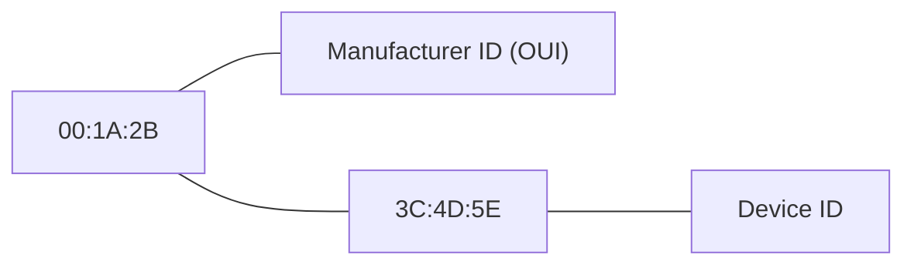

### Types of MAC Addresses

1. **Unicast**: Addresses a single network interface
   - Individual communication between devices
   - First bit of first byte is 0

2. **Multicast**: Addresses a group of network interfaces
   - One-to-many communication
   - First bit of first byte is 1

3. **Broadcast**: Addresses all devices on the local network
   - Special address `FF:FF:FF:FF:FF:FF`
   - Used for network discovery and ARP

### Special MAC Addresses

- **Broadcast**: `FF:FF:FF:FF:FF:FF` - Sends to all devices on the LAN
- **Locally Administered**: Addresses with the second bit of the first byte set to 1
- **Virtual MACs**: Used in virtual environments and for redundancy protocols

### MAC Address Tables

Network switches maintain MAC address tables (forwarding tables):

| MAC Address       | Port | Age (seconds) |
|-------------------|------|---------------|
| 00:1A:2B:3C:4D:5E | 1    | 300           |
| 00:2C:4E:6F:8G:9H | 2    | 120           |
| 00:3D:5F:7G:9I:0J | 3    | 240           |

This table enables switches to forward frames only to the port where the destination device is connected, rather than broadcasting to all ports.

## Media Access Control

Media Access Control methods determine how devices share the transmission medium.

### Classification of MAC Methods

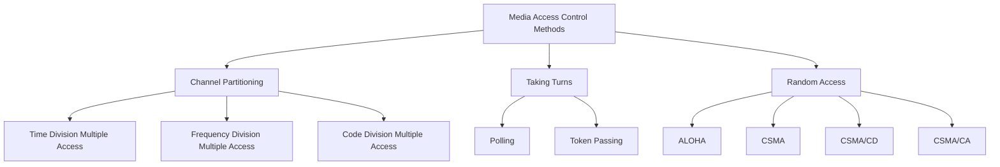

### Channel Partitioning

1. **Time Division Multiple Access (TDMA)**:
   - Divides channel into time slots
   - Each device gets exclusive use during its slot
   - Used in 2G cellular networks

2. **Frequency Division Multiple Access (FDMA)**:
   - Divides channel into frequency bands
   - Each device gets exclusive use of a frequency band
   - Used in radio broadcasting

3. **Code Division Multiple Access (CDMA)**:
   - All devices use same frequency but different codes
   - Uses spread spectrum technology
   - Used in 3G cellular networks

### Taking Turns

1. **Polling**:
   - Central controller asks each device if it has data to transmit
   - Efficient but introduces polling overhead
   - Vulnerable to controller failure

2. **Token Passing**:
   - Special token circulates among devices
   - Only the device with the token can transmit
   - Used in Token Ring and FDDI networks

### Random Access

1. **ALOHA**:
   - Transmit whenever data is available
   - If collision detected, wait random time and retry
   - Original version used in Hawaiian wireless network

2. **Carrier Sense Multiple Access (CSMA)**:
   - Listen before transmitting
   - If medium is busy, wait and try again
   - Reduces collisions but doesn't eliminate them

3. **CSMA with Collision Detection (CSMA/CD)**:
   - Used in traditional Ethernet
   - Listens while transmitting
   - Aborts transmission if collision detected
   - Uses exponential backoff for retransmission

4. **CSMA with Collision Avoidance (CSMA/CA)**:
   - Used in Wi-Fi (802.11)
   - Tries to avoid collisions rather than detect them
   - Uses mechanisms like RTS/CTS and random backoff times

## Error Detection and Correction

Data Link Layer implements various mechanisms to detect and sometimes correct transmission errors.

### Errors in Data Transmission

Errors occur due to:
- Signal attenuation
- Electromagnetic interference
- Physical media defects
- Noise in transmission channels

### Error Detection Methods

1. **Parity Check**:
   - **Single Bit Parity**: Adds one bit to make the number of 1s even or odd
   - **Two-dimensional Parity**: Applies parity horizontally and vertically
   - Simple but only detects odd number of errors

2. **Checksum**:
   - Sums the data values and sends the complement
   - Receiver adds all values including checksum; result should be zero
   - Used in TCP/IP for higher-layer protocols

3. **Cyclic Redundancy Check (CRC)**:
   - Treats bit strings as polynomials and performs polynomial division
   - Remainder becomes the CRC value appended to the data
   - Highly effective at detecting burst errors
   - Standard in most Data Link protocols

```
Data: 101101
Generator Polynomial: 1101 (x³ + x² + 1)

                 1 0 0 1 1
            _____________
1 1 0 1 ) 1 0 1 1 0 1 0 0 0
            1 1 0 1
            _________
              0 1 0 0
              0 0 0 0
              _______
                1 0 0 1
                1 1 0 1
                _______
                  1 0 0

CRC: 100
Transmitted frame: 101101100
```

### Error Correction Methods

1. **Hamming Code**:
   - Adds multiple parity bits at specific positions
   - Can detect and correct single-bit errors
   - Position of error can be determined mathematically

2. **Forward Error Correction (FEC)**:
   - Adds redundant data to allow recovery without retransmission
   - Used in environments where retransmission is costly or impossible
   - Examples: Reed-Solomon codes, Turbo codes

3. **Automatic Repeat reQuest (ARQ)**:
   - Not true correction but handles errors through retransmission
   - Varieties include Stop-and-Wait ARQ, Go-Back-N ARQ, and Selective Repeat ARQ

## Flow Control

Flow control prevents a sender from overwhelming a receiver with data.

### Need for Flow Control

Without flow control:
- Fast senders could overwhelm slow receivers
- Buffer overflows would cause data loss
- Network congestion would increase

### Flow Control Mechanisms

1. **Stop-and-Wait**:
   - Sender transmits a frame and waits for acknowledgment
   - Simple but inefficient, especially over high-latency links
   - Wastes channel capacity

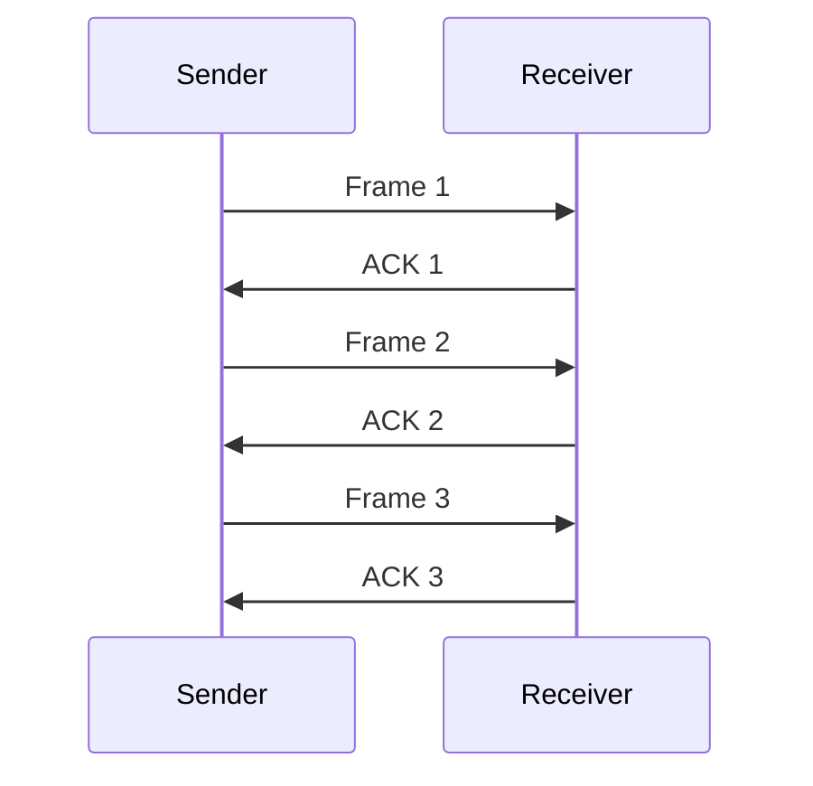

2. **Sliding Window**:
   - Allows multiple unacknowledged frames
   - Window size determines maximum number of outstanding frames
   - More efficient use of bandwidth

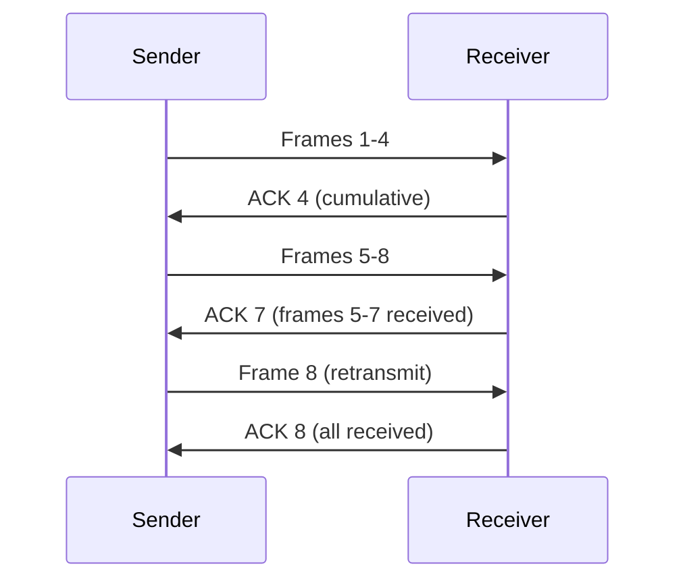

### Buffer Management

Receivers typically implement:
- **Buffer Space**: Temporary storage for incoming frames
- **Window Advertisement**: Informs sender about available buffer space
- **Zero Window Probing**: Checks if a receiver with a zero window has buffer space again

## Address Resolution Protocol (ARP)

ARP resolves IP addresses to MAC addresses on local networks.

### Why ARP is Needed

Devices need both:
- IP addresses (logical, Layer 3) for routing between networks
- MAC addresses (physical, Layer 2) for local delivery

ARP bridges this gap by mapping IP addresses to MAC addresses.

### ARP Process

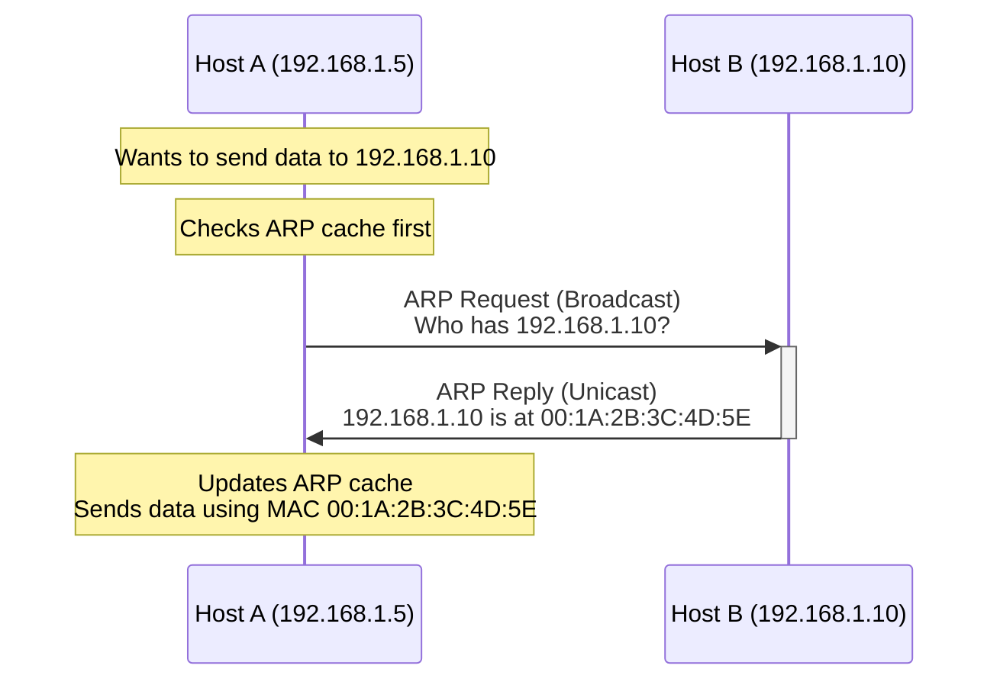

1. **ARP Request**:
   - Broadcast to all devices on the local network
   - "Who has IP address 192.168.1.10?"

2. **ARP Reply**:
   - Unicast from the device with matching IP
   - "192.168.1.10 is at MAC address 00:1A:2B:3C:4D:5E"

3. **ARP Cache**:
   - Temporary storage of IP-to-MAC mappings
   - Reduces need for repeated ARP requests
   - Entries typically timeout after a few minutes

### ARP Packet Format

```
 0                   1                   2                   3
 0 1 2 3 4 5 6 7 8 9 0 1 2 3 4 5 6 7 8 9 0 1 2 3 4 5 6 7 8 9 0 1
+-+-+-+-+-+-+-+-+-+-+-+-+-+-+-+-+-+-+-+-+-+-+-+-+-+-+-+-+-+-+-+-+
|         Hardware Type         |         Protocol Type         |
+-+-+-+-+-+-+-+-+-+-+-+-+-+-+-+-+-+-+-+-+-+-+-+-+-+-+-+-+-+-+-+-+
|  HW Addr Len  | Prot Addr Len |           Operation           |
+-+-+-+-+-+-+-+-+-+-+-+-+-+-+-+-+-+-+-+-+-+-+-+-+-+-+-+-+-+-+-+-+
|                   Sender Hardware Address                     |
+                                                               +
|                                                               |
+-+-+-+-+-+-+-+-+-+-+-+-+-+-+-+-+-+-+-+-+-+-+-+-+-+-+-+-+-+-+-+-+
|                    Sender Protocol Address                    |
+-+-+-+-+-+-+-+-+-+-+-+-+-+-+-+-+-+-+-+-+-+-+-+-+-+-+-+-+-+-+-+-+
|                   Target Hardware Address                     |
+                                                               +
|                                                               |
+-+-+-+-+-+-+-+-+-+-+-+-+-+-+-+-+-+-+-+-+-+-+-+-+-+-+-+-+-+-+-+-+
|                    Target Protocol Address                    |
+-+-+-+-+-+-+-+-+-+-+-+-+-+-+-+-+-+-+-+-+-+-+-+-+-+-+-+-+-+-+-+-+
```

### ARP Cache

The ARP cache stores recently resolved addresses:

```
$ arp -a
? (192.168.1.1) at 00:11:22:33:44:55 [ether] on eth0
? (192.168.1.10) at 00:1a:2b:3c:4d:5e [ether] on eth0
? (192.168.1.15) at 00:aa:bb:cc:dd:ee [ether] on eth0
```

### ARP Variations

1. **Proxy ARP**:
   - Router answers ARP requests on behalf of devices in another network
   - Useful for connecting networks without exposing subnet details

2. **Gratuitous ARP**:
   - Unsolicited ARP announcement
   - Device broadcasts its own IP-to-MAC mapping
   - Used when IP or MAC address changes or during boot

3. **Reverse ARP (RARP)**:
   - Legacy protocol
   - Resolves MAC address to IP address
   - Replaced by BOOTP and DHCP

## Ethernet (IEEE 802.3)

Ethernet is the most widely used Data Link Layer protocol for local area networks (LANs).

### Ethernet Evolution

| Ethernet Version | Speed | Medium | Max Distance | Year |
|------------------|-------|--------|--------------|------|
| 10BASE5 (Thick) | 10 Mbps | Coaxial | 500m | 1983 |
| 10BASE2 (Thin) | 10 Mbps | Coaxial | 185m | 1985 |
| 10BASE-T | 10 Mbps | Twisted Pair | 100m | 1990 |
| 100BASE-TX (Fast) | 100 Mbps | Twisted Pair | 100m | 1995 |
| 1000BASE-T (Gigabit) | 1 Gbps | Twisted Pair | 100m | 1999 |
| 10GBASE-T | 10 Gbps | Twisted Pair | 100m | 2006 |
| 40GBASE-T | 40 Gbps | Twisted Pair | 30m | 2014 |
| 100GBASE-T | 100 Gbps | Twisted Pair | 30m | 2016 |

### Ethernet Frame Format

Standard Ethernet (IEEE 802.3) frame format:

```
+----------------+----------------+----------------+----------------+
| Preamble       | Destination    | Source         | Type/Length    |
| (7 bytes)      | MAC Address    | MAC Address    | (2 bytes)      |
|                | (6 bytes)      | (6 bytes)      |                |
+----------------+----------------+----------------+----------------+
| Data/Payload                                     | FCS/CRC        |
| (46-1500 bytes)                                  | (4 bytes)      |
|                                                  |                |
+--------------------------------------------------+----------------+
```

1. **Preamble and Start Frame Delimiter (SFD)**: 7 bytes of alternating 1s and 0s followed by 10101011
2. **Destination MAC Address**: Target device's MAC address
3. **Source MAC Address**: Sender's MAC address
4. **Type/Length**: Indicates payload length or protocol type (e.g., 0x0800 for IPv4)
5. **Data**: Payload from higher layers (46-1500 bytes)
6. **Frame Check Sequence (FCS)**: 32-bit CRC for error detection

### Ethernet MAC Sublayer

Ethernet uses CSMA/CD (Carrier Sense Multiple Access with Collision Detection):

1. **Listen before transmitting** (Carrier Sense)
2. **Transmit if medium is idle**
3. **Listen while transmitting**
4. **If collision detected**:
   - Send jam signal
   - Wait random backoff time
   - Try again

### Ethernet Switches

Modern Ethernet networks use switches rather than hubs:

- **Learning**: Builds and maintains MAC address tables
- **Forwarding**: Sends frames only to the port where the destination is located
- **Filtering**: Prevents unnecessary traffic on ports
- **Loop avoidance**: Uses Spanning Tree Protocol to prevent loops

## Wireless LANs (IEEE 802.11)

Wireless LANs (Wi-Fi) implement the Data Link Layer for wireless communication.

### IEEE 802.11 Standards

| Standard | Frequency | Max Speed | Approx. Range | Year |
|----------|-----------|-----------|---------------|------|
| 802.11 (Legacy) | 2.4 GHz | 2 Mbps | 20m indoor | 1997 |
| 802.11b | 2.4 GHz | 11 Mbps | 35m indoor | 1999 |
| 802.11a | 5 GHz | 54 Mbps | 35m indoor | 1999 |
| 802.11g | 2.4 GHz | 54 Mbps | 38m indoor | 2003 |
| 802.11n (Wi-Fi 4) | 2.4/5 GHz | 600 Mbps | 70m indoor | 2009 |
| 802.11ac (Wi-Fi 5) | 5 GHz | 6.9 Gbps | 35m indoor | 2013 |
| 802.11ax (Wi-Fi 6) | 2.4/5/6 GHz | 9.6 Gbps | 30m indoor | 2019 |
| 802.11be (Wi-Fi 7) | 2.4/5/6 GHz | 46 Gbps | 30m indoor | 2024 |

### 802.11 Frame Format

```
+------------------+------------------+------------------+------------------+
| Frame Control    | Duration/ID      | Address 1        | Address 2        |
| (2 bytes)        | (2 bytes)        | (6 bytes)        | (6 bytes)        |
+------------------+------------------+------------------+------------------+
| Address 3        | Sequence Control | Address 4        | QoS Control      |
| (6 bytes)        | (2 bytes)        | (6 bytes)        | (2 bytes)        |
+------------------+------------------+------------------+------------------+
| HT Control       | Frame Body       | FCS              |
| (4 bytes)        | (0-7951 bytes)   | (4 bytes)        |
+------------------+------------------+------------------+
```

The multiple address fields accommodate different communication modes:
- **Infrastructure mode**: Communication through access points
- **Ad-hoc mode**: Direct device-to-device communication

### CSMA/CA (Collision Avoidance)

Unlike Ethernet, Wi-Fi uses collision avoidance rather than detection:

1. **Listen before transmitting**
2. **If medium is idle for DIFS (Distributed Inter-Frame Space)**:
   - Transmit
3. **If medium is busy**:
   - Wait for it to become idle
   - Wait additional random backoff time
   - If still idle, transmit

### Hidden Node Problem

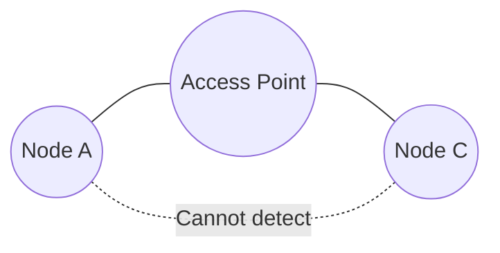

- Node A and C can both communicate with the access point
- But they cannot detect each other's transmissions
- Can lead to collisions at the access point

### RTS/CTS Mechanism

Solves the hidden node problem:

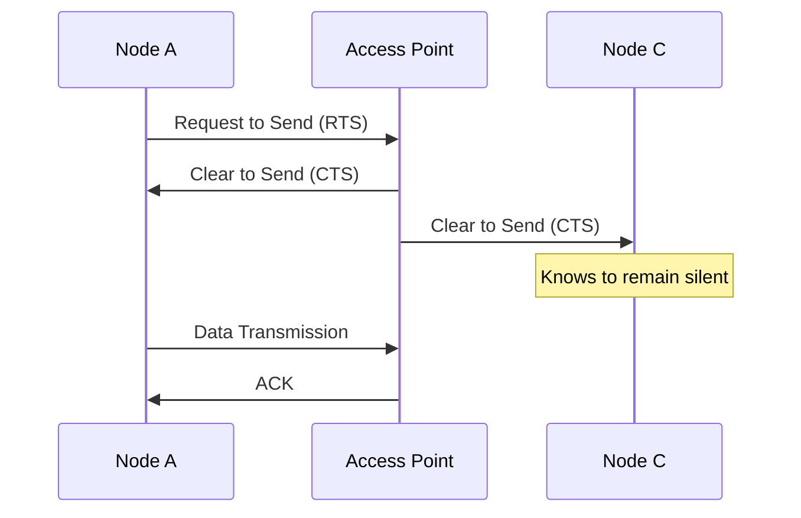

1. **Request to Send (RTS)**: Node indicates desire to transmit
2. **Clear to Send (CTS)**: Access point broadcasts permission
3. **All nodes in range**: Honor the CTS by remaining silent
4. **Data transmission**: Can proceed without collision

## Point-to-Point Protocol (PPP)

PPP provides a standard method for transporting multi-protocol datagrams over point-to-point links.

### PPP Applications

- **Dial-up internet connections** (historical)
- **DSL and cable modem connections**
- **Router-to-router WAN links**
- **Mobile device connections**

### PPP Components

1. **Encapsulation**: Creates standard frame format
2. **Link Control Protocol (LCP)**: Establishes, configures, and tests the link
3. **Network Control Protocols (NCPs)**: Configure different network-layer protocols

### PPP Frame Format

```
+------------+------------+------------+------------+------------+
| Flag       | Address    | Control    | Protocol   | Payload    |
| (1 byte)   | (1 byte)   | (1 byte)   | (2 bytes)  | (Variable) |
| 01111110   | 11111111   | 00000011   |            |            |
+------------+------------+------------+------------+------------+
|                                      | FCS        | Flag       |
|                                      | (2/4 bytes)| (1 byte)   |
|                                      |            | 01111110   |
+--------------------------------------+------------+------------+
```

- **Flag**: Marks frame boundaries
- **Address**: Always set to broadcast (0xFF) as PPP doesn't assign addresses
- **Control**: Set to 0x03 for unnumbered information
- **Protocol**: Identifies the protocol in the payload (e.g., 0x0021 for IPv4)
- **Payload**: Data from higher-layer protocols
- **FCS**: Frame Check Sequence for error detection
- **Flag**: Ending delimiter

### PPP Session Establishment

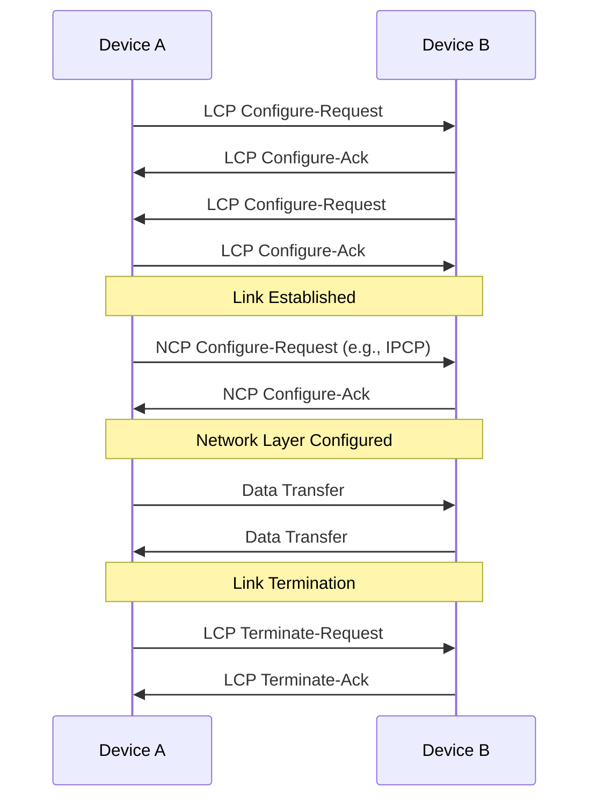

## Other Data Link Layer Protocols

### HDLC (High-level Data Link Control)

- **ISO-standardized** bit-oriented protocol
- **Synchronous** communication
- **Modes**: Normal Response Mode, Asynchronous Response Mode, Asynchronous Balanced Mode
- **Features**: Flow control, error detection, recovery mechanisms
- **Used in**: Serial connections, frame relay, X.25, ISDN

### Frame Relay

- **Simplified** version of X.25
- **Packet-switched** technology
- **Virtual circuits**: PVCs (Permanent) and SVCs (Switched)
- **Minimal error correction**: Assumes reliable physical links
- **CIR (Committed Information Rate)**: Guaranteed bandwidth
- **Largely obsolete** but was widely used for WAN connectivity

### ATM (Asynchronous Transfer Mode)

- **Fixed-size cells** (53 bytes)
- **Connection-oriented** service
- **QoS capabilities**: Different service classes for different traffic types
- **Used in**: Backbone networks, DSL implementations
- **Advantages**: Low latency, predictable performance
- **Disadvantages**: Overhead for small packets

### MPLS (Multiprotocol Label Switching)

- **Operates between** Layer 2 and Layer 3
- **Label-based** forwarding instead of IP-based routing
- **Traffic engineering** capabilities
- **Support for VPNs** and QoS
- **Widely used** in service provider networks
- **Advantages**: Fast forwarding, path control, protocol independence

## Switches and Bridges

Switches and bridges operate at the Data Link Layer to connect network segments.

### Bridges vs. Switches

| Feature | Bridge | Switch |
|---------|--------|--------|
| Ports | Few (2-4) | Many (4-96+) |
| Processing | Software-based | Hardware-based |
| Performance | Lower | Higher |
| Form Factor | Standalone | Rack-mountable |
| Functionality | Basic forwarding | Advanced features |
| Cost | Lower | Higher |

Despite differences, the fundamental operation is similar.

### Switch/Bridge Operation

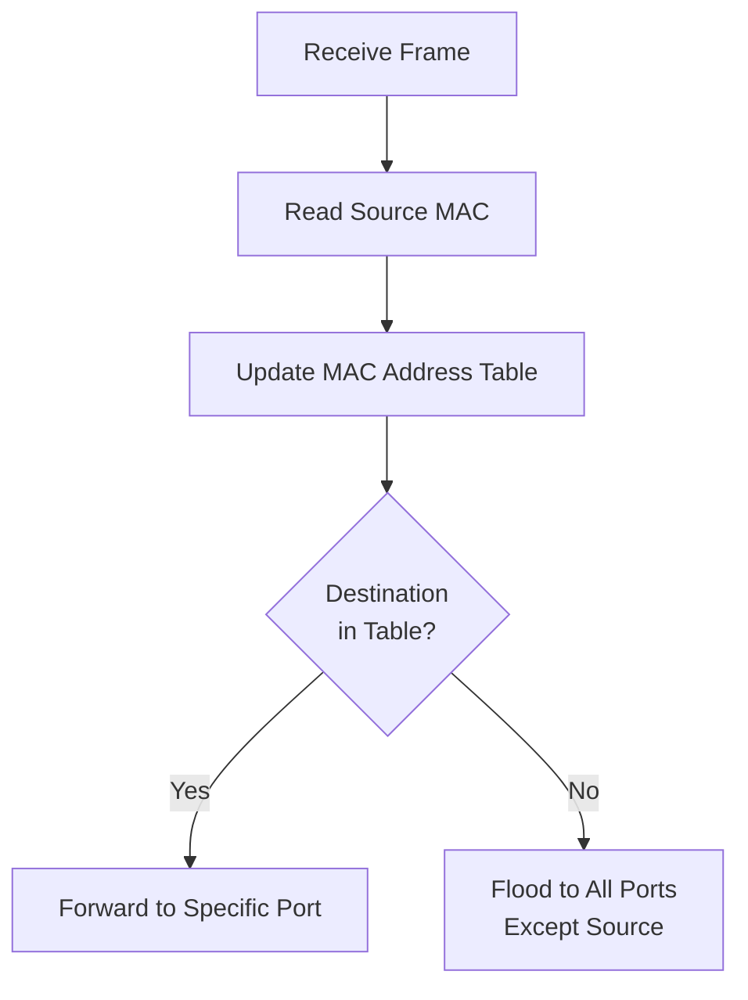

1. **Learning**: Build MAC address table by examining source addresses
2. **Forwarding/Filtering**: Use MAC address table to send frames only to needed ports
3. **Flooding**: Send to all ports (except source) when destination is unknown
4. **Aging**: Remove table entries after timeout period (typically 300 seconds)

### Switch Types

1. **Unmanaged Switches**:
   - Plug-and-play operation
   - No configuration options
   - For simple networks

2. **Managed Switches**:
   - Configurable settings
   - VLAN support
   - QoS capabilities
   - Security features
   - Monitoring and management

3. **Layer 3 Switches**:
   - Combine switching and routing
   - Make forwarding decisions based on IP addresses
   - Faster than traditional routers for inter-VLAN routing

## Virtual LANs (VLANs)

VLANs logically segment a switched network independent of physical location.

### VLAN Benefits

1. **Improved Security**: Isolate sensitive systems
2. **Reduced Broadcast Domains**: Limit broadcast traffic
3. **Simplified Management**: Group by function rather than location
4. **Traffic Control**: Apply policies to specific VLANs
5. **Reduced Hardware Costs**: Use one physical switch for multiple logical networks

### VLAN Types

1. **Port-Based VLANs**:
   - Each switch port assigned to a specific VLAN
   - Simplest implementation
   - Limited flexibility

2. **Protocol-Based VLANs**:
   - Membership based on Layer 3 protocol (IPv4, IPv6, etc.)
   - Useful for protocol migration

3. **MAC-Based VLANs**:
   - Membership based on MAC address
   - Allows device mobility
   - More administrative overhead

### IEEE 802.1Q

The 802.1Q standard defines VLAN tagging:

```
 Original Ethernet Frame
 +----------------+----------------+----------------+----------------+
 | Dest MAC       | Source MAC     | Type/Length    | Data           |
 +----------------+----------------+----------------+----------------+

 802.1Q Tagged Frame
 +----------------+----------------+----------------+----------------+
 | Dest MAC       | Source MAC     | 802.1Q Tag     | Type/Length    |
 +----------------+----------------+----------------+----------------+
 |                                                                   |
 | Data                                                              |
 |                                                                   |
 +-------------------------------------------------------------------+
 
 802.1Q Tag Detail
 +----------------+----------------+
 | TPID (0x8100)  | TCI            |
 | (2 bytes)      | (2 bytes)      |
 +----------------+----------------+
 
 TCI (Tag Control Information)
 +-+-+-+-+-+-+-+-+-+-+-+-+-+-+-+-+
 |P|P|P|C|     VLAN ID (VID)     |
 |R|R|R|F|                       |
 |I|I|I|I|                       |
 +-+-+-+-+-+-+-+-+-+-+-+-+-+-+-+-+
```

- **TPID (Tag Protocol Identifier)**: Set to 0x8100 for 802.1Q
- **PRI (Priority)**: Class of Service (CoS) priority level (0-7)
- **CFI (Canonical Format Indicator)**: Usually 0
- **VID (VLAN ID)**: VLAN number (0-4095, with 0 and 4095 reserved)

### VLAN Trunking

Trunking allows multiple VLANs to be carried over a single physical link:

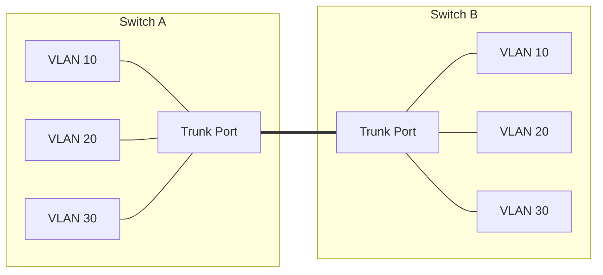

- **Access Ports**: Connected to end devices, untagged frames
- **Trunk Ports**: Connected between switches, tagged frames
- **Native VLAN**: Untagged VLAN on a trunk (typically VLAN 1)

### Inter-VLAN Routing

Devices on different VLANs cannot communicate directly; routing is required:

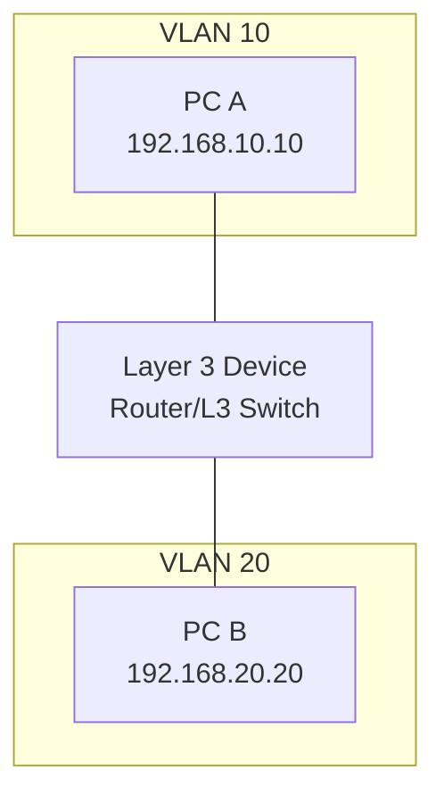

Methods include:
1. **Router on a Stick**: Single physical connection with subinterfaces
2. **Layer 3 Switch**: Direct routing between VLANs
3. **Firewall Routing**: Adds security policies between VLANs

## Spanning Tree Protocol

Spanning Tree Protocol (STP) prevents loops in switched networks.

### The Loop Problem

Without STP, redundant connections create broadcast storms:

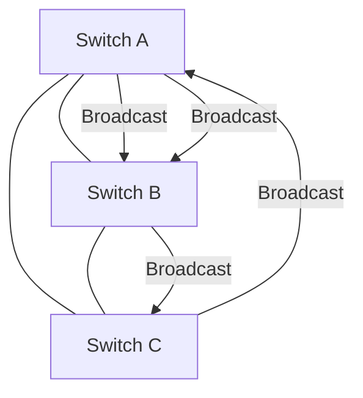

Consequences include:
- **Broadcast Storms**: Endless duplication of broadcast frames
- **MAC Flapping**: MAC addresses appear on multiple ports
- **Exhausted Resources**: High CPU and bandwidth utilization

### IEEE 802.1D STP

STP creates a loop-free logical topology:

1. **Elect a Root Bridge**: Switch with lowest Bridge ID (priority + MAC)
2. **Identify Root Ports**: Each non-root switch's best path to root
3. **Identify Designated Ports**: Best port for each segment
4. **Block Redundant Ports**: Put non-designated, non-root ports in blocking state

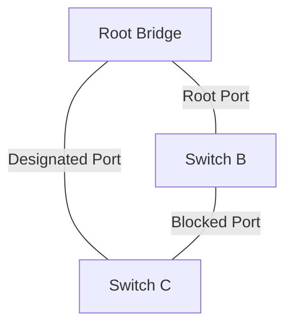

### Port States

STP ports transition through states:

1. **Blocking**: Doesn't forward frames, listens to BPDUs (20 sec)
2. **Listening**: Doesn't forward frames, processes BPDUs (15 sec)
3. **Learning**: Doesn't forward frames, builds MAC table (15 sec)
4. **Forwarding**: Normal operation, forwards frames
5. **Disabled**: Administratively shut down

### STP Improvements

1. **Rapid STP (RSTP / IEEE 802.1w)**:
   - Faster convergence (seconds instead of 50 seconds)
   - Simplified port states (Discarding, Learning, Forwarding)
   - Backup port roles
   - Proactive topology change mechanisms

2. **Multiple STP (MSTP / IEEE 802.1s)**:
   - Maps multiple VLANs to fewer spanning tree instances
   - Allows load balancing across redundant links
   - More efficient use of bandwidth

3. **Per-VLAN Spanning Tree (PVST+)**:
   - Cisco proprietary
   - Separate spanning tree for each VLAN
   - Allows different root bridges and topologies per VLAN

## Practice Questions

Test your understanding of the Data Link Layer with these questions:

1. **What is the main purpose of the Data Link Layer in the OSI model?**
   <details>
   <summary>Answer</summary>
   The Data Link Layer provides reliable node-to-node data transfer over a physical link. It packages raw bits from the physical layer into frames, handles physical addressing with MAC addresses, detects and potentially corrects errors in transmission, controls access to the shared medium, and regulates data flow between nodes.
   </details>

2. **How does a switch differ from a hub in terms of Data Link Layer functions?**
   <details>
   <summary>Answer</summary>
   A switch operates at the Data Link Layer and makes forwarding decisions based on MAC addresses. It maintains a MAC address table and forwards frames only to the specific port where the destination device is connected. This creates separate collision domains for each port. A hub operates at the Physical Layer, simply repeating incoming signals to all ports, creating a single collision domain and providing no intelligent forwarding.
   </details>

3. **Explain the difference between CSMA/CD and CSMA/CA. Where is each used?**
   <details>
   <summary>Answer</summary>
   CSMA/CD (Carrier Sense Multiple Access with Collision Detection) listens before and during transmission. If a collision is detected, it stops transmission, sends a jam signal, and retries after a random backoff time. It's used in traditional Ethernet.
   
   CSMA/CA (Carrier Sense Multiple Access with Collision Avoidance) attempts to avoid collisions rather than detect them. It uses random backoff times before transmission and optional RTS/CTS (Request to Send/Clear to Send) mechanisms. It's used in wireless networks (Wi-Fi) where collision detection is difficult or impossible.
   </details>

4. **What is the purpose of the ARP protocol and how does it work?**
   <details>
   <summary>Answer</summary>
   ARP (Address Resolution Protocol) resolves IP addresses (Layer 3) to MAC addresses (Layer 2) on local networks. When a device needs to communicate with another device on the same network, it first checks its ARP cache. If the mapping isn't found, it broadcasts an ARP request asking "Who has IP address x.x.x.x?" The device with that IP address responds with its MAC address. The original device then updates its ARP cache and uses the MAC address for frame delivery.
   </details>

5. **What is the difference between a MAC address and an IP address?**
   <details>
   <summary>Answer</summary>
   MAC addresses are 48-bit physical addresses assigned to network interfaces by manufacturers. They operate at the Data Link Layer (Layer 2), are typically permanent, have local significance only (within a broadcast domain), and are used for frame delivery on the local network.
   
   IP addresses are logical addresses that operate at the Network Layer (Layer 3). They can be assigned and changed through configuration, have global significance for routing across networks, and identify a device's location in the network topology rather than the physical hardware.
   </details>

6. **What is the purpose of a VLAN and what problem does it solve?**
   <details>
   <summary>Answer</summary>
   VLANs (Virtual Local Area Networks) logically segment a single physical network into multiple broadcast domains. They solve several problems:
   1. Security: Isolate sensitive systems from unauthorized access
   2. Broadcast control: Reduce unnecessary broadcast traffic by limiting broadcast domains
   3. Network organization: Group users by department or function rather than physical location
   4. Traffic management: Apply different policies to different VLANs
   5. Reduced hardware costs: Use one physical switch infrastructure for multiple logical networks
   </details>

7. **Explain how the Spanning Tree Protocol prevents loops in switched networks.**
   <details>
   <summary>Answer</summary>
   Spanning Tree Protocol (STP) prevents loops by creating a loop-free logical topology from a physically redundant one. It:
   1. Elects a Root Bridge (switch) based on Bridge ID (priority + MAC address)
   2. Identifies the best path from each non-root switch to the Root Bridge (Root Port)
   3. For each network segment, determines the best switch to forward frames (Designated Port)
   4. Blocks all other ports that would create loops (Blocking state)
   
   This creates a single path between any two points in the network, preventing broadcast storms and other loop-related issues while maintaining physical redundancy for fault tolerance.
   </details>

8. **How does error detection work at the Data Link Layer? Compare CRC with simple parity checks.**
   <details>
   <summary>Answer</summary>
   Error detection at the Data Link Layer identifies transmission errors so that frames can be discarded or retransmitted.
   
   CRC (Cyclic Redundancy Check) treats bit strings as polynomials and performs polynomial division using a generator polynomial. The remainder becomes the CRC value appended to the data. The receiver performs the same calculation and verifies the result. CRC can detect burst errors and is highly reliable.
   
   Simple parity checks add one bit to make the total number of 1s even (even parity) or odd (odd parity). The receiver checks if the parity is maintained. Parity can only detect odd numbers of bit errors and cannot detect many common error patterns.
   
   CRC is far more robust than parity checking, which is why it's the standard in most Data Link protocols.
   </details>

## Additional Resources

### Books
- **Computer Networks: A Systems Approach** by Larry Peterson and Bruce Davie
- **Data and Computer Communications** by William Stallings
- **Computer Networks** by Andrew S. Tanenbaum and David J. Wetherall

### Online Resources
- [IEEE 802 Standards](https://www.ieee802.org/)
- [Ethernet: The Definitive Guide** by Charles E. Spurgeon](https://www.oreilly.com/library/view/ethernet-the-definitive/9781449362980/)
- [Wireshark University](https://www.wireshark.org/docs/)

### Tools
- **Wireshark**: Network protocol analyzer for examining Data Link Layer frames
- **Packet Tracer/GNS3**: Network simulators for experimenting with switches and VLANs
- **tcpdump**: Command-line packet analyzer

### Video Resources
- [Professor Messer's Network+ Course](https://www.professormesser.com/network-plus/n10-008/n10-008-video/ethernet-standards-n10-008/)
- [Khan Academy's Internet Course](https://www.khanacademy.org/computing/computers-and-internet)
- [YouTube: How Ethernet Works](https://www.youtube.com/watch?v=5u7pig0AyK4)
