# Day 17: Physical Layer

<div align="center">
  
  
  <h1>⚡ Physical Layer: The Foundation of Networking ⚡</h1>
  
  <p>
    
    
    
    
  </p>
  
  <hr>
</div>

## Table of Contents
- [Introduction to the Physical Layer](#introduction-to-the-physical-layer)
- [Transmission Media](#transmission-media)
- [Signal Encoding Techniques](#signal-encoding-techniques)
- [Digital Transmission](#digital-transmission)
- [Analog Transmission](#analog-transmission)
- [Multiplexing](#multiplexing)
- [Switching Methods](#switching-methods)
- [Transmission Modes](#transmission-modes)
- [Network Topology at Physical Layer](#network-topology-at-physical-layer)
- [Physical Layer Protocols and Standards](#physical-layer-protocols-and-standards)
- [Bandwidth, Throughput, and Latency](#bandwidth-throughput-and-latency)
- [Channel Capacity and Nyquist-Shannon Theorem](#channel-capacity-and-nyquist-shannon-theorem)
- [Physical Layer Devices](#physical-layer-devices)
- [Last Mile Technologies](#last-mile-technologies)
- [Wireless Physical Layer](#wireless-physical-layer)
- [Noise, Attenuation, and Interference](#noise-attenuation-and-interference)
- [Practice Questions](#practice-questions)
- [Additional Resources](#additional-resources)

## Introduction to the Physical Layer

The Physical Layer is the first and lowest layer in the OSI (Open Systems Interconnection) model. It provides the means to transmit raw bits over a physical medium, defining the electrical, mechanical, procedural, and functional specifications for activating, maintaining, and deactivating physical connections.

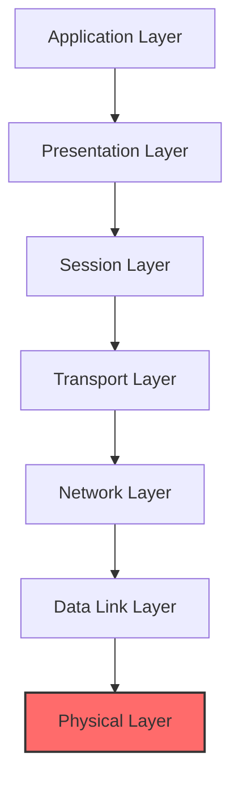

### Key Responsibilities

The Physical Layer is responsible for:

1. **Bit Transmission**: Converting data bits into electrical, radio, or optical signals for transmission
2. **Physical Medium Characteristics**: Defining cable types, connector designs, and signal levels
3. **Data Rate**: Specifying the transmission rate (bits per second)
4. **Synchronization**: Providing bit-level synchronization between sender and receiver
5. **Physical Topologies**: Defining how devices are physically arranged (bus, ring, star, etc.)
6. **Transmission Mode**: Specifying simplex, half-duplex, or full-duplex communication

### Position in the Network Stack

While higher layers deal with logical concepts like addressing, routing, and applications, the Physical Layer handles the tangible aspects of networking:

- It transforms the logical communication channel from the Data Link Layer into a physical connection
- It represents the boundary between software and hardware in network communications
- It's the layer where bits become signals and vice versa

## Transmission Media

Transmission media are the physical pathways that connect devices in a network. They can be broadly classified as guided (wired) or unguided (wireless) media.

### Guided Transmission Media

#### 1. Twisted Pair Cable

Twisted pair cables consist of pairs of insulated copper wires twisted together to reduce electromagnetic interference.

**Types:**
- **Unshielded Twisted Pair (UTP)**: Common in Ethernet networks, categorized from Cat 1 to Cat 8
- **Shielded Twisted Pair (STP)**: Includes extra shielding for better noise protection

**Categories of UTP:**

| Category | Bandwidth | Speed | Common Use |
|----------|-----------|-------|------------|
| Cat 3    | 16 MHz    | 10 Mbps | Legacy Ethernet, Telephone |
| Cat 5    | 100 MHz   | 100 Mbps | Fast Ethernet |
| Cat 5e   | 100 MHz   | 1 Gbps | Gigabit Ethernet |
| Cat 6    | 250 MHz   | 1-10 Gbps | Gigabit/10G Ethernet |
| Cat 6a   | 500 MHz   | 10 Gbps | 10G Ethernet (100m) |
| Cat 7    | 600 MHz   | 10+ Gbps | 10G+ Ethernet, Shielded |
| Cat 8    | 2000 MHz  | 25-40 Gbps | Data centers |

**Advantages:**
- Inexpensive and easy to install
- Flexible and lightweight
- Well-established technology

**Disadvantages:**
- Limited bandwidth compared to fiber optic
- Distance limitations (typically 100m for Ethernet)
- Susceptible to electromagnetic interference

#### 2. Coaxial Cable

Coaxial cable consists of a central copper conductor surrounded by insulation, a braided metal shield, and an outer jacket.

**Types:**
- **Baseband Coaxial**: Used for digital transmission (e.g., traditional Ethernet)
- **Broadband Coaxial**: Used for analog transmission (e.g., cable TV)

**Examples:**
- **RG-6**: Common for cable TV and internet
- **RG-58**: Used in legacy 10BASE2 Ethernet (Thinnet)
- **RG-8**: Used in legacy 10BASE5 Ethernet (Thicknet)

**Advantages:**
- Higher bandwidth than twisted pair
- Better noise immunity
- Supports longer distances

**Disadvantages:**
- More expensive than twisted pair
- Bulkier and less flexible
- More difficult to install

#### 3. Fiber Optic Cable

Fiber optic cables transmit data as pulses of light through glass or plastic fibers.

**Types:**
- **Single-mode Fiber (SMF)**: Uses a single ray of light, allowing for longer distances
- **Multi-mode Fiber (MMF)**: Uses multiple rays of light, suitable for shorter distances


**Characteristics:**

| Feature | Single-mode Fiber | Multi-mode Fiber |
|---------|-------------------|------------------|
| Core diameter | 8-10 μm | 50-62.5 μm |
| Light source | Laser | LED |
| Bandwidth | Higher | Lower |
| Distance | Up to 100 km | Up to 2 km |
| Cost | Higher | Lower |

**Advantages:**
- Extremely high bandwidth
- Immunity to electromagnetic interference
- Very low signal attenuation (signal loss)
- Secure (difficult to tap)

**Disadvantages:**
- More expensive than copper cabling
- More difficult to install and terminate
- Requires specialized equipment
- Fragile compared to copper

### Unguided Transmission Media (Wireless)

#### 1. Radio Waves

Radio waves are electromagnetic waves with frequencies ranging from 3 Hz to 3 GHz.

**Applications:**
- AM and FM radio
- Cellular networks
- Wi-Fi (2.4 GHz and 5 GHz bands)
- Bluetooth
- Zigbee

**Characteristics:**
- Can penetrate walls and buildings
- Cover long distances
- Omnidirectional (broadcast in all directions)
- Subject to interference and regulation

#### 2. Microwaves

Microwaves are high-frequency radio waves (typically 1 GHz to 300 GHz).

**Applications:**
- Point-to-point communication links
- Satellite communication
- Wireless LANs (higher frequency bands)
- Radar systems

**Characteristics:**
- Line-of-sight transmission
- Highly directional
- Less susceptible to interference than lower-frequency radio
- Affected by weather conditions (rain fade)

#### 3. Infrared

Infrared (IR) transmits data using infrared light waves.

**Applications:**
- Remote controls
- Short-range communication between devices
- IrDA (Infrared Data Association) ports on older devices

**Characteristics:**
- Very short range (typically a few meters)
- Cannot penetrate walls or obstacles
- Immune to radio frequency interference
- Secure due to containment within rooms

#### 4. Light (Visible Light Communication)

Uses visible light to transmit data, such as Li-Fi technology.

**Applications:**
- Indoor networking
- Locations where RF is problematic (hospitals, aircraft)
- Supplemental to existing wireless technologies

**Characteristics:**
- Very high bandwidth potential
- Limited to line of sight
- Cannot penetrate walls
- Low interference with other systems

### Comparison of Transmission Media

| Medium | Bandwidth | Distance | Cost | Security | Immunity to EMI |
|--------|-----------|----------|------|----------|-----------------|
| UTP | Low-Medium | 100m | Low | Low | Low |
| STP | Medium | 100m | Low-Medium | Low | Medium |
| Coaxial | Medium | 500m | Medium | Medium | Medium |
| Multimode Fiber | High | 2km | High | High | High |
| Single-mode Fiber | Very High | 100km | Very High | High | High |
| Radio Waves | Low-Medium | Varies | Medium | Low | Low |
| Microwaves | Medium | Line of sight | High | Medium | Medium |
| Infrared | Low | Few meters | Low | Medium | High |

## Signal Encoding Techniques

Signal encoding converts digital data (bits) into signals suitable for transmission over physical media.

### Line Coding

Line coding is the process of converting binary data (0s and 1s) into digital signals.

#### 1. Non-Return to Zero (NRZ)

In NRZ encoding, the signal level remains constant during a bit interval.

**Types:**
- **NRZ-L (Level)**: 1 is represented by one voltage level, 0 by another
- **NRZ-I (Invert)**: 1 causes a signal change, 0 causes no change

**Advantages:**
- Simple implementation
- Efficient use of bandwidth

**Disadvantages:**
- No self-clocking
- DC component present
- Difficult to detect errors

#### 2. Return to Zero (RZ)

In RZ encoding, the signal returns to zero between each bit.

**Characteristics:**
- Signal returns to zero in the middle of each bit
- Uses three voltage levels
- Contains built-in synchronization

**Advantages:**
- Self-clocking
- Easy error detection

**Disadvantages:**
- Requires more bandwidth
- More complex

#### 3. Manchester Encoding

Combines data and clock signals by representing bits as transitions rather than levels.

**Characteristics:**
- 0 is represented by high-to-low transition
- 1 is represented by low-to-high transition
- Transition always occurs in the middle of each bit

**Advantages:**
- Self-clocking
- No DC component
- Error detection capability

**Disadvantages:**
- Requires twice the bandwidth of NRZ

```
Data:        1   0   1   1   0   0   1   0
NRZ-L:       _‾‾‾‾‾_____‾‾‾‾‾‾‾‾‾‾_____‾‾‾‾‾_____
NRZ-I:       _‾‾‾‾‾_____‾‾‾‾‾_____‾‾‾‾‾_____‾‾‾‾‾
Manchester:  _‾‾__‾‾__‾‾__‾‾__‾‾__‾‾__‾‾__‾‾__‾‾_
            ↑  ↑  ↑  ↑  ↑  ↑  ↑  ↑  ↑  ↑  ↑  ↑  ↑
```

#### 4. Differential Manchester

A variation of Manchester encoding where the transition at the beginning of a bit period represents the data.

**Characteristics:**
- Always has a transition in the middle of the bit
- Presence or absence of transition at the beginning determines the bit value

**Advantages:**
- Self-clocking
- Less affected by noise
- No DC component

**Disadvantages:**
- Requires twice the bandwidth of NRZ

#### 5. Bipolar AMI (Alternate Mark Inversion)

Uses three voltage levels: positive, negative, and zero.

**Characteristics:**
- 0 is represented by no signal (zero voltage)
- 1 alternates between positive and negative voltages

**Advantages:**
- No DC component
- Error detection capability
- Lower bandwidth requirement than Manchester

**Disadvantages:**
- Not self-clocking for long sequences of 0s

#### 6. 4B/5B Encoding

Maps 4-bit data symbols to 5-bit code symbols to ensure sufficient transitions.

**Characteristics:**
- Groups of 4 bits are encoded as 5-bit patterns
- Ensures no more than three consecutive zeros
- Often used with NRZI for transmission

**Advantages:**
- Self-clocking
- Efficient use of bandwidth
- DC balance

**Disadvantages:**
- 25% overhead
- More complex implementation

### Modulation Techniques

Modulation is the process of encoding digital information onto analog carrier signals.

#### 1. Amplitude Modulation (AM)

Varies the amplitude of the carrier signal.

**Digital version: Amplitude Shift Keying (ASK)**
- Different amplitudes represent different bit patterns
- Simple implementation
- Sensitive to noise and attenuation

#### 2. Frequency Modulation (FM)

Varies the frequency of the carrier signal.

**Digital version: Frequency Shift Keying (FSK)**
- Different frequencies represent different bit patterns
- More resistant to noise than ASK
- Requires more bandwidth

#### 3. Phase Modulation (PM)

Varies the phase of the carrier signal.

**Digital version: Phase Shift Keying (PSK)**
- Different phases represent different bit patterns
- More bandwidth-efficient than FSK
- Used in many modern communication systems

#### 4. Quadrature Amplitude Modulation (QAM)

Combines amplitude and phase modulation.

**Characteristics:**
- Uses different combinations of amplitude and phase
- Commonly used in cable modems, DSL, Wi-Fi
- High spectral efficiency

```
4-QAM Constellation Diagram:
    Q
    |
 1  |  o       o
    |
    |--------------> I
    |
-1  |  o       o
    |
   -1       1
```

**Example: 16-QAM**
- Uses 16 different combinations of amplitude and phase
- Each symbol represents 4 bits
- Higher data rates but more susceptible to noise

## Digital Transmission

Digital transmission involves sending digital signals over a physical medium. It's the process of transmitting digitally encoded information over a point-to-point or point-to-multipoint communication channel.

### Baseband Transmission

Baseband transmission uses the entire bandwidth of the medium to send a single digital signal.

**Characteristics:**
- Digital signals are sent directly on the medium
- Uses line coding techniques (NRZ, Manchester, etc.)
- The entire bandwidth is used for a single signal
- Common in LANs (Ethernet)

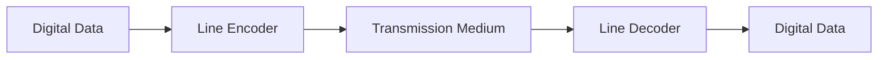

### Broadband Transmission

Broadband transmission uses modulation techniques to send multiple signals simultaneously over different frequencies.

**Characteristics:**
- Uses analog signaling techniques
- Requires modulation and demodulation
- Divides the bandwidth into channels
- Common in cable TV, DSL, and cellular networks

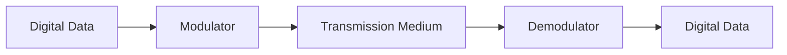

### Parallel vs. Serial Transmission

#### Parallel Transmission

In parallel transmission, multiple bits are sent simultaneously over separate channels.

**Characteristics:**
- Multiple wires, each carrying one bit
- Faster over short distances
- Subject to timing skew over long distances
- Examples: Old printer ports, IDE/PATA interfaces

#### Serial Transmission

In serial transmission, bits are sent one after another over a single channel.

**Characteristics:**
- Single wire carrying a sequence of bits
- More efficient for long-distance communication
- Examples: USB, SATA, Ethernet, most modern interfaces

**Types of Serial Transmission:**
- **Asynchronous**: Sender and receiver operate on independent clocks, synchronized by start/stop bits
- **Synchronous**: Sender and receiver operate on the same clock signal

## Analog Transmission

Analog transmission involves sending continuously varying signals over a physical medium. It's often used for long-distance communication and when interfacing with analog systems.

### Modulation in Analog Transmission

When digital data needs to be transmitted over analog systems, modulation is required.


### Bandwidth Utilization

Analog transmission techniques allow for efficient use of bandwidth:

1. **Frequency Division Multiplexing (FDM)**: Divides the bandwidth into non-overlapping frequency bands
2. **Wavelength Division Multiplexing (WDM)**: Similar to FDM but for optical systems

### Analog vs. Digital Transmission

| Feature | Analog Transmission | Digital Transmission |
|---------|---------------------|----------------------|
| Signal Type | Continuous | Discrete |
| Noise Immunity | Low | High |
| Attenuation | Cumulative, degrades signal | Can be regenerated |
| Bandwidth Efficiency | Often higher | Often lower |
| Error Detection | Difficult | Built-in |
| Hardware Complexity | Generally simpler | More complex |
| Examples | Traditional telephony, AM/FM radio | Modern networks, digital telephony |

## Multiplexing

Multiplexing allows multiple signals to share a single transmission medium, increasing the efficiency of communication channels.

### Time Division Multiplexing (TDM)

TDM allocates the full bandwidth of the channel to each user for a fixed time slot.

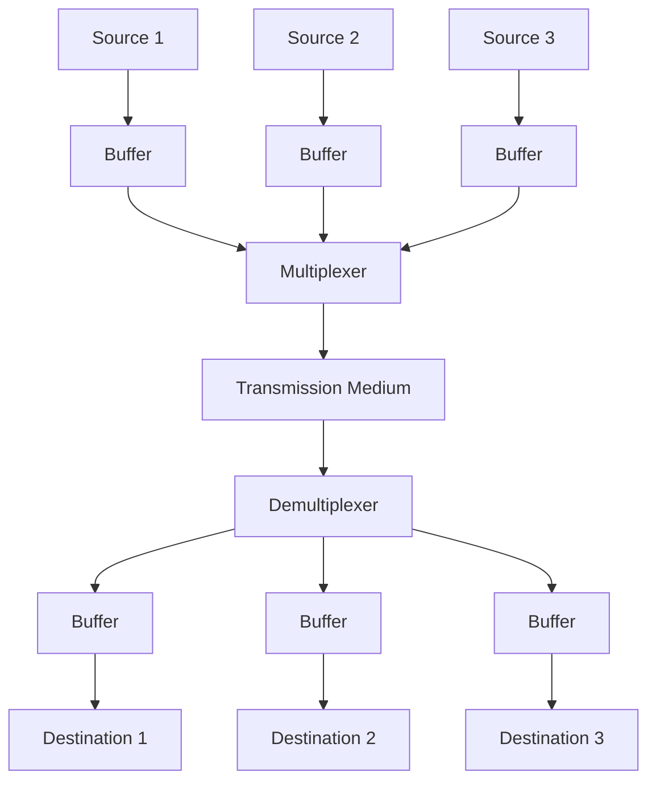

**Types:**
- **Synchronous TDM**: Fixed time slots regardless of whether a source has data to send
- **Statistical TDM**: Dynamic allocation of time slots based on demand

**Applications:**
- T1/E1 lines
- SONET/SDH
- Digital telephony

### Frequency Division Multiplexing (FDM)

FDM divides the available bandwidth into non-overlapping frequency bands, each carrying a separate signal.

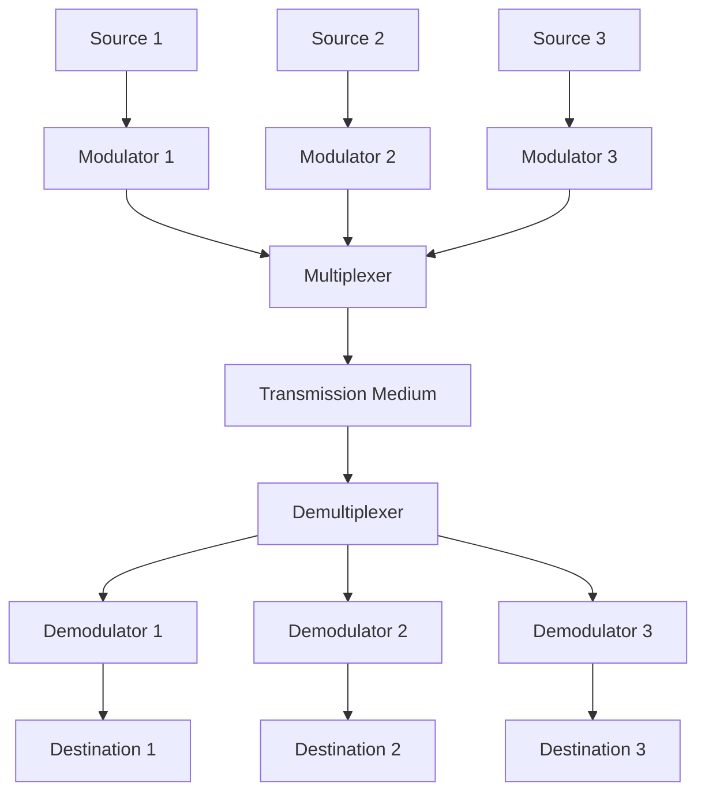

**Applications:**
- AM/FM radio broadcasting
- Cable TV
- Analog telephony

### Wavelength Division Multiplexing (WDM)

WDM is similar to FDM but operates in the optical domain, using different wavelengths (colors) of light.

**Types:**
- **Coarse WDM (CWDM)**: Uses widely spaced wavelengths
- **Dense WDM (DWDM)**: Uses closely spaced wavelengths for higher capacity

**Applications:**
- Fiber optic communications
- Long-distance telecommunications
- Submarine cables

### Code Division Multiplexing (CDM)

CDM allows multiple users to share the same frequency band simultaneously through the use of unique codes.

**Applications:**
- CDMA cellular networks
- GPS
- Military communications

### Orthogonal Frequency Division Multiplexing (OFDM)

OFDM splits a high-data-rate stream into multiple lower-rate streams transmitted over closely spaced orthogonal subcarriers.

**Applications:**
- Wi-Fi (802.11a/g/n/ac/ax)
- 4G/5G cellular networks
- Digital TV broadcasting
- DSL technologies

## Switching Methods

Switching methods determine how data is routed through a network at the physical layer.

### Circuit Switching

In circuit switching, a dedicated communication path is established between sender and receiver before data transmission begins.

**Characteristics:**
- Fixed bandwidth allocation
- Connection-oriented
- Guaranteed quality of service
- Inefficient for bursty traffic

**Examples:**
- Traditional telephone network (PSTN)
- ISDN

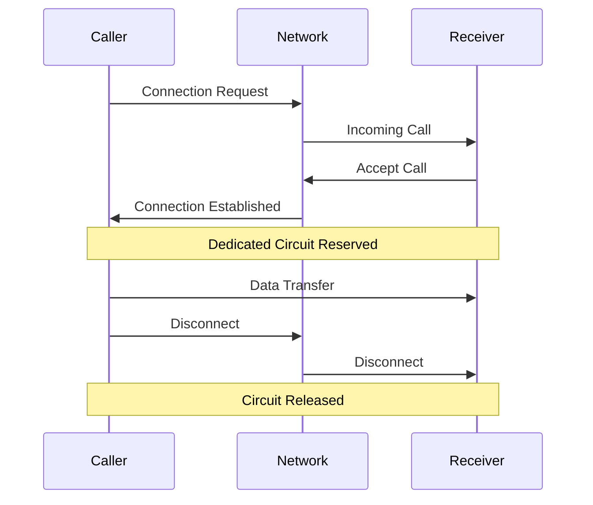

### Packet Switching

In packet switching, data is divided into packets that are routed independently through the network.

**Characteristics:**
- Shared bandwidth allocation
- No dedicated path
- Better suited for bursty traffic
- May have variable delay and quality

**Types:**
- **Datagram Packet Switching**: Each packet is routed independently (IP)
- **Virtual Circuit Packet Switching**: Packets follow a pre-determined path (Frame Relay, ATM)

**Examples:**
- Internet (IP)
- X.25
- Frame Relay

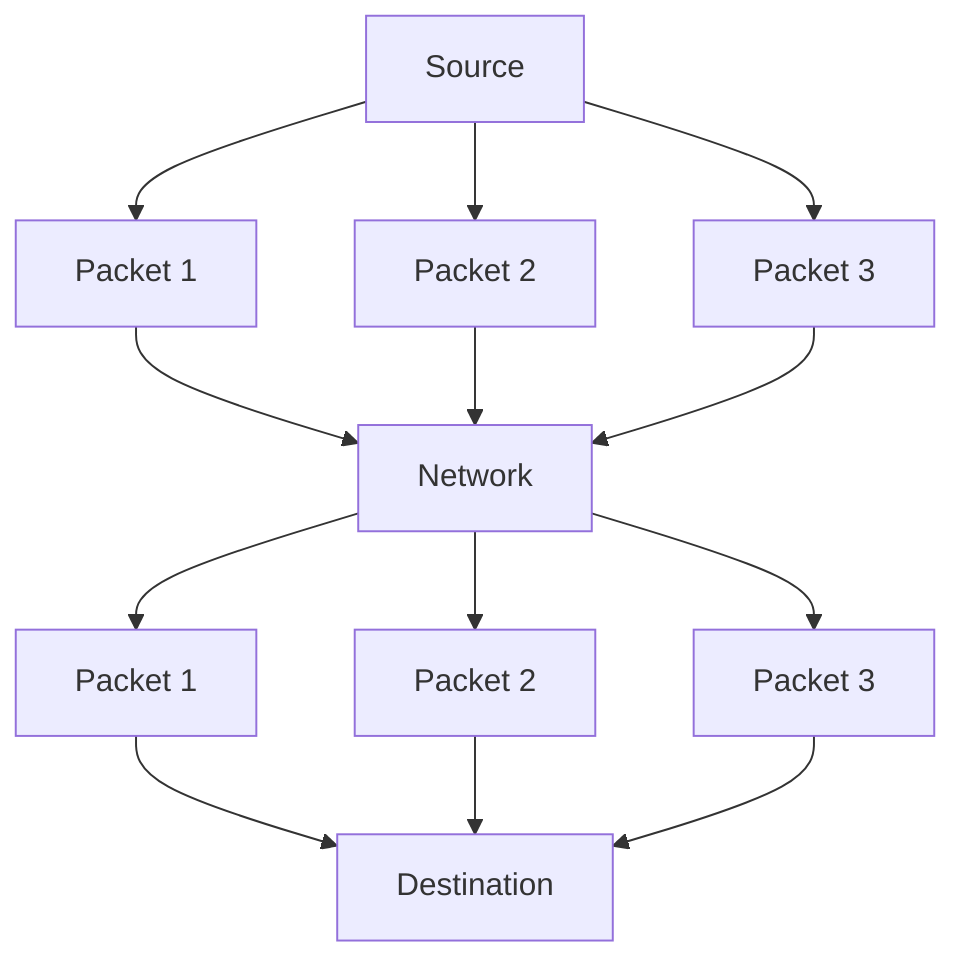

### Message Switching

In message switching, entire messages are transferred from node to node.

**Characteristics:**
- Store-and-forward technique
- No real-time communication
- Efficient use of bandwidth
- High latency

**Examples:**
- Early email systems
- Telegraph networks

## Transmission Modes

Transmission modes define the direction of signal flow between devices.

### Simplex

In simplex transmission, data flows in only one direction.

**Characteristics:**
- Unidirectional communication
- Sender cannot receive feedback
- Full channel capacity available for transmission

**Examples:**
- Traditional radio broadcasting
- Television broadcasting
- Keyboard to computer


### Half-Duplex

In half-duplex transmission, data can flow in both directions, but only one direction at a time.

**Characteristics:**
- Bidirectional communication (alternating)
- Only one device can transmit at a time
- Requires turnaround time

**Examples:**
- Walkie-talkies
- Traditional Ethernet using shared media
- Two-way radio systems


### Full-Duplex

In full-duplex transmission, data can flow in both directions simultaneously.

**Characteristics:**
- Simultaneous bidirectional communication
- Maximum throughput in both directions
- Often requires two separate communication channels

**Examples:**
- Telephone conversations
- Modern Ethernet
- Cellular communications

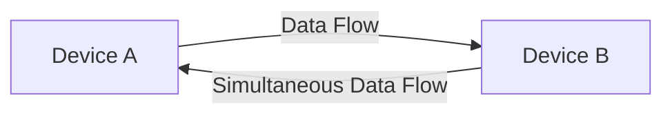

## Network Topology at Physical Layer

Network topology refers to the physical arrangement of devices and media in a network.

### Bus Topology

All devices connect to a single cable (bus).

**Characteristics:**
- Simple design
- Easy to implement and extend
- Limited cable length
- Vulnerable to cable failures

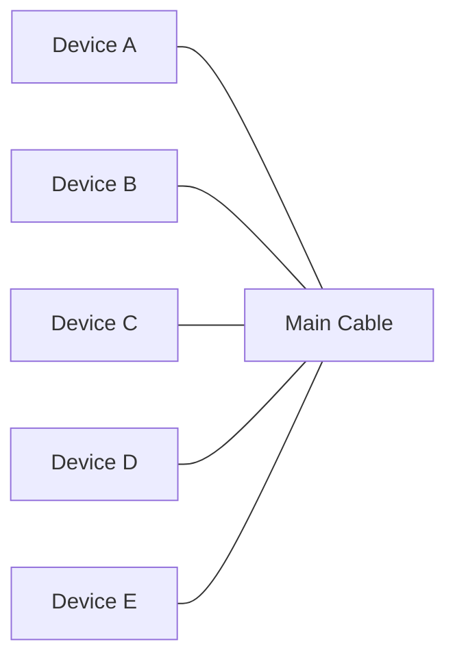

### Star Topology

All devices connect to a central hub or switch.

**Characteristics:**
- Centralized management
- Easy to troubleshoot
- Fault isolation
- Dependent on central device

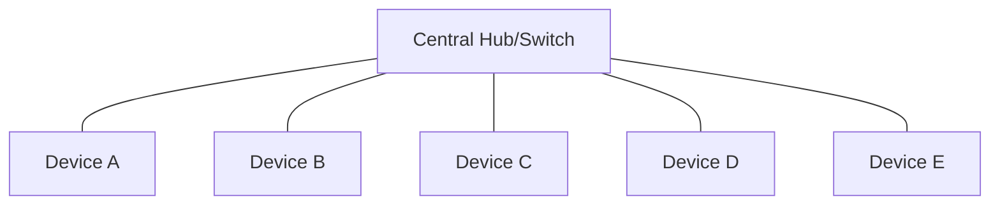

### Ring Topology

Devices connect to form a closed loop.

**Characteristics:**
- Equal access for all devices
- Simple to implement
- Vulnerable to single failures
- Used in Token Ring and FDDI

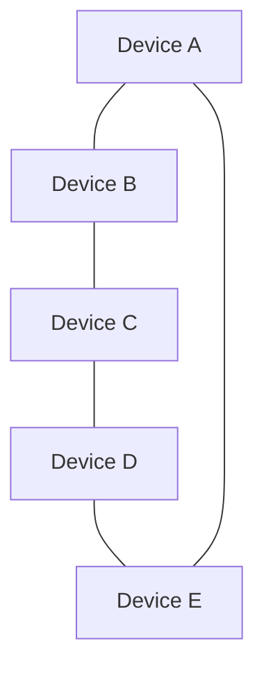

### Mesh Topology

Each device connects directly to every other device.

**Characteristics:**
- High redundancy
- Robust against failures
- Expensive and complex to implement
- Difficult to scale

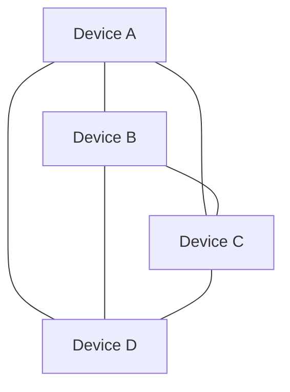

### Hybrid Topology

Combination of two or more topologies.

**Characteristics:**
- Flexible design
- Can optimize for specific requirements
- More complex to manage
- Common in real-world networks

**Example: Star-Bus Hybrid**
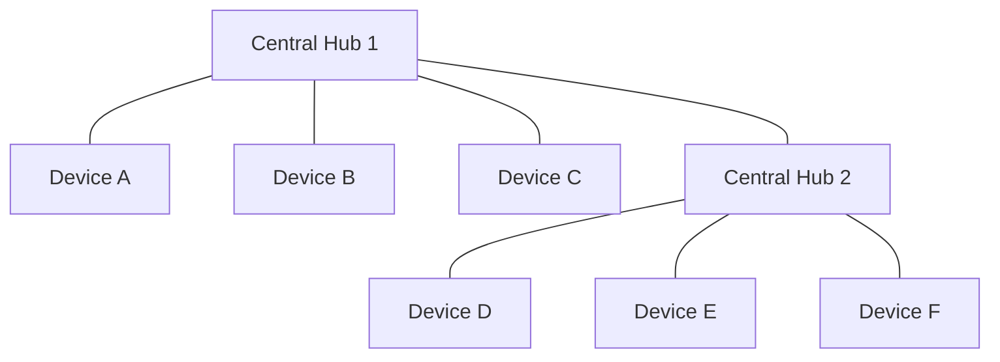

## Physical Layer Protocols and Standards

Various organizations define standards for the Physical Layer to ensure interoperability between different vendors' equipment.

### IEEE 802.3 (Ethernet) Physical Layer

IEEE 802.3 defines multiple physical layer specifications for Ethernet.

| Standard | Speed | Media | Max Distance | Connector |
|----------|-------|-------|--------------|-----------|
| 10BASE-T | 10 Mbps | Cat 3+ UTP | 100m | RJ-45 |
| 100BASE-TX | 100 Mbps | Cat 5+ UTP | 100m | RJ-45 |
| 1000BASE-T | 1 Gbps | Cat 5e+ UTP | 100m | RJ-45 |
| 10GBASE-T | 10 Gbps | Cat 6a+ UTP | 100m | RJ-45 |
| 1000BASE-SX | 1 Gbps | Multimode Fiber | 550m | LC/SC |
| 1000BASE-LX | 1 Gbps | Single-mode Fiber | 5km | LC/SC |
| 10GBASE-SR | 10 Gbps | Multimode Fiber | 400m | LC/SC |
| 10GBASE-LR | 10 Gbps | Single-mode Fiber | 10km | LC/SC |

**Naming Convention:**
- First number: Speed in Mbps (10, 100, 1000, etc.)
- BASE: Baseband transmission
- Last letter(s): Medium type (T = twisted pair, F = fiber, etc.)

### IEEE 802.11 (Wi-Fi) Physical Layer

IEEE 802.11 defines physical layer specifications for wireless LANs.

| Standard | Frequency | Max Data Rate | Range (Indoor) | Modulation |
|----------|-----------|---------------|----------------|------------|
| 802.11a | 5 GHz | 54 Mbps | ~35m | OFDM |
| 802.11b | 2.4 GHz | 11 Mbps | ~35m | DSSS |
| 802.11g | 2.4 GHz | 54 Mbps | ~38m | OFDM/DSSS |
| 802.11n | 2.4/5 GHz | 600 Mbps | ~70m | MIMO-OFDM |
| 802.11ac | 5 GHz | 6.9 Gbps | ~35m | MU-MIMO-OFDM |
| 802.11ax (Wi-Fi 6) | 2.4/5/6 GHz | 9.6 Gbps | ~30m | OFDMA, MU-MIMO |
| 802.11be (Wi-Fi 7) | 2.4/5/6 GHz | 46 Gbps | ~30m | Multi-Link, 4K QAM |

### SONET/SDH

Synchronous Optical Networking (SONET) and Synchronous Digital Hierarchy (SDH) are standards for high-speed data transmission over optical fiber.

| Level | SONET | SDH | Data Rate |
|-------|-------|-----|-----------|
| OC-1 | STS-1 | - | 51.84 Mbps |
| OC-3 | STS-3 | STM-1 | 155.52 Mbps |
| OC-12 | STS-12 | STM-4 | 622.08 Mbps |
| OC-48 | STS-48 | STM-16 | 2.488 Gbps |
| OC-192 | STS-192 | STM-64 | 9.953 Gbps |
| OC-768 | STS-768 | STM-256 | 39.813 Gbps |

### DSL Standards

Digital Subscriber Line (DSL) technologies use existing telephone lines for high-speed data transmission.

| Type | Downstream Speed | Upstream Speed | Max Distance |
|------|------------------|----------------|--------------|
| ADSL | Up to 8 Mbps | Up to 1 Mbps | ~5.5 km |
| ADSL2 | Up to 12 Mbps | Up to 1.5 Mbps | ~5 km |
| ADSL2+ | Up to 24 Mbps | Up to 3.3 Mbps | ~3 km |
| VDSL | Up to 52 Mbps | Up to 16 Mbps | ~1.2 km |
| VDSL2 | Up to 100 Mbps | Up to 100 Mbps | ~0.3 km |

### USB Physical Layer

Universal Serial Bus (USB) standards define physical layer specifications for connecting devices.

| Version | Data Rate | Cable Length | Connector Types |
|---------|-----------|--------------|----------------|
| USB 1.0 | 1.5 Mbps (Low) | 3m | Type A, Type B |
| USB 1.1 | 12 Mbps (Full) | 3m | Type A, Type B |
| USB 2.0 | 480 Mbps (High) | 5m | Type A, B, Mini, Micro |
| USB 3.0/3.1 Gen 1 | 5 Gbps (Super) | 3m | Type A, B, C, Micro-B |
| USB 3.1 Gen 2 | 10 Gbps (Super+) | 3m | Type A, B, C |
| USB 3.2 | 20 Gbps | 3m | Type C |
| USB4 | 40 Gbps | 0.8m | Type C |

## Bandwidth, Throughput, and Latency

These fundamental concepts are critical for understanding the performance of physical layer communication.

### Bandwidth

Bandwidth is the theoretical maximum data transfer rate of a communication channel.

**Types:**
- **Digital Bandwidth**: Measured in bits per second (bps)
- **Analog Bandwidth**: Measured in Hertz (Hz)

**Factors Affecting Bandwidth:**
- Physical medium characteristics
- Signal-to-noise ratio
- Distance
- Modulation technique

### Throughput

Throughput is the actual amount of data successfully transferred over a communication channel in a given time period.

**Relationship to Bandwidth:**
- Throughput is always less than or equal to bandwidth
- Throughput = Bandwidth × Efficiency

**Factors Affecting Throughput:**
- Network congestion
- Protocol overhead
- Processing delays
- Error rates and retransmissions

### Latency

Latency is the time delay between the sending and receiving of information.

**Components of Latency:**
- **Propagation Delay**: Time for a signal to travel from sender to receiver
  - Depends on distance and medium (approximately 5 μs per kilometer in fiber)
- **Transmission Delay**: Time to push all bits of a packet onto the link
  - Depends on packet size and link bandwidth
- **Processing Delay**: Time for routers/switches to process the packet header
- **Queuing Delay**: Time a packet spends waiting in buffers

**Round-Trip Time (RTT):**
- Sum of the latencies in both directions
- Critical metric for interactive applications

### Bandwidth-Delay Product (BDP)

BDP is the amount of data that can be in transit on a link.

```
BDP = Bandwidth × Round-Trip Time
```

**Significance:**
- Determines optimal window size for protocols like TCP
- Affects buffer sizes needed for maximum throughput
- Higher BDP links require larger window sizes

## Channel Capacity and Nyquist-Shannon Theorem

These fundamental theorems establish the theoretical limits of data transmission.

### Nyquist Theorem

For a noiseless channel, the maximum data rate is:

```
C = 2 × B × log₂(M)
```

Where:
- C = Channel capacity (bits per second)
- B = Bandwidth (Hz)
- M = Number of signal levels

**Example:**
- For a 3 kHz channel with 4 signal levels:
- C = 2 × 3,000 × log₂(4) = 12,000 bps

### Shannon-Hartley Theorem

For a noisy channel, the maximum data rate is:

```
C = B × log₂(1 + S/N)
```

Where:
- C = Channel capacity (bits per second)
- B = Bandwidth (Hz)
- S/N = Signal-to-noise ratio (linear, not dB)

**Example:**
- For a 3 kHz channel with S/N ratio of 30 dB (1000:1):
- C = 3,000 × log₂(1 + 1000) ≈ 29,897 bps

### Signal-to-Noise Ratio (SNR)

SNR compares the level of the desired signal to the level of background noise.

```
SNR (dB) = 10 × log₁₀(S/N)
```

**Significance:**
- Higher SNR allows for higher data rates
- SNR decreases with distance in most media
- Critical factor in wireless communications

## Physical Layer Devices

Various devices operate at the Physical Layer to connect network segments and convert signals.

### Repeaters

Repeaters amplify and regenerate signals to extend the reach of a network.

**Functions:**
- Receive, regenerate, and retransmit signals
- Combat signal attenuation
- Do not perform any processing of data

**Limitations:**
- Cannot filter traffic
- Propagate collisions and errors
- Limited by timing considerations

### Hubs

Hubs are multi-port repeaters that connect multiple network devices.

**Types:**
- **Passive Hubs**: Simply connect wires with no signal regeneration
- **Active Hubs**: Regenerate and amplify signals
- **Intelligent Hubs**: Include management features

**Characteristics:**
- Create a single collision domain
- Operate at half-duplex
- Forward signals to all ports
- Largely obsolete, replaced by switches

### Network Interface Cards (NICs)

NICs connect computing devices to a network medium.

**Functions:**
- Convert parallel data from computer bus to serial data for transmission
- Implement physical layer signaling
- Provide physical connection to the network medium
- Handle basic media access control

**Types:**
- Ethernet NICs (10/100/1000/10G)
- Wireless NICs (Wi-Fi)
- Fiber optic NICs
- Virtual NICs (in virtualized environments)

### Media Converters

Media converters translate between different physical media types.

**Common Conversions:**
- Copper to fiber
- Single-mode to multi-mode fiber
- 10BASE-T to 100BASE-TX (for legacy equipment)

**Benefits:**
- Extend network distance
- Connect incompatible media types
- Transition between different network technologies

### Transceivers

Transceivers (transmitter-receivers) convert between electrical and optical signals.

**Types:**
- **SFP (Small Form-factor Pluggable)**: Common in gigabit networks
- **SFP+ (Enhanced SFP)**: For 10 Gbps networks
- **QSFP (Quad SFP)**: For 40/100 Gbps networks
- **GBIC (Gigabit Interface Converter)**: Older technology

**Advantages:**
- Hot-swappable
- Flexible media options
- Upgradeable without replacing switch hardware

## Last Mile Technologies

Last mile technologies connect end-users to service provider networks.

### Digital Subscriber Line (DSL)

DSL provides digital data transmission over telephone lines.

**Types:**
- **ADSL**: Asymmetric DSL (faster download than upload)
- **SDSL**: Symmetric DSL (equal upload and download)
- **VDSL**: Very high-speed DSL
- **HDSL**: High-bit-rate DSL

**Characteristics:**
- Uses higher frequencies than voice on the same line
- Performance decreases with distance from the central office
- Requires a DSL modem and filters

### Cable Internet

Cable internet uses the same coaxial cable infrastructure as cable television.

**Technology:**
- Based on DOCSIS (Data Over Cable Service Interface Specification)
- Uses frequency division multiplexing
- Shared bandwidth among neighborhood users

**Characteristics:**
- Typically offers higher bandwidth than DSL
- Performance can vary with neighborhood usage
- Requires a cable modem

### Fiber to the x (FTTx)

FTTx refers to various fiber deployment configurations.

**Types:**
- **FTTN (Fiber to the Node)**: Fiber to a neighborhood cabinet
- **FTTC (Fiber to the Curb)**: Fiber closer to premises
- **FTTB (Fiber to the Building)**: Fiber to a building, copper within
- **FTTH (Fiber to the Home)**: Fiber directly to residences

**Technologies:**
- **PON (Passive Optical Network)**: Uses passive splitters
- **AON (Active Optical Network)**: Uses powered equipment

**Advantages:**
- Extremely high bandwidth (up to multiple Gbps)
- Long distances without signal degradation
- Immunity to electromagnetic interference

### Fixed Wireless

Fixed wireless provides broadband using radio links between fixed points.

**Technologies:**
- **WiMAX (Worldwide Interoperability for Microwave Access)**
- **LMDS (Local Multipoint Distribution Service)**
- **MMDS (Multichannel Multipoint Distribution Service)**
- **5G Fixed Wireless Access**

**Characteristics:**
- No physical wiring to premises
- Affected by weather and line-of-sight issues
- Typically faster deployment than wired solutions

### Satellite

Satellite internet connects users via communications satellites.

**Types:**
- **GEO (Geostationary Orbit)**: High latency (500+ ms), wide coverage
- **MEO (Medium Earth Orbit)**: Medium latency
- **LEO (Low Earth Orbit)**: Lower latency (20-40 ms), requires satellite constellations

**Characteristics:**
- Available in remote areas
- High latency (especially GEO)
- Weather-sensitive
- Typically more expensive than terrestrial options

## Wireless Physical Layer

The wireless physical layer has unique characteristics and challenges compared to wired transmission.

### Wireless Transmission Fundamentals

#### Radio Frequency Spectrum

The RF spectrum is divided into bands with different characteristics:

| Frequency Band | Range | Characteristics | Applications |
|----------------|-------|-----------------|--------------|
| LF (Low) | 30-300 kHz | Long range, penetrates obstacles | Navigation, time signals |
| MF (Medium) | 300 kHz-3 MHz | Medium range, follows Earth's curvature | AM radio |
| HF (High) | 3-30 MHz | Long distance via ionospheric reflection | Shortwave radio |
| VHF (Very High) | 30-300 MHz | Line of sight, moderate bandwidth | FM radio, TV |
| UHF (Ultra High) | 300 MHz-3 GHz | Shorter range, higher bandwidth | TV, cellular, Wi-Fi |
| SHF (Super High) | 3-30 GHz | Short range, high bandwidth | Satellite, radar, 5G |
| EHF (Extremely High) | 30-300 GHz | Very short range, very high bandwidth | Millimeter wave, 6G research |

#### Wireless Signal Properties

**Propagation Mechanisms:**
- **Line of Sight**: Direct path between transmitter and receiver
- **Reflection**: Signal bounces off surfaces
- **Diffraction**: Signal bends around obstacles
- **Scattering**: Signal disperses when hitting small objects or rough surfaces
- **Refraction**: Signal bends when passing through different media

**Challenges:**
- **Multipath Propagation**: Signals arrive via multiple paths, causing interference
- **Fading**: Signal strength varies over time and location
- **Interference**: From other wireless devices and environmental sources
- **Limited Spectrum**: Finite resource requiring careful management

### Wireless Modulation Techniques

Advanced modulation schemes increase data rates within limited bandwidth.

**Digital Modulation Techniques:**
- **PSK (Phase Shift Keying)**: BPSK, QPSK, 8-PSK
- **QAM (Quadrature Amplitude Modulation)**: 16-QAM, 64-QAM, 256-QAM, 1024-QAM
- **OFDM (Orthogonal Frequency Division Multiplexing)**: Used in Wi-Fi, 4G/5G
- **DSSS (Direct Sequence Spread Spectrum)**: Spreads signal across wider bandwidth
- **FHSS (Frequency Hopping Spread Spectrum)**: Rapidly switches frequencies

### Multiple Antenna Technologies

Multiple antenna systems improve performance in wireless communications.

**Techniques:**
- **SISO (Single Input, Single Output)**: One antenna each for transmitter and receiver
- **SIMO (Single Input, Multiple Output)**: One transmit, multiple receive antennas
- **MISO (Multiple Input, Single Output)**: Multiple transmit, one receive antenna
- **MIMO (Multiple Input, Multiple Output)**: Multiple antennas on both ends
  - Spatial multiplexing
  - Beamforming
  - Diversity
- **MU-MIMO (Multi-User MIMO)**: Simultaneous transmission to multiple users

## Noise, Attenuation, and Interference

These factors limit the performance of physical layer communications.

### Noise

Noise is unwanted electrical or electromagnetic energy that degrades the quality of signals.

**Types of Noise:**
- **Thermal Noise**: Random noise from electron movement (increases with temperature)
- **Impulse Noise**: Short, high-energy pulses (from lightning, electrical switches)
- **Crosstalk**: Unwanted coupling between signal paths
- **Intermodulation Noise**: Signals producing unwanted frequencies when mixed
- **White Noise**: Constant power across all frequencies

**Measuring Noise:**
- **Signal-to-Noise Ratio (SNR)**: Higher is better
- **Noise Figure**: Measure of degradation caused by components

### Attenuation

Attenuation is the loss of signal strength as it travels through a medium.

**Causes:**
- Resistance in conductors
- Absorption in materials
- Radiation losses
- Scattering

**Measurement:**
- Measured in decibels (dB)
- Increases with distance and frequency
- Different for each transmission medium

**Examples:**
- Cat5e UTP: ~22 dB/100m at 100 MHz
- Multimode fiber: ~3 dB/km at 850 nm
- Single-mode fiber: ~0.4 dB/km at 1310 nm

### Interference

Interference occurs when unwanted signals disrupt communication.

**Types:**
- **EMI (Electromagnetic Interference)**: From electrical equipment
- **RFI (Radio Frequency Interference)**: From radio transmitters
- **Adjacent Channel Interference**: From nearby frequency bands
- **Co-channel Interference**: From same frequency reuse

**Mitigation Techniques:**
- Shielding
- Twisted pair wiring
- Spread spectrum technologies
- Directional antennas
- Frequency planning

## Practice Questions

Test your understanding of the Physical Layer with these questions:

1. **What is the primary function of the Physical Layer in the OSI model?**
   <details>
   <summary>Answer</summary>
   The Physical Layer is responsible for the transmission and reception of raw bitstreams over a physical medium. It defines the electrical, mechanical, procedural, and functional specifications for activating, maintaining, and deactivating physical connections. This includes specifications for voltage levels, timing of voltage changes, physical data rates, maximum transmission distances, physical connectors, and similar physical parameters.
   </details>

2. **Compare and contrast single-mode and multi-mode fiber optic cables.**
   <details>
   <summary>Answer</summary>
   
   **Single-Mode Fiber:**
   - Has a small core diameter (8-10 μm)
   - Transmits a single ray of light (mode)
   - Uses laser as light source
   - Supports longer distances (up to 100 km)
   - Has higher bandwidth
   - More expensive
   - Typically used for long-distance telecommunications
   
   **Multi-Mode Fiber:**
   - Has a larger core diameter (50-62.5 μm)
   - Transmits multiple rays of light (modes)
   - Uses LED as light source
   - Supports shorter distances (up to 2 km)
   - Has lower bandwidth due to modal dispersion
   - Less expensive
   - Typically used for short-distance communications within buildings or campuses
   </details>

3. **Explain Manchester encoding and its advantages and disadvantages.**
   <details>
   <summary>Answer</summary>
   
   **Manchester Encoding:**
   Manchester encoding is a line coding technique where each bit is represented by a transition rather than a level. Specifically, a '0' is represented by a high-to-low transition at the middle of the bit period, and a '1' is represented by a low-to-high transition.
   
   **Advantages:**
   - Self-clocking (the clock is embedded in the data)
   - No DC component, allowing for transformer coupling
   - Guaranteed transition in the middle of each bit period aids synchronization
   - Error detection capability
   - Immune to voltage drift
   
   **Disadvantages:**
   - Requires twice the bandwidth of NRZ encoding
   - More complex to implement
   - Higher power consumption due to more transitions
   - Less bandwidth-efficient than more advanced encoding schemes
   </details>

4. **What is multiplexing, and how do TDM and FDM differ?**
   <details>
   <summary>Answer</summary>
   
   **Multiplexing** is a technique that allows multiple signals to share a single transmission medium, increasing the efficiency of communication channels.
   
   **Time Division Multiplexing (TDM):**
   - Allocates the full bandwidth of the channel to each user for a fixed time slot
   - Divides the time domain into distinct slots
   - Each source gets the entire bandwidth for a short time
   - Used in digital systems like T1/E1 lines and SONET/SDH
   - Requires precise synchronization
   
   **Frequency Division Multiplexing (FDM):**
   - Divides the available bandwidth into non-overlapping frequency bands
   - Each source gets a portion of the bandwidth all the time
   - Used in analog systems like radio, TV broadcasting, and cable TV
   - Requires guard bands between channels to prevent interference
   - No synchronization needed between channels
   </details>

5. **Why is the Nyquist-Shannon theorem important for data communications?**
   <details>
   <summary>Answer</summary>
   
   The Nyquist-Shannon theorem is fundamental to data communications because it establishes the theoretical maximum data rate for a channel with a given bandwidth and noise level.
   
   The **Nyquist theorem** states that for a noiseless channel with bandwidth B, the maximum data rate is 2B symbols per second. When using M different signal levels, the maximum data rate becomes 2B log₂(M) bits per second.
   
   The **Shannon-Hartley theorem** extends this to noisy channels, stating that the maximum data rate is B log₂(1 + S/N) bits per second, where S/N is the signal-to-noise ratio.
   
   These theorems are important because they:
   - Set the theoretical limits for data transmission
   - Guide the design of modulation schemes and error correction codes
   - Help in evaluating the efficiency of communication systems
   - Provide a benchmark for measuring the performance of real systems
   - Inform decisions about bandwidth allocation and signal processing
   </details>

6. **Describe the difference between baseband and broadband transmission.**
   <details>
   <summary>Answer</summary>
   
   **Baseband Transmission:**
   - Uses the entire bandwidth of the medium for a single digital signal
   - Sends digital signals directly on the medium without modulation
   - Uses line coding techniques (NRZ, Manchester, etc.)
   - Bidirectional communication often requires full-duplex circuits
   - Examples: Ethernet, USB, traditional telephone lines for digital data
   
   **Broadband Transmission:**
   - Divides the bandwidth into multiple channels
   - Uses modulation techniques to transmit multiple signals simultaneously
   - Requires modems to modulate/demodulate signals
   - Often allows simultaneous transmission of different types of data
   - Examples: Cable TV, DSL, cellular networks, satellite communications
   </details>

7. **What are the three main transmission modes, and in what situations would each be used?**
   <details>
   <summary>Answer</summary>
   
   **Simplex:**
   - Data flows in only one direction
   - Used when feedback is not needed
   - Examples: TV/radio broadcasting, keyboard to computer, sensors transmitting data
   
   **Half-Duplex:**
   - Data can flow in both directions, but only one direction at a time
   - Used when two-way communication is needed but not simultaneously
   - Examples: Walkie-talkies, two-way radios, older LANs with shared media
   
   **Full-Duplex:**
   - Data can flow in both directions simultaneously
   - Used when continuous two-way communication is required
   - Examples: Telephone conversations, modern Ethernet, cellular communications, video conferencing
   </details>

8. **Explain how OFDM works and why it's widely used in modern wireless communications.**
   <details>
   <summary>Answer</summary>
   
   **Orthogonal Frequency Division Multiplexing (OFDM)** works by:
   
   1. Dividing a high-speed data stream into multiple parallel lower-speed streams
   2. Transmitting these streams on separate subcarriers that are mathematically orthogonal to each other
   3. Using IFFT (Inverse Fast Fourier Transform) at the transmitter and FFT at the receiver
   4. Adding a cyclic prefix to each symbol to combat intersymbol interference
   
   OFDM is widely used in modern wireless communications (Wi-Fi, 4G/5G, digital TV) because:
   
   - It efficiently handles multipath propagation, reducing intersymbol interference
   - It's resilient against frequency-selective fading
   - It allows for flexible spectrum usage and bandwidth allocation
   - It achieves high spectral efficiency
   - It can be combined with MIMO for even higher performance
   - It simplifies equalization at the receiver
   - It allows for adaptive modulation on different subcarriers based on channel conditions
   </details>

## Additional Resources

### Books
- **Data Communications and Networking** by Behrouz A. Forouzan
- **Computer Networks: A Systems Approach** by Larry Peterson and Bruce Davie
- **Digital Communications: Fundamentals and Applications** by Bernard Sklar

### Online Resources
- [IEEE Standards Association](https://standards.ieee.org/)
- [TIA (Telecommunications Industry Association)](https://www.tiaonline.org/)
- [ITU (International Telecommunication Union)](https://www.itu.int/)
- [NetworkLessons.com Physical Layer Resources](https://networklessons.com/cisco/ccna-routing-switching-icnd1-100-105/introduction-to-the-physical-layer)

### Tools
- **Wireshark**: For capturing and analyzing packets
- **iPerf**: For measuring network performance
- **Signal Generators and Oscilloscopes**: For analyzing signal quality
- **TDR (Time Domain Reflectometer)**: For testing cable quality and finding faults

### Video Resources
- [Professor Messer's Network+ Course](https://www.professormesser.com/network-plus/n10-008/n10-008-video/physical-network-topologies-n10-008/)
- [Khan Academy's Signals and Systems](https://www.khanacademy.org/science/electrical-engineering/ee-signals)
- [MIT OpenCourseWare: Digital Communication Systems](https://ocw.mit.edu/courses/electrical-engineering-and-computer-science/6-02-introduction-to-eecs-ii-digital-communication-systems-fall-2012/)
