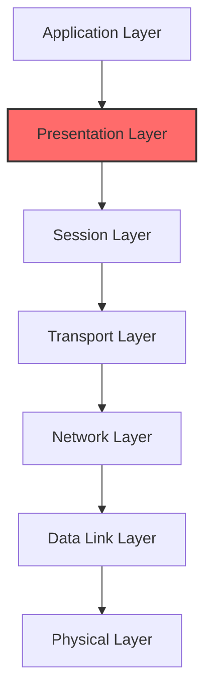
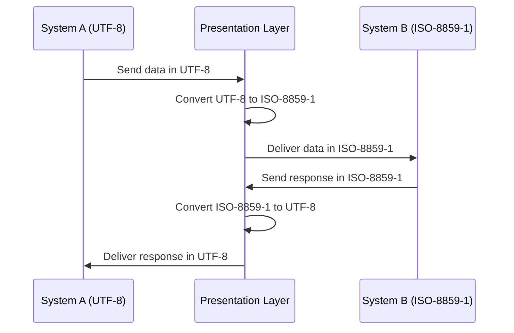
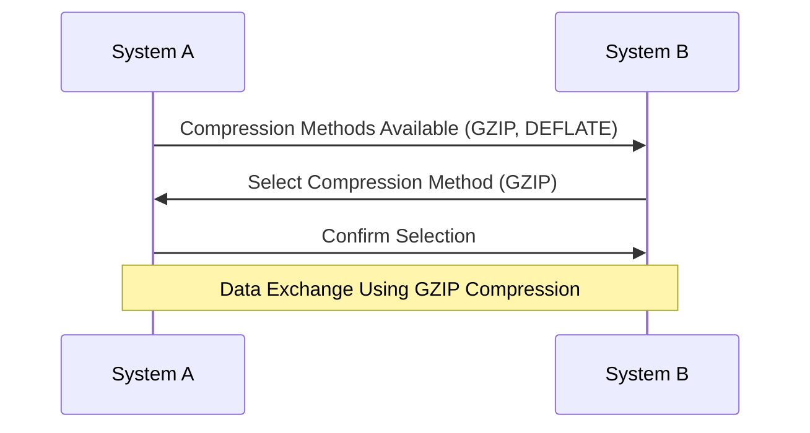
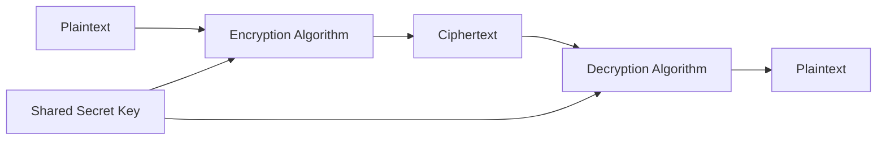
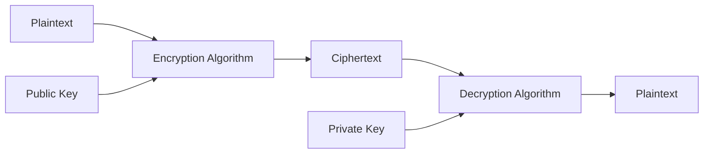
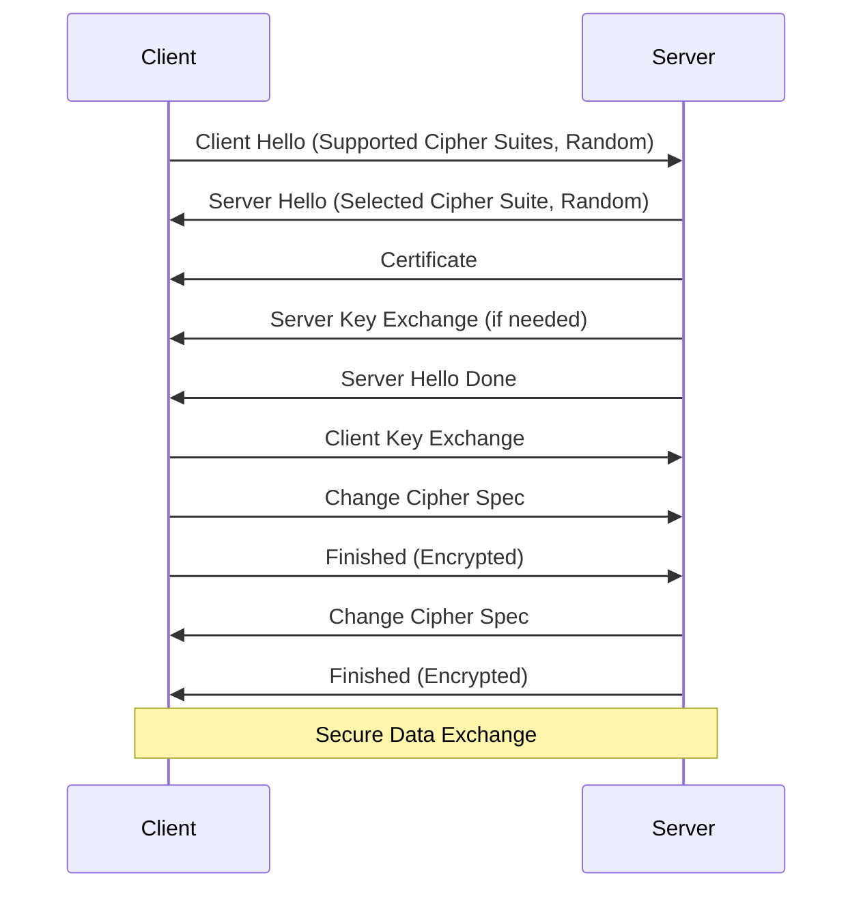
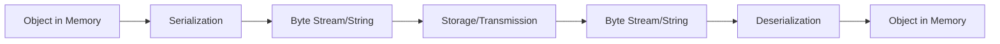

# Day 18: Presentation Layer

<div align="center">
  
  
  <h1>🔄 Presentation Layer: The Data Translator 🔄</h1>
  
  <p>
    
    
    
    
  </p>
  
  <hr>
</div>

## Table of Contents
- [Introduction to the Presentation Layer](#introduction-to-the-presentation-layer)
- [Data Representation](#data-representation)
- [Character Encoding](#character-encoding)
- [Data Compression](#data-compression)
- [Encryption and Security](#encryption-and-security)
- [Data Formats and Standards](#data-formats-and-standards)
- [Serialization and Deserialization](#serialization-and-deserialization)
- [Media Formats](#media-formats)
- [Protocol Converters](#protocol-converters)
- [Common Presentation Layer Protocols](#common-presentation-layer-protocols)
- [Programming Interfaces](#programming-interfaces)
- [Challenges in the Presentation Layer](#challenges-in-the-presentation-layer)
- [Future Trends](#future-trends)
- [Practice Questions](#practice-questions)
- [Additional Resources](#additional-resources)

## Introduction to the Presentation Layer

The Presentation Layer is the sixth layer in the OSI (Open Systems Interconnection) model, positioned between the Application and Session Layers. It serves as the data translator for the network, handling the syntax and semantics of the information exchanged between systems.



### Key Responsibilities

The Presentation Layer is responsible for:

1. **Data Translation**: Converting between application and network formats
2. **Data Encryption/Decryption**: Providing data privacy and authentication
3. **Data Compression/Decompression**: Reducing the size of transmitted data
4. **Character Set Conversion**: Translating between different character encoding systems
5. **Data Formatting**: Structuring data for transmission and presentation

### Position in the Network Stack

The Presentation Layer acts as a bridge between the application-specific data formats and the standardized formats used for transmission:

- It ensures that data sent by the Application Layer of one system can be read by the Application Layer of another system
- It transforms data into a format that can be transmitted over the network
- It frees the Application Layer from concerns about data representation differences

## Data Representation

Data representation refers to how different types of data (numbers, text, images, etc.) are encoded for storage and transmission.

### Abstract Syntax Notation One (ASN.1)

ASN.1 is a standard for describing data structures independent of machine-specific encoding techniques.

**Key Features:**
- Platform-independent data description language
- Specifies both the abstract syntax and the transfer syntax
- Used in X.509 certificates, SNMP, LDAP, and other protocols

**Example ASN.1 Definition:**
```
Person ::= SEQUENCE {
    name        VisibleString,
    age         INTEGER,
    email       VisibleString OPTIONAL,
    phoneNumbers SEQUENCE OF PhoneNumber
}

PhoneNumber ::= SEQUENCE {
    type        ENUMERATED {home(0), work(1), mobile(2)},
    number      VisibleString
}
```

### External Data Representation (XDR)

XDR is a standard for machine-independent data structures, used primarily by the Network File System (NFS) and Remote Procedure Call (RPC) protocols.

**Key Features:**
- Developed by Sun Microsystems
- Describes and encodes data in a consistent way across different computer architectures
- Handles issues like byte ordering, floating point representation, and alignment

**Basic Data Types in XDR:**
- Integer
- Unsigned integer
- Enumeration
- Boolean
- Floating-point (single and double precision)
- Fixed-length opaque data
- Variable-length opaque data
- String
- Array (fixed and variable-length)
- Structure
- Union
- Void
- Constant

### Big-Endian vs. Little-Endian

Endianness refers to the order in which bytes are stored in memory for multi-byte data types.

**Big-Endian**:
- Most significant byte first
- Network byte order (used in TCP/IP)
- Used by SPARC, IBM, and other architectures

**Little-Endian**:
- Least significant byte first
- Used by Intel x86, AMD, and other architectures

**Example**: The 32-bit integer 0x12345678

| Memory Address | Big-Endian | Little-Endian |
|----------------|------------|---------------|
| Address        | 0x12       | 0x78          |
| Address+1      | 0x34       | 0x56          |
| Address+2      | 0x56       | 0x34          |
| Address+3      | 0x78       | 0x12          |

**Network Byte Order**:
- Internet protocols use big-endian (network byte order)
- Functions like `htonl()`, `ntohl()`, `htons()`, and `ntohs()` convert between host and network byte order

## Character Encoding

Character encoding is the method of representing characters as numbers that computers can process.

### ASCII (American Standard Code for Information Interchange)

ASCII is a 7-bit character encoding standard that represents 128 characters.

**Characteristics:**
- Limited to English alphabet, numbers, and common symbols
- Character codes range from 0 to 127
- Insufficient for international languages

**ASCII Table (Partial):**

| Decimal | Hex | Character | Decimal | Hex | Character |
|---------|-----|-----------|---------|-----|-----------|
| 32      | 20  | Space     | 65      | 41  | A         |
| 33      | 21  | !         | 66      | 42  | B         |
| 34      | 22  | "         | 67      | 43  | C         |
| ...     | ... | ...       | ...     | ... | ...       |
| 48      | 30  | 0         | 97      | 61  | a         |
| 49      | 31  | 1         | 98      | 62  | b         |
| 50      | 32  | 2         | 99      | 63  | c         |

### Extended ASCII

Extended ASCII uses 8 bits to represent 256 characters.

**Characteristics:**
- Adds additional 128 characters (codes 128-255)
- Different extensions exist for different languages/regions
- Still limited for global use

### Unicode

Unicode is a universal character encoding standard that includes virtually all characters from all writing systems.

**Key Unicode Encoding Forms:**

#### UTF-8

UTF-8 is a variable-width encoding that uses 1 to 4 bytes per character.

**Characteristics:**
- Backward compatible with ASCII (the first 128 characters are encoded the same way)
- Dominates the web (over 95% of websites use UTF-8)
- Space-efficient for Latin script but less so for Asian scripts
- No byte order issues

**UTF-8 Encoding Scheme:**

| Unicode Range    | UTF-8 Encoding (binary)            | Bytes |
|------------------|-----------------------------------|-------|
| U+0000 - U+007F  | 0xxxxxxx                          | 1     |
| U+0080 - U+07FF  | 110xxxxx 10xxxxxx                 | 2     |
| U+0800 - U+FFFF  | 1110xxxx 10xxxxxx 10xxxxxx        | 3     |
| U+10000 - U+10FFFF | 11110xxx 10xxxxxx 10xxxxxx 10xxxxxx | 4     |

#### UTF-16

UTF-16 uses either 2 or 4 bytes (surrogate pairs) to represent characters.

**Characteristics:**
- Used internally by Java, JavaScript, Windows, and others
- More space-efficient than UTF-8 for Asian scripts
- Less efficient for Latin scripts
- Has byte order issues (UTF-16BE vs UTF-16LE)

#### UTF-32

UTF-32 uses a fixed 4 bytes for each character.

**Characteristics:**
- Fixed-width, making character position calculations simple
- Less space-efficient
- Has byte order issues (UTF-32BE vs UTF-32LE)

### ISO/IEC 8859

A series of 8-bit character encodings that cover various alphabets.

**Common variants:**
- ISO 8859-1 (Latin-1): Western European languages
- ISO 8859-2: Central and Eastern European languages
- ISO 8859-5: Cyrillic
- ISO 8859-6: Arabic
- ISO 8859-7: Greek
- ISO 8859-8: Hebrew

### Character Conversion

The Presentation Layer handles the conversion between different character encoding systems.



## Data Compression

Data compression reduces the size of data for storage or transmission, improving efficiency.

### Lossless Compression

Lossless compression allows the original data to be perfectly reconstructed from the compressed data.

#### Run-Length Encoding (RLE)

RLE replaces sequences of the same data value with a count and the value.

**Example:**
```
Original: AAABBBCDDDD
RLE: 3A3B1C4D
```

**Applications:**
- Simple images like icons and line drawings
- Fax transmission
- BMP image format

#### Huffman Coding

Huffman coding assigns variable-length codes to input characters based on their frequencies.

**Process:**
1. Calculate frequency of each character
2. Build a Huffman tree
3. Assign codes (shorter codes for more frequent characters)

**Applications:**
- Part of JPEG, MPEG, ZIP compression
- Text compression

#### LZ77 and LZ78 Algorithms

LZ algorithms achieve compression by replacing repeated occurrences of data with references to a single copy of that data.

**Derivatives:**
- DEFLATE (combination of LZ77 and Huffman coding)
- LZW (Lempel-Ziv-Welch)
- LZMA (Lempel-Ziv-Markov chain algorithm)

**Applications:**
- ZIP, GZIP, PNG
- GIF image format
- PDF files

### Lossy Compression

Lossy compression reduces data size by permanently eliminating certain information, especially redundant information.

#### Transform Coding

Transform coding converts data into a frequency domain representation.

**Examples:**
- Discrete Cosine Transform (DCT) used in JPEG
- Discrete Wavelet Transform (DWT) used in JPEG 2000

#### Predictive Coding

Predictive coding predicts future values based on previous values and encodes only the differences.

**Applications:**
- Voice compression (ADPCM)
- Video compression (MPEG)

#### Popular Lossy Compression Formats

| Format | Type | Application | Compression Ratio | Quality Impact |
|--------|------|-------------|-------------------|----------------|
| JPEG   | Image | Photos, web images | 10:1 to 20:1 | Moderate at high quality |
| MP3    | Audio | Music, podcasts | 10:1 to 12:1 | Variable based on bitrate |
| AAC    | Audio | Digital audio | 10:1 to 16:1 | Better than MP3 at same bitrate |
| H.264  | Video | Streaming, storage | 100:1+ | Good at moderate bitrates |
| H.265  | Video | 4K video, streaming | 150:1+ | Better than H.264 at same bitrate |

### Compression Negotiation

The Presentation Layer negotiates compression methods between communicating systems.



## Encryption and Security

The Presentation Layer handles encryption and decryption to ensure data privacy and security.

### Symmetric Encryption

Symmetric encryption uses the same key for both encryption and decryption.

**Popular Algorithms:**
- AES (Advanced Encryption Standard)
- DES (Data Encryption Standard) - outdated
- 3DES (Triple DES)
- Blowfish
- Twofish

**Characteristics:**
- Fast and efficient
- Requires secure key exchange
- Suitable for bulk data encryption



### Asymmetric Encryption

Asymmetric encryption uses a pair of keys: a public key for encryption and a private key for decryption.

**Popular Algorithms:**
- RSA (Rivest-Shamir-Adleman)
- ECC (Elliptic Curve Cryptography)
- DSA (Digital Signature Algorithm)
- Diffie-Hellman (for key exchange)

**Characteristics:**
- No need for prior secure key exchange
- Computationally intensive
- Often used for key exchange or digital signatures



### Hash Functions

Hash functions generate fixed-length values that represent the original data but cannot be reversed.

**Popular Algorithms:**
- MD5 (Message Digest 5) - considered insecure
- SHA-1 (Secure Hash Algorithm 1) - considered insecure
- SHA-256, SHA-384, SHA-512
- BLAKE2
- SHA-3

**Applications:**
- Data integrity verification
- Password storage
- Digital signatures (combined with asymmetric encryption)

### Digital Certificates and PKI

Digital certificates bind public keys to entities and are verified by trusted Certificate Authorities (CAs).

**Components of a Digital Certificate:**
- Subject's public key
- Subject's identity information
- Digital signature of the issuing CA
- Validity period
- Certificate serial number

**Public Key Infrastructure (PKI):**
- Framework for managing digital certificates
- Includes CAs, Registration Authorities, certificate repositories

### TLS/SSL

Transport Layer Security (TLS) and its predecessor Secure Sockets Layer (SSL) are cryptographic protocols that provide secure communication over a network.

**TLS Handshake Process:**



**TLS Components:**
- Handshake Protocol
- Record Protocol
- Alert Protocol
- Change Cipher Spec Protocol

## Data Formats and Standards

The Presentation Layer handles various data formats and standards for different types of information.

### Markup Languages

Markup languages define the structure and presentation of text-based information.

#### XML (eXtensible Markup Language)

XML is a markup language that defines rules for encoding documents in a format that is both human-readable and machine-readable.

**Characteristics:**
- Self-descriptive
- Hierarchical structure
- Used for data exchange between systems
- Verbose compared to other formats

**Example:**
```xml
<person>
    <name>John Doe</name>
    <age>30</age>
    <email>john.doe@example.com</email>
    <phones>
        <phone type="home">555-1234</phone>
        <phone type="mobile">555-5678</phone>
    </phones>
</person>
```

#### HTML (HyperText Markup Language)

HTML is the standard markup language for documents designed to be displayed in a web browser.

**Characteristics:**
- Defines structure and presentation of web content
- Interpreted by browsers
- Mixed with CSS for styling and JavaScript for behavior

**Example:**
```html
<!DOCTYPE html>
<html>
<head>
    <title>Simple Page</title>
</head>
<body>
    <h1>Hello World</h1>
    <p>This is a paragraph of text.</p>
    <ul>
        <li>Item 1</li>
        <li>Item 2</li>
    </ul>
</body>
</html>
```

### Data Interchange Formats

Data interchange formats are used for exchanging data between different systems.

#### JSON (JavaScript Object Notation)

JSON is a lightweight data-interchange format that is easy for humans to read and write and easy for machines to parse and generate.

**Characteristics:**
- Language independent
- Self-describing
- Hierarchical
- More compact than XML
- Native to JavaScript

**Example:**
```json
{
    "name": "John Doe",
    "age": 30,
    "email": "john.doe@example.com",
    "phones": [
        {"type": "home", "number": "555-1234"},
        {"type": "mobile", "number": "555-5678"}
    ]
}
```

#### YAML (YAML Ain't Markup Language)

YAML is a human-friendly data serialization standard that can be used in conjunction with all programming languages.

**Characteristics:**
- Minimalist syntax
- Uses indentation for structure
- Supports complex data types
- Often used for configuration files

**Example:**
```yaml
name: John Doe
age: 30
email: john.doe@example.com
phones:
  - type: home
    number: 555-1234
  - type: mobile
    number: 555-5678
```

#### Protocol Buffers

Protocol Buffers (protobuf) is Google's language-neutral, platform-neutral, extensible mechanism for serializing structured data.

**Characteristics:**
- Compact binary format
- Faster than XML and JSON
- Requires schema definition
- Strong typing
- Forward and backward compatibility

**Example Schema (.proto file):**
```
syntax = "proto3";

message Person {
  string name = 1;
  int32 age = 2;
  string email = 3;
  
  message PhoneNumber {
    string number = 1;
    enum PhoneType {
      HOME = 0;
      MOBILE = 1;
      WORK = 2;
    }
    PhoneType type = 2;
  }
  
  repeated PhoneNumber phones = 4;
}
```

### Document Formats

Document formats structure information for human consumption.

#### PDF (Portable Document Format)

PDF is a file format used to present documents in a manner independent of application software, hardware, and operating systems.

**Characteristics:**
- Preserves layout and formatting
- Embeds fonts and images
- Supports interactive elements
- Can be secured with passwords and restrictions

#### Office Document Formats

Various formats exist for office documents:

- **DOCX**: Microsoft Word documents
- **XLSX**: Microsoft Excel spreadsheets
- **PPTX**: Microsoft PowerPoint presentations
- **ODF**: Open Document Format (OpenDocument)

## Serialization and Deserialization

Serialization is the process of converting complex data structures into a format that can be stored or transmitted, while deserialization is the reverse process.

### Object Serialization

Object serialization converts programming language objects into a storable or transmissible format.

**Common Serialization Frameworks:**
- Java Serialization
- .NET Serialization
- Python's Pickle
- PHP's Serialize/Unserialize

**Process:**


### Binary vs. Text Serialization

| Feature | Binary Serialization | Text Serialization |
|---------|----------------------|-------------------|
| Size | Smaller | Larger |
| Human Readability | No | Yes |
| Parsing Speed | Generally faster | Generally slower |
| Interoperability | Often language-specific | Usually better |
| Examples | Protocol Buffers, BSON, Java Serialization | JSON, XML, YAML |

## Media Formats

The Presentation Layer handles various media formats for different types of content.

### Image Formats

Different image formats optimize for various use cases.

| Format | Type | Compression | Transparency | Animation | Best Use |
|--------|------|-------------|--------------|-----------|----------|
| JPEG | Lossy | High | No | No | Photos, complex images |
| PNG | Lossless | Medium | Yes | Limited | Screenshots, logos, graphics |
| GIF | Lossless | Low | Yes (1-bit) | Yes | Simple animations, icons |
| WebP | Both | High | Yes | Yes | Web images (alternative to JPEG/PNG) |
| SVG | Vector | Variable | Yes | Yes | Scalable graphics, icons, logos |
| HEIF | Lossy | Very High | Yes | Yes | Modern photo format (iPhone) |

### Audio Formats

Audio formats balance quality and file size.

| Format | Compression | Quality | File Size | Metadata | Best Use |
|--------|-------------|---------|-----------|----------|----------|
| MP3 | Lossy | Good | Small | ID3 tags | Music, podcasts |
| AAC | Lossy | Better than MP3 | Small | Yes | Digital audio, streaming |
| FLAC | Lossless | Excellent | Medium | Yes | Archival, audiophile |
| WAV | Uncompressed | Excellent | Large | Limited | Production, master recordings |
| Ogg Vorbis | Lossy | Good | Small | Yes | Open-source alternative to MP3 |
| Opus | Lossy | Excellent | Very small | Yes | Voice, low-latency applications |

### Video Formats

Video formats adapt to different delivery methods and quality requirements.

| Format | Container | Common Codecs | Features | Best Use |
|--------|-----------|---------------|----------|----------|
| MP4 | MPEG-4 Part 14 | H.264, H.265, AAC | Universal support | General purpose |
| WebM | WebM | VP8, VP9, AV1, Opus | Open format | Web video |
| AVI | Audio Video Interleave | Various | Wide compatibility | Older systems |
| MKV | Matroska | Various | Highly flexible | High-quality video, multiple tracks |
| MOV | QuickTime | Various | Good quality | Apple ecosystem |
| MPEG-TS | MPEG Transport Stream | Various | Streaming-focused | Live broadcasting |

## Protocol Converters

Protocol converters in the Presentation Layer translate between different data representation formats.

### Common Protocol Conversion Scenarios

- **EDI to XML**: Converting Electronic Data Interchange formats to XML for modern systems
- **XML to JSON**: Converting between these common data interchange formats
- **Binary to Text**: Converting binary data to Base64 or other text encodings for transmission over text-only protocols
- **Character Set Conversion**: Translating between different character encodings (UTF-8, UTF-16, ISO-8859, etc.)

### Base64 Encoding

Base64 encoding converts binary data to an ASCII string format, useful for transmitting binary data over media designed for text.

**Process:**
1. Group binary data into 6-bit chunks
2. Map each 6-bit value to a character in the Base64 alphabet (A-Z, a-z, 0-9, +, /)
3. Add padding ('=') if necessary

**Example:**
```
Text: "Hello"
ASCII: 72 101 108 108 111
Binary: 01001000 01100101 01101100 01101100 01101111
6-bit groups: 010010 000110 010101 101100 011011 000110 1111
Base64 index: 18 6 21 44 27 6 63
Base64: "SGVsbG8="
```

## Common Presentation Layer Protocols

Several protocols implement Presentation Layer functions.

### SSL/TLS

SSL (Secure Sockets Layer) and its successor TLS (Transport Layer Security) provide security services at the Presentation Layer.

**Services:**
- Data encryption
- Authentication
- Data integrity

### MIME (Multipurpose Internet Mail Extensions)

MIME extends the format of email to support:

- Text in character sets other than ASCII
- Non-text attachments
- Message bodies with multiple parts
- Header information in non-ASCII character sets

**Common MIME Types:**
- text/plain
- text/html
- image/jpeg
- application/pdf
- audio/mpeg
- video/mp4

**MIME Structure Example:**
```
MIME-Version: 1.0
Content-Type: multipart/mixed; boundary="boundary-string"

--boundary-string
Content-Type: text/plain; charset="UTF-8"
Content-Transfer-Encoding: quoted-printable

This is the body of the email.

--boundary-string
Content-Type: application/pdf
Content-Transfer-Encoding: base64
Content-Disposition: attachment; filename="document.pdf"

JVBERi0xLjUKJYCBgoMKMSAwIG9iago8PC9GaWx0ZXIvRmxhdGVEZWNvZGUvRmlyc3Qg
... [base64-encoded PDF content] ...
--boundary-string--
```

### XDR (External Data Representation)

XDR is a standard for describing and encoding data, used in protocols like NFS and RPC.

**Features:**
- Machine-independent data formats
- Common representation for various data types
- Handles byte ordering differences

### ASN.1 (Abstract Syntax Notation One)

ASN.1 is a standard for describing data structures in a machine-independent way.

**Encoding Rules:**
- BER (Basic Encoding Rules)
- DER (Distinguished Encoding Rules)
- PER (Packed Encoding Rules)
- XER (XML Encoding Rules)

**Applications:**
- X.509 certificates
- LDAP
- SNMP
- Various telecommunications protocols

## Programming Interfaces

The Presentation Layer functionality is implemented in various programming interfaces.

### APIs for Data Serialization

**JSON:**
- JavaScript: `JSON.stringify()`, `JSON.parse()`
- Python: `json.dumps()`, `json.loads()`
- Java: Jackson, Gson
- C#: `System.Text.Json`, Newtonsoft.Json

**XML:**
- Java: JAXB, DOM, SAX
- .NET: `System.Xml`, LINQ to XML
- Python: ElementTree, lxml

**Protocol Buffers:**
- Multiple language bindings generated from .proto files
- Runtime libraries for serialization/deserialization

### Encryption Libraries

**OpenSSL:**
- Open-source implementation of SSL/TLS
- Supports various cryptographic algorithms
- Available for multiple platforms

**Cryptographic APIs:**
- Java: JCA, JCE
- .NET: `System.Security.Cryptography`
- Python: cryptography, PyCrypto
- Node.js: crypto module

### Compression Libraries

**zlib:**
- Implements DEFLATE algorithm
- Used in gzip, PNG, and other formats
- Available for multiple platforms

**Other Libraries:**
- bzip2: Higher compression ratio than zlib
- LZMA: Used in 7-Zip
- Snappy: Focuses on speed over compression ratio
- Brotli: Modern compression algorithm for web content

## Challenges in the Presentation Layer

The Presentation Layer faces various challenges in modern networks.

### Interoperability Issues

Different systems may use different data formats and encodings, requiring careful negotiation and conversion.

**Common Challenges:**
- Different character encodings
- Endianness differences
- Floating-point representation differences
- Date and time format variations

### Performance Considerations

Presentation Layer operations can impact performance significantly.

**Performance Factors:**
- Compression/decompression overhead
- Encryption/decryption processing
- Format conversion costs
- Serialization/deserialization time

**Optimizations:**
- Hardware acceleration for encryption
- Efficient compression algorithms
- Binary formats for performance-critical applications
- Caching and reuse of converted data

### Security Challenges

The Presentation Layer is critical for security but introduces its own challenges.

**Security Considerations:**
- Cryptographic algorithm selection and implementation
- Key management
- Certificate validation
- Protection against attacks (padding oracle, etc.)
- Secure random number generation

## Future Trends

The Presentation Layer continues to evolve with new technologies and requirements.

### Emerging Data Formats

New data formats are being developed to address specific needs:

- **CBOR (Concise Binary Object Representation)**: A binary data format designed for small message sizes, ideal for IoT
- **MessagePack**: Binary serialization format that's more compact than JSON
- **FlatBuffers**: Zero-copy serialization format by Google
- **Cap'n Proto**: Zero-copy serialization format focusing on speed

### Post-Quantum Cryptography

As quantum computing advances, new cryptographic algorithms resistant to quantum attacks are being developed:

- Lattice-based cryptography
- Hash-based cryptography
- Code-based cryptography
- Multivariate polynomial cryptography
- Isogeny-based cryptography

### AI and Machine Learning Data Formats

Specialized formats for AI and machine learning are becoming important:

- **ONNX (Open Neural Network Exchange)**: Format for representing machine learning models
- **TensorFlow's Protocol Buffers**: Format for TensorFlow models
- **PyTorch's serialization**: Format for PyTorch models
- **PMML (Predictive Model Markup Language)**: XML-based format for predictive models

## Practice Questions

Test your understanding of the Presentation Layer with these questions:

1. **What is the primary function of the Presentation Layer in the OSI model?**
   <details>
   <summary>Answer</summary>
   The primary function of the Presentation Layer is to translate, encrypt, and compress data from the Application Layer into a network format and vice versa. It ensures that data sent by the Application Layer of one system can be read properly by the Application Layer of another system, handling tasks like character encoding conversion, data compression, encryption/decryption, and format conversion.
   </details>

2. **Compare and contrast UTF-8, UTF-16, and UTF-32 character encodings.**
   <details>
   <summary>Answer</summary>
   
   **UTF-8:**
   - Variable-width encoding using 1 to 4 bytes per character
   - Backward compatible with ASCII (first 128 characters use 1 byte)
   - Space-efficient for Latin scripts but less so for Asian scripts
   - No byte order issues
   - Dominant encoding on the web
   
   **UTF-16:**
   - Variable-width encoding using either 2 or 4 bytes (surrogate pairs) per character
   - Not compatible with ASCII
   - More efficient than UTF-8 for Asian scripts
   - Has byte order issues (UTF-16BE vs UTF-16LE)
   - Used internally by Java, JavaScript, Windows
   
   **UTF-32:**
   - Fixed-width encoding using 4 bytes per character
   - Simple to process (direct indexing)
   - Most memory-intensive
   - Has byte order issues (UTF-32BE vs UTF-32LE)
   - Rarely used for data exchange due to inefficiency
   </details>

3. **Explain the difference between lossy and lossless compression with examples.**
   <details>
   <summary>Answer</summary>
   
   **Lossless Compression:**
   Lossless compression allows the original data to be perfectly reconstructed from the compressed data with no loss of information.
   
   Examples:
   - ZIP/GZIP (DEFLATE algorithm)
   - PNG image format
   - FLAC audio format
   - RLE (Run-Length Encoding)
   - Huffman coding
   - LZ77/LZ78 algorithms
   
   **Lossy Compression:**
   Lossy compression achieves higher compression ratios by permanently eliminating certain information, especially redundant information that may not be noticeable to the user.
   
   Examples:
   - JPEG image format
   - MP3 audio format
   - H.264/H.265 video formats
   - AAC audio format
   - WebP images
   
   The key difference is that lossless compression preserves all original data and is suitable for text, programs, or when exact reproduction is required. Lossy compression permanently discards some data to achieve higher compression ratios and is suitable for media where human perception can tolerate some information loss.
   </details>

4. **What is TLS and how does the TLS handshake process work?**
   <details>
   <summary>Answer</summary>
   
   **TLS (Transport Layer Security)** is a cryptographic protocol that provides secure communication over a computer network. It ensures privacy, data integrity, and authentication between communicating applications.
   
   **TLS Handshake Process:**
   
   1. **Client Hello**: Client sends:
      - Highest TLS version supported
      - Supported cipher suites
      - Random bytes (Client Random)
      - Session ID (if resuming)
   
   2. **Server Hello**: Server responds with:
      - Selected TLS version
      - Selected cipher suite
      - Random bytes (Server Random)
      - Session ID
   
   3. **Server Certificate**: Server sends its digital certificate containing its public key
   
   4. **Server Key Exchange**: If needed (e.g., for DHE), server sends additional parameters
   
   5. **Server Hello Done**: Signals end of server hello and associated messages
   
   6. **Client Key Exchange**: Client:
      - Verifies server certificate
      - Generates a Pre-Master Secret
      - Encrypts it with server's public key
      - Sends encrypted Pre-Master Secret to server
   
   7. **Key Derivation**: Both parties:
      - Derive the Master Secret from Pre-Master Secret and random values
      - Generate session keys for encryption/decryption
   
   8. **Change Cipher Spec**: Both client and server send messages indicating that subsequent messages will be encrypted
   
   9. **Finished**: Both send encrypted hash of all handshake messages to verify integrity
   
   10. **Secure Data Exchange**: Application data is now exchanged using the negotiated cipher and session keys
   
   This process establishes a secure, authenticated connection with perfect forward secrecy (when using ephemeral key exchange methods like DHE).
   </details>

5. **Compare JSON, XML, and Protocol Buffers as data interchange formats.**
   <details>
   <summary>Answer</summary>
   
   **JSON (JavaScript Object Notation):**
   - Human-readable, text-based format
   - Simple syntax with key-value pairs
   - Native support in JavaScript
   - No schema required (flexible)
   - Moderate parsing speed
   - Medium message size
   - Wide support across languages
   - Self-describing data
   
   **XML (eXtensible Markup Language):**
   - Human-readable, text-based format
   - More verbose with opening/closing tags
   - Supports attributes and namespaces
   - Optional schema (DTD, XSD)
   - Slowest parsing of the three
   - Largest message size
   - Wide support across languages
   - Self-describing data
   - Mature ecosystem (XPath, XSLT)
   
   **Protocol Buffers (protobuf):**
   - Binary format, not human-readable
   - Requires schema definition (.proto files)
   - Fastest parsing speed
   - Smallest message size
   - Strong typing
   - Code generation for multiple languages
   - Forward and backward compatibility
   - Not self-describing without schema
   
   **Use Cases:**
   - JSON: Web APIs, configuration files, when human readability is important
   - XML: Document-centric data, complex hierarchies, when extensive tooling is needed
   - Protocol Buffers: High-performance systems, microservices, when bandwidth or processing efficiency is critical
   </details>

6. **What is endianness and why is it important in the Presentation Layer?**
   <details>
   <summary>Answer</summary>
   
   **Endianness** refers to the order in which bytes are stored in memory for multi-byte data types (like integers or floating-point numbers).
   
   **Types of Endianness:**
   
   - **Big-Endian**: Most significant byte is stored at the lowest memory address (first). For example, the 32-bit integer 0x12345678 would be stored as [12][34][56][78].
   
   - **Little-Endian**: Least significant byte is stored at the lowest memory address (first). The same integer would be stored as [78][56][34][12].
   
   **Importance in the Presentation Layer:**
   
   1. **Data Exchange**: Different computer architectures use different endianness (Intel x86 uses little-endian, while some RISC architectures use big-endian). When data is exchanged between different systems, the Presentation Layer must handle this conversion.
   
   2. **Network Protocols**: Network protocols typically use big-endian (network byte order). The Presentation Layer needs to convert between host byte order and network byte order.
   
   3. **File Formats**: Different file formats may specify endianness for multi-byte values.
   
   4. **Data Serialization**: When serializing data structures, endianness must be considered to ensure correct interpretation across different architectures.
   
   5. **Performance**: Native endianness processing is faster, so unnecessary conversions should be avoided.
   
   Programming languages provide functions like `htonl()` (host to network long), `ntohl()` (network to host long), `htons()` (host to network short), and `ntohs()` (network to host short) to handle these conversions.
   </details>

7. **Describe the role of Base64 encoding in the Presentation Layer.**
   <details>
   <summary>Answer</summary>
   
   **Base64 Encoding** is a binary-to-text encoding scheme that represents binary data in an ASCII string format by translating it into a radix-64 representation.
   
   **Role in the Presentation Layer:**
   
   1. **Binary Data Transmission**: Allows binary data to be transmitted over media designed for text. This is crucial for protocols like SMTP (email) that were originally designed to handle only ASCII text.
   
   2. **Data URI Scheme**: Enables embedding binary data directly in text documents, like embedding images directly in HTML or CSS using the data URI scheme.
   
   3. **Embedding in XML/JSON**: Facilitates including binary data in XML or JSON documents, which are text-based formats.
   
   4. **Content Transfer Encoding**: Used in MIME (Multipurpose Internet Mail Extensions) as a content transfer encoding method for email attachments.
   
   5. **URL Encoding**: A variant (Base64URL) is used for encoding data in URLs and filenames, avoiding characters that have special meaning in these contexts.
   
   6. **Encryption Applications**: Often used to encode encrypted data or cryptographic keys for transmission or storage.
   
   7. **Data Integrity**: Can be used to detect transmission errors, although it doesn't provide cryptographic integrity.
   
   **Process:**
   Base64 encoding converts each 3 bytes (24 bits) of binary data into 4 ASCII characters. It uses a 64-character alphabet consisting of A-Z, a-z, 0-9, +, and / (with = used for padding when necessary).
   
   The encoding expands data by approximately 33% (4 characters for every 3 bytes), which is the trade-off for making binary data compatible with text-based systems.
   </details>

8. **Explain how the Presentation Layer might handle the conversion of data between different systems with incompatible image formats.**
   <details>
   <summary>Answer</summary>
   
   When handling the conversion between incompatible image formats, the Presentation Layer follows these steps:
   
   1. **Format Detection**: Identifies the source image format through file headers, metadata, or explicit format information.
   
   2. **Capability Negotiation**: Determines which image formats are supported by the receiving system.
   
   3. **Conversion Decision**:
      - If the destination system supports the source format, no conversion is needed
      - If not, select the most appropriate target format based on:
        - Quality requirements
        - Feature support (transparency, animation, etc.)
        - Compatibility with the destination system
        - Bandwidth considerations
   
   4. **Decoding**: Decompresses the source image into an intermediate representation (typically an uncompressed bitmap in memory).
   
   5. **Processing**:
      - Color space conversion if needed (RGB to CMYK, etc.)
      - Bit depth adjustment
      - Resolution/dimension changes if required
      - Alpha channel handling (if transparency is involved)
   
   6. **Encoding**: Compresses the image into the target format with appropriate settings.
   
   7. **Metadata Handling**: Preserves relevant metadata (EXIF, color profiles, etc.) where possible.
   
   8. **Error Handling**: Manages any issues that arise during conversion (unsupported features, etc.).
   
   For example, converting a PNG with transparency to JPEG (which doesn't support transparency) might involve:
   - Decoding the PNG
   - Removing the alpha channel or compositing against a background color
   - Adjusting color encoding (PNG often uses gamma correction)
   - Encoding as JPEG with appropriate quality settings
   - Preserving metadata like EXIF information
   
   This process might be implemented through libraries like ImageMagick, GD, or platform-specific APIs that abstract these conversions.
   </details>

## Additional Resources

### Books
- **Data Communications and Networking** by Behrouz A. Forouzan
- **Computer Networks: A Systems Approach** by Larry Peterson and Bruce Davie
- **Network Security Essentials: Applications and Standards** by William Stallings
- **HTTP: The Definitive Guide** by David Gourley and Brian Totty

### Online Resources
- [Mozilla Developer Network (MDN) - Web Technology for Developers](https://developer.mozilla.org/en-US/docs/Web)
- [IETF RFC 7230-7235: HTTP/1.1](https://tools.ietf.org/html/rfc7230)
- [IETF RFC 8446: TLS 1.3](https://tools.ietf.org/html/rfc8446)
- [Unicode Standard](https://unicode.org/standard/standard.html)
- [Protocol Buffers Developer Guide](https://developers.google.com/protocol-buffers/docs/overview)

### Tools
- **Wireshark**: For analyzing network protocols including TLS handshakes
- **OpenSSL**: For cryptographic operations and TLS testing
- **jq**: Command-line JSON processor
- **xmllint**: Command-line XML processor
- **Base64 encoders/decoders**: Available online and in most programming languages

### Video Resources
- [Computerphile's Encryption Videos](https://www.youtube.com/user/Computerphile/search?query=encryption)
- [Khan Academy's Cryptography Course](https://www.khanacademy.org/computing/computer-science/cryptography)
- [MIT OpenCourseWare: Computer System Security](https://ocw.mit.edu/courses/electrical-engineering-and-computer-science/6-858-computer-systems-security-fall-2014/)
