# Day 19: Session Layer

<div align="center">
  
  
  <h1>🔄 Session Layer: Managing Dialogues Between Computers 🔄</h1>
  
  <p>
    
    
    
    
  </p>
  
  <hr>
</div>

## Table of Contents
- [Introduction to the Session Layer](#introduction-to-the-session-layer)
- [Session Establishment and Maintenance](#session-establishment-and-maintenance)
- [Session Management Services](#session-management-services)
- [Dialog Control](#dialog-control)
- [Synchronization and Recovery](#synchronization-and-recovery)
- [Session Layer Protocols](#session-layer-protocols)
- [Session Layer in Modern Networks](#session-layer-in-modern-networks)
- [Authentication and Authorization](#authentication-and-authorization)
- [Session State and Cookies](#session-state-and-cookies)
- [Session Security](#session-security)
- [Practical Applications](#practical-applications)
- [Programming Interfaces](#programming-interfaces)
- [Challenges in Session Management](#challenges-in-session-management)
- [Future Trends](#future-trends)
- [Practice Questions](#practice-questions)
- [Additional Resources](#additional-resources)

## Introduction to the Session Layer

The Session Layer is the fifth layer in the OSI (Open Systems Interconnection) model, positioned between the Transport and Presentation Layers. It establishes, manages, and terminates connections (sessions) between applications.

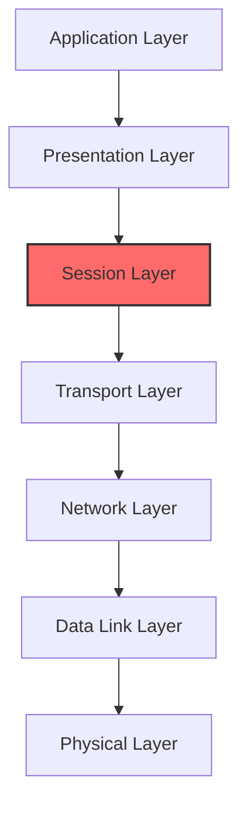

### Key Responsibilities

The Session Layer is responsible for:

1. **Session Establishment**: Setting up connections between applications
2. **Session Maintenance**: Keeping connections active and managing data exchange
3. **Session Termination**: Closing connections in an orderly manner
4. **Dialog Control**: Determining which side transmits when (half-duplex) or if both sides can transmit simultaneously (full-duplex)
5. **Synchronization**: Adding checkpoints to data streams for recovery in case of failures
6. **Session Management**: Handling session tokens, cookies, and other session identifiers

### Position in the Network Stack

The Session Layer sits between the:

- **Presentation Layer** above, which handles data translation, encryption, and compression
- **Transport Layer** below, which handles end-to-end data transfer, segmentation, and flow control

The Session Layer builds on the reliable data transport provided by the Transport Layer to create and manage logical connections between applications.

### Session Layer vs. Transport Layer

While there is some overlap, the two layers serve different purposes:

| Feature | Transport Layer | Session Layer |
|---------|----------------|---------------|
| Primary Focus | Reliable data transfer | Logical connection management |
| Connection Type | End-to-end transport connection | Application-level dialogue |
| Addressing | Port numbers | Session identifiers |
| Error Recovery | Packet loss, reordering | Dialog interruption, session failure |
| Example Protocols | TCP, UDP | RPC, NetBIOS, SIP |

## Session Establishment and Maintenance

The Session Layer manages the lifecycle of connections between applications, from initialization to termination.

### Session Establishment

The process of creating a new session involves several steps:

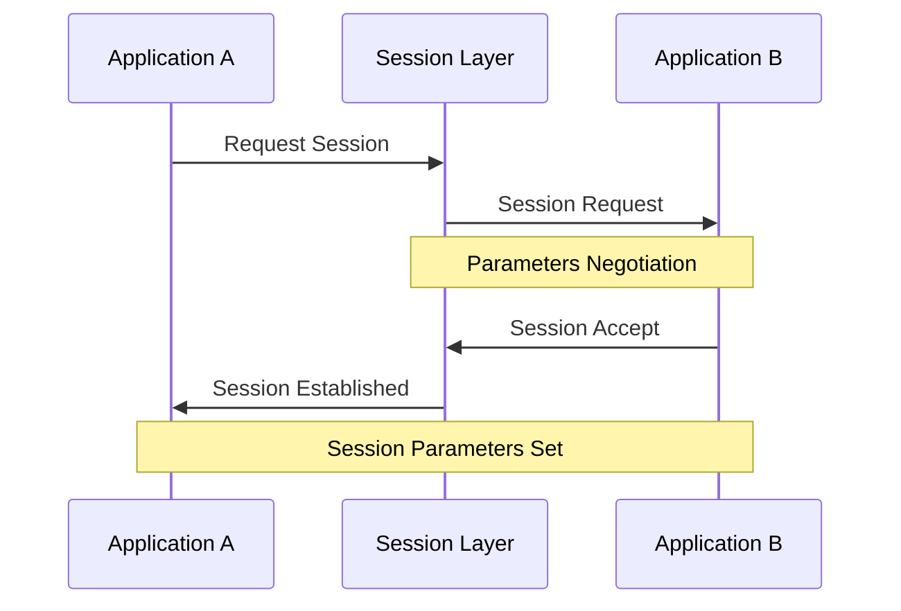

**Session Parameters Negotiation:**
- Session identifier
- Dialog control type (half-duplex, full-duplex, simplex)
- Synchronization points
- Recovery procedures
- Security parameters
- Quality of service requirements

### Session Maintenance

Once established, a session must be maintained through:

1. **Keepalive Messages**: Periodic messages to ensure the connection is still active
2. **State Tracking**: Monitoring the current state of the dialogue
3. **Flow Control**: Ensuring that data exchange proceeds at an appropriate pace
4. **Error Handling**: Detecting and recovering from errors that occur during the session

### Session Termination

Sessions can be terminated in several ways:

**Orderly Release:**
- Both sides agree to terminate
- All pending data is transmitted before closing
- Resources are released in a controlled manner

**Abrupt Release:**
- Immediate termination without completing data transfer
- May occur due to errors or timeouts
- Can result in data loss

**Session Termination Flow:**

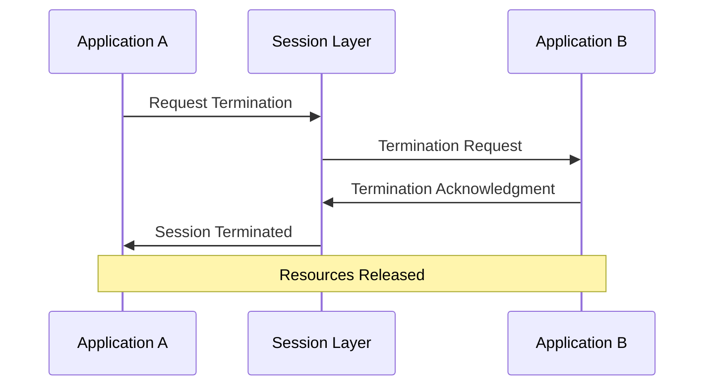

## Session Management Services

The Session Layer provides several key services to manage sessions effectively.

### Service Primitives

The Session Layer defines service primitives for applications to interact with it:

| Primitive | Description |
|-----------|-------------|
| S-CONNECT | Establishes a new session connection |
| S-DATA | Transfers data over the session connection |
| S-EXPEDITED-DATA | Transfers urgent data out of normal sequence |
| S-SYNC | Establishes synchronization points |
| S-RELEASE | Orderly release of a session connection |
| S-ABORT | Abrupt release of a session connection |
| S-ACTIVITY | Defines activity boundaries in a session |
| S-CONTROL-GIVE | Transfers control in half-duplex mode |

### Session Tracking

Sessions need to be tracked across multiple exchanges:

**Methods for Session Tracking:**
1. **Session IDs**: Unique identifiers assigned to each session
2. **Cookies**: Small data packets stored on the client
3. **URL Rewriting**: Embedding session information in URLs
4. **Hidden Form Fields**: Storing session data in non-visible form fields
5. **IP Address Binding**: Associating sessions with client IP addresses

**Session Tracking Challenges:**
- Maintaining state in stateless protocols (like HTTP)
- Handling timeouts and expired sessions
- Managing session data across distributed systems
- Securing session identifiers against theft or forgery

### Session Timeouts

Sessions typically have associated timeouts to manage resources:

**Types of Timeouts:**
- **Idle Timeout**: How long a session can remain inactive before termination
- **Absolute Timeout**: Maximum lifetime of a session regardless of activity
- **Sliding Timeout**: Resets the timer on each activity

**Timeout Management:**
- Balancing security (shorter timeouts) with user experience (longer timeouts)
- Providing warning mechanisms before timeout
- Implementing graceful session recovery

## Dialog Control

Dialog control manages the communication flow between applications during a session.

### Dialog Types

The Session Layer supports different types of communication patterns:

#### 1. Simplex

In simplex communication, data flows in only one direction.

**Characteristics:**
- One-way communication
- No response or acknowledgment
- Example: Broadcasting

#### 2. Half-Duplex

In half-duplex communication, data can flow in both directions, but only one direction at a time.

**Characteristics:**
- Two-way communication with turn-taking
- Explicit control transfer between parties
- Example: Walkie-talkie communication

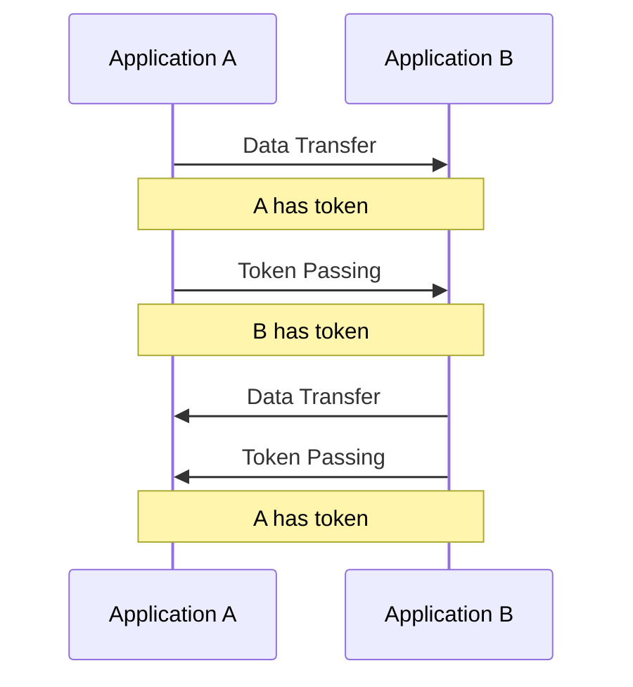

#### 3. Full-Duplex

In full-duplex communication, data can flow in both directions simultaneously.

**Characteristics:**
- Simultaneous two-way communication
- No token passing required
- Example: Telephone conversation

### Token Management

In half-duplex communication, tokens control which side can transmit:

**Token Operations:**
- **Token Passing**: Transferring the right to transmit to the other party
- **Token Requesting**: Asking for the token when needed
- **Token Monitoring**: Tracking which side currently holds the token

**Token Management Challenges:**
- Handling lost tokens
- Preventing token hoarding
- Ensuring fair access to the token

## Synchronization and Recovery

The Session Layer provides mechanisms for synchronization and recovery from failures.

### Synchronization Points

Synchronization points (checkpoints) mark specific positions in the data dialogue.

**Types of Synchronization Points:**
- **Major Synchronization Points**: Confirm all previously transmitted data and establish a recovery point
- **Minor Synchronization Points**: Mark progress within a dialogue without confirming all previous data


**Benefits of Synchronization Points:**
- Allow resumption after failures without restarting the entire session
- Provide confirmation of data reception
- Enable orderly dialog management

### Recovery Procedures

When failures occur, the Session Layer provides mechanisms for recovery:

**Recovery Strategies:**
1. **Resynchronization**: Return to the last synchronization point
2. **Activity Discard**: Abandon the current activity and start a new one
3. **Session Restart**: Terminate and reestablish the session
4. **Session Continuation**: Attempt to continue the session from the current point

**Recovery Process Example:**

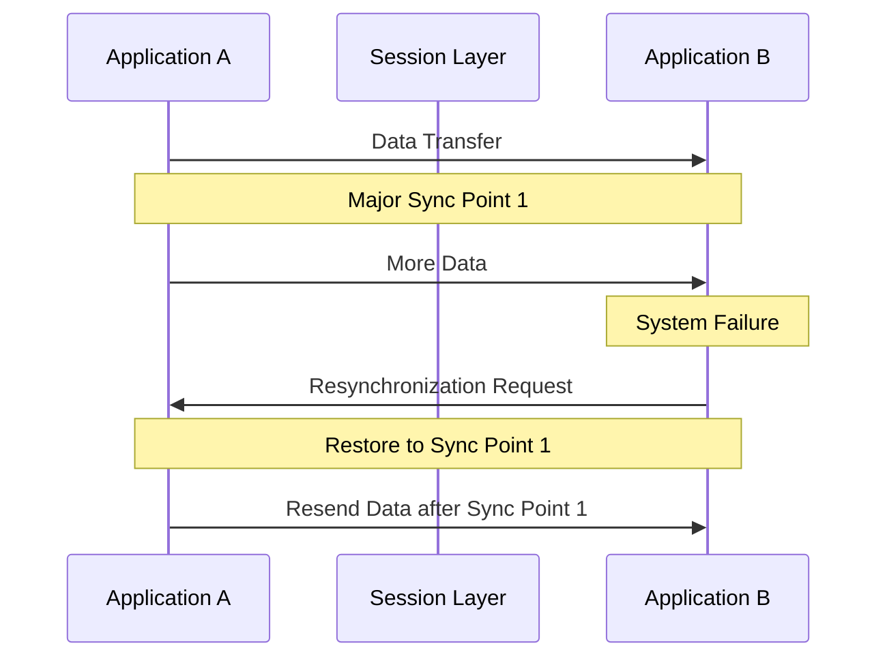

### Quarantining

The Session Layer can quarantine specific activities or messages if problems are detected:

**Quarantine Process:**
1. Identify problematic data or activity
2. Isolate the affected components
3. Prevent propagation of errors
4. Resolve the issue before resuming normal operation

## Session Layer Protocols

Several protocols implement Session Layer functionality.

### NetBIOS (Network Basic Input/Output System)

NetBIOS provides session services for Windows-based networks.

**Key Features:**
- Name resolution
- Session establishment and termination
- Data transfer services
- Compatible with multiple transport protocols

**NetBIOS Services:**
- **Name Service**: Registration and resolution of NetBIOS names
- **Session Service**: Establishment and maintenance of sessions
- **Datagram Service**: Connectionless data transfer

### RPC (Remote Procedure Call)

RPC allows a program to execute procedures on a remote system.

**RPC Process:**

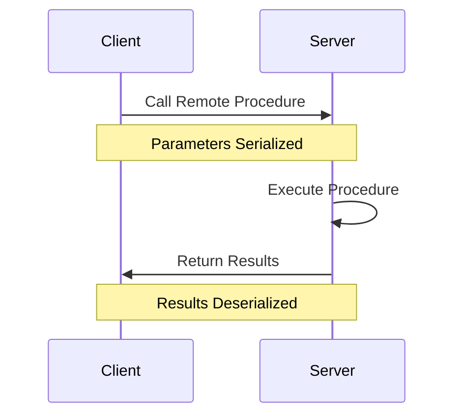

**RPC Characteristics:**
- Abstracts the network details from the application
- Provides session management for procedure calls
- Handles parameter marshalling and unmarshalling
- Supports various authentication mechanisms

**Popular RPC Implementations:**
- ONC RPC (used in NFS)
- DCE/RPC (used in Windows)
- gRPC (Google's modern RPC framework)
- XML-RPC and JSON-RPC (web-based RPC)

### SIP (Session Initiation Protocol)

SIP is used for initiating, maintaining, and terminating real-time sessions involving video, voice, messaging, and other communications applications.

**SIP Components:**
- **User Agents**: End devices that initiate and terminate sessions
- **Proxy Servers**: Forward requests to the next server
- **Registrar Servers**: Accept registration requests from users
- **Redirect Servers**: Provide alternative locations for requests

**SIP Message Flow for a Basic Call:**

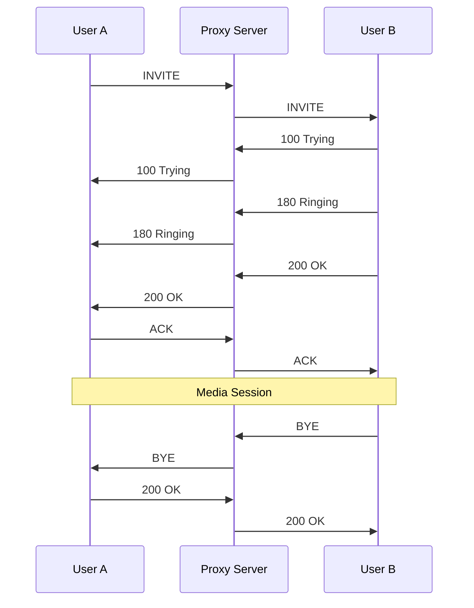

### H.245 (Control Protocol for Multimedia Communication)

H.245 is a control protocol used in H.323 systems for multimedia communication.

**Key Functions:**
- Capability exchange
- Master-slave determination
- Logical channel management
- Mode control

### AppleTalk Session Protocol (ASP)

ASP was developed by Apple for its AppleTalk network architecture.

**Features:**
- Session establishment and maintenance
- Sequenced data transfer
- Session status monitoring
- Attention messages for urgent notifications

### Session Message Block (SMB)/Common Internet File System (CIFS)

SMB/CIFS is a protocol for sharing files, printers, and other resources between computers.

**Capabilities:**
- Session establishment and authentication
- File and printer sharing
- Named pipes for inter-process communication
- Remote procedure calls

## Session Layer in Modern Networks

While the OSI model defines the Session Layer as a distinct layer, many modern protocols combine session functions with other layers.

### TCP/IP and the Session Layer

The TCP/IP model doesn't have a dedicated Session Layer, but session functionality is implemented in various ways:

**TCP/IP Session Management:**
- TCP connections provide some session capabilities
- Application layer protocols handle most session functions
- Middleware and frameworks provide session abstraction

**TCP Session Establishment (Three-Way Handshake):**

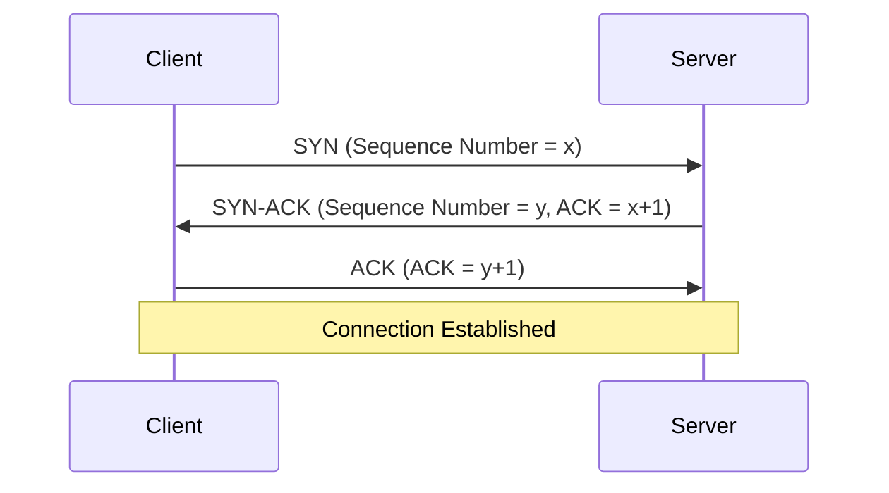

### HTTP Sessions

HTTP is a stateless protocol, but session management is added through various mechanisms:

**HTTP Session Management:**
- **Cookies**: Small text files stored on the client
- **Session IDs**: Unique identifiers for each session
- **JWT (JSON Web Tokens)**: Self-contained tokens for authentication and session data
- **LocalStorage/SessionStorage**: Client-side storage for session information

**HTTP Session Flow:**

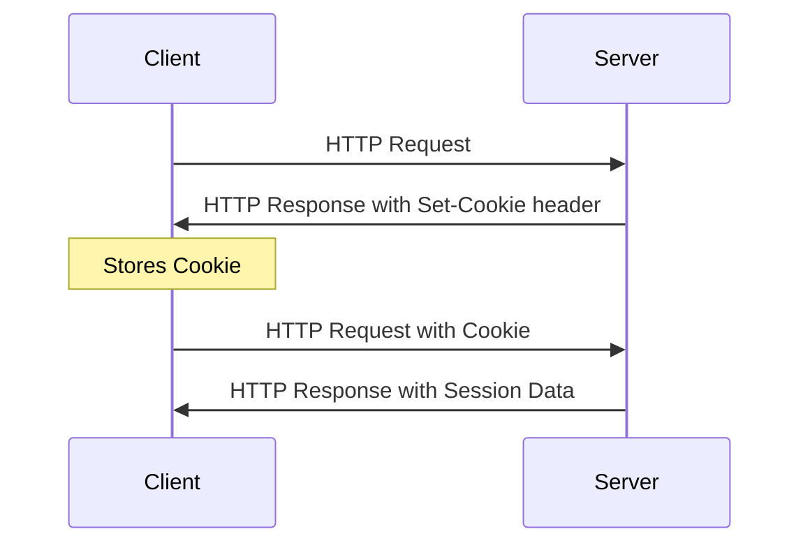

### WebSockets

WebSockets provide full-duplex communication channels over a single TCP connection, including session management.

**WebSocket Establishment:**

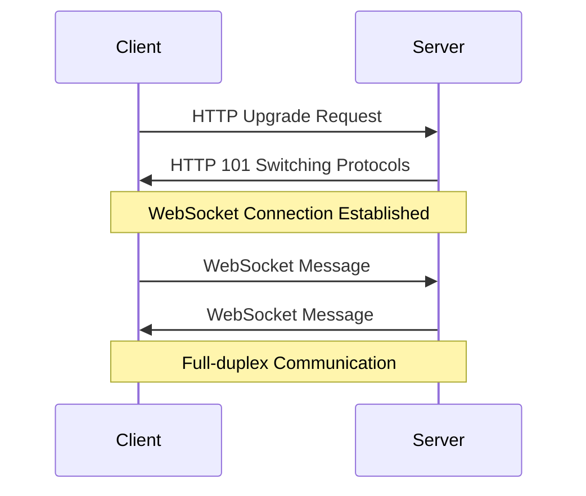

**WebSocket Features:**
- Persistent connection
- Low overhead compared to HTTP
- Real-time bidirectional communication
- Support for sub-protocols

## Authentication and Authorization

Authentication and authorization are key aspects of session management.

### Authentication Methods

Various methods are used to verify user identity at session establishment:

**Password-Based Authentication:**
- Username/password combinations
- Challenge-response mechanisms
- Password hashing and salting

**Token-Based Authentication:**
- JWT (JSON Web Tokens)
- OAuth tokens
- API keys

**Certificate-Based Authentication:**
- X.509 certificates
- SSL/TLS client certificates
- Public key infrastructure (PKI)

**Biometric Authentication:**
- Fingerprint recognition
- Facial recognition
- Voice recognition

**Multi-Factor Authentication (MFA):**
- Combining multiple authentication methods
- Something you know (password)
- Something you have (token, phone)
- Something you are (biometrics)

### Authorization Process

Once authenticated, authorization determines what actions are permitted:

**Authorization Components:**
- **Permissions**: Specific actions allowed
- **Roles**: Groups of permissions
- **Policies**: Rules governing permission assignment
- **Attributes**: Characteristics that influence authorization decisions

**Authorization Models:**
- **Role-Based Access Control (RBAC)**: Permissions based on user roles
- **Attribute-Based Access Control (ABAC)**: Permissions based on attributes
- **Mandatory Access Control (MAC)**: System-enforced access rules
- **Discretionary Access Control (DAC)**: Owner-defined access rules

### Single Sign-On (SSO)

SSO allows users to authenticate once and access multiple applications:

**SSO Protocols:**
- **SAML (Security Assertion Markup Language)**: XML-based protocol for exchanging authentication and authorization data
- **OAuth 2.0**: Authorization framework for third-party applications
- **OpenID Connect**: Authentication layer on top of OAuth 2.0
- **Kerberos**: Network authentication protocol using tickets

**SSO Process Flow:**

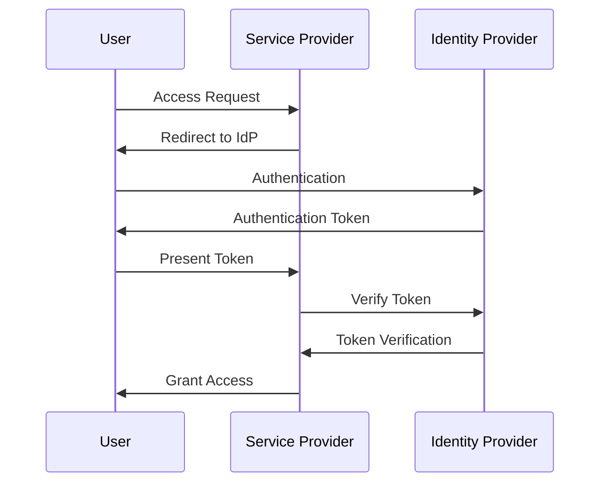

## Session State and Cookies

Managing session state is a critical aspect of the Session Layer.

### Types of State Management

Different approaches exist for maintaining session state:

**Client-Side State Management:**
- Cookies stored on the client
- Local Storage/Session Storage
- Hidden form fields
- URL parameters

**Server-Side State Management:**
- Session objects stored on the server
- Database sessions
- Distributed cache systems
- Stateful services

### Cookies

Cookies are small pieces of data stored on the client by websites:

**Cookie Attributes:**
- **Name/Value**: The data stored in the cookie
- **Domain**: Which websites can access the cookie
- **Path**: Which paths within the domain can access the cookie
- **Expires/Max-Age**: When the cookie should be deleted
- **Secure**: Cookie should only be sent over HTTPS
- **HttpOnly**: Cookie cannot be accessed by JavaScript
- **SameSite**: Controls when cookies are sent with cross-site requests

**Types of Cookies:**
- **Session Cookies**: Temporary cookies that expire when the browser is closed
- **Persistent Cookies**: Long-term cookies with an expiration date
- **First-Party Cookies**: Set by the visited website
- **Third-Party Cookies**: Set by domains other than the visited website

**Cookie Flow:**

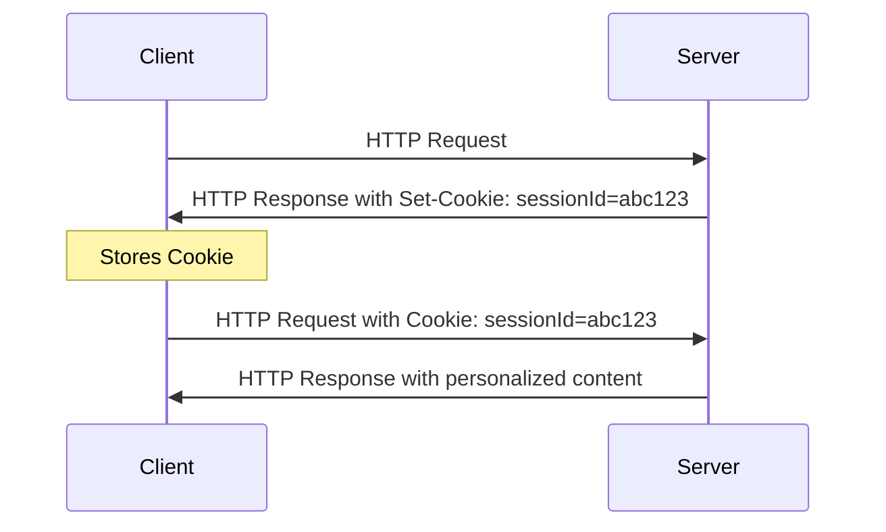

### Session Storage Mechanisms

Various mechanisms are used to store session data:

**Memory-Based Storage:**
- Fast access
- Lost on server restart
- Limited by available memory
- Not suitable for distributed systems

**Database Storage:**
- Persistent across restarts
- Scalable for large applications
- Potentially slower than memory-based storage
- Supports complex queries on session data

**Distributed Cache:**
- Combines speed of memory with distribution
- Examples: Redis, Memcached
- Suitable for clustered environments
- Offers persistence options

**Token-Based Storage:**
- Session data encoded in tokens (e.g., JWT)
- Reduces server storage requirements
- Enables stateless server architecture
- May have security implications if not properly implemented

## Session Security

Securing sessions is critical to protect user data and prevent unauthorized access.

### Session Hijacking

Session hijacking occurs when an attacker steals a valid session identifier to impersonate a legitimate user.

**Attack Vectors:**
- **Packet Sniffing**: Capturing network traffic to extract session IDs
- **Cross-Site Scripting (XSS)**: Injecting scripts to steal cookies
- **Man-in-the-Middle Attacks**: Intercepting communication between client and server
- **Session Fixation**: Forcing a user to use a known session ID

**Prevention Measures:**
- Use HTTPS to encrypt all traffic
- Set Secure and HttpOnly flags on cookies
- Implement proper session timeouts
- Regenerate session IDs after authentication
- Bind sessions to IP addresses or other client attributes
- Implement CSRF (Cross-Site Request Forgery) protection

### Session Fixation

Session fixation attacks trick users into using a session ID known to the attacker.

**Attack Flow:**

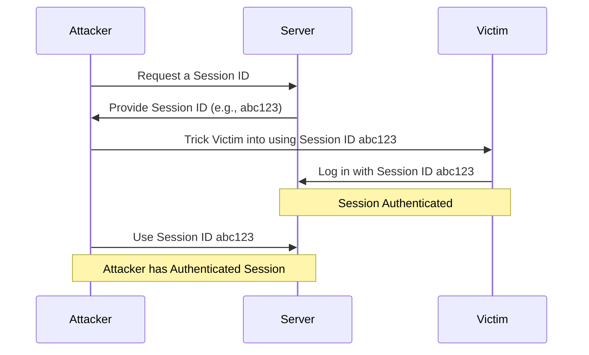

**Prevention Measures:**
- Generate a new session ID after authentication
- Validate the origin of session IDs
- Implement proper authentication checks
- Use secure session management frameworks

### Cross-Site Request Forgery (CSRF)

CSRF attacks trick authenticated users into executing unwanted actions.

**Prevention Measures:**
- Implement anti-CSRF tokens
- Check the Referer header
- Use SameSite cookie attribute
- Require re-authentication for sensitive actions

### Session Data Encryption

Sensitive session data should be encrypted to protect it from unauthorized access.

**Encryption Approaches:**
- Encrypt session data at rest
- Use secure algorithms and key management
- Consider end-to-end encryption for highly sensitive data
- Implement proper key rotation and management

## Practical Applications

Session Layer concepts are applied in various real-world scenarios.

### Web Applications

Web applications use sessions to maintain state across multiple HTTP requests.

**Session Usage in Web Apps:**
- User authentication and authorization
- Shopping carts and order processing
- Multi-step forms and wizards
- Personalization and user preferences
- Activity tracking and analytics

**Implementation Examples:**
- PHP's `$_SESSION` array
- ASP.NET Session State
- Java HttpSession
- Express.js session middleware
- Django's session framework

### Real-Time Communications

Real-time communication applications rely heavily on session management.

**Application Areas:**
- VoIP (Voice over IP)
- Video conferencing
- Instant messaging
- Online gaming
- Collaborative editing

**Technologies:**
- SIP (Session Initiation Protocol)
- WebRTC (Web Real-Time Communication)
- XMPP (Extensible Messaging and Presence Protocol)
- RTMP (Real-Time Messaging Protocol)

### Distributed Systems

Distributed systems use sessions to coordinate activities across multiple nodes.

**Session Challenges in Distributed Systems:**
- Session data replication
- Consistent session state across nodes
- Handling node failures
- Load balancing with session affinity

**Solutions:**
- Distributed session stores (Redis, Memcached)
- Sticky sessions in load balancers
- Session replication across cluster nodes
- Token-based stateless authentication

### E-commerce

E-commerce applications use sessions for shopping carts, checkout processes, and user accounts.

**Session Requirements:**
- Persistence of cart contents
- Secure payment processing
- User preference tracking
- Order history management

**Implementation Considerations:**
- Session timeouts (balancing security and user experience)
- Cart abandonment recovery
- Multi-device shopping sessions
- Guest checkouts with temporary sessions

## Programming Interfaces

Various programming interfaces provide Session Layer functionality.

### Web Frameworks

Web frameworks offer session management capabilities:

**Express.js (Node.js):**
```javascript
const express = require('express');
const session = require('express-session');
const app = express();

app.use(session({
  secret: 'your-secret-key',
  resave: false,
  saveUninitialized: true,
  cookie: { secure: true, maxAge: 60000 }
}));

app.get('/', (req, res) => {
  // Access session data
  if (req.session.views) {
    req.session.views++;
  } else {
    req.session.views = 1;
  }
  res.send(`You have visited this page ${req.session.views} times`);
});
```

**Django (Python):**
```python
# In views.py
def session_view(request):
    if 'visits' in request.session:
        request.session['visits'] += 1
    else:
        request.session['visits'] = 1
    return HttpResponse(f"You have visited this page {request.session['visits']} times")
```

**ASP.NET (C#):**
```csharp
public class HomeController : Controller
{
    public IActionResult Index()
    {
        int visits = HttpContext.Session.GetInt32("Visits") ?? 0;
        visits++;
        HttpContext.Session.SetInt32("Visits", visits);
        ViewBag.Visits = visits;
        return View();
    }
}
```

### Socket Programming

Socket programming provides direct access to network communication, including session management:

**Python Socket Example:**
```python
import socket

# Server
server_socket = socket.socket(socket.AF_INET, socket.SOCK_STREAM)
server_socket.bind(('localhost', 8000))
server_socket.listen(5)
client_socket, address = server_socket.accept()
# Session established, can now exchange data
data = client_socket.recv(1024)
client_socket.send(b"Received: " + data)
# Close session
client_socket.close()
server_socket.close()

# Client
client_socket = socket.socket(socket.AF_INET, socket.SOCK_STREAM)
client_socket.connect(('localhost', 8000))
# Session established, can now exchange data
client_socket.send(b"Hello, server!")
response = client_socket.recv(1024)
# Close session
client_socket.close()
```

### WebSocket APIs

WebSockets provide full-duplex communication channels with built-in session management:

**JavaScript WebSocket Example:**
```javascript
// Client-side
const socket = new WebSocket('ws://example.com/socket');

socket.onopen = function(event) {
  console.log('Connection established');
  socket.send('Hello, server!');
};

socket.onmessage = function(event) {
  console.log('Message from server:', event.data);
};

socket.onclose = function(event) {
  console.log('Connection closed');
};

// Server-side (Node.js with ws library)
const WebSocket = require('ws');
const wss = new WebSocket.Server({ port: 8080 });

wss.on('connection', function(ws) {
  console.log('Client connected');
  
  ws.on('message', function(message) {
    console.log('Received:', message);
    ws.send('Echo: ' + message);
  });
  
  ws.on('close', function() {
    console.log('Client disconnected');
  });
});
```

### RPC Frameworks

RPC frameworks abstract session management for remote procedure calls:

**gRPC Example:**
```protobuf
// Define service
service Greeter {
  rpc SayHello (HelloRequest) returns (HelloReply) {}
}

message HelloRequest {
  string name = 1;
}

message HelloReply {
  string message = 1;
}
```

```javascript
// Node.js gRPC server
const server = new grpc.Server();
server.addService(proto.Greeter.service, {
  sayHello: (call, callback) => {
    callback(null, { message: `Hello, ${call.request.name}!` });
  }
});
server.bind('localhost:50051', grpc.ServerCredentials.createInsecure());
server.start();

// Node.js gRPC client
const client = new proto.Greeter('localhost:50051', grpc.credentials.createInsecure());
client.sayHello({ name: 'World' }, (error, response) => {
  console.log(response.message);
});
```

## Challenges in Session Management

Session management presents several challenges in modern applications.

### Scalability

As applications grow, session management must scale accordingly:

**Challenges:**
- Maintaining session state across multiple servers
- Handling increased session volume
- Managing session storage resource requirements
- Ensuring consistent session behavior under load

**Solutions:**
- Distributed session stores
- Session clustering
- Load balancing with session affinity
- Stateless authentication (JWT, etc.)

### Cross-Device Sessions

Users often access applications from multiple devices:

**Challenges:**
- Synchronizing session state across devices
- Handling concurrent sessions
- Providing seamless user experience
- Managing authentication across devices

**Solutions:**
- Cloud-based session storage
- Device fingerprinting
- Session linking mechanisms
- Multi-device authentication protocols

### Session Expiration Policies

Balancing security and user experience in session expiration:

**Considerations:**
- Security requirements (shorter sessions)
- User convenience (longer sessions)
- Regulatory compliance
- Activity-based vs. absolute timeouts

**Strategies:**
- Sliding expiration for active users
- Shorter timeouts for sensitive operations
- Remember-me functionality for non-sensitive areas
- Session extension with re-authentication

### Microservices Architecture

Microservices introduce unique session management challenges:

**Challenges:**
- Maintaining session context across services
- Avoiding session coupling between services
- Handling service-specific session data
- Managing authentication across service boundaries

**Solutions:**
- API Gateways for session management
- Distributed session stores
- Token-based authentication
- Event-driven session state updates

## Future Trends

Session management continues to evolve with changing technology landscapes.

### Zero Trust Architecture

Zero Trust eliminates implicit trust in network boundaries:

**Session Implications:**
- Continuous session validation
- Just-in-time access provisioning
- Fine-grained authorization checks
- Device posture assessment during sessions

### Passwordless Authentication

Moving beyond passwords for session authentication:

**Technologies:**
- FIDO2/WebAuthn
- Biometric authentication
- Hardware security keys
- Magic links and one-time codes

### Decentralized Identity

Blockchain and distributed ledger technologies for identity management:

**Session Impact:**
- Self-sovereign identity
- Verifiable credentials
- User-controlled session data
- Cross-organization session management

### AI and Behavioral Analysis

Using AI to improve session security:

**Applications:**
- Behavioral biometrics for continuous authentication
- Anomaly detection in session activities
- Risk-based session management
- Predictive session security

## Practice Questions

Test your understanding of the Session Layer with these questions:

1. **What is the primary function of the Session Layer in the OSI model?**
   <details>
   <summary>Answer</summary>
   The primary function of the Session Layer is to establish, manage, and terminate connections (sessions) between applications. It handles dialog control, synchronization, and session recovery, ensuring that applications can communicate in an orderly manner. The Session Layer sits between the Transport Layer (which handles reliable data transfer) and the Presentation Layer (which handles data formatting and encryption).
   </details>

2. **Compare and contrast half-duplex and full-duplex dialog control.**
   <details>
   <summary>Answer</summary>
   
   **Half-Duplex Dialog Control:**
   - Data can flow in both directions but only one direction at a time
   - Requires explicit token passing to transfer control between communicating parties
   - One side must finish transmitting before the other can begin
   - Uses token management to control which side can transmit
   - Examples include traditional walkie-talkies and some older network protocols
   
   **Full-Duplex Dialog Control:**
   - Data can flow in both directions simultaneously
   - No token passing required
   - Both sides can transmit and receive at the same time
   - More efficient for interactive communications
   - Examples include telephone conversations and modern network protocols like TCP
   
   The main difference is that half-duplex requires turn-taking with explicit control transfer, while full-duplex allows simultaneous bidirectional communication without the overhead of token management.
   </details>

3. **Explain synchronization points and why they are important for session recovery.**
   <details>
   <summary>Answer</summary>
   
   **Synchronization Points** are markers placed in the data stream during a session that serve as checkpoints or reference points in the dialogue between applications.
   
   **Types of Synchronization Points:**
   - **Major Synchronization Points**: Confirm all previously transmitted data and establish a recovery point.
   - **Minor Synchronization Points**: Mark progress within a dialogue without confirming all previous data.
   
   **Importance for Session Recovery:**
   
   1. **Recovery Without Complete Restart**: When a failure occurs, communication can be resumed from the last synchronization point rather than restarting the entire session from the beginning. This saves time and resources.
   
   2. **Data Integrity**: Synchronization points ensure that both sides agree on what data has been successfully transferred, providing a consistent view of the session state.
   
   3. **Error Isolation**: They help isolate errors to specific segments of the dialogue, making troubleshooting easier.
   
   4. **Resource Management**: By establishing clear points where resources can be released or committed, synchronization points help manage system resources efficiently.
   
   5. **Transaction Boundaries**: They can mark logical transaction boundaries in the application dialogue, ensuring that complex operations are either completed entirely or not at all.
   
   For example, in a file transfer session, synchronization points might be established after each block of data. If the connection fails during transfer, the session can be resumed from the last successfully transferred block rather than starting the entire file transfer again.
   </details>

4. **How do cookies work, and what are their limitations in session management?**
   <details>
   <summary>Answer</summary>
   
   **How Cookies Work:**
   
   1. **Creation**: When a user visits a website, the server sends an HTTP response with a Set-Cookie header containing a name-value pair and optional attributes.
   
   2. **Storage**: The browser stores this cookie locally on the user's device.
   
   3. **Transmission**: For subsequent requests to the same domain, the browser automatically includes the cookie in the HTTP request headers.
   
   4. **Processing**: The server uses the cookie information to identify the session and retrieve associated server-side data.
   
   **Limitations in Session Management:**
   
   1. **Size Restrictions**: Cookies are limited to about 4KB in size, making them unsuitable for storing large amounts of session data.
   
   2. **Security Vulnerabilities**: Cookies can be vulnerable to:
      - Cross-Site Scripting (XSS) attacks if not marked as HttpOnly
      - Cross-Site Request Forgery (CSRF) attacks if not properly protected
      - Man-in-the-Middle attacks if not secured with HTTPS
      - Cookie theft through various attack vectors
   
   3. **User Control**: Users can:
      - Delete cookies
      - Block cookies entirely
      - Use private browsing modes that limit cookie persistence
   
   4. **Privacy Concerns**: Cookies can be used for tracking user behavior across websites, leading to privacy issues and regulatory compliance challenges (GDPR, CCPA, etc.).
   
   5. **Cross-Domain Limitations**: By default, cookies are domain-specific and cannot be shared between different domains, complicating multi-domain applications.
   
   6. **Browser Compatibility**: Different browsers handle cookies differently, potentially causing inconsistent behavior.
   
   7. **Expiration Management**: Managing cookie expiration properly can be challenging, balancing security needs with user experience.
   
   8. **Mobile Limitations**: Mobile apps and some mobile browsers may handle cookies differently than desktop browsers.
   
   Because of these limitations, modern web applications often use cookies in combination with other session management techniques like JWT (JSON Web Tokens), localStorage, or server-side session stores.
   </details>

5. **What is Single Sign-On (SSO) and how does it relate to session management?**
   <details>
   <summary>Answer</summary>
   
   **Single Sign-On (SSO)** is an authentication scheme that allows users to log in once and gain access to multiple applications or systems without having to re-enter credentials for each one.
   
   **Relationship to Session Management:**
   
   1. **Centralized Session Authority**: SSO establishes a central authority (Identity Provider) that manages authentication sessions, rather than each application managing its own authentication.
   
   2. **Session Propagation**: SSO propagates session information across multiple systems, usually through tokens or tickets that verify the user's authenticated status.
   
   3. **Session Lifecycle Coordination**: With SSO, session creation, validation, and termination must be coordinated across multiple systems:
      - Logging in once creates sessions across multiple applications
      - Session timeouts may need to be synchronized
      - Logging out from one application might trigger logout from all applications
   
   4. **Cross-Domain Session Management**: SSO often needs to manage sessions across different domains or security boundaries, requiring specialized protocols.
   
   5. **Token-Based Sessions**: Many SSO implementations use token-based approaches (like SAML assertions, OAuth tokens, or JWTs) instead of traditional cookie-based sessions.
   
   **Common SSO Protocols and Their Session Handling:**
   
   - **SAML (Security Assertion Markup Language)**: Uses XML-based assertions to communicate authentication and authorization data between the Identity Provider and Service Providers.
   
   - **OAuth 2.0**: Focuses on authorization, providing access tokens that applications can use to access resources on behalf of the user.
   
   - **OpenID Connect**: Builds on OAuth 2.0 to add an authentication layer, providing ID tokens with user identity information.
   
   - **Kerberos**: Uses ticket-based authentication, where a ticket-granting ticket (TGT) is obtained once and then used to acquire service tickets for specific applications.
   
   SSO represents an evolution of traditional session management, moving from application-specific sessions to a more holistic, user-centric approach to managing authenticated state across an ecosystem of applications.
   </details>

6. **What is session hijacking and how can it be prevented?**
   <details>
   <summary>Answer</summary>
   
   **Session Hijacking** is an attack where a malicious actor gains unauthorized access to a user's session by obtaining or predicting their session identifier, allowing the attacker to impersonate the legitimate user.
   
   **Common Session Hijacking Techniques:**
   
   1. **Session Sniffing**: Intercepting unencrypted network traffic to capture session identifiers.
   
   2. **Cross-Site Scripting (XSS)**: Injecting malicious scripts that steal cookies containing session IDs.
   
   3. **Man-in-the-Middle Attacks**: Positioning between the client and server to intercept and modify communication.
   
   4. **Session Fixation**: Forcing a user to use a known session ID before they authenticate.
   
   5. **Client-Side Malware**: Using malware to access cookies or session data stored on the user's device.
   
   6. **Brute Force**: Guessing or generating valid session IDs through trial and error.
   
   **Prevention Measures:**
   
   1. **Use HTTPS**: Encrypt all communication to prevent session ID theft through packet sniffing.
   
   2. **Secure Cookie Attributes**:
      - **HttpOnly**: Prevents JavaScript from accessing cookies, mitigating XSS attacks.
      - **Secure**: Ensures cookies are only sent over HTTPS connections.
      - **SameSite**: Controls when cookies are sent with cross-site requests, reducing CSRF risks.
      - **Domain and Path**: Restrict where cookies are sent.
   
   3. **Session ID Management**:
      - Generate cryptographically strong, random session IDs
      - Regenerate session IDs after authentication (session fixation protection)
      - Implement proper session timeout policies
      - Invalidate sessions after logout or inactivity
   
   4. **Additional Validation**:
      - Bind sessions to IP addresses (with caution for legitimate IP changes)
      - Use browser fingerprinting as an additional check
      - Implement user-agent consistency checks
   
   5. **Multi-Factor Authentication (MFA)**: Require additional verification for sensitive actions, limiting the damage from hijacked sessions.
   
   6. **Session Monitoring**:
      - Detect and alert on suspicious session activity
      - Implement concurrent session controls
      - Track geographical anomalies in session access
   
   7. **Content Security Policy (CSP)**: Prevent unauthorized script execution that could lead to cookie theft.
   
   8. **Education**: Train users to recognize phishing attempts and to use secure practices like logging out after use, especially on shared computers.
   
   By implementing these preventive measures, organizations can significantly reduce the risk of successful session hijacking attacks and protect user sessions.
   </details>

7. **Compare stateful and stateless session management approaches.**
   <details>
   <summary>Answer</summary>
   
   **Stateful Session Management:**
   
   In stateful session management, session data is stored on the server, and only a session identifier is sent to the client.
   
   **Characteristics:**
   - Session data stored server-side (in memory, database, or distributed cache)
   - Client only stores a session ID (typically in a cookie)
   - Server must retrieve session data for each request
   - Sessions require explicit management (creation, storage, expiration, cleanup)
   
   **Advantages:**
   - More secure (sensitive data stays on server)
   - Easy to invalidate sessions
   - Can store large amounts of session data
   - Session data can be modified without client involvement
   - Fine-grained control over session lifecycle
   
   **Disadvantages:**
   - Requires server resources for session storage
   - Can create scalability challenges
   - Creates server affinity issues in load-balanced environments
   - Session data can be lost if server crashes (unless persisted)
   - Requires session synchronization in distributed systems
   
   **Examples:**
   - PHP $_SESSION
   - Java HttpSession
   - ASP.NET Session State
   - Express.js with server-side session stores
   
   **Stateless Session Management:**
   
   In stateless session management, all session data is stored on the client, typically in a secure, tamper-proof token.
   
   **Characteristics:**
   - All session data encoded in tokens sent to and stored by the client
   - Server does not store session state
   - Each request contains all information needed for authentication and authorization
   - Tokens are typically signed or encrypted to ensure integrity and confidentiality
   
   **Advantages:**
   - Highly scalable (no server storage required)
   - Works well in distributed and microservices architectures
   - No server affinity requirements
   - Resilient to server failures
   - Reduced database lookups
   
   **Disadvantages:**
   - Limited storage capacity (tokens shouldn't be too large)
   - Cannot easily invalidate sessions before token expiration
   - All session data transmitted with every request (bandwidth usage)
   - Security depends on proper token implementation
   - Sensitive data exposure risks if not properly encrypted
   
   **Examples:**
   - JWT (JSON Web Tokens)
   - SAML assertions
   - OAuth 2.0 tokens
   - Signed cookies
   
   **Hybrid Approaches:**
   
   Many modern applications use hybrid approaches:
   - Store critical authentication data in tokens
   - Keep more volatile or larger session data server-side
   - Use distributed caches like Redis for server-side session storage
   - Implement token revocation lists for stateless token invalidation
   
   The choice between stateful and stateless depends on factors like application architecture, scalability requirements, security needs, and the nature of the session data being managed.
   </details>

8. **How does WebSocket maintain sessions compared to traditional HTTP?**
   <details>
   <summary>Answer</summary>
   
   **WebSocket Session Management vs. Traditional HTTP:**
   
   **Traditional HTTP Session Management:**
   
   1. **Connection Model**: HTTP is stateless; each request-response cycle is independent.
   
   2. **Session Persistence**: Sessions are artificially maintained using:
      - Cookies containing session IDs
      - URL parameters
      - Hidden form fields
   
   3. **Session Flow**:
      - Client makes request with session identifier
      - Server looks up session data
      - Server processes request with session context
      - Server sends response
      - Connection closes
      - Process repeats for each request
   
   4. **Overhead**: Each request requires:
      - TCP handshake
      - HTTP headers
      - Session retrieval
      - New connection establishment
   
   5. **Session Timeouts**: Server must implement timeout policies for inactive sessions.
   
   **WebSocket Session Management:**
   
   1. **Connection Model**: WebSocket establishes a persistent, full-duplex connection that remains open.
   
   2. **Session Establishment**:
      - Initial HTTP request with Upgrade header
      - Server accepts upgrade to WebSocket protocol
      - Single TCP connection remains open for the duration of the session
   
   3. **Session Persistence**:
      - The connection itself represents the session
      - No need for cookies or session IDs for the core connection
      - Connection remains active until explicitly closed
   
   4. **Communication Flow**:
      - After initial handshake, data flows bidirectionally without repeated connection establishment
      - Server can push data to client without client requests
      - Lower latency for real-time applications
   
   5. **Session State**:
      - Application can maintain context for the duration of the connection
      - Session state often tied directly to the WebSocket connection object
   
   6. **Authentication**:
      - Usually performed once during initial handshake
      - Connection represents authenticated user for its duration
   
   7. **Heartbeats and Keepalives**:
      - WebSocket protocol includes ping/pong frames for connection maintenance
      - Application-level heartbeats often implemented to detect disconnections
   
   **Key Differences:**
   
   1. **Persistence**: WebSocket maintains a single, long-lived connection while HTTP creates new connections for each request.
   
   2. **Efficiency**: WebSocket reduces overhead by eliminating repeated handshakes and header transmission.
   
   3. **Real-time Capability**: WebSocket enables true bidirectional communication without polling.
   
   4. **State Management**: The WebSocket connection itself maintains state, while HTTP requires additional mechanisms.
   
   5. **Resource Usage**: WebSocket connections consume server resources for their entire duration, while HTTP connections are short-lived.
   
   WebSocket provides a more natural and efficient way to maintain sessions for applications requiring real-time updates or frequent bidirectional communication, while traditional HTTP session management is more suitable for request-response patterns with less frequent interaction.
   </details>

## Additional Resources

### Books
- **Computer Networks: A Systems Approach** by Larry Peterson and Bruce Davie
- **TCP/IP Illustrated, Volume 1: The Protocols** by Kevin R. Fall and W. Richard Stevens
- **Web Application Security: A Beginner's Guide** by Bryan Sullivan and Vincent Liu
- **SIP: Understanding the Session Initiation Protocol** by Alan B. Johnston

### Online Resources
- [RFC 5246: The Transport Layer Security (TLS) Protocol Version 1.2](https://tools.ietf.org/html/rfc5246)
- [RFC 6455: The WebSocket Protocol](https://tools.ietf.org/html/rfc6455)
- [RFC 3261: SIP: Session Initiation Protocol](https://tools.ietf.org/html/rfc3261)
- [OWASP Session Management Cheat Sheet](https://cheatsheetseries.owasp.org/cheatsheets/Session_Management_Cheat_Sheet.html)
- [MDN Web Docs: HTTP cookies](https://developer.mozilla.org/en-US/docs/Web/HTTP/Cookies)

### Tools
- **Wireshark**: For analyzing session-level communication
- **Burp Suite**: For testing web application session security
- **Redis**: For distributed session storage
- **SIPp**: For testing SIP session management
- **WebSocket testing tools**: wscat, Postman, Socket.IO

### Video Resources
- [Khan Academy: Internet 101](https://www.khanacademy.org/computing/ap-computer-science-principles/the-internet)
- [Computerphile's Web Security Videos](https://www.youtube.com/user/Computerphile/search?query=security)
- [MIT OpenCourseWare: Computer System Security](https://ocw.mit.edu/courses/electrical-engineering-and-computer-science/6-858-computer-systems-security-fall-2014/)
