# Day 20: Network Security - Part 1

  
  
  <h1>🔒 Network Security: Fundamentals and Cryptography 🔒</h1>
  
  

    
    
    
    
  

  
  

## Table of Contents
- [Introduction to Network Security](#introduction-to-network-security)
- [The CIA Triad](#the-cia-triad)
- [Network Security Threats](#network-security-threats)
- [Cryptography Fundamentals](#cryptography-fundamentals)
- [Symmetric Key Cryptography](#symmetric-key-cryptography)
- [Asymmetric Key Cryptography](#asymmetric-key-cryptography)
- [Hash Functions](#hash-functions)
- [Digital Signatures](#digital-signatures)
- [Public Key Infrastructure (PKI)](#public-key-infrastructure-pki)

## Introduction to Network Security

Network security encompasses the policies, practices, and technologies designed to protect the integrity, confidentiality, and accessibility of computer networks and data. As networks have become the backbone of modern computing, securing them has become increasingly critical.

### Why Network Security Matters

Network security is essential for:

1. **Protecting Sensitive Information**: Preventing unauthorized access to confidential data
2. **Ensuring Business Continuity**: Maintaining operational capabilities despite attacks
3. **Preserving Reputation**: Avoiding the damage caused by security breaches
4. **Complying with Regulations**: Meeting legal and industry-specific requirements
5. **Enabling Digital Transformation**: Providing the secure foundation for innovation

### Evolution of Network Security

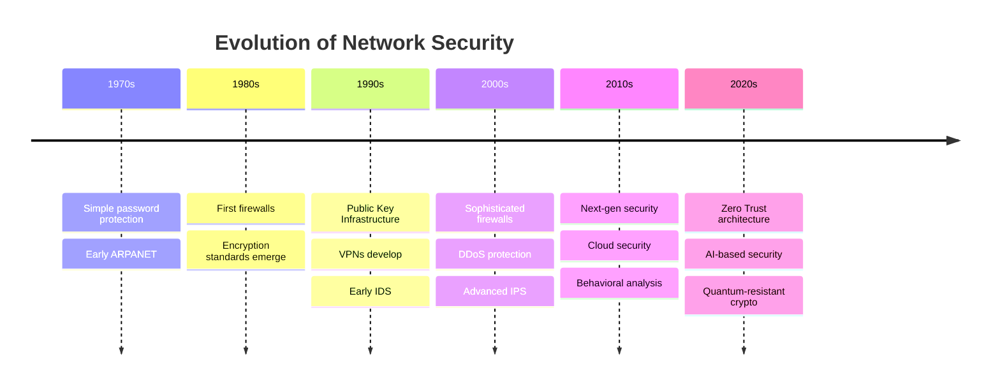

### The Security Landscape Today

Modern network security faces several challenges:

- **Expanding Attack Surface**: With cloud computing, IoT, mobile devices, and remote work
- **Sophisticated Threats**: Nation-state actors, organized cybercrime, advanced persistent threats
- **Security Skills Gap**: Shortage of qualified cybersecurity professionals
- **Compliance Complexity**: Increasing regulatory requirements
- **Technology Integration**: Securing diverse and rapidly evolving technologies

## The CIA Triad

The CIA triad is a model designed to guide policies for information security within an organization. It stands for Confidentiality, Integrity, and Availability.

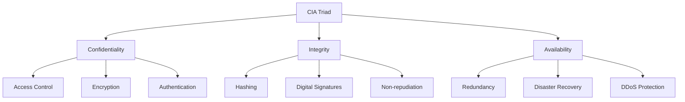

### Confidentiality

Confidentiality ensures that sensitive information is accessible only to authorized individuals. It prevents unauthorized disclosure of data.

**Key Technologies and Practices:**
- Encryption
- Access controls
- Authentication
- Data classification
- Secure disposal of information

**Breach of Confidentiality:**
When unauthorized individuals gain access to privileged information, such as personal data, financial records, or proprietary business information.

### Integrity

Integrity guarantees that data remains accurate, consistent, and trustworthy throughout its lifecycle. It prevents unauthorized alteration of data.

**Key Technologies and Practices:**
- Hashing
- Digital signatures
- Version control
- Access controls
- Checksums

**Breach of Integrity:**
When data is improperly modified, either maliciously or accidentally, compromising its accuracy and reliability.

### Availability

Availability ensures that information and resources are accessible to authorized users when needed. It prevents disruption of service.

**Key Technologies and Practices:**
- Redundancy
- Fault tolerance
- Disaster recovery
- Backup systems
- DDoS protection

**Breach of Availability:**
When legitimate users cannot access systems or data when required, often due to denial-of-service attacks, hardware failures, or natural disasters.

## Network Security Threats

Network security threats are constantly evolving, targeting vulnerabilities in systems, applications, and human behavior.

### Common Attack Vectors

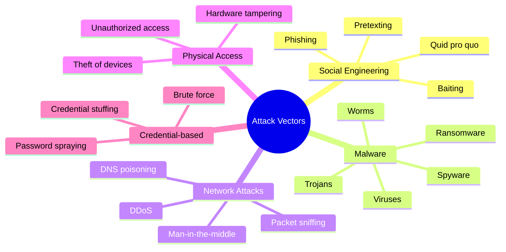

### Key Threat Categories

#### 1. Malware

Malicious software designed to damage, disrupt, or gain unauthorized access to systems.

**Types:**
- **Viruses**: Self-replicating malicious code that attaches to legitimate programs
- **Worms**: Self-propagating malware that spreads without user intervention
- **Trojans**: Malware disguised as legitimate software
- **Ransomware**: Encrypts data and demands payment for decryption
- **Spyware**: Covertly gathers information about users
- **Rootkits**: Conceals the existence of malware by modifying the operating system

#### 2. Social Engineering

Manipulating people into breaking security procedures or divulging confidential information.

**Common Techniques:**
- **Phishing**: Fraudulent attempts to obtain sensitive information through disguised communication
- **Spear Phishing**: Targeted phishing attacks aimed at specific individuals or organizations
- **Pretexting**: Creating a fabricated scenario to obtain information
- **Baiting**: Offering something enticing to entrap a victim
- **Tailgating**: Following someone into a restricted area

#### 3. Network-Based Attacks

Attacks that target network infrastructure and communications.

**Common Types:**
- **Man-in-the-Middle (MitM)**: Intercepting and potentially altering communications between two parties
- **Denial-of-Service (DoS)**: Overwhelming systems to make them unavailable
- **Distributed Denial-of-Service (DDoS)**: DoS attack from multiple sources
- **DNS Poisoning**: Corrupting DNS information to redirect traffic
- **ARP Spoofing**: Linking an attacker's MAC address with a legitimate IP address

#### 4. Physical Security Threats

Attacks that require physical access to systems or network infrastructure.

**Examples:**
- **Unauthorized Access**: Physically accessing restricted areas
- **Device Theft**: Stealing computers, servers, or storage devices
- **Hardware Keyloggers**: Physical devices that record keystrokes
- **Dumpster Diving**: Searching through discarded materials for sensitive information

#### 5. Advanced Persistent Threats (APTs)

Long-term targeted attacks, often conducted by nation-states or sophisticated threat actors.

**Characteristics:**
- **Targeted**: Focused on specific organizations or sectors
- **Persistent**: Maintaining unauthorized access for extended periods
- **Advanced**: Using sophisticated techniques to avoid detection
- **Stealthy**: Operating below the radar of security controls

## Cryptography Fundamentals

Cryptography is the practice and study of techniques for secure communication in the presence of adversaries. It forms the foundation of many network security mechanisms.

### Key Concepts in Cryptography

#### Encryption and Decryption

- **Plaintext**: The original, readable message
- **Ciphertext**: The encrypted, unreadable message
- **Encryption**: The process of converting plaintext to ciphertext
- **Decryption**: The process of converting ciphertext back to plaintext
- **Cryptographic Algorithm (Cipher)**: The mathematical function used for encryption and decryption
- **Key**: A piece of information that determines the output of a cryptographic algorithm

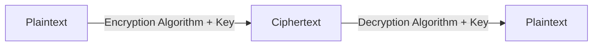

#### Cryptographic Strength

The strength of cryptography depends on several factors:

- **Key Length**: Longer keys generally provide stronger security
- **Algorithm Complexity**: More complex algorithms are harder to break
- **Implementation Quality**: Proper implementation is crucial for security
- **Key Management**: Secure generation, storage, and distribution of keys

### Types of Cryptography

Cryptography can be broadly categorized into three types:

1. **Symmetric Key Cryptography**: Uses the same key for encryption and decryption
2. **Asymmetric Key Cryptography**: Uses different keys for encryption and decryption
3. **Hash Functions**: One-way functions that map data of arbitrary size to fixed-size values

## Symmetric Key Cryptography

Symmetric key cryptography, also known as secret key cryptography, uses the same key for both encryption and decryption processes.

### How Symmetric Encryption Works

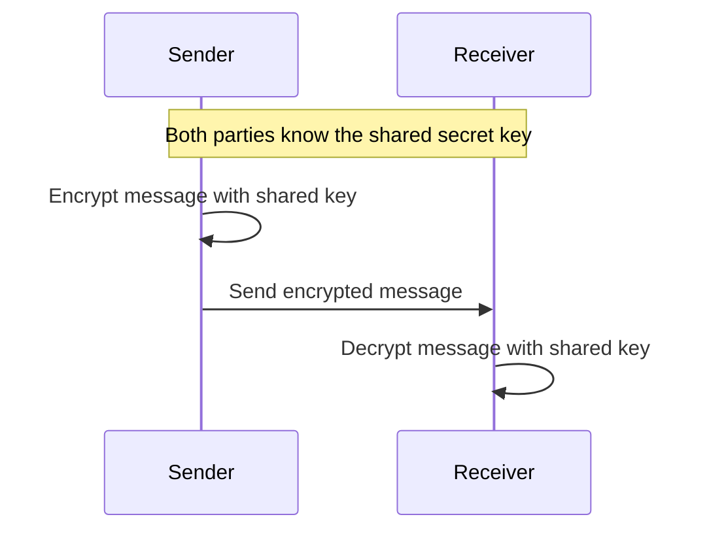

### Advantages and Disadvantages

**Advantages:**
- Fast and efficient for large volumes of data
- Relatively simple implementation
- Strong security when properly implemented

**Disadvantages:**
- Key distribution problem: How to securely share the key?
- Scalability issues: Need n(n-1)/2 keys for n users to communicate securely
- Limited non-repudiation: Can't prove who encrypted a message since both parties have the same key

### Common Symmetric Algorithms

#### AES (Advanced Encryption Standard)

The current standard for symmetric encryption, adopted by the U.S. government and widely used worldwide.

**Characteristics:**
- Block cipher with 128-bit block size
- Key sizes: 128, 192, or 256 bits
- Fast in both software and hardware
- Highly secure when properly implemented

#### DES (Data Encryption Standard) and 3DES

DES was the predecessor to AES, now considered insecure due to its small key size.

**Characteristics:**
- Block cipher with 64-bit block size
- 56-bit effective key length (DES)
- 3DES applies DES three times for increased security
- Still used in legacy systems but being phased out

#### Other Symmetric Algorithms

- **Blowfish**: 64-bit block cipher with variable key length (up to 448 bits)
- **Twofish**: 128-bit block cipher with key sizes up to 256 bits
- **RC4**: Stream cipher once widely used in protocols like WEP and SSL/TLS
- **ChaCha20**: Modern stream cipher used in TLS and other protocols

### Block Ciphers vs. Stream Ciphers

**Block Ciphers**:
- Encrypt fixed-size blocks of data (e.g., 64 or 128 bits)
- Require padding for data that isn't a multiple of the block size
- Examples: AES, DES, 3DES, Blowfish, Twofish

**Stream Ciphers**:
- Encrypt individual bits or bytes continuously
- No padding required, output is the same length as the input
- Typically faster than block ciphers
- Examples: RC4, ChaCha20, A5/1 (used in GSM)

### Block Cipher Modes of Operation

Block cipher modes determine how to repeatedly apply a cipher's single-block operation to securely transform data larger than a block.

**Common Modes:**

| Mode | Full Name | Description | Security Properties |
|------|-----------|-------------|---------------------|
| ECB | Electronic Codebook | Each block encrypted independently | Not recommended for most applications; identical plaintext blocks result in identical ciphertext blocks |
| CBC | Cipher Block Chaining | Each block XORed with previous ciphertext block before encryption | Provides confidentiality; sequential encryption; requires IV |
| CTR | Counter | Converts block cipher into stream cipher using incrementing counter | Allows parallel encryption/decryption; requires unique counter for each block |
| GCM | Galois/Counter Mode | Combines CTR mode with authentication | Provides both confidentiality and authenticity; widely used in TLS |
| XTS | XEX-based Tweaked Codebook with Ciphertext Stealing | Specialized mode for disk encryption | Designed for encrypting storage sectors; resistant to certain attacks |

## Asymmetric Key Cryptography

Asymmetric key cryptography, also known as public key cryptography, uses a pair of mathematically related keys: a public key for encryption and a private key for decryption.

### How Asymmetric Encryption Works

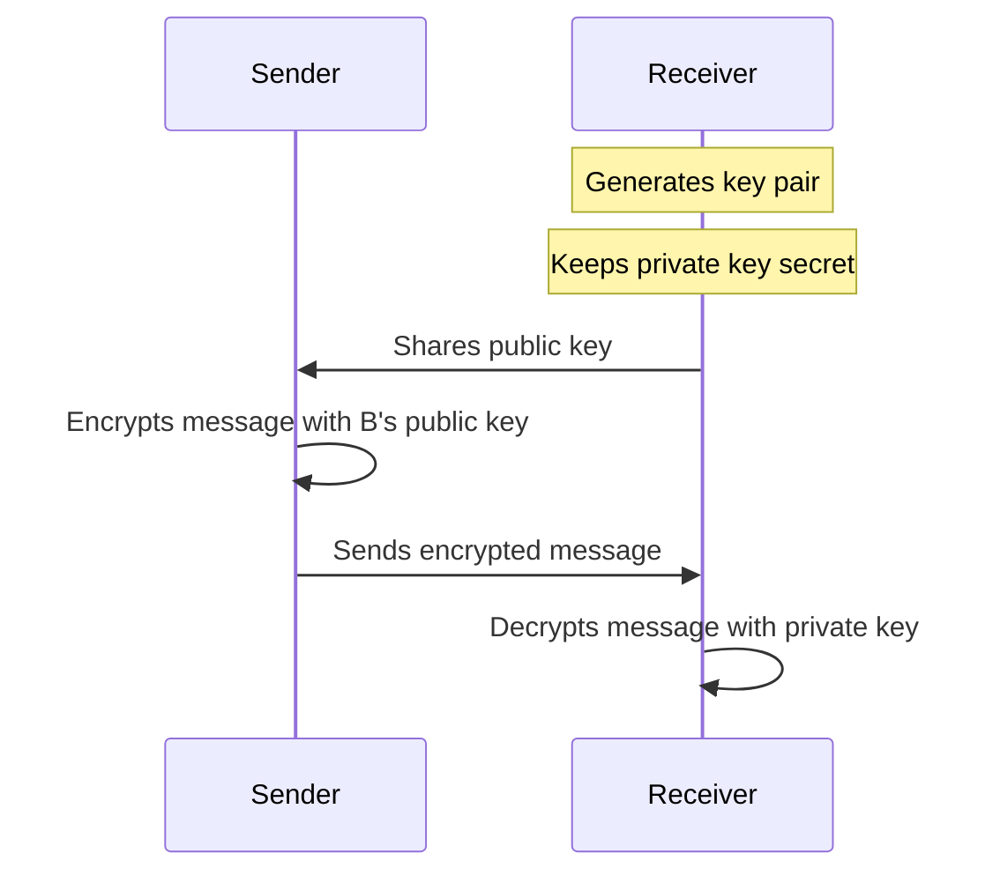

### Advantages and Disadvantages

**Advantages:**
- Solves the key distribution problem
- Enables secure communication without prior key exchange
- Provides foundation for digital signatures and non-repudiation
- Better scalability: only n key pairs needed for n users

**Disadvantages:**
- Much slower than symmetric encryption (often 1000x or more)
- Requires longer keys for equivalent security
- More computationally intensive
- Vulnerable to quantum computing attacks (in theory)

### Common Asymmetric Algorithms

#### RSA (Rivest-Shamir-Adleman)

The most widely used asymmetric algorithm, based on the practical difficulty of factoring the product of two large prime numbers.

**Characteristics:**
- Key sizes typically 2048 or 4096 bits
- Used for both encryption and digital signatures
- Relatively slow compared to symmetric algorithms
- Security based on the difficulty of integer factorization

#### ECC (Elliptic Curve Cryptography)

A newer approach that provides equivalent security to RSA with much shorter keys.

**Characteristics:**
- Uses algebraic properties of elliptic curves
- 256-bit ECC keys provide security comparable to 3072-bit RSA
- More efficient than RSA, especially on constrained devices
- Increasingly used in mobile and IoT applications

#### Diffie-Hellman Key Exchange

Not an encryption algorithm, but a method to securely exchange cryptographic keys over a public channel.

**Process:**
1. Two parties agree on public parameters
2. Each party generates a private key and derives a public key
3. They exchange public keys
4. Each computes a shared secret using their private key and the other's public key
5. The shared secret can be used as a symmetric key

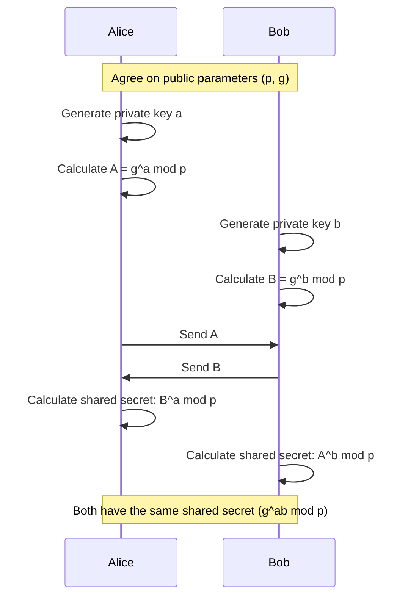

#### Other Asymmetric Algorithms

- **DSA (Digital Signature Algorithm)**: Used specifically for digital signatures
- **ElGamal**: Based on the difficulty of computing discrete logarithms
- **ECDSA**: Elliptic Curve Digital Signature Algorithm
- **ECDHE**: Elliptic Curve Diffie-Hellman Ephemeral, used in TLS

### Hybrid Cryptosystems

In practice, most cryptographic applications use a combination of symmetric and asymmetric cryptography to leverage the strengths of both:

1. **Asymmetric encryption** is used to securely exchange a symmetric key
2. **Symmetric encryption** is then used for the bulk data encryption

This approach provides the security advantages of asymmetric cryptography with the performance benefits of symmetric cryptography.

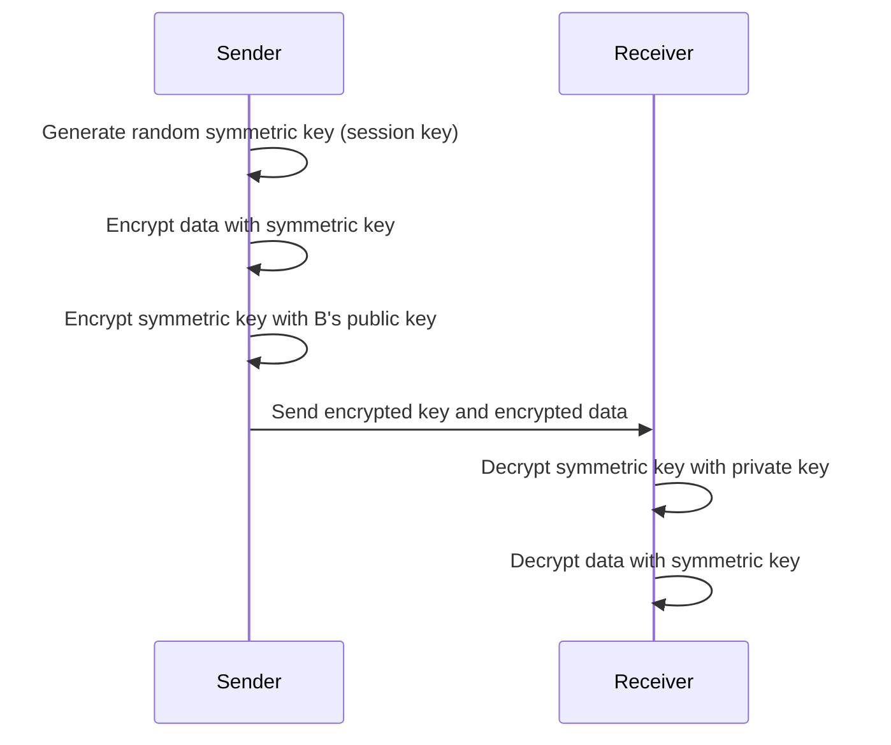

## Hash Functions

Hash functions are one-way cryptographic functions that map data of arbitrary size to fixed-size values. They are fundamental to many security applications.

### Properties of Cryptographic Hash Functions

1. **Deterministic**: The same input always produces the same hash
2. **Quick Computation**: Efficient to calculate for any input
3. **Pre-image Resistance**: Infeasible to determine the input from the hash value
4. **Small Changes, Big Differences**: A small change in input produces a significantly different hash
5. **Collision Resistance**: Extremely difficult to find two different inputs with the same hash
6. **Fixed Output Size**: Produces a hash of fixed length regardless of input size

### Common Hash Algorithms

#### MD5 (Message Digest 5)

**Characteristics:**
- 128-bit hash value
- No longer considered secure - vulnerable to collision attacks
- Still used in non-security applications for checksums
- **Should not be used** for password storage or digital signatures

#### SHA (Secure Hash Algorithm) Family

**SHA-1:**
- 160-bit hash value
- No longer considered secure for cryptographic applications
- Collision attack demonstrated in 2017

**SHA-2:**
- Family of hash functions including SHA-224, SHA-256, SHA-384, SHA-512
- Widely used in security applications and protocols
- SHA-256 produces 256-bit hash values

**SHA-3:**
- Newest member of the SHA family, selected through a public competition
- Based on a different design principle (sponge construction)
- Available in multiple output sizes (224, 256, 384, 512 bits)

#### BLAKE2 and BLAKE3

Modern hash functions designed for high speed:
- BLAKE2 is faster than MD5 but provides security comparable to SHA-3
- BLAKE3 offers even higher performance with strong security properties
- Increasingly used in performance-critical applications

### Applications of Hash Functions

#### 1. Password Storage

Instead of storing actual passwords, systems store hash values:
1. User creates a password
2. System hashes the password and stores the hash
3. When the user logs in, the entered password is hashed and compared to the stored hash

**Password Hashing Best Practices:**
- Use specialized password hashing functions (bcrypt, Argon2, PBKDF2)
- Implement "salting" to prevent rainbow table attacks
- Apply key stretching (multiple iterations) to increase computational cost

#### 2. Data Integrity

Hash functions verify if data has been altered:
1. Calculate hash of original data
2. Later, recalculate hash and compare with original
3. If hashes match, data is intact; if not, data has been modified

#### 3. Digital Signatures (Component)

Hash functions are a critical component in digital signature schemes:
1. Hash the document to create a fixed-size digest
2. Encrypt the digest with the private key to create the signature

#### 4. Proof of Work

Used in blockchain technology and cryptocurrency mining:
1. Find an input that, when hashed, produces an output with specific properties
2. Requires significant computational effort, proving work was done

## Digital Signatures

Digital signatures provide authentication, non-repudiation, and integrity for digital messages or documents.

### How Digital Signatures Work

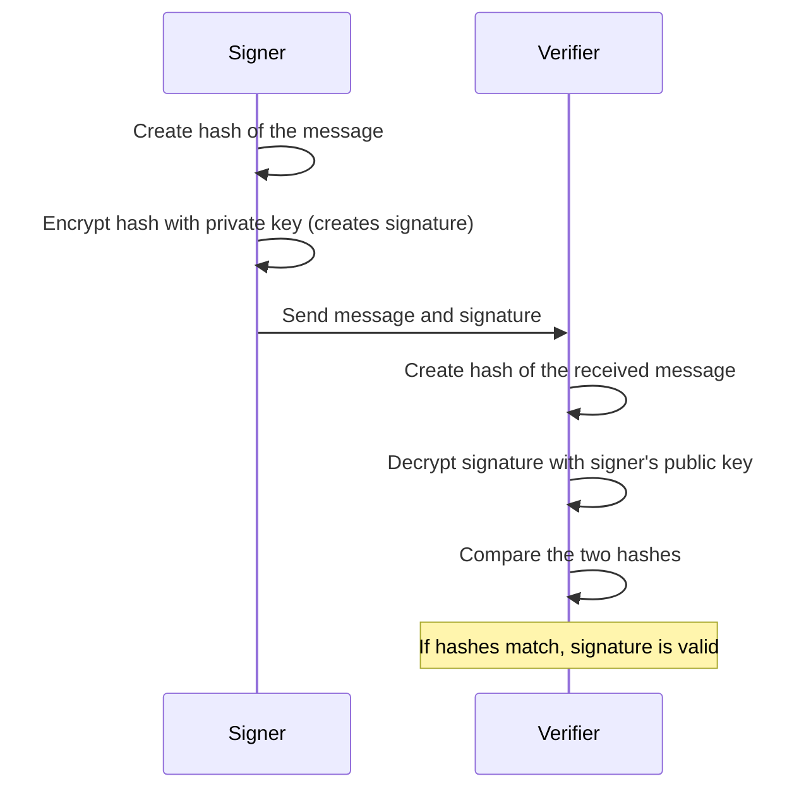

### Key Properties of Digital Signatures

1. **Authentication**: Verifies the source of a message
2. **Non-repudiation**: Signer cannot deny signing the message
3. **Integrity**: Detects any changes to the message after signing
4. **Binding**: Signature is bound to a specific document

### Digital Signature Algorithms

#### RSA Signatures

Uses the RSA algorithm for creating and verifying signatures:
- Sign by encrypting the message hash with the private key
- Verify by decrypting the signature with the public key and comparing to the message hash
- Widely deployed and well-understood

#### DSA (Digital Signature Algorithm)

A Federal Information Processing Standard for digital signatures:
- Based on the mathematical concept of modular exponentiation and discrete logarithms
- Cannot be used for encryption, only for signatures
- Generally faster than RSA for signature generation but slower for verification

#### ECDSA (Elliptic Curve Digital Signature Algorithm)

An elliptic curve variant of DSA:
- Provides the same level of security as RSA with much smaller keys
- Used in Bitcoin, Ethereum, and many other cryptocurrency systems
- Better performance on constrained devices

#### EdDSA (Edwards-Curve Digital Signature Algorithm)

A modern digital signature scheme using twisted Edwards curves:
- Ed25519 and Ed448 are specific implementations
- High security and performance
- Resistant to many side-channel attacks
- Used in modern protocols like TLS 1.3

### Digital Signature Applications

#### Code Signing

Developers sign their code to verify its authenticity:
- Operating systems can verify the source of drivers and applications
- Users can trust that software comes from the claimed developer
- Prevents malware from masquerading as legitimate software

#### Email Signing

Ensures email authenticity and integrity:
- S/MIME and PGP are common email signing standards
- Recipients can verify the sender's identity
- Detects if the email was modified in transit

#### Document Signing

Provides legally binding signatures for digital documents:
- PDF documents can include digital signatures
- Many countries recognize digital signatures as legally equivalent to handwritten signatures
- Enables paperless workflows for contracts and legal documents

#### SSL/TLS Certificates

Web servers use digital signatures as part of their certificates:
- Browsers verify the certificate's signature to authenticate the website
- Protects against man-in-the-middle attacks
- Foundation of HTTPS security

## Public Key Infrastructure (PKI)

Public Key Infrastructure (PKI) is a framework of roles, policies, hardware, software, and procedures needed to create, manage, distribute, use, store, and revoke digital certificates and manage public-key encryption.

### Components of PKI

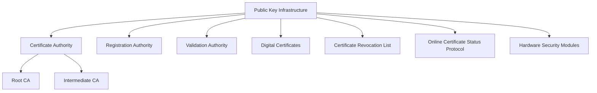

#### Certificate Authority (CA)

The CA is a trusted entity that issues digital certificates:
- **Root CAs**: The highest level of trust, self-signed certificates
- **Intermediate CAs**: Issued by Root CAs, issue end-entity certificates
- **Trust Anchors**: Root CA certificates that are inherently trusted by systems

**Well-known CAs:**
- DigiCert
- Let's Encrypt
- Sectigo (formerly Comodo)
- GlobalSign
- Entrust

#### Registration Authority (RA)

The RA verifies the identity of entities requesting certificates:
- Validates the requester's identity
- Processes certificate signing requests (CSRs)
- Forwards approved requests to the CA

#### Digital Certificates

Digital certificates bind a public key to an identity:

**X.509 Certificate Structure:**
- Version
- Serial Number
- Signature Algorithm ID
- Issuer Name
- Validity Period
- Subject Name
- Subject Public Key Info
- Extensions
- Certificate Signature

**Certificate Types:**
- **SSL/TLS Server Certificates**: For websites and servers
- **Client Certificates**: For authenticating users or devices
- **Code Signing Certificates**: For software publishers
- **Email Certificates**: For secure email (S/MIME)
- **Root Certificates**: Self-signed certificates for CAs

#### Certificate Lifecycle Management

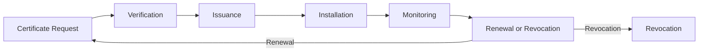

1. **Certificate Request**: Generate key pair and create Certificate Signing Request (CSR)
2. **Verification**: Validate identity and CSR
3. **Issuance**: CA signs and issues the certificate
4. **Installation**: Install certificate on server/device
5. **Monitoring**: Track certificate expiration and status
6. **Renewal or Revocation**: Renew before expiration or revoke if compromised

#### Certificate Revocation

When a certificate needs to be invalidated before its expiration:

**Certificate Revocation List (CRL):**
- Periodically published list of revoked certificates
- Signed by the CA
- Contains serial numbers of revoked certificates
- Can become large and unwieldy

**Online Certificate Status Protocol (OCSP):**
- Real-time certificate validation
- Client queries the OCSP responder for a specific certificate's status
- More efficient than downloading entire CRLs
- "OCSP stapling" allows servers to include OCSP responses with certificates

**Reasons for Revocation:**
- Private key compromise
- CA compromise
- Change of affiliation
- Certificate superseded
- Cessation of operation

### PKI Trust Models

Different trust structures for certificate validation:

#### Hierarchical Trust Model

Most common model with a root CA at the top:
- Root CA issues certificates to intermediate CAs
- Intermediate CAs issue certificates to end entities
- Creates a chain of trust from end entity to root

#### Web of Trust

Decentralized trust model without formal CAs:
- Users sign each other's public keys
- Trust is established through a network of individual signatures
- Used in PGP/GPG encryption
- More flexible but less scalable than hierarchical model

#### Bridge CA Model

Connects multiple PKI domains:
- Bridge CA creates trust relationships between different PKI hierarchies
- Allows entities in different hierarchies to validate each other's certificates
- Used in large enterprises and government networks

### PKI in Practice

#### TLS Handshake with Certificate Validation

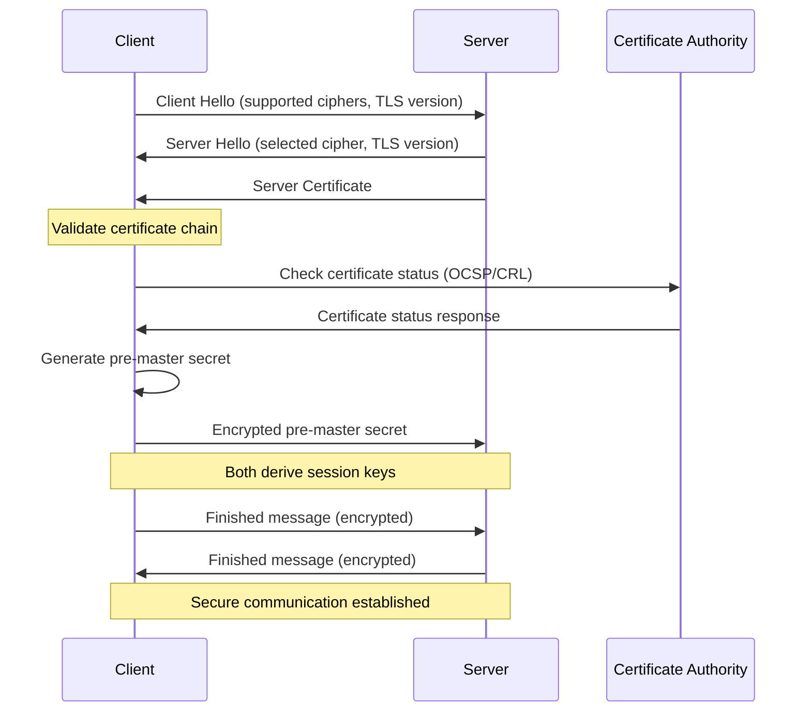

#### Common PKI Challenges

- **Certificate Management**: Tracking expirations and renewals
- **Private Key Protection**: Securing the most critical component
- **Trust Store Management**: Updating trusted root certificates
- **Revocation Checking**: Ensuring timely verification of certificate status
- **Cross-Border Issues**: Different legal requirements in different jurisdictions

## Authentication Mechanisms

Authentication verifies the identity of users, devices, or systems before granting access to resources.

### Authentication Factors

Authentication methods are categorized based on the type of factor used:

1. **Something You Know (Knowledge)**: Passwords, PINs, security questions
2. **Something You Have (Possession)**: Smart cards, security tokens, mobile devices
3. **Something You Are (Inherence)**: Biometrics (fingerprint, facial recognition, retina scan)
4. **Somewhere You Are (Location)**: Geolocation, network location
5. **Something You Do (Behavior)**: Typing patterns, gesture patterns, voice recognition

### Multi-Factor Authentication (MFA)

MFA requires two or more authentication factors:

**Benefits:**
- Significantly stronger security than single-factor authentication
- Protects against password-related vulnerabilities
- Mitigates risk of credential theft

**Common Implementations:**
- Password + SMS code
- Password + authenticator app
- Smart card + PIN
- Biometric + possession factor

### Password-Based Authentication

Despite known limitations, passwords remain the most common authentication method:

**Best Practices:**
- **Password Complexity**: Mix of uppercase, lowercase, numbers, and special characters
- **Length**: Minimum of 12-14 characters (longer is better)
- **Avoid Common Patterns**: No dictionary words, sequential numbers, or personal information
- **Password Managers**: Use to generate and store unique passwords
- **Password Rotation**: Periodic changes, but not too frequent (NIST no longer recommends)
- **Account Lockout**: Temporary lockout after multiple failed attempts

**Password Storage Security:**
- Never store in plaintext
- Use strong, slow hash functions (bcrypt, Argon2, PBKDF2)
- Implement salting and key stretching
- Consider pepper (server-side secret) for additional security

### Certificate-Based Authentication

Uses digital certificates to verify identity:

**Process:**
1. User or device presents their certificate
2. System validates the certificate (checks signature, expiration, revocation)
3. System challenges the client to prove possession of the private key
4. Client signs the challenge with their private key
5. System verifies the signature using the public key from the certificate

**Advantages:**
- Stronger than password-based authentication
- Resistant to phishing
- Can be combined with other factors
- Suitable for human and machine authentication

**Applications:**
- Client certificates in TLS
- Smart card authentication
- SSH with certificates
- VPN authentication

### Token-Based Authentication

Tokens are temporary credentials issued after initial authentication:

**Types of Tokens:**
- **Session Tokens**: Traditional server-side session identifiers
- **JWT (JSON Web Tokens)**: Self-contained tokens with encoded claims
- **OAuth Tokens**: Access and refresh tokens for API authorization
- **SAML Assertions**: XML-based tokens used in enterprise environments

**JWT Structure:**
- **Header**: Algorithm and token type
- **Payload**: Claims (statements about the entity and additional data)
- **Signature**: Ensures integrity and authenticity

**Example JWT Flow:**
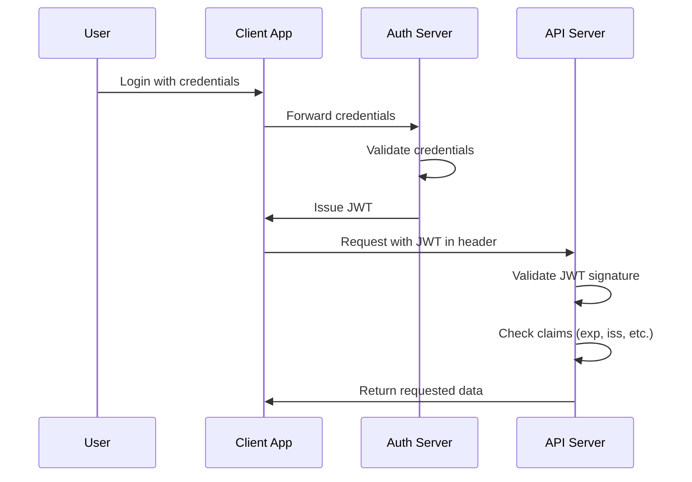

### Biometric Authentication

Uses physical or behavioral characteristics for identification:

**Common Biometrics:**
- Fingerprint recognition
- Facial recognition
- Iris/retina scanning
- Voice recognition
- Behavioral biometrics (typing patterns, gait analysis)

**Considerations:**
- **False Acceptance Rate (FAR)**: How often unauthorized users are accepted
- **False Rejection Rate (FRR)**: How often authorized users are rejected
- **Equal Error Rate (EER)**: Point where FAR equals FRR
- **Template Storage**: Secure storage of biometric templates
- **Liveness Detection**: Preventing spoofing with photos or recordings

### Single Sign-On (SSO)

Allows users to authenticate once and access multiple applications:

**SSO Protocols:**
- **SAML (Security Assertion Markup Language)**: XML-based protocol
- **OAuth 2.0**: Authorization framework (often used with OpenID Connect)
- **OpenID Connect**: Authentication layer on top of OAuth 2.0
- **Kerberos**: Network authentication protocol using tickets

**Benefits:**
- Improved user experience (fewer logins)
- Centralized authentication management
- Consistent security policies
- Reduced password fatigue

**Enterprise SSO Example (SAML):**
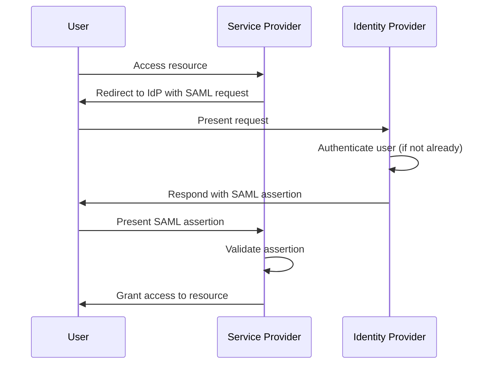

### Zero Trust Authentication

Modern approach that eliminates implicit trust:

**Principles:**
- "Never trust, always verify"
- Continuous authentication and authorization
- Least privilege access
- Micro-segmentation
- Device health verification

**Components:**
- Strong identity verification
- Device trust assessment
- Just-in-time and just-enough access
- Continuous monitoring and risk assessment
- Explicit per-request verification

### Challenges and Considerations

**Security vs. Usability Tradeoffs:**
- More secure methods often create more friction
- Balance needed between protection and usability
- Context-aware authentication can help (adaptive authentication)

**Authentication for Different Entities:**
- **Human Authentication**: Passwords, biometrics, smart cards
- **Machine Authentication**: API keys, certificates, mutual TLS
- **Service Authentication**: Service accounts, managed identities

**Emerging Authentication Technologies:**
- **Passwordless Authentication**: FIDO2/WebAuthn, magic links
- **Continuous Authentication**: Behavior-based, risk-based
- **Decentralized Identity**: Self-sovereign identity using blockchain
